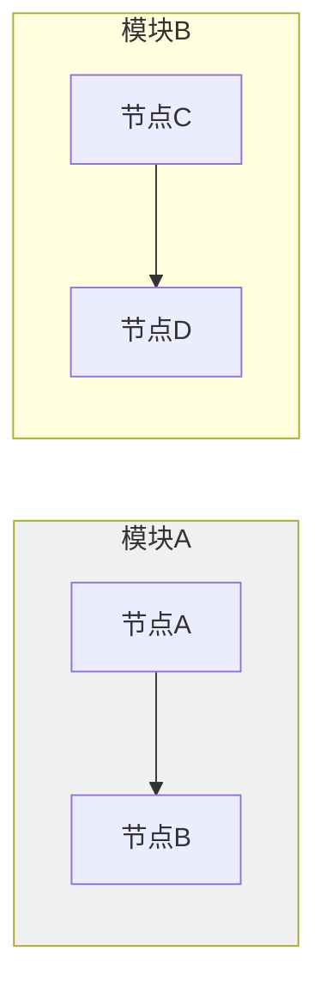
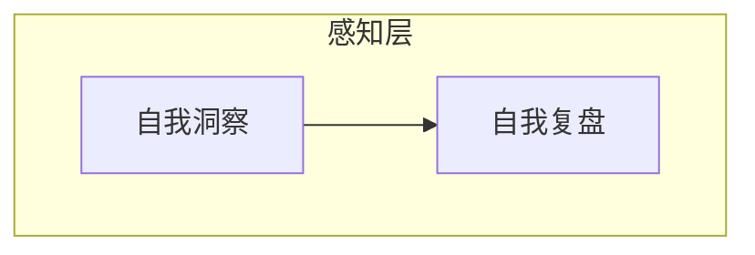
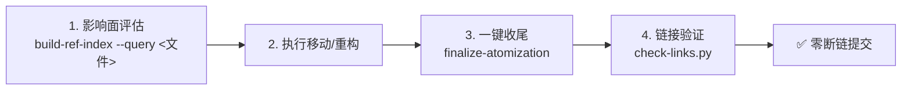

# 开发规范

> **来源**：从 `README.md` "开发规范"章节拆分

## 代码风格

- 遵循现有代码风格，不引入与项目不一致的新风格。
- 命名、缩进、注释、文件组织均以仓库内既有约定为准。
- 新增依赖前先评估必要性，优先复用现有工具链。

## 脚本开发规范

`.agents/scripts/` 下的验证与自动化脚本遵循以下约定：

1. **先查共享库**：新增脚本前先查阅 [lib/README.md](file:///d:/spaces/SpecWeave/.agents/scripts/lib/README.md)，确认 `lib/` 下是否已有可复用的函数
2. **禁止重复实现**：如 `lib/` 中已有对应功能（路径解析、frontmatter 解析、CLI 输出、Markdown 处理、链接修复、模式扫描等），必须使用共享函数，不得自行重写
3. **新增共享函数**：如确需新功能且具有跨脚本复用价值，应先提取到 `lib/` 对应模块中再引用
4. **通用参数**：使用 `lib.cli.add_common_args(parser)` 注册通用参数（`--path`、`--json`），不要重复定义
5. **输出规范**：使用 `lib.cli` 的 `print_pass`/`print_warn`/`print_error`/`print_summary` 输出检查结果，禁止使用 Unicode 特殊符号（✓⚠✗）避免 Windows GBK 编码问题
6. **脚本头部**：脚本开头需添加 sys.path 设置以确保 `lib/` 可导入：
   ```python
   import sys
   from pathlib import Path
   SCRIPTS_DIR = Path(__file__).resolve().parent
   if str(SCRIPTS_DIR) not in sys.path:
       sys.path.insert(0, str(SCRIPTS_DIR))
   ```
7. **重复检测**：脚本开发完成后运行 `python check-duplication.py`，确保未引入新的跨文件重复代码

## 提交规范

遵循 [Conventional Commits](https://conventionalcommits.org) 规范，格式为 `type(scope): subject`：

| 类型 | 用途 |
|---|---|
| `feat` | 新功能 |
| `fix` | 缺陷修复 |
| `refactor` | 代码重构（不改变行为） |
| `test` | 测试相关 |
| `docs` | 文档变更 |
| `chore` | 构建、工具、依赖等杂项 |
| `perf` | 性能优化 |

提交信息主体使用中文描述，简明扼要说明"为什么"而非仅"做了什么"。

## 测试要求

- 每个模块必须有对应的单元测试，覆盖核心逻辑与边界条件。
- 整体测试覆盖率不低于 **80%**，关键模块不低于 **90%**。
- 所有测试用例通过，无新增失败用例与回归问题。

## 文档边界

- `README.md` 面向**人类读者**，介绍项目用途、安装、使用与贡献方式。
- `AGENTS.md` 与 `.agents/` 面向 **AI 智能体**，存放机器可读规范。
- 两者职责分离，不相互混用。

## Markdown 表格修改

- **整表替换优先**：涉及表格行数或列数变化时，必须替换整张表格（从表头到表尾），禁止局部插入或删除行。
- **局部替换仅限文本修改**：仅修改单元格文本内容（不改变表格结构）时，可使用局部替换匹配目标行。
- **分隔符同步原则**：表格列分隔符 `|---|---|` 的列数必须与表头一致，任何列数变化都须同步更新分隔符行。

## Mermaid 编码规范

所有 Mermaid 图表须遵循以下安全编码规则，避免渲染失败：

### 禁止空行

Mermaid 代码块内**禁止使用空行**。`subgraph` 块之间、边定义与 `style` 语句之间的空行会导致解析器误判图表结束，引发渲染失败。



### 文本引号原则

非纯英文单词的节点标签、边标签一律用**双引号**包裹：

| 场景 | 错误写法 | 正确写法 |
|------|---------|---------|
| 含中文 | `A[启动协议]` | `A["启动协议"]` |
| 含特殊字符（@、#等） | `-->|@role| B` | `-->|"@role"| B` |
| 中文边标签 | `-->|数据流向| B` | `-->|"数据流向"| B` |
| 纯英文标识符 | `A[start]` | `A[start]`（可省略引号） |

### 禁止 Markdown 列表触发格式

Mermaid 节点/边标签内置 Markdown 解析器，双引号**不能阻止**内部 Markdown 解析。以下格式会被误识别为列表，导致 "Unsupported markdown: list" 错误：

| 触发模式 | 错误示例 | 正确写法 | 说明 |
|---------|---------|---------|------|
| 数字+英文句点+空格 | `A["1. 启动协议"]` | `A["1：启动协议"]` | 改为中文冒号 |
| 短横线+空格（无序列表） | `A["- 列表项"]` | `A["-列表项"]`（去掉空格）或 `A["·列表项"]` | 避免 `- ` 开头 |

> **关键认知**：`["1. 启动协议"]` 中的双引号仅保证 Mermaid 语法层解析正确，引号内的文本仍会经过 Markdown 渲染器处理。必须从内容层面避免 Markdown 列表语法。

### Subgraph 格式

Subgraph 统一使用 `subgraph ID ["标题文本"]` 格式：

- ID 必须为英文标识符（字母开头，不含中文/全角字符/全角冒号）
- 中文/含特殊字符的标题放在双引号内
- ID 与方括号之间有一个空格



### 边标签格式

带标签的边使用 `-->|"标签"|目标节点` 格式：

- 标签放在 `||` 内，与箭头之间无空格
- 含中文/特殊字符的标签必须双引号包裹
- 纯英文标识符标签可省略引号

### 错误排查分层法

修复 Mermaid 渲染错误按以下顺序逐层排查：

1. **语法结构层**：检查括号/引号是否闭合、有无空行
2. **Subgraph 层**：检查 ID 是否合法、标题格式是否正确
3. **节点文本层**：检查是否触发 Markdown 解析（`数字. `、`- `、`**` 等）
4. **边标签层**：检查特殊字符是否加引号
5. **Style 层**：检查颜色值、样式语法是否正确

> **经验教训**：Mermaid 渲染错误存在分层屏蔽效应——结构层错误会阻止解析器到达内容层，修复结构错误后内容层错误才会暴露，因此修复可能需要多轮迭代。不同渲染器（GitHub/飞书/VS Code）对 Mermaid 容错度不同，应遵循最严格的语法规范。

## 派生产物溯源约定

从其他文档（如 `README.md`、spec 文档）派生出的结构化产物，须在 TOML frontmatter 携带 `source` 字段标注信息来源，建立"提取物→源头"的可追溯链路。

- **字段格式**：`source = "<文件路径>#<章节锚点>"`
- **示例**：`source = "README.md#自我迭代机制"`
- **适用范围**：一切从源文档提取并独立归档的结构化定义文件（如 `.agents/modules/` 下的自我演进模块定义）。
- **价值**：源头文档变更时，可程序化定位受影响的派生产物，避免信息失同步。

## Spec 文档路径引用规范

spec 文档位于 `.trae/specs/<change-id>/` 三级嵌套目录下，路径引用存在两类系统性风险："层级陷阱"（相对路径层级计算错误）与"前缀缺失"（未添加项目根目录前缀）。为消除这两类风险，所有 spec 文档的路径引用须遵循以下规范：

### 规则 1：引用项目根目录文件使用三级回退

spec 文档位于 `.trae/specs/<change-id>/spec.md`，引用项目根目录下的文件时，必须使用三级 `../../../` 回退至项目根目录。

| 错误写法 | 正确写法 | 说明 |
|---------|---------|------|
| `AGENTS.md` → `../../AGENTS.md` | `AGENTS.md` → `../../../AGENTS.md` | 两级回退仅到 `.trae/`，无法到达项目根 |
| `README.md` → `../../README.md` | `README.md` → `../../../README.md` | 同上 |
| `.agents/README.md` → `../../.agents/README.md` | `.agents/README.md` → `../../../.agents/README.md` | 同上 |

### 规则 2：引用 `.agents/` 下文件使用完整前缀

在 spec 文档的描述性文本中引用 `.agents/` 目录下的文件时，必须使用完整路径前缀 `.agents/`，确保 `check-spec-consistency.py` 的 `resolve_path` 函数能正确按项目根目录解析。

| 错误写法 | 正确写法 | 说明 |
|---------|---------|------|
| `` `worlds/README.md` `` | `` `.agents/worlds/README.md` `` | 缺少 `.agents/` 前缀，被误解析为 spec 目录相对路径 |
| `` `teams/permission-system.md` `` | `` `.agents/teams/permission-system.md` `` | 同上 |
| `` `protocols/conflict-resolution.md` `` | `` `.agents/protocols/conflict-resolution.md` `` | 同上 |

### 规则 3：引用同目录 spec 使用单级回退

引用 `.trae/specs/` 下其他 spec 文档时，使用单级 `../` 回退至 `specs/` 目录。

| 正确写法 | 说明 |
|---------|------|
| `create-agents-md-and-config` → `../create-agents-md-and-config/spec.md` | 单级回退至 `specs/`，再进入目标 spec 目录 |

### 验证方式

- **链接有效性**：运行 `python .agents/scripts/check-links.py`，退出码为 0 表示所有本地链接有效
- **spec 一致性**：运行 `python .agents/scripts/check-spec-consistency.py`，交叉引用有效性错误数为 0 表示路径前缀正确

## Markdown 文档交叉引用规范

所有 Markdown 文档中的跨文件链接**必须使用相对路径**，禁止使用 `file:///` 开头的本地绝对路径。绝对路径在不同机器、不同克隆位置会立即失效，导致文档断链。

### 链接格式

```markdown
[可读名称]({相对路径}#L{起始行}-L{结束行})
```

### 路径规则

| 引用场景 | 路径写法 | 示例路径 |
|---------|---------|---------|
| 同文件内引用 | 省略文件名，锚点以 `#L` 开头 | `#L1364-L1487` |
| 同目录文件互引 | 直接写文件名 | `spec.md#L245-L263` |
| 上级目录文件 | 用 `../` 逐级回退（每级回退一层） | `../../index.html#L710-L751` |
| 子目录文件 | 写出子目录路径 | `.agents/roles/architect.md` |

**链接文本**应使用描述性短语（如"洞察53""spec §5.2""HTML 原型"），便于读者理解引用内容。

### 禁止事项

- ❌ **禁止**使用 `file:///d:/...` 等本地绝对路径（在不同机器/克隆位置会立即断链）
- ❌ **禁止**在代码示例模板中使用真实文件路径（使用 `{占位符}` 语法，避免链接检查器误判）
- ✅ **建议**行号引用精确到行范围（`#L起始-L结束`），便于定位上下文

### 验证方式

提交前运行链接校验脚本，确保所有引用有效：

```bash
python .agents/scripts/check-links.py --path <目标目录>
```

退出码为 0 表示所有本地链接均有效。脚本会扫描 Markdown 文件中的内联链接，检查目标文件是否存在。

> **经验教训**：从其他环境迁移文档时，务必全局搜索 `file:///` 前缀将所有绝对路径替换为相对路径。详见竹简悟道归档复盘报告中"旧路径断链修复"相关记录。

## 文档重构与原子化操作规范

> **来源**：从链接修复深度调整复盘萃取的治理原则，对应模式库 [toolchain-maturity.md](retrospective/patterns/methodology-patterns/tools-automation/toolchain-maturity.md)、[dry-run-first.md](retrospective/patterns/methodology-patterns/tools-automation/dry-run-first.md)

### 链接衰变四条规律

目录重构时，Markdown 相对链接的稳定性遵循以下可预测规律，用于事前风险评估：

| 规律 | 描述 | 风险等级 |
|------|------|---------|
| 下移断链多 | 文件向更深目录移动（如 `a.md` → `sub/a.md`），所有引用该文件的链接`../`层数不足，断链率最高 | 🔴 高 |
| 上移影响小 | 文件向更浅目录移动（如 `sub/a.md` → `a.md`），原有相对路径多走一级`..`仍可能到达目标，断链率较低 | 🟡 中 |
| 跨目录最脆弱 | 跨目录移动（如 `dir1/a.md` → `dir2/a.md`），相对路径方向完全改变，断链率接近100% | 🔴 高 |
| 同目录最稳定 | 同目录内文件互引（直接写文件名），不涉及`../`层级变化，不受文件移动影响 | 🟢 低 |

> **行动指南**：下移和跨目录移动前必须使用 `build-ref-index.py` 评估影响面；上移操作后仍需运行 `check-links.py` 验证。

### 文档移动标准工作流

任何文件移动/重命名/目录重构操作必须遵循四步闭环工作流，禁止裸操作：



1. **操作前**：运行 `python .agents/scripts/build-ref-index.py --query <目标文件或目录>`，查询所有引用方，评估影响范围
2. **执行操作**：使用 `Move-Item` 或 Git 命令执行文件移动，不要手动修改链接
3. **操作后**：运行 `python .agents/scripts/finalize-atomization.py`，自动完成断链修复、导航更新、看板刷新
4. **最终验证**：运行 `python .agents/scripts/check-links.py`，确认零断链后方可提交

### Dry-Run 安全修改原则

所有支持自动修改的工具脚本（`check-links --fix`、`finalize-atomization`、`check-move` 等）必须遵循 dry-run 优先原则：

- **首次运行必须加 `--dry-run`**：预览将要执行的所有修改，确认无误后再去掉参数执行真实修改
- **零误报验证**：在确认所有链接正确的状态下运行 `--fix --dry-run`，应输出"无需要修改"，证明工具不会误改正确内容
- **禁止跳过预览**：任何自动化批量修改禁止直接执行不带 dry-run 的修复命令

### 原子化操作收尾

文档原子化拆分或文件移动完成后，必须执行以下收尾步骤（`finalize-atomization.py` 自动完成）：

1. **断链修复**：自动调整相对路径`../`层级，修复因目录变化导致的断链
2. **导航更新**：重新生成 `.agents/` 各目录 README 导航表
3. **看板刷新**：更新 `.trae/specs/README.md` 执行进度看板
4. **溯源验证**：运行 `check-source-traceability.py` 确保派生产物 source 字段有效

### 外部链接缓存策略

定期检查类工具访问外部资源时，必须内置缓存机制：

- 默认缓存有效期：7天（外部链接检查结果）
- 支持 `--no-cache` 强制重新检查
- 支持 `--cache-ttl <天数>` 自定义缓存时长
- 支持 `--clear-cache` 手动清除缓存
- 二次运行耗时应从 10-20 秒降至 <1 秒

> **关联模块**：
> - `../README.md`
> - `../AGENTS.md`
> - `../CONTRIBUTING.md`