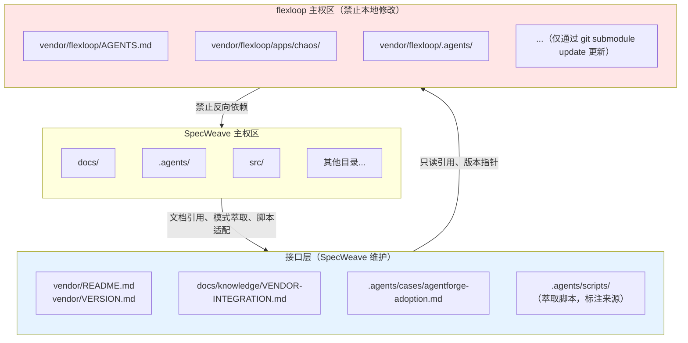

+++
id = "vendor-integration"
category = "operations"
source = "AGENTS.md#临时依赖管理"
+++

# flexloop (AgentForge) 子模块协同规范

本文档定义 SpecWeave 与通过 git submodule 引入的 flexloop (AgentForge) 项目之间的边界划分、交互接口、版本管理与操作规范。

## 第1章 概述

flexloop（对外品牌名 AgentForge）是一个 AI Agent 协作基础设施项目，提供角色体系、协作协议、自我演进模块、验证脚本等完整的智能体协作框架实现。

采用 git submodule 方式引入的原因：
- **保持项目独立性**：flexloop 是一个完整的独立 Git 仓库，有自己的版本历史、issue 跟踪和发布节奏
- **版本可追溯**：通过 gitlink 精确锁定到具体 commit，确保构建可重现
- **避免源码合并**：不将第三方源码直接合入主仓库，保持主仓库整洁

两个项目的关系：
- SpecWeave 是元规范框架，定义角色、协议、工作流、验证体系等抽象规范
- flexloop/AgentForge 是 SpecWeave 规范体系的落地参考实现，同时也是超集扩展（包含更多工程化能力）
- 两者是"规范-实现"关系，SpecWeave 提供抽象定义，flexloop 提供可运行的工程化参考

依赖方向：严格单向 SpecWeave → flexloop。SpecWeave 可以引用、参考、萃取 flexloop 的内容，但 flexloop 对 SpecWeave 无任何依赖。

## 第2章 快速入门

克隆仓库后初始化子模块：

```bash
git submodule update --init vendor/flexloop
```

检查子模块当前状态：

```bash
git submodule status vendor/flexloop
```

基本目录结构：

```
SpecWeave/
├── vendor/
│   ├── README.md              # SpecWeave 维护的 vendor 元数据总览
│   ├── VERSION.md             # SpecWeave 维护的版本清单（含锁定 commit）
│   └── flexloop/              # git submodule（flexloop 主权区，禁止本地修改）
│       ├── .git/              # submodule 独立 Git 仓库
│       ├── AGENTS.md          # flexloop 自身的智能体入口
│       ├── apps/chaos/        # flexloop 主应用目录（含 uv 环境和测试）
│       └── ...
├── docs/knowledge/
│   └── VENDOR-INTEGRATION.md  # 本文档（协同规范）
└── .agents/
    ├── cases/
    │   └── agentforge-adoption.md  # AgentForge 案例引用
    └── scripts/               # 从 flexloop 萃取的脚本（标注来源）
```

## 第3章 边界划分原则

项目空间划分为三个区域，各区域有明确的主权和操作规则：

**SpecWeave 主权区**：除 `vendor/` 外的所有目录。SpecWeave 完全控制，可以自由创建、修改、删除文件。

**flexloop 主权区**：`vendor/flexloop/` 下所有内容（.git 追踪的 submodule 内容）。仅通过 `git submodule update` 更新版本，**绝对禁止在本地创建、修改、删除任何文件**。任何定制需求都应通过模式萃取到 SpecWeave 主权区，或向上游 flexloop 贡献。

**接口层**：位于 SpecWeave 主权区内，用于管理与 flexloop 的交互，包含：
- `vendor/README.md` 和 `vendor/VERSION.md`：SpecWeave 维护，记录元数据和版本锁定信息
- `docs/knowledge/VENDOR-INTEGRATION.md`：本文档，协同操作规范
- `.agents/cases/agentforge-adoption.md`：案例文档，对照说明复用模式
- `.agents/scripts/` 中从 flexloop 萃取并适配的脚本（在文件中标注来源）



## 第4章 交互接口规范

与 flexloop 的交互有四种标准方式，每种方式均有明确的正例和反例。

### 4.1 文档引用

✅ **正确做法**：
- 使用相对路径引用 SpecWeave 内部文档：`[AgentForge案例](../../.agents/cases/agentforge-adoption.md)`
- 使用相对路径引用 flexloop 内文档（只读参考）：`[flexloop Python 规则](../../vendor/flexloop/apps/chaos/.agents/rules/python.md)`
- 链接文本使用描述性名称，便于读者理解

❌ **错误做法**：
- 使用本地绝对路径：`file:///d:/spaces/SpecWeave/vendor/flexloop/...`（在不同机器/克隆位置会断链）
- 在 flexloop 的 Markdown 文件中添加指向 SpecWeave 的链接（形成反向依赖，破坏单向依赖原则）
- 将 flexloop 文档复制到 SpecWeave 后不标注来源（信息失同步风险）

### 4.2 脚本复用（萃取）

✅ **正确做法**：
- 将 flexloop 中有普遍价值的脚本**复制**到 `.agents/scripts/`
- 适配 SpecWeave 代码风格、命名规范、路径处理、导入方式
- 使用 `.agents/scripts/lib/` 共享库，不重复实现已有功能
- 在文件头部注释标注来源：`# Source: vendor/flexloop/apps/chaos/.agents/scripts/xxx.py`
- 在 TOML frontmatter 使用 `source = "vendor/flexloop/apps/chaos/.agents/scripts/xxx.py"`
- 为萃取后的代码编写测试用例，验证在 SpecWeave 环境中正常工作

❌ **错误做法**：
- 直接 import vendor/flexloop/ 内的 Python 模块
- 通过 `sys.path.insert` 添加 vendor 路径到 Python 模块搜索路径
- 直接调用 vendor/ 内脚本执行（应 cd 到对应目录，使用 flexloop 自有环境）
- 复制脚本后不做适配，保留 flexloop 特有的路径和导入

### 4.3 模式参考

✅ **正确做法**：
- 通过案例文档（如 [agentforge-adoption.md](../../.agents/cases/agentforge-adoption.md)）对照说明模式差异
- 保持两套规则体系各自独立，不要求对方遵循己方规范
- 在 SpecWeave 文档中说明"flexloop 是如何实现的"作为参考

❌ **错误做法**：
- 直接复制 flexloop 的规则文件到 `.agents/rules/` 不做适配
- 要求 flexloop 遵循 SpecWeave 规范（两个项目独立演进）
- 将 flexloop 的特定实现作为 SpecWeave 的强制标准

### 4.4 禁止行为清单

以下行为严格禁止：

- ❌ 在 `vendor/flexloop/` 内创建任何新文件或修改已有文件
- ❌ 将 `vendor/` 路径加入 sys.path 或 PYTHONPATH 环境变量
- ❌ 在主项目测试中遍历或收集 vendor/ 下的测试用例
- ❌ 将 flexloop 作为 pip 包安装到主项目 .venv 虚拟环境
- ❌ 在 SpecWeave 的 CI 流水线中运行 flexloop 的测试套件
- ❌ 提交 vendor/flexloop/ 内的 modified content 到主仓库

## 第5章 版本控制策略

**锁定策略**：默认**固定在已验证的 commit 上**，不跟踪上游分支。不使用 `git submodule update --remote` 自动拉取最新版本，避免未经审核的变更进入。

**版本标识格式**：使用上游 tag + commit 短哈希的组合格式，便于人类阅读和精确追溯：
- 格式：`v0.7.1-270-gd618849 (d618849a)`
- 含义：tag v0.7.1 之后第 270 个 commit，短哈希 gd618849，完整哈希前缀 d618849a

**当前锁定版本**：
- 完整 commit：`d618849a0742772dd9d4ffb472c3e1f7e7f3ab4e`
- 版本标识：`v0.7.1-270-gd618849 (d618849a)`
- 记录位置：[vendor/VERSION.md](../../vendor/VERSION.md)

**更新频率**：按需更新，不做定期自动更新。触发更新的场景：
- 发现 flexloop 有需要的新特性
- 发现 flexloop 有重要的 Bug 修复
- 需要参考 flexloop 的最新实现模式

**兼容性评估**：更新前必须查看 flexloop 的 `CHANGELOG.md`，检查：
- 是否有破坏性变更（Breaking Changes）
- 目录结构是否发生变化（影响文档引用路径）
- 脚本接口是否变更（影响萃取脚本的兼容性）

**回滚机制**：
- 快速回滚：`git submodule update vendor/flexloop` 恢复到 VERSION.md 中记录的 commit
- 指定版本回滚：`git checkout <prev-commit> vendor/flexloop`
- 回滚后必须重新验证关键引用和萃取脚本的正确性

## 第6章 子模块更新流程

子模块更新必须严格遵循以下 4 步法，确保过程可控、可追溯、可回滚。

### 步骤1：更新前检查

确认工作树清洁，记录当前版本：

```bash
git status
git submodule status vendor/flexloop
```

如有未提交的变更，先处理完毕再开始更新。

### 步骤2：执行更新

进入子模块目录，拉取并切换到目标版本：

```bash
cd vendor/flexloop
git fetch
git checkout <target-commit/tag>
cd ../..
```

如果需要检查远程最新版本（谨慎使用），可以使用：

```bash
git submodule update --remote vendor/flexloop
```

注意：`--remote` 会拉取上游跟踪分支的最新 commit，必须经过兼容性评估和验证后才能提交。

### 步骤3：更新后验证

完成版本切换后，执行以下验证：

1. 更新 [vendor/VERSION.md](../../vendor/VERSION.md) 中的版本号和 commit 哈希
2. 检查文档引用：验证所有指向 vendor/flexloop/ 的相对路径是否仍然有效
3. 检查萃取脚本：确认从 flexloop 萃取的脚本与新版本兼容
4. 人工抽查：对照 flexloop CHANGELOG，抽查关键功能和目录结构

### 步骤4：提交更新

将子模块指针变更和版本元数据一并提交：

```bash
git add vendor/flexloop vendor/VERSION.md
git commit -m "chore(vendor): update flexloop to <version>"
```

提交信息应清晰说明更新到的版本号和更新原因。

## 第7章 测试环境隔离

两个项目的测试环境必须完全隔离，禁止交叉污染。

**Python 环境**：
- SpecWeave 使用根目录 `.venv/` 虚拟环境
- flexloop 使用 `vendor/flexloop/apps/chaos/` 下的 uv 环境
- 初始化 flexloop 环境：`cd vendor/flexloop/apps/chaos && uv sync`

**pytest 配置**：
- SpecWeave 的 pytest 必须排除 vendor/ 目录，在 pytest.ini 或 pyproject.toml 中配置：
  ```ini
  norecursedirs = vendor .temp .venv
  ```
- 确保测试收集器不会遍历 vendor/ 下的测试文件

**独立运行 flexloop 测试**：

```bash
cd vendor/flexloop/apps/chaos
uv run pytest
```

必须在 flexloop 自己的目录和环境中运行其测试，不要在 SpecWeave 根目录调用。

**测试数据隔离**：
- 两个项目的测试数据、fixture、临时文件完全隔离
- SpecWeave 测试不访问 vendor/flexloop/ 下的任何测试数据
- flexloop 测试也不访问 SpecWeave 的文件

## 第8章 模式萃取与同步

从 flexloop 中萃取有价值的模式和脚本到 SpecWeave，需遵循以下 6 步流程：

### 萃取流程

1. **评估通用性**：判断该模式/脚本是否仅适用于 flexloop 特定场景？是否对 SpecWeave 有普遍价值？仅萃取有跨项目复用价值的内容。

2. **阅读理解**：完整阅读原始实现，理解其依赖关系、前置假设、输入输出约定、边界条件处理。

3. **适配改写**：
   - 调整命名规范以符合 SpecWeave 风格
   - 修改路径处理，使用 `.agents/scripts/lib/` 中的共享路径工具
   - 调整导入语句，使用 SpecWeave 的共享库
   - 调整输出格式，遵循 `lib.cli` 的输出规范
   - 移除 flexloop 特有的约束和依赖

4. **来源标注**：
   - 在 Python 脚本头部添加注释：`# Source: vendor/flexloop/apps/chaos/.agents/scripts/xxx.py`
   - 在 TOML frontmatter 中添加：`source = "vendor/flexloop/apps/chaos/.agents/scripts/xxx.py"`
   - 如有重大适配修改，简要说明适配内容

5. **测试验证**：
   - 为萃取后的代码编写适配 SpecWeave 环境的测试用例
   - 运行测试验证在 SpecWeave 环境中正常工作
   - 边界条件测试，确保不依赖 flexloop 特有路径

6. **登记更新**：
   - 更新相关索引文件（如 `.agents/scripts/README.md`）
   - 如适用，更新 [agentforge-adoption.md](../../.agents/cases/agentforge-adoption.md) 案例文档
   - 运行 `python .agents/scripts/check-duplication.py` 确认未引入重复代码

### 回流建议

SpecWeave 的创新改进若同样适用于 flexloop：
- 通过向 gitcode.com:flexloop/flexloop 提交 PR 或 issue 的方式反馈
- 提供清晰的问题描述、改进方案和代码示例
- **绝不**在 vendor/flexloop/ 内直接修改后提交到 SpecWeave 仓库

## 第9章 常见问题与故障排查

### Q: `git status` 显示 `modified: vendor/flexloop (modified content)`？

A: 说明有人在 submodule 工作树内做了本地修改（可能是意外操作、运行脚本生成文件、或编辑了文件）。

解决方案：
```bash
cd vendor/flexloop
git checkout .
git clean -fd
```

或者如果需要保留本地修改做参考，可以暂存：
```bash
cd vendor/flexloop
git stash
```

**重要**：确保不要提交 submodule 内的修改到主仓库。提交前必须确认 `git status vendor/flexloop` 不显示 modified content。

### Q: 克隆后 vendor/flexloop 是空目录？

A: Git 克隆默认不会自动初始化和检出 submodule 内容。需要手动初始化：

```bash
git submodule update --init vendor/flexloop
```

首次克隆完整命令（自动初始化所有 submodule）：

```bash
git clone --recurse-submodules <repository-url>
```

### Q: 更新 submodule 后出现冲突？

A: submodule 本身作为一个 gitlink 指针，不会产生传统的文件合并冲突。可能的冲突场景：

- 如果 `vendor/VERSION.md` 有冲突：手动解决冲突，确认 commit 哈希与实际 submodule 指针一致
- 如果 submodule 处于 detached HEAD 状态：
  ```bash
  cd vendor/flexloop
  git checkout <expected-commit>
  ```

冲突解决后运行 `git submodule status` 确认指针正确。

### Q: 想直接运行 flexloop 的某个脚本？

A: 必须 cd 到 vendor/flexloop 对应目录，使用其自有环境运行：

```bash
cd vendor/flexloop/apps/chaos
uv run python .agents/scripts/check_gitignore.py
```

不要在 SpecWeave 根目录直接调用 vendor/ 内的脚本，避免路径和环境污染。

### Q: CI 中需要 submodule 吗？

A: 默认的 CI 检查不需要 flexloop 代码（因为 SpecWeave 不直接 import 其模块）。

如果 CI 任务确实需要涉及 vendor 的检查（如链接有效性检查引用了 flexloop 文档），需在 CI 脚本中添加：

```bash
git submodule update --init
```

## 第10章 快速检查清单

执行任何与 vendor/flexloop 相关的操作前，快速过一遍以下检查项：

- [ ] 我是否在 vendor/flexloop/ 内创建/修改/删除了文件？（不应如此）
- [ ] 我是否直接 import 了 vendor/ 内的 Python 模块？（不应如此）
- [ ] 我是否将 vendor/ 路径加入了 sys.path 或 PYTHONPATH？（不应如此）
- [ ] 更新 submodule 后，我是否同步更新了 vendor/VERSION.md 中的 commit 记录？
- [ ] `git status vendor/flexloop` 是否显示 clean（无 modified content）？
- [ ] 所有 Markdown 文档引用是否使用相对路径（无 file:/// 绝对路径）？
- [ ] 萃取的脚本是否标注了 source 来源？
- [ ] 我是否在 SpecWeave 环境而非 flexloop 环境中运行了 flexloop 测试？（不应如此）

全部确认无误后再进行提交。
