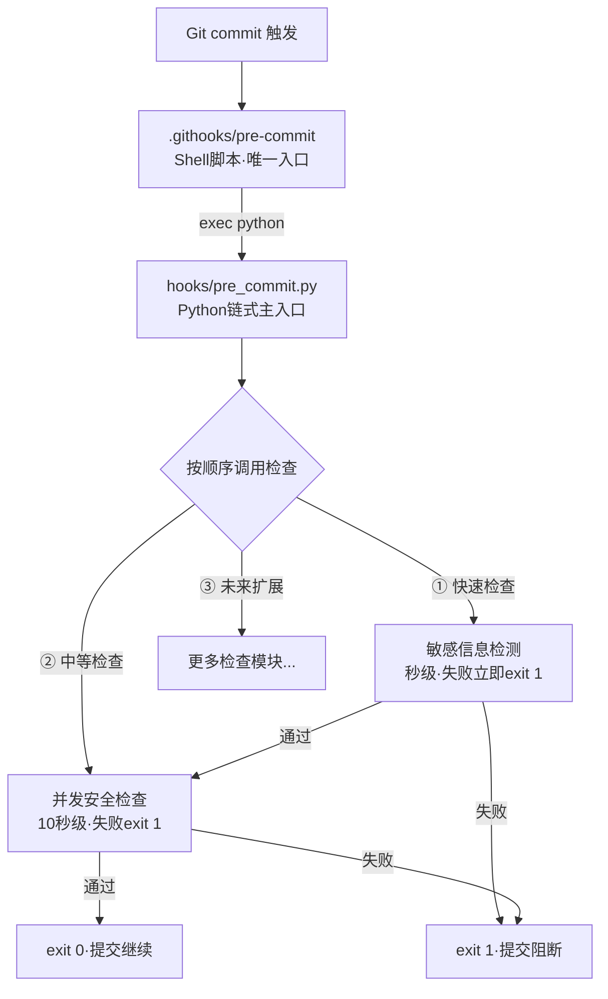

# 链式pre-commit钩子架构实践指南

> **验证状态**：已在2个独立检查任务中验证（敏感信息检测+并发安全检查）
> **适用场景**：需要多个pre-commit检查、跨平台支持（Windows/macOS/Linux）的团队项目

---

## 为什么需要链式架构？

Git pre-commit钩子有三种常见组织方式，各有问题：

| 方案 | 问题 |
|------|------|
| 多独立钩子文件（pre-commit框架模式） | 每个钩子需要独立的shell/cmd包装器，跨平台维护成本高；检查顺序按文件名排序，不可控 |
| 单Shell脚本堆砌 | 所有逻辑写在shell中，难以编写复杂逻辑、难以测试、输出格式混杂 |
| **单入口多检查链（推荐）** | 一个Shell入口 → 一个Python主入口链式调度 → 各检查模块独立，可测试、可扩展 |

## 架构概览



### 三层职责划分

| 层级 | 文件 | 职责 | 修改频率 |
|------|------|------|---------|
| Shell入口层 | `.githooks/pre-commit` | 找Python解释器，exec调用Python主入口 | **极少修改**（新增检查不改这里） |
| Python调度层 | `hooks/pre_commit.py` | 链式调用各检查，顺序控制，失败即终止 | 新增检查时加1行注册 |
| 检查模块层 | `hooks/xxx_check.py` + `lib/checks/xxx.py` | 具体检查逻辑，独立可测试 | **主要扩展点** |

## 核心设计原则

### 1. 顺序可控——快速检查优先

高价值、快速检查放前面，失败立即阻断：
- 第1位：敏感信息检测（<0.5秒）——密码泄露风险最高，检查最快
- 第2位：并发安全检查（~2秒）——代码质量风险，检查稍慢
- 第N位：未来可加入更重的检查（Lint复杂度检查等），放后面

### 2. 增量扫描——只检查变更文件

所有检查只扫描 `git diff --cached --name-only --diff-filter=ACM` 返回的暂存文件：
- pre-commit总耗时控制在 **5秒以内**
- 不扫描历史代码，不扫描未暂存文件
- 被忽略的文件（.gitignore中的）不扫描

### 3. 检查模块统一接口

每个检查模块导出统一签名：

```python
def run_xxx_check(project_root: Path, staged_files: list[Path]) -> int:
    """检查XXX问题。

    Returns:
        0: 检查通过
        1: 发现高风险问题，阻断提交
    """
    ...
```

### 4. 一致的绕过机制

每个检查支持两个环境变量，命名规范统一：

| 环境变量 | 作用 | 使用场景 |
|---------|------|---------|
| `XXX_CHECK_SKIP=1` | 完全跳过该检查 | 紧急hotfix、CI中已覆盖 |
| `XXX_CHECK_WARN_ONLY=1` | 只警告不阻断 | 新规则上线灰度期 |

全局绕过：`git commit --no-verify`（不推荐，绕过所有检查）

### 5. 统一输出格式

所有检查使用相同的报告格式：
- 终端彩色输出（HIGH红色、MEDIUM黄色、LOW绿色）
- `--json` 参数输出JSON格式，便于CI集成
- 输出包含：文件路径、行号、问题描述、修复建议、文档链接

## 新增检查的标准流程

### Step 1：创建检查模块

```python
# hooks/my_new_check.py
import sys
from pathlib import Path

def run_my_check(project_root: Path, staged_files: list[Path]) -> int:
    """检查我的自定义规则。"""
    error_count = 0
    for filepath in staged_files:
        if not filepath.suffix == '.py':
            continue
        # 检查逻辑...
        if has_issue:
            error_count += 1
            print(f"  ✗ {filepath}:{line}: {message}")
    return 1 if error_count > 0 else 0
```

### Step 2：在主入口注册

```python
# hooks/pre_commit.py
from hooks.my_new_check import run_my_check  # 新增导入

def main():
    project_root = find_project_root()
    staged_files = get_staged_files(project_root)

    # 按速度和优先级排序
    result = _run_sensitive_check(project_root, staged_files)
    if result != 0:
        return result

    result = run_concurrent_check(project_root, staged_files)
    if result != 0:
        return result

    result = run_my_check(project_root, staged_files)  # 新增：一行注册
    if result != 0:
        return result

    return 0
```

### Step 3：编写单元测试

```python
# tests/test_my_check.py
import pytest
from pathlib import Path

def test_my_check_positive(tmp_path):
    """阳性测试：有问题的代码必须被检测到。"""
    ...

def test_my_check_negative(tmp_path):
    """阴性测试：干净代码不能误报。"""
    ...
```

## 三层防御时间预算

| 层级 | 触发时机 | 时间预算 | 检查深度 | 示例检查 |
|------|---------|---------|---------|---------|
| L1 pre-commit | 本地提交前 | **<5秒** | 快速增量扫描 | 敏感信息、并发安全、代码规范 |
| L2 pre-push | 推送前 | **<30秒** | 模块级测试 | 单元测试、依赖检查 |
| L3 CI/CD | 合并请求 | **<10分钟** | 全量深度扫描 | 全量测试、安全扫描、性能基准 |

> **关键原则**：L1失败即阻断本地提交，不要把重检查放在pre-commit里。

## Windows兼容要点

Shell脚本入口需要同时支持Bash和CMD：

```bash
#!/usr/bin/env bash
# .githooks/pre-commit — Bash版本（Git Bash/macOS/Linux）
SCRIPT_DIR="$(cd "$(dirname "$0")" && pwd)"
PYTHON="$(command -v python3 || command -v python)"
exec "$PYTHON" "$SCRIPT_DIR/../../.agents/scripts/hooks/pre_commit.py" "$@"
```

```batch
@echo off
REM .githooks/pre-commit.cmd — CMD版本（Windows CMD/PowerShell）
set SCRIPT_DIR=%~dp0
python "%SCRIPT_DIR%..\..\.agents\scripts\hooks\pre_commit.py" %*
exit /b %ERRORLEVEL%
```

## 与pre-commit框架的对比

| 维度 | pre-commit框架（多独立钩子） | **链式Python架构** |
|------|---------------------------|-------------------|
| 跨平台维护 | 每个钩子需独立包装器 | **共享一套Shell/CMD** |
| 检查顺序 | 按文件名/配置顺序 | **显式代码控制** |
| 输出格式 | 各框架格式不一 | **统一团队格式** |
| 早期阻断 | 钩子间独立 | **链式失败即终止** |
| 新增检查成本 | 新增配置+文件+包装器 | **新增模块+1行注册** |
| 可测试性 | 依赖框架运行 | **模块独立可单元测试** |
| 语言限制 | 支持多语言但配置重 | **Python生态，逻辑表达力强** |
| 学习成本 | 需学框架配置 | **普通Python代码，零框架依赖** |

## 快速上手

```bash
# 1. 安装钩子
python .agents/scripts/hooks/install-hooks.py

# 2. 手动运行所有pre-commit检查
python .agents/scripts/hooks/pre_commit.py

# 3. 只运行敏感信息检查
python .agents/scripts/hooks/pre_commit.py --skip-concurrent

# 4. 提交时临时跳过某个检查
SENSITIVE_CHECK_SKIP=1 git commit -m "hotfix"
CONCURRENT_CHECK_WARN_ONLY=1 git commit -m "wip"
```

## 相关指南

- [Python AST静态分析实践：五类消歧法降低误报](ast-static-analysis-disambiguation.md) — 开发Python AST检查器时降低误报的方法
- [并发代码安全审查六维检查法](concurrent-code-safety-review.md) — 六维检查法的人工审查版
- [Windows平台兼容指南](../operations/windows-platform-compatibility-guide.md) — Windows开发环境配置
