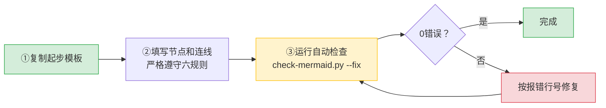
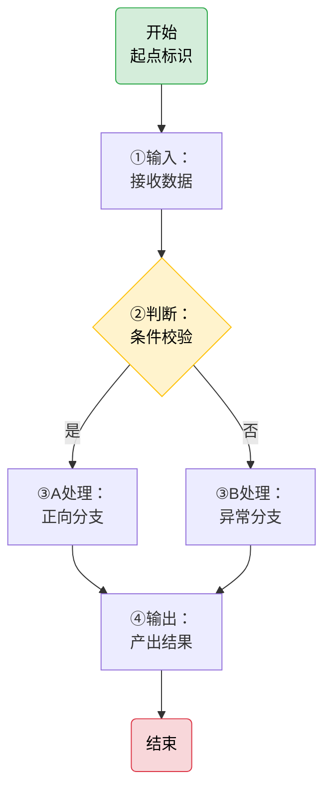
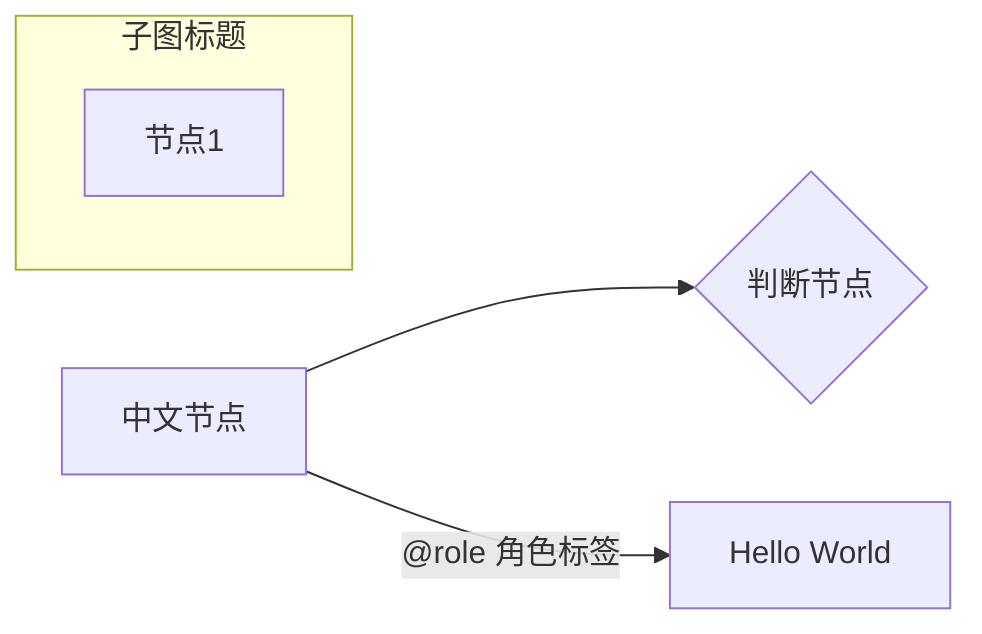
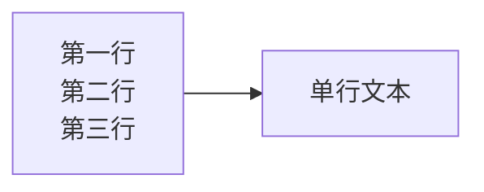
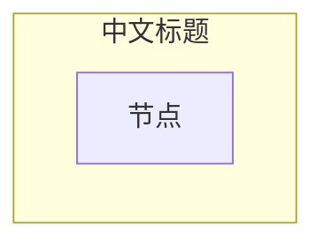
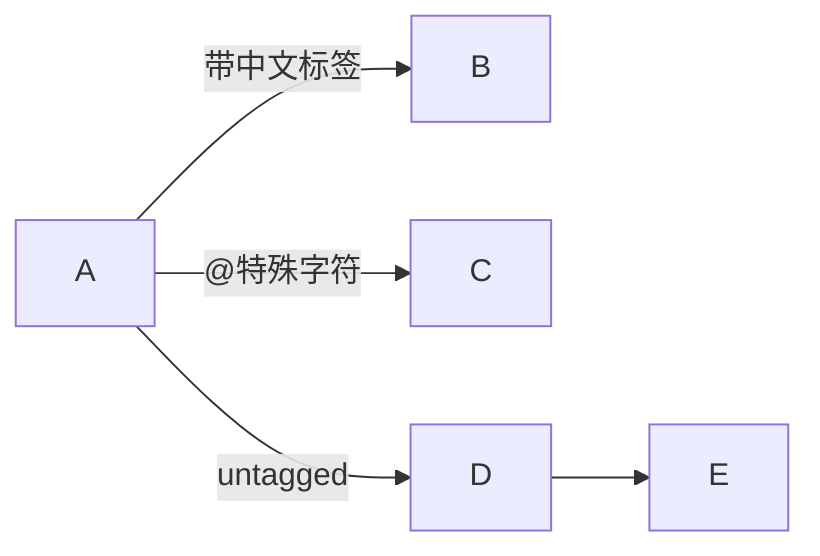

# Mermaid 图表操作指南

> 本指南是 SpecWeave 项目中使用 Mermaid 图表的一站式操作手册，涵盖从起步编写到自动化检查的完整流程。

## 快速开始：3步写好一张 Mermaid 图



### 第1步：复制起步模板

从 [safe-starter.md](../../../.agents/templates/mermaid-templates/safe-starter.md) 复制代码块。模板代码块内用 `%%` 注释内置了完整安全规则提醒，编辑时直接可见：



其他布局模板见 [mermaid-templates/](../../../.agents/templates/mermaid-templates/) 目录（含左→右流程图、分层流程图、决策图、时序图、状态图、思维导图）。

### 第2步：填写节点和连线

替换模板占位符，填写过程中遵守六规则（详见下方"安全编码六规则"章节）。

### 第3步：运行自动检查

写完图后**必须**运行自动化检查：

```powershell
python .agents/scripts/check-mermaid.py --fix
```

- `--fix`：自动修复可修复问题（空行删除、引号补全、`\n`→`<br/>`）
- 无 `--fix`：仅检查不修改
- `--path <目录>`：仅检查指定目录（默认检查全项目）
- `--dry-run`：预览修复内容但不写入文件

如果报告 0 错误，说明图表符合安全编码规范。如果有错误，按报错行号修复后重新运行直到 0 错误。

---

## 安全编码六规则

### 规则 ① 禁止空行

Mermaid 代码块内**禁止任何空行**（含仅含空格的行）。空行会被部分渲染器（如飞书）解析为代码块结束，导致后续内容渲染失败。

| ❌ 错误 | ✅ 正确 |
|--------|--------|
| 节点间有空行 | 所有行连续无间 |
| `style` 语句前有空行 | `style` 紧跟最后一条连线 |
| subgraph 块之间有空行 | subgraph 块之间直接 `end` 接 `subgraph` |

### 规则 ② 文本加引号

含中文、特殊字符（`@#:()-`+空格）、英文短语的节点/标签/subgraph标题，一律用双引号包裹：



纯英文单词/标识符可省略引号：`A[Start]` ✅

### 规则 ②b 避免列表触发

引号不能穿透 Markdown 层，以下模式即使被引号包裹仍会触发 "Unsupported markdown: list" 错误：

| ❌ 禁止 | ✅ 正确 | 说明 |
|---------|---------|------|
| `["1. 启动协议"]` | `["1：启动协议"]` | 英文句点→中文冒号 |
| `["- 项目A"]` | `["-项目A"]` 或 `["·项目A"]` | 去掉空格或改用中点 |
| `["* 注意"]` | `["⚠ 注意"]` | 改用 emoji |

### 规则 ②c 换行用 `<br/>`

节点文本内换行**统一使用 HTML 的 `<br/>` 标签**，禁止使用 `\n`：

- `\n` 在 flowchart/stateDiagram 节点中不会被解释为换行（部分渲染器显示为字面文本，部分压缩为单行）
- 虽然 `\n` 在 sequenceDiagram 的 Note 和消息文本中可以换行，但统一使用 `<br/>` 可避免记忆上下文差异



记忆口诀：**Mermaid 换行一律 `<br/>`，不要 `\n`**。

### 规则 ③ Subgraph 安全格式



- **ID 为纯英文标识符**：字母开头，不含中文、全角字符、特殊符号
- **中文标题放在方括号内双引号中**：格式 `["标题文本"]`
- **ID 与方括号之间有一个空格**

### 规则 ④ 边标签格式

`-->|"标签"|目标` — 含中文/特殊字符的边标签用双引号包裹，标签与箭头之间**无空格**：



判断分支标签也使用此格式：`CHECK -->|"是"| YES` `CHECK -->|"否"| NO`

---

## 节点形状速查

| 语法 | 形状 | 用途 |
|------|------|------|
| `id("文本")` | 圆角矩形 | 开始/结束节点 |
| `id["文本"]` | 矩形 | 普通步骤/处理节点 |
| `id{"文本"}` | 菱形 | 判断/决策节点 |
| `id(("文本"))` | 圆形 | 连接点/中心节点 |
| `id(["文本"])` | 体育场形 | 输入/输出 |
| `id[["文本"]]` | 子程序形 | 子流程/外部模块 |

---

## 自动化检查工具详解

### check-mermaid.py 检测能力

项目内置的 [check-mermaid.py](../../../.agents/scripts/lib/checks/mermaid.py) 可自动检测以下 10 类问题：

| # | 检测项 | 对应规则 | 自动修复 |
|---|--------|---------|---------|
| 1 | 代码块内空行 | 规则① | ✅ 自动删除 |
| 2 | Subgraph 中文裸 ID | 规则③ | ✅ 自动补全格式 |
| 3 | 全角冒号在 Subgraph ID 中 | 规则③ | ✅ 自动修复 |
| 4 | 节点文本列表触发模式（`数字. ` `- ` `* `） | 规则②b | ❌ 需手动修改内容 |
| 5 | 节点中文/特殊字符未加引号 | 规则② | ✅ 自动补全双引号 |
| 6 | 边标签中文/特殊字符未加引号 | 规则④ | ✅ 自动补全双引号 |
| 7 | 节点文本内 `\n` 换行符 | 规则②c | ✅ 自动替换为 `<br/>` |
| 8 | sequenceDiagram participant 中文/空格未加引号 | 规则② | ✅ 自动补全 |
| 9 | stateDiagram 迁移标签/状态描述含空格未加引号 | 规则② | ✅ 自动补全 |
| 10 | flowchart TD/TB direction 缺失 | 规则① | ✅ 自动补全 |

### Mermaid 注释（`%%`）感知

check-mermaid.py 正确识别 Mermaid 的 `%%` 注释语法：
- **整行注释**（行首 `%%`）：完全跳过，不检测不修改
- **行内注释**（代码后 `%% 注释`）：仅检测/修复代码部分，保留注释不变

这意味着你可以在模板和图表中安全使用 `%%` 添加提醒注释，检查脚本不会误报或破坏注释内容。

### 常用命令

```powershell
# 检查全项目
python .agents/scripts/check-mermaid.py
# 检查并自动修复
python .agents/scripts/check-mermaid.py --fix
# 仅检查指定目录
python .agents/scripts/check-mermaid.py --path docs/knowledge/
# 预览修复（不写入文件）
python .agents/scripts/check-mermaid.py --fix --dry-run
# CI模式（通过repo-check.py调用，失败时exit 1阻断）
python .agents/scripts/repo-check.py mermaid
```

### CI 集成

[ci-check.ps1](../../../.agents/scripts/ci-check.ps1#L43-L51) / [ci-check.sh](../../../.agents/scripts/ci-check.sh#L44-L52) 第4步已集成 Mermaid 检查，CI 流水线中 Mermaid 检查失败会阻断提交。提交前建议运行完整 CI 检查：

```powershell
.\.agents\scripts\ci-check.ps1
```

---

## 遇到渲染问题时排查流程

```mermaid
flowchart TB
    START["渲染异常"] --> S1{"①代码块内<br/>有空行？"}
    S1 -->|"是"| FIX1["删除所有空行"] --> RECHECK["重新运行<br/>check-mermaid.py"]
    S1 -->|"否"| S2{"②Subgraph ID<br/>是纯英文？"}
    S2 -->|"否"| FIX2["改为 EN_ID [「中文标题」] 格式"] --> RECHECK
    S2 -->|"是"| S3{"③节点文本有<br/>列表触发模式？"}
    S3 -->|"是"| FIX3["中文冒号/去空格/改用emoji"] --> RECHECK
    S3 -->|"否"| S4{"④节点内换行<br/>是否用了反斜杠+n<br/>而非<br/>？"}
    S4 -->|"是"| FIX4["替换为 <br/>"] --> RECHECK
    S4 -->|"否"| S5{"⑤边标签中文/特殊字符<br/>加了引号？"}
    S5 -->|"否"| FIX5["改为 -->|"「标签」"| 格式"] --> RECHECK
    S5 -->|"是"| S6{"⑥Style前<br/>有空行？"}
    S6 -->|"是"| FIX6["删除空行"] --> RECHECK
    S6 -->|"否"| AUTO["运行 check-mermaid.py --fix<br/>自动修复"]
    AUTO --> RECHECK
    RECHECK --> DONE{"0错误？"}
    DONE -->|"是"| FINISH["问题解决"]
    DONE -->|"否"| S1
    style START fill:#f8d7da,stroke:#dc3545
    style FINISH fill:#d4edda,stroke:#28a745
    style RECHECK fill:#fff3cd,stroke:#ffc107
```

### 分层排查原则

Mermaid 渲染错误存在"分层屏蔽"效应——结构层错误会阻止解析器到达内容层，修复结构错误后内容层错误才会显现。排查顺序：

1. **语法结构层**：括号/引号闭合、无空行、direction 正确
2. **Subgraph 层**：ID 合法（纯英文）、标题格式正确
3. **节点文本层**：无列表触发模式、换行用 `<br/>`
4. **边标签层**：中文/特殊字符加引号
5. **Style 层**：颜色值和样式语法正确

**心态要点**：不要因为修复后仍报错就认为方向错误——这是分层屏蔽效应，修复一个错误后暴露的是被屏蔽的旧错误，不是新引入的错误。继续逐层排查直到自动化工具报告 0 错误。

---

## 不同图表类型注意事项

### flowchart（流程图，最常用）

- ✅ 支持 `<br/>` 换行
- ✅ 支持 subgraph 分组
- ⚠️ 节点内 `\n` 不会换行
- ⚠️ 空行严格禁止
- 起步推荐：使用 [safe-starter.md](../../../.agents/templates/mermaid-templates/safe-starter.md)

### sequenceDiagram（时序图）

- `\n` 在 Note 和消息文本中可以换行，但统一用 `<br/>` 更安全
- participant 中文别名必须加引号：`participant A as "开发者"`
- 箭头语法：`->>`（虚线箭头）、`-->>`（虚线响应）
- 模板：[sequence-diagram.md](../../../.agents/templates/mermaid-templates/sequence-diagram.md)

### stateDiagram-v2（状态图）

- ✅ 支持 `<br/>` 换行
- 状态描述含空格需加引号
- 迁移标签含空格需加引号
- 模板：[state-diagram.md](../../../.agents/templates/mermaid-templates/state-diagram.md)

### mindmap（思维导图）

- 语法与 flowchart 差异较大，注意缩进层级
- 模板：[mindmap.md](../../../.agents/templates/mermaid-templates/mindmap.md)

---

## 渲染器兼容性

| 平台 | Mermaid 版本 | 容错度 | 已知严格点 |
|------|-------------|--------|-----------|
| GitHub | 较新 | 宽松 | 一般问题都能渲染 |
| VS Code 预览 | 取决于插件 | 中等 | 空行可能不报错 |
| 飞书文档 | 定制版 | **严格** | 列表触发、空行零容忍 |
| GitLab | 较新 | 中等 | 部分语法有差异 |

**实践原则**：编写时就按最严格渲染器（飞书）的要求来，不要依赖容错；完成后务必运行 `check-mermaid.py` 系统性扫描。

---

## 提交前检查清单

提交涉及 Mermaid 图表的代码前，对照以下清单确认：

- [ ] 代码块内无任何空行
- [ ] 含中文/特殊字符/空格的节点文本已用双引号包裹
- [ ] 节点文本无「数字.空格」「- 空格」「* 空格」等列表触发模式
- [ ] 节点内换行统一使用 `<br/>`，未使用 `\n`
- [ ] Subgraph 使用 `EN_ID ["中文标题"]` 格式，ID 为纯英文
- [ ] 边标签使用 `-->|"标签"|` 格式（中文/特殊字符加引号）
- [ ] sequenceDiagram 的 participant 中文别名已加双引号
- [ ] Style 语句前无空行
- [ ] 运行 `python .agents/scripts/check-mermaid.py` 报告 0 错误
- [ ] 运行 `.\.agents\scripts\ci-check.ps1` 全部通过

---

## 参考文档索引

| 文档 | 用途 |
|------|------|
| [safe-starter.md](../../../.agents/templates/mermaid-templates/safe-starter.md) | ⭐ 推荐起步模板（内置安全注释） |
| [mermaid-templates/](../../../.agents/templates/mermaid-templates/) | 8种布局模板目录 |
| [mermaid-safe-coding-rules.md](../../retrospective/patterns/code-patterns/mermaid-safe-coding-rules.md) | 六规则详细说明与正反例 |
| [mermaid-trap-cheatsheet.md](../../retrospective/patterns/code-patterns/mermaid-trap-cheatsheet.md) | 9大陷阱速查表 |
| [check-mermaid.py](../../../.agents/scripts/check-mermaid.py) | 自动化检查脚本 |
| [ci-check.ps1](../../../.agents/scripts/ci-check.ps1) | CI综合检查脚本 |
| [development-standards.md](../../development-standards.md) | 开发规范（含Mermaid章节） |
