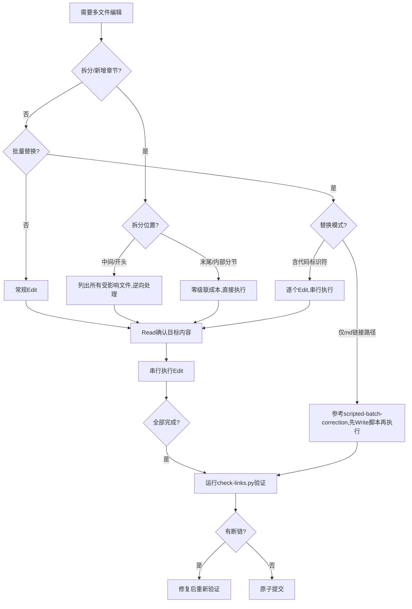

# 多文件编辑操作可靠性指南

> 基于 IDL Wiki 语法章节拆分（`02-syntax-basics.md` → `02-syntax-types.md` + `03-syntax-interface.md`）实战复盘的经验总结。在涉及多文件编辑、章节重编号、批量替换等操作时，工具可靠性风险常被低估——内容创作仅需 5 分钟，但级联更新和工具排错耗时 35 分钟（占总时间 87%）。本指南帮助你在规划阶段预判风险、执行阶段规避陷阱。

## 核心洞察：多文件编辑的真正成本不在内容创作

**洞察来源**：[idl-wiki-split-retro-20260705](../../retrospective/reports/project-reports/idl-wiki-split-retro-20260705.md)

多文件编辑任务（章节拆分、批量重命名、跨文件替换）的**有效内容创作时间通常只占 10-15%**，剩余时间消耗在：

| 耗时来源 | 占比 | 说明 |
|---------|------|------|
| 编号级联更新 | ~50% | 拆分中间章节导致后续 N 章全部需重编号（frontmatter/标题/导航/文件名） |
| 工具可靠性排错 | ~37% | 并行Edit超时、管道错误、替换串不匹配等 |
| 内容创作 | ~13% | 新内容编写本身 |

**关键数据**（IDL Wiki拆分案例）：
- 拆分 1 章（02-syntax-basics → 02-syntax-types + 03-syntax-interface）
- 级联影响 6 个后续文件（03→04 ... 08→09），共 12 文件变更
- 每章需同步修改：frontmatter title、x-toml-ref 路径、h1 标题、底部 prev/next 导航链接
- 总修改点约 30+ 处，级联更新耗时 20 分钟
- 工具排错耗时 15 分钟（并行超时、管道错误、替换串不匹配）

---

## 经验一：章节拆分位置决定级联更新成本

### 问题

Wiki/教程类文档的文件名通常包含数字编号（`01-xxx.md`、`02-xxx.md`）。当拆分**中间章节**时，后续所有章节的编号都需要级联更新——文件重命名 + frontmatter 更新 + 导航链接更新 + 目录页更新，是 O(N) 的级联操作。

### 决策矩阵：拆分位置选择

| 拆分位置 | 级联范围 | 级联文件数 | 推荐度 | 适用场景 |
|---------|---------|-----------|--------|---------|
| **末尾追加**（将最后一章拆为两章） | 无 | 0 | ⭐⭐⭐⭐⭐ | 末尾章节内容超阈值时首选 |
| **章节内部分节**（不新增章节文件） | 无 | 0 | ⭐⭐⭐⭐⭐ | 章节内容可通过内部h2分节解决时 |
| **开头插入** | 全部后续章节 | N-1 | ⭐⭐ | 极少需要（通常意味着初始规划有问题） |
| **中间插入** | 插入点之后所有章节 | N-k | ⭐ | 最不得已的选择，级联成本最高 |

### 操作 Checklist

- [ ] **拆分前先评估位置**：是否可以在末尾追加新章节而非中间插入？
- [ ] **创建时规划粒度**：Wiki教程创建时就合理规划章节粒度，避免事后拆分（参考 [wiki-pre-creation-three-checks](../../retrospective/patterns/methodology-patterns/governance-strategy/wiki-pre-creation-three-checks.md)）
- [ ] **级联影响清单**：拆分中间章节前，先用 `Glob`/`LS` 列出所有受影响文件，明确修改范围
- [ ] **导航枢纽优先更新**：先更新目录页（如 `00-overview.md`），再逐个更新各章节导航（参考 [navigation-hub-filename-contract](../../retrospective/patterns/methodology-patterns/ai-collaboration/navigation-hub-filename-contract.md)）
- [ ] **链接检查兜底**：全部更新后运行 `check-links.py`，确保无断链

### 重编号操作步骤（中间拆分时）

```
1. 创建新章节文件（写入内容）
2. 更新目录页（00-overview.md）导航表
3. 删除被拆分的旧文件
4. 从最后一章开始，逆向逐个处理（避免文件名冲突）：
   a. 更新 frontmatter（title、x-toml-ref）
   b. 更新 h1 标题
   c. 更新底部 prev/next 导航链接
   d. 文件重命名（使用 Shell ren 命令）
5. 从第一章开始，正向检查一遍导航链接
6. 运行 check-links.py 验证
```

**逆向处理原因**：从后往前重命名可以避免文件名冲突（如 03→04 时，04 还存在，先处理后面的文件不会覆盖前面的）。

---

## 经验二：Edit 前必须 Read，禁止凭记忆构造替换串

### 问题

`Edit` 工具要求 `old_string` 与文件内容**完全精确匹配**（包括空格、标点、副标题、换行）。如果凭记忆或假设构造替换串，容易因以下原因匹配失败：

| 失败原因 | 实际案例 |
|---------|---------|
| title 含副标题 | 替换 `"五、IDL 编译流程与工具链"` 但实际是 `"五、IDL 编译流程与工具链：从源文件到多语言桩代码"` |
| 空格/标点差异 | 中文冒号 `：` vs 英文冒号 `:` |
| 换行符差异 | CRLF vs LF |
| 内容已被前序修改改变 | 同一文件多轮 Edit 时，第一轮已改变内容，第二轮 old_string 不再匹配 |

### 操作 Checklist

- [ ] **每次 Edit 前必须先 Read**：确认目标文本的**精确内容**，包括副标题、标点、空格
- [ ] **复制粘贴而非手打**：从 Read 结果中直接复制目标字符串作为 old_string，不要凭记忆输入
- [ ] **同文件多轮Edit谨慎**：参考 [search-replace-fragility](../../retrospective/patterns/methodology-patterns/tools-automation/search-replace-fragility.md)，超过 2 处替换考虑整体读写策略
- [ ] **失败后立即Read重试**：Edit 失败不要重试相同参数，先重新 Read 确认实际内容
- [ ] **replace_all 仅用于安全场景**：确定目标串在文件中唯一且需全部替换时使用，避免误改

### ✅ 正确流程 vs ❌ 错误流程

| 步骤 | ✅ 正确 | ❌ 错误 |
|------|--------|---------|
| 1 | Read 目标文件 | 直接调用 Edit |
| 2 | 从 Read 结果复制精确字符串 | 凭记忆/推测构造 old_string |
| 3 | 确认字符串在文件中唯一 | 不检查唯一性直接 replace_all |
| 4 | 执行 Edit | 执行 Edit |
| 5 | 失败→Read→修正→重试 | 失败→重试相同参数 |

---

## 经验三：多文件 Edit 串行执行，不要并行

### 问题

IDE 的文件编辑操作可能存在文件锁或并发资源限制。并行发起多个 Edit 调用时，容易发生资源竞争导致超时。

**实际案例**：IDL Wiki 拆分时首次并行发起 6 个 Edit 调用，5 个超时失败（超时率 83%）。改为逐个串行执行后全部成功。

### 操作 Checklist

- [ ] **多文件 Edit 必须串行**：一个文件 Edit 完成后再 Edit 下一个
- [ ] **不要因效率诱惑并行**：看似并行更快，实际失败重试成本更高
- [ ] **独立文件的读取可并行**：Read 操作无副作用，多个 Read 可并行
- [ ] **单文件内多轮 Edit 也串行**：同一文件的多处修改，前一处成功后再改下一处

### 并行安全矩阵

| 操作类型 | 并行安全性 | 建议 |
|---------|-----------|------|
| Read（只读） | ✅ 安全 | 可并行 |
| Glob/LS（只读） | ✅ 安全 | 可并行 |
| Grep（只读） | ✅ 安全 | 可并行 |
| Edit（写入） | ❌ 不稳定 | **必须串行** |
| Write（写入） | ❌ 不稳定 | **必须串行** |
| Shell（文件修改类） | ❌ 不稳定 | **必须串行** |
| Shell（只读类，如 git status） | ⚠️ 谨慎 | 避免同时运行多个 |

---

## 经验四：Windows 管道不稳定时控制命令复杂度

### 问题

在 Windows PowerShell 环境中，高 IO 负载下 Shell 管道资源可能耗尽，触发 `os error 231`（"所有的管道范例都在使用中"）。以下操作容易触发：

- 长 Python 内联脚本（`python -c "..."` 含复杂逻辑和中文）
- 多命令链（`cmd1 && cmd2 && cmd3`）
- Write 工具写入大文件
- 并行 Shell 调用

### 安全策略

| 场景 | 推荐做法 | 不推荐 |
|------|---------|--------|
| 批量字符串替换 | 逐个使用 Edit 工具 | 长 `python -c` 内联脚本 |
| 查看文件内容 | 使用 Read 工具 | `type`/`cat` 命令 |
| 搜索文件 | 使用 Glob/Grep 工具 | `find`/`dir` 命令 |
| 搜索内容 | 使用 Grep 工具 | `grep`/`findstr` 命令 |
| 文件重命名 | Shell `ren` 单命令 | 多命令链 `&&` |
| 查看git状态 | Shell 单命令 `git status` | 管道组合命令 |
| Python脚本执行 | 先 Write 写入 .py 文件，再 Shell 执行 | `python -c "长脚本"` |

### 操作 Checklist

- [ ] **单次 Shell 命令保持简单**：一个 Shell 调用只做一件事
- [ ] **避免长内联脚本**：需要复杂逻辑时先 Write 为 .py 文件再执行
- [ ] **避免多命令链**：不使用 `&&` 串联 3 个以上命令
- [ ] **管道错误时降级策略**：遇到 os error 231 时退回到 Edit 工具逐个操作，不要反复重试 Shell
- [ ] **PowerShell 编码问题**：参考 [windows-powershell-pipe-utf8](../operations/windows-powershell-pipe-utf8.md) 处理中文编码问题
- [ ] **heredoc 写法**：参考 [windows-powershell-heredoc](../operations/windows-powershell-heredoc.md)

---

## 快速决策流程图



---

## 相关模式与参考

- **方法论模式**：
  - [navigation-hub-filename-contract](../../retrospective/patterns/methodology-patterns/ai-collaboration/navigation-hub-filename-contract.md) — 导航枢纽文件名清单契约
  - [search-replace-fragility](../../retrospective/patterns/methodology-patterns/tools-automation/search-replace-fragility.md) — SearchReplace 并发脆弱性
  - [scripted-batch-correction](../../retrospective/patterns/methodology-patterns/document-architecture/scripted-batch-correction.md) — 脚本化批量修正决策
  - [wiki-pre-creation-three-checks](../../retrospective/patterns/methodology-patterns/governance-strategy/wiki-pre-creation-three-checks.md) — Wiki创建前三查
  - [large-document-atomization-method](../../retrospective/patterns/methodology-patterns/document-architecture/large-document-atomization-method.md) — 大文档原子化方法
- **操作指南**：
  - [windows-powershell-pipe-utf8](../operations/windows-powershell-pipe-utf8.md) — PowerShell 管道 UTF-8 编码
  - [windows-powershell-heredoc](../operations/windows-powershell-heredoc.md) — PowerShell heredoc 写法
- **来源复盘**：
  - [idl-wiki-split-retro-20260705](../../retrospective/reports/project-reports/idl-wiki-split-retro-20260705.md) — IDL Wiki语法章节拆分复盘
  - [idl-wiki-tutorial-retro-20260704](../../retrospective/reports/project-reports/idl-wiki-tutorial-retro-20260704.md) — IDL Wiki教程创建复盘

---

## Changelog

<!-- changelog -->
- 2026-07-05 | docs | v1.0：初始版本，基于IDL Wiki章节拆分复盘提炼4条核心经验（级联成本/Read-before-Edit/串行Edit/Windows管道），包含决策矩阵、Checklist和流程图
