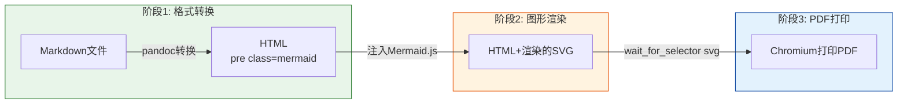

# 从实战到工具：三段式PDF导出、Mermaid全量扫描与三个工程洞察

> 本文档源于"Mermaid五品漏斗图重绘与PDF导出"任务复盘，记录了从问题排查到工具封装的完整思路链，萃取了三个可复用的工程洞察，并配套了两个自动化脚本。

## 一、问题背景

在处理"一画开天"会议纪要分析任务时，需要：
1. 将含 Mermaid 五品漏斗图的中文 Markdown 报告导出为 PDF
2. 修正 Mermaid 图中的语法错误（引号、空行等）
3. 确保导出的 PDF 中 Mermaid 图正确渲染为可矢量缩放的 SVG

环境约束：
- Windows 环境，未安装 LaTeX（排除 wkhtmltopdf + LaTeX 方案）
- 中文内容必须正确显示（字体、编码）
- Mermaid 图必须渲染为矢量图（不能是截图占位符）

## 二、三个核心洞察

### 洞察1：工具选择的熟悉度偏差——优先选领域专用工具而非通用库

**问题**：最初选择 Python `markdown` 库做 MD→HTML 转换，结果 `fenced_code` 扩展无法将 ```` ```mermaid ```` 代码块正确输出为 `<pre class="mermaid">`，导致后续 Mermaid.js 无法识别渲染目标。

**根因**：Python markdown 库是通用 Markdown 解析器，对 Mermaid 这类扩展语法没有特殊处理。而 Pandoc 作为文档转换领域的专用工具，原生支持 fenced code block 的 class 属性输出。

**原则**：
- 文档格式转换优先选择专用工具（Pandoc）而非通用解析库
- 当某领域有成熟专用工具时，优先使用它，即使通用库"看起来也能做"
- 判断标准：专用工具在该领域的格式覆盖率、边缘 case 处理能力远超通用库

**反例对照**：
| 场景 | 通用库方案 | 专用工具方案 | 结果 |
|------|-----------|-------------|------|
| MD→HTML 转换 | Python markdown + fenced_code 扩展 | Pandoc | Pandoc 正确输出 `<pre class="mermaid">` |
| 浏览器自动化 | requests + BeautifulSoup | Playwright | Playwright 可等待 JS 异步渲染完成 |
| Git 操作 | GitPython（第三方库） | 直接调用 git CLI | CLI 更稳定、功能更完整 |

### 洞察2：无头浏览器异步渲染检测——DOM状态优先于回调信号

**问题**：Mermaid.js 的 `mermaid.run()` 返回的 Promise 在调用 `then()` 时 SVG 元素尚未插入 DOM，直接打印 PDF 会得到空白图。

**根因**：Mermaid v10+ 的 `.run()` 返回的 Promise resolve 时机是"渲染任务已提交"，而非"SVG 已插入 DOM"。JS 的微任务队列和 DOM 更新之间存在时序差。

**错误做法**：
```python
# 错误：依赖 JS Promise 的 resolve 信号
page.evaluate("""
    new Promise(resolve => {
        mermaid.run().then(() => resolve());  // Promise resolve 时 SVG 尚未渲染到 DOM
    })
""")
```

**正确做法**：
```python
# 正确：等待 DOM 中出现实际的 SVG 元素
page.wait_for_selector(".mermaid svg", timeout=5000)
```

**原则**：
- 在无头浏览器中操作异步渲染内容时，**永远以 DOM 实际状态为准**，而非 JS 回调/Promise 的 resolve 信号
- 类比：等网页加载不要等 `DOMContentLoaded`，要等关键元素出现（`wait_for_selector`）
- 这个原则适用于所有前端渲染框架（React/Vue/Mermaid/ECharts）：检测"产物出现了"而非"框架说做完了"

### 洞察3：自动化检查的免费质量提升——顺手修复是最划算的事

**问题**：修改一个 Mermaid 图后运行 `check-mermaid.py --fix`，脚本自动修复了另外 2 个毫不相关图中的 25 个引号问题。

**根因**：自动化检查工具对全量文件扫描的边际成本为零。当你修复一个问题时顺手跑一次全量检查，相当于"免费"获得了额外的质量提升。

**量化收益**：
- 手动检查一个文件的 Mermaid 语法：约 5-10 分钟
- 自动扫描整个 docs/ 目录：约 2-3 秒
- ROI（投入产出比）：约 100:1

**实践建议**：
1. 修改任意 Mermaid 图后，立即运行 `mermaid-full-scan.py`（而非仅检查当前文件）
2. 把全量检查纳入提交前流程（pre-commit hook / CI gate）
3. 对于支持 `--fix` 的检查工具，先 `--dry-run` 预览修复，再执行 `--fix`
4. 全量检查发现的问题不应被视为"额外工作"，而应被视为"提前发现的潜在故障"

## 三、可复用模式：三段式中文 Markdown+Mermaid → PDF 导出法

### 模式卡片

| 属性 | 值 |
|------|-----|
| 模式名称 | 三段式中文PDF导出法 |
| 适用场景 | 无LaTeX环境下导出含Mermaid图的中文MD为PDF |
| 依赖 | Pandoc + Mermaid.js CDN + Playwright Chromium |
| 成熟度 | L1（已在实战验证，已封装为脚本） |

### 三段流程详解



### 三个关键处理点

**关键处理1：Pandoc输出正确的Mermaid代码块**

```bash
pandoc input.md -f markdown+pipe_tables+fenced_code_blocks \
  -t html5 --standalone --no-highlight -M title=
```

- 使用 `-M title=` 避免空title
- `--no-highlight` 防止Pandoc给Mermaid代码块加语法高亮class
- Pandoc会自动输出 `<pre class="mermaid"><code>...</code></pre>`

**关键处理2：反转义HTML实体**

Pandoc会将单引号`'`编码为`&#39;`，导致Mermaid初始化失败。必须对Mermaid代码块做HTML实体反转义：

```python
import html
raw_html = html.unescape(mermaid_pre_content)  # &#39; -> '
```

**关键处理3：DOM状态检测（见洞察2）**

```python
page.wait_for_selector(".mermaid svg", timeout=5000)  # 等SVG出现，而非Promise resolve
```

### 使用方式

封装脚本位置：[export-md-to-pdf.py](file:///d:/spaces/SpecWeave/.agents/scripts/export-md-to-pdf.py)

```bash
# 基础用法
python .agents/scripts/export-md-to-pdf.py report.md

# 指定输出路径+保留中间HTML调试
python .agents/scripts/export-md-to-pdf.py report.md -o output.pdf --keep-html

# 不含Mermaid图的文档（跳过渲染等待）
python .agents/scripts/export-md-to-pdf.py notes.md --no-mermaid

# 自定义CSS+延长等待时间
python .agents/scripts/export-md-to-pdf.py report.md --css custom.css --wait-ms 10000
```

## 四、自动化工具：Mermaid全量扫描

### 工具说明

基于现有 `check-mermaid.py` 的检查引擎，封装了更适合定期运行的全量扫描脚本：

脚本位置：[mermaid-full-scan.py](file:///d:/spaces/SpecWeave/.agents/scripts/mermaid-full-scan.py)

### 使用场景

```bash
# 1. 日常快速检查（默认扫描docs/目录）
python .agents/scripts/mermaid-full-scan.py

# 2. 修改图后顺手全量修复
python .agents/scripts/mermaid-full-scan.py --fix

# 3. 预览修复效果（不修改文件）
python .agents/scripts/mermaid-full-scan.py --fix --dry-run

# 4. 生成Markdown格式的质量报告
python .agents/scripts/mermaid-full-scan.py --report docs/quality/mermaid-scan-report.md

# 5. 集成到CI（JSON输出方便解析）
python .agents/scripts/mermaid-full-scan.py --json
```

### 建议集成方式

1. **Pre-commit hook**：提交前自动扫描变更文件中的Mermaid语法
2. **CI流水线**：每日全量扫描，有错误时阻塞合并
3. **定期报告**：每周生成一次质量报告，跟踪Mermaid语法健康度趋势

## 五、故障排查速查表

| 问题现象 | 可能原因 | 解决方案 |
|---------|---------|---------|
| PDF中Mermaid区域空白 | Mermaid.js CDN加载失败 | 检查网络连接；可改用本地Mermaid.js |
| PDF中Mermaid区域空白 | 等待时间不足 | 增大 `--wait-ms` 参数至10000 |
| Mermaid初始化报错"Unexpected token" | HTML实体未反转义（`&#39;`） | 确保调用了 `html.unescape()` |
| Mermaid节点中文显示为乱码 | 节点文本未加双引号 | 运行 `mermaid-full-scan.py --fix` |
| Mermaid解析中断（部分图缺失） | 代码块内有空行 | 运行 `mermaid-full-scan.py --fix` |
| 中文PDF显示为方块 | 系统缺少中文字体 | 确保CSS中指定了中文字体栈 |
| Pandoc报错"unknown reader" | Pandoc版本过旧 | 升级Pandoc至2.19+ |
| Playwright报错"Executable doesn't exist" | Chromium未安装 | 运行 `playwright install chromium` |

## 六、延伸思考

这三个洞察虽然从一次具体任务中萃取，但具有更广泛的适用性：

- **工具选择熟悉度偏差** → 适用于所有技术选型场景：库 vs 工具、手写 vs 框架、自研 vs 开源
- **DOM状态检测原则** → 适用于所有涉及异步渲染的自动化测试和爬虫场景
- **自动化检查免费提升** → 适用于所有linter、静态分析、类型检查工具（ESLint/MyPy/Ruff/TypeScript等）

核心方法论是：**每次遇到问题，不只修复当前问题，而是将修复过程封装为可复用工具，再从工具使用中提炼通用原则。** 这是将单次经验转化为组织能力的关键路径。

## 相关资源

- [export-md-to-pdf.py](file:///d:/spaces/SpecWeave/.agents/scripts/export-md-to-pdf.py) — 三段式PDF导出脚本
- [mermaid-full-scan.py](file:///d:/spaces/SpecWeave/.agents/scripts/mermaid-full-scan.py) — Mermaid全量扫描脚本
- [check-mermaid.py](file:///d:/spaces/SpecWeave/.agents/scripts/check-mermaid.py) — Mermaid语法检查与修复（单文件/目录）
- [Mermaid图表操作指南](file:///d:/spaces/SpecWeave/docs/knowledge/best-practices/mermaid-guide.md) — Mermaid安全编码六规则
- [任务复盘报告](file:///d:/spaces/SpecWeave/docs/retrospective/reports/task-reports/retrospective-mermaid-funnel-redesign-pdf-export-20260711/README.md) — 原始复盘报告
