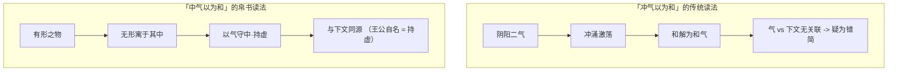

# 01 · 「三」之本体论

> **本篇要解决的问题**（D 层推断）：
>
> 「道生一，一生二，二生三，三生万物」这12个字，人人能背，但\*\*「三」是什么，两千年没有定论\*\*。
>
> 本篇不追求给出唯一答案（那既做不到也不诚实），而是做三件事：
>
> 1. **穷尽**主流解释谱系（六类），每类登记出处与证据强度；
> 2. **裁决**哪些解释可被证据排除，哪些属于解释者立场差异；
> 3. **提出**一个能统摄六类的统一模型，并显式标注其边界。

***

## 一、文本基准：先确定我们在解释哪句话

> **版本纪律**：本篇所有《老子》引文均标注版本。**笼统称「帛书本」是不合格的**——甲本与乙本残损程度不同、引文可能仅存于其中一本。此纪律来自 `projects/daoapps.github.io/doc/jieban/covenant.md` 的实证教训（末章短引文只能标乙本，因甲本此句损掩）。

### 1.1 帛书本第四十二章（今本第四十二章）

> 道生一，一生二，二生三，三生万物。万物负阴而抱阳，**中气以为和**。人之所恶，唯孤、寡、不谷，而王公以自名也。故物或损之而益，或益之而损。故人之所教，亦议而教人。故强梁者不得其死，我将以为学父。

- **版本**：马王堆帛书**甲本**（甲本此句略残） / 帛书**乙本**
- 关键异文：「**中气**以为和」

### 1.2 今本（王弼本）第四十二章

> 道生一，一生二，二生三，三生万物。万物负阴而抱阳，**冲气以为和**。人之所恶，唯孤寡不谷，而王公以为称。故物，或损之而益，或益之而损。人之所教，我亦教之。强梁者不得其死，吾将以为教父。

- **版本**：传世本（王弼注本系统）
- 关键异文：「**冲气**以为和」；另「王公以为称」（帛书作「以自名也」）

### 1.3「冲/中」之辨：这不是通假之争，是两种世界观

《长沙马王堆汉墓简帛集成》对此有明确说明（转引）：

> 「'中气'二字乙本已残去，北大本亦作'中气'，传本作'冲气'，'冲'或作'盅'（一般以之为'冲虚'之'冲'的本字）。**甲本与北大本的'中'字，究竟应理解为中和或中间之'中'，抑应读为'冲'，尚待研究**。」

**这段说明本身极重要**：整理者张家祥明确表示「尚待研究」——**学界并未定论**。

严灵（帛书老子注读）的辨析（本包转述其要点，非全文引用）：

- 若作「冲气」，学者多理解为阴阳二气冲涌激荡而至和谐；
- 此读法导致**无法理解此句与下文「人之所恶，唯孤、寡、不谷，而王公以自名也」有何关联**，因而误认此为他章错简；
- 严灵主张：此处「阴阳」并非后世认知的阴阳二气——**整本《道德经》提到阴阳仅此一处**，「阴」「阳」本指山北/水南、山南/水北，即幽暗/昭明；
- 「负」「抱」二字看似方向相反，**其实同为持守、保有之义**；
- 「中气」即「以气（虚）守中」，即范应元所言「凡有形之物皆有无形者寓其间」。



> **判据（本案采用）**：
>
> 「中气」读法有一个**文本内自洽性优势**——它能解释为什么「孤、寡、不谷」这类「看似自贬」的称号与本章前段在同一逻辑上（**皆为持虚**）；「冲气」读法做不到这一点，只能诉诸错简。
>
> 但这**不足以判定「中」为正字**——因为存在「冲（盅）」为正字、「中」为借写的可能。**本案的立场是：保留两说，以自洽性为优先序，但不宣布裁决。**

### 1.4 郭店楚简《太一生水》：一条独立的并行文本

> **重要提醒**：郭店楚简本与马王堆帛书本**不得混称**（`daoapps.github.io/AGENTS.md` 明列此纪律）。以下是**并行的独立文本证据**，不是帛书本的另一个版本。

郭店楚简丙本含本章，另有一段独立的生成链（**注意：是「太一生水」体系，不是「道生一」体系**）：

> 太一生水，水反辅太一，是以成天。天反辅太一，是以成地。天地〔复相辅〕也，是以成神明。神明复相辅也，是以成阴阳。阴阳复相辅也，是以成四时。四时复相辅也，是以成沧热。沧热复相辅也，是以成湿燥。湿燥复相辅也，成岁而止。故岁者，湿燥之所生也；湿燥者，沧热之所生也；沧热者，四时之所生也；四时者，阴阳之所生也；阴阳者，神明之所生也；神明者，天地之所生也；天地者，太一之所生也。是故太一藏于水，行于时，周而又始，以己为万物母……此天之所不能杀，地之所不能埋，阴阳之所不能成。君子知此之谓〔道〕。

> **读法提示**：这段链条的结构是**逐层递归相辅**（太一 → 水 → 天 → 地 → 神明 → 阴阳 → 四时 → 沧热 → 湿燥 → 岁），每一层都由上一层「反辅」而生，最后「成岁而止」——**有始有终，会收束**。
>
> 与「道生一，一生二，二生三，三生万物」相比：楚简本**是链式递归**（十层），帛书本**是三段跳**（一 → 二 → 三 → 万物）。**这是两种不同的表达策略，不是同一句话的两个版本。**

***

## 二、六类解释谱系：穷尽登记

### 2.1 解释一：和气说（传统气化论，影响最大）

| 项        | 内容                                                                                                            |
| -------- | ------------------------------------------------------------------------------------------------------------- |
| **代表**   | 《淮南子·天文训》、司马光、冯友兰、郭齐勇                                                                                         |
| **出处**   | 《淮南子·天文训》：「道（曰规）始于一，一而不生，故分而为阴阳，阴阳合和而万物生。故曰：'一生二，二生三，三生万物。'」；司马光：「道生一，自无而有；一生二，分阴分阳；二生三，阴阳交而生和；三生万物，和气聚而生万物。」 |
| **主张**   | 一 = 混沌未分之气；二 = 阴阳二气；三 = 阴阳二气交合产生的**和气（中和之气）**                                                                 |
| **证据强度** | **中高**。① 有《淮南子》这一早期文献依据；② 与本章「（中/冲）气以为和」直接呼应；③ 与帛书「三生万物，万物负阴而抱阳，（中）气以为和」形成文本自证                                |
| **弱点**   | 「三」与「和气」在本章中分处两句（一句说三，一说气），「三 = 和气」需要一次跨句整合；《淮南子》晚出，是否承自《老子》原文存疑（可能反向借《老子》以自重）                                |

### 2.2 解释二：天地人三才说

| 项        | 内容                                                                                                                                                                                                                    |
| -------- | --------------------------------------------------------------------------------------------------------------------------------------------------------------------------------------------------------------------- |
| **代表**   | 河上公、成玄英                                                                                                                                                                                                               |
| **出处**   | 河上公注：「一生阴与阳也。二生三，**阴阳生和、清、浊三气，分为天地人也**。三生万物，天地〔人〕共生万物也。」                                                                                                                                                              |
| **主张**   | 三 = 天地人三才                                                                                                                                                                                                             |
| **证据强度** | **中**。① 是现存最早的成体系注解（汉代），后世注家多沿此；② 与《周易》三才传统可通                                                                                                                                                                         |
| **弱点**   | ① 河上公把「一生二」解为阴阳、「二生三」解为天地人，但\*\*「二生三」的算术在此断裂\*\*（二生三须解释为何 2+1=3）；② 与「冲/中气以为和」的关联反而更弱；③ 已在既有资产中登记（`projects/awesome-okf-xs/doc/bundles/guoxue/daojia/xuanxue/heshanggong/concepts/04-selected-chapters.md:71-78`，双源核对） |

### 2.3 解释三：二与一为三说（关系说）

| 项        | 内容                                                                                                                                           |
| -------- | -------------------------------------------------------------------------------------------------------------------------------------------- |
| **代表**   | 王弼、吕惠卿思路；冯国超（2024）的**新解**；\`庄子·齐物论》路径                                                                                                        |
| **出处**   | 《庄子·齐物论》：「一与言为二，二与一为三。」（此句是理解「三」的**中国哲学内部关键资源**）；冯国超：「'二生三'指的是有了天地（'二'），'一'存在于其间，从而有了'三'，因此，'三'指的是'一'加上天地二者之和」                               |
| **主张**   | 三 = 一 + 二 之和，**即原始的「一」重新出现在分化之后的结构中**                                                                                                        |
| **证据强度** | **高（就结构逻辑而言）**。① 唯一能解释「二生三」的**算术连续性**（2+1=3）；② 冯国超引入「道之体用」区分，为「一」在「三」中的存在提供了哲学依据；③ 与本章「万物负阴而抱阳」——**万物既有阴（地/二）又有阳（天/二），还负抱着一个未分的根源（一）**——高度吻合 |
| **弱点**   | 冯国超解为 2024 年提出（冯国超时任中国社会科学院哲学研究所研究员），**尚需学界检验**；「三 = 一 + 天地」的读法在直觉上不如「三 = 和气」直观                                                              |

### 2.4 解释四：模式说 / 虚指说

| 项        | 内容                                                                                                                                                                                                                       |
| -------- | ------------------------------------------------------------------------------------------------------------------------------------------------------------------------------------------------------------------------ |
| **代表**   | 蒋锡昌、刘笑敢、池田知久                                                                                                                                                                                                             |
| **出处**   | 蒋锡昌：「老子一二三，只是以三数字表示道生万物，愈生愈多之义。如必以一二三为天地人；或以一为太极，二为天地，三为天地相合之和气；则凿矣。」刘笑敢：「这里的一、二、三都不必有确切的指代对象……对一、二、三的任何具体的解释都可能是画蛇添足。」池田知久：「有许多见解认为'二'相当于'阴''阳'或'天''地'……但是，这就将混沌未分的宇宙全体渐次分化的过程仅以一般的形式论述。所以，后世将其作为套路式的具体的思想概念的理解，是不恰当的。」 |
| **主张**   | 一二三只是「由少到多、由简到繁」的**模式标记**，无具体所指                                                                                                                                                                                          |
| **证据强度** | **高（作为方法论的警告）**。① 三位学者分别从训诂、哲学、跨文化视角独立得出同一结论——**这种独立汇聚本身是最强的证据**；② 它是对「两千年来每代人都重新发明一个「三」」这一现象的最好解释                                                                                                                       |
| **弱点**   | ① 它**不解释**为什么是「三」而不是「二」或「四」；② 它使本章丧失一切具体内容，解释力过弱；③ 若成立，则本章的哲学价值仅在于「有生万物」的模式断言                                                                                                                                            |

### 2.5 解释五：三合生物观

| 项        | 内容                                                                                                             |
| -------- | -------------------------------------------------------------------------------------------------------------- |
| **代表**   | 《穀梁传》、《楚辞·天问》、《文子》、《淮南子》                                                                                       |
| **出处**   | 《穀梁传·庄公三年》：「独阴不生，独阳不生，独**天**不生，**三合然后生**。」《楚辞·天问》：「阴阳三合，何本何化？」《文子·精诚篇》：「阴阳四时非生万物也，雨露时降非养草木也，**神明接，阴阳和**，万物生矣。」 |
| **主张**   | 「三」= 阴 + 阳 + 天（或神明）——**三方共同成立才能生万物**，不是二方                                                                      |
| **证据强度** | **中高（作为先秦生物观）**。① 与《老子》「三生万物」结构同构，时代相近；② 说明「三」在先秦**不限于《老子》一处**，是一个跨文本的共有概念；③ 揭示「三」的第三项**不是「二」的必然结论，而是独立的第三要素** |
| **弱点**   | ① 传世文献晚于《老子》（《穀梁传》成书约战国至汉）；② 未解决「第三项为何是天/神明」的问题                                                                |

### 2.6 解释六：本体显现说（冯国超新解）

| 项        | 内容                                                                                                                                                                                                                                   |
| -------- | ------------------------------------------------------------------------------------------------------------------------------------------------------------------------------------------------------------------------------------ |
| **代表**   | 冯国超（中国社会科学院哲学研究所），2024-11/12                                                                                                                                                                                                         |
| **出处**   | 冯国超《"道生一，一生二，二生三，三生万物"新解》（中国社会科学网，2024-12-05）：「'道生一'，指'道'即宇宙万物本原之本体显现其作用，因此，'一'指的是**包含本体和作用**的宇宙万物的本原；'一生二'，指有了'一'即宇宙万物的本原，从而有了天地二者，因此，'二'指的是天地；'二生三'，指的是有了天地，'一'存在于其间，从而有了'三'，因此，'三'指的是'一'加上天地二者之和；'三生万物'，指的是'一'在天地之间发挥作用，从而创生了万物。」 |
| **前提**   | 冯国超对「道」作了三重区分：① 本义（宇宙万物本原的**作用**）；② 代指宇宙万物的本原；③ 代指宇宙万物本原的**本体**。第四十二章的「道」指③（本体），「一」指含本体与作用的本原                                                                                                                                        |
| **证据强度** | **中（结构严密但需检验）**。① 是六类解释中**唯一给出完整体用逻辑链条**的；② 解释了「二生三」的算术；③ 提供了前人未有的哲学框架                                                                                                                                                               |
| **弱点**   | ① 「一」为何在「三」中重新出现，需要读者接受「一」有本体与作用两重身份；② 「二 = 天地」的主张与陈鼓应、卢育三的论证（先秦先出天地后出阴阳）一致，但冯国超未展开此论证；③ 新近提出，学界未充分讨论                                                                                                                                |

***

## 三、裁决：哪些能排除，哪些不能

### 3.1 可以排除的（文本内证伪）

| 排除对象                 | 理由                                                                                                           | 依据                               |
| -------------------- | ------------------------------------------------------------------------------------------------------------ | -------------------------------- |
| **「三 = 天、地、人」的完整形态** | 河上公注的「三」若指天地人，则本章「三生万物」等于说「天地人生万物」——**这与《老子》他处的立场冲突**：《老子》反复贬低「人」的重要性（「天地不仁」「功遂身退」「生而不有」），把人与天地并列为其万物之母不合其体系 | 河上公注疏本身即有「天地〔人〕共生」的字样补字，说明文本本身有缺 |
| **「三 = 精气神」**        | 后世丹道术语，回填到先秦文本是**时代错置**                                                                                      | 「精气神」三词并称定型于后世                   |

### 3.2 无法排除的（解释者立场差异）

| 不可排除              | 理由                                                                                   |
| ----------------- | ------------------------------------------------------------------------------------ |
| **和气说 vs 二与一为三说** | 两者都能与本章文本相容：一个强调「三」是新生的和气，一个强调「一」在分化后回归。**这是「三是新物」与「三是原物+新分化」的本体论分歧，不是事实分歧**         |
| **模式说 vs 具体所指说**  | 模式说是**方法论上的免责声明**（不可证伪），具体所指说是**可被文本检验的主张**。二者可以并存：即使「三」有具体所指，「一二三」也确实承担了「愈生愈多」的模式功能 |
| **中气说 vs 冲气说**    | 整理者明言「尚待研究」；正字与借写之辨需出土材料或更早写本支持，现有证据不足以定谳                                            |

### 3.3 一个方法论结论

> **两千年来「三」无定论，不是学界无能，而是这个问题本身的性质使然。**
>
> 理由：一二三是指向具体事物的**名词**（如「三 = 天地人」），还是表示递进关系的**序数**（如「愈生愈多」）？文本本身不提供元语言，无法自我裁决。**任何宣称已定论的说法都在可疑地扩大文本的承诺范围。**

***

## 四、第五义：「三」是关系位

### 4.1 统一模型

六类解释看似互斥，但**它们全部共享一个未被言说的结构**：

```
一  ──分化──▶  二  ──整合──▶  三  ──涌现──▶  万物
│              │              │
本体（未分）    对立（分离）    关系（连接）
                  ↑
              「三」不是第三个东西，是让「二」仍然是「一」的那个东西
```

**六类解释在统一模型中的落位**：

| 解释          | 落位哪一义                              |
| ----------- | ---------------------------------- |
| 和气说         | 「三」是**新生的整合物**（和气）——只说了三是什么，没说三做什么 |
| 天地人三才说      | 「三」是**三者的合成**——数学上依赖未解释的 2+1       |
| 二与一为三说（冯国超） | 「三」是**原物在分化态中的回归**——最接近第五义的学术表达    |
| 模式说         | 「三」是**序数位置**——解释了它在链条中的功能位，未解释其内容  |
| 三合生物观       | 「三」是**三方共成**——揭示了第三项的独立性           |
| 本体显现说       | 「三」是**本体在作用中的展开**——提供了体用逻辑         |

> **第五义的表述**（D 层推断，本包原创）：
>
> **「三」不是第三个实体，而是「一」与「二」之间的关系位本身——是维持分化中的系统仍保持完整性的那个结构。**
>
> 换言之：**「三」的本体论地位是关系性的，不是实体性的。** 它不是「第三个东西」，而是「为什么二个东西能构成一个整体」的那个答案。

### 4.2 第五义的三个支撑

**支撑一：算术（形式证据）**

「二生三」在三段跳的数列中是唯一的**不可直接理解**的一步。一生二、二生三、三生万物中，只有「二生三」需要额外解释（2 不生 3）。这在形式上标记了：**「三」是一个质的跃迁，不是数量的递增**——它是「一」重新出现在「二」之中。

**支撑二：文本（语义证据）**

本章后句「**万物负阴而抱阳**」——万物「负」（背/持守）与「抱」（持守）的是阴阳，即「二」的两面。**但万物同时持守着一个不分的状态**（「负阴抱阳」正是「负」与「抱」的双向持守，不是对立）。这与「三 = 一 + 天地」的解释互证。

**支撑三：跨文本（比较证据）**

庞朴「一分为三」理论（见 [02 时间与三分](02-time-triads.md#2-庞朴一分为三跨文化对照)）给出中国哲学的独立印证：**「分成对立的两还是一个不稳定的状态，只有把它变成三以后才是最稳定的」**——三角形是最稳定的几何图形。这是同一结构在完全不同的学科语境中的独立重现。

> **与既有资产的汇流**：`vendor/flexloop/docs/general/philosophy/engineering/three-as-interface.md` 已从 Ψ=Ψ(Ψ) 恒等式独立推导出同一结论——**「三」= 等号 / 关系约束**（其原文：「'三'不是第三个宇宙。'三'是两个视角之间的耦合——让'二'仍然能是'一'的那个结构」）。该文在 vendor 子模块内（只读），本包独立复核其结论并给出文本与算术两项新支撑。

### 4.3 第五义的边界（不可过度声称）

| 不可声称         | 原因                                                      |
| ------------ | ------------------------------------------------------- |
| 「老子原意就是关系优先」 | 《老子》从未使用「关系」范畴；「三 = 关系位」是现代重构                           |
| 「第五义优于冯国超新解」 | 二者**互补而非竞争**：冯国超给出「一」如何回归的机制，第五义给出这个机制的一般化形式            |
| 「六类解释已被统一」   | 统一模型**容纳**六类，不**消解**六类；它是一个上位框架，不是终审判决                  |
| 「可以据此建立工程原则」 | 可以（见 [04 生存指南](04-survival-guide.md)），但须区分**类比**与**推导** |

***

## 五、相关页面

- 时间三分与奥古斯丁三分法：[02 时间与三分](02-time-triads.md)

* 两组行动三元组与「三」的同构：[03 行动三元组](03-action-triads.md)
* 极简可操作指南：[04 生存指南](04-survival-guide.md)
* daoapps 四站完整走查：[../examples/01-worked-example.md](../examples/01-worked-example.md)
* 事实与信源台账（含冯国超、庞朴、严灵等全部来源 URL）：[../references/source-inventory.md](../references/source-inventory.md)
* 对抗审查记录（本篇被修正的假设）：[../references/adversarial-review.md](../references/adversarial-review.md)

**下一篇**：[02 时间与三分：过去·现在·未来与「三」的同构](02-time-triads.md)
