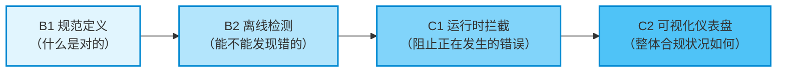
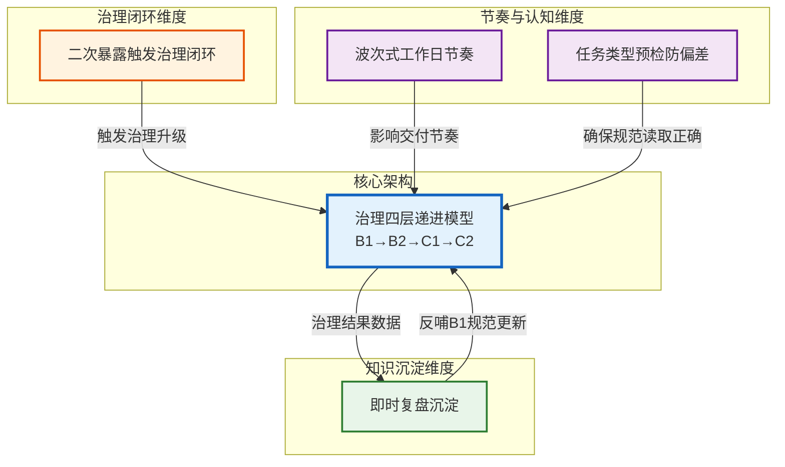
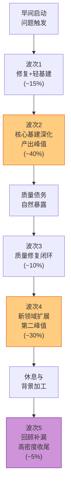
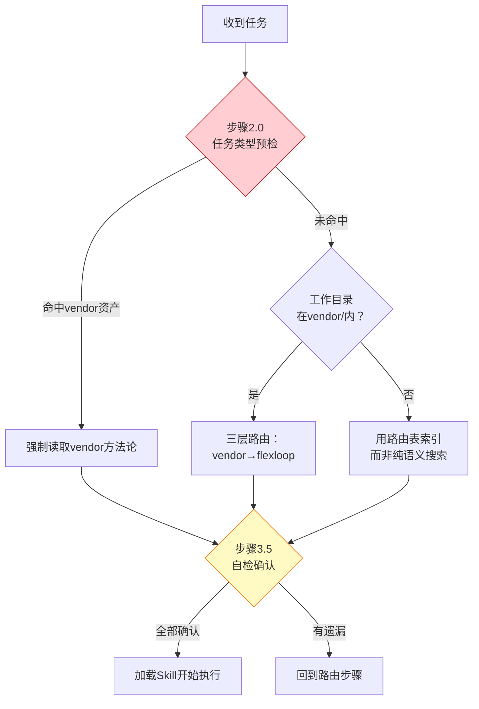
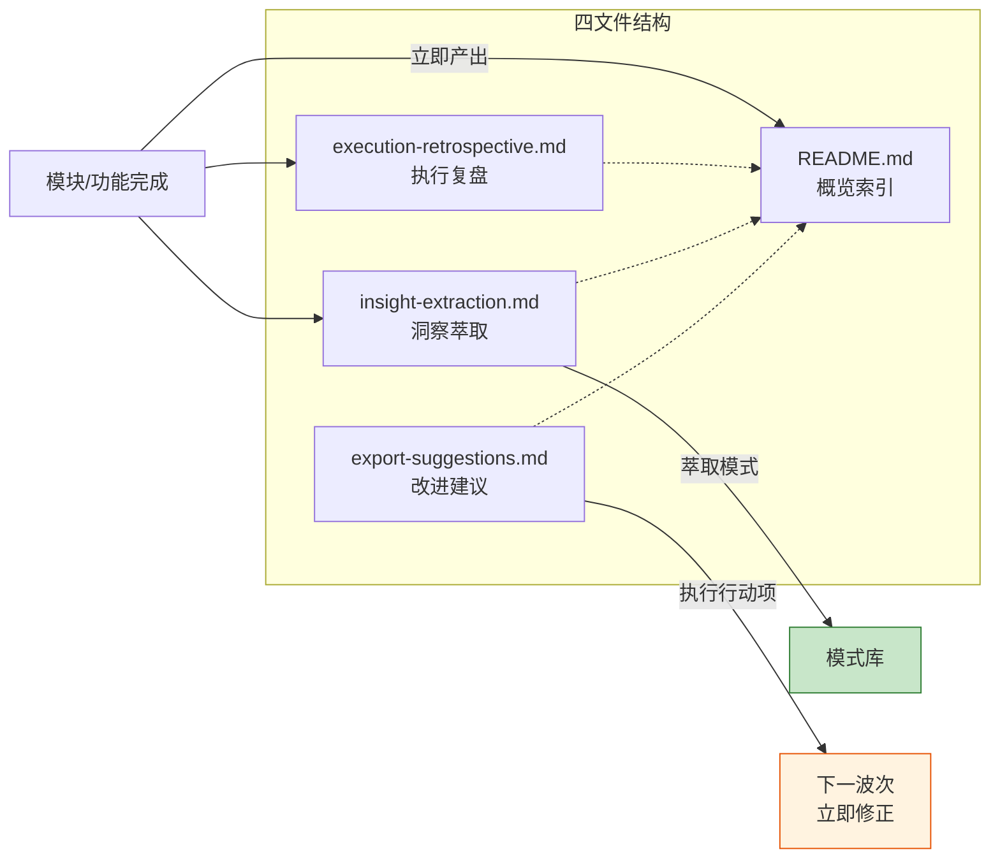
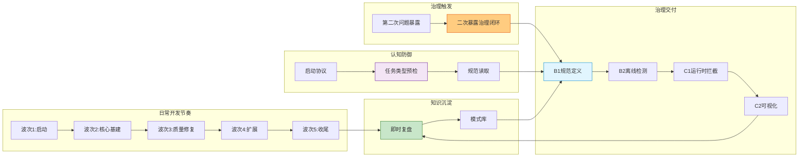

# SpecWeave 治理方法论体系架构

## 一、背景与起源

### 1.1 产生背景

本方法论体系萃取自2026-06-29高密度开发日的实践经验。当日完成71次提交、41,279行净增代码/文档，涵盖治理体系建设、子模块协同、Skill系统、Bug治理闭环、自动化工具、竞品学习等7大主题。在如此高密度的产出下，质量保持稳定（fix占比11%处于健康区间），且当日萃取的模式在次日行动项执行中立即得到验证——这背后不是偶然，而是一套可复用的治理方法论在起作用。

### 1.2 核心洞察

高密度开发日的质量稳定性，来源于**治理基础设施的递进式建设**和**认知偏差的系统性防御**。当日实践验证了一个核心假设：好的治理不是"一步到位的强制执行"，而是"从共识到检测到拦截到可视化的渐进式沉淀"。

### 1.3 文档定位

本文档是SpecWeave治理方法论体系的**架构总览**（L2成熟度），定义核心模型和模式间关系。各模式的详细规范、操作步骤、正例反例见对应的模式文件。

---

## 二、核心架构：治理基建四层递进模型

### 2.1 模型定义

任何流程合规类治理机制（代码规范、文档规范、安全规范、提交规范等）的建设，必须遵循 **B1→B2→C1→C2** 的四层递进顺序，禁止跳层交付。

### 2.2 各层定义与验收标准

| 层级 | 名称 | 核心目标 | 交付物 | 验收标准 |
|------|------|---------|--------|---------|
| **B1** | 规范定义 | 建立共识 | 规则文档、正例反例、Why解释 | ① 规范完整发布 ② 正例反例清晰 ③ 团队共识建立 |
| **B2** | 离线检测 | 安全验证 | 检查脚本、分析工具、--demo模式 | ① 能准确识别违规 ② 有误报率数据 ③ 不阻断正常流程 |
| **C1** | 运行时拦截 | 强制执行 | 运行时门面、拦截器、GuardrailRuntime | ① B2验证≥1周无误报 ② 有审批绕过机制 ③ 拦截信息可行动 |
| **C2** | 可视化仪表盘 | 反馈闭环 | 聚合报表、趋势图、合规率 | ① 多会话日志聚合 ② 趋势可视化 ③ 支持决策改进 |

### 2.3 Why有效

- **规范层是共识基础**：没有B1的明确定义，B2检测无依据，容易产生"凭什么说我错了"的抵触
- **离线层是安全网**：B2先在事后/CI中验证检测能力，不直接拦截生产流程，给团队适应期
- **运行时层是强制执行**：C1需要B2验证无误后再上线，避免误拦截导致生产力下降
- **可视化层是反馈闭环**：C2让团队看到治理效果，用数据证明治理价值，形成正向激励

### 2.4 反模式

| 反模式 | 表现 | 后果 |
|--------|------|------|
| **跳层到C1** | 规范刚写完就上运行时拦截 | 误拦截多、团队抵触、绕过机制泛滥 |
| **B2无demo** | 检测脚本没有演示模式，只能在真实违规时触发 | 难以验证正确性，调试成本高 |
| **C1无审批** | 运行时拦截没有例外审批通道 | 紧急情况下只能禁用整个守卫 |
| **只有B1** | 写完规范就完事，没有工具支撑 | 规范成为一纸空文，遵守靠自觉 |

### 2.5 阶段守卫自身案例

阶段守卫（Stage Guardrails）机制的建设过程本身就是四层模型的验证案例：

1. **B1**：[stage-guardrails.md](../../.agents/rules/stage-guardrails.md) 定义8阶段边界、拦截规则、SG-LOG格式
2. **B2**：[check-stage-guardrails.py](../../.agents/scripts/check-stage-guardrails.py) 离线分析SG-LOG日志，`--demo`模式演示
3. **C1**：[check-stage-guardrail-runtime.py](../../.agents/scripts/check-stage-guardrail-runtime.py) + `lib/stage_guardrails/`(4734行)运行时门面
4. **C2**：[generate-sg-dashboard.py](../../.agents/scripts/generate-sg-dashboard.py) HTML可视化仪表盘

**四层在2小时内一气呵成，但严格按B1→B2→C1→C2顺序交付，未跳层。**

---

## 三、围绕核心模型的5个元洞察模式

治理四层递进模型是核心骨架，以下5个模式从不同维度支撑这个骨架有效运转：

### 3.1 治理闭环维度：二次暴露触发治理闭环

**模式ID**：second-exposure-governance-loop（L2成熟度）

**核心思想**：第一次修复是解决症状，第二次暴露是系统在提醒你——这不是偶然问题，而是系统性缺陷。同一领域出现第二次问题时，必须停止点修复，启动治理闭环。

**六步流程**：

| 步骤 | 动作 | 交付物 |
|------|------|--------|
| ①停止点修复 | 不再做"改完这个bug就完事"的思维，承认这是系统问题 | 决策记录 |
| ②根因分析 | 找到问题本质，而非表面症状 | Why-Why分析到第3-5层 |
| ③制定预防方案 | 按四层模型规划治理路径 | B1/B2/C1/C2分层计划 |
| ④实现预防工具 | 安全模板、检测脚本、约束机制 | 至少B1+B2交付 |
| ⑤知识沉淀 | 萃取为可复用模式入库 | 模式文件+操作指南 |
| ⑥提交标记 | 提交信息包含`[governance-loop]`标识 | Git历史可追溯 |

**触发条件**：
1. 同一文件中发现第二个独立问题
2. 同一功能模块内发现第二个同类问题
3. 不同位置但根因相同的问题第二次出现
4. 修复过的问题以变体形式再次出现（回归）

**验证案例**：Mermaid渲染bug的治理过程：
- 第一次修复（5a17eed）：仅改换行符`\n`→` `（点修复）
- 第二次暴露（7f302a0）：发现Markdown list解析冲突问题
- 触发治理闭环：根因分析→安全模板→检测工具→操作指南→模式萃取→Mermaid治理成熟度达L3

详细模式文档：[second-exposure-governance-loop.md](../retrospective/patterns/methodology-patterns/retrospective-knowledge/second-exposure-governance-loop.md)

### 3.2 节奏维度：波次式工作日节奏

**模式ID**：wave-workday-rhythm（L1成熟度，经验模式）

**核心思想**：高密度工作日不是均匀产出，而是呈现"问题驱动→基建深化→质量修复→能力扩展→回顾补漏"的五波次节奏。识别和利用波次峰值期做核心工作，谷期做修复和同步，比追求均匀产出更高效。

**五波次模型**：

| 波次 | 时间段特征 | 适合做什么 | 不适合做什么 |
|------|-----------|-----------|-------------|
| 波次1 | 早间启动（刚进入状态） | 问题修复、轻量基建启动、昨日遗留 | 大规模架构设计 |
| 波次2 | 上午深度工作（认知峰值） | 核心基建深化、复杂功能开发 | 琐碎bug修复、格式调整 |
| 波次3 | 午间低谷（精力下降） | 质量修复、链接检查、格式统一 | 新功能开发、架构决策 |
| 波次4 | 下午第二峰值（休息后恢复） | 新领域扩展、多线并行、第二大模块 | 不需要太多思考的机械工作 |
| 波次5 | 晚间回顾（背景加工后输出） | 思维沉淀后的快速输出、补漏收尾 | 需要长时间深度思考的任务 |

**Why有效**：
- 符合认知科学：深度工作→修复→新深度工作的节奏匹配注意力周期
- 波次3的修复是自然节奏：大规模基建后质量债务必然暴露，主动修复优于被动积累
- 波次5的高密度体现"背景加工效应"：白天问题在潜意识中处理，晚间形成清晰方案后快速输出

详细模式文档：[wave-workday-rhythm.md](../retrospective/patterns/methodology-patterns/retrospective-knowledge/wave-workday-rhythm.md)

### 3.3 认知防御维度：任务类型预检防偏差

**模式ID**：task-type-precheck-bias-defense（L2成熟度）

**核心思想**：AI Agent存在系统性认知偏差——"就近直觉偏差"（Proximity Intuition Bias）：语义搜索天然倾向于返回工作目录附近的文件，导致"在错误的地方找答案"。需要显式的防御机制对抗这种隐性偏差。

**四层防御机制**：

| 防御层 | 机制 | 具体做法 |
|--------|------|---------|
| 第1层 | **任务类型预检**（启动协议步骤2.0） | 在文件搜索前先检查任务类型是否命中vendor方法论资产，命中则强制读取 |
| 第2层 | **三层路由强制** | SpecWeave→vendor→flexloop嵌套路由，目录在vendor/内必须先读vendor/AGENTS.md |
| 第3层 | **索引表而非搜索** | 用结构化路由表和资产索引替代语义搜索的"就近直觉" |
| 第4层 | **自检检查点**（启动协议步骤3.5） | 加载Skill前逐项确认：任务类型是否命中vendor？所有相关规范是否已读？ |

**Why重要**：在跨项目/多模块协作场景下，如果只依赖语义搜索，Agent很容易锚定到工作目录附近的文件，而忽略其他位置更权威的规范来源（如vendor/flexloop中更成熟的Skill开发方法论）。路由表作为"显式知识地图"可以对抗这种隐性偏差。

**验证案例**：本方法论体系的落地执行本身就验证了这一模式——执行行动项前，先按步骤2.0检查任务类型，命中Skill开发则读取vendor/flexloop中的skill-creator/SKILL.md，而非直接在SpecWeave主权区凭经验编写。

详细模式文档：[task-type-precheck-bias-defense.md](../retrospective/patterns/methodology-patterns/ai-collaboration/task-type-precheck-bias-defense.md)

### 3.4 知识沉淀维度：即时复盘沉淀

**模式ID**：immediate-retrospective-sedimentation（L2成熟度）

**核心思想**：每个独立模块/功能完成后，立即用轻量模板产出复盘，而非等到周末/里程碑统一复盘。即时复盘保证上下文新鲜度，反馈可以在下一波次立即生效。

**四文件标准结构**：

每个即时复盘目录包含四个文件，职责清晰分离：

| 文件 | 职责 | 内容 |
|------|------|------|
| **README.md** | 概览索引 | 基本信息、全景图、交付物清单、时间线 |
| **execution-retrospective.md** | 执行复盘 | 阶段划分、关键决策、成功因素、瓶颈问题 |
| **insight-extraction.md** | 洞察萃取 | 元洞察、可复用模式、关键数据发现 |
| **export-suggestions.md** | 改进建议 | P0/P1/P2行动项、后续跟进矩阵 |

**前提条件**：复盘模板和流程必须足够轻量化（四文件标准结构+脚本辅助），否则"每次开发后都写复盘"会成为负担而非助力。

**优势验证**：
- **上下文新鲜度**：刚完成的工作记忆清晰，细节不丢失
- **反馈即时性**：复盘发现的问题可以在下一波次立即修正（如Mermaid点修复→治理闭环）
- **模式萃取时效性**：当天萃取的模式可以当天被其他模块复用
- **降低认知负荷**：不需要事后回忆大量细节，每次复盘聚焦单一主题

详细模式文档：[immediate-retrospective-sedimentation.md](../retrospective/patterns/methodology-patterns/retrospective-knowledge/immediate-retrospective-sedimentation.md)

---

## 四、模式间协作关系

### 4.1 治理生命周期视图

### 4.2 自反性验证

本方法论体系最有力的验证是**自反性**（Self-Reference）——这些模式在06-30行动项执行中被立即应用于自身落地：

| 模式 | 如何应用于自身落地 |
|------|-------------------|
| **治理四层递进模型** | A1行动项（四层模型入规范）按B1→B2顺序交付——先写规范章节(B1)，再增加检测脚本(B2)，未直接上C1拦截 |
| **二次暴露治理闭环** | A2行动项（建立二次暴露检查点）本身就是Mermaid问题二次暴露后触发的治理闭环产物 |
| **波次式工作日节奏** | 次日行动项执行形成"波次6：复盘后跟进"，验证了模型可扩展性 |
| **任务类型预检** | 开始执行前按步骤2.0检查，确认本次治理机制建设任务类型 |
| **即时复盘沉淀** | 行动项完成后立即更新四文件状态，本架构文档在执行当日完成 |

---

## 五、落地状态与成熟度

### 5.1 各组件落地状态（截至2026-06-30）

| 组件 | 层级 | 成熟度 | 状态 | 位置 |
|------|------|--------|------|------|
| 治理四层递进模型 | 核心架构 | L2 | ✅ 已纳入规范 | [stage-guardrails.md](../../.agents/rules/stage-guardrails.md) |
| 四层跳层检测 | B2工具 | L2 | ✅ 已实现 | [check-stage-guardrails.py](../../.agents/scripts/check-stage-guardrails.py) |
| 二次暴露治理闭环 | 治理触发 | L2 | ✅ 已纳入检查点 | [pre-document-reading.md](../../.agents/protocols/pre-document-reading.md) |
| code-review治理闭环检查 | B2检查 | L1 | ✅ 已加入清单 | [code-review.md](../../.agents/workflows/code-review.md) |
| 波次式工作日节奏 | 节奏模式 | L1 | ✅ 已入库（待多日验证） | [wave-workday-rhythm.md](../retrospective/patterns/methodology-patterns/retrospective-knowledge/wave-workday-rhythm.md) |
| 任务类型预检 | 认知防御 | L2 | ✅ 已在启动协议中执行 | [task-type-precheck-bias-defense.md](../retrospective/patterns/methodology-patterns/ai-collaboration/task-type-precheck-bias-defense.md) |
| 即时复盘沉淀 | 知识沉淀 | L2 | ✅ 已在执行中验证 | [immediate-retrospective-sedimentation.md](../retrospective/patterns/methodology-patterns/retrospective-knowledge/immediate-retrospective-sedimentation.md) |
| 提交粒度预警 | B2工具 | L1 | ✅ 脚本完成，待CI集成 | [check-commit-size.py](../../.agents/scripts/check-commit-size.py) |
| CMD-LOG遵循度 | B1规范 | L2 | ⏳ B1刚完成，待稳定后建B2 | [cmd-log-specification.md](../../.agents/rules/cmd-log-specification.md) |
| CI编码安全 | B2/B1 | L2 | ✅ 跨平台设置完成 | [ci-check.ps1](../../.agents/scripts/ci-check.ps1)/[ci-check.sh](../../.agents/scripts/ci-check.sh) |

### 5.2 成熟度说明

| 成熟度 | 定义 | 本体系中的例子 |
|--------|------|---------------|
| **L1 经验模式** | 从单次或少数案例中萃取，未经充分验证 | 波次式工作日节奏（仅06-29单日观察） |
| **L2 可复用模式** | 多次案例验证，有正例反例，可指导执行 | 四层递进模型、二次暴露治理闭环 |
| **L3 领域最佳实践** | 长期验证，形成完整工具体系，团队共识 | Mermaid安全编码六规则 |
| **L4 强制执行** | 运行时拦截，违规无法提交 | 阶段守卫C1层（部分） |

---

## 六、应用指南

### 6.1 新治理机制建设Checklist

当需要建设新的治理机制时：

- [ ] **第一步：判断是否真的需要治理**——是偶发问题还是系统性问题？如果偶发，点修复即可；如果同一领域第二次出现，触发治理闭环
- [ ] **第二步：先写B1规范**——明确定义"什么是对的"、正例反例、Why解释，不要急于写代码
- [ ] **第三步：实现B2离线检测**——写检查脚本，必须有`--demo`模式，先在CI/本地运行，不阻断流程
- [ ] **第四步：验证至少1周**——收集误报数据，调整检测规则，确认无误报后再考虑C1
- [ ] **第五步（可选）：C1运行时拦截**——必须有审批绕过机制，拦截信息必须可行动（告诉用户怎么改）
- [ ] **第六步（可选）：C2可视化**——聚合多会话数据，展示合规趋势，用数据证明治理价值
- [ ] **第七步：知识沉淀**——萃取为模式入库，更新架构文档

### 6.2 日常开发节奏建议

- 波次2（上午峰值）安排核心基建/复杂任务
- 波次3（午间低谷）主动做质量修复、链接检查、格式统一
- 波次4（下午第二峰）安排新领域/多线并行任务
- 晚间（波次5）可以快速输出白天思考成熟的内容，但不要强行安排新的深度思考任务
- 每个模块完成后立即做四文件复盘，不要等"全部做完再说"

### 6.3 常见误区

| 误区 | 正确做法 |
|------|---------|
| "规范写完了，大家要遵守" | 规范只是B1，需要配套B2检测工具，否则规范是空文 |
| "这个问题烦了很久，直接上C1强制拦截" | 跳层会导致大量误拦截和团队抵触，必须经过B2验证 |
| "今天产出不均匀，上午太猛下午太松" | 不均匀是正常的认知节奏，识别峰值谷期比强行均匀更高效 |
| "等周末/里程碑再写复盘" | 等周末时细节已经丢失了，即时复盘质量高且反馈快 |
| "用grep/semantic search找相关规范" | 优先用结构化路由表，搜索容易被就近文件锚定 |

---

## 七、参考索引

### 7.1 核心规范文档

| 文档 | 说明 |
|------|------|
| [AGENTS.md](../../AGENTS.md) | 智能体全局契约与启动协议 |
| [.agents/rules/stage-guardrails.md](../../.agents/rules/stage-guardrails.md) | 阶段守卫规则定义（含四层递进模型章节） |
| [.agents/protocols/pre-document-reading.md](../../.agents/protocols/pre-document-reading.md) | 前置文档强制读取协议（含二次暴露检查点） |
| [.agents/rules/cmd-log-specification.md](../../.agents/rules/cmd-log-specification.md) | CMD-LOG结构化日志规范 |

### 7.2 工具脚本

| 脚本 | 层级 | 说明 |
|------|------|------|
| [check-stage-guardrails.py](../../.agents/scripts/check-stage-guardrails.py) | B2 | 阶段守卫日志离线分析（含四层跳层检测） |
| [check-commit-size.py](../../.agents/scripts/check-commit-size.py) | B2 | 提交粒度预警（四级阈值分级） |
| [generate-sg-dashboard.py](../../.agents/scripts/generate-sg-dashboard.py) | C2 | SG日志可视化仪表盘 |
| [check-stage-guardrail-runtime.py](../../.agents/scripts/check-stage-guardrail-runtime.py) | C1 | 阶段守卫运行时门面 |

### 7.3 模式文件

| 模式 | 分类 | 成熟度 |
|------|------|--------|
| [governance-four-layer-progressive.md](../retrospective/patterns/methodology-patterns/governance-strategy/governance-four-layer-progressive.md) | governance-strategy | L2 |
| [second-exposure-governance-loop.md](../retrospective/patterns/methodology-patterns/retrospective-knowledge/second-exposure-governance-loop.md) | retrospective-knowledge | L2 |
| [wave-workday-rhythm.md](../retrospective/patterns/methodology-patterns/retrospective-knowledge/wave-workday-rhythm.md) | retrospective-knowledge | L1 |
| [task-type-precheck-bias-defense.md](../retrospective/patterns/methodology-patterns/ai-collaboration/task-type-precheck-bias-defense.md) | ai-collaboration | L2 |
| [immediate-retrospective-sedimentation.md](../retrospective/patterns/methodology-patterns/retrospective-knowledge/immediate-retrospective-sedimentation.md) | retrospective-knowledge | L2 |

### 7.4 溯源报告

本文档萃取自：[retrospective-daily-20260629-full-day](../retrospective/reports/project-governance/retrospective-daily-20260629-full-day/)
