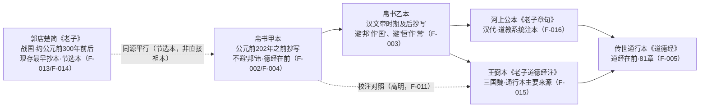

# 版本体系对照

要理解帛书《老子》的价值，先要把它放进《老子》流传的版本谱系里看待。《老子》的文本并非一成不变：从战国竹简、汉初帛书，到汉魏晋的传世注本，文本经历了结构、文字与风格的多重演变。本章以「版本谱系—结构差异—文字差异—差异成因」四层展开，帮助读者建立清晰的版本坐标，为后续章节（核心概念解读、注读方法论）奠定基础。

本章的核心理念可先以一条洞察概括：**帛书本的价值在于"更早"，而不等于"更正确"**——版本之间是演进关系而非优劣关系（I-001）。带着这一认识阅读各版本，差异本身就会成为理解历史的信息，而非需要"纠正"的错误。

## 版本谱系：从楚简到通行本

目前《老子》的版本体系主要由五类文本构成：**郭店楚简本、帛书甲本、帛书乙本**三个出土文本，以及**王弼本、河上公本**两个传世注本系统（F-013/014/015/016）。此外，高明《帛书老子校注》以帛书甲乙本为底本、王弼本为主校本（F-011），是沟通出土文本与传世文本的重要校勘桥梁。

### 版本谱系图

> 注：图中的时间关系是**郭店楚简最早、帛书次之、传世注本最晚**。郭店楚简虽直到 1993 年才出土（F-013），却是现存最早的《老子》抄本，早于马王堆帛书约百年（F-013）。这与"先传世、后出土"的认知顺序恰好相反——越晚被发现的文本，往往越古老。

### 各版本对照表

| 版本 | 抄写/成书时代 | 结构 | 主要特点 | 事实来源 |
|---|---|---|---|---|
| 郭店楚简《老子》 | 战国中期（约公元前 300 年前后） | 节选本（约 2000 字），分甲、乙、丙三组 | 现存最早《老子》抄本，早于帛书约百年；内容较帛书与传世本简略；章次文字均有差异 | F-013、F-014 |
| 帛书甲本 | 刘邦称帝（公元前 202 年）之前 | 德经在前、道经在后；无篇名章名，仅分章符标示 | 不避"邦"讳；虚词丰富、文字古奥；残损较多 | F-002、F-004、F-017、F-010 |
| 帛书乙本 | 汉文帝（前 179—157 年）在位及其后 | 德经在前、道经在后；无篇名章名 | 避"邦"作"国"、避"恒"作"常"；较甲本完整，宜通读 | F-003、F-004、F-017 |
| 河上公本《老子章句》 | 汉代（道教系统，托名河上公） | 道经在前、德经在后；81 章 | 道教系统注本，与王弼本并存的另一重要传世注本系统 | F-016、F-005 |
| 王弼本《老子道德经注》 | 三国魏王弼（226—249 年） | 道经在前、德经在后；上篇道经 37 章、下篇德经 44 章，共 81 章 | 魏晋玄学代表性注本；通行本《道德经》的主要来源 | F-015、F-005 |

### 甲乙本的各自定位

同为汉初出土文本，甲乙本的定位并不相同：

- **甲本——断代与结构研究的核心证据**：甲本不避"邦"讳（F-002），证明《老子》在刘邦称帝前已定型为"德经在前"结构（F-004）。它的价值主要在于断代证据，而非提供最易读的文本（I-004）。甲本残损较多、文字古奥（F-010），作为"阅读文本"反不如乙本或整理本友好。
- **乙本——相对完整，宜于通读**：乙本避"邦"作"国"、避"恒"作"常"（F-003），说明其抄写于汉文帝时期及其后，文本相对完整，更适合作为通读底本（I-004）。

> **反常识提示（I-004）**："最早"与"最宜读"是两回事。甲本虽然最早，但残损与古奥使其不适合当作入门读物；研究断代与结构宜读甲本，通读文本宜用乙本或整理本。

## 结构差异：德经在前与道经在前

帛书《老子》与传世本之间最显眼的结构差异，是**篇序的颠倒**：帛书甲乙本均以《德经》在前、《道经》在后（F-004），而传世王弼本系统则"道经在前、德经在后"（F-005），后世习惯的开篇"道可道，非常道"正是道经第一章。

### 结构对照表

| 对比项 | 帛书甲乙本 | 传世通行本（王弼本系统） | 事实来源 |
|---|---|---|---|
| 编排顺序 | 德经在前、道经在后 | 道经在前、德经在后 | F-004、F-005 |
| 分章方式 | 德经约 44 段、道经约 37 段；无篇名章名，仅以分章符（黑点）标示 | 上篇《道经》37 章、下篇《德经》44 章，共 81 章，有章名 | F-006、F-017、F-005 |
| 内容对应 | 帛书德经 ↔ 传世本下篇（德经） | 帛书道经 ↔ 传世本上篇（道经） | F-018、F-019 |

可见，帛书与传世本的分章**内容大致对应**（F-018/019），主要区别在于排列先后与分章形式——帛书以符号分章、无章名（F-017），传世本则以章名与数字分章（F-005）。

### 两种阅读顺序的含义

篇序不同，不只是排版问题，更暗示了两种不同的阅读路径（I-002）：

- **"德经在前"——从实践进入本体**：帛书结构提示早期读者可能先读"上德不德"（德经首章），从实践性的"德"入手，再进入本体性的"道"。这与"由用达体"的中国哲学进路一致（I-002）。
- **"道经在前"——从本体统摄实践**：传世本让后世习惯从"道可道，非常道"进入老子，先立"道"这一最高本体，再下贯到"德"。这是玄学化、形上学化之后的主流读法（I-002）。

> 帛书揭示早期《老子》以"德"为入手、以"道"为归宿，而传世本以"道"开篇。两种顺序对应两种理解框架，并无绝对优劣——这正是版本对照阅读的价值所在（I-002）。

## 文字差异精选

除了结构，帛书与传世本在具体文字上也有大量差异。下表精选最典型、也最影响阅读理解的几组（F-007/008/009/010 及同类虚词现象）。

### 文字差异对照表

| 帛书文字 | 传世本文字 | 例证 | 成因 | 事实来源 |
|---|---|---|---|---|
| 大器免成 | 大器晚成 | 帛书乙本作"大器免成"，传世本作"大器晚成" | 文字演变/音近通假（"免"或为"晚"之借字，学界有争议）的经典案例 | F-007 |
| 恒 | 常 | "道可道，非恒道也" vs "道可道，非常道" | 避汉文帝刘恒讳 | F-008 |
| 邦 | 国 | 帛书用"邦"处，传世本多作"国" | 避汉高祖刘邦讳 | F-009 |
| 虚词增损（也/者/矣） | 虚词较少 | "道可道也，非恒道也"多出"也"字 | 帛书保留更多战国/汉初书面语特征，传世本趋于精简 | F-010 |
| 弗 | 不 | 如"知者弗言，言者弗知" vs "知者不言，言者不知" | 否定副词风格差异，属虚词/古语词风格一类（参 F-010） | 版本校勘共识（参 F-010） |

几组差异各具典型意义：

- **大器免成/晚成（F-007）**：帛书乙本作"免"，传世本作"晚"，学界对"免"是否为"晚"之借字、抑或别有义涵仍有讨论。它提示出土文本的"异文"未必是传世本的错误，也可能传世本源于对帛书文字的某种读法。
- **恒→常、邦→国（F-008/009）**：属于典型的**避讳改字**——为回避帝王名讳而系统性替换文字，是版本差异中最可解释、也最有历史信息量的一类。
- **虚词增损与弗/不（F-010）**：帛书虚词丰富、多用"弗"，保留更接近上古汉语的形态；传世本删削虚词、改用"不"，文本趋于精炼文雅。

> **反常识提示（I-003）**：同一句话在不同版本中"看起来不同"，这不是"错误"，而是语言演变的正常痕迹。"道可道，非常道"在帛书作"非恒道也"，多出的"也"字与"恒"改"常"的避讳，本身就是历史信息——版本差异即史料。

## 版本演进：为何会有这些差异

综合以上，版本差异主要源于三类机制：

### 1. 避讳制度（文字替换）

中国古代有回避帝王名讳的书写制度，抄写者需以他字替代讳字。帛书乙本避汉高祖"邦"讳改"国"、避汉文帝"恒"讳改"常"（F-003），传世本沿袭了这一改动（F-008/009）。避讳既是判定抄写时代的工具（F-002/003），也是产生文字差异的主要来源。

### 2. 传抄与整理（结构重组）

- 抄写过程本身即在"再创造"：帛书甲乙本虽同出汉初，二者已存在差异（F-002 vs F-003），更早的郭店楚简又与二者皆不同（F-014），证明不存在单一"原始本"（I-001）。
- 后世整理者对文本进行了结构化改造：帛书以分章符标示段落、无篇名章名（F-017），传世本则定型为 81 章并有章名（F-005）；篇序也由"德经在前"翻转为"道经在前"（F-004/005）。
- "大器免成"vs"大器晚成"（F-007）一类异文，则是文字在反复传抄中的自然演变（"免"或为"晚"之音近借字，学界有争议）。

### 3. 虚词风格（语言代际差异）

帛书保留了更多战国至汉初的书面语特征，虚词"也""者""矣"丰富（F-010），否定副词多用"弗"；传世本在长期流传与文人整理中删削虚词、改用"不"，语言趋于精炼。这反映的不是"对错"，而是不同时代的语言风格（I-001）。

> **小结（I-001）**：帛书并非"标准答案"，而是版本演进的一个环节。将差异归因于避讳、传抄、语言风格三类机制，才能跳出"哪个对"的执念，把版本当作历史信息来读。具体的"版本对照阅读法"见第 06 章（可复用模式）。

## 延伸

- [历史背景与出土](01-background.md)：马王堆出土与甲乙本抄写时代判定
- [核心概念解读](03-core-concepts.md)：帛书用字差异带来的义理差异
- [核心洞察](05-key-insights.md)：版本差异背后的反常识认识（I-001~I-005）
- [可复用模式](06-patterns.md)：版本对照阅读法、出土文献认知框架
