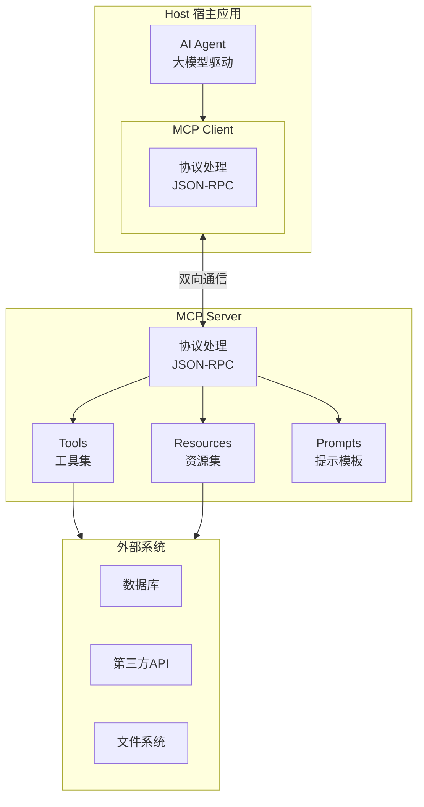
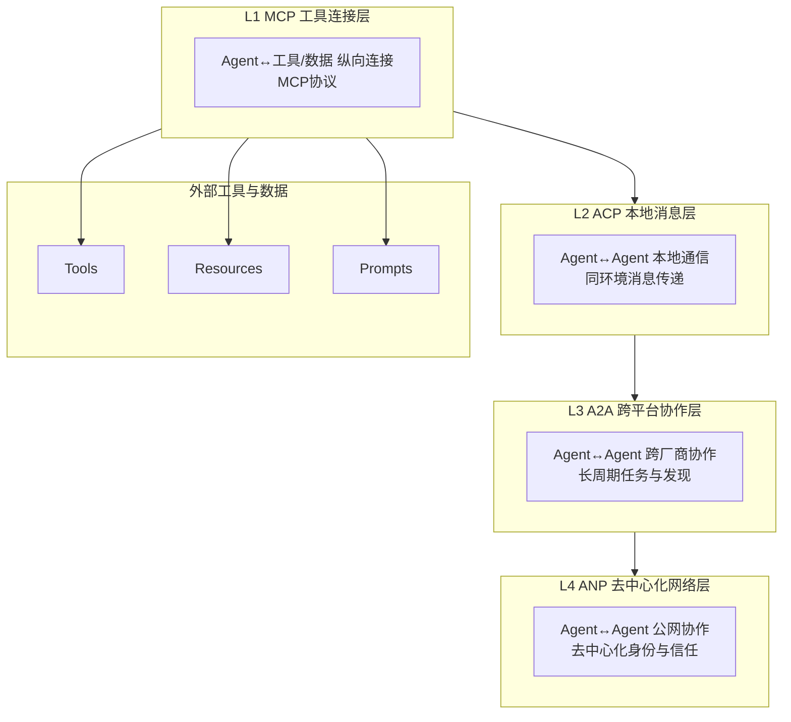
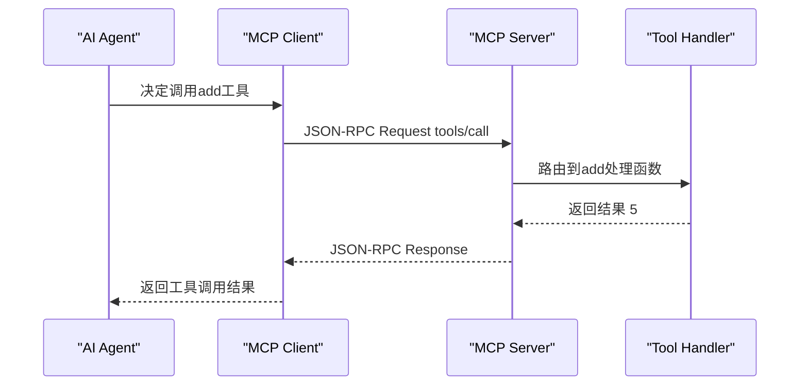

# 01、MCP协议详解：Model Context Protocol

## 1.1 MCP概览

**Model Context Protocol（MCP，模型上下文协议）** 由Anthropic于2024年11月发布，2025年捐赠给Linux基金会进行中立治理。MCP是Agent生态中最成熟、应用最广泛的连接协议。

### 核心定位

MCP的核心定位：**Agent与外部工具/数据连接的"USB-C接口"，纵向连接层**。它统一了Agent调用工具、读取数据、使用提示模板的方式，实现"一个MCP Server，任何MCP Client都能连接"。

| 属性 | 详情 |
|------|------|
| 发布时间 | 2024年11月 |
| 发起方 | Anthropic |
| 治理机构 | Linux基金会 |
| 协议层级 | L1 工具连接层 |
| 消息格式 | JSON-RPC 2.0 |
| 当前状态 | 生产就绪 |

## 1.2 核心定位与设计理念

### 为什么需要MCP

在MCP出现之前，每个Agent框架都有自己的工具定义和调用方式，导致N×M集成问题：
- 工具生态碎片化，同一工具需为不同框架重复开发适配器
- 切换框架成本高，需重写所有工具集成代码
- 用户需为不同Agent客户端分别配置工具

### MCP解决什么问题

通过标准化Client-Server架构，将"提供能力"与"使用能力"分离：
- **MCP Server端**：工具/数据提供者只需实现一次
- **MCP Client端**：任何支持MCP的应用可直接连接使用
- **即插即用**：配置Server地址即可使用所有能力

### 设计理念

简单优先（JSON-RPC 2.0）、能力发现、传输无关、安全第一（OAuth 2.1）、语言无关。

## 1.3 三大核心原语（Primitives）

### 1.3.1 Tools（工具）

可执行函数，Agent可主动调用以执行操作。

**用途**：写操作、调用API、计算、触发副作用。
**场景**：发邮件、查数据库、写文件、执行代码。

```typescript
{ name: "send_email", description: "发送电子邮件",
  inputSchema: { type: "object",
    properties: { to: { type: "string" }, subject: { type: "string" }, body: { type: "string" } },
    required: ["to", "subject", "body"] } }
```

### 1.3.2 Resources（资源）

通过URI寻址的只读数据，Agent可读取获取上下文。

**用途**：读文件、查数据库记录、获取API响应。
**示例**：
```
file:///home/user/README.md
postgres://localhost/mydb/users/123
```

### 1.3.3 Prompts（提示模板）

可复用的指令模板，Server预定义，Client可调用。

**用途**：标准化常见任务提示词、封装领域知识。
**场景**：代码审查模板、文档总结预设提示。

### 三类原语对比

| 原语 | 类型 | 操作性质 | 典型标识 |
|------|------|---------|---------|
| Tools | 可执行函数 | 可读写/有副作用 | 工具名称 |
| Resources | URI寻址数据 | 只读 | URI格式 |
| Prompts | 模板 | 生成提示词 | 模板名称 |

## 1.4 架构设计

MCP采用Client-Server架构，划分Host、Client、Server三者职责。



### 架构组件

| 组件 | 职责 | 示例 |
|------|------|------|
| Host | 用户交互的应用，包含Agent和Client | Claude Code、Cursor、VS Code |
| MCP Client | Host内部，负责与Server通信 | IDE中的MCP客户端模块 |
| MCP Server | 提供Tools/Resources/Prompts能力 | 文件系统、GitHub、数据库Server |

## 1.5 传输协议

MCP支持三种传输方式：

| 传输方式 | 适用场景 | 性能 | 网络要求 | 规范状态 |
|---------|---------|------|---------|---------|
| **stdio** | 本地进程通信 | 最快 | 本地 | 稳定 |
| **Streamable HTTP** | 远程/生产部署 | 高 | HTTP网络 | 2025年3月新增 |
| **SSE** | 流式响应场景 | 中 | HTTP网络 | 稳定 |

### stdio（标准输入输出）

MCP Server作为子进程启动，通过stdin/stdout通信。零网络配置、延迟最低、安全性高，适用于本地开发、IDE插件、桌面应用。

### Streamable HTTP

2025年3月新增的生产级HTTP传输，基于标准HTTP POST，支持流式响应。易于穿透防火墙、支持负载均衡，适用于远程服务、云端部署、企业级场景。

### SSE（Server-Sent Events）

基于HTTP的服务器推送技术，支持服务端主动推送和流式输出，适用于长时任务、进度通知、日志流式输出。

## 1.6 消息格式

MCP基于**JSON-RPC 2.0**规范，包含三种消息类型：

| 消息类型 | 方向 | 需要响应 | 用途 |
|---------|------|---------|------|
| Request | 双向 | 是 | 发起方法调用 |
| Response | 双向 | - | 返回成功/错误结果 |
| Notification | 双向 | 否 | 单向通知（进度、日志） |

### Request示例

```json
{ "jsonrpc": "2.0", "id": 1, "method": "tools/call",
  "params": { "name": "read_file", "arguments": { "path": "/home/user/README.md" } } }
```

### Response示例（成功）

```json
{ "jsonrpc": "2.0", "id": 1, "result": { "content": [{ "type": "text", "text": "# My Project..." }] } }
```

### Response示例（错误）

```json
{ "jsonrpc": "2.0", "id": 1, "error": { "code": -32602, "message": "Invalid params" } }
```

## 1.7 能力发现机制

MCP内置自动化能力发现，Client可动态查询Server支持的能力。

### 核心发现方法

| 方法 | 用途 |
|------|------|
| `initialize` | 初始化连接，交换协议版本和能力 |
| `tools/list` | 获取所有工具列表 |
| `resources/list` | 获取所有资源列表 |
| `prompts/list` | 获取所有提示模板列表 |

### 发现流程

1. Client发送`initialize`，宣告协议版本和能力
2. Server返回`initialize`响应
3. Client发送`initialized`通知
4. Client调用`tools/list`等获取详细能力清单
5. Agent根据工具描述决定调用哪些工具

```json
{ "jsonrpc": "2.0", "id": 2, "result": { "tools": [
  { "name": "read_file", "description": "读取文件内容", "inputSchema": {} },
  { "name": "write_file", "description": "写入文件内容", "inputSchema": {} }
] } }
```

## 1.8 安全与认证

2025年6月规范更新强化了安全要求，OAuth 2.1成为远程部署强制要求。

### OAuth 2.1认证

远程HTTP Server强制使用OAuth 2.1：
- 授权流程：Authorization Code Flow + PKCE
- 令牌类型：Bearer Token，短期令牌+刷新令牌
- 权限范围：通过OAuth Scope精细控制访问能力

### 传输安全

| 传输方式 | 安全机制 |
|---------|---------|
| stdio | 本地进程通信，天然安全 |
| Streamable HTTP | 强制HTTPS、OAuth 2.1、CORS |
| SSE | 强制WSS加密 |

> 注：安全规范持续演进，生产部署请以最新官方安全文档为准。

## 1.9 MCP在协议栈中的位置

MCP是四层协议栈的最底层（L1），专注纵向连接，与ACP/A2A/ANP互补。



### 协议对比

| 协议 | 通信方向 | 解决问题 |
|------|---------|---------|
| **MCP** | 纵向连接 | Agent如何连接工具/数据 |
| **ACP** | 横向（本地） | 同环境Agent如何通信 |
| **A2A** | 横向（跨域） | 跨厂商Agent如何协作 |
| **ANP** | 横向（公网） | 开放网络Agent如何互信 |

## 1.10 生态现状

MCP是目前生态最成熟、应用最广泛的Agent通信协议。

### 客户端支持

Claude Desktop、Claude Code、Cursor、Windsurf原生支持，VS Code通过扩展支持。

### Server生态

数千个现成MCP Server可用，覆盖GitHub、Slack、PostgreSQL、Google Drive、Notion、Figma等主流服务。开发新MCP Server通常只需几十行代码。

### SDK覆盖

官方SDK支持Python、TypeScript、Go、Java；社区SDK支持Rust、C#。

## 1.11 快速示例

以下是极简MCP Server伪代码，展示工具注册模式（非完整可运行代码）。

```python
from mcp import Server

server = Server(name="simple-calculator", version="1.0")

@server.tool(
    name="add",
    description="计算两个数的和",
    input_schema={
        "type": "object",
        "properties": {
            "a": {"type": "number"},
            "b": {"type": "number"}
        },
        "required": ["a", "b"]
    }
)
async def add(a: float, b: float) -> float:
    return a + b

@server.resource(uri="file:///example/guide.txt")
async def get_guide() -> str:
    return "计算器MCP Server使用指南..."

if __name__ == "__main__":
    server.run(transport="stdio")
```

### 工具调用流程



## 1.12 章节导航

| 导航 | 链接 |
|------|------|
| 返回总览 | [Agent通信协议总览](../agent-communication-protocols-wiki.md) |
| 上一章 | [00、概述与背景](./00-overview.md) |
| **下一章** | [02、ACP协议详解：Agent Communication Protocol](./02-acp.md) |
