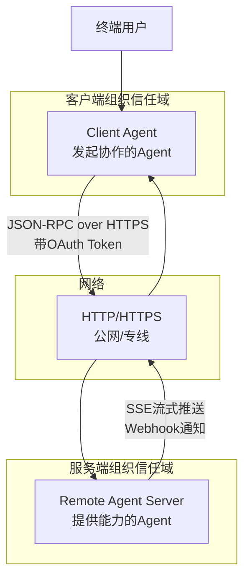
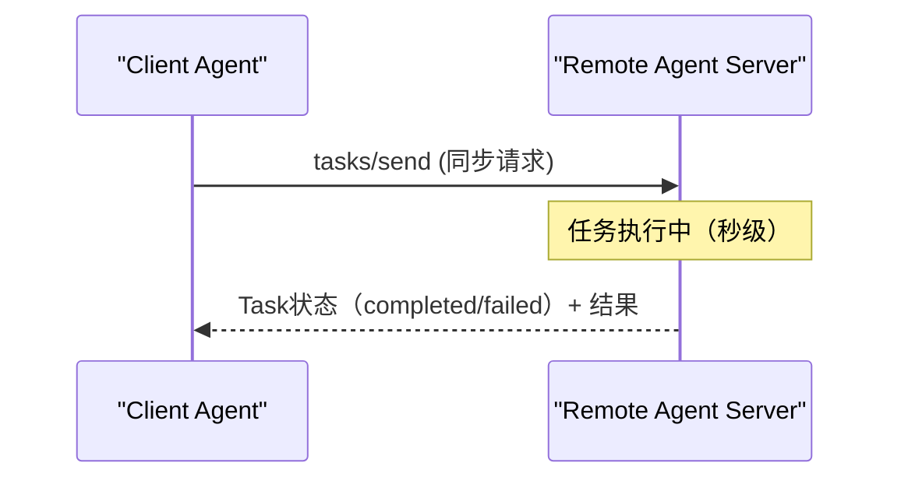
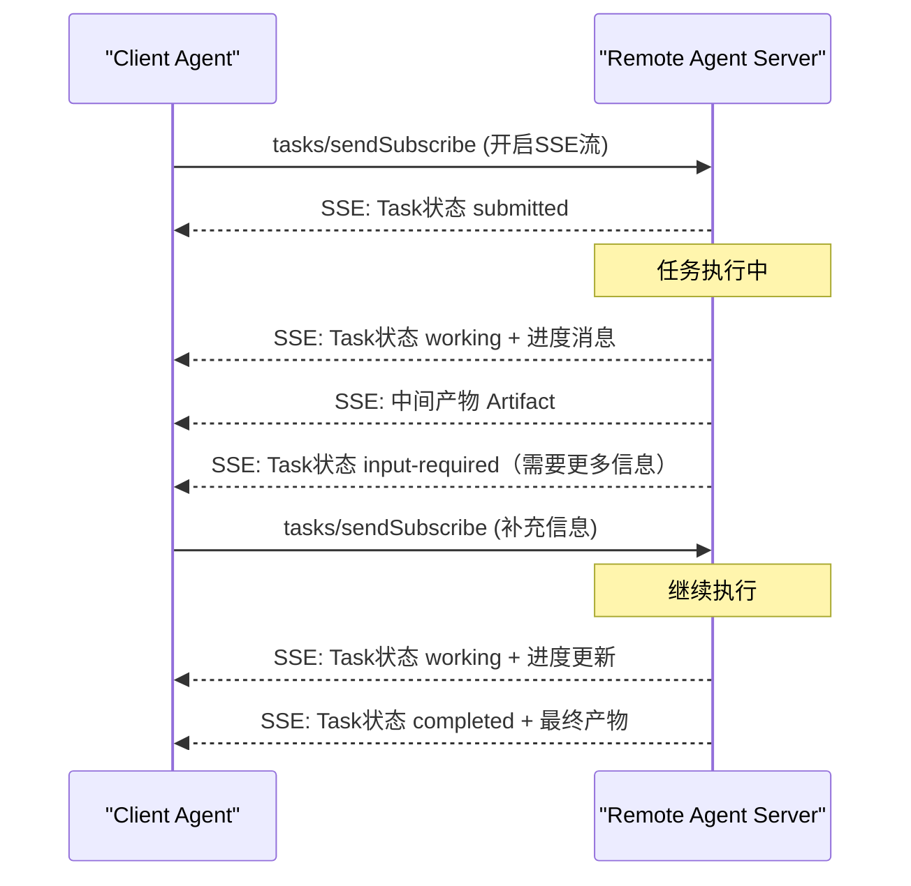
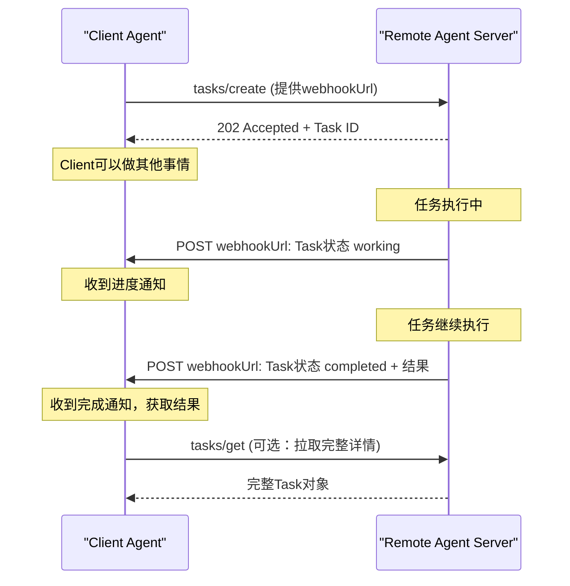
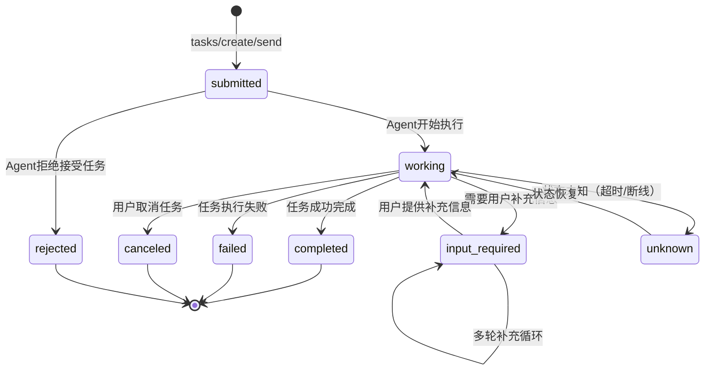
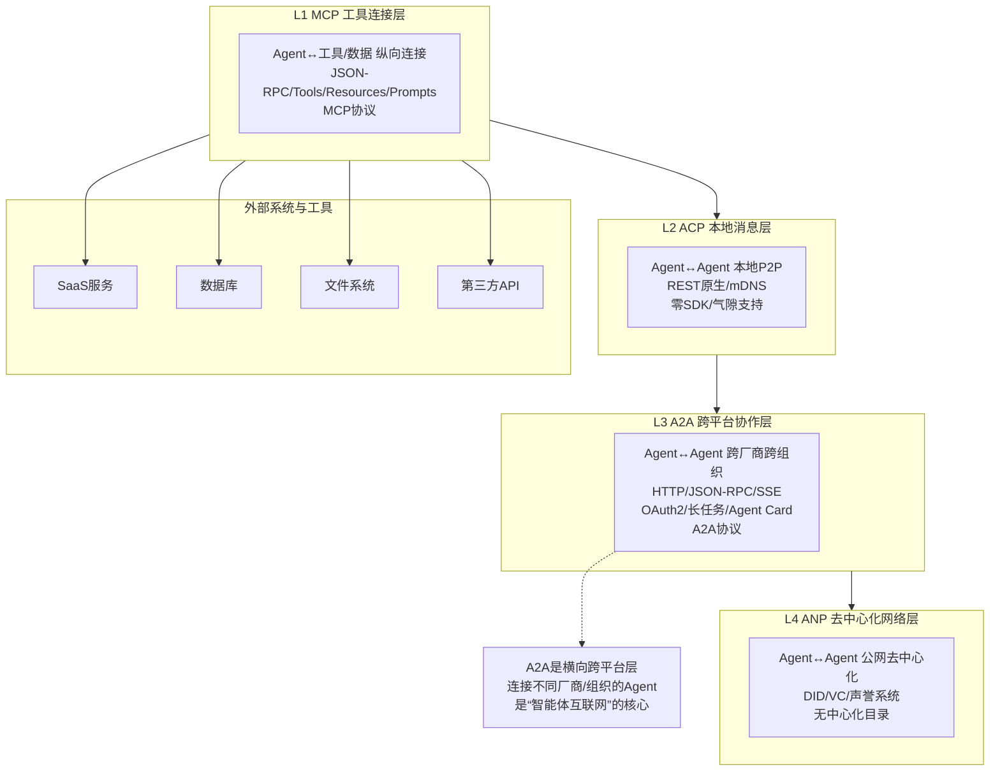

# 03、A2A协议详解：Agent-to-Agent Protocol

## 3.1 A2A概览

**Agent-to-Agent Protocol（A2A，智能体间协议）** 由Google于2025年4月在Cloud Next大会上正式发布，2025年6月捐赠给Linux基金会进行中立治理。A2A是目前生态合作伙伴最多、企业支持力度最大的跨Agent协作协议。

### 核心定位

A2A的核心定位：**跨厂商、跨平台、跨组织Agent协作的"智能体互联网的HTTP"，横向跨平台协作层**。它定义了Agent之间如何发现彼此、如何交换消息、如何协作完成长时任务，实现不同厂商开发的Agent无需定制集成即可互操作。

| 属性 | 详情 |
|------|------|
| 发布时间 | 2025年4月 |
| 发起方 | Google |
| 治理机构 | Linux基金会 |
| 协议层级 | L3 跨平台协作层 |
| 消息格式 | JSON-RPC 2.0 over HTTP |
| 架构模式 | Client-Server |
| 当前状态 | 快速增长，广泛采用 |

### 与HTTP的类比

A2A被业界类比为"Agent时代的HTTP"：
- HTTP解决了Web服务器之间如何通信的问题
- A2A解决了Agent之间如何通信的问题
- 两者都基于成熟的Web标准（HTTP、JSON）
- 两者都设计为跨平台、跨语言的开放标准

## 3.2 五大设计原则

A2A规范明确提出五大核心设计原则，贯穿整个协议设计。

### 3.2.1 拥抱智能体能力（Embrace Agentic Capabilities）

Agent不共享内部实现细节（如提示词、记忆结构、工具链），而是通过Agent Card声明自身能力，其他Agent基于能力描述进行协作。这确保了Agent的自主性和封装性，类似面向对象编程中的"封装"原则。

- **能力发现而非实现共享**：Agent只需知道对方"能做什么"，无需知道"怎么做"
- **支持非确定性交互**：Agent可以自主决策如何完成任务，不限于预定义函数
- **多轮对话原生支持**：任务可以包含多轮消息交换，而非单次请求响应

### 3.2.2 基于现有标准（Build on Existing Standards）

A2A不重新发明轮子，而是构建在经过验证的Web标准之上：

| 标准 | 用途 |
|------|------|
| HTTP/HTTPS | 传输层协议，强制要求 |
| JSON-RPC 2.0 | 消息格式与RPC语义 |
| Server-Sent Events（SSE） | 流式推送与实时更新 |
| OAuth 2.0 / OIDC | 认证与授权 |
| JSON | 数据序列化格式 |

这使得任何具备基本Web开发能力的团队都能快速实现A2A，无需学习新的专有协议。

### 3.2.3 默认安全（Secure by Default）

A2A从设计之初就将企业级安全内置到协议中：

- 生产部署强制HTTPS加密传输
- 内置OAuth 2.0/OIDC认证流程
- 支持企业级身份提供商（IdP）集成
- 细粒度权限控制与审计
- 凭证通过标准HTTP Header传递

### 3.2.4 支持长时任务（Support Long-Running Tasks）

不同于MCP主要面向短平快的工具调用，A2A原生支持小时级甚至天级的长时任务：

- Task是有状态对象，可持续存在
- 支持任务暂停、恢复、人工介入
- 实时进度推送机制
- 任务历史记录完整保留
- 支持中间产物输出

### 3.2.5 模态无关（Modality Agnostic）

A2A不绑定特定输入输出模态，支持丰富的内容类型：

- 纯文本消息
- 结构化JSON数据
- 文件（图像、文档、PDF、音频）
- 多部分混合消息
- 可扩展的自定义Part类型

Agent可以根据需要选择合适的模态，协议不做强制限制。

## 3.3 架构设计

A2A采用经典的Client-Server架构，但与MCP的工具调用模式不同——A2A的Server本身是一个完整的Agent，具备自主决策能力。



### 架构角色说明

| 角色 | 职责 | 示例 |
|------|------|------|
| **User** | 发起任务的终端用户或上层系统 | 企业员工、业务系统 |
| **Client Agent** | A2A客户端，代表用户发起任务请求 | 企业内部助理Agent、编排Agent |
| **Remote Agent Server** | A2A服务端，对外提供Agent能力 | Salesforce客服Agent、SAP ERP Agent |
| **网络层** | 穿越组织信任边界，需加密和认证 | 公网、企业专线、VPN |

### 与MCP架构的关键区别

- MCP Client连接的是**工具Server**（被动执行预定义函数）
- A2A Client连接的是**Agent Server**（具备自主决策能力的对等智能体）
- MCP调用是确定性的（调用工具X得到结果Y）
- A2A任务是非确定性的（Agent自主决定如何完成任务）

## 3.4 核心数据模型

A2A定义了五大核心对象，构成协议的数据模型基础。

### 3.4.1 Agent Card（Agent能力卡片）

Agent Card是A2A的服务发现元数据，类似Web领域的`sitemap.xml`或OpenAPI文档。它描述了Agent的基本信息、能力、技能和认证要求。

Agent Card通过标准的Well-Known URI发布：`/.well-known/agent.json`

**Agent Card示例：**

```json
{
  "name": "customer-support-agent",
  "description": "企业客服Agent，支持工单查询、问题解答、退换货处理",
  "url": "https://api.example.com/a2a",
  "version": "1.0.0",
  "capabilities": {
    "streaming": true,
    "pushNotifications": true,
    "stateTransitionHistory": true
  },
  "skills": [
    {
      "id": "ticket-query",
      "name": "工单查询",
      "description": "根据工单号或客户信息查询工单状态",
      "inputModes": ["text"],
      "outputModes": ["text", "json"]
    },
    {
      "id": "return-processing",
      "name": "退换货处理",
      "description": "处理客户退换货申请，需要上传凭证图片",
      "inputModes": ["text", "image"],
      "outputModes": ["text"]
    }
  ],
  "authentication": {
    "schemes": ["oauth2"],
    "oauth2": {
      "authorizationUrl": "https://auth.example.com/authorize",
      "tokenUrl": "https://auth.example.com/token",
      "scopes": ["ticket:read", "return:write"]
    }
  },
  "defaultInputModes": ["text"],
  "defaultOutputModes": ["text"],
  "organization": "Example Corp",
  "contactUrl": "https://example.com/contact"
}
```

**Agent Card核心字段说明：**

| 字段 | 类型 | 说明 |
|------|------|------|
| `name` | string | Agent唯一名称 |
| `description` | string | 人类可读的功能描述 |
| `url` | string | A2A服务端点URL |
| `version` | string | Agent版本号 |
| `capabilities` | object | 支持的协议特性（流式、推送通知等） |
| `skills` | array | Agent具备的技能列表 |
| `authentication` | object | 认证方式配置 |

### 3.4.2 Task（任务）

Task是A2A的核心交互单元，代表一个有状态的协作任务。与MCP的无状态工具调用不同，Task在整个生命周期中保持状态，支持多轮交互。

**Task核心字段：**

| 字段 | 类型 | 说明 |
|------|------|------|
| `id` | string | 任务唯一标识符 |
| `status` | object | 当前任务状态（state + 可选message） |
| `history` | array | 消息历史记录，完整对话轨迹 |
| `contextId` | string | 上下文ID，用于关联相关任务 |
| `artifacts` | array | 任务产出的工件列表 |
| `metadata` | object | 自定义元数据 |

### 3.4.3 Message（消息）

Message代表对话中的一条消息，是Task历史记录的组成单元。

**Message核心字段：**

| 字段 | 类型 | 说明 |
|------|------|------|
| `role` | string | 消息发送方角色：`user`（用户/Client）或`agent`（Server） |
| `parts` | array | 消息内容组成部分（支持多模态混合） |
| `metadata` | object | 自定义元数据 |
| `messageId` | string | 消息唯一ID（可选） |

### 3.4.4 Part（消息内容单元）

Part是Message的组成单元，支持三种基础类型，可以在同一条消息中混合使用（如同时发送文本和图片）。

**三种子类型：**

| 类型 | 说明 | 字段 |
|------|------|------|
| **TextPart** | 纯文本内容 | `type: "text"`, `text: string` |
| **DataPart** | 结构化JSON数据 | `type: "data"`, `data: object` |
| **FilePart** | 文件内容（二进制或URI引用） | `type: "file"`, `mimeType: string`, `bytes`（Base64）或`uri` |

**多模态消息示例：**

```json
{
  "role": "user",
  "parts": [
    {
      "type": "text",
      "text": "请分析这张发票图片，提取金额和日期信息"
    },
    {
      "type": "file",
      "mimeType": "image/png",
      "uri": "https://example.com/invoices/inv-12345.png"
    }
  ]
}
```

### 3.4.5 Artifact（任务产物）

Artifact是Task执行过程中或完成后产出的结果工件，可以是文档、图片、结构化数据等。Artifact与Part结构类似，但附加了名称和描述，用于标识输出的语义。

**Artifact核心字段：**

| 字段 | 类型 | 说明 |
|------|------|------|
| `name` | string | 产物名称（如"分析报告"、"处理后的图片"） |
| `description` | string | 产物详细描述 |
| `parts` | array | 产物内容（与Message parts结构相同） |
| `metadata` | object | 自定义元数据 |
| `artifactId` | string | 产物唯一ID（可选） |

## 3.5 传输协议

A2A强制使用HTTP/HTTPS作为传输层，基于JSON-RPC 2.0定义消息语义。

### 为什么选择HTTP + JSON-RPC？

**选择HTTP/HTTPS的原因：**
- 企业防火墙普遍开放80/443端口
- 成熟的负载均衡、代理、监控生态
- 开发者熟悉，学习成本低
- 天然支持跨网络、跨组织部署

**选择JSON-RPC 2.0的原因：**
- 简单轻量，无复杂类型系统
- 与JSON生态无缝集成
- 支持请求/响应和通知两种模式
- 已有成熟的各语言实现库

### 传输要求

- **强制HTTPS**：生产环境必须使用TLS加密
- **HTTP/1.1或HTTP/2**：两者都支持，HTTP/2推荐用于流式场景
- **标准端口**：默认使用443（HTTPS），可自定义端口
- **CORS支持**：浏览器端调用需正确配置CORS头

## 3.6 交互模式

A2A定义了三种交互模式，适配不同场景需求。

### 三种交互模式对比

| 模式 | 适用场景 | 延迟特征 | 复杂度 | 长任务支持 |
|------|---------|---------|--------|-----------|
| **同步请求/响应** | 短任务（秒级） | 低，等待结果 | 低 | 不适合 |
| **SSE流式** | 长任务需要实时进度 | 中，持续推送 | 中 | 原生支持 |
| **Webhook推送通知** | 异步任务、离线处理 | 高，完成后通知 | 高 | 最佳支持 |

### 3.6.1 同步请求/响应

Client发送请求后阻塞等待响应，适合快速完成的短任务（如简单查询、计算）。



### 3.6.2 SSE流式（Server-Sent Events）

Client发起任务后，Server通过SSE连接持续推送状态更新、中间消息和进度，适合需要实时反馈的长任务。



### 3.6.3 Push Notification Webhook

Client创建任务时提供回调URL，Server在任务状态变更时主动向该URL发送HTTP POST通知，Client无需保持连接。



## 3.7 任务状态机

A2A定义了清晰的Task状态机，规范任务生命周期中的状态流转。



### 状态说明

| 状态 | 说明 | 是否终态 |
|------|------|---------|
| `submitted` | 任务已提交，等待Agent接受 | 否 |
| `working` | 任务执行中 | 否 |
| `input-required` | Agent需要更多信息才能继续，等待用户输入 | 否 |
| `completed` | 任务成功完成，包含最终产物 | 是 |
| `failed` | 任务执行失败，包含错误信息 | 是 |
| `canceled` | 任务被用户或Agent取消 | 是 |
| `rejected` | Agent拒绝接受该任务（如能力不匹配、权限不足） | 是 |
| `unknown` | 任务状态未知（如网络超时、Agent重启） | 否 |

### 关键状态流转说明

1. **input-required循环**：这是A2A区别于简单RPC的重要特性——任务执行过程中可以多次要求用户补充信息，实现多轮对话式协作
2. **rejected状态**：Agent可以在任务开始前拒绝不适合的任务，避免资源浪费
3. **unknown状态**：支持网络中断后的状态恢复，增强系统鲁棒性

## 3.8 发现机制

A2A提供标准化的Agent发现机制，让Client能够动态发现可用的Agent及其能力。

### 3.8.1 Well-Known URI发现

这是A2A的标准发现方式，Agent在其服务根路径下发布Agent Card：

```
https://{agent-domain}/.well-known/agent.json
```

Client只需知道Agent的域名，即可通过固定路径获取其能力描述，无需额外配置。

**发现流程：**
1. Client获取Agent域名（如`support.example.com`）
2. Client请求`https://support.example.com/.well-known/agent.json`
3. Client解析返回的Agent Card，了解Agent的能力、技能、认证要求
4. Client根据需要进行OAuth认证流程
5. 认证通过后开始调用A2A服务

### 3.8.2 注册中心/目录服务

除了直接Well-Known发现，A2A生态也支持通过注册中心（Registry）或目录服务批量发现Agent：

- **企业内部目录**：企业可以维护私有Agent目录，员工可浏览和搜索内部可用Agent
- **公共目录**：社区维护的公共Agent索引（类似早期Yahoo目录）
- **动态注册**：Agent启动时向注册中心注册，下线时自动注销

### 3.8.3 与ACP发现机制对比

| 发现方式 | A2A | ACP |
|---------|-----|-----|
| 核心机制 | Well-Known URI HTTP拉取 | mDNS局域网广播 |
| 适用网络 | 公网/跨域 | 本地子网/内网 |
| 是否需要Agent运行 | 是（HTTP端点必须在线） | 否（支持静态分发离线发现） |
| 零配置 | 需要知道域名 | 完全零配置，自动发现 |
| 网络范围 | 无限制，可全球访问 | 仅本地子网 |
| 典型类比 | 访问网站（知道域名） | AirPrint自动发现打印机 |

**创建Task请求示例：**

```json
{
  "jsonrpc": "2.0",
  "id": "req-001",
  "method": "tasks/sendSubscribe",
  "params": {
    "id": "task-2025-001",
    "message": {
      "role": "user",
      "parts": [
        {
          "type": "text",
          "text": "查询订单SO-2025-12345的物流状态"
        }
      ]
    },
    "configuration": {
      "acceptedOutputModes": ["text", "json"]
    }
  }
}
```

## 3.9 安全机制

A2A面向跨组织、跨网络协作场景，从设计之初就内置企业级安全模型。

### 3.9.1 认证方式

| 认证方式 | 推荐场景 | 安全等级 |
|---------|---------|---------|
| **OAuth 2.0 / OIDC** | 生产环境、跨组织协作（推荐） | 高 |
| **API Key** | 简单集成、内部测试 | 中 |
| **mTLS（双向TLS）** | 高安全要求、企业专线 | 高 |
| **DID/VC（可验证凭证）** | 去中心化场景、自主主权身份 | 高（实验性） |

### 3.9.2 OAuth 2.0认证流程

OAuth 2.0是A2A推荐的认证方式，支持标准的Authorization Code Flow + PKCE：

1. Client从Agent Card获取OAuth端点配置
2. Client引导用户进行授权（浏览器跳转）
3. 用户在身份提供商处登录并授权
4. Client获取Access Token和Refresh Token
5. 后续请求在HTTP Header中携带Token：`Authorization: Bearer <access-token>`
6. Token过期时使用Refresh Token自动刷新

### 3.9.3 凭证传递位置

所有认证凭证都通过标准HTTP Header传递，与Web API最佳实践一致：

- OAuth Bearer Token：`Authorization: Bearer <token>`
- API Key：`X-API-Key: <key>` 或 `Authorization: ApiKey <key>`
- mTLS：TLS层双向证书验证，应用层无额外Header

### 3.9.4 企业级安全特性

- **传输加密**：强制HTTPS/TLS 1.2+
- **权限范围**：通过OAuth Scope控制Agent能访问的能力（如`task:read`、`task:write`）
- **审计日志**：所有交互可追溯、可审计
- **租户隔离**：多租户场景下的数据隔离
- **速率限制**：防止滥用和拒绝服务攻击

## 3.10 多模态支持

A2A的Part模型原生支持多模态内容，满足复杂任务需求。

### 3.10.1 支持的模态类型

| 模态 | Part类型 | MIME类型示例 | 传递方式 |
|------|---------|-------------|---------|
| **纯文本** | TextPart | `text/plain` | 直接内嵌 |
| **结构化数据** | DataPart | `application/json` | 直接内嵌JSON |
| **图片** | FilePart | `image/png`、`image/jpeg`、`image/webp` | Base64内嵌或URI引用 |
| **文档** | FilePart | `application/pdf`、`text/markdown`、`application/msword` | Base64内嵌或URI引用 |
| **音频** | FilePart | `audio/mpeg`、`audio/wav` | Base64内嵌或URI引用 |
| **表单数据** | DataPart | `application/x-www-form-urlencoded`（通过DataPart封装） | 结构化JSON |

### 3.10.2 文件传递的两种方式

FilePart支持两种文件内容传递方式，根据文件大小和场景选择：

1. **Base64内嵌**：文件内容直接Base64编码后嵌入消息
   - 优点：自包含，无需额外HTTP请求
   - 缺点：消息体积大，Base64膨胀约33%
   - 适用：小文件（<1MB），如截图、缩略图

2. **URI引用**：消息中只包含文件URI（HTTP/HTTPS URL）
   - 优点：消息体积小，支持大文件
   - 缺点：接收方需要额外HTTP请求获取文件
   - 适用：大文件，如高清图片、视频、大型文档

### 3.10.3 非阻塞性集成

A2A对模态格式持开放态度，不强制要求特定格式：

- Agent可以声明支持的输入/输出MIME类型
- 不支持的模态可以优雅拒绝或转码
- 允许自定义Part类型扩展（通过`$type`字段）
- 未来可无缝扩展支持视频、3D模型等新模态

## 3.11 A2A在协议栈中的位置

A2A位于四层协议栈的L3（跨平台协作层），与MCP（L1）、ACP（L2）、ANP（L4）形成互补关系。



### 四层协议的互补关系

同一系统中可以组合使用多层协议，各司其职：

| 协议 | 层级 | 解决的问题 | 通信方向 | 典型场景 |
|------|------|-----------|---------|---------|
| **MCP** | L1 纵向工具层 | Agent如何连接工具和数据 | Agent↔工具（上下） | Agent读取文件、调用数据库、发邮件 |
| **ACP** | L2 本地消息层 | 同环境Agent如何高效通信 | Agent↔Agent（本地横向） | 车载多模块协同、边缘网关内Agent、内网P2P |
| **A2A** | L3 跨平台层 | 跨厂商/跨组织Agent如何协作 | Agent↔Agent（跨域横向） | 企业Agent调用SaaS Agent、多供应商协同 |
| **ANP** | L4 去中心化层 | 开放网络Agent如何互信 | Agent↔Agent（公网横向） | 无中心的Agent网络、自主主权身份 |

### 典型组合使用示例

以一个企业智能客服系统为例：
1. **L1 MCP**：客服Agent通过MCP连接企业CRM、订单数据库、知识库
2. **L2 ACP**：客服Agent与本地的情感分析Agent、话术推荐Agent通过ACP低延迟通信
3. **L3 A2A**：遇到物流问题时，客服Agent通过A2A调用快递公司的Agent查询物流
4. **L4 ANP**：（未来）跨企业开放生态中，通过ANP与合作伙伴Agent去中心化互信协作

## 3.12 生态现状

A2A自发布以来获得了业界广泛支持，是目前生态增长最快的Agent通信协议。

### 3.12.1 初始合作伙伴（50+）

Google发布A2A时即获得50+行业领先企业支持，覆盖SaaS、企业软件、AI框架等领域：

| 领域 | 代表企业/项目 |
|------|-------------|
| **企业SaaS** | Atlassian、Salesforce、SAP、Box、ServiceNow、Workday、HubSpot |
| **AI框架/平台** | LangChain、CrewAI、LlamaIndex、AutoGen、Semantic Kernel |
| **云服务** | Google Cloud（Vertex AI Agent Builder）、AWS、Azure |
| **客服/CRM** | Zendesk、Freshworks |
| **开发工具** | MongoDB、Elastic、Neo4j |

### 3.12.2 生态规模

- **150+组织**公开宣布支持A2A协议
- **全语言SDK覆盖**：官方提供Python、TypeScript/JavaScript、Java、Go、.NET、Kotlin、Swift等语言SDK
- **平台采用**：Google Vertex AI Agent Builder原生支持A2A作为Agent间通信标准
- **开源实现**：多个开源A2A Server/Client框架可用

### 3.12.3 SDK支持情况

| 语言 | 官方SDK | 成熟度 |
|------|---------|--------|
| Python | ✅ | 生产可用 |
| TypeScript/JavaScript | ✅ | 生产可用 |
| Java | ✅ | 生产可用 |
| Go | ✅ | 稳定 |
| .NET (C#) | ✅ | 稳定 |
| Kotlin | ✅ | Beta |
| Swift | ✅ | Beta |

## 3.13 与ACP的关键差异

A2A和ACP虽同属Agent间通信协议，但设计目标和适用场景有本质区别，是互补关系而非竞争关系。

### 详细对比表

| 对比维度 | A2A（跨平台协作层） | ACP（本地消息层） |
|---------|-------------------|------------------|
| **核心定位** | 智能体互联网的HTTP | AI的局域网Wi-Fi |
| **架构模式** | Client-Server | 去中心化P2P |
| **发起方** | Google | IBM Research / BeeAI |
| **传输协议** | 强制HTTP/HTTPS + JSON-RPC + SSE | REST/gRPC/ZeroMQ/IPC 多选 |
| **消息格式** | JSON-RPC 2.0 | 原生REST + JSON/OpenAPI |
| **SDK依赖** | 需要官方SDK | 零SDK，原生HTTP即可 |
| **发现机制** | Well-Known URI `/.well-known/agent.json`（需Agent在线） | mDNS本地广播 + 静态离线发现 |
| **网络要求** | 可在公网/跨域/跨组织运行 | 本地子网/内网/IPC，无外网依赖 |
| **气隙（离线）支持** | 需要额外配置 | 原生支持 |
| **安全模型** | 企业级OAuth 2.0/OIDC，强制HTTPS | DID + 本地RBAC，TLS可选 |
| **任务模型** | 丰富有状态状态机，支持input-required多轮循环 | 简单四状态（created/running/completed/failed） |
| **流式支持** | 原生SSE流式推送 | 依赖传输层（gRPC流式） |
| **长时任务** | 原生支持（小时/天级） | 支持，但非设计重点 |
| **多模态支持** | 结构化TextPart/DataPart/FilePart三类型 | MIME类型协商（multipart/form-data） |
| **延迟特征** | 中高（跨网络） | 极低（本地/IPC） |
| **典型部署** | 跨云SaaS集成、跨企业协作、公网服务 | 边缘设备、机器人、内网微服务、气隙环境 |
| **生态成熟度** | 50+初始伙伴，150+组织支持，全语言SDK | BeeAI平台支撑，社区快速发展 |
| **协议层级** | L3 跨平台协作层 | L2 本地消息层 |

### 选型决策树

```
是否需要跨厂商/跨组织/跨公网协作？
├─ 是 → 选 A2A
│   └─ 是否需要低延迟本地通信？
│       └─ 是 → A2A + ACP 组合使用
└─ 否 → 是否在本地/内网/气隙环境？
    ├─ 是 → 选 ACP
    └─ 否 → Agent是连接工具而非其他Agent？
        └─ 是 → 选 MCP
```

## 3.14 章节导航

| 导航 | 链接 |
|------|------|
| 返回总览 | [Agent通信协议总览](../agent-communication-protocols-wiki.md) |
| 上一章 | [02、ACP协议详解：Agent Communication Protocol](./02-acp.md) |
| **下一章** | [04、ANP协议详解：Agent Network Protocol](./04-anp.md) |
