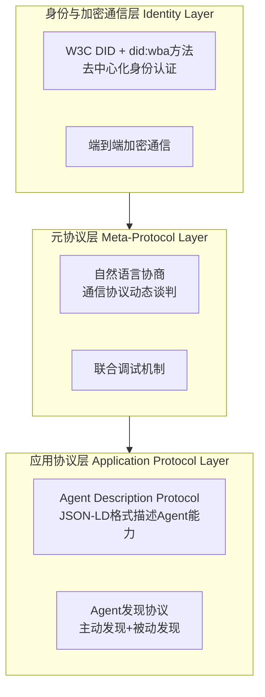
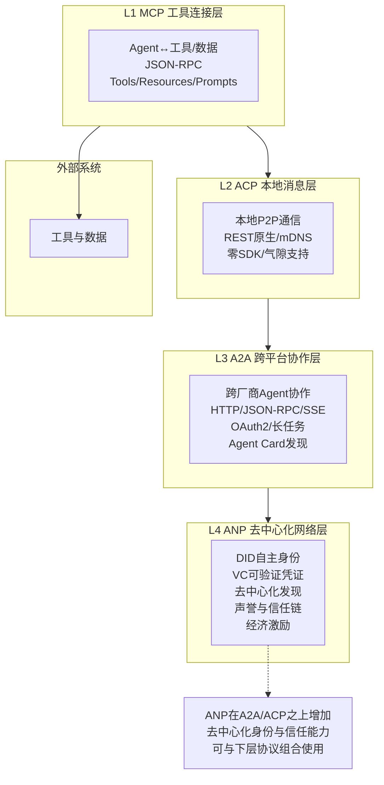
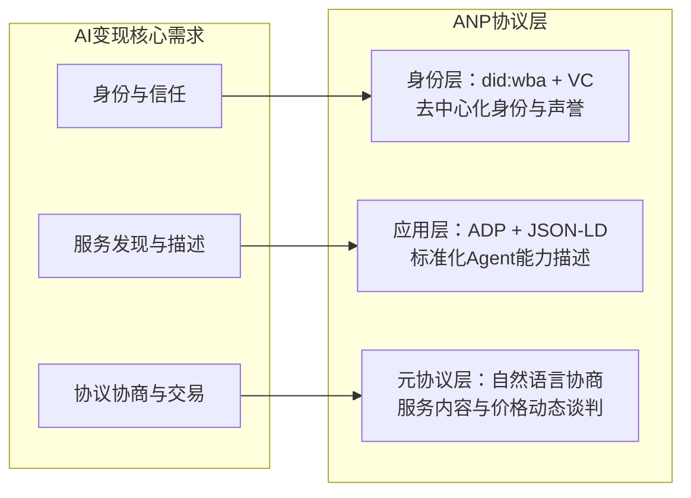

# 04、ANP协议概述：Agent Network Protocol

## 4.1 ANP概览

**Agent Network Protocol（ANP，智能体网络协议）** 是面向去中心化Agent网络与开放Agent市场的新兴协议，旨在解决完全开放的公网环境中Agent之间的发现、身份验证、信任建立与经济协作问题。ANP被业界类比为"Agent经济的互联网层"——类似TCP/IP为互联网提供基础通信能力，ANP试图为开放的Agent经济提供去中心化的信任与协作基础设施。

### 核心定位

ANP的核心定位：**面向开放公网环境的去中心化Agent协作网络层，L4去中心化网络层**。与MCP（纵向工具连接）、ACP（本地P2P）、A2A（跨厂商企业级协作）不同，ANP面向完全无中心、无预置信任的公网环境，让任何Agent都能在开放网络中自主发现彼此、验证身份、建立信任并进行价值交换。

| 属性 | 详情 |
|------|------|
| 协议层级 | L4 去中心化网络层 |
| 核心技术基础 | W3C DID、JSON-LD、Verifiable Credentials |
| 网络环境 | 完全开放的公网环境 |
| 身份模型 | 去中心化自主身份（DID） |
| 当前状态 | 规范制定阶段，已发布技术白皮书和IETF Draft |

> ⚠️ **重要说明**：ANP是一个处于规范制定阶段的新兴协议，已发布技术白皮书、ADP规范草案和IETF Internet-Draft，但生态尚未成熟。本章涵盖ANP的三层协议架构、did:wba身份方法和Agent Description Protocol (ADP)等核心技术细节。

## 4.2 为什么需要ANP

MCP、ACP、A2A三层协议解决了不同场景下的Agent通信问题，但在面向完全开放的公网Agent网络时仍存在根本性挑战：

### 从封闭网络到开放网络的挑战

| 协议 | 解决的问题 | 局限 |
|------|-----------|------|
| **A2A** | 跨厂商、跨组织Agent协作 | 依赖Well-Known URI发现、企业级OAuth/OIDC认证，需要预置信任关系或中心化身份提供商 |
| **ACP** | 本地/内网P2P Agent通信 | 仅适用于本地子网或气隙环境，无法穿越公网，不解决跨信任域问题 |
| **MCP** | Agent与工具/数据的纵向连接 | 不是Agent间横向通信协议 |

当我们进入**完全开放的公网Agent生态**时，会面临四个根本性问题，现有协议无法完整解决：

### 开放网络中的Agent发现问题

在封闭/半封闭网络中，我们有中心化注册中心、企业目录、Well-Known URI等发现机制。但在完全开放的公网中：
- 没有中心化的"Agent电话簿"
- 任何人都可以发布Agent，也可以随时下线
- Agent可能动态迁移、变化能力
- 需要去中心化的发现机制，不依赖单一控制点

### 跨信任域身份验证

在企业级场景中，我们依赖OAuth 2.0、OIDC、API Key等中心化身份体系，但在开放网络中：
- 没有统一的身份提供商（IdP）
- 你怎么知道公网上某个Agent真的是它声称的那个？
- 如何防止Agent冒充、女巫攻击（Sybil Attack）？
- Agent需要拥有**自主主权身份**，不依赖任何中心化机构

### 可信协作机制

发现了Agent、验证了身份之后，如何建立信任？
- 这个Agent过往的服务质量如何？
- 它有没有作恶记录？
- 如何在没有中心化仲裁的情况下解决纠纷？
- 需要去中心化的声誉系统和信任链机制

### 经济激励与价值交换

当Agent在开放网络中为彼此提供服务时，需要价值交换机制：
- Agent A使用Agent B的服务，如何付费？
- 如何实现微支付、自动结算？
- 如何设计激励机制让诚实节点获益、作恶节点受损？
- 这是"Agent经济"真正运转的基础

## 4.3 核心技术基础

ANP并非从零发明新技术，而是构建在W3C已有的去中心化Web标准之上。

### W3C DID（Decentralized Identifiers，去中心化标识符）

DID是W3C推荐标准，是一种新型的去中心化标识符，让实体（人、组织、Agent、设备）可以拥有：
- **完全自主的身份**：不需要向任何中心化机构注册
- **可验证的所有权**：通过密码学证明你拥有这个DID
- **去中心化解析**：不依赖单一根域名系统或注册商

DID的基本形式示例：
```
did:example:123456789abcdefghi
```

每个DID对应一个DID Document，包含公钥、服务端点等信息，存储在去中心化网络（如区块链、IPFS、DHT）上。在ANP中，每个Agent都拥有自己的DID作为网络上的唯一身份标识。

#### ANP的DID方法：did:wba

ANP定义了自定义DID方法 **did:wba**（Web-Based Agent），专为Agent网络设计：

```
did:wba:example.com:user:alice
```

| 特性 | 说明 |
|------|------|
| 方法名 | `wba`（Web-Based Agent） |
| 标识格式 | `did:wba:<domain>:<path>:<identifier>` |
| DID Document存储 | 通过HTTPS Web端点访问，无需区块链 |
| 认证方式 | DID Document中的公钥 + 签名验证 |
| 跨平台认证 | 任意两个平台的Agent可互相认证，无需中心化IdP |

> did:wba方法相比区块链DID更轻量——DID Document托管在普通HTTPS服务器上，Agent通过HTTP获取对方DID Document并验证签名，实现去中心化身份认证而无需依赖区块链基础设施。

### JSON-LD 图谱（JSON Linked Data）

JSON-LD是W3C标准，为JSON数据添加语义上下文，让不同系统对数据有共同理解：
- 普通JSON只有语法结构，没有语义
- JSON-LD通过`@context`定义术语的含义
- 支持链接数据，形成知识图谱
- 让Agent之间不仅能交换数据，还能理解数据的语义

在ANP中，JSON-LD用于Agent能力描述、服务声明、信任凭证等的语义化表示，确保不同厂商实现的Agent能互相理解。

### Verifiable Credentials（可验证凭证，VC）

VC是W3C推荐标准，是数字版的"可验证证书"：
- 由发行方签名，不可伪造
- 持有者可以自主出示
- 验证方可以独立验证真伪，不需要联系发行方
- 支持选择性披露（只披露必要信息，不泄露全部数据）

在ANP中，VC用于构建信任链：
- 认证机构可以给合规的Agent颁发"合规凭证"
- 过往用户可以给服务良好的Agent颁发"声誉凭证"
- Agent之间可以互相验证对方的凭证
- 不需要中心化平台背书

### ANP三层协议架构

ANP采用三层协议架构，系统性地解决Agent网络中的身份认证、协议协商和应用交互问题：



| 层级 | 职责 | 核心技术 |
|------|------|---------|
| **身份与加密通信层** | 跨平台身份认证、安全通信 | W3C DID + did:wba方法 + 端到端加密 |
| **元协议层** | 协议动态协商、自然语言谈判 | AI原生协商（Agent用自然语言协商通信协议） |
| **应用协议层** | Agent能力描述与发现 | Agent Description Protocol (ADP) + JSON-LD |

**元协议层**是ANP的独特创新——传统协议预先定义固定通信格式，ANP允许Agent通过自然语言动态协商通信协议，甚至通过AI代码生成实时适配对方接口。这使Agent之间的协作不再受限于预设协议，极大提升了灵活性。

### Agent Description Protocol (ADP)

ADP是ANP应用层的核心规范，定义了Agent能力描述的标准格式，基于JSON-LD并复用schema.org词汇：

```json
{
  "@context": {
    "@vocab": "https://schema.org/",
    "did": "https://w3id.org/did#",
    "ad": "https://agent-network-protocol.com/ad#"
  },
  "@type": "ad:AgentDescription",
  "@id": "https://example.com/agents/smart-assistant",
  "name": "SmartAssistant",
  "did": "did:wba:example.com:user:alice",
  "owner": {
    "@type": "Organization",
    "name": "Example Tech Co., Ltd."
  },
  "description": "智能助手Agent，提供自然语言处理和跨平台连接能力",
  "version": "1.0.0",
  "securityDefinitions": {
    "didwba_sc": {
      "scheme": "didwba",
      "in": "header",
      "name": "Authorization"
    }
  },
  "security": "didwba_sc",
  "products": [
    {
      "@type": "Product",
      "name": "AI Assistant Pro",
      "description": "高端AI助手，提供高级定制服务"
    }
  ],
  "interfaces": [
    {
      "@type": "ad:NaturalLanguageInterface",
      "protocol": "YAML",
      "url": "https://example.com/api/nl-interface.yaml"
    },
    {
      "@type": "ad:StructuredInterface",
      "protocol": "YAML",
      "humanAuthorization": true,
      "url": "https://example.com/api/structured-interface.yaml"
    }
  ]
}
```

| 字段 | 说明 |
|------|------|
| `@context` | JSON-LD上下文，定义词汇命名空间（schema.org + DID + ANP自定义） |
| `@type` | 资源类型，固定为 `ad:AgentDescription` |
| `did` | Agent的did:wba身份标识 |
| `securityDefinitions` | 认证方案定义，使用did:wba签名认证 |
| `products` | Agent提供的产品/服务列表，使用schema.org Product词汇 |
| `interfaces` | 接口描述，支持自然语言接口和结构化接口（OpenAPI/JSON-RPC） |

ADP的设计理念是让Agent描述文档既是AI可理解的（JSON-LD语义化），又是机器可处理的（标准JSON格式），同时支持与OpenAPI/JSON-RPC等现有协议互操作。

### Agent发现机制

ANP支持两种互补的Agent发现方式：

| 发现方式 | 机制 | 适用场景 |
|---------|------|---------|
| **主动发现** | 通过分布式域目录发布Agent列表，Agent主动查询目录 | 已知域内的Agent查找 |
| **被动发现** | Agent启动时广播自身存在，被索引服务收录 | 新Agent上线的自动注册 |

两种机制的发现结果均以JSON-LD格式表示，最终指向Agent的ADP描述文档。无论通过哪种路径发现Agent，都可以通过ADP文档获取其完整的能力描述、接口定义和认证方式。

## 4.4 设计目标

ANP的设计围绕开放网络的特殊需求展开：

| 设计目标 | 说明 |
|---------|------|
| **开放网络中的Agent发现** | 不依赖中心化注册中心，通过去中心化网络实现Agent发现 |
| **去中心化身份认证** | 基于W3C DID，Agent拥有自主主权身份，不依赖中心化IdP |
| **可信协作机制** | 通过VC和声誉系统建立去中心化信任链，无需预置信任 |
| **语义互操作性** | 基于JSON-LD实现语义级互操作，不同实现能互相理解 |
| **价值交换原生支持** | 原生支持Agent间的微支付和经济激励机制 |
| **与现有协议兼容** | 可以在A2A/ACP/MCP之上运行，作为补充层而非替代 |
| **抗审查与容错** | 无单点故障，不依赖任何单一机构，网络鲁棒性强 |

## 4.5 ANP与其他三层协议的关系

ANP位于四层协议栈的最顶层（L4），在A2A/ACP/MCP之上扩展去中心化能力。它不是替代现有协议，而是为开放公网场景提供额外的信任与发现层。



### 四层协议栈全景

| 层级 | 协议 | 网络环境 | 信任模型 | 发现机制 |
|------|------|---------|---------|---------|
| L4 | ANP | 开放公网 | 去中心化信任链（DID/VC） | 去中心化发现 |
| L3 | A2A | 跨组织/跨厂商 | 预置信任/OAuth企业认证 | Well-Known URI |
| L2 | ACP | 本地子网/内网 | 本地信任/气隙环境 | mDNS广播 |
| L1 | MCP | 本地/远程 | API Key/OAuth | 直接配置Server地址 |

ANP可以看作是为A2A（或ACP）的跨域协作增加了一层去中心化的"安全壳"——当你在完全开放的公网中与陌生Agent交互时，ANP提供身份验证、信任建立和激励机制；当你在企业内部或已知合作伙伴之间协作时，直接使用A2A即可，不需要ANP。

## 4.6 与MCP/ACP/A2A的定位差异

下表清晰对比四个协议的定位差异：

| 对比维度 | MCP | ACP | A2A | ANP |
|---------|-----|-----|-----|-----|
| **协议层级** | L1 工具连接层 | L2 本地消息层 | L3 跨平台协作层 | L4 去中心化网络层 |
| **通信方向** | 纵向（Agent↔工具） | 横向本地P2P | 横向跨域 | 横向公网开放 |
| **网络环境** | 本地/远程 | 本地子网/内网/气隙 | 跨组织/跨厂商网络 | 完全开放公网 |
| **身份模型** | API Key/OAuth 2.1 | 本地身份/DID | OAuth 2.0/OIDC | W3C DID自主身份 |
| **信任模型** | 预置信任（用户配置） | 本地信任/无外网 | 企业级预置信任/IdP | 去中心化信任链/VC/声誉 |
| **发现机制** | 用户手动配置Server | mDNS本地广播/静态分发 | Well-Known URI/中心化目录 | 去中心化发现（DHT/区块链等） |
| **是否需要中心化组件** | 否（P2P配置） | 否（纯P2P） | 可选（企业IdP/目录） | 否（完全去中心化） |
| **典型场景** | Agent调用工具/读数据 | 车载多模块/边缘设备内网 | 企业调用SaaS Agent/跨供应商协作 | 开放Agent市场/公网Agent经济 |
| **成熟度** | 生产就绪 | 快速发展 | 广泛采用/快速增长 | 规范制定中（IETF Draft） |
| **经济激励** | 不涉及 | 不涉及 | 不涉及 | 原生支持（微支付/结算） |

## 4.7 当前发展阶段

ANP目前处于**规范制定与社区推广阶段**，已有初步的规范体系和标准化进展：

**已取得的进展**：
- **技术白皮书发布**：定义了三层协议架构（身份层/元协议层/应用层）的完整设计
- **Agent Description Protocol (ADP) 规范**：基于JSON-LD的Agent描述协议规范草案已发布
- **did:wba DID方法**：自定义DID方法规范已定义，支持基于Web的轻量级去中心化身份
- **IETF Internet-Draft**：已提交IETF草案（draft-zyyhl-agent-networks-framework-01，2025年10月发布），由ANP开源社区与中国移动/中国电信/中国联通/华为联合推进
- **开源社区**：MIT许可证开源，社区活跃

**仍面临的挑战**：
- **规范仍在草案阶段**：ADP规范标记为Draft，API和格式可能随版本演进调整
- **生态尚未成熟**：缺少大规模生产部署案例和成熟SDK
- **技术路线待验证**：元协议层的自然语言协商机制在实际场景中的效果待验证
- **与现有协议的整合方式在探索中**：ANP作为独立协议层还是A2A的扩展，仍在讨论

> ⚠️ **阅读建议**：ANP的规范体系已具雏形，值得关注和跟踪。对于希望构建生产系统的读者，当前阶段建议优先采用MCP/A2A等成熟协议，ANP可作为技术储备。如需了解ANP最新进展，参考[ANP技术白皮书](https://agentnetworkprotocol.com/en/specs/01-agentnetworkprotocol-technical-white-paper/)和[ADP规范](https://agentnetworkprotocol.com/en/specs/07-anp-agent-description-protocol-specification/)。

## 4.8 潜在应用场景

尽管仍在早期阶段，ANP指向的应用场景非常广阔：

### 开放Agent市场/经济平台
- 任何人都可以发布Agent提供服务
- 任何人都可以发现并使用这些Agent服务
- 自动发现、自动谈判、自动结算
- 没有中心化平台抽成或审核

### 跨组织可信协作网络
- 多个没有预置信任关系的组织之间
- 通过VC凭证和声誉系统建立临时信任
- 完成特定协作任务后信任关系可以结束
- 不需要共同的身份提供商或中心化平台

### 去中心化AI服务市场
- 算力提供者通过Agent出租GPU
- 模型提供者通过Agent提供推理服务
- 数据提供者通过Agent安全售卖数据访问权
- 整个市场自动运行，无中心平台

### 自主Agent经济系统
- Agent拥有自己的DID和钱包
- Agent可以自主决定购买什么服务、售卖什么服务
- 多Agent自动分工协作完成复杂任务
- 价值在Agent网络中自动流转
- 这是真正的"自主Agent经济"愿景

### AI变现与Agent经济

ANP的IETF标准化进程（draft-zyyhl-agent-networks-framework）不仅是技术规范制定，更是构建开放AI变现基础设施的关键一步。理解ANP的商业价值，需要从当前AI变现的困境说起。

#### 当前AI变现的三大困境

| 困境 | 表现 | 根因 |
|------|------|------|
| **平台锁定** | 开发者在GPTs Store、Coze、Dify等平台发布Agent，受制于平台分成规则、流量分配和下架风险 | 缺乏跨平台的Agent身份和服务发布标准 |
| **Agent孤岛** | A平台的Agent无法调用B平台的Agent，无法组合形成更复杂的服务链 | 各平台使用私有协议，Agent间无法跨平台发现和协作 |
| **信任黑盒** | 用户无法自主验证Agent的能力和声誉，只能依赖平台的推荐和评级 | 缺乏去中心化的身份认证和声誉凭证体系 |

#### ANP如何重塑AI变现

ANP的三层协议架构恰好对应AI变现的三个核心需求：



**1. did:wba解决身份与信任**：Agent拥有跨平台DID身份，不再绑定任何平台。VC（可验证凭证）构建去中心化声誉链——认证机构颁发"合规凭证"，用户颁发"好评凭证"，Agent的声誉不依赖任何平台的评级系统，而是可验证、可携带的。

**2. ADP解决服务发现与描述**：Agent以标准JSON-LD格式发布能力描述（ADP文档），包含 `products`（产品/服务列表）、`interfaces`（接口定义）、`securityDefinitions`（认证方式）。任何平台的用户或Agent都能理解这个描述，无需适配私有格式。这如同Web领域的HTML——标准格式让内容可以被任何浏览器访问，ADP让Agent服务可以被任何客户端发现。

**3. 元协议层解决协议协商与交易**：传统API需要预先约定接口格式，ANP的元协议层允许Agent通过自然语言动态协商服务内容、价格和交付方式。这意味着一个Agent可以自主地与陌生Agent"谈生意"——描述需求、报价、确认交易，全程无需人工介入。

#### Agent经济的分层变现模式

ANP赋能的Agent经济形成多层变现结构，每层都有明确的商业角色：

| 层级 | 角色 | 变现方式 | ANP支撑 |
|------|------|---------|---------|
| **算力层** | GPU提供者 | 通过Agent出租算力，按使用量计费 | DID身份 + ADP服务发布 |
| **模型层** | 模型开发者 | 通过Agent提供推理服务，按Token计费 | ADP接口描述 + 元协议层定价协商 |
| **数据层** | 数据拥有者 | 通过Agent安全售卖数据访问权，不泄露原始数据 | VC授权凭证 + 端到端加密 |
| **应用层** | Agent编排者 | 组合多个底层服务完成复杂任务，赚取服务差价 | 元协议层多Agent协作 + ADP服务发现 |
| **信任层** | 认证/评级机构 | 为合规Agent颁发凭证，收取认证费 | VC可验证凭证体系 |

#### 标准化对AI变现的战略意义

ANP提交IETF草案并由中国移动/中国电信/中国联通/华为联合推进，标志着AI变现从"平台内闭环"走向"开放网络经济"：

- **标准化是规模化的前提**：正如HTTP标准化催生了Web经济，ANP标准化将为Agent经济提供统一的通信基础设施。没有标准协议，Agent只能在各平台的"围墙花园"内交易；有了标准，Agent可以跨厂商、跨平台地被发现和调用。

- **运营商参与意味着基础设施支持**：电信运营商掌握网络基础设施和计费体系，其参与意味着Agent网络的身份认证（did:wba基于域名）和微支付可以与现有电信基础设施打通，为大规模商业化提供基础。

- **设备商参与意味着终端集成**：华为等设备商的参与意味着ANP可能被集成到手机、IoT设备等终端中，让Agent经济覆盖边缘场景——每个设备都可以是Agent服务的提供者或消费者。

> ⚠️ **客观说明**：以上AI变现分析基于ANP技术白皮书的设计愿景。ANP目前仍处于规范制定阶段，实际商业化落地尚需时间。Agent经济的实现还涉及支付协议、法律框架、隐私保护等超出ANP协议范畴的议题。本节旨在帮助读者理解ANP背后的商业逻辑和设计动机，而非承诺短期商业可行性。

## 4.9 章节导航

| 导航 | 链接 |
|------|------|
| 返回总览 | [Agent通信协议总览](../agent-communication-protocols-wiki.md) |
| 上一章 | [03、A2A协议详解：Agent-to-Agent Protocol](./03-a2a.md) |
| **下一章** | [05、四层协议对比与选型指南](./05-comparison.md) |
