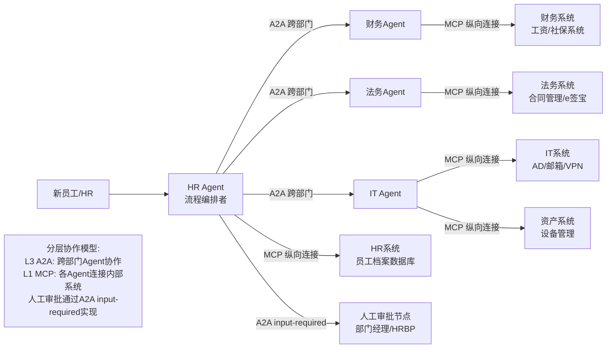
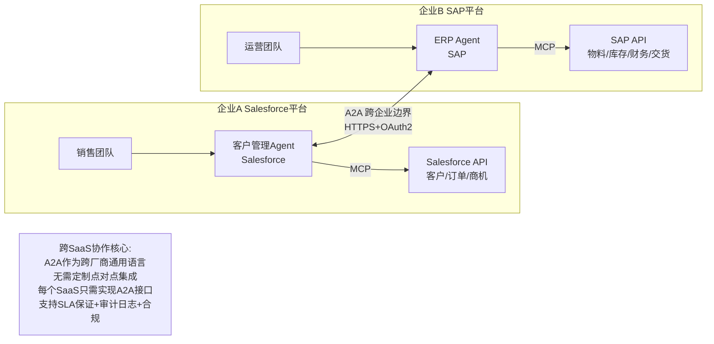
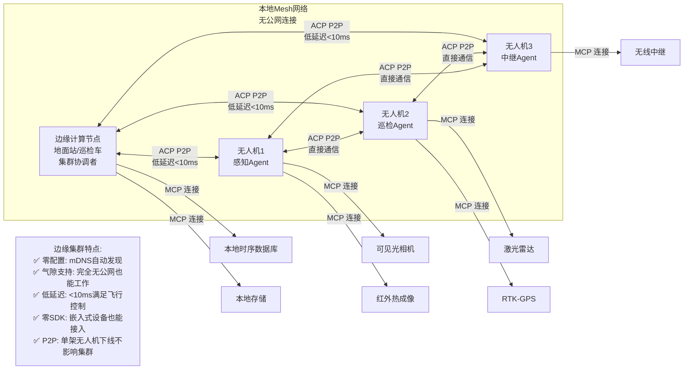
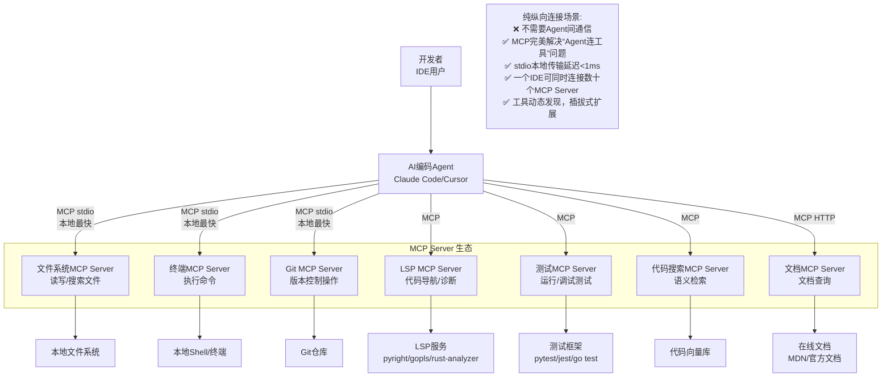
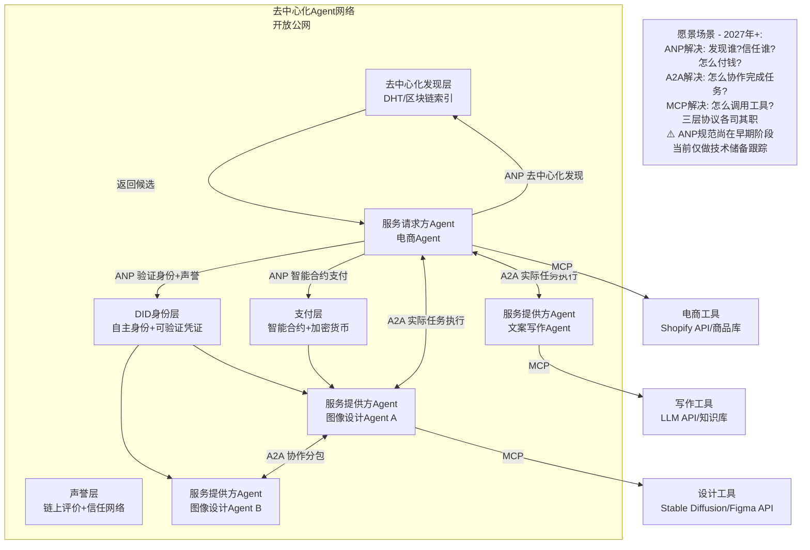

# 08、典型应用场景

## 8.1 本章导读

前几章我们系统学习了MCP、ACP、A2A、ANP四个协议的技术细节、对比选型和交互流程。本章将理论结合实践，通过**5个真实业务场景**，展示如何根据实际需求选择和组合协议，帮助读者建立从"知道协议"到"用好协议"的落地能力。

每个场景都包含：
- 贴近实际的业务场景描述
- 推荐协议组合及理由
- 架构示意图（标注协议使用位置）
- 关键实现要点
- 选型决策分析

通过这5个场景，读者应该能够举一反三，将协议选型方法论应用到自身业务中。

## 8.2 场景1：企业数字员工团队——入职流程自动化

### 8.2.1 场景描述

新员工入职是企业中典型的跨部门协作流程，涉及HR、财务、法务、IT等多个部门的Agent协同工作：
- HR Agent：创建员工档案、发起入职流程
- 财务Agent：开设工资账户、办理社保公积金
- IT Agent：创建AD账号、开通邮箱、配置VPN、配发办公设备
- 法务Agent：生成劳动合同、完成电子签署

整个流程需要跨部门、跨系统协作，包含人工审批节点，任务可能持续数小时到数天。

### 8.2.2 推荐协议组合

**A2A（跨部门/跨SaaS协作） + MCP（连接企业SaaS工具）**

### 8.2.3 架构示意图

### 8.2.4 协作流程简述

1. **流程发起**：HR在系统中录入新员工信息，HR Agent作为编排者启动入职流程
2. **HR内部处理**：HR Agent通过MCP调用HR系统创建员工档案、分配工号
3. **并行委派**：HR Agent通过A2A并行向财务Agent、法务Agent、IT Agent委派任务
4. **财务处理**：财务Agent通过MCP调用财务系统开设工资账户、配置社保
5. **法务处理**：法务Agent通过MCP生成劳动合同，发送电子签署链接
6. **IT处理**：IT Agent通过MCP创建AD账号、开通邮箱、配置VPN、登记设备
7. **人工审批**：流程中设置input-required节点，等待部门经理审批
8. **结果汇总**：HR Agent汇总各部门结果，生成入职欢迎包，通知新员工

### 8.2.5 关键实现要点

| 要点 | 说明 | 技术方案 |
|------|------|---------|
| **统一身份认证** | 跨部门Agent需要统一的身份体系 | OAuth 2.0/OIDC SSO，企业统一身份提供商 |
| **权限控制** | 不同部门Agent只能访问授权范围内的数据 | 基于RBAC的细粒度权限，Agent Card声明所需权限 |
| **长任务跟踪** | 入职流程可能持续数小时到数天 | A2A有状态Task，SSE实时推送进度，Webhook通知状态变更 |
| **人工审批节点** | 关键步骤需要人工介入确认 | A2A input-required状态，支持多轮人机交互 |
| **事务补偿** | 某一步失败时需要回滚已完成操作 | Saga模式，每个Agent提供补偿操作（如撤销账号） |
| **审计日志** | 所有操作需要可追溯、可审计 | A2A消息签名、操作日志持久化、合规留痕 |

### 8.2.6 为什么选这个组合

**为什么用A2A而非ACP跨部门通信：**
- **跨厂商/跨系统能力**：各部门系统可能来自不同厂商，A2A是跨厂商标准，Well-Known发现机制无需预先配置API细节
- **企业级安全**：A2A原生支持OAuth 2.0/OIDC，强制HTTPS，满足企业安全合规要求
- **长时任务支持**：入职流程持续时间长，A2A丰富的状态机（submitted→working→input-required→completed）完美适配
- **SSE流式进度**：HR和新员工可以实时看到各部门处理进度，无需轮询
- **生态成熟**：150+组织支持A2A，主流SaaS厂商正在提供A2A Agent接口

**为什么用MCP连接内部系统：**
- 这是典型的纵向"Agent→工具"连接场景，MCP是标准化的"USB-C接口"
- MCP生态成熟，HR/财务/IT系统都可以封装为MCP Server，一次开发多处使用
- stdio/HTTP多种传输方式，适配不同系统的网络环境

## 8.3 场景2：跨组织/SaaS平台协作——Salesforce ↔ SAP

### 8.3.1 场景描述

企业中销售系统（Salesforce）和ERP系统（SAP）往往是独立采购、独立部署的，数据孤岛严重。客户管理Agent（运行在Salesforce平台）需要与ERP Agent（运行在SAP平台）交换数据：
- 销售订单创建后自动同步到SAP生成销售订单和交货单
- 客户付款状态从SAP回传到Salesforce更新客户信用等级
- 发货状态从SAP同步到Salesforce通知客户
- 库存查询从Salesforce实时查询SAP库存

两个Agent运行在不同厂商的SaaS平台上，跨企业信任边界，需要高安全等级和可靠性保证。

### 8.3.2 推荐协议组合

**A2A（跨厂商标准） + MCP（连接各SaaS内部API）**

### 8.3.3 架构示意图

### 8.3.4 关键实现要点

| 要点 | 说明 | 技术方案 |
|------|------|---------|
| **OAuth2联邦认证** | 跨企业身份互信，无需共享密码 | OAuth 2.0 Token Exchange、OIDC Federation，支持企业IdP互认 |
| **数据隐私合规** | 客户数据、财务数据敏感，需满足GDPR/等保 | 字段级加密、数据最小化原则、A2A消息端到端加密 |
| **SLA保证** | 订单同步延迟直接影响业务，需要可用性承诺 | A2A任务超时机制、重试策略、死信队列、熔断降级 |
| **审计日志** | 跨企业操作需要完整审计轨迹 | 不可篡改的审计日志、操作溯源、双方对账机制 |
| **幂等性保证** | 网络重试可能导致重复请求，需要幂等设计 | 每个任务携带唯一Request ID，服务端做幂等校验 |
| **数据映射** | 两个系统的数据模型不同，需要转换层 | Agent内部做数据模型转换，A2A消息使用 Canonical Model |

### 8.3.5 为什么选A2A而非ACP

| 维度 | A2A | ACP | 选型理由 |
|------|-----|-----|---------|
| **跨厂商标准** | Google发起，Linux基金会治理，150+厂商支持 | IBM/BeeAI发起，生态相对较小 | 跨SaaS场景需要广泛接受的行业标准，A2A是目前的事实标准 |
| **发现机制** | Well-Known URI `/.well-known/agent.json`，标准HTTP | mDNS本地广播，仅适用于局域网 | Salesforce和SAP在公网上，mDNS无法跨公网工作 |
| **企业安全** | 强制HTTPS、OAuth 2.0/OIDC原生支持 | TLS可选，面向本地信任环境 | 跨企业边界必须有强安全保障，A2A设计目标就是跨信任域 |
| **传输协议** | HTTP/HTTPS（强制），可穿越防火墙/负载均衡 | REST/gRPC/ZeroMQ/IPC，本地协议优先 | SaaS服务都暴露HTTPS端点，A2A的HTTP原生特性最适配 |
| **长任务支持** | 丰富状态机、SSE流式、Webhook回调 | 简单四状态，轮询为主 | 订单处理、发货等可能是长任务，需要进度推送 |
| **SDK支持** | 全语言官方SDK，降低SaaS厂商接入门槛 | 零SDK，原生HTTP即可 | 主流SaaS厂商（Salesforce/SAP等）更倾向于使用成熟SDK加速接入 |

**核心结论**：ACP是为本地/内网环境设计的，mDNS零配置发现在跨公网场景下无法工作，安全模型也不适合跨信任域。A2A从设计之初就面向跨厂商、跨组织、跨公网场景，是SaaS间协作的自然选择。

## 8.4 场景3：边缘设备/IoT/机器人集群——无人机巡检

### 8.4.1 场景描述

电力线路巡检、石油管道巡检、灾区搜救等场景中，多架无人机组成集群协同工作：
- 多架无人机在无公网覆盖的野外环境中执行巡检任务
- 本地边缘计算节点（如巡检车/地面站）作为集群协调者
- 无人机之间需要实时共享位置、图像数据、任务分配
- 无人机搭载摄像头、红外、LiDAR等多种传感器，需要实时数据处理
- 网络环境不稳定，可能随时断网，要求气隙环境下独立运行
- 飞行控制延迟要求极高（<10ms），否则可能导致碰撞

### 8.4.2 推荐协议组合

**ACP（本地P2P低延迟） + MCP（本地传感器/工具连接）**

### 8.4.3 架构示意图

### 8.4.4 关键实现要点

| 要点 | 说明 | 技术方案 |
|------|------|---------|
| **mDNS零配置发现** | 无人机升空后自动加入集群，无需预先配置IP | ACP原生mDNS广播，开机即用，类似AirPrint发现打印机 |
| **断网容忍/气隙安全** | 野外无公网，要求完全离线运行 | ACP本地P2P架构，不依赖外部服务器，支持静态Agent Card离线分发 |
| **低延迟（<10ms）** | 飞行控制、避障需要毫秒级响应 | ACP over gRPC/ZeroMQ/IPC，本地网络直连，避免HTTP开销 |
| **资源受限适配** | 无人机飞控计算资源有限，无法运行重型SDK | ACP零SDK设计，原生HTTP即可，甚至可用裸socket实现最小子集 |
| **去中心化容错** | 单架无人机失联不能导致整个集群崩溃 | ACP P2P网状架构，无单点故障，边缘节点可动态选举 |
| **带宽优化** | 无人机图像数据量大，本地无线带宽有限 | ACP支持gRPC流式传输，二进制编码，按需拉取而非全量推送 |

### 8.4.5 为什么选ACP而非A2A

| 维度 | ACP | A2A | 选型理由 |
|------|-----|-----|---------|
| **SDK依赖** | 零SDK，原生HTTP/gRPC即可 | 需要官方SDK | 无人机嵌入式系统资源有限，无法安装重型SDK，ACP零SDK是刚需 |
| **发现机制** | mDNS本地广播零配置 | Well-Known URI需要Agent在线且有固定地址 | 无人机IP动态分配，无DNS服务器，mDNS是唯一可行的自动发现方式 |
| **外部服务器** | 完全不需要，纯P2P | 需要HTTP服务器，依赖网络基础设施 | 野外气隙环境无基础设施，ACP可完全脱离服务器运行 |
| **延迟特性** | 极低（IPC/本地网络，<10ms） | 中高（HTTP协议开销，跨网络） | 飞行控制要求<10ms延迟，A2A的HTTP开销无法满足 |
| **气隙/离线** | 原生支持，设计目标之一 | 需要配置，非原生 | 电力巡检、灾区搜救等场景完全无公网，ACP是唯一原生支持的选择 |
| **REST轻量** | 标准REST API，curl即可调用 | JSON-RPC over HTTP，相对较重 | 嵌入式设备用最简单的HTTP客户端就能通信，降低开发复杂度 |

**核心结论**：A2A面向跨网、跨组织场景，依赖HTTP基础设施和SDK，在气隙、低延迟、零配置的边缘场景下完全不适用。ACP从设计之初就面向本地优先、边缘计算场景，是无人机/IoT/机器人集群的最佳选择。

## 8.5 场景4：AI编码助手多工具协作——Claude Code/Cursor

### 8.5.1 场景描述

现代AI编码助手（如Claude Code、Cursor、Windsurf、GitHub Copilot Workspace）深度集成在IDE中，需要调用多种开发工具完成编码任务：
- 文件系统：读取代码文件、写入修改、创建新文件
- 终端执行：运行构建命令、执行测试、安装依赖
- Linter/Formatter：检查代码风格、自动格式化
- Debugger：设置断点、查看变量、单步执行
- Test Runner：运行单元测试、查看测试覆盖率
- Git操作：查看diff、提交代码、创建分支、推送PR
- 代码搜索：在整个代码库中语义搜索代码
- 文档查询：读取本地文档、查询官方文档

这是典型的"单Agent调用多种工具"场景，Agent不与其他Agent通信，只需要连接各种工具和数据源。

### 8.5.2 推荐协议组合

**MCP（纯工具连接场景）**

### 8.5.3 架构示意图

### 8.5.4 关键实现要点

| 要点 | 说明 | 技术方案 |
|------|------|---------|
| **stdio传输** | 本地进程间通信最快方式，无网络开销 | MCP Server作为子进程启动，通过stdin/stdout通信，延迟可低至亚毫秒级 |
| **工具结果流式返回** | 运行测试、构建项目可能需要较长时间，需要实时输出 | MCP SSE（Server-Sent Events）流式通知，终端输出实时回显给用户 |
| **错误处理** | 工具执行失败需要清晰的错误信息和堆栈 | MCP标准错误格式，区分工具不存在、参数错误、执行失败等不同错误类型 |
| **资源权限控制** | AI Agent不能随意删除文件、执行危险命令 | MCP Server做权限沙箱，用户可配置哪些工具/路径允许访问 |
| **动态插拔** | 用户可随时添加/移除MCP Server，无需重启IDE | MCP initialize握手，tools/list动态发现，支持Server热加载 |
| **上下文管理** | 代码库可能很大，不能把所有文件都塞给LLM | MCP资源（Resource）机制，按需读取文件，支持分页和范围读取 |

### 8.5.5 为什么只选MCP，不需要ACP/A2A

这个问题的本质是理解**纵向连接与横向通信的区别**（详见 [05-comparison.md:93-142](./05-comparison.md#54-纵向-vs-横向mcp与acpa2aanp的本质区别)）：

1. **这不是Agent间通信场景**：IDE中只有一个编码Agent，没有多个自主Agent需要协作，因此不需要ACP/A2A这些横向通信协议
2. **这是纯纵向工具连接场景**：Agent需要"连接"文件系统、终端、Git等工具/数据源，这正是MCP的设计目标——Agent的USB-C接口
3. **MCP生态已经成熟**：
   - 数千个现成MCP Server可用，覆盖几乎所有开发工具
   - Claude Desktop、Cursor、Windsurf等主流IDE原生支持MCP
   - 开发一个新工具的MCP Server非常简单，几小时就能完成
4. **加其他协议是过度设计**：
   - 用A2A调用本地工具？A2A太重，需要SDK和HTTP服务器，杀鸡用牛刀
   - 用ACP？ACP解决Agent间P2P通信，这里根本没有多个Agent

**核心结论**：不是所有场景都需要多Agent协作。很多时候单Agent + MCP连接足够的工具就能很好地完成任务。AI编码助手是MCP独立应用的典范——简单、高效、生态成熟。

## 8.6 场景5：去中心化Agent市场/经济（愿景场景）⚠️ 展望

### 8.6.1 场景描述

这是一个面向未来的愿景场景：在开放的公网上，存在一个去中心化的Agent服务市场（类似AI版的Upwork/Fiverr），Agent可以：
- 自主发现其他Agent提供的服务
- 验证对方身份和声誉
- 自主谈判服务价格和SLA
- 通过智能合约自动完成支付结算
- 完成任务后互相评价，建立声誉系统

例如：一个小型电商Agent需要制作营销海报，它可以在市场上自主寻找"图像设计Agent"，比较报价、查看历史评价、协商需求，完成后用加密货币自动支付。整个过程无需人工介入。

### 8.6.2 推荐协议组合

**ANP（发现/身份/信任） + A2A（任务协作） + MCP（工具执行）**

### 8.6.3 架构示意图

### 8.6.4 关键实现要点

| 要点 | 说明 | 技术方案（预期） |
|------|------|----------------|
| **DID自主身份** | Agent不依赖中心化平台注册身份 | W3C DID标准，Agent自己生成和控制身份，可验证凭证（VC）声明能力 |
| **可验证凭证** | Agent的能力、资质、认证可加密验证 | 第三方机构（如厂商、行业协会）签发VC，链上可验证不可伪造 |
| **智能合约支付** | 服务完成后自动结算，无需人工付款 | 区块链智能合约托管资金，任务完成验证后自动释放，支持微支付 |
| **声誉系统** | 基于历史交易的去中心化评价，防刷评 | 链上评价记录，Sybil攻击防护，基于图的信任网络算法 |
| **去中心化发现** | 没有中心化的应用商店，如何找到需要的Agent | 分布式哈希表（DHT）、区块链索引、语义搜索，类似BitTorrent的发现机制 |
| **争议解决** | 任务完成质量有争议时如何仲裁 | 多签仲裁、DAO投票、去中心化陪审团机制（尚在探索） |

### 8.6.5 注意事项

> ⚠️ **重要提示**：这是**愿景场景**，不是当前可落地方案。
>
> - ANP规范目前（2025-2026年）仍在早期探索阶段（TRL 2-3），尚无稳定规范、成熟SDK或大规模生产部署
> - 去中心化Agent经济涉及技术、法律、监管等多重挑战，成熟还需要时间
> - 建议**跟踪进展、技术储备、原型验证**，但**不要在生产系统中重度依赖**
> - 参考 [05-comparison.md:496-509](./05-comparison.md#58-分阶段采用路线图) 分阶段采用路线图阶段4建议

当前阶段（2025-2026年）生产落地重点仍在 **MCP + A2A/ACP** 组合，ANP作为长期方向保持关注即可。

## 8.7 场景选型速查表

| 场景 | 主协议 | 辅助协议 | 网络环境 | 关键特征 |
|------|--------|---------|---------|---------|
| **企业数字员工团队** 入职/报销/审批等跨部门流程 | A2A | MCP | 企业内网/跨云 | 长时任务、人工审批、企业级安全、跨部门协作 |
| **跨SaaS平台协作** Salesforce↔SAP/CRM↔ERP | A2A | MCP | 公网/跨信任域 | 跨厂商标准、OAuth2联邦、SLA保证、审计合规 |
| **边缘设备/IoT/机器人集群** 无人机/自动驾驶/工业机器人 | ACP | MCP | 本地子网/气隙环境 | 低延迟<10ms、零配置发现、断网容忍、零SDK |
| **AI编码助手/个人助手** Cursor/Claude Desktop | MCP | 无 | 本地进程 | 纯工具连接、stdio极速传输、单Agent无需横向通信 |
| **去中心化Agent市场** 开放公网Agent经济（展望） | ANP | A2A + MCP | 全球开放公网 | DID身份、可验证凭证、智能合约、声誉系统（早期） |

## 8.8 章节导航

| 导航 | 链接 |
|------|------|
| 返回总览 | [Agent通信协议总览](../agent-communication-protocols-wiki.md) |
| 上一章 | [07、实现与部署最佳实践](./07-implementation.md) |
| **下一章** | [09、术语表与常见问题](./09-glossary.md) |
