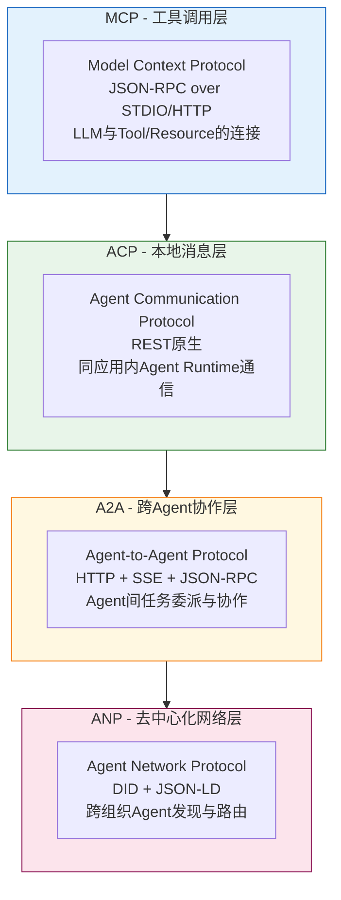
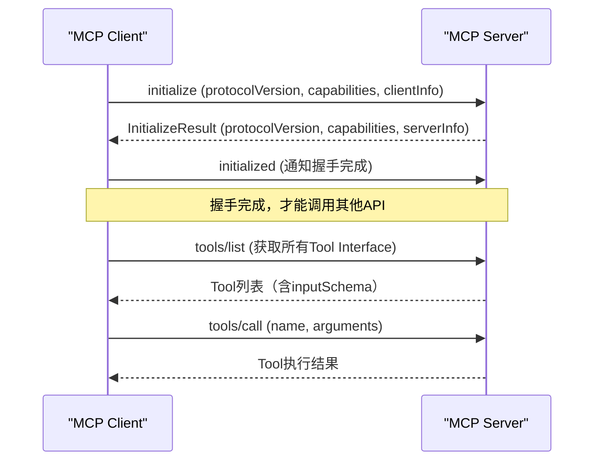
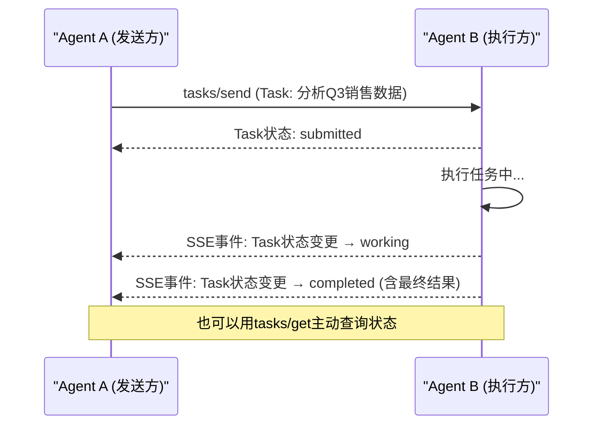

# Agent Protocol：通信规则层

## 什么是Agent Protocol？

**Agent Protocol是Agent间/Agent与系统间通信的完整规则集**——API定义了单个方法怎么调用，Protocol定义了完整的交互生命周期：如何握手、如何发现能力、如何委派任务、如何流式返回结果、如何处理错误、如何终止会话。

单个API调用是Protocol的一个组成部分，但Protocol还包含状态管理、能力协商、消息序列、安全认证等更宏观的规则。

> 💡 **基础概念回顾**：如果你对通用网络协议（OSI模型、TCP/IP、HTTP设计原则）不熟悉，请先阅读[通用Wiki - Protocol章节](../interface-api-abi-protocol-wiki/04-protocol.md)。Agent协议的完整详解在[agent-communication-protocols](../agent-communication-protocols/00-overview.md)。

## Agent Protocol的核心特征

| 特征 | 说明 |
|------|------|
| **分层设计** | 从工具调用到去中心化网络，不同协议解决不同层次的通信问题 |
| **状态管理** | 定义会话/任务的生命周期状态机（如A2A Task的submitted/working/completed状态） |
| **能力协商** | 握手阶段交换支持的功能版本，协商双方都能理解的通信方式 |
| **流控支持** | 支持SSE等流式传输，适配LLM的token-by-token输出特性 |
| **安全认证** | 定义身份认证、授权机制（如ANP的DID去中心化身份） |

## Agent协议生态四层模型

当前Agent生态正在形成四层协议栈：



| 协议 | 定位 | API风格 | 传输层 | 核心场景 |
|------|------|---------|--------|---------|
| **MCP** | 工具调用层 | JSON-RPC 2.0 | STDIO/HTTP/SSE | LLM连接外部Tool/Resource/Prompt |
| **ACP** | 本地消息层 | RESTful | HTTP | 同进程/同应用内Agent间消息 |
| **A2A** | 跨Agent协作层 | JSON-RPC + Task生命周期 | HTTP + SSE | 不同Agent间任务委派与协作 |
| **ANP** | 去中心化网络层 | JSON-LD + DID | P2P/HTTP | 跨组织/公网Agent发现与可信通信 |

## 协议消息案例

### 案例1：MCP initialize握手消息序列

MCP连接建立后必须先进行initialize握手协商能力：



对应的JSON-RPC消息：

```json
// → initialize请求
{
  "jsonrpc": "2.0",
  "id": 1,
  "method": "initialize",
  "params": {
    "protocolVersion": "2024-11-05",
    "capabilities": { "tools": {} },
    "clientInfo": { "name": "example-client", "version": "1.0.0" }
  }
}

// ← initialize响应
{
  "jsonrpc": "2.0",
  "id": 1,
  "result": {
    "protocolVersion": "2024-11-05",
    "capabilities": { "tools": {}, "resources": {} },
    "serverInfo": { "name": "calculator-server", "version": "1.0.0" }
  }
}

// → initialized通知（无id）
{
  "jsonrpc": "2.0",
  "method": "notifications/initialized"
}
```

### 案例2：A2A Task委派消息流程

A2A协议以Task为中心，支持长时运行任务的状态追踪和流式更新：



## 传输层选择：STDIO vs HTTP vs SSE

| 传输方式 | 协议支持 | 适用场景 | 流式支持 |
|---------|---------|---------|---------|
| **STDIO** | MCP | 本地Server（如IDE插件中的MCP Server） | 需用JSON-RPC通知模拟 |
| **HTTP** | MCP/A2A/ACP | 远程服务、跨网络调用 | 响应后断开，无原生流式 |
| **SSE** | MCP/A2A | LLM流式输出、长时任务进度推送 | 原生Server推送，适合流式响应 |

## Protocol vs API：关键区别

理解这一点很重要：**MCP的`tools/call`既是一个API方法，也是MCP Protocol的一部分**。它们的边界是：

- 当你关注"这个方法怎么传参、返回什么格式"时，你在看**API**
- 当你关注"调用前需要握手吗？失败了怎么重试？怎么通知进度？整个会话生命周期如何管理？"时，你在看**Protocol**

## 章节导航

| 章节 | 链接 |
|------|------|
| 总览 | [00 - 总览](00-overview.md) |
| 上一章 | [03 - Agent ABI](03-agent-abi.md) |
| 下一章 | [05 - 对比分析](05-agent-comparison.md) |
| 协议详解 | [agent-communication-protocols](../agent-communication-protocols/00-overview.md) |

---

**上一章**：[03 - Agent ABI：跨语言边界层](03-agent-abi.md) | **下一章**：[05 - 对比分析：四层技术栈协同](05-agent-comparison.md)
