# 对比分析：Agent四层技术栈协同

本章是教程的核心价值章节，系统对比Agent语境下四个概念的区别与联系，展示它们如何在一次完整的Agent Tool调用中协同工作，并提供技术选型决策指南。

## 九维度系统对比（Agent语境）

| 维度 | Interface | API | ABI | Protocol |
|------|-----------|-----|-----|----------|
| **抽象层级** | 最高：能力契约声明 | 中高：可调用方法端点 | 中低：跨语言字节边界 | 最低：完整通信规则集 |
| **Agent中作用** | 声明Tool/Skill/Agent能做什么、参数是什么 | 定义如何发起一次具体调用 | 确保Python/Node.js/Go等不同语言能互操作 | 定义完整会话生命周期：握手→发现→调用→流式→终止 |
| **数据格式** | JSON Schema | JSON-RPC 2.0请求/响应 | JSON字节流（UTF-8编码） | 协议规定的完整消息序列（含状态、错误、通知） |
| **调用机制** | 不直接调用，仅作Schema验证 | 方法名+参数（如`tools/call`） | STDIO管道/HTTP请求体字节传输 | 有状态交互：先握手→再调用→可订阅更新→需终止 |
| **错误处理** | Schema验证错误（参数类型不对） | JSON-RPC结构化错误码 | JSON解析失败、连接断开 | 协议级错误：版本不兼容、能力不支持、任务超时 |
| **典型标准** | JSON Schema、Zod、Pydantic | JSON-RPC 2.0、REST | JSON (RFC 8259)、UTF-8 | MCP、A2A、ACP、ANP |
| **变更影响** | 变更Tool Schema会导致LLM调用失败 | 新增方法需协商版本 | 改序列化格式需所有语言更新解析器 | 协议破坏性变更需整个生态升级 |
| **调试工具** | JSON Schema Validator、MCP Inspector | curl、Postman、JSON-RPC调试器 | Wireshark、strace、日志抓包 | MCP Inspector、协议分析器、SSE事件监听 |
| **违反后果** | LLM产生幻觉参数，调用失败 | 方法不存在、参数错误 | 跨语言调用崩溃、乱码、静默失败 | 握手失败、连接被拒、Agent间无法通信 |

## 四层抽象在调用链中的协同工作

一次完整的MCP Tool调用会依次穿过四层抽象：

```mermaid
flowchart LR
    User["用户请求"] --> LLM["LLM决策"]
    LLM -->|"1. 查阅Tool列表匹配"| IF["Agent Interface<br/>inputSchema验证参数"]
    IF -->|"2. 构造JSON-RPC请求"| API["Agent API<br/>tools/call方法"]
    API -->|"3. 序列化为JSON字节"| ABI["Agent ABI<br/>JSON+STDIO/HTTP"]
    ABI -->|"4. 按协议规则传输"| PROTO["Agent Protocol<br/>MCP消息规则"]
    PROTO -->|"远端Server执行"| Tool["Tool实现"]
    Tool --> Result["结果返回"]
    style IF fill:#e3f2fd,stroke:#1565c0
    style API fill:#e8f5e9,stroke:#2e7d32
    style ABI fill:#fff8e1,stroke:#f57f17
    style PROTO fill:#fce4ec,stroke:#880e4f
```

### 逐层示例：以调用calculate工具为例

1. **Interface层**：LLM看到`calculate`工具的`inputSchema`，知道需要传`expression: string`
2. **API层**：构造`{"method": "tools/call", "params": {"name": "calculate", "arguments": {...}}}`
3. **ABI层**：整个JSON-RPC请求序列化为UTF-8字节流，通过STDIN管道传给Python子进程
4. **Protocol层**：这是握手后的第N个请求，Server按照MCP协议规则解析并返回响应，如需要还可发SSE进度通知

## Agent常见问题FAQ

### Q1: MCP Tool定义（含inputSchema）是Interface还是API？

**A: 是Interface。** 它只声明能力契约（叫什么、参数是什么、返回什么），而具体如何发起调用（发POST请求到哪个端点、用什么方法名）是API层（`tools/call`方法）的职责。同一个Tool Interface可以通过不同API方式调用（如STDIO调用vs HTTP调用）。

### Q2: JSON-RPC是API还是Protocol？

**A: JSON-RPC本身是API格式规范，但MCP中的JSON-RPC加上握手、通知、生命周期规则后构成完整Protocol。** 类比：HTTP是协议，但单独一个GET请求只是一次API调用。

### Q3: 开发Agent应用需要关心ABI吗？

**A: 绝大多数时候不需要，MCP等协议已经帮你处理了。** 只有当你要做以下事情时才需要关注ABI：开发新的MCP SDK绑定新语言、实现自定义传输层、做高性能二进制序列化（如用MessagePack替代JSON）、用WASM做插件沙箱。普通Tool开发者只需要写好Interface（Schema）即可。

### Q4: A2A和MCP是什么关系？是竞争关系吗？

**A: 是互补关系，位于协议栈不同层。** MCP解决"LLM如何连接工具/资源"问题（工具调用层），A2A解决"Agent之间如何委派任务"问题（跨Agent协作层）。一个Agent可以同时作为MCP Client调用工具，也可以作为A2A Agent接收其他Agent委派的任务。

### Q5: 为什么MCP选择JSON而不是Protobuf/MessagePack等二进制格式？

**A: 这是Agent生态有意的ABI选择——JSON是所有语言的"最小公分母"。**
- 所有主流语言都有零依赖、成熟稳定的JSON解析器
- JSON是文本格式，便于调试、日志记录、MCP Inspector抓包
- LLM本身就能理解JSON，不需要额外的IDL编译器
- Agent工具调用对性能不敏感（毫秒级到秒级的工具调用，微秒级的序列化开销可忽略）

### Q6: 开发Agent工具（MCP Server）应该先定义Interface还是先设计API？

**A: 先定义Interface（Tool Schema）。**
MCP已经为你规定好了标准API（`tools/list`、`tools/call`等），你不需要设计API。你唯一需要做的是定义好你的Tool Interface——清晰的名称、准确的description、完整的JSON Schema参数定义，这才是LLM能否正确使用你的工具的关键。

## Agent技术选型决策指南

| 你要做什么 | 应该关注哪一层 | 应该怎么做 |
|-----------|--------------|-----------|
| 给Agent开发一个新工具 | **Interface** | 写清晰的Tool name/description，用JSON Schema（Zod/Pydantic）严格定义参数类型 |
| 暴露一个可远程调用的Agent服务 | **API** | 选择MCP HTTP传输或A2A Task API，遵循JSON-RPC 2.0规范 |
| 让Python写的工具能被Node.js Agent调用 | **ABI** | 用标准JSON序列化，选STDIO（本地）或HTTP（远程）传输，不要用原生语言绑定 |
| 实现两个Agent之间的任务委派 | **Protocol** | 采用A2A协议，用Agent Card做能力声明，通过SSE订阅任务进度 |
| 开发MCP SDK绑定一门新语言 | **四层都要** | 从JSON（ABI）→JSON-RPC（API）→Schema验证（Interface）→完整生命周期（Protocol）顺序实现 |
| 设计公网去中心化Agent网络 | **Protocol** | 参考ANP，用DID做身份，JSON-LD做消息格式 |

## 快速决策口诀

> 定义能力 → Interface
> 暴露方法 → API
> 跨语言 → ABI（选JSON+STDIO/HTTP）
> Agent对话 → Protocol（选MCP/A2A）

## 章节导航

| 章节 | 链接 |
|------|------|
| 总览 | [00 - 总览](00-overview.md) |
| 上一章 | [04 - Agent Protocol](04-agent-protocol.md) |
| 下一章 | [06 - 参考资料](06-agent-resources.md) |
| 通用概念对比 | [通用Wiki - 对比分析](../interface-api-abi-protocol-wiki/05-comparison.md) |

---

**上一章**：[04 - Agent Protocol：通信规则层](04-agent-protocol.md) | **下一章**：[06 - 参考资料与学习路径](06-agent-resources.md)
