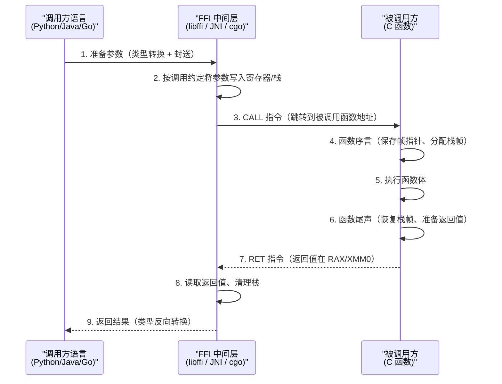

# 第 2 章 — FFI 工作原理

FFI 将一种语言编写的函数暴露给另一种语言调用，背后依赖五个关键机制：**调用约定**定义函数在机器码层面的参数传递与返回规则；**名称修饰**决定函数符号在编译后的可识别形式；**数据封送**负责在两种语言之间转换数据类型；**内存管理**界定谁分配、谁释放的边界；**绑定生成**提供从手动到自动的多种工程化手段。

## 1. 调用约定 (Calling Conventions)

调用约定是函数在机器码层面接收参数和返回值的规则集合，规定了参数传递顺序、方式（寄存器/栈）、栈清理责任方以及返回值存放位置。双方必须遵守相同约定，跨语言调用才能正确执行。

### 1.1 常见调用约定

| 调用约定 | 参数传递 | 栈清理 | 适用场景 |
|---|---|---|---|
| **cdecl** | 从右向左压栈 | 调用者清理（支持可变参数） | C 语言默认，Unix/Linux 主流 |
| **stdcall** | 从右向左压栈 | 被调用者清理 | Windows API 标准 |
| **fastcall** | 前 2 个参数用 ECX/EDX 寄存器，其余压栈 | 被调用者清理 | 追求性能的场景 |
| **System V AMD64** | 前 6 个整数/指针参数用 RDI/RSI/RDX/RCX/R8/R9，浮点参数用 XMM0-XMM7，其余压栈 | 调用者负责 | Linux/macOS x86-64 标准 |
| **Microsoft x64** | 前 4 个参数用 RCX/RDX/R8/R9，其余压栈 | 调用者负责 | Windows x86-64 标准 |

对于当下的 64 位系统，**System V AMD64**（Linux/macOS）和 **Microsoft x64**（Windows）是两种最主要的调用约定。FFI 库（如 libffi）在底层屏蔽了这些差异，但理解其存在是诊断跨平台 FFI 问题的前提。

### 1.2 跨语言 FFI 调用流程



### 1.3 代码示例：C 函数与汇编视角

```c
int add(int a, int b) {
    return a + b;
}
```

x86-64 Linux (System V AMD64) 下的反汇编（简化）：

```asm
add:
    push   rbp
    mov    rbp, rsp
    mov    DWORD PTR [rbp-4], edi   ; a (RDI)
    mov    DWORD PTR [rbp-8], esi   ; b (RSI)
    add    eax, DWORD PTR [rbp-4]   ; eax = a + b (返回值)
    pop    rbp
    ret
```

若调用方未遵循此约定，则参数值错乱，返回值不可预测。

## 2. 名称修饰 (Name Mangling)

C++ 支持**函数重载**（同一函数名、不同参数类型），编译器必须为每个重载版本生成唯一的符号名，以便链接器区分。这种将函数签名编码为唯一符号字符串的机制，就是**名称修饰**（Name Mangling）。

### 2.1 C 与 C++ 的对比

| 语言 | 源代码 | 编译后符号名（Linux） |
|---|---|---|
| C | `void foo(void)` | `foo` |
| C++ | `void foo(void)` | `_Z3foov` |
| C++ | `void foo(int)` | `_Z3fooi` |
| C++ | `void foo(int, double)` | `_Z3fooid` |

C 语言**没有名称修饰**——`foo` 编译后仍是 `foo`。这使得 C 成为 FFI 的理想"中间语言"：任何语言都能通过 C 符号名找到对应的函数。

### 2.2 extern "C" —— 消除修饰的桥梁

```cpp
// 使用 extern "C"：符号名保持为 my_callback
extern "C" {
    void my_callback(int value) { std::cout << "Callback: " << value << std::endl; }
}
// 不使用 extern "C"：符号名变为 _Z12my_callbacki（C++ 修饰）
void my_callback(int value) { /* ... */ }
```

Python 侧通过 ctypes 调用：

```python
import ctypes
lib = ctypes.CDLL("./libexample.so")
# 若未使用 extern "C"，需用修饰名查找（脆弱且不可移植）：lib._Z12my_callbacki(42)
lib.my_callback(42)  # 使用 extern "C" 后，直接按原名调用
```

**关键结论**：任何需要被 FFI 调用的 C++ 函数，都应该用 `extern "C"` 包裹，确保符号名可预测且跨编译器兼容。

## 3. 数据封送 (Data Marshalling)

数据封送是将一种语言的数据类型转换为另一种语言可理解的等价形式的过程。类型不匹配、对齐偏差、内存布局差异都可能导致崩溃或数据损坏。

### 3.1 基本类型映射

| C 类型 | Python ctypes | Java JNI | Go cgo | Rust FFI |
|---|---|---|---|---|
| `int` | `c_int` | `jint` | `C.int` | `c_int` |
| `float` | `c_float` | `jfloat` | `C.float` | `c_float` |
| `double` | `c_double` | `jdouble` | `C.double` | `c_double` |
| `char` | `c_char` | `jchar` | `C.char` | `c_char` |
| `bool` | `c_bool` | `jboolean` | `C.int`（无原生 bool 映射） | `c_bool` |
| `void*` | `c_void_p` | `jobject` | `unsafe.Pointer` | `*mut c_void` |

示例：C 函数接受 `int` 和 `float`，Python ctypes 调用：

```c
float compute(int n, float factor) { return (float)n * factor; }
```

```python
import ctypes
lib = ctypes.CDLL("./libcompute.so")
lib.compute.argtypes = [ctypes.c_int, ctypes.c_float]
lib.compute.restype = ctypes.c_float
result = lib.compute(10, 2.5)  # → 25.0
```

### 3.2 结构体对齐

C 编译器会为结构体字段插入**填充字节**（padding）以满足 CPU 对齐要求。FFI 侧的 `Structure` 定义必须精确匹配对齐布局。

```c
// 默认对齐：sizeof = 16（不是 1+4+8=13）
typedef struct {
    char   flag;    // 1 字节 + 3 字节 padding
    int    value;   // 4 字节，需 4 字节对齐
    double score;   // 8 字节，需 8 字节对齐
} Record;
```

```python
class Record(ctypes.Structure):
    _fields_ = [("flag", ctypes.c_char), ("value", ctypes.c_int), ("score", ctypes.c_double)]
```

使用 `#pragma pack(1)` 可取消 padding（C 侧），Python 侧对应 `_pack_ = 1`：

```c
#pragma pack(1)
typedef struct { char flag; int value; double score; } PackedRecord;  // sizeof = 13
#pragma pack()
```

```python
class PackedRecord(ctypes.Structure):
    _pack_ = 1
    _fields_ = [("flag", ctypes.c_char), ("value", ctypes.c_int), ("score", ctypes.c_double)]
```

### 3.3 字符串传递

C 字符串是**以 null 结尾的字节序列**（`const char*`），传递时调用方需转换为 C 兼容格式，接收方需解码为本地字符串。

```c
const char* get_version(void) { return "v2.1.0"; }
```

```python
lib.get_version.restype = ctypes.c_char_p
version = lib.get_version().decode("utf-8")  # → "v2.1.0"

# 传递字符串到 C 函数
lib.log_message.argtypes = [ctypes.c_char_p]
lib.log_message("Hello from Python".encode("utf-8"))
```

**注意**：若 C 函数持有字符串指针（而非复制），需确保 Python 侧的 bytes 对象在 C 使用期间不被垃圾回收。

### 3.4 回调函数指针

将函数指针传递给 C 函数时，调用方需将本地函数包装为 C 兼容的函数指针，且必须确保回调在 C 可能调用它期间**保持存活**。

```c
typedef void (*callback_t)(int result);
void process(int n, callback_t on_done) { on_done(n * 2); }
```

```python
import ctypes
CALLBACK = ctypes.CFUNCTYPE(None, ctypes.c_int)

def on_done(result):
    print(f"Result: {result}")

callback_ptr = CALLBACK(on_done)  # 包装为 C 函数指针
lib.process.argtypes = [ctypes.c_int, CALLBACK]
lib.process(10, callback_ptr)  # 输出: Result: 20

# 关键：callback_ptr 在 C 可能调用它的期间必须保持存活。
# 若回调是异步的（C 侧保存了指针），需在 Python 侧显式持有引用。
```

## 4. 内存管理 (Memory Management)

FFI 中最危险的问题之一就是内存管理：**谁分配，谁释放**。跨语言边界时，两种语言通常使用不同的内存分配器——用 A 语言的 `malloc` 分配的内存，交给 B 语言的 `free` 释放，结果不可预测（通常崩溃）。

### 4.1 所有权策略

| 策略 | 模式 | 安全性 | 适用场景 |
|---|---|---|---|
| **调用者分配，被调用者填充** | 调用者提供缓冲区指针和大小，被调用者写入数据 | 最高 | 固定大小的输出 |
| **被调用者分配，调用者释放** | 被调用者 `malloc` 返回指针，调用者用完调用配套的 `free` 函数 | 中等 | 动态大小的输出 |
| **共享内存** | 双方通过共享内存区域交换数据 | 较低 | 大数据量、同进程多语言模块 |

### 4.2 常见陷阱与解决方案

```c
// C 侧：返回 malloc 分配的字符串（危险模式）
char* generate_report(int id) {
    char* buf = (char*)malloc(256);
    snprintf(buf, 256, "Report for ID: %d", id);
    return buf;
}
void free_report(char* ptr) { free(ptr); }  // 必须提供配套释放函数
```

```python
# Python 侧：正确用法
lib.generate_report.argtypes = [ctypes.c_int]
lib.generate_report.restype = ctypes.c_void_p
lib.free_report.argtypes = [ctypes.c_void_p]

ptr = lib.generate_report(42)
result = ctypes.cast(ptr, ctypes.c_char_p).value.decode("utf-8")
print(result)  # → "Report for ID: 42"
lib.free_report(ptr)  # 必须调用配套 free，否则内存泄漏
```

**三大常见错误**：

| 错误类型 | 典型场景 | 后果 |
|---|---|---|
| **双重释放** (Double Free) | Python 和 C 都尝试释放同一块内存 | 程序崩溃或堆损坏 |
| **释放后使用** (Use-After-Free) | C 释放了内存，但 Python 仍持有引用 | 段错误或数据损坏 |
| **内存泄漏** (Memory Leak) | C 用 `malloc` 分配，Python 侧未调用 `free` | 内存持续增长 |

**最佳实践**：

1. 始终在 C 侧提供**对称的创建/销毁函数**（如 `create_xxx()` / `destroy_xxx()`）
2. 在调用方用 `try/finally` 或上下文管理器保证释放
3. 优先使用**调用者分配**模式，由调用方管理内存生命周期
4. 避免在 FFI 边界传递裸指针所有权，使用明确的所有权约定文档

## 5. 绑定生成 (Binding Generation)

将 C 库的数百个函数逐一编写 FFI 包装代码既繁琐又易出错。绑定生成工具通过解析 C 头文件或接口定义，自动生成目标语言的 FFI 胶水代码。

### 5.1 三种方式对比

| 维度 | 手动绑定 | SWIG | bindgen (Rust) | cffi (Python) |
|---|---|---|---|---|
| **工作量** | 高（逐函数编写） | 低（解析 .h 自动生成） | 低（解析 .h 自动生成） | 中（需编写 cdef 声明） |
| **控制力** | 最高（完全掌控） | 中（需学习 .i 语法） | 低（自动生成，定制受限） | 高（API 模式可精确控制） |
| **安全性** | 取决于开发者水平 | 中等 | 高（Rust 编译器检查） | 中等 |
| **学习曲线** | 低（仅需了解 FFI 基础） | 高（需学习 .i 语法） | 低（配置简单） | 中（需理解 ABI/API 模式差异） |
| **多语言支持** | 每种语言独立编写 | 是（20+ 语言） | 否（仅 Rust） | 否（仅 Python） |

### 5.2 工具简介

**SWIG**：通过解析 `.i` 接口文件或 C/C++ 头文件为目标语言生成包装代码，支持 Python、Java、Ruby、C#、Go 等 20+ 语言。缺点是接口文件语法需单独学习，生成的代码可读性较差。

**bindgen**（Rust）：解析 C 头文件自动生成 Rust FFI 绑定（`unsafe` 代码），通常配合 `-sys` 命名约定（如 `openssl-sys`）。绑定直接可用，但需手动包装为安全接口。

**cffi**（Python）：提供 ABI 模式（运行时调用共享库，类似 ctypes 但 API 更友好）和 API 模式（解析 C 头文件，编译生成 CPython C 扩展模块，性能接近原生 C）。

### 5.3 选择建议

| 场景 | 推荐方案 |
|---|---|
| 1-5 个简单函数 | 手动绑定（ctypes / cgo / JNI） |
| 中小型 C 库，仅 Python 需要 | cffi（API 模式） |
| 中小型 C 库，仅 Rust 需要 | bindgen |
| 大型 C/C++ 库，多语言绑定 | SWIG |
| 深度定制、异常处理、OOP 映射 | 手动绑定 + 代码生成组合 |

---

> **上一章**：[01-what-is-ffi.md](01-what-is-ffi.md)
> **返回目录**：[00-overview.md](00-overview.md)
> **下一章**：[03-language-implementations.md](03-language-implementations.md)