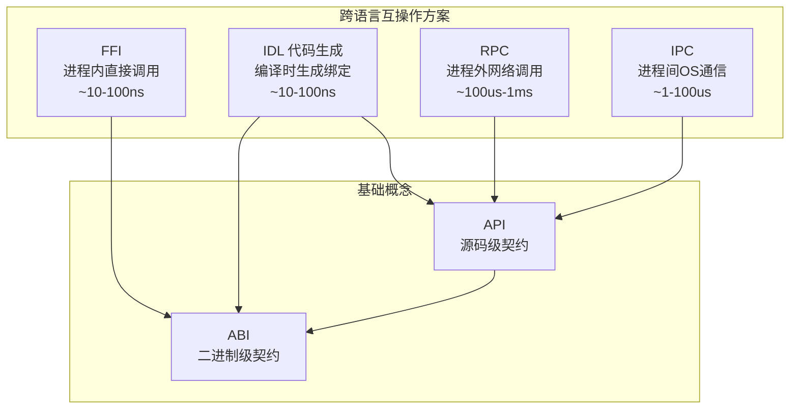
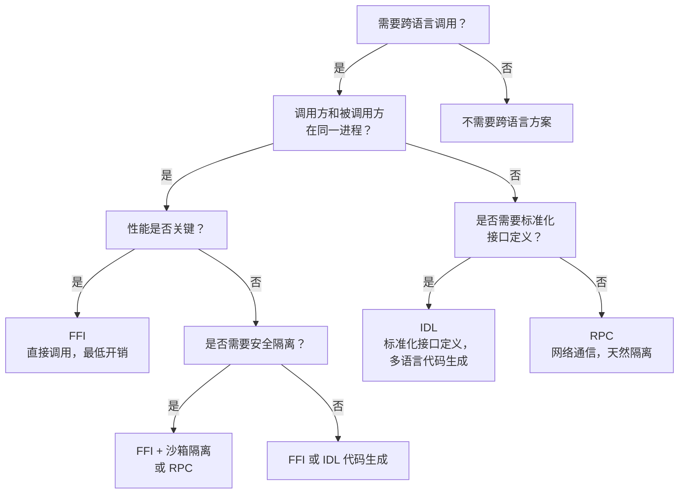

# 六、FFI 与相关概念对比

FFI 并非孤立存在——它与 ABI、API、IDL、RPC、IPC 等概念共同构成了跨语言、跨进程互操作的技术生态。本章通过多维度对比表格、关系图和选型决策树，帮助读者厘清这些概念之间的边界与关联。

## 六概念多维对比

| 维度 | FFI | ABI | API | RPC | IPC | IDL |
|---|---|---|---|---|---|---|
| 定义 | 跨语言调用机制 | 二进制接口规范 | 源码级编程契约 | 远程过程调用 | 进程间通信 | 接口定义语言 |
| 抽象层次 | 语言运行时层 | 二进制/机器码层 | 源代码层 | 网络/传输层 | 操作系统层 | 规范/元数据层 |
| 通信方式 | 进程内函数调用 | 寄存器/栈传参 | 函数/方法调用 | 网络消息 | 管道/共享内存/消息队列 | 编译生成代码 |
| 性能量级 | ~10-100ns | ~1ns | 语言原生 | ~100us-1ms | ~1-100us | 取决于生成代码 |
| 安全边界 | 无隔离（同进程） | 无隔离 | 类型系统保证 | 网络隔离 | OS隔离 | 取决于生成代码 |
| 典型场景 | 跨语言库调用 | 编译器/链接器输出 | 模块间调用 | 微服务通信 | 本地进程协作 | 多语言服务定义 |
| 代表技术 | ctypes / JNI / cgo / P/Invoke | System V AMD64 / Windows x64 | REST / GraphQL | gRPC / Thrift / Dubbo | 管道 / 共享内存 / Unix Socket | Protobuf / Thrift IDL / CORBA IDL |

## 概念层次关系



**层次解读**：

- **ABI** 是最底层的二进制契约，定义了调用约定、数据类型布局、符号解析等二进制动规则。所有跨语言方案最终都依赖 ABI。
- **API** 是源码级契约，定义了模块/服务对外暴露的编程接口。RPC 和 IPC 通过 API 定义通信边界，IDL 生成 API 代码。
- **FFI** 直接建立在 ABI 之上，通过手动绑定实现跨语言调用，无需额外抽象层。
- **IDL** 同时依赖 ABI 和 API：通过 IDL 定义生成 API 代码，生成的代码再通过 ABI 实现跨语言互操作。
- **RPC/IPC** 依赖 API 但不一定依赖 ABI——它们通过序列化/反序列化在进程间传递数据，两端可以是不同语言和平台。

## 选型决策树



**决策要点**：

1. **同进程 + 高性能 = FFI**：直接通过 ABI 调用，无序列化开销，性能最高。
2. **同进程 + 标准化 = IDL 代码生成**：通过 IDL 定义接口，编译器生成类型安全的绑定代码，适合大型多语言项目。
3. **跨进程 + 标准化 = RPC**：天然网络隔离，适合微服务架构和服务解耦。
4. **跨进程 + 本地通信 = IPC**：适合同一机器上的进程间数据交换，性能优于 RPC 但隔离性相同。

## 常见混淆点澄清

### FFI 不是 ABI 的替代品，而是使用者

ABI 是二进制动规则（调用约定、寄存器使用、栈布局、类型表示），由编译器和操作系统定义。FFI 是建立在这些规则之上的跨语言调用机制——它遵循 ABI 来正确地在不同语言之间传递参数和返回值。可以将 FFI 理解为：

```
FFI = ABI 规则 + 语言特定绑定 + 类型封送（Marshalling）
```

没有 ABI 就没有 FFI；FFI 的价值在于封装了 ABI 的复杂性，使开发者无需手动处理寄存器分配和栈帧布局。

### FFI 与 IDL 不是竞争关系，而是不同路径

两者都实现跨语言互操作，但工作流截然不同：

| 维度 | FFI | IDL |
|---|---|---|
| 工作流 | 自底向上：从已有库出发，手动编写绑定 | 自顶向下：从接口规范出发，自动生成代码 |
| 适用场景 | 调用已有 C 库，无需修改被调用方 | 新项目多语言协作，接口先行定义 |
| 类型安全 | 手动保证，容易出错 | 编译器生成，类型安全有保障 |
| 灵活性 | 高度灵活，可调用任意函数 | 受限于 IDL 表达能力 |

实践中，两者常结合使用：IDL 生成的代码内部也可能使用 FFI 调用底层库。

### FFI 与 RPC 适用于不同场景

| 维度 | FFI | RPC |
|---|---|---|
| 通信方式 | 进程内函数调用 | 进程外网络调用 |
| 性能 | 极快（~10-100ns） | 较慢（~100us-1ms） |
| 隔离性 | 无隔离，崩溃会传播 | 完全隔离，崩溃不影响调用方 |
| 安全性 | 同进程，被调用方可直接访问调用方内存 | 网络隔离，需通过序列化交换数据 |
| 典型场景 | 性能敏感的计算密集型任务 | 服务解耦、微服务架构 |

**选择原则**：追求性能选 FFI，追求解耦与安全选 RPC。如果两者都需要（高性能 + 隔离），可考虑 FFI + 沙箱方案，或使用基于共享内存的 IPC 折中。

## 交叉引用

- 接口/API/ABI/协议四概念对比，详见 [interface-api-abi-protocol-wiki](../interface-api-abi-protocol-wiki/05-comparison.md)
- IDL 规范对比，详见 [idl-wiki](../idl-wiki/05-comparison.md)

---

> **上一章**：[05-advantages-limitations.md](05-advantages-limitations.md)
> **返回目录**：[00-overview.md](00-overview.md)
> **下一章**：[07-resources.md](07-resources.md)