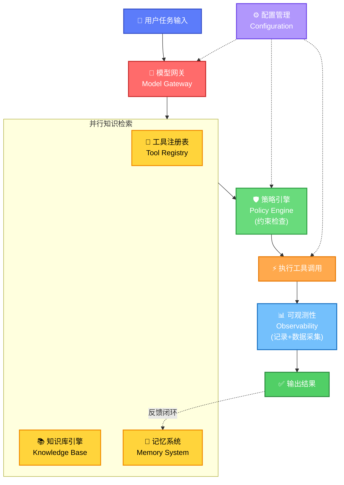

# 核心概念：从智能到交付——为什么需要Harness

## 一、从一个痛点说起

很多人做Agent（智能体），还是停留在很浅的理解：给大模型写一段提示词，让它回答问题、生成内容、调用工具。但只要你真的做过Agent落地，就会发现Prompt（提示词）只是开始。难的是另一堆问题：

- 它该用哪个模型？
- 能调用哪些工具？
- 从哪里拿业务知识？
- 怎么防止越权、乱说、乱操作？
- 出错以后怎么定位？

这些问题，单靠一个大模型解决不了。

## 二、核心命题：智能问题 vs 交付问题

> **大模型只能解决智能问题，Harness（驾驭框架）才能解决交付问题。**

- **LLM（大语言模型）**是聪明的大脑——它能推理、理解、生成
- **Harness**是让这个大脑能干活的工作系统——它负责组织、约束、记录、调度
- 没有Harness，Agent只能回答"应该怎么做"
- 有了Harness，Agent才能真的去查、去判断、去调用工具、去执行、去记录、去复盘

这不是对模型能力的否定，而是一个更务实的认知：模型提供了"能"的潜力，Harness把这种潜力变成"稳"的交付。

## 三、家庭聚餐：一个生活化的Harness

假设你请了一个很聪明的私人助理（像极了Agent）帮你安排周末家庭聚餐。你说"帮我安排这周末的家庭聚餐"。

如果只有LLM，它会给你一份看起来完整的建议：确认人数、选餐厅、安排交通、照顾饮食偏好。听起来很对——但它真的能办成吗？

- 它不知道谁不能吃辣
- 不知道预算是多少
- 不知道上次哪家餐厅体验很差
- 不知道谁需要接送
- 不知道哪些事可以自己决定、哪些必须先问你

要让它真正办成事，你需要给它一整套系统——这就是生活版的Harness。

## 四、七大组件一句话定义与核心职责

| 序号 | 组件 | 英文 | 一句话定义 | 核心职责 | 家庭聚餐类比 |
|------|------|------|-----------|---------|------------|
| 1 | 模型网关 | Model Gateway | Agent的大脑调度中心 | 决定什么任务用什么模型 | 什么事问哪个助理 |
| 2 | 工具注册表 | Tool Registry | Agent的手脚管理 | 管理可用工具、参数、失败处理 | 能用日历/地图/预订系统 |
| 3 | 知识库引擎 | Knowledge Base Engine | Agent的业务参考书 | 提供私有业务知识和判断力 | 历史记录/餐厅评价/偏好 |
| 4 | 记忆系统 | Memory System | Agent的便签本和档案柜 | 记住当前上下文和长期偏好 | 记住刚否掉火锅/上次别太远 |
| 5 | 策略引擎 | Policy Engine | Agent的规则红线 | 将规则变为强制约束 | 预算不超2000/未经确认不付款 |
| 6 | 可观测性 | Observability | Agent的运营仪表盘 | 记录执行、追踪数据、闭环改进 | 花了多少钱/哪里出问题 |
| 7 | 配置管理 | Configuration Management | Agent的调教面板 | 支持任务级参数调整 | 这次预算/优先考虑谁 |

## 五、组件协作流程



**流程说明**：

1. **用户任务输入**：起点，接收用户的业务需求
2. **模型网关**：第一站，根据任务类型路由到合适的模型（强模型做判断、便宜模型做整理）
3. **并行知识检索**：模型同时访问工具、知识库、记忆，收集完成任务所需的全部信息
4. **策略引擎**：横切检查，确保所有操作都在规则红线内（预算、权限、安全等）
5. **执行工具调用**：通过检查后，实际调用外部工具完成操作
6. **可观测性**：全程记录，采集数据用于后续优化
7. **输出结果**：返回最终交付物
8. **配置管理**：贯穿全程，通过任务级参数影响模型选择、策略阈值、工具权限
9. **反馈闭环**：执行结果回写记忆系统，形成持续学习

## 六、Prompt只是开始

要理解Harness的价值，先理解Prompt的局限：

- Prompt是"软请求"——模型可能听可能不听
- Prompt依赖模型"听懂"并"遵守"
- Prompt难以系统化、工程化
- Prompt在模型版本升级后可能失效

Harness的组件是"硬约束"：

- 模型网关决定用哪个模型——不是请求，是路由
- 工具注册表定义能调用什么——不是建议，是白名单
- 策略引擎设定红线——不是提醒，是强制
- 可观测性记录一切——不是可选，是必须

> **核心原则：该用好模型的地方不要省，该用便宜模型的地方不要浪费，能用规则解决的地方就别麻烦大模型。**

## 七、组件间的依赖关系

七大组件不是孤立的，它们之间有清晰的依赖关系：

| 组件 | 依赖类型 | 依赖对象 | 说明 |
|------|---------|---------|------|
| 模型网关 | 入口依赖 | 配置管理 | 所有任务首先经过模型路由，路由规则受配置影响 |
| 工具注册表/知识库引擎/记忆系统 | 并行依赖 | 模型网关、策略引擎 | 三者并行服务于模型推理，访问权限受策略约束 |
| 策略引擎 | 横切依赖 | 所有组件 | 横切所有组件，约束工具调用、知识访问、记忆读写 |
| 可观测性 | 全局依赖 | 所有组件 | 全局记录所有组件的运行状态，不参与业务逻辑 |
| 配置管理 | 贯穿依赖 | 所有组件 | 贯穿全程，影响模型选择、工具权限、策略阈值 |

**依赖关系可视化**：

```
┌─────────────────────────────────────────────────────────────┐
│                     📊 可观测性（全局记录）                    │
├─────────────────────────────────────────────────────────────┤
│  🚦模型网关 → [🔧工具注册表 + 📚知识库 + 💾记忆系统] → ⚡执行  │
│       ↑              ↓               ↑             ↓       │
│       └────────── 🛡️策略引擎（横切约束） ──────────┘        │
├─────────────────────────────────────────────────────────────┤
│                     ⚙️ 配置管理（全程影响）                    │
└─────────────────────────────────────────────────────────────┘
```

---

[🏠 返回总览](00-overview.md) | [➡️ 模型网关](02-model-gateway.md)
