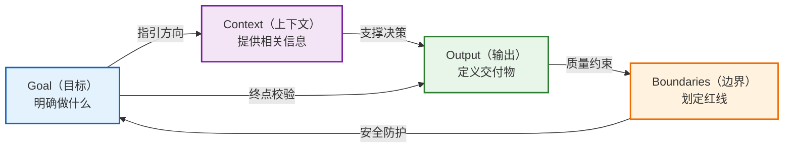

# GCOB四要素框架：Goal-Context-Output-Boundaries

---

## 1. 章节引言

GCOB = Goal（目标）+ Context（上下文）+ Output（输出）+ Boundaries（边界），这是OpenAI官方Prompting指南的核心框架。

一句短prompt往往够用，但任务更大或更重要时，把关键的四块信息带上。不需要每一项都填，也没有必须遵守的格式，只用对你有帮助的部分。

> 🟢 **来源标注**：本框架来自OpenAI官方Prompting指南（Eric Provencher著）。

---

## 2. 框架总览

GCOB四要素构成了结构化Prompt的核心骨架：

| 要素 | 核心问题 | 作用 |
|------|---------|------|
| **Goal** | 模型该做什么？ | 明确终点，选择最优路径 |
| **Context** | 哪些信息能帮上忙？ | 提供背景，避免瞎猜 |
| **Output** | 你需要什么格式、多长、多细？ | 匹配用途，选对组织方式 |
| **Boundaries** | 哪些东西不能动？哪些事该避开？ | 防止越界，避免返工 |

---

## 3. Goal（目标）：模型该做什么？

### 3.1 定义

从结果说起，不要从一长串步骤说起。

### 3.2 为什么重要

模型需要知道终点才能选择最优路径。如果你只给过程不给目标，模型会机械执行步骤，可能无法达到你真正想要的效果。

### 3.3 使用要点

- 描述你要的结果而非过程（"把会议记录整理成项目组简报，决策放最前"而非"先分析再总结再整理"）
- 当受众或格式会影响产出时，把它们写进去
- 只有当过程本身重要时才描述过程

### 3.4 示例

✅ **正面示例**：
> "把这些会议记录整理成一份给项目组的简短进展通报。决策和下一步行动放在最前面。"

❌ **反面示例**：
> "你是一位资深项目管理专家，请仔细阅读以下会议记录，先提取关键信息，再进行分类整理，最后输出一份专业的会议纪要。"

### 3.5 常见错误

- 目标模糊
- 用形容词代替具体要求（"深入分析""全面解读"）
- 规定不必要的思考流程

---

## 4. Context（上下文）：哪些信息或来源能帮上忙？

### 4.1 定义

把可能改变结果的信息给模型，只加真正相关的来源，说明每个来源该取什么。

### 4.2 为什么重要

模型不知道你的项目背景、过往决策、特殊约束。没有上下文，它只能基于通用知识回答，结果往往不符合你的具体情况。

### 4.3 使用要点

- 附上相关文档/电子表格/PDF时，说明要总结/比对/转换/生成什么
- 视觉任务加截图/示意图，指出关键区域，不要只把图丢过去
- 答案依赖最新信息时明确要求用网页搜索并附来源
- 相关对话/任务共享文件时使用Project组织
- 用已连接数据源时点名去哪找、找什么，不需要描述每次检索
- 需要跨对话生效的偏好放在个性化设置里，只对当前任务有用的写在prompt里

### 4.4 示例

✅ **正面示例**：
> "用Drive里最新的项目计划，加上Slack频道里相关决策和进展，准备状态通报。"

❌ **反面示例**：
> （无任何上下文直接问"分析一下这个项目怎么样"）

### 4.5 常见错误

- 信息过载（dump所有文档）
- 不说明来源用途
- 遗漏关键约束信息

---

## 5. Output（输出）：你需要什么格式、多长、多细？

### 5.1 定义

告诉模型你打算怎么用结果，帮助它选对长度、详细程度和组织方式。

### 5.2 为什么重要

不同用途需要完全不同的输出（一页纸摘要vs详细分析报告vs可执行代码）。不说清楚，模型只能猜你想要什么。

### 5.3 使用要点

- 说明受众（总监/工程师/新员工/客户）
- 明确格式（表格/邮件/代码/一页纸/Markdown）
- 指定结构（决策放最前面/行动计划/对比表）
- 重要工作要求终检（确认每个行动项有负责人和截止日期，标记无法核实的信息）

### 5.4 示例

✅ **正面示例**：
> "做成一页纸摘要，总监开会前扫一眼就行。决策和下一步放最前面。收尾前检查每个行动项都有负责人和截止日期。"

❌ **反面示例**：
> "请输出分析结果。"

### 5.5 常见错误

- 不说用途
- 不指定格式
- 不要求验证检查

---

## 6. Boundaries（边界）：哪些东西不能动？哪些事该避开？

### 6.1 定义

那么几条指令，防止模型制造额外工作或做出你没打算让它做的动作。

### 6.2 为什么重要

改错一个细节结果就没法用，或者某件事影响别人之前你想先过目。边界是安全网，不是枷锁。

### 6.3 使用要点

- 盯住最要紧的一两条边界，不需要控制每一步
- 关键数字/日期/预算不可修改
- 只用提供的来源，信息缺了就标出来不要猜
- 建议控制在预算内
- 草稿模式：准备消息但不要发送
- Agent任务明确禁止修改的目录/文件/依赖

### 6.4 示例

✅ **正面示例**：
> "已批准的日期和预算数字保持不动。只用我提供的来源，信息缺了标出来不要猜。任何东西都不要发送或发布。"

❌ **反面示例**：
> （完全没有边界，模型擅自修改关键数据）

### 6.5 常见错误

- 边界过多过细（微观管理）
- 关键红线未说明
- 不区分必须遵守vs建议参考

---

## 7. 把这些拼在一起：完整Prompt示例（中英对照）

### 7.1 英文原文

> Prepare a one-page project status update for Monday's leadership meeting. Use the latest project plan in Drive and relevant decisions and updates from the project's Slack channel. Lead with the decisions leadership needs to make and the next steps. Summarize progress, risks, owners, and due dates. Keep approved dates and budget figures unchanged. Flag any conflicting or missing information, and don't send or publish anything. Before you finish, check that every next step has an owner and due date.

### 7.2 中文翻译

> 为周一的管理层会议准备一份一页纸的项目状态通报。用Drive里最新的项目计划，加上项目Slack频道里相关的决策和进展。管理层需要拍板的决策和下一步行动放在最前面。总结进度、风险、负责人和截止日期。已批准的日期和预算数字保持不动。有冲突或缺失的信息就标出来，任何东西都不要发送或发布。收尾前，检查每个下一步都有负责人和截止日期。

### 7.3 要素分析

这个Prompt覆盖了Goal/Context/Output/Boundaries，最后要了一次终检，但没有把每一步都写死：

| GCOB要素 | 对应内容 |
|---------|---------|
| **Goal** | 准备项目状态通报，决策和下一步放最前面 |
| **Context** | Drive里的最新项目计划 + Slack频道的决策和进展 |
| **Output** | 一页纸，面向管理层，总结进度/风险/负责人/截止日期 |
| **Boundaries** | 日期预算不改、只用提供来源、缺信息标出来、不发送发布 |
| **终检** | 每个下一步都有负责人和截止日期 |

---

## 8. 四要素快速判断清单

写Prompt时快速过一遍：

- [ ] **Goal**：我是否说清了要什么结果？
- [ ] **Context**：我是否给了必要的背景和来源？
- [ ] **Output**：我是否说了格式、受众、详细程度？
- [ ] **Boundaries**：我是否划了不能碰的红线？

---

## 9. 用追问改进结果

第一条Prompt不需要完美。

- 看完结果再说具体改动
- 可以补来源、纠正方向、再要一个方案、调整详细程度，不用从头再来
- 保持对话迭代

Prompt Engineering是对话，不是考试——你不需要一次就写对，迭代改进才是常态。

---

## 10. 本章小结

### 10.1 核心要点回顾

1. **GCOB是结构化Prompt的核心框架**：Goal说清结果，Context给足背景，Output定义格式，Boundaries划定红线
2. **从结果出发而非过程**：Goal描述你要什么，不要规定怎么思考
3. **Context要精准不要堆砌**：只给真正相关的信息，说明每个来源用来做什么
4. **Output匹配用途**：想清楚谁看、怎么用、要多长，明确告诉模型
5. **边界要少而关键**：盯住最要紧的1-2条红线，不要微观管理每一步
6. **第一条不需要完美**：通过对话迭代改进，不用一次写对

### 10.2 下一步

掌握了GCOB四要素框架之后，下一章我们将学习OpenAI官方Prompt指南中的新范式规则——这些规则是在GCOB基础上的具体写作技巧，告诉你什么样的写法更有效、什么样的写法应该避免。

👉 继续阅读：[04-new-paradigm-rules.md](04-new-paradigm-rules.md)（新范式写作规则）
👉 返回上一章：[02-seven-concepts-mapping.md](02-seven-concepts-mapping.md)（七概念方法论映射）

---

*本文件版本：v1.0 | 创建日期：2026-07-13 | 状态：🚧 建设中 | 来源：OpenAI官方Prompting指南*
