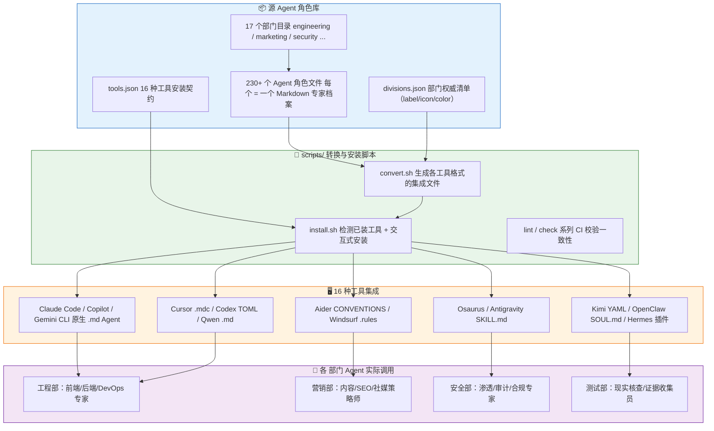

# The Agency 完全指南 — 概述

> 一句话摘要：本教程系统讲解 AI 专家角色库项目 **The Agency（agency-agents）**——一个包含 230+ 个专职 AI Agent、横跨 17 个部门的"AI 梦之队"，教你如何通过一套 Markdown 角色文件，在 Claude Code、Cursor、Codex 等 16 种 AI 编程工具中调用这些各怀绝技的专家，让它们像真实团队一样协作交付成果。

---

## 1. 教程介绍

The Agency（仓库名 `agency-agents`，开源地址 [github.com/msitarzewski/agency-agents](https://github.com/msitarzewski/agency-agents)）是一个**持续增长的 AI Agent 角色集合**。它的前身源于一条 Reddit 帖子——作者在 r/ClaudeAI 上分享了关于"AI Agent 专业化"的想法，得到了热烈响应（前 12 小时就收到 50+ 条请求），随后经过数月的持续迭代，成长为如今这个由全球社区共同维护的庞大角色库。

每个 Agent 都是一个**独立的 Markdown 文件**，代表一位"专职专家"——从前端开发者、后端架构师到 Reddit 社区运营、Whimsy Injector（趣味注入师）、Reality Checker（现实核查员），再到 GIS 工程师与游戏开发引擎专家。它们不是通用提示词模板，而是具备**人格、流程、可交付成果与成功指标**的完整角色定义。

截至 2026 年 8 月，该项目在 GitHub 上获得了大量 Star，成为社区中最受欢迎的 AI Agent 角色库之一，并配套推出了跨平台桌面应用 **agencyagents.app**（macOS / Linux / Windows）。

本教程以 [官方 README](https://github.com/msitarzewski/agency-agents) 与源仓库的真实目录结构为核心参考，按照"先看全貌、再深入细节、最后实战落地"的原则组织为 11 个章节。

### 为什么选择 The Agency？

如果把 AI 编程助手比作"一把万能工具"，那么 The Agency 就是"一整支专业工具箱"。下表对比了三种常见方案与 The Agency 的差异：

| 对比维度 | 通用 AI 提示词 | 提示词库（Prompt Library） | AI 工具（黑盒） | The Agency |
|---------|--------------|--------------------------|---------------|-----------|
| **定位** | 一句"扮演开发者"的临时指令 | 零散的提示词收藏 | 封装好的傻瓜化工具 | 完整的 Agent 角色系统 |
| **专业化** | ❌ 泛泛而谈 | ⚠️ 单点可用 | ⚠️ 固定功能 | ✅ 深度专精 + 人格 + 流程 |
| **可交付** | 无明确产出物 | 无 | 固定输出 | ✅ 真实代码、流程、可度量结果 |
| **可定制** | 可改但无体系 | 可改但零散 | ❌ 黑盒不可改 | ✅ 透明、可 Fork、可性格化 |
| **多工具** | 依赖单一助手 | 依赖单一助手 | 绑定单一产品 | ✅ 一套角色适配 16 种工具 |
| **团队协作** | 无 | 无 | 无 | ✅ 多部门 Agent 协同 |

> **一句话总结**：The Agency 既不是"扮演 X 的提示词"，也不是"看不懂的黑盒工具"，而是一套**透明、可定制、可跨工具复用**的 Agent 角色体系——你拥有每一个角色的完整定义，可以按需修改、自由组合。

---

## 2. 目标受众

本教程面向以下读者，每个角色都给出了建议阅读路径：

| 角色 | 典型需求 | 建议阅读章节 |
|------|---------|-------------|
| **前端/后端开发者** | 在 Claude Code / Cursor / Codex 中快速调用工程专家 Agent 提升编码效率 | 00、01、02、05、06 |
| **AI 编程工具重度用户** | 想搞懂 Agent 角色文件如何被 16 种工具转换与安装 | 00、01、04、05 |
| **提示词工程师 / Agent 设计者** | 学习如何编写高质量、带人格的 Agent 角色定义 | 00、02、03、09 |
| **技术团队 Leader** | 评估是否引入多部门 Agent 协作体系、制定落地规范 | 00、01、07、09、10 |
| **开源项目贡献者** | 想为 The Agency 提交新 Agent 或改进现有角色 | 00、02、04、08、10 |
| **非技术业务人员** | 用营销 / 销售 / 支持等部门 Agent 辅助内容创作与运营 | 00、03、05、06、09 |

> **特别关注**：如果你正在使用 Trae、Claude Code、Cursor、Codex 等 AI 编程助手，The Agency 可以看成"给 AI 助手装上不同专业人格的插件库"——每个 Agent 就是一份可以被这些工具直接读取的专家档案。

---

## 3. 章节导航

本教程共 11 章，从总览到落地循序渐进：

| 章节 | 标题 | 内容概要 | 难度 |
|------|------|---------|------|
| 00 | [概述](00-overview.md)（当前页） | 项目介绍、目标受众、整体架构、核心特性 | ⭐ |
| 01 | [文件夹架构](01-architecture.md) | 顶层文件、divisions.json / tools.json、17 个部门目录 | ⭐ |
| 02 | [Agent 文件格式解析](02-agent-format.md) | frontmatter 字段、正文 8 大章节、AI Engineer 实例拆解 | ⭐⭐ |
| 03 | [部门名册](03-roster-divisions.md) | 17 个部门及标志性 Agent 逐一手册、选型建议 | ⭐⭐ |
| 04 | [脚本体系](04-scripts-tooling.md) | convert.sh / install.sh / lint 系列脚本、CI 校验 | ⭐⭐⭐ |
| 05 | [多工具集成](05-integrations.md) | 16 种工具转换格式、安装路径、集成文件生成 | ⭐⭐⭐ |
| 06 | [使用示例](06-usage-examples.md) | 启动 MVP、营销活动、企业功能开发等实战场景 | ⭐⭐ |
| 07 | [策略与运行手册](07-strategy-playbooks.md) | NEXUS 策略、6 阶段 playbook、运维 runbook | ⭐⭐⭐ |
| 08 | [常见问题](08-faq-troubleshooting.md) | 安装失败、OpenCode 数量限制、中文适配等问答 | ⭐⭐ |
| 09 | [最佳实践](09-best-practices.md) | 自定义角色、内存 / 工具声明、多 Agent 协作规范 | ⭐⭐⭐ |
| 10 | [总结与资源](10-summary-resources.md) | 知识回顾、社区资源、贡献指南、延伸阅读 | ⭐ |

---

## 4. 整体架构

The Agency 的核心价值在于"**一套角色来源，多端复用**"。源仓库中的 Agent 角色文件是唯一事实来源（single source of truth），通过脚本层转换为各工具所需格式，安装到对应的工具目录后即可调用。

> **架构解读**：源仓库中的 Agent 角色文件是唯一事实来源。`divisions.json` 给出 17 个部门的权威清单（被桌面应用与 CI 消费），`tools.json` 定义 16 种工具的安装契约。`convert.sh` 把每个角色转换成对应工具所需的格式，`install.sh` 检测你已安装的工具并把这些文件安装到正确的目录。完成安装后，你就能在对应的 AI 编程工具中，通过"激活某部门的某位专家"来调用它们。

---

## 5. 核心特性

The Agency 的每个 Agent 都遵循统一的设计哲学，以下是构成其竞争力的 5 个核心特性：

### 5.1 人格驱动（Personality-Driven）

每个 Agent 都不是"扮演角色的提示词"，而是拥有**独特的声音、沟通风格与做事方式**的完整角色。例如 Whimsy Injector 的设计哲学是"每个趣味元素都必须服务于功能或情感目的"；Evidence Collector 则坚持"不测试你的代码就会默认找出 3-5 个问题，并要求一切都有视觉证据"。这种**人格化**让 Agent 的输出更稳定、更有个性。

### 5.2 交付物导向（Deliverable-Focused）

每个 Agent 都强调**真实产出**而非空泛建议。AI Engineer 直接给出可运行的 PyTorch `nn.Module` 代码、Hugging Face Config-Model-Pipeline 模式；UI Designer 给出了完整的 CSS Design Token System 模板。读者可以直接复制、改造、使用。

### 5.3 可度量成果（Success Metrics）

每个 Agent 都定义了自己的成功指标。例如 AI Engineer 的"推理延迟 < 100ms、模型服务可用性 > 99.5%、准确率通常 85%+"；UI Designer 的"设计系统一致性 95%+、WCAG AA 对比度 4.5:1"。这让 AI 的产出**可检验、可期望**，而非"我觉得做得不错"。

### 5.4 多工具兼容（Multi-Tool Compatible）

一套角色定义通过 `convert.sh` + `install.sh` 就能适配 **16 种 AI 编程工具**——Claude Code、GitHub Copilot、Codex、Gemini CLI、Qwen Code、opencode、Osaurus、Aider、Antigravity、Kimi、OpenClaw、Windsurf、Hermes、Mistral Vibe、ZCode、Cursor。无需为每种工具重写角色，**一次定义、处处可用**。

### 5.5 可自定义（Customizable）

所有角色文件都是**透明、可 Fork、可修改**的纯文本 Markdown。你可以微调某个 Agent 的人格与流程，也可以从零提交新的 Agent 回馈社区。项目采用 MIT 许可证，个人与商业使用都免费。

---

## 6. 项目信息

最后，用一张表汇总 The Agency 的关键信息：

| 属性 | 值 |
|------|-----|
| **项目仓库** | [github.com/msitarzewski/agency-agents](https://github.com/msitarzewski/agency-agents) |
| **配套桌面应用** | [agencyagents.app](https://agencyagents.app)（macOS / Linux / Windows，可免克隆一键安装） |
| **许可证** | [MIT](https://opensource.org/licenses/MIT) |
| **开发语言** | Markdown（角色定义）+ Shell（scripts/ 脚本）|
| **Agent 数量** | 230+（官方声明；当前目录统计约 270 个角色文件）|
| **部门数量** | 17 |
| **支持工具** | 16 种 AI 编程工具 |
| **社区** | GitHub Discussions / Issues / r/ClaudeAI / #TheAgency |
| **多语言社区版** | zh-CN / pt-BR / ru / ko / ja / vi 等社区维护的翻译版本 |

> **下一步**：在 [文件夹架构](01-architecture.md) 中，我们将走进源仓库的目录结构，理解顶层文件、`divisions.json`、`tools.json` 以及 17 个部门目录各自扮演什么角色。

---

- 上一章：本章为教程概述（00）
- [下一章：文件夹架构](01-architecture.md) →