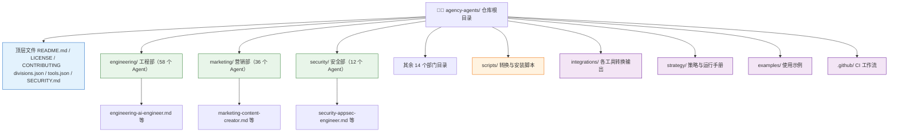

# The Agency 完全指南 — 文件夹架构

> 一句话摘要：本章带你走进 The Agency 源仓库的目录结构，理解顶层文件、`divisions.json`（17 个部门的权威清单）、`tools.json`（16 种工具的安装契约）以及 17 个部门目录与若干特殊目录各自扮演的角色，为后续理解 Agent 文件格式与多工具集成打下基础。

---

## 1. 顶层文件介绍

The Agency 仓库的根目录下，除了各部门目录，还有一批承担"门面"与"治理"作用的顶层文件。它们共同构成了项目的骨架：

| 文件 | 作用 | 说明 |
|------|------|------|
| **README.md** | 项目门面 | 最详尽的介绍：角色名录、快速开始、多工具集成说明、社区信息 |
| **LICENSE** | 许可证 | **MIT 许可证**，允许个人与商业任意使用 |
| **CONTRIBUTING.md** | 贡献指南 | 指导如何新增 Agent、改进现有 Agent、分享成功案例 |
| **CONTRIBUTING_zh-CN.md** | 中文贡献指南 | 面向中文贡献者的翻译版贡献说明 |
| **SECURITY.md** | 安全策略 | 安全漏洞报告流程与安全说明 |
| **divisions.json** | 部门权威清单 | 17 个部门的 label / icon / color 元数据，被桌面应用与 CI 消费 |
| **tools.json** | 工具安装契约 | 16 种支持工具的完整安装契约，被 installer 与桌面应用消费 |
| **.gitignore** | Git 忽略规则 | 忽略哪些文件不纳入版本控制 |
| **.gitattributes** | Git 属性 | 定义文件属性（如换行符处理、diff 行为） |

> **关键点**：`divisions.json` 与 `tools.json` 是整个项目"机器可读"的核心——它们不是给人类看的文档，而是给脚本、CI 和桌面应用消费的**权威数据源**。下面两节分别详解。

---

## 2. divisions.json——17 个部门的权威清单

`divisions.json` 是"**部门集合的唯一事实来源**"（source of truth）。它把每个部门目录（一个顶层 Agent 目录）映射为展示用的标签、图标与品牌色：

```json
{
  "divisions": {
    "engineering": { "label": "Engineering", "icon": "Code", "color": "#3B82F6" },
    "marketing":   { "label": "Marketing",   "icon": "Megaphone", "color": "#F97316" },
    "security":    { "label": "Security",    "icon": "ShieldCheck", "color": "#EF4444" }
  }
}
```

每个部门条目包含三个字段：

| 字段 | 含义 | 示例 |
|------|------|------|
| **label** | 人类可读的显示名称 | `Engineering` |
| **icon** | Lucide 图标名（PascalCase） | `Code` |
| **color** | 品牌色（十六进制） | `#3B82F6` |

这份清单被 **Agency Agents 桌面应用**和各类目录工具消费，用于渲染漂亮的部门选择界面。同时，CI 脚本 `scripts/check-divisions.sh`（对应 GitHub 工作流 `check-divisions.yml`）会校验数组与磁盘上的目录是否一致，一旦不一致就**使构建失败**——从而确保"目录存在什么，清单就声明什么"。

> **注意**：`divisions.json` 的 `_note` 字段特别说明——**并非每个顶层目录都是部门**。`integrations/`（工具转换输出）、`strategy/`（策略与运行手册）、`examples/`、`scripts/` 都被排除在部门之外（通过 `check-divisions.sh` 中的 `NON_DIVISION_DIRS` 声明）。一个目录要成为"部门"，必须**至少包含一个带 frontmatter 的 Agent 文件**。

---

## 3. tools.json——16 种工具的安装契约

`tools.json` 是"**支持的工具集合的唯一事实来源**"，以 CLI 工具名（kebab 形式）为键，每个条目承载完整的安装契约。下面以 Claude Code 和 Cursor 为例：

```json
{
  "tools": {
    "claude-code": {
      "id": "claudeCode", "label": "Claude Code", "short": "Claude",
      "kebab": "claude-code", "accent": "#D97757", "icon": "claudecode", "order": 1,
      "scope": { "user": true, "project": true },
      "detect": { "dirs": [".claude"], "agentsDir": ".claude/agents" },
      "version": { "bin": "claude", "args": ["--version"] },
      "format": "identity", "installKind": "per-agent",
      "slugFrom": "source",
      "dest": { "user": [".claude/agents/{slug}.md"], "project": [".claude/agents/{slug}.md"] }
    },
    "cursor": {
      "id": "cursor", "label": "Cursor", "short": "Cursor",
      "kebab": "cursor", "accent": "#1F2430", "icon": "cursor", "order": 6,
      "scope": { "user": false, "project": true },
      "detect": { "dirs": [".cursor"], "agentsDir": null },
      "version": { "bin": "cursor", "args": ["--version"] },
      "format": "cursor-mdc", "installKind": "per-agent",
      "slugFrom": "name",
      "dest": { "user": [], "project": [".cursor/rules/{slug}.mdc"] }
    }
  }
}
```

各字段含义如下：

| 字段 | 含义 | 说明 |
|------|------|------|
| **id / kebab** | 工具标识符 | `id` 为驼峰式，`kebab` 为短横线式（CLI 使用）|
| **label / short** | 显示名称 | `label` 完整名，`short` 缩写 |
| **accent / icon / order** | 展示元数据 | 强调色、图标、在列表中的排序 |
| **scope** | 安装范围 | `user`（用户级）与 `project`（项目级）是否支持 |
| **detect** | 检测配置 | 通过哪些目录 / `agentsDir` 检测该工具是否已安装 |
| **version** | 版本检查 | 用哪个命令探测工具版本 |
| **format** | 渲染器契约 | 标记输出格式；相同的 `format` 保证字节级一致的输出 |
| **installKind** | 安装机制 | `per-agent`（每 Agent 一个文件/目录）、`roster`（所有 Agent 合并为一个文件）、`plugin`（构建产物，仅 CLI 可安装）|
| **slugFrom** | slug 来源 | 用 `source`（源文件名）还是 `name`（Agent 名）生成 slug |
| **dest** | 目标路径模板 | `user` 与 `project` 的安装路径，`{slug}` 为占位符 |

> **关键点**：`installKind` 是每个消费方（installer、桌面应用）都要遵循的**上游事实**。例如 Aider 与 Windsurf 是 `roster`（分别生成单个 `CONVENTIONS.md` / `.windsurfrules`），而 Claude Code、Cursor 等是 `per-agent`（每个 Agent 独立文件）。`plugin` 类型的 Hermes 则只能通过 CLI 安装为一个构建产物。

---

## 4. 目录结构总览

下面用一张 Mermaid 图展示仓库的完整目录骨架：



---

## 5. 17 个部门目录清单

The Agency 目前有 **17 个部门**，每个部门是一个顶层目录，内含若干 Agent 角色文件。下表汇总了每个部门的功能定位与 Agent 数量（数量基于本项目目录文件统计，可能随社区更新而变化）：

| 部门目录 | 功能定位 | Agent 数 |
|---------|---------|:-------:|
| **academic** | 学术严谨性：为世界构建、叙事设计提供人类学、地理学、历史学等学术支撑 | 6 |
| **design** | 设计：视觉设计系统、UX 研究、品牌守护、趣味注入 | 10 |
| **engineering** | 工程：前端/后端/移动端/DevOps/AI/嵌入式等 58 位工程专家 | 58 |
| **finance** | 财务：簿记、财务分析、FP&A、投资研究、税务策略 | 5 |
| **game-development** | 游戏开发：跨引擎（Unity / Unreal / Godot / Blender / Roblox）+ 引擎无关专家 | 21 |
| **gis** | 地理信息：GIS 分析、空间数据工程、Web GIS、无人机实景建模 | 13 |
| **healthcare** | 医疗健康：临床证据、主权医疗系统、医疗创新策略 | 3 |
| **marketing** | 营销：内容/SEO/社媒/中国本地化/跨境电商等 36 位营销策略师 | 36 |
| **paid-media** | 付费媒体：PPC、搜索词分析、媒体投放、归因追踪 | 7 |
| **product** | 产品：产品经理、冲刺优先级、趋势研究、行为助推 | 5 |
| **project-management** | 项目管理：制片人、项目守护、Jira 流程、会议纪要 | 7 |
| **sales** | 销售：外呼策略、成交策略、销售工程师、管道分析 | 9 |
| **security** | 安全：安全架构、AppSec、渗透测试、合规审计、威胁情报 | 12 |
| **spatial-computing** | 空间计算：XR 界面、visionOS、WebXR、macOS 空间计算 | 6 |
| **specialized** | 专业垂直：57 位"装不进普通盒子里"的垂直专家（法务、医疗、财务、客服等）| 57 |
| **support** | 支持：客服响应、数据分析、基建维护、合规检查 | 6 |
| **testing** | 测试：证据收集、现实核查、性能基准、API 测试 | 9 |

> **提示**：上表数量为源目录文件统计（合计约 270）；官方 README 的"230+"指的是更早的里程碑。无论哪个数字，**engineering、marketing、specialized 都是最大的三个部门**，覆盖了大多数常见场景。

### 5.1 部门内部允许子目录

部分部门内部还按引擎/平台细分了子目录。例如 **game-development** 部门下就有 `unity/`、`unreal-engine/`、`godot/`、`blender/`、`roblox-studio/` 五个子目录，分别存放对应引擎的专家：

```
game-development/
├── game-designer.md
├── level-designer.md
├── technical-artist.md
├── unity/
│   ├── unity-architect.md
│   └── ...
├── unreal-engine/
│   ├── unreal-systems-engineer.md
│   └── ...
└── godot/
    ├── godot-gameplay-scripter.md
    └── ...
```

---

## 6. 非部门目录说明

并非所有顶层目录都是部门。以下目录承担特殊职责，被 `NON_DIVISION_DIRS` 明确排除在部门之外：

| 目录 | 职责 | 说明 |
|------|------|------|
| **integrations/** | 多工具转换输出 | 由 `scripts/convert.sh` 生成的、各工具专属格式的文件（每个工具一个子目录，如 `claude-code/`、`cursor/`、`codex/`），**不是源 Agent** |
| **strategy/** | 策略与运行手册 | 内含 `nexus-strategy.md`、`EXECUTIVE-BRIEF.md`、`QUICKSTART.md`、`playbooks/`（6 阶段）、`runbooks/`（4 场景）、`coordination/`（激活提示词与交接模板）|
| **examples/** | 使用示例 | 展示多 Agent 协作的完整示例，如 `nexus-spatial-discovery.md`、`workflow-startup-mvp.md`、`workflow-with-memory.md` |
| **scripts/** | 脚本 | `convert.sh`、`install.sh`、`lib.sh` 及 lint/check 系列校验脚本 |
| **.github/** | CI | `workflows/` 下的 `check-divisions.yml`、`check-runbooks.yml`、`check-tools.yml`、`lint-agents.yml`，以及 Issue / PR 模板 |

> **关键点**：`strategy/` 目录下的文件**没有 Agent frontmatter**，它们不是可安装的 Agent 角色，而是"如何使用这些 Agent"的方法论与作战手册。`integrations/` 则是**脚本的产物目录**，运行 `convert.sh` 后才会生成。

---

## 7. 设计哲学

理解了目录结构，就能体会到 The Agency 的三条设计哲学：

### 7.1 NEXUS 策略

`strategy/nexus-strategy.md` 定义了项目的核心协作策略——强调**多部门 Agent 像真实 Agency 一样并行协作**，每个 Agent 各司其职、共享一个统一的使命。这与"单 Agent 单任务"的简单用法形成对比，是 The Agency 最宏大的用法范式。

### 7.2 Agent 人格化

每个 Agent 都是一个**有名字、有性格、有记忆**的角色，而非匿名的提示词。目录结构（部门 → 角色）天然支持"组建团队"的思维方式——你从不同部门挑选专家，组成一支临时项目团队。

### 7.3 原子化理念

Agent 文件本身结构高度原子化：一个角色 = 一个文件，一个文件 = 一份完整的身份档案。这种"**单一职责、职责清晰**"的设计（在 AI Engineer 的 Core Capabilities 中甚至直接体现了"原子设计原则"）让角色易于复用、组合与维护，也便于脚本批量转换到 16 种工具。

> **下一步**：理解了目录结构后，在 [Agent 文件格式解析](02-agent-format.md) 中，我们将深入一个 Agent 文件内部，逐字段解析 frontmatter 与正文 8 大章节。

---

- [上一章：概述](00-overview.md) ←
- [下一章：Agent 文件格式解析](02-agent-format.md) →