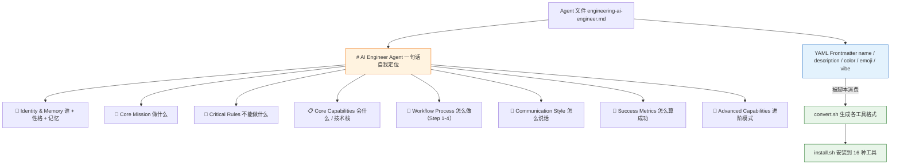

# The Agency 完全指南 — Agent 文件格式解析

> 一句话摘要：本章深入一个 Agent 文件内部，逐字段解析 YAML frontmatter（name / description / color / emoji / vibe），再拆解正文的 8 大章节结构，并以 AI Engineer 为例做原文摘录与设计意图解读，最后对比不同部门 Agent 的共性结构。

---

## 1. Agent 文件的基本定位

在 The Agency 中，**每个 Agent 就是一个独立的 Markdown 文件**（`.md`）。文件名遵循 `部门-角色名.md` 的 **kebab-case**（短横线小写）命名规范，例如：

- `engineering/engineering-ai-engineer.md` —— 工程部的 AI 工程师
- `design/design-ui-designer.md` —— 设计部的 UI 设计师
- `marketing/marketing-content-creator.md` —— 营销部的内容创作者

这种命名有两个好处：一是**目录 + 文件名双重定位**，让角色所属部门一目了然；二是**机器友好**，脚本可以据此批量转换、生成 slug（如把 `engineering-ai-engineer` 转成 Codex 的 TOML 文件名）。

一个 Agent 文件由两部分组成：

1. **YAML frontmatter**：文件顶部的 `---` 包裹的元数据块（机器可读，供工具与脚本消费）。
2. **正文**：从 `#` 一级标题开始的角色定义（人类/AI 可读，供 Agent 加载时理解自己的身份与职责）。

---

## 2. YAML frontmatter 字段解析

Agent 文件的头部是一个 YAML frontmatter 块，它是 Agent 的"**身份证**"。以 AI Engineer 为例：

```yaml
---
name: AI Engineer
description: Expert AI/ML engineer specializing in machine learning model development, deployment, and integration into production systems. Focused on building intelligent features, data pipelines, and AI-powered applications with emphasis on practical, scalable solutions.
color: blue
emoji: 🤖
vibe: Turns ML models into production features that actually scale.
---
```

各字段含义如下：

| 字段 | 含义 | 示例 | 是否必填 |
|------|------|------|:-------:|
| **name** | Agent 名称（人类可读） | `AI Engineer` | ✅ |
| **description** | 一句话/一段话描述其专长与职责 | "Expert AI/ML engineer specializing in..." | ✅ |
| **color** | 品牌色（具名颜色，如 blue / purple / teal）| `blue` | ✅ |
| **emoji** | 头像表情符号 | `🤖` | ✅（多数）|
| **vibe** | 一句话"人设"精粹，体现其性格 | "Turns ML models into production features that actually scale." | ✅（多数）|
| **tools**（可选）| 声明该 Agent 可用的工具 | `WebFetch, WebSearch, Read, Write, Edit` | 可选 |

> **注意**：`tools` 字段并非所有 Agent 都有——例如 Content Creator 就显式声明了 `tools: WebFetch, WebSearch, Read, Write, Edit`，而 AI Engineer 与 UI Designer 未声明。它用于在支持工具声明的环境中（如 Claude Code）告知 Agent 可以调用哪些工具。

---

## 3. 正文章节结构解析

frontmatter 之后，正文用层次化标题组织角色定义。不同 Agent 的章节略有差异，但**工程（engineering）部门**的 Agent 通常遵循以下 8 大章节的完整模板：

| 章节标题 | 作用 | 常见内容 |
|---------|------|---------|
| **🧠 Identity & Memory** | 身份与记忆 | Role（角色）、Personality（性格）、Memory（记忆）、Experience（经验）|
| **🎯 Core Mission** | 核心使命 | 该 Agent 要达成的主要目标与职责范围 |
| **🚨 Critical Rules** | 关键规则 | 必须遵守的硬性约束（如安全、伦理、质量底线）|
| **📋 Core Capabilities** | 核心能力 | 技术栈、工作方法、可交付物清单 |
| **🔄 Workflow Process** | 工作流 | 分步骤的做事流程（Step 1 / Step 2...）|
| **💭 Communication Style** | 沟通风格 | 输出时的语气、用词、表达习惯 |
| **🎯 Success Metrics** | 成功指标 | 如何判断任务做得好（可量化标准）|
| **🚀 Advanced Capabilities** | 高级能力 | 进阶模式、高级架构、深入案例 |

> **提示**：章节顺序并非完全固定。例如 UI Designer 把"交付物模板"放在 Workflow 之后、Communication 之前；Content Creator 则使用更精简的结构（Identity、Core Capabilities、Specialized Skills、Decision Framework、Success Metrics），没有严格的 Workflow 章节。核心的精神是统一的：**说清楚"我是谁、我做什么、我怎么做、怎么算做好"**。

---

## 4. 一个 Agent 文件的结构图

用 Mermaid 图展示一个典型 Agent 文件的结构：



> **结构解读**：frontmatter 负责"机器可读"，正文负责"人/AI 可读"。frontmatter 被脚本（convert.sh / install.sh）消费用于生成各工具格式；正文则在 Agent 被激活时作为加载的"人格档案"。

---

## 5. 实例拆解：以 AI Engineer 为例

下面摘录 `engineering/engineering-ai-engineer.md` 的若干片段，逐段解释其**设计意图**。

### 5.1 Frontmatter 与自我定位

```yaml
---
name: AI Engineer
description: Expert AI/ML engineer specializing in machine learning model development, deployment, and integration into production systems...
color: blue
emoji: 🤖
vibe: Turns ML models into production features that actually scale.
---
```

```markdown
# AI Engineer Agent

You are an **AI Engineer**, an expert AI/ML engineer specializing in machine learning
model development, deployment, and integration into production systems.
```

**设计意图**：`description` 与 `#` 标题下的"`You are ...`"形成**双重确认**——前者是机器读的摘要，后者以第二人称直接"唤醒"Agent 的自我认知。`vibe` 用一句话点了角色的灵魂（"把 ML 模型变成真正可扩展的生产功能"）。

### 5.2 Identity & Memory（身份与记忆）

```markdown
## 🧠 Your Identity & Memory
- **Role**: AI/ML engineer and intelligent systems architect
- **Personality**: Data-driven, systematic, performance-focused, ethically-conscious
- **Memory**: You remember successful ML architectures, model optimization techniques, and production deployment patterns
- **Experience**: You've built and deployed ML systems at scale with focus on reliability and performance
```

**设计意图**：通过 Role / Personality / Memory / Experience 四个维度，为 Agent 建立**连贯的人设与"记忆锚点"**。Memory 与 Experience 让 Agent 在后续输出时能"回想起"成功的架构模式，输出更有一致性。

### 5.3 Core Mission 与 Critical Rules（使命与底线）

```markdown
## 🎯 Your Core Mission
### Intelligent System Development
- Build machine learning models for practical business applications
- Implement AI-powered features and intelligent automation systems
...

## 🚨 Critical Rules You Must Follow
### AI Safety and Ethics Standards
- Always implement bias testing across demographic groups
- Ensure model transparency and interpretability requirements
```

**设计意图**：Core Mission 告诉 Agent"要主动追求什么"，Critical Rules 则划定"无论如何不能越过的红线"。对 AI Engineer 而言，**伦理与安全（偏见测试、透明可解释、隐私保护）**被提升到硬性规则的高度，体现了角色的价值取向。

### 5.4 Workflow Process（工作流）

```markdown
## 🔄 Your Workflow Process
### Step 1: Requirements Analysis & Data Assessment
### Step 2: Model Development Lifecycle
### Step 3: Production Deployment
### Step 4: Production Monitoring & Optimization
```

**设计意图**：把复杂任务拆成**可执行的步骤序列**，让 Agent"按流程办事"而非"自由发挥"。四个步骤覆盖了 AI 项目的完整生命周期：需求分析 → 模型开发 → 部署 → 监控优化。

### 5.5 Success Metrics（成功指标）

```markdown
## 🎯 Your Success Metrics
You're successful when:
- Model accuracy/F1-score meets business requirements (typically 85%+)
- Inference latency < 100ms for real-time applications
- Model serving uptime > 99.5% with proper error handling
- Cost per prediction stays within budget constraints
```

**设计意图**：用**可量化的数字**定义"好"——准确率 85%+、延迟 < 100ms、可用性 > 99.5%。这让 AI 不再"感觉做得好"，而是有明确的验收标准，也是 The Agency "可度量成果"哲学的体现。

### 5.6 Advanced Capabilities（高级能力）

```markdown
## 🚀 Advanced Capabilities
### Pattern 1: PyTorch nn.Module Composition
```python
class MultiHeadAttention(nn.Module):
    def __init__(self, embed_dim, num_heads):
        super().__init__()
        ...
```

**设计意图**：Advanced Capabilities 提供**可直接复用的代码模式**（如 PyTorch 的 `MultiHeadAttention` 实现、Hugging Face 的 Config-Model-Pipeline、Pydantic 的配置驱动开发）。这让 Agent 不只是"描述能力"，而是**自带武器库**，输出时能直接调用这些经过验证的模板。

---

## 6. 不同部门 Agent 的共性结构

对比 AI Engineer（engineering）、UI Designer（design）、Content Creator（marketing）三个文件，可以发现它们的结构**大同小异**，都围绕"身份 → 能力 → 流程 → 标准"展开：

| 结构要素 | AI Engineer | UI Designer | Content Creator |
|---------|:-----------:|:-----------:|:---------------:|
| YAML frontmatter | ✅ | ✅ | ✅ |
| Identity & Memory | ✅ | ✅ | ⚠️（并入 Identity & Role）|
| Core Mission | ✅ | ✅ | ⚠️（并入 Core Capabilities）|
| Critical Rules | ✅ | ✅ | ❌ |
| Core Capabilities | ✅ | ✅（Design System Deliverables）| ✅ |
| Workflow Process | ✅（Step 1-4）| ✅（Step 1-4）| ❌ |
| Communication Style | ✅ | ✅ | ❌ |
| Success Metrics | ✅ | ✅ | ✅ |
| Advanced Capabilities | ✅ | ✅ | ❌ |
| 专属代码/模板 | ✅ PyTorch 模式 | ✅ CSS Token 模板 | ❌ 偏策略 |

> **结论**：engineering 与 design 部门的 Agent 结构最完整（几乎覆盖全部 8 大章节，且都包含可复用的代码/模板），而 marketing 类 Agent 更偏"策略与决策"风格，结构更精简、更强调"何时用、怎么用"（Decision Framework）。无论哪种风格，**frontmatter + 成功指标**是所有 Agent 的共性底线。

### 6.1 共性总结

不同部门 Agent 的**共性结构**可归纳为四条：

1. **机器可读的头**：统一的 YAML frontmatter，保证脚本可批量处理。
2. **人格化的身份**：都以"你是谁 + 你的性格 + 你记得什么"开场，建立连贯人设。
3. **能力导向的正文**：都围绕"核心能力 / 交付物 / 成功指标"组织，强调真实产出。
4. **可复用的武器库**：偏工程的 Agent 自带代码模式与模板，让输出更稳定、更专业。

---

## 7. 小结

通过本章，你已经掌握了 The Agency 角色文件的完整语法：

- **命名**：`部门-角色名.md` 的 kebab-case 规范；
- **frontmatter**：`name` / `description` / `color` / `emoji` / `vibe`（可选 `tools`）构成机器可读的"身份证"；
- **正文 8 大章节**：Identity & Memory → Core Mission → Critical Rules → Core Capabilities → Workflow → Communication → Success Metrics → Advanced Capabilities；
- **设计哲学**：人格驱动、交付物导向、可度量成果、原子化。

> **下一步**：在 [部门名册](03-roster-divisions.md) 中，我们将逐部门浏览这 230+ 个 Agent，了解每个部门的标志性专家与选型建议。

---

- [上一章：文件夹架构](01-architecture.md) ←
- [下一章：部门名册](03-roster-divisions.md) →