# The Agency 完全指南 — 部门名册

> 一句话摘要：本章全面讲解 The Agency 的 17 个部门名册，用分类树、汇总表和逐部门子表呈现每个部门的 Agent 数量、核心成员、代表 Agent 能力与典型业务场景，并给出跨部门组合协作的实战建议，帮助你像搭积木一样按需挑选 Agent 组建自己的"虚拟团队"。

---

## 1. 部门体系总览

The Agency 是一个以 **Agent 角色库（Agent Roster）** 为核心的开源项目，仓库位于 [github.com/msitarzewski/agency-agents](https://github.com/msitarzewski/agency-agents)。它将 AI Agent 按"部门"（Division）分类组织，每个部门对应一个或一组业务职能域，部门下再细分为多个聚焦单一专长的 Agent 文件。

通过对仓库源码的实地统计，The Agency 当前包含 **17 个部门、共 270 个 Agent**（Markdown 文件）。每个 Agent 文件都以统一的 YAML frontmatter 开头（`name`、`description`、`color`、`emoji`、`vibe`），正文则详细定义该 Agent 的身份、核心使命、关键规则、技术交付物、工作流与成功指标——详见 [Agent 文件格式解析](02-agent-format.md)。

这 17 个部门可以按业务职能归入五大类：

- **工程与技术**：`engineering`、`design`、`game-development`、`gis`、`spatial-computing`、`testing`
- **商业与营销**：`marketing`、`paid-media`、`sales`、`finance`
- **产品与运营**：`product`、`project-management`、`support`
- **安全与合规**：`security`
- **专业垂直领域**：`academic`、`healthcare`、`specialized`

### 部门分类树

```mermaid
graph TD
    A["🔧 The Agency 17 部门 · 270 Agent"] --> B["🏗️ 工程与技术"]
    A --> C["📈 商业与营销"]
    A --> D["📋 产品与运营"]
    A --> E["🛡️ 安全与合规"]
    A --> F["🎓 专业垂直领域"]
    B --> B1["engineering 58"]
    B --> B2["design 10"]
    B --> B3["game-development 21"]
    B --> B4["gis 13"]
    B --> B5["spatial-computing 6"]
    B --> B6["testing 9"]
    C --> C1["marketing 36"]
    C --> C2["paid-media 7"]
    C --> C3["sales 9"]
    C --> C4["finance 5"]
    D --> D1["product 5"]
    D --> D2["project-management 7"]
    D --> D3["support 6"]
    E --> E1["security 12"]
    F --> F1["academic 6"]
    F --> F2["healthcare 3"]
    F --> F3["specialized 57"]
    style A fill:#f3e5f5,stroke:#6a1b9a
    style B fill:#e3f2fd,stroke:#1565c0
    style C fill:#fff3e0,stroke:#ef6c00
    style D fill:#e8f5e9,stroke:#2e7d32
    style E fill:#ffebee,stroke:#c62828
    style F fill:#ede7f6,stroke:#4527a0
```

> **设计思路解读**：不难发现，`engineering`（58 个）与 `specialized`（57 个）体量最大，两者合计占全库近一半。`engineering` 是按"技术栈 + 工程角色"横向铺开的通用工程能力池；`specialized` 则是按"行业 + 业务职能"纵向深入的专业角色池。两者互补，是组建跨职能团队时的绝对主力。

---

## 2. 部门名册总表

下表汇总全部 17 个部门的核心信息。**Agent 数量为对仓库目录下 `.md` 文件的真实统计**，未做任何估算。

| 部门 | 英文标识（目录） | Agent 数量 | 一句话定位 | 代表 Agent 示例 |
|------|----------------|:---:|-----------|----------------|
| 工程 | `engineering` | 58 | 横跨全技术栈的通用工程能力池（前端/后端/数据/AI/DevOps） | senior-developer、sre、prompt-engineer |
| 专业垂直 | `specialized` | 57 | 按行业与职能深挖的专业角色仓库（MCP/法务/招聘/财务等） | mcp-builder、business-strategist、chief-financial-officer |
| 市场营销 | `marketing` | 36 | 覆盖中外主流渠道的内容与增长运营矩阵 | growth-hacker、seo-specialist、xiaohongshu-specialist |
| 游戏开发 | `game-development` | 21 | 跨引擎（Unity/Godot/Unreal/Roblox）的游戏设计与制作 | game-designer、unity-architect、unreal-technical-artist |
| GIS 地理信息 | `gis` | 13 | 地图制图、空间数据与 WebGIS 全链路 | gis-analyst、gis-web-gis-developer、gis-spatial-data-engineer |
| 安全 | `security` | 12 | 从红队渗透到合规审计的安全纵深 | security-architect、security-penetration-tester、security-compliance-auditor |
| 设计 | `design` | 10 | 用户体验、界面与品牌视觉设计 | ux-researcher、ui-designer、brand-guardian |
| 销售 | `sales` | 9 | 从线索到成交的复杂 B2B 打法 | deal-strategist、sales-engineer、outbound-strategist |
| 测试 | `testing` | 9 | 自动化测试、性能与可访问性质量保障 | test-automation-engineer、testing-reality-checker、testing-api-tester |
| 付费媒体 | `paid-media` | 7 | 大规模付费投放策略与审计 | ppc-strategist、paid-media-auditor、programmatic-buyer |
| 项目管理 | `project-management` | 7 | 规格转任务、工作流与会议纪要 | project-manager-senior、jira-workflow-steward、project-shepherd |
| 学术 | `academic` | 6 | 人类学/地理/历史等学术研究角色 | anthropologist、statistician、historian |
| 空间计算 | `spatial-computing` | 6 | visionOS / XR / 空间界面开发 | visionos-spatial-engineer、xr-immersive-developer、xr-interface-architect |
| 支持 | `support` | 6 | 客户支持、运营与合规辅助 | support-responder、support-analytics-reporter、legal-compliance-checker |
| 财务 | `finance` | 5 | 财务建模、分析与税务规划 | financial-analyst、fpa-analyst、tax-strategist |
| 产品 | `product` | 5 | 产品全生命周期与优先级管理 | product-manager、product-trend-researcher、feedback-synthesizer |
| 医疗健康 | `healthcare` | 3 | 临床证据与医疗 AI 合规定位 | clinical-evidence-agent、innovation-strategist、sovereign-health-systems-agent |
| **合计** | — | **270** | — | — |

---

## 3. 各部门详细介绍

### 3.1 工程部（engineering）— 58 个 Agent

**定位**：The Agency 中最庞大的部门，横向覆盖从底层基础设施到上层应用的全技术栈工程能力，是任何软件项目的中坚力量。

**核心 Agent 清单**（节选主要角色）：

| Agent 名 | 文件路径 | 专长 | 适用场景 |
|---------|---------|------|---------|
| Senior Developer | `engineering/engineering-senior-developer.md` | Laravel/Livewire/FluxUI 高级全栈实现 | 高端 Web 体验、主题交互 |
| Software Architect | `engineering/engineering-software-architect.md` | 系统架构与演进设计 | 架构评审、技术选型 |
| Frontend Developer | `engineering/engineering-frontend-developer.md` | 前端工程与交互实现 | Web 页面开发 |
| Backend Architect | `engineering/engineering-backend-architect.md` | 后端体系与 API 设计 | 服务端架构 |
| Data Engineer | `engineering/engineering-data-engineer.md` | 数据管道与 ETL | 数据集成与清洗 |
| SRE | `engineering/engineering-sre.md` | 站点可靠性工程 | 可观测性、故障演练 |
| DevOps Automator | `engineering/engineering-devops-automator.md` | CI/CD 自动化 | 流水线搭建与运维 |
| AI Engineer | `engineering/engineering-ai-engineer.md` | AI 应用工程化 | LLM 应用、Agent 开发 |
| Prompt Engineer | `engineering/engineering-prompt-engineer.md` | 提示词工程 | 提示设计、评测 |
| RAG Pipeline Engineer | `engineering/engineering-rag-pipeline-engineer.md` | 检索增强生成 | 知识库问答 |
| Code Reviewer | `engineering/engineering-code-reviewer.md` | 代码审查 | PR 质量把关 |
| Mobile App Builder | `engineering/engineering-mobile-app-builder.md` | 移动端开发 | iOS/Android 应用 |
| Database Optimizer | `engineering/engineering-database-optimizer.md` | 数据库性能调优 | SQL 优化、索引治理 |
| WeChat Mini Program Dev | `engineering/engineering-wechat-mini-program-developer.md` | 微信小程序 | 小程序开发 |
| Technical Writer | `engineering/engineering-technical-writer.md` | 技术文档 | API 文档、README |

**代表 Agent 关键能力**：

- **Senior Developer**：以"高级全栈工匠"自称，精通 Laravel/Livewire/FluxUI 组件体系与高级 CSS（玻璃拟态、有机形状、磁吸悬浮等动效），并能用 **Three.js** 做沉浸式 3D 呈现。其设计标准具有强制性——每个站点必须实现亮/暗/系统三态主题切换，动画需达 60fps、首屏加载控制在 1.5 秒内，并遵循 **WCAG 2.1 AA** 无障碍规范。
- **Software Architect**：负责在写代码前定架构、审演进，是工程部"做决策"的角色，与前端/后端/数据等"做实现"的 Agent 形成明确分工。

**典型业务场景**：从零搭建 Web 应用、遗留系统重构、数据平台建设、AI/RAG 应用落地、移动端开发、CI/CD 与可观测性改造——凡涉及软件研发的环节，都能在工程部找到对应 Agent。

---

### 3.2 专业垂直部（specialized）— 57 个 Agent

**定位**：The Agency 的第二大部门，也是最"杂"的部门——按行业（法务、医疗、金融、地产、教育）与职能（HR、财务、运营、客户成功）纵向划分，覆盖企业日常运营的几乎每个角落。

**核心 Agent 清单**（节选主要角色）：

| Agent 名 | 文件路径 | 专长 | 适用场景 |
|---------|---------|------|---------|
| MCP Builder | `specialized/specialized-mcp-builder.md` | MCP Server 开发 | 为 Agent 扩展工具/资源 |
| Business Strategist | `specialized/business-strategist.md` | 竞争分析/市场进入/商业模式 | 战略规划与决策支持 |
| Chief Financial Officer | `specialized/chief-financial-officer.md` | 财务战略与治理 | 财务决策与预算 |
| Accounts Payable Agent | `specialized/accounts-payable-agent.md` | 应付账款处理 | 财务对账 |
| Legal Document Review | `specialized/legal-document-review.md` | 法务文档审查 | 合同审阅 |
| Recruitment Specialist | `specialized/recruitment-specialist.md` | 招聘流程 | 简历筛选与面试 |
| HR Onboarding | `specialized/hr-onboarding.md` | 员工入职 | 新人引导 |
| Operations Manager | `specialized/operations-manager.md` | 运营管理 | 日常运营调度 |
| Customer Success Manager | `specialized/customer-success-manager.md` | 客户成功 | 客户留存与增长 |
| Workflow Architect | `specialized/specialized-workflow-architect.md` | 工作流编排 | 流程自动化设计 |
| Pricing Analyst | `specialized/specialized-pricing-analyst.md` | 定价策略 | 价格体系设计 |
| Grant Writer | `specialized/grant-writer.md` | 项目申报/资助申请 | 招投标与申报 |
| Data Privacy Officer | `specialized/data-privacy-officer.md` | 数据隐私合规 | 隐私审计 |
| Language Translator | `specialized/language-translator.md` | 多语言翻译 | 本地化 |

**代表 Agent 关键能力**：

- **MCP Builder**：专注于 **Model Context Protocol（MCP）** 服务器开发，为 AI Agent 扩展真实世界的工具能力。其核心信条是"工具描述就是 UI 文案"——工具命名必须无歧义（如 `search_tickets_by_status` 而非 `query`）、参数需用 Zod/Pydantic 强类型校验、返回结构化数据、错误需优雅降级（`isError: true`）。它明确要求"用真实 Agent 测试工具"，因为"能通过单元测试却让 Agent 困惑的工具就是坏的"。
- **Business Strategist**：资深管理咨询专家，覆盖竞争分析（**波特五力**）、市场进入（TAM/SAM/SOM 量化）、商业模式画布、SWOT 与情景规划。其 10 条关键规则强调"战略是关于选择不做什么"、"场景优于点预测"、"每条分析必须以可执行建议收尾"。

**典型业务场景**：企业全职能运营（人事、财务、法务、客户成功）、Agent 工具链扩展（MCP）、战略咨询与市场进入、行业合规（隐私、ESG）、文本与本地化处理。

---

### 3.3 市场营销部（marketing）— 36 个 Agent

**定位**：覆盖中外主流渠道的内容与增长运营矩阵，尤其突出对**中文互联网生态**（微信、微博、抖音、快手、小红书、B站、知乎、百度）的深度适配，是出海与中国本土营销的富矿。

**核心 Agent 清单**（节选主要角色）：

| Agent 名 | 文件路径 | 专长 | 适用场景 |
|---------|---------|------|---------|
| Growth Hacker | `marketing/marketing-growth-hacker.md` | 增长黑客/viral loop | 用户快速增长 |
| SEO Specialist | `marketing/marketing-seo-specialist.md` | 搜索引擎优化 | 自然流量获取 |
| Social Media Strategist | `marketing/marketing-social-media-strategist.md` | 社媒全局策略 | 多平台运营 |
| Content Creator | `marketing/marketing-content-creator.md` | 内容创作 | 图文/视频内容 |
| Email Strategist | `marketing/marketing-email-strategist.md` | 邮件营销 | 邮件触达 |
| Xiaohongshu Specialist | `marketing/marketing-xiaohongshu-specialist.md` | 小红书运营 | 种草/社区 |
| WeChat Official Account | `marketing/marketing-wechat-official-account.md` | 公众号运营 | 私域图文 |
| Douyin Strategist | `marketing/marketing-douyin-strategist.md` | 抖音短视频 | 短视频获客 |
| PR Communications Manager | `marketing/marketing-pr-communications-manager.md` | 公关传播 | 品牌公关 |
| App Store Optimizer | `marketing/marketing-app-store-optimizer.md` | ASO 应用商店优化 | 应用下载增长 |
| Cross-Border Ecommerce | `marketing/marketing-cross-border-ecommerce.md` | 跨境电商 | 出海电商 |
| AEO Foundations | `marketing/marketing-aeo-foundations.md` | AI 搜索引擎优化 | AI 时代可见度 |

**代表 Agent 关键能力**：

- **Growth Hacker**：以数据驱动实验为核心的获客专家，定义了一整套可量化的增长北极星体系——**K-factor > 1.0** 实现病毒式增长、**LTV:CAC ≥ 3:1** 的健康单位经济模型、周内激活率 60%+、每月 10+ 个增长实验。它精通漏斗优化、A/B 实验、赞助计划与病毒循环设计。
- **SEO Specialist / AEO Foundations**：除了传统搜索引擎优化，marketing 部门还紧跟趋势推出 **AEO（Answers Engine Optimization，答案引擎优化）** 与 **Agentic Search Optimizer**——面向 AI 搜索与 AI Agent 的可见度优化，契合"AI 时代内容如何被引荐"的新命题。

**典型业务场景**：品牌冷启动、内容矩阵搭建、中文平台（小红书/抖音/微信）运营、出海跨境、应用 ASO、AI 时代搜索可见度建设。

---

### 3.4 游戏开发部（game-development）— 21 个 Agent

**定位**：跨引擎的游戏设计与制作能力池，顶层是引擎无关的游戏设计/美术/音频/叙事角色，其下按 **Blender / Godot / Roblox Studio / Unity / Unreal Engine** 五个子目录细分引擎专属工程 Agent。

**核心 Agent 清单**：

| Agent 名 | 文件路径 | 专长 | 适用场景 |
|---------|---------|------|---------|
| Game Designer | `game-development/game-designer.md` | 系统/机制/经济设计 | 玩法与 GDD 撰写 |
| Level Designer | `game-development/level-designer.md` | 关卡设计 | 场景与关卡 |
| Narrative Designer | `game-development/narrative-designer.md` | 叙事与剧情 | 剧本与世界观 |
| Technical Artist | `game-development/technical-artist.md` | 技术美术 | 美术与工程桥接 |
| Economy Designer | `game-development/economy-designer.md` | 游戏经济平衡 | 数值与经济学 |
| Game Audio Engineer | `game-development/game-audio-engineer.md` | 音频工程 | 音效与音乐 |
| Unity Architect | `game-development/unity/unity-architect.md` | Unity 可扩展架构 | Unity 项目 |
| Godot Gameplay Scripter | `game-development/godot/godot-gameplay-scripter.md` | Godot 脚本 | Godot 项目 |
| Unreal Technical Artist | `game-development/unreal-engine/unreal-technical-artist.md` | Unreal 技术美术 | Unreal 项目 |
| Roblox Experience Designer | `game-development/roblox-studio/roblox-experience-designer.md` | Roblox 体验 | Roblox 游戏 |

**代表 Agent 关键能力**：

- **Game Designer**：系统与机制架构师，擅长撰写零歧义的 **GDD（游戏设计文档）**，把"乐趣假设"落实到可执行的机制规格。它强制要求每个数值变量（成本/奖励/冷却）都有设计理由（"no magic numbers"），平衡表必须在写设计文档的同时建立，并善于用**行为经济学**（损失厌恶、可变奖励、沉没成本）与**蒙特卡洛模拟**检验经济曲线。
- **Unity Architect**：以"反脚本面条"为执念，核心方法是 **ScriptableObject 优先**——所有共享数据放 SO 资产、跨系统通信用 SO 事件通道、用 `RuntimeSet` 替代单例追踪实体。它明令禁止 `GameObject.Find`、静态单例与"上帝类"（Monobehaviour 超 150 行即拆分），目标是让非技术策划也能在 Inspector 中创建游戏变量。

**典型业务场景**：独立游戏/外包项目、跨引擎产品矩阵、游戏经济数值平衡、技术美术与性能调优、从概念 GDD 到可玩原型。

---

### 3.5 GIS 地理信息部（gis）— 13 个 Agent

**定位**：覆盖地图制图、空间数据分析、WebGIS 开发与新兴技术（3D 场景、无人机实景、GeoAI）的完整地理信息能力链。

**核心 Agent 清单**：

| Agent 名 | 文件路径 | 专长 | 适用场景 |
|---------|---------|------|---------|
| GIS Analyst | `gis/gis-analyst.md` | 日常制图与空间查询 | 快速制图、数据维护 |
| GIS Web GIS Developer | `gis/gis-web-gis-developer.md` | Web 地图开发 | 在线地图应用 |
| GIS Spatial Data Engineer | `gis/gis-spatial-data-engineer.md` | 空间数据管道 | ETL 与数据工程 |
| GIS Spatial Data Scientist | `gis/gis-spatial-data-scientist.md` | 空间统计与建模 | 空间分析研究 |
| GIS GeoAI/ML Engineer | `gis/gis-geoai-ml-engineer.md` | 地理 AI/机器学习 | 遥感与预测 |
| GIS Cartography Designer | `gis/gis-cartography-designer.md` | 地图制图设计 | 专题图设计 |
| GIS Solution Engineer | `gis/gis-solution-engineer.md` | 解决方案工程 | 项目方案 |
| GIS QA Engineer | `gis/gis-qa-engineer.md` | 空间质量保障 | 数据/功能测试 |
| GIS 3D Scene Developer | `gis/gis-3d-scene-developer.md` | 3D 场景开发 | 三维可视化 |
| GIS Drone Reality Mapping | `gis/gis-drone-reality-mapping.md` | 无人机实景建模 | 倾斜摄影/点云 |
| GIS BIM Specialist | `gis/gis-bim-specialist.md` | BIM 集成 | 建筑信息模型 |
| GIS Geoprocessing Specialist | `gis/gis-geoprocessing-specialist.md` | 地理处理 | 批量空间运算 |
| GIS Technical Consultant | `gis/gis-technical-consultant.md` | 架构咨询 | 战略与架构 |

**代表 Agent 关键能力**：

- **GIS Analyst**：被定位为"GIS 部门的工作马"，负责把原始数据变成清晰可用的地图。它把 **CRS（坐标系一致性）** 视为 GIS 错误的第一大来源，强制在任何操作前校验；制图上严格遵循 ColorBrewer 配色、避免红绿对比（色盲友好）、按受众分层设计（高管地图求简洁、技术地图求详尽）。它明确了自己的能力边界——战略架构找 Technical Consultant、复杂统计找 Spatial Data Scientist、自动化 ETL 找 Spatial Data Engineer，形成清晰的分工阶梯。
- **GIS Web GIS Developer**：专注在线地图应用，与其配套的 Spatial Data Engineer / Scientist 则负责更深层的数据管道与空间建模。

**典型业务场景**：国土/规划/测绘项目、在线地图产品、遥感与 GeoAI 分析、无人机实景三维、BIM 集成、地图制图与可视化交付。

---

### 3.6 安全部（security）— 12 个 Agent

**定位**：从红队（渗透测试）到蓝队（检测响应）再到合规审计的安全纵深体系，覆盖应用安全、云安全、供应链与 AI 安全。

**核心 Agent 清单**：

| Agent 名 | 文件路径 | 专长 | 适用场景 |
|---------|---------|------|---------|
| Security Architect | `security/security-architect.md` | 威胁建模/安全架构 | 架构安全设计 |
| AppSec Engineer | `security/security-appsec-engineer.md` | 应用安全/SAST/DAST | 代码级安全 |
| Penetration Tester | `security/security-penetration-tester.md` | 渗透测试 | 红队评估 |
| Incident Responder | `security/security-incident-responder.md` | 事件响应 | 应急响应 |
| Threat Detection Engineer | `security/security-threat-detection-engineer.md` | 检测规则/告警 | 威胁检测 |
| Threat Intelligence Analyst | `security/security-threat-intelligence-analyst.md` | 威胁情报 | 情报分析 |
| Cloud Security Architect | `security/security-cloud-security-architect.md` | 云安全 | 云架构防护 |
| Compliance Auditor | `security/security-compliance-auditor.md` | 合规审计 | 标准合规 |
| Secrets/Credential Engineer | `security/security-secrets-credential-engineer.md` | 密钥管理 | 密钥治理 |
| Blockchain Security Auditor | `security/security-blockchain-security-auditor.md` | 区块链/合约审计 | Web3 安全 |
| AI-Generated Code Auditor | `security/security-ai-generated-code-auditor.md` | AI 代码审计 | AI 生成代码审查 |
| Senior SecOps | `security/security-senior-secops.md` | 安全运营 | 日常安全运营 |

**代表 Agent 关键能力**：

- **Security Architect**：负责"设计安全模型"而非"修 bug"——进行威胁建模、信任边界分析、纵深防御与基于风险的安全评审。它内置了**对抗性思维框架**（"什么可被滥用？失败时会怎样？谁受益于破坏它？爆炸半径多大？"）与 **STRIDE 分析**模板，并配以可复制的安全代码与 CI/CD 安全流水线示例。它清晰划分了与 AppSec Engineer、Threat Detection Engineer、Incident Responder 的协作边界。
- **Security Penetration Tester / AI-Generated Code Auditor**：前者负责实战打点与漏洞验证；后者专门针对 **AI 生成的代码**做安全审计，直击"AI 编程普及后安全风险前移"的新挑战。

**典型业务场景**：应用/云/供应链安全评审、渗透测试与红蓝对抗、安全事件应急、合规审计（FedRAMP 等）、Web3 合约审计、AI 生成代码的安全把关。

---

### 3.7 设计部（design）— 10 个 Agent

**定位**：从用户研究、体验架构到品牌视觉的设计全链路，强调"用数据验证设计"而非拍脑袋。

**核心 Agent 清单**：

| Agent 名 | 文件路径 | 专长 | 适用场景 |
|---------|---------|------|---------|
| UX Researcher | `design/design-ux-researcher.md` | 用户研究/可用性测试 | 需求验证 |
| UX Architect | `design/design-ux-architect.md` | 体验架构 | 信息架构 |
| UI Designer | `design/design-ui-designer.md` | 界面设计 | 视觉界面 |
| UI Finish Gate Reviewer | `design/design-ui-finish-gate-reviewer.md` | 界面完成度评审 | 交付前把关 |
| Brand Guardian | `design/design-brand-guardian.md` | 品牌一致性 | 品牌规范 |
| Visual Storyteller | `design/design-visual-storyteller.md` | 视觉叙事 | 故事化呈现 |
| Image Prompt Engineer | `design/design-image-prompt-engineer.md` | 图像提示词 | AI 图像生成 |
| Inclusive Visuals Specialist | `design/design-inclusive-visuals-specialist.md` | 包容性视觉 | 无障碍设计 |
| Persona Walkthrough | `design/design-persona-walkthrough.md` | 角色走查 | 场景走查 |
| Whimsy Injector | `design/design-whimsy-injector.md` | 趣味注入 | 创意润色 |

**代表 Agent 关键能力**：

- **UX Researcher**：以"研究方法论优先"与"伦理研究实践"为双支柱，交付用户研究方案、用户画像与可用性测试协议。它强调样本量要有统计支撑、多源三角验证、无认知偏差，并将发现转化为可落地建议——"基于 25 个访谈和 300 份问卷，80% 用户卡在某环节"。
- **Brand Guardian / UI Finish Gate Reviewer**：前者保障跨触点品牌一致性，后者在交付前以"完成度门禁"身份把关界面质量，构成设计部门的"守门双煞"。

**典型业务场景**：产品体验设计、品牌视觉规范、用户研究验证、AI 图像生成、无障碍与包容性设计、交付前质量评审。

---

### 3.8 销售部（sales）— 9 个 Agent

**定位**：面向复杂 B2B 销售周期的打法体系，从线索生成、发现、方案到成交与管道分析全覆盖。

**核心 Agent 清单**：

| Agent 名 | 文件路径 | 专长 | 适用场景 |
|---------|---------|------|---------|
| Deal Strategist | `sales/sales-deal-strategist.md` | MEDDPICC 商机洞察 | 复杂 B2B 成交 |
| Sales Engineer | `sales/sales-engineer.md` | 技术售前 | 售前支持 |
| Discovery Coach | `sales/sales-discovery-coach.md` | 发现会议 | 需求挖掘 |
| Outbound Strategist | `sales/sales-outbound-strategist.md` | 主动外拓 | 冷启动触达 |
| Proposal Strategist | `sales/sales-proposal-strategist.md` | 方案撰写 | 提案/标书 |
| Pipeline Analyst | `sales/sales-pipeline-analyst.md` | 管道分析 | 预测与健康度 |
| Coach | `sales/sales-coach.md` | 销售教练 | 团队培养 |
| Account Strategist | `sales/sales-account-strategist.md` | 大客户策略 | 重点客户经营 |
| Offer/Lead Gen Strategist | `sales/sales-offer-lead-gen-strategist.md` | 线索生成 | 获客 |

**代表 Agent 关键能力**：

- **Deal Strategist**：以 **MEDDPICC** 框架为武器（Metrics、Economic Buyer、Decision Criteria、Decision Process、Paper Process、Identify Pain、Champion、Competition），对每个商机八要素逐一打分、暴露风险、挑战假设。它强调"对快乐耳朵零容忍"——若销售说"客户喜欢演示"，它会反问"他们具体说了什么？谁说的？承诺了什么下一步？"。其 **Challenger 商业教学六步法**（先颠覆认知再给方案）与竞争三区（Winning/Battling/Losing）定位策略非常实战。
- **Outbound Strategist / Sales Engineer**：前者负责主动外拓与线索工厂，后者在售前环节把销售语言翻译成技术方案与演示。

**典型业务场景**：复杂企业级销售、大客户经营、售前支持、销售管道治理与预测、销售团队培训、出海获客。

---

### 3.9 测试部（testing）— 9 个 Agent

**定位**：横跨自动化测试、性能、可访问性、API 与"现实检验"的质量保障体系，是工程团队的守门员。

**核心 Agent 清单**：

| Agent 名 | 文件路径 | 专长 | 适用场景 |
|---------|---------|------|---------|
| Test Automation Engineer | `testing/testing-test-automation-engineer.md` | Playwright/Cypress E2E | 端到端自动化 |
| Testing Reality Checker | `testing/testing-reality-checker.md` | 现实检验/质疑 | 方案可行性把关 |
| Testing API Tester | `testing/testing-api-tester.md` | API 测试 | 接口验证 |
| Testing Performance Benchmarker | `testing/testing-performance-benchmarker.md` | 性能基准 | 性能压测 |
| Testing Accessibility Auditor | `testing/testing-accessibility-auditor.md` | 无障碍审计 | WCAG 合规 |
| Testing Evidence Collector | `testing/testing-evidence-collector.md` | 证据收集 | 验收证据 |
| Testing Test Results Analyzer | `testing/testing-test-results-analyzer.md` | 结果分析 | 失败定位 |
| Testing Tool Evaluator | `testing/testing-tool-evaluator.md` | 工具评估 | 测试工具选型 |
| Testing Workflow Optimizer | `testing/testing-workflow-optimizer.md` | 流程优化 | 测试流程治理 |

**代表 Agent 关键能力**：

- **Test Automation Engineer**：以"确定性"为第一原则的 E2E 自动化专家，**绝对禁止硬睡眠**（"`waitForTimeout(3000)` 是一个带倒计时的 flake"），要求测试通过条件等待而非时钟等待、通过 API 而非 UI 造数、用角色语义选择器（`getByRole`）抵抗重构。它把 CI 当作套件的家——分片并行、失败即附 trace/screenshot/video 工件、flake 24 小时内隔离并根因定位。其核心指标是"套件通过率 ≥ 99.5%、整套 10 分钟内跑完、所有失败可仅凭工件调试"。
- **Reality Checker**：一个颇具特色的 Agent，专门负责"给不切实际的预期泼冷水"，在方案定稿前做现实可行性检验，预防过度承诺。

**典型业务场景**：Web 应用 E2E 自动化、CI 质量门禁、性能与无障碍审计、API 契约验证、验收交付证据、测试工具与技术选型。

---

### 3.10 付费媒体部（paid-media）— 7 个 Agent

**定位**：聚焦大规模付费投放策略与审计，覆盖 Google/Microsoft/Amazon 等平台的搜索、购物、程序化购买。

**核心 Agent 清单**：

| Agent 名 | 文件路径 | 专长 | 适用场景 |
|---------|---------|------|---------|
| PPC Strategist | `paid-media/paid-media-ppc-strategist.md` | 搜索/购物/Performance Max | 付费搜索 |
| Paid Social Strategist | `paid-media/paid-media-paid-social-strategist.md` | 社媒付费广告 | 社交投放 |
| Programmatic Buyer | `paid-media/paid-media-programmatic-buyer.md` | 程序化购买 | DSP 投放 |
| Auditor | `paid-media/paid-media-auditor.md` | 投放审计 | 账户健康检查 |
| Creative Strategist | `paid-media/paid-media-creative-strategist.md` | 广告创意策略 | 素材策略 |
| Search Query Analyst | `paid-media/paid-media-search-query-analyst.md` | 搜索词分析 | 词库优化 |
| Tracking Specialist | `paid-media/paid-media-tracking-specialist.md` | 追踪归因 | 转化追踪 |

**代表 Agent 关键能力**：

- **PPC Strategist**：资深付费投放架构师，擅长设计从 $10K 到 $10M+ 月投放的可扩展账户结构。核心能力包括**分层账户架构**（品牌/非品牌/竞品/抢占）、自动出价策略（tCPA/tROAS/Max Conversions）、预算节奏与**增量性测试**（geo-split、holdout、matched market）。它强调优先拉取实时 API 数据（account_summary、auction_insights）而非凭经验假设，并给出清晰的 ROAS/CPA、展示份额、质量分等成功指标。

**典型业务场景**：大预算付费投放账户搭建与重构、广告创意策略、投放审计与账户健康评分、跨平台预算分配、转化追踪搭建。

---

### 3.11 项目管理部（project-management）— 7 个 Agent

**定位**：把规格转化为可执行任务、管理 Jira 工作流、沉淀会议纪要并推动项目交付的"项目推进中枢"。

**核心 Agent 清单**：

| Agent 名 | 文件路径 | 专长 | 适用场景 |
|---------|---------|------|---------|
| Senior Project Manager | `project-management/project-manager-senior.md` | 规格转任务 | 任务拆解 |
| Jira Workflow Steward | `project-management/project-management-jira-workflow-steward.md` | Jira 工作流 | 看板治理 |
| Meeting Notes Specialist | `project-management/project-management-meeting-notes-specialist.md` | 会议纪要 | 纪要整理 |
| Project Shepherd | `project-management/project-management-project-shepherd.md` | 项目护航 | 进度跟进 |
| Experiment Tracker | `project-management/project-management-experiment-tracker.md` | 实验追踪 | 实验记录 |
| Studio Operations | `project-management/project-management-studio-operations.md` | 工作室运营 | 创意团队运营 |
| Studio Producer | `project-management/project-management-studio-producer.md` | 制片管理 | 创意项目统筹 |

**代表 Agent 关键能力**：

- **Senior Project Manager**：核心职责是把"规格"转化为开发团队可直接执行的开发任务清单。它强调**现实范围设定**——不添加规格中没有的"奢华/高级"需求，基础实现是正常且可接受的；每个任务应能被开发者在 30-60 分钟内完成，并附验收标准。它会记住历史项目的踩坑经验，持续优化任务拆解模式。
- **Jira Workflow Steward / Meeting Notes Specialist**：分别负责看板工作流纪律与高效会议纪要沉淀，降低项目管理中的流程损耗。

**典型业务场景**：Web 项目从规格到任务的拆解、敏捷迭代看板治理、会议与决策沉淀、工作室/创意团队的项目统筹交付。

---

### 3.12 学术部（academic）— 6 个 Agent

**定位**：以人类学、地理、历史、心理、统计、叙事学等领域专业视角赋能内容创作、世界观构建与量化分析。

**核心 Agent 清单**：

| Agent 名 | 文件路径 | 专长 | 适用场景 |
|---------|---------|------|---------|
| Anthropologist | `academic/academic-anthropologist.md` | 文化人类学 | 世界观/文明构建 |
| Statistician | `academic/academic-statistician.md` | 统计建模 | 数据分析 |
| Historian | `academic/academic-historian.md` | 历史考据 | 历史还原 |
| Geographer | `academic/academic-geographer.md` | 地理学 | 地理设定 |
| Psychologist | `academic/academic-psychologist.md` | 心理学 | 角色动机 |
| Narratologist | `academic/academic-narratologist.md` | 叙事学 | 叙事结构 |

**代表 Agent 关键能力**：

- **Anthropologist**：以田野调查式的严谨构建"文化自洽"的社会。它坚持**诺culture沙拉**（不把日本武士道+非洲鼓+凯尔特神秘主义生硬拼凑）、"功能先于美学"（每个文化元素必须服务社会功能）、"亲缘关系是基础设施"（决定继承/联姻/居住/冲突）。它深谙结构人类学、象征人类学与实践理论，并自带对学科殖民历史的反省，非常适合为游戏/小说构建可信的虚构文明。

**典型业务场景**：虚构世界观与文明设计、历史题材还原、内容创作的专业考据、用户/消费者画像的学术化分析、数据统计支撑。

---

### 3.13 空间计算部（spatial-computing）— 6 个 Agent

**定位**：面向 visionOS、XR 与空间界面的新兴平台开发能力。

**核心 Agent 清单**：

| Agent 名 | 文件路径 | 专长 | 适用场景 |
|---------|---------|------|---------|
| visionOS Spatial Engineer | `spatial-computing/visionos-spatial-engineer.md` | visionOS 原生空间计算 | Apple 空间应用 |
| XR Immersive Developer | `spatial-computing/xr-immersive-developer.md` | XR 沉浸式开发 | 混合现实体验 |
| XR Interface Architect | `spatial-computing/xr-interface-architect.md` | XR 界面架构 | 空间界面设计 |
| macOS Spatial Metal Engineer | `spatial-computing/macos-spatial-metal-engineer.md` | Metal 渲染 | 高性能渲染 |
| XR Cockpit Interaction Specialist | `spatial-computing/xr-cockpit-interaction-specialist.md` | 座舱交互 | 车载/驾驶舱 |
| Terminal Integration Specialist | `spatial-computing/terminal-integration-specialist.md` | 终端集成 | 命令行集成 |

**代表 Agent 关键能力**：

- **visionOS Spatial Engineer**：聚焦 visionOS 26 的 **Liquid Glass 设计系统**、空间 Widget、一致的体积界面与 RealityKit/SwiftUI 集成。它清楚自己的边界——只做 visionOS 原生实现（不做跨平台），只做 SwiftUI/RealityKit 栈（不用 Unity），并引用 Apple WWDC25 官方文档作为能力依据。

**典型业务场景**：Apple Vision Pro 空间应用、XR/混合现实体验、空间界面与交互设计、高性能 Metal 渲染、车载 AR 座舱。

---

### 3.14 支持部（support）— 6 个 Agent

**定位**：以客户支持为核心，兼顾运营报表、财务跟踪、基础设施维护与合规检查的后勤保障部门。

**核心 Agent 清单**：

| Agent 名 | 文件路径 | 专长 | 适用场景 |
|---------|---------|------|---------|
| Support Responder | `support/support-support-responder.md` | 全渠道客户服务 | 客户支持 |
| Support Analytics Reporter | `support/support-analytics-reporter.md` | 支持数据分析 | 运营报表 |
| Support Finance Tracker | `support/support-finance-tracker.md` | 财务跟踪 | 收支记录 |
| Infrastructure Maintainer | `support/support-infrastructure-maintainer.md` | 基础设施维护 | 系统维护 |
| Legal Compliance Checker | `support/support-legal-compliance-checker.md` | 合规检查 | 合规把关 |
| Executive Summary Generator | `support/support-executive-summary-generator.md` | 高管摘要 | 汇报提炼 |

**代表 Agent 关键能力**：

- **Support Responder**：全渠道（邮件/聊天/电话/社媒/应用内）客户服务专家，目标是"把沮丧的用户变成忠实拥护者"。它建立了**多层级支持体系**（Level 1 通用 / Level 2 技术 / Level 3 专家），设定了可量化的 SLA（首响 <2 小时、即时聊天 30 秒、首触解决率 80%+、CSAT >4.5/5），并配套支持分析仪表盘与知识库管理系统的实现代码。

**典型业务场景**：客户服务工单、全渠道支持运营、支持数据分析与报表、财务与合规辅助、基础设施日常维护、向上汇报提炼。

---

### 3.15 财务部（finance）— 5 个 Agent

**定位**：财务建模、分析、税务与投资研究，把"表格变成战略"。

**核心 Agent 清单**：

| Agent 名 | 文件路径 | 专长 | 适用场景 |
|---------|---------|------|---------|
| Financial Analyst | `finance/finance-financial-analyst.md` | 财务建模/预测 | 估值与预算 |
| FP&A Analyst | `finance/finance-fpa-analyst.md` | 财务计划与分析 | 预算滚动 |
| Bookkeeper/Controller | `finance/finance-bookkeeper-controller.md` | 记账/对账 | 日常账务 |
| Investment Researcher | `finance/finance-investment-researcher.md` | 投资研究 | 尽调与投资 |
| Tax Strategist | `finance/finance-tax-strategist.md` | 税务规划 | 税筹 |

**代表 Agent 关键能力**：

- **Financial Analyst**：以"现金流才是现实"为哲学（"Revenue is vanity, profit is sanity, but cash flow is reality"）的资深分析师，交付**三张报表模型、DCF 估值、LBO/M&A 建模、敏感性分析与情景规划**。其关键规则极具实战性——"先陈述假设再给结论"、"永远做多情景分析"、"模型要能供他人审计使用"、"结论随假设 15% 波动就不是稳健结论"。

**典型业务场景**：企业估值与融资、预算与滚动预测、投资尽调、税务规划、单位经济模型（CAC/LTV）、财务仪表盘。

---

### 3.16 产品部（product）— 5 个 Agent

**定位**：覆盖产品全生命周期，从趋势研究、需求验证到优先级与行为设计。

**核心 Agent 清单**：

| Agent 名 | 文件路径 | 专长 | 适用场景 |
|---------|---------|------|---------|
| Product Manager | `product/product-manager.md` | 产品全生命周期 | 需求/路线图/GTM |
| Product Trend Researcher | `product/product-trend-researcher.md` | 趋势研究 | 市场洞察 |
| Product Feedback Synthesizer | `product/product-feedback-synthesizer.md` | 反馈整合 | 需求聚合 |
| Product Sprint Prioritizer | `product/product-sprint-prioritizer.md` | 迭代优先级 | 排期 |
| Behavioral Nudge Engine | `product/product-behavioral-nudge-engine.md` | 行为设计 | 用户引导 |

**代表 Agent 关键能力**：

- **Product Manager**：以"以结果而非产出为导向"的产品负责人，交付 PRD、机会评估（含 **RICE 评分**）、Now/Next/Later 路线图与 GTM 简报。其金句"已部署却没人用的功能不是胜利，而是带部署时间戳的浪费"体现了其对聚焦的执着；它强制"每个路线图项必须有负责人、成功指标与时间窗"，并擅长"先写新闻稿再写 PRD"这一逆向验证法。

**典型业务场景**：产品需求与 PRD 撰写、路线图与优先级管理、机会评估与立项、行为引导设计、产品上市（GTM）协调。

---

### 3.17 医疗健康部（healthcare）— 3 个 Agent

**定位**：聚焦医疗 AI 的临床证据标准、创新战略与主权健康系统，是"小而精"的垂直部门。

**核心 Agent 清单**：

| Agent 名 | 文件路径 | 专长 | 适用场景 |
|---------|---------|------|---------|
| Clinical Evidence Agent | `healthcare/healthcare-clinical-evidence-agent.md` | 临床证据标准 | 临床主张合规 |
| Innovation Strategist | `healthcare/healthcare-innovation-strategist.md` | 医疗创新战略 | 医疗业务创新 |
| Sovereign Health Systems Agent | `healthcare/healthcare-sovereign-health-systems-agent.md` | 主权健康系统 | 区域医疗体系 |

**代表 Agent 关键能力**：

- **Clinical Evidence Agent**：为医疗 AI 初创提供"临床可信度框架"，核心是区分**已验证主张 / 方向性主张 / 未验证主张**，并强制"无来源的临床主张比没有主张更糟"。它坚持"为最严格的受众写作"（能过同行评审就能过投资人），并严格遵循**诊断权威红线**——工具辅助医生而非替代医生，绝不越界宣称诊断能力。它还规定了"一律用 doctor 而非 clinician/provider"的医生优先语言惯例。

**典型业务场景**：医疗 AI 产品临床合规、投资人材料里的临床主张审计、监管定位、临床决策支持的产品文案、医疗创新战略。

---

## 4. 跨部门协作说明

The Agency 的价值不仅在于单个 Agent，更在于**按需组合不同部门 Agent 形成"虚拟团队"**。仓库自带的示例（`examples/workflow-startup-mvp.md` 等）展示了如何编排多 Agent 协作。下面以几个典型场景说明跨部门组合的思路。

### 4.1 场景一：Startup MVP（从 0 到 1 快速上线）

启动一个 MVP 需要"小而全"的团队，这正是**前端 + 后端 + 增长 + 质量**的组合范式：

| 阶段 | 参与的部门/Agent | 分工 |
|------|----------------|------|
| 产品定义 | `product/product-manager` | 写 PRD、砍范围、定 MVP 边界 |
| 项目管理 | `project-management/project-manager-senior` | 把规格拆成可执行任务 |
| 设计与体验 | `design/design-ux-researcher` + `design/design-ui-designer` | 快速验证 + 界面实现 |
| 工程实现 | `engineering/engineering-frontend-developer` + `engineering/engineering-backend-architect` | 前端 + 后端并联开发 |
| 增长准备 | `marketing/marketing-growth-hacker` | 提前设计 viral loop 与漏斗 |
| 质量把关 | `testing/testing-test-automation-engineer` + `testing/testing-reality-checker` | E2E 自动化 + 可行性泼冷水 |
| 上线财务 | `finance/finance-financial-analyst` | 单位经济模型 CAC/LTV |

> **协作要点**：MVP 阶段优先"砍范围"，可以引入 `specialized/specialized-model-qa` 或 `testing/testing-reality-checker` 作为"反镀金守门员"，防止工程 Agent 过度工程化。

### 4.2 场景二：Web 产品上市（Go-to-Market）

一个成熟产品的上市需要**产品 + 营销 + 销售 + 支持**的协同：

- `product/product-manager` 产出 GTM 简报与发布清单；
- `marketing/marketing-seo-specialist` + `marketing/marketing-content-creator` 搭建内容与搜索阵地；
- `paid-media/paid-media-ppc-strategist` 配置付费投放；
- `sales/sales-deal-strategist` 用 MEDDPICC 评估首批商机；
- `support/support-support-responder` 提前备好知识库与全渠道支持。

### 4.3 场景三：企业级应用研发 + 安全合规

面向企业客户时，"工程 + 安全 + 合规"缺一不可：

- `engineering/engineering-software-architect` 定架构；
- `security/security-architect` 做威胁建模与安全架构，`security/security-appsec-engineer` 落地代码级安全；
- `security/security-compliance-auditor` + `support/support-legal-compliance-checker` 把关合规；
- `testing/testing-accessibility-auditor` 满足无障碍合规（如在欧美政府项目常需 WCAG/508）；
- `specialized/specialized-salesforce-architect` 等对接特定企业生态。

### 4.4 场景四：游戏研发（跨引擎协作）

游戏项目最能体现"顶层通用 + 引擎专属"的分层协作：

- `game-development/game-designer` + `game-development/level-designer` 负责玩法与关卡设计；
- 按引擎选型：Unity 项目用 `unity/unity-architect`、Unreal 项目用 `unreal-engine/unreal-technical-artist`、Godot 用 `godot/godot-gameplay-scripter`；
- `game-development/technical-artist` 桥接美术与工程；
- 若构建世界观，引入 `academic/academic-anthropologist` 保证文化自洽。

> **通用协作原则**：组合 Agent 时遵循"**横向工程打底 + 纵向专业深入 + 守门角色把关**"——先由产品/PM 明确目标，工程/设计负责实现，测试/安全负责把关，最后由营销/销售/财务负责增长与变现。The Agency 的部门划分本质上是一张"按需组队的素材库"，你完全可以只挑其中几个部门拼出自己的最小团队。

---

## 5. 本章小结

- The Agency 共 **17 个部门、270 个 Agent**，其中 `engineering`（58）与 `specialized`（57）体量最大。
- 部门可按职能归为五大类：工程与技术、商业与营销、产品与运营、安全与合规、专业垂直。
- 每个部门都提供"定位 + 核心 Agent 清单 + 代表 Agent 能力 + 典型场景"四件套，方便快速选型。
- 跨部门协作是 The Agency 的核心玩法，可按"产品定义 → 工程实现 → 质量把关 → 增长变现"的链路自由组合。

下一章将深入讲解撑起这套 Agent 体系运转的**脚本与工具链**。

---

- [上一章：Agent 文件格式解析](02-agent-format.md) ←
- [下一章：脚本体系](04-scripts-tooling.md) →