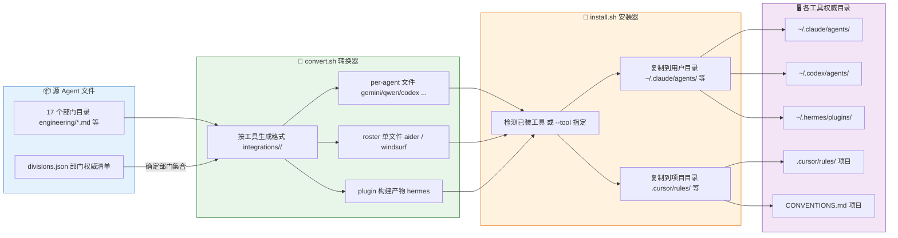

# The Agency 完全指南 — 脚本体系

> 一句话摘要：本章深入讲解 The Agency 的脚本体系——`scripts/` 目录下那一整套把"源 Agent 文件"转换为 16 种工具格式、再安装到对应工具目录的 Shell / Python 脚本，它们构成了整个项目"一次定义、处处可用"的自动化引擎。

---

## 1. 脚本体系总览

如果我们把源仓库中的 **Agent 角色文件**（各部门目录下的 Markdown）看作"原料"，那么 `scripts/` 目录里的脚本就是"加工流水线"。它们解决一个核心问题：

> **同一份角色定义，如何被 16 种格式各异的 AI 编程工具读取？**

每种工具读取 Agent 的方式完全不同——Claude Code 直接读 `.md`，Codex 要 `.toml`，Cursor 要 `.mdc` 规则文件，Aider 只认单个 `CONVENTIONS.md`，Hermes 需要编译后的插件……如果为每种工具手工维护一套副本，很快就会失控。脚本体系正是为此而生，它把"转换"与"安装"两个环节自动化，并配上一整套**校验脚本**在 CI 中保障一致性。

整个 `scripts/` 目录的角色分工如下：

| 脚本 | 类型 | 核心职责 |
|------|------|---------|
| `install.sh` | Shell | **安装器**：把 `integrations/` 下的转换产物复制到各工具配置目录 |
| `convert.sh` | Shell | **转换器**：把源 Agent 文件转换为各工具格式，写入 `integrations/<tool>/` |
| `lib.sh` | Shell | **共享函数库**：frontmatter 解析、slug 化、终端 / TUI 原语 |
| `lint-agents.sh` | Shell | **lint 检查**：校验 Agent 文件 frontmatter 与正文质量 |
| `check-divisions.sh` | Shell | **一致性校验**：部门目录与 `divisions.json` 对齐 |
| `check-tools.sh` | Shell | **一致性校验**：工具清单与 `tools.json` 对齐 |
| `check-runbooks.sh` | Shell+Python | **运行手册校验**：`runbooks.json` 的 slug 引用真实性 |
| `check-agent-originality.sh` | Shell+Python | **原创性校验**：检测 Agent 之间的重复雷同 |
| `build-hermes-plugin.py` | Python | **Hermes 插件构建**：编译 Hermes 懒加载路由插件 |
| `check-hermes-plugin.py` | Python | **Hermes 插件检查**：验证插件符合 Hermes 工具契约 |
| `agents-to-install.example` | 示例文件 | 演示 `--agents-file` 的清单格式 |
| `i18n/` | 目录 | 国际化：中文 Agent 名映射与本地化脚本 |

> **一句话总结**：`convert.sh` 负责"造"，`install.sh` 负责"装"，`lint` / `check` 系列负责"守住质量底线"，`lib.sh` 是它们共享的"工具箱"。

---

## 2. 一次安装的完整流程

在逐脚本讲解之前，先用一张流程图理解"一套源 Agent 是如何流到 16 种工具的"。这是整个脚本体系的心智模型：



> **流程解读**：源 Agent 文件是唯一事实来源。`convert.sh` 把每个 Agent 按目标工具生成对应的格式文件（有的工具每个 Agent 一个文件，有的合并成一个 roster 文件，Hermes 则是编译产物）。随后 `install.sh` 检测你已安装的工具（或用 `--tool` 指定），把转换产物复制到用户目录或项目目录。整个过程可以一键完成——`install.sh` 在发现转换产物缺失时甚至会**自动调用 `convert.sh` 补齐**。

---

## 3. 核心脚本详解

下面逐一介绍每个脚本。先看贯穿始终的两个主力脚本。

### 3.1 install.sh —— 安装器

`install.sh` 是整个体系的"最后一公里"。它从 `integrations/` 读取转换产物，复制到每种工具的配置目录。它支持**交互式**与**非交互式**两种模式：

- **交互式**：在终端中运行时，会弹出三屏向导（Tools → Teams → Review），用方向键勾选要安装的工具、部门，最后确认复制 / 软链接模式后执行。
- **非交互式**：在 CI 或无 TTY 环境，或显式传入 `--no-interactive` 时，自动检测已安装的工具并全部安装。

它支持 16 种工具（内部常量为 `ALL_TOOLS`），并在安装前通过 `is_detected` 逐项探测（检查二进制是否在 PATH、或目录是否存在）。

`install.sh` 的常用参数如下：

| 参数 | 类别 | 说明 |
|------|------|------|
| `--tool <a,b>` | 选择 | 只安装这些工具（逗号分隔，如 `--tool claude-code,cursor`） |
| `--division <a,b>` | 选择 | 只安装这些部门 / 团队 |
| `--agent <slug,slug>` | 选择 | 只安装这些具体 Agent |
| `--agents-file <path>` | 选择 | 从一个清单文件读取 Agent（每行一个 slug 或名称） |
| `--link` | 模式 | 用**软链接**代替复制，后续源文件更新自动生效 |
| `--path <dir>` | 模式 | 覆盖安装目录（仅单个目标） |
| `--interactive` | 行为 | 强制显示交互向导 |
| `--no-interactive` | 行为 | 跳过向导，安装所有检测到的工具 |
| `--no-convert` | 行为 | 转换产物缺失时**不**自动运行 `convert.sh` |
| `--dry-run` | 行为 | 只打印安装计划，不写任何文件 |
| `--list [tools\|teams\|agents]` | 行为 | 列出工具 / 团队 / Agent 后退出 |
| `--parallel` | 行为 | 并行安装各工具（输出按工具缓冲） |
| `--jobs N` | 行为 | 并行任务数（默认 nproc 或 4） |
| `--help` / `-h` | 帮助 | 显示帮助 |

有几个值得注意的细节：

- 安装目录遵循 **`--path` > 环境变量 > 默认值** 的优先级。例如 `install.sh --tool claude-code` 默认装到 `~/.claude/agents/`，但你可以用 `CLAUDE_CONFIG_DIR` 覆盖（Copilot、Cursor、Gemini CLI、opencode、openclaw、qwen、zcode、codex、osaurus、hermes、vibe 都有对应的环境变量）。
- `--dry-run` 会打印所选工具、团队、Agent 数量以及复制 / 软链接模式，是**安全预览**的利器。
- 并行安装通过 `xargs -P` 为每个工具派发一个 worker，各 worker 输出缓冲到临时目录最终统一打印。
- 内置了 OpenCode 的**容量上限告警**（上游 bug 约 119 个），超过时提示用 `--division` 收窄范围。
- Hermes 安装器会先 `rm -rf` 自己的插件目录再复制，并**自动往 Hermes 的 `config.yaml` 写入 `plugins.enabled`**，安全地开启插件。

典型用法：

```bash
# 交互式（终端中直接运行）
./scripts/install.sh

# 只装到 Claude Code，且只装 engineering 部门
./scripts/install.sh --tool claude-code --division engineering

# 先预览再执行
./scripts/install.sh --tool codex --dry-run
./scripts/install.sh --tool codex

# 从清单文件安装（示例见 agents-to-install.example）
./scripts/install.sh --tool claude-code --agents-file scripts/agents-to-install.example
```

### 3.2 convert.sh —— 转换器

`convert.sh` 负责生成各工具的集成文件。它遍历 17 个部门目录下的所有 Agent `.md` 文件，读取 frontmatter（`name` / `description` / `color` 等）与正文，按目标工具渲染成对应格式，写入 `integrations/<tool>/`。

**关键特性**：它**从不触碰用户的配置目录**——只把产物写到仓库内的 `integrations/`，真正的写入由 `install.sh` 完成。这保证了转换过程可复现、可审查。

| 参数 | 说明 |
|------|------|
| `--tool <name>` | 只转换某个工具（如 `--tool gemini-cli`） |
| `--out <dir>` | 覆盖输出目录（默认 `integrations/`） |
| `--parallel` | 当工具为 `all` 时并行转换相互独立的工具 |
| `--jobs N` | 并行任务数（默认 nproc 或 4） |
| `--help` / `-h` | 显示帮助 |

它支持的工具（`valid_tools`）为：`antigravity`、`gemini-cli`、`opencode`、`cursor`、`aider`、`windsurf`、`openclaw`、`qwen`、`zcode`、`kimi`、`codex`、`osaurus`、`hermes`、`vibe`、`all`（默认）。注意 **Claude Code 与 Copilot 不在转换列表里**——它们是"identity 格式"，源文件即目标格式，无需转换。

每个工具对应一个 `convert_<tool>` 函数，例如：

- `convert_codex`：生成 `.toml`，用 `toml_escape_string` 安全转义正文中的控制字符。
- `convert_opencode`：生成 `.md`，把命名颜色通过 `resolve_opencode_color` 映射为 `#RRGGBB` 十六进制，并加 `mode: subagent`。
- `convert_cursor`：生成 `.mdc`，frontmatter 含 `description`、`globs`、`alwaysApply`。
- `convert_openclaw`：把正文按 `##` 标题的**关键词**拆分成 `SOUL.md`（人格）与 `AGENTS.md`（操作），另写 `IDENTITY.md`。
- `convert_aider` / `convert_windsurf`：**先累积到临时文件**，最后统一写出单个 `CONVENTIONS.md` / `.windsurfrules`。

每次转换前，`clean_tool_output` 会清空该工具的旧产物（保留 `README.md`），避免改名或删除的 Agent 留下孤儿文件。

```bash
# 全量转换（默认）
./scripts/convert.sh

# 只转换某个工具
./scripts/convert.sh --tool codex

# 并行且限制任务数
./scripts/convert.sh --parallel --jobs 8
```

### 3.3 lib.sh —— 共享函数库

`lib.sh` 是被 `install.sh` 和 `convert.sh` 共同 **source** 的纯 Bash 函数库，**零外部依赖**，兼容 Bash 3.2+（macOS 自带 3.2）。它按功能分为四组：

| 分组 | 关键函数 | 用途 |
|------|---------|------|
| frontmatter / slug | `get_field`、`get_body`、`slugify`、`agent_slug`、`is_agent_file` | 解析 Agent 数据模型 |
| `set -e` 安全原语 | `incr` | 在 `set -euo pipefail` 下安全自增变量 |
| 终端能力 / ANSI | `supports_color`、`supports_unicode`、`term_cols`、`init_ansi` | 检测并初始化颜色与框线字符 |
| TUI 原语 | `tui_begin`、`read_key`、`draw_frame` | 交互向导的原始输入与无闪烁绘制 |

其中 **slug**（如 `"Frontend Developer"` → `frontend-developer`）是关键标识符，`agent_slug` 从文件 frontmatter 的 `name` 派生，保证 convert 与 install 永远一致。`is_agent_file` 判断文件是否以 `---` frontmatter 开始，从而区分真正的 Agent 文件与普通文档。

### 3.4 lint-agents.sh —— Agent lint 检查

`lint-agents.sh` 校验 Agent 文件的质量，是 CI 的第一道关卡。它把问题分为 **ERROR（阻断）** 与 **WARN（告警）**：

- **ERROR**：文件不是 `---` 开头、frontmatter 为空 / 畸形、缺少必填字段 `name` / `description` / `color`、存在 **CRLF 行尾**（仓库强制 LF，会给出转换提示）。
- **WARN**：缺少推荐章节 `Identity` / `Core Mission` / `Critical Rules`、正文过短（少于 50 词）、没有能映射到 `SOUL.md` 或 `AGENTS.md` 的 `##` 标题。

用法：`./scripts/lint-agents.sh [file ...]`，不带参数则扫描全部部门目录。有 ERROR 时退出码为 1（CI 失败）。

```bash
./scripts/lint-agents.sh
./scripts/lint-agents.sh engineering/engineering-frontend-developer.md
```

### 3.5 check-divisions.sh —— 部门一致性校验

`check-divisions.sh` 以仓库根目录的 `divisions.json` 为唯一事实来源，强制以下各处的**部门集合完全一致**：

1. 磁盘上实际的顶层部门目录
2. `convert.sh` 里的 `AGENT_DIRS`
3. `lint-agents.sh` 里的 `AGENT_DIRS`
4. `.github/workflows/lint-agents.yml` 的路径过滤器
5. 每个部门条目都含 `label` / `icon` / `color`
6. 每个部门目录至少含一个带 frontmatter 的 Agent 文件

它不依赖 `jq`，只用 `awk` / `grep` / `sed`，在 macOS 与 CI 上行为一致。新增部门时，只要建目录、加 `divisions.json` 条目，脚本会"告诉"你其余所有需要同步的地方。

### 3.6 check-tools.sh —— 工具清单校验

`check-tools.sh` 以 `tools.json` 为唯一事实来源，保证以下一致：

1. `install.sh` 的 `ALL_TOOLS` 与 `tools.json` 的键**完全相等**（双向）
2. `convert.sh` 的每个转换器都存在于 `tools.json`（子集，因为 identity 工具只装不转）
3. 每个条目都含 `id` / `label` / `kebab` / `format` / `installKind` / `dest`
4. `installKind` 必须是 `per-agent` / `roster` / `plugin` 三者之一

新增工具的标准流程是：在 `tools.json` 加条目 → 在 `convert.sh` 加 `convert_<tool>`（或复用某个 `format`）→ 在 `install.sh` 加 `install_<tool>` → 运行 `check-tools.sh` 校验。

### 3.7 check-runbooks.sh —— 运行手册校验

`check-runbooks.sh` 使用 `python3` 校验 `strategy/runbooks.json` 与真实 Agent 名册同步。它检查：

1. `runbooks.json` 是合法 JSON，且每个 runbook 含 `slug` / `title` / `mode` / `doc` / `roster` 字段
2. roster 里每个 `agents[]` 的 slug 都能匹配到真实的 Agent `.md` 文件名（去扩展名）
3. 每个 `doc` 路径真实存在
4. runbook 的 `slug` 不重复

因为桌面应用靠这份 JSON 把 runbook 一键部署成团队，slug 引用失效会导致部署失败，所以这个校验是保证"部署不破"的关键。

### 3.8 check-agent-originality.sh —— Agent 原创性校验

`check-agent-originality.sh` 解决一个现实问题：**新 Agent 是不是"换皮"的旧 Agent**？它用**实体无关的 8 词 shingle 重叠**（Jaccard 相似度）对比每个候选 Agent 与整个现有角色库。所谓"实体无关"，是指先把 `vietnam`、`china`、`tiktok`、`shopee` 等专有名词替换掉，所以即使把"国家 / 平台名"换掉再提交，也逃不过相似度检测。

- 相似度 ≥ `ORIGINALITY_FAIL`（默认 40%）→ 判为重复，退出码 1
- 相似度 ≥ `ORIGINALITY_WARN`（默认 20%）→ 告警不阻断
- 现有库的基线最差约 1.5%，留了很大的安全余量

```bash
# 检查指定文件（CI 用于变更文件）
./scripts/check-agent-originality.sh engineering/new-agent.md

# 审计模式：全库两两对比
./scripts/check-agent-originality.sh
```

### 3.9 build-hermes-plugin.py —— Hermes 插件构建

Hermes 走的是完全不同的路线：**不生成几百个 skill，而是编译成一个懒加载插件**。`build-hermes-plugin.py` 读取 `divisions.json` 确定部门集合，遍历所有 Agent，构建出 `integrations/hermes/agency-agents-router/`：

- `plugin.yaml`：插件元信息，声明 4 个工具
- `__init__.py`：插件实现，暴露 `agency_agents_search` / `agency_agents_inspect` / `agency_agents_load` / `agency_agents_delegate` 四个工具
- `data/agents.json`：完整角色名册（270 个），供懒加载时查询

这样 Hermes 启动时只看到**固定的工具接口**，而把庞大的名册放在磁盘上按需检索，避免把每个 Agent 都塞进初始 skill 目录。

### 3.10 check-hermes-plugin.py —— Hermes 插件检查

`check-hermes-plugin.py` 验证构建出的插件符合 Hermes 的工具契约：它把 builder 模块加载到内存，在临时目录重新 `build`，再加载 `__init__.py` 并注册工具到一个 `RecordingContext`，断言：

- 注册的工具集合恰好是那 4 个
- 每个工具的 schema 含 `name`、`description`、`parameters`（`type` 为 `object`、含 `properties` 与 `required`）
- 实际调用 `search` 能返回结果、`inspect` 能解析 slug

这相当于给 Hermes 插件的输出做了一次**运行时冒烟测试**。

### 3.11 agents-to-install.example —— 示例清单

`agents-to-install.example` 是 `install.sh --agents-file` 的示例文件，演示清单格式：每行一个 Agent 的 slug 或人类可读名称，空行与 `#` 注释被忽略，名称大小写不敏感。

```
frontend-developer
backend-architect
security-architect
# Names work too (case-insensitive):
Penetration Tester
```

### 3.12 i18n/ —— 国际化

`i18n/` 目录服务中文用户，让 Agent 名在 **Copilot Chat 的 Agent 选择器**中可读。包含两个文件：

| 文件 | 说明 |
|------|------|
| `agent-names-zh.json` | 英文 Agent 名 → 中文翻译映射（130+ 条） |
| `localize-agents-zh.ps1` | PowerShell 脚本：读取 JSON 并更新已安装的 Agent 文件 |

用法（在 `install.sh --tool copilot` 之后）：

```powershell
powershell -ExecutionPolicy Bypass -File scripts/i18n/localize-agents-zh.ps1
```

脚本默认处理 `%USERPROFILE%\.github\agents\` 与 `%USERPROFILE%\.copilot\agents\`，也可用 `-TargetDirs` 传自定义路径。它只改**已安装的副本**，不改源文件；每次重新 `install.sh`（会用英文原文覆盖）后需要重跑一次。`name` 与 `description` 都会被替换为中文。

---

## 4. 脚本常用命令速查表

下表汇总了最常用的脚本命令，方便日常查阅：

| 目标 | 命令 |
|------|------|
| 全量转换（生成所有工具的集成文件） | `./scripts/convert.sh` |
| 只转换某个工具 | `./scripts/convert.sh --tool codex` |
| 并行转换 | `./scripts/convert.sh --parallel --jobs 8` |
| 交互式安装（终端中） | `./scripts/install.sh` |
| 静默安装所有检测到的工具 | `./scripts/install.sh --no-interactive` |
| 只装某个工具的某个部门 | `./scripts/install.sh --tool claude-code --division engineering` |
| 只装某些 Agent | `./scripts/install.sh --tool codex --agent frontend-developer,backend-architect` |
| 从清单文件安装 | `./scripts/install.sh --tool claude-code --agents-file scripts/agents-to-install.example` |
| 预览安装计划（不写入） | `./scripts/install.sh --tool codex --dry-run` |
| 用软链接安装（改动自动同步） | `./scripts/install.sh --tool claude-code --link` |
| 列出可用工具 | `./scripts/install.sh --list tools` |
| 列出可用团队及 Agent 数 | `./scripts/install.sh --list teams` |
| 列出所有 Agent | `./scripts/install.sh --list agents` |
| 并行安装 | `./scripts/install.sh --parallel --jobs 4` |
| lint 所有 Agent 文件 | `./scripts/lint-agents.sh` |
| lint 单个文件 | `./scripts/lint-agents.sh engineering/xxx.md` |
| 校验部门一致性 | `./scripts/check-divisions.sh` |
| 校验工具清单一致性 | `./scripts/check-tools.sh` |
| 校验运行手册 | `./scripts/check-runbooks.sh` |
| 校验 Agent 原创性 | `./scripts/check-agent-originality.sh` |
| 构建 Hermes 插件 | `./scripts/build-hermes-plugin.py` |
| 检查 Hermes 插件 | `./scripts/check-hermes-plugin.py` |
| Copilot 中文名本地化 | `powershell -File scripts/i18n/localize-agents-zh.ps1` |

> **最佳实践提醒**：修改或新增 Agent 后，标准流程是"先 validate 再 convert 再 install"——先跑 `lint-agents.sh` 与 `check-*` 系列确认质量，再 `convert.sh` 重新生成集成文件，最后 `install.sh` 安装。把 `check-divisions.sh`、`check-tools.sh`、`lint-agents.sh` 等接入 CI，就能在每次提交时自动守住一致性。

---

## 5. 脚本与数据文件的关系

最后，用一张表理清脚本与仓库根目录数据文件之间的依赖关系（谁读谁）：

| 数据文件 | 被谁消费 | 扮演角色 |
|---------|---------|---------|
| `divisions.json` | `install.sh`、`build-hermes-plugin.py`、`check-divisions.sh`、`check-agent-originality.sh` | 部门集合的唯一事实来源 |
| `tools.json` | `check-tools.sh` | 16 种工具安装契约的唯一事实来源 |
| `strategy/runbooks.json` | `check-runbooks.sh` | 运行手册的机器可读名册 |
| `integrations/<tool>/` | `install.sh` | `convert.sh` 的转换输出，安装器的输入 |

> **核心心智**：`divisions.json` 管"有多少部门"，`tools.json` 管"有哪些工具、怎么装"，`convert.sh` 把"部门里的 Agent"变成"各工具要的格式"，`install.sh` 把它们放到"各工具认得的位置"。四个校验脚本则保证这些环节永远不会互相脱节。

---

- [上一章：部门名册](03-roster-divisions.md) ←
- [下一章：多工具集成](05-integrations.md) →