# The Agency 完全指南 — 多工具集成

> 一句话摘要：本章系统讲解 The Agency 如何把一套 Agent 角色文件集成到 16 种 AI 编程工具——每种工具装到哪个目录、用什么文件格式、是否需要转换、如何在会话中激活，以及 `tools.json` 是如何成为这一切的"权威安装契约"。

---

## 1. 集成机制总览

The Agency 最大的卖点之一，就是**一套角色来源，适配 16 种工具**。上一章我们讲了"怎么转换、怎么安装"（`convert.sh` / `install.sh`），本章则聚焦"每种工具到底被集成成什么样子"。

集成的核心由一个目录和一份 JSON 共同驱动：

- **`integrations/` 目录**：存放 `convert.sh` 的转换输出说明。每个工具一个子目录，内含该工具的 `README.md`（安装路径、激活方式、格式说明）以及转换生成的产物文件（如 `gemini-cli/agents/`、`codex/agents/`、`aider/CONVENTIONS.md`）。
- **`tools.json`（仓库根目录）**：**工具清单的权威来源**。它用键值对定义 16 种工具每一项的"安装契约"——工具 ID、显示名、检测目录、目标路径模板、渲染 `format`、`installKind`、`scope` 等。所有消费者（桌面应用、`check-tools.sh`、`install.sh`）都以此为准。

> **一句话总结**：`tools.json` 规定"每种工具该往哪装、装成什么样"，`integrations/` 保存"转换出来的实际文件 + 使用说明"，`install.sh` 负责把两者对接起来。

---

## 2. 支持的 16 种工具总表

下面这张表汇总了 `tools.json` 中全部 16 种工具的关键契约字段。理解这张表，就理解了整个集成体系：

| 工具 | 安装目录（用户/项目） | 文件格式 | installKind | scope | 需转换? |
|------|----------------------|---------|:-----------:|:-----:|:-------:|
| **Claude Code** | `~/.claude/agents/` | `.md`（identity） | per-agent | user+project | ❌ |
| **GitHub Copilot** | `~/.copilot/agents/` + `~/.github/agents/` | `.md`（identity） | per-agent | user+project | ❌ |
| **Codex** | `~/.codex/agents/` | `.toml` | per-agent | user+project | ✅ |
| **Gemini CLI** | `~/.gemini/agents/` | `.md` | per-agent | user+project | ✅ |
| **Qwen Code** | `.qwen/agents/`（项目优先） | `.md` | per-agent | user+project | ✅ |
| **Cursor** | `.cursor/rules/`（项目） | `.mdc` | per-agent | project | ✅ |
| **opencode** | `.config/opencode/agents/`（用户）/ `.opencode/agents/`（项目） | `.md` | per-agent | user+project | ✅ |
| **Osaurus** | `~/.osaurus/skills/<slug>/SKILL.md` | `SKILL.md` | per-agent | user | ✅ |
| **Aider** | `CONVENTIONS.md`（项目） | 单文件 | roster | project | ✅ |
| **Antigravity** | `~/.gemini/config/skills/`（用户）/ `.agents/skills/`（项目） | `SKILL.md` | per-agent | user+project | ✅ |
| **Kimi** | `~/.config/kimi/agents/<slug>/` | `agent.yaml` + `system.md` | per-agent | user | ✅ |
| **OpenClaw** | `~/.openclaw/agency-agents/<slug>/` | `SOUL.md`+`AGENTS.md`+`IDENTITY.md` | per-agent | user | ✅ |
| **Windsurf** | `.windsurfrules`（项目） | 单文件 | roster | project | ✅ |
| **Hermes** | `~/.hermes/plugins/agency-agents-router` | 插件产物 | plugin | user | ✅ |
| **Mistral Vibe** | `~/.vibe/agents/` + `~/.vibe/prompts/` | `.toml` + `.md` | per-agent | user+project | ✅ |
| **ZCode** | `~/.zcode/agents/` | `.md` | per-agent | user+project | ✅ |

> **读表提示**：`scope` 里的 `user` 表示可装到用户级目录（全局生效），`project` 表示只装到项目目录（需在项目根目录运行安装器）。`installKind` 决定了每个 Agent 的产出形态（见下文第 3 节）。

---

## 3. 三种 installKind 的区别

`tools.json` 用 `installKind` 标注工具的**安装机制**，这是整个集成体系最关键的概念。三种取值对应三种截然不同的"Agent 落盘形态"：

| installKind | 含义 | 典型代表 | 特点 |
|:-----------:|------|---------|------|
| **per-agent** | **每个 Agent 一个文件 / 目录** | Claude Code、Codex、Gemini CLI、Cursor、Kimi、OpenClaw、Vibe、ZCode、Osaurus、Antigravity、Qwen、opencode | 粒度最细，可单独安装单个 Agent，支持 `--division` / `--agent` 过滤 |
| **roster** | **所有 Agent 合并成一个文件** | Aider（`CONVENTIONS.md`）、Windsurf（`.windsurfrules`） | 工具只认一个文件，**无法按 Agent 过滤**，安装即全量名册 |
| **plugin** | **编译后的构建产物，仅 CLI 可用** | Hermes（`agency-agents-router` 插件） | 不是可渲染成字符串的单个 Agent，只能通过 CLI 安装，任何 GUI 消费者都无法把它渲染出来 |

> **核心区别**：`per-agent` 是"一位一位地装"，`roster` 是"一整套装进一个文件"，`plugin` 是"编译成一个可执行 / 插件"。前两者 `install.sh` 都能处理，`plugin` 则只有 CLI 能安装。这也是为什么在桌面应用里，`per-agent` 与 `roster` 工具能原生安装，而 `plugin` 工具被标记为 CLI-only。

下面用一张辐射图展示"一套 Agent 源 → 16 种工具"的整体结构：

```mermaid
graph TB
    Src["📦 一套 Agent 源 17 部门 · 230+ 角色文件"]
    Src -->|"identity 无需转换"| CC["Claude Code ~/.claude/agents/ .md"]
    Src -->|"identity 无需转换"| COP["GitHub Copilot ~/.github/agents/ .md"]
    Src -->|"convert - per-agent"| COD["Codex .codex/agents/ .toml"]
    Src -->|"convert - per-agent"| GEM["Gemini CLI .gemini/agents/ .md"]
    Src -->|"convert - per-agent"| QW["Qwen Code .qwen/agents/ .md"]
    Src -->|"convert - per-agent"| CUR["Cursor .cursor/rules/ .mdc"]
    Src -->|"convert - per-agent"| OPC["opencode .opencode/agents/ .md"]
    Src -->|"convert - per-agent"| OSA["Osaurus .osaurus/skills/SKILL.md"]
    Src -->|"convert - per-agent"| ANT["Antigravity .gemini/config/skills/"]
    Src -->|"convert - per-agent"| KIM["Kimi .config/kimi/agents/"]
    Src -->|"convert - per-agent"| OCL["OpenClaw .openclaw/agency-agents/"]
    Src -->|"convert - per-agent"| VIB["Mistral Vibe .vibe/agents/ + prompts/"]
    Src -->|"convert - per-agent"| ZCD["ZCode .zcode/agents/ .md"]
    Src -->|"convert - roster 单文件"| AID["Aider CONVENTIONS.md"]
    Src -->|"convert - roster 单文件"| WIN["Windsurf .windsurfrules"]
    Src -->|"convert - plugin 构建"| HER["Hermes plugins/agency-agents-router"]
    style Src fill:#e3f2fd,stroke:#1565c0
    style CC fill:#e8f5e9,stroke:#2e7d32
    style COP fill:#e8f5e9,stroke:#2e7d32
    style HER fill:#fff3e0,stroke:#ef6c00
```

> **辐射结构解读**：中心是同一套 Agent 源。Claude Code 与 Copilot 走 `identity` 格式（源文件即目标文件，免转换）；多数工具走 `per-agent`（每个 Agent 一个文件）；Aider 与 Windsurf 走 `roster`（合并成一个文件）；Hermes 走 `plugin`（编译成插件）。一套源，辐射出 16 种不同的"落盘形态"。

---

## 4. 各工具集成详解

下面按 `tools.json` 的 `order` 顺序，逐一介绍 16 种工具的集成细节，包括**安装目录、文件格式、是否需转换、激活方式**四要素。

### 4.1 Claude Code

- **安装目录**：`~/.claude/agents/`
- **文件格式**：`.md`（`identity` 格式，即源文件拷贝）
- **是否需转换**：**否**。The Agency 本就为 Claude Code 而生，Agent 的 `.md` + YAML frontmatter 格式被 Claude Code 原生支持。
- **激活方式**：在会话中按名称引用，例如"Activate Frontend Developer and help me build a React component."。
- **安装命令**：`./scripts/install.sh --tool claude-code`
- 详见 [integrations/claude-code/README.md](../../../../../.chaos/libs/agency-agents/integrations/claude-code/README.md)。

### 4.2 GitHub Copilot

- **安装目录**：`~/.copilot/agents/` 与 `~/.github/agents/` 两处（`dest` 同时列出两个用户目录）
- **文件格式**：`.md`（`identity` 格式，免转换）
- **是否需转换**：**否**。
- **激活方式**：在 Copilot Chat 会话中按名称引用即可。
- **安装命令**：`./scripts/install.sh --tool copilot`
- **中文适配**：可用 `scripts/i18n/localize-agents-zh.ps1` 把 Agent 名本地化为中文，让 Copilot 的 Agent 选择器对中文用户更友好。
- 详见 [integrations/github-copilot/README.md](../../../../../.chaos/libs/agency-agents/integrations/github-copilot/README.md)。

### 4.3 Codex

- **安装目录**：`~/.codex/agents/`
- **文件格式**：`.toml`（`codex-toml` 格式），每个 Agent 一个文件，含 `name`、`description`、`developer_instructions` 三个字段。
- **是否需转换**：**是**。`convert_codex` 用 `toml_escape_string` 安全转义正文控制字符。
- **激活方式**：按名称引用，例如"Use the Frontend Developer agent to review this component."。Codex 以 TOML 内的 `name` 字段为准，文件名 slug 只用于文件系统安全。
- **安装命令**：`./scripts/convert.sh --tool codex && ./scripts/install.sh --tool codex`
- 详见 [integrations/codex/README.md](../../../../../.chaos/libs/agency-agents/integrations/codex/README.md)。

### 4.4 Gemini CLI

- **安装目录**：`~/.gemini/agents/`
- **文件格式**：`.md`（`gemini-md` 格式），frontmatter 含 `name` / `description`。
- **是否需转换**：**是**。`convert_gemini_cli` 生成子代理文件。
- **激活方式**：在会话中引用，或直接 `gemini --agent frontend-developer "How should I structure this React component?"`。
- **安装命令**：`./scripts/convert.sh --tool gemini-cli && ./scripts/install.sh --tool gemini-cli`
- 详见 [integrations/gemini-cli/README.md](../../../../../.chaos/libs/agency-agents/integrations/gemini-cli/README.md)。

### 4.5 Qwen Code

- **安装目录**：`.qwen/agents/`（项目优先，也可用 `QWEN_AGENTS_DIR` 覆盖）
- **文件格式**：`.md`（`qwen-md` 格式），frontmatter 为 `name`、`description`，可选 `tools`。
- **是否需转换**：**是**。`convert_qwen` 生成 SubAgent 文件。
- **激活方式**：安装后在 Qwen Code 里运行 `/agents manage` 刷新，或重启会话。
- **安装命令**：`./scripts/convert.sh --tool qwen && ./scripts/install.sh --tool qwen`（需在项目根目录运行）
- 详见 [integrations/qwen/README.md](../../../../../.chaos/libs/agency-agents/integrations/qwen/README.md)。

### 4.6 Cursor

- **安装目录**：`.cursor/rules/`（**仅项目级**，`scope` 的 `user` 为 false）
- **文件格式**：`.mdc`（`cursor-mdc` 格式），frontmatter 含 `description`、`globs`、`alwaysApply`。
- **是否需转换**：**是**。`convert_cursor` 生成规则文件，默认 `alwaysApply: false`。
- **激活方式**：在提示中引用 `@frontend-developer`，或把 `.mdc` 的 `alwaysApply` 改为 `true` 设为常开。
- **安装命令**：`./scripts/convert.sh --tool cursor && ./scripts/install.sh --tool cursor`（需在项目根目录）
- 详见 [integrations/cursor/README.md](../../../../../.chaos/libs/agency-agents/integrations/cursor/README.md)。

### 4.7 opencode

- **安装目录**：用户级 `.config/opencode/agents/`，项目级 `.opencode/agents/`（默认装到项目）
- **文件格式**：`.md`（`opencode-md` 格式），frontmatter 含 `name`、`description`、`mode: subagent`、`color`（十六进制）。
- **是否需转换**：**是**。`convert_opencode` 把命名颜色映射为 `#RRGGBB`，并加 `mode: subagent`。
- **激活方式**：用 `@agent-name` 前缀调用，如 `@frontend-developer help build this component.`。
- **容量限制**：opencode 约只能注册 119 个 Agent（上游 bug），过多时用 `--division` 收窄。
- **安装命令**：`./scripts/install.sh --tool opencode`（需在项目根目录）
- 详见 [integrations/opencode/README.md](../../../../../.chaos/libs/agency-agents/integrations/opencode/README.md)。

### 4.8 Osaurus

- **安装目录**：`~/.osaurus/skills/<slug>/SKILL.md`
- **文件格式**：`SKILL.md`（`skill-md` 格式），采用 Anthropic Agent Skills 规范。
- **是否需转换**：**是**。`convert_osaurus` 生成带 `agency-` 前缀的 skill 目录。
- **激活方式**：按 slug 引用，如 `agency-frontend-developer`。
- **安装命令**：`./scripts/convert.sh --tool osaurus && ./scripts/install.sh --tool osaurus`

### 4.9 Aider

- **安装目录**：`CONVENTIONS.md`（**仅项目级**，项目根目录）
- **文件格式**：单文件（`aider-conventions` 格式，**roster** 机制），全部 Agent 合并为一个约定文件。
- **是否需转换**：**是**。`accumulate_aider` 把每个 Agent 追加进临时文件，最后统一写出。
- **激活方式**：在 Aider 会话中按名称引用，或 `aider --read CONVENTIONS.md`。
- **注意**：roster 单文件格式**不支持按 Agent / 团队过滤**，安装即全量名册。
- **安装命令**：`./scripts/convert.sh --tool aider && ./scripts/install.sh --tool aider`（需在项目根目录）
- 详见 [integrations/aider/README.md](../../../../../.chaos/libs/agency-agents/integrations/aider/README.md)。

### 4.10 Antigravity

- **安装目录**：用户级 `~/.gemini/config/skills/`，项目级 `.agents/skills/`
- **文件格式**：`SKILL.md`（`skill-md` 格式），每个 Agent 一个带 `agency-` 前缀的 skill 目录。
- **是否需转换**：**是**。`convert_antigravity` 生成 skill 文件。
- **激活方式**：按 slug 引用，如 `agency-backend-architect`。
- **安装命令**：`./scripts/convert.sh --tool antigravity && ./scripts/install.sh --tool antigravity`
- 详见 [integrations/antigravity/README.md](../../../../../.chaos/libs/agency-agents/integrations/antigravity/README.md)。

### 4.11 Kimi

- **安装目录**：`~/.config/kimi/agents/<slug>/`（**仅用户级**）
- **文件格式**：`agent.yaml` + `system.md`（`kimi-agent` 格式），YAML 用 `extend: default` 继承 Kimi 默认工具集，正文存于独立 system 提示文件。
- **是否需转换**：**是**。`convert_kimi` 生成 YAML 与 system 文件。
- **激活方式**：`kimi --agent-file ~/.config/kimi/agents/frontend-developer/agent.yaml`。
- **安装命令**：`./scripts/convert.sh --tool kimi && ./scripts/install.sh --tool kimi`
- 详见 [integrations/kimi/README.md](../../../../../.chaos/libs/agency-agents/integrations/kimi/README.md)。

### 4.12 OpenClaw

- **安装目录**：`~/.openclaw/agency-agents/<slug>/`（**仅用户级**）
- **文件格式**：`SOUL.md` + `AGENTS.md` + `IDENTITY.md`（`openclaw-workspace` 格式），一个 Agent 一个工作区目录。
- **是否需转换**：**是**。`convert_openclaw` 按 `##` 标题关键词把正文拆成 SOUL 与 AGENTS 两部分，另写 IDENTITY。
- **激活方式**：安装后按 `agentId` 在 OpenClaw 会话中引用；若网关在运行，需 `openclaw gateway restart` 激活新 Agent。
- **安装命令**：`./scripts/convert.sh --tool openclaw && ./scripts/install.sh --tool openclaw`
- 详见 [integrations/openclaw/README.md](../../../../../.chaos/libs/agency-agents/integrations/openclaw/README.md)。

### 4.13 Windsurf

- **安装目录**：`.windsurfrules`（**仅项目级**，项目根目录）
- **文件格式**：单文件（`windsurf-rules` 格式，**roster** 机制），全部 Agent 合并为一个规则文件。
- **是否需转换**：**是**。`accumulate_windsurf` 累加所有 Agent。
- **激活方式**：在 Windsurf 会话中按名称引用。
- **注意**：roster 单文件格式不支持按 Agent / 团队过滤。
- **安装命令**：`./scripts/convert.sh --tool windsurf && ./scripts/install.sh --tool windsurf`（需在项目根目录）
- 详见 [integrations/windsurf/README.md](../../../../../.chaos/libs/agency-agents/integrations/windsurf/README.md)。

### 4.14 Hermes

- **安装目录**：`~/.hermes/plugins/agency-agents-router`（**仅用户级**）
- **文件格式**：插件产物（`hermes-router-plugin` 格式，**plugin** 机制），含 `plugin.yaml`、`__init__.py`、`data/agents.json`。
- **是否需转换**：**是**。`build-hermes-plugin.py` 编译懒加载路由插件。
- **激活方式**：插件暴露 `agency_agents_search` / `agency_agents_inspect` / `agency_agents_load` / `agency_agents_delegate` 四个工具，Hermes 启动时加载，可用自然语言让 Hermes 检索并加载所需专家。
- **CLI-only**：plugin 类型的构建产物无法被任何 GUI 应用渲染，只能通过 CLI 安装。
- **安装命令**：`./scripts/convert.sh --tool hermes && ./scripts/install.sh --tool hermes`，安装后重启 Hermes。
- 详见 [integrations/hermes/README.md](../../../../../.chaos/libs/agency-agents/integrations/hermes/README.md)。

### 4.15 Mistral Vibe

- **安装目录**：`~/.vibe/agents/<slug>.toml` + `~/.vibe/prompts/<slug>.md`（用户级，可用 `VIBE_HOME` 覆盖）
- **文件格式**：`.toml` + `.md`（`vibe-toml` 格式），每个 Agent 一对文件。
- **是否需转换**：**是**。`convert_vibe` 生成 TOML 配置（`agent_type`、`system_prompt_id`）与提示文件。
- **激活方式**：按系统提示 ID（即文件名 slug）引用，如"Use the Code Reviewer agent to analyze this pull request."。
- **安装命令**：`./scripts/convert.sh --tool vibe && ./scripts/install.sh --tool vibe`
- 详见 [integrations/vibe/README.md](../../../../../.chaos/libs/agency-agents/integrations/vibe/README.md)。

### 4.16 ZCode

- **安装目录**：`~/.zcode/agents/`（用户级，项目级可用 `ZCODE_AGENTS_DIR` 覆盖）
- **文件格式**：`.md`（`zcode-md` 格式），frontmatter 为 `name`、`description`，可选 `tools`。
- **是否需转换**：**是**。`convert_zcode` 生成 Markdown 文件，与 Qwen 的 `qwen-md` 逐字节一致，可被桌面应用原生渲染。
- **激活方式**：ZCode 从其 agents 目录自动发现这些文件，按名称引用。
- **安装命令**：`./scripts/convert.sh --tool zcode && ./scripts/install.sh --tool zcode`
- 详见 [integrations/zcode/README.md](../../../../../.chaos/libs/agency-agents/integrations/zcode/README.md)。

---

## 5. 集成工具对比表

最后，把 16 种工具按**覆盖范围、scope、格式、安装机制**四个维度汇总成一张对比表，方便快速选址：

| 工具 | 覆盖范围 | scope | 格式 | installKind | 核心激活方式 |
|------|---------|:-----:|------|:-----------:|-------------|
| **Claude Code** | 免转换 | user+project | `.md` | per-agent | 会话中按名称引用 |
| **GitHub Copilot** | 免转换 | user+project | `.md` | per-agent | Copilot Chat 按名称引用 |
| **Codex** | 转换 | user+project | `.toml` | per-agent | 按名称引用 |
| **Gemini CLI** | 转换 | user+project | `.md` | per-agent | 引用 / `gemini --agent` |
| **Qwen Code** | 转换 | user+project | `.md` | per-agent | `/agents manage` 刷新 |
| **Cursor** | 转换 | project | `.mdc` | per-agent | `@agent` / `alwaysApply` |
| **opencode** | 转换 | user+project | `.md` | per-agent | `@agent` 前缀 |
| **Osaurus** | 转换 | user | `SKILL.md` | per-agent | 按 slug 引用 |
| **Aider** | 转换 | project | 单文件 | **roster** | 按名称引用 / `--read` |
| **Antigravity** | 转换 | user+project | `SKILL.md` | per-agent | 按 slug 引用 |
| **Kimi** | 转换 | user | `agent.yaml`+`system.md` | per-agent | `--agent-file` |
| **OpenClaw** | 转换 | user | 三文件工作区 | per-agent | agentId + gateway restart |
| **Windsurf** | 转换 | project | 单文件 | **roster** | 按名称引用 |
| **Hermes** | 转换 | user | 插件产物 | **plugin（CLI-only）** | 聊天驱动 4 个工具 |
| **Mistral Vibe** | 转换 | user+project | `.toml`+`.md` | per-agent | 按系统提示 ID |
| **ZCode** | 转换 | user+project | `.md` | per-agent | 自动发现 |

> **选型建议**：如果你想要**最细粒度的控制**（按部门、按 Agent 安装），选 `per-agent` 工具；若你希望**一份文件带走全部专家**，Aider / Windsurf 的 `roster` 更省心；若你在用 Hermes 且不想让几百个 skill 污染启动目录，`plugin` 的懒加载路由是最专业的方案。

---

## 6. 集成流程小结

把这一切串起来，一套 Agent 走向某个工具的标准流程是：

1. **查 `tools.json`**：确认该工具的 `format`、`installKind`、`scope`、`dest`。
2. **（若需转换）跑 `convert.sh`**：生成 `integrations/<tool>/` 下的产物。
3. **跑 `install.sh`**：把产物复制到对应工具的权威目录（用户级或项目级）。
4. **激活**：在工具会话中按名称 / slug / `@` 前缀 / agentId 引用。
5. **（可选）中文本地化**：对 Copilot 运行 `localize-agents-zh.ps1`。

> **核心认知**：`tools.json` 是这一切的"说明书"——它精确地告诉每个消费者"每种工具要装成什么样、装到哪"。理解了 `installKind`（per-agent / roster / plugin）与 `scope`（user / project），你就能在任何时刻准确判断"我该在哪跑安装器、能得到什么形态的产物"。

---

- 上一章：[脚本体系](04-scripts-tooling.md)
- [下一章：使用示例](06-usage-examples.md) →