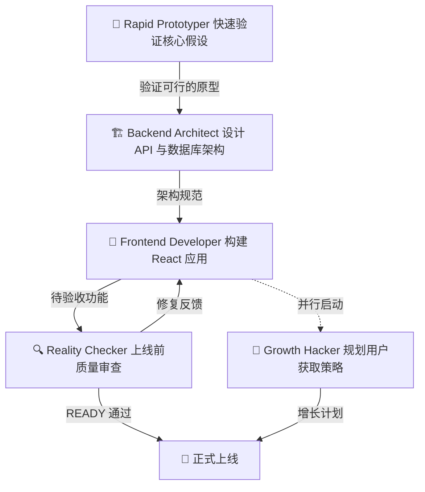

# The Agency 完全指南 — 使用示例

> 一句话摘要：本章面向已经认识 The Agency 的读者，系统地讲解四种把 230+ 个专业 AI Agent 用起来的方式——安装桌面应用、接入 Claude Code、作为参考文件、接入其他工具，并给出可复制粘贴的命令行操作示例、真实的业务场景组合案例与 Agent 激活提示词模板。

---

## 1. 四种使用方式总览

The Agency 提供了从"零安装点击即用"到"纯参考学习"四种递进式的使用方式，覆盖了不同技术背景与使用偏好的人群。你可以根据自己的情况选择任意一种，也可以混用。

| 方式 | 上手难度 | 是否需要命令行 | 适用人群 | 核心特点 |
|------|---------|---------------|---------|---------|
| **① 桌面应用** | ⭐ | 不需要 | 所有用户，尤其是非技术用户 | 图形界面浏览全部 Agent，一键安装，自动更新 |
| **② Claude Code 集成** | ⭐⭐ | 需要 | 已在用 Claude Code 的开发者 | 原生 `.md` 格式，无需转换，直接激活 |
| **③ 作为参考直接使用** | ⭐ | 可选 | 想自己定制 Agent 的进阶用户 | 浏览、复制、改编现成的 Agent 文件 |
| **④ 与其他工具配合** | ⭐⭐⭐ | 需要 | 使用 Cursor / Copilot / Codex 等多工具的用户 | `convert.sh` + `install.sh` 双脚本流程 |

> **核心取舍**：方式①和②最省事，Agent 开箱即用；方式③让你完全掌控 Agent 的每一个细节；方式④则把同一套 Agent 能力辐射到十余种主流 AI 编程工具上。下面逐一展开。

---

## 2. 方式一：安装桌面应用（推荐）

**Agency Agents** 是 The Agency 官方出品的原生桌面应用，支持 **macOS、Linux、Windows** 三大平台，官网地址为 [agencyagents.app](https://agencyagents.app)。它解除了你对克隆仓库、运行脚本的依赖——打开应用即可浏览完整的 Agent 名册，鼠标点击即可把 Agent 安装到 Claude Code、Cursor、Codex、Gemini 等工具中，并且支持**自动更新**，永远拿到最新版本。

### 2.1 在 macOS 上安装

macOS 用户可以直接使用 Homebrew 安装：

```bash
brew install --cask msitarzewski/agency-agents/agency-agents
```

### 2.2 在其他平台安装

- **Windows 与 Linux**：前往 [GitHub Releases 最新发布页](https://github.com/msitarzewski/agency-agents-app/releases/latest) 下载对应平台的安装包。
- 安装完成后打开应用，界面会列出全部 Agent 分组（Engineering、Design、Marketing …），勾选你需要的，点击安装即可。

> **提示**：桌面应用本质上是把仓库里的 Agent 文件复制到各工具的目标目录，与命令行脚本安装的是**完全相同**的 Agent，只是省去了手动操作。

---

## 3. 方式二：与 Claude Code 配合

The Agency 最初就是为 Claude Code 打造的，Agent 文件采用 Claude Code 原生支持的 **Markdown + YAML frontmatter** 格式，因此**无需任何转换**，直接复制到 `~/.claude/agents/` 目录即可生效。

### 3.1 一键安装全部 Agent 到 Claude Code

```bash
# 在仓库根目录执行
./scripts/install.sh --tool claude-code
```

### 3.2 手动复制某个部门

```bash
# 只复制 engineering 部门的所有 Agent
cp engineering/*.md ~/.claude/agents/
```

### 3.3 在会话中激活 Agent

安装完成后，在任意 Claude Code 会话中通过名称引用即可激活：

```text
Hey Claude, activate Frontend Developer mode and help me build a React component
```

```text
Use the Reality Checker agent to verify this feature is production-ready.
```

> **原理**：Claude Code 会把 `~/.claude/agents/` 下的每个 `.md` 文件识别为一个可用的 sub-agent，会话中通过自然语言点名即可让它"上线"。

---

## 4. 方式三：作为参考直接使用

每个 Agent 文件都是一篇结构完整的"专家档案"，包含：

- **身份与性格特质**（Identity & personality traits）
- **核心使命与工作流**（Core mission & workflows）
- **带代码示例的技术交付物**（Technical deliverables with code examples）
- **成功指标与沟通风格**（Success metrics & communication style）

你可以直接浏览 `engineering/`、`design/` 等目录下的 Agent 文件，然后把需要的部分**复制、改编**到自己的项目或提示词体系里。例如打开 `engineering/engineering-frontend-developer.md`，就能看到 Frontend Developer 的完整工作方式、交付标准与核心性能指标（如 LCP < 2.5s）。

> **适用场景**：你不想深度绑定某个工具，而是想把这套"专家方法论"内化到自己的 Agent 或文档体系中，方式三最合适。

---

## 5. 方式四：与其他工具配合

The Agency 提供了 `convert.sh` 与 `install.sh` 两个核心脚本，可以让同一套 Agent 辐射到 **GitHub Copilot、Antigravity、Gemini CLI、OpenCode、OpenClaw、Cursor、Aider、Windsurf、Kimi Code、Codex、Osaurus、Hermes、Mistral Vibe** 等十余种工具。

### 5.1 双脚本流程

```bash
# 第一步：为所有支持的工具生成集成文件
./scripts/convert.sh

# 第二步：交互式安装（自动检测你机器上已安装的工具）
./scripts/install.sh
```

### 5.2 直接指定目标工具

```bash
./scripts/install.sh --tool antigravity
./scripts/install.sh --tool gemini-cli
./scripts/install.sh --tool opencode
./scripts/install.sh --tool copilot
./scripts/install.sh --tool openclaw
./scripts/install.sh --tool cursor
./scripts/install.sh --tool aider
./scripts/install.sh --tool windsurf
./scripts/install.sh --tool kimi
./scripts/install.sh --tool codex
./scripts/install.sh --tool osaurus
./scripts/install.sh --tool hermes
./scripts/install.sh --tool vibe
```

### 5.3 各工具的目标目录概览

| 工具 | 需要的转换 | 安装目标目录 |
|------|-----------|--------------|
| **Claude Code** | 无 | `~/.claude/agents/` |
| **GitHub Copilot** | 无 | `~/.github/agents/` + `~/.copilot/agents/` |
| **Antigravity** | 每个 Agent → `SKILL.md` | `~/.gemini/config/skills/` |
| **Gemini CLI** | `.md` agent 文件 | `~/.gemini/agents/` |
| **OpenCode** | `.md` agent 文件 | `.opencode/agents/`（项目级） |
| **Cursor** | 每个 Agent → `.mdc` 规则文件 | `.cursor/rules/` |
| **Aider** | 合并为单个 `CONVENTIONS.md` | `./CONVENTIONS.md` |
| **Windsurf** | 合并为单个 `.windsurfrules` | `./.windsurfrules` |
| **OpenClaw** | 每个 Agent → `SOUL.md` + `AGENTS.md` + `IDENTITY.md` | `~/.openclaw/agency-agents/` |
| **Qwen Code** | `.md` SubAgent 文件 | `~/.qwen/agents/` |
| **Kimi Code** | YAML agent 规格 | `~/.config/kimi/agents/` |
| **Codex** | TOML 自定义 agent | `~/.codex/agents/` |
| **Osaurus** | `SKILL.md` | `~/.osaurus/skills/` |
| **Hermes** | lazy-router 插件 | `~/.hermes/plugins/` |

> **实用提醒**：OpenCode 运行时目前只注册约 119 个 Agent，超出部分会静默丢弃（上游 bug）。用它时建议配套 `--division` 安装子集，安装器在超限时也会给出警告。

---

## 6. 分步操作示例

这一节给出可复制粘贴的完整命令示例，覆盖日常安装的常见需求。

### 6.1 查看团队清单

在安装前，先看看仓库里有哪些部门（team）和对应的 Agent 数量：

```bash
./scripts/install.sh --list teams
```

### 6.2 只安装指定部门

```bash
./scripts/install.sh --tool claude-code --division engineering,security
```

### 6.3 只安装指定 Agent

```bash
./scripts/install.sh --tool cursor --agent frontend-developer,ui-designer
```

### 6.4 非交互式 + 并行安装（适合 CI/脚本）

在 CI 或无人值守场景下，用 `--no-interactive` 跳过所有交互，用 `--parallel` 并行处理多个工具以加速：

```bash
# 安装所有检测到的工具
./scripts/install.sh --no-interactive --tool all

# 并行安装所有检测到的工具
./scripts/install.sh --no-interactive --parallel

# 限制并行任务数（默认 macOS 为 hw.ncpu，可覆盖）
./scripts/install.sh --no-interactive --parallel --jobs 4
```

### 6.5 预览 dry-run（不真正安装）

只想看看会安装什么、不会真正改动文件时，用 `--dry-run`：

```bash
./scripts/install.sh --tool opencode --division engineering --dry-run
```

### 6.6 交互式向导

不带任何参数直接运行，会进入复选框式向导，自动检测本机已安装的工具（`[*]` 标记），让你勾选要安装的项：

```bash
./scripts/install.sh
```

> **加速技巧**：`convert.sh` 也支持 `--parallel`（如 `./scripts/convert.sh --parallel --jobs 8`）。当你新增或修改了 Agent 文件后，记得重新运行 `convert.sh` 重新生成各工具的集成文件。

---

## 7. 实际使用场景：用 Agent 团队构建创业 MVP

单一 Agent 很强，但 The Agency 的真正价值在于**组合多个 Agent 打配合**。下面以一个真实的业务场景——"构建一个创业 MVP"为例，演示如何像组建一支团队那样，把不同部门的 Agent 组合起来。

### 7.1 团队配置

根据 README 中的 Scenario 1，构建 MVP 的推荐团队如下：

| 角色 | Agent | 分工 |
|------|-------|------|
| 🎨 前端 | **Frontend Developer** | 构建 React 应用、UI 实现 |
| 🏗️ 后端 | **Backend Architect** | 设计 API 与数据库 |
| 🚀 增长 | **Growth Hacker** | 规划用户获取策略 |
| ⚡ 原型 | **Rapid Prototyper** | 快速迭代周期 |
| 🔍 质检 | **Reality Checker** | 上线前确保质量 |

### 7.2 Agent 协作流程

下图展示了这批 Agent 在一个 MVP 中的协作流水线（**flowchart TD**）：



> **协作解读**：Rapid Prototyper 先用最快速度验证"这个东西值不值得做"；确认后 Backend Architect 定架构、Frontend Developer 落地 UI；开发过程中 Growth Hacker **并行**规划增长；上线前由 Reality Checker 把关——它默认给出"NEEDS WORK"，只有拿到充分证据才会放行。结果是：在每一个阶段都有专业专家，交付更快、质量更有保障。

### 7.3 激活示例

在 Claude Code（或任意支持的工具）中，可以这样依次激活这批 Agent：

```text
1) Activate Rapid Prototyper and build a working prototype of my MVP idea in 3 days.
2) Activate Backend Architect to design the API and database schema for the validated prototype.
3) Activate Frontend Developer to build the React UI following the architecture spec.
4) In parallel, activate Growth Hacker to plan a user acquisition strategy.
5) Before launch, activate Reality Checker to verify production readiness.
```

---

## 8. 其他场景速查表

README 的 **Real-World Use Cases** 提供了多个开箱即用的团队组合，下表汇总了各场景的推荐 Agent 阵容：

| 场景 | 推荐 Agent 团队 | 产出 |
|------|----------------|------|
| **营销活动上线** | Content Creator、Twitter Engager、Instagram Curator、Reddit Community Builder、Analytics Reporter | 多平台协同、平台定制化的营销活动 |
| **企业级功能开发** | Senior Project Manager、Senior Developer、UI Designer、Experiment Tracker、Evidence Collector、Reality Checker | 带质量门与文档的企业级交付 |
| **付费媒体账户接管** | Paid Media Auditor、Tracking & Measurement Specialist、PPC Campaign Strategist、Search Query Analyst、Ad Creative Strategist、Analytics Reporter | 30 天内完成追踪验证、浪费清理、账户重构、创意刷新 |
| **全部门产品发现** | 8 个部门全部 Agent 并行（见 `examples/nexus-spatial-discovery.md`） | 覆盖市场验证、技术架构、品牌、GTM、支撑、UX、项目、空间 UI 的统一产品蓝图 |
| **智慧校园数字孪生** | Technical Consultant、BIM/GIS Specialist、Drone/Reality Mapping、Web GIS Developer、3D & Scene Developer、GeoAI/ML Engineer、GIS QA Engineer | 融合 BIM、无人机实景、三维可视化与网页访问的校园数字孪生 |

> **更多示例**：`examples/` 目录下还有 `workflow-startup-mvp.md`、`workflow-landing-page.md`、`workflow-book-chapter.md`、`workflow-with-memory.md` 等完整的多 Agent 协作产出，展示了"全公司同时上阵"的真实效果。

---

## 9. 如何激活 Agent：提示词示例

无论用哪种方式安装，激活 Agent 的核心都是**在会话中用自然语言点名**。以下是一些常见工具中的激活示例：

| 工具 | 激活示例 |
|------|---------|
| **Claude Code / Copilot / Codex / Aider** | `Use the Frontend Developer agent to review this component.` |
| **Claude Code（完整句式）** | `Hey Claude, activate Frontend Developer mode and help me build a React component` |
| **Reality Checker（质检）** | `Use the Reality Checker agent to verify this is production ready.` |
| **Antigravity（Gemini）** | `@agency-frontend-developer review this React component` |
| **OpenCode** | `@backend-architect design this API.` |
| **Cursor** | `Use the @security-engineer rules to review this code.` |
| **Kimi Code（命令行）** | `kimi --agent-file ~/.config/kimi/agents/frontend-developer/agent.yaml --work-dir /your/project "Review this React component"` |

> **要点**：多数工具对 Agent 文件的处理是"把整份档案作为上下文注入"，因此激活时越具体越好——说清楚你要它做的事情、输入、期望交付物，Agent 就能按档案里的工作流执行。

---

## 10. 小结

| 使用方式 | 一句话总结 | 推荐指数 |
|---------|-----------|---------|
| 桌面应用 | 零安装、图形化、自动更新，最省心 | ⭐⭐⭐⭐⭐ |
| Claude Code 集成 | 原生格式、一条命令装好、会话中点名激活 | ⭐⭐⭐⭐⭐ |
| 作为参考使用 | 完全掌控、可复制可改编、无工具绑定 | ⭐⭐⭐⭐ |
| 与其他工具配合 | 双脚本流程，辐射 14+ 种工具 | ⭐⭐⭐ |

无论选择哪种方式，The Agency 的价值都来自它**230+ 个经过实战打磨的专业 Agent**。下一章将深入 `strategy/` 目录，剖析 NEXUS 多 Agent 编排策略与运行手册，教你如何让这些独立的专家像一支真正的团队那样协同作战。

---

- [上一章：多工具集成](05-integrations.md) ←
- [下一章：策略与运行手册](07-strategy-playbooks.md) →