# The Agency 完全指南 — 策略与运行手册

> 一句话摘要：本章深入 The Agency 的 `strategy/` 指挥中枢，讲解 NEXUS 多 Agent 编排策略（7 阶段流水线 + 质量门 + 可度量成果）、三大部署模式、协调模板（激活提示词与交接模板）、四个场景运行手册（runbook）与七个分阶段操作手册（playbook），并给出快速上手与高管简报的定位说明。

---

## 1. strategy/ 目录总览

The Agency 的仓库里，Agent 定义（`engineering/`、`marketing/` 等）只是"有哪些专家"，而 **`strategy/` 目录**回答的是"如何让这些专家像一支团队那样协同作战"。它是整个项目的**指挥中枢**，存放编排策略、协调模板、运行手册与操作手册。

```text
strategy/
├── nexus-strategy.md               ← NEXUS 总策略（完整作战教义）
├── QUICKSTART.md                   ← 快速上手（5 分钟启动任意模式）
├── EXECUTIVE-BRIEF.md              ← 高管简报（给决策者的摘要）
├── runbooks.json                   ← 运行手册的机器可读索引
├── coordination/                   ← 协调模板
│   ├── agent-activation-prompts.md ← Agent 激活提示词
│   └── handoff-templates.md        ← 交接模板
├── playbooks/                      ← 分阶段操作手册（7 个阶段）
│   ├── phase-0-discovery.md        ├── phase-1-strategy.md
│   ├── phase-2-foundation.md       ├── phase-3-build.md
│   ├── phase-4-hardening.md        ├── phase-5-launch.md
│   └── phase-6-operate.md
└── runbooks/                       ← 场景运行手册（4 个场景）
    ├── scenario-startup-mvp.md     ├── scenario-enterprise-feature.md
    ├── scenario-marketing-campaign.md
    └── scenario-incident-response.md
```

| 组件 | 定位 | 回答的问题 |
|------|------|-----------|
| **NEXUS 总策略** | 800+ 行的的完整作战教义 | 谁在哪个阶段出现、产出什么、何时交接、如何验收 |
| **7 个阶段 Playbook** | 每个阶段的执行手册 | 该阶段激活哪些 Agent、并行工作流、质量门 |
| **协调模板** | 激活提示词 + 交接模板 | 如何点某个 Agent 上线、如何把工作交接给下一个 |
| **4 个场景 Runbook** | 开箱即用的场景配置 | 遇到某类任务该用哪些 Agent、怎么排期 |
| **runbooks.json** | 机器可读索引 | 让桌面应用把 runbook 变成"一键部署团队" |
| **QUICKSTART / EXECUTIVE-BRIEF** | 入口文档 | 快速上手与给决策者的摘要 |

> **关键区分**：`strategy/` 存放的是**编排教义**，不是可安装的 Agent——它本身不是部门（`divisions.json` 里也没有它）。它是指挥 Agent 如何工作的"兵法"，而非"兵"。

---

## 2. NEXUS 策略：多 Agent 协作的协调流水线

**NEXUS**（**Network of EXperts, Unified in Strategy**，专家网络、统一策略）是 The Agency 的多 Agent 编排核心。它把一批独立的 AI 专家转化为同步运行的"智能体网络"，核心在于回答五个问题：**谁**在哪个阶段激活、**产出什么**给谁、**何时**交给谁、**如何**验证质量、**为什么**每个 Agent 都在流水线里（没有闲人）。

### 2.1 它要解决的问题

没有协调时，多个 Agent 会产出：
- 相互冲突的架构决策
- 跨部门重复劳动
- 交接边界上的质量缺口
- 缺乏共享上下文与机构记忆

NEXUS 通过**明确角色、交接时机、质量验证方式**来消除这些失败模式。

### 2.2 六大核心原则

| 原则 | 含义 |
|------|------|
| **Pipeline Integrity（流水线完整性）** | 没有通过质量门，任何阶段都不前进 |
| **Context Continuity（上下文连续性）** | 每次交接都携带完整上下文，不让任何 Agent 从零开始 |
| **Parallel Execution（并行执行）** | 独立工作流并发运行以压缩工期 |
| **Evidence Over Claims（证据优先于主张）** | 所有质量评估都要证明，而非口头声称 |
| **Fail Fast, Fix Fast（快速失败、快速修复）** | 每个任务最多重试 3 次，超限即升级 |
| **Single Source of Truth（单一事实来源）** | 一份权威规格、一份任务清单、一份架构文档 |

### 2.3 三大部署模式

| 模式 | 激活的 Agent | 使用场景 | 时间线 |
|------|-------------|---------|--------|
| **NEXUS-Full** | 全部 | 企业级完整产品生命周期 | 12-24 周 |
| **NEXUS-Sprint** | 15-25 | 功能开发、MVP 构建 | 2-6 周 |
| **NEXUS-Micro** | 5-10 | Bug 修复、内容活动、单项交付 | 1-5 天 |

---

## 3. NEXUS 七阶段流水线

NEXUS 将整个项目生命周期划分为 **7 个阶段**，每个阶段之间都有**质量门**把关。下面是执行流水线示意图（**flowchart LR**）：

```mermaid
flowchart LR
    subgraph P0["Phase 0 发现"]
        A1["Trend Researcher / Feedback Synthesizer /  UX Researcher / Analytics Reporter"]
    end
    subgraph P1["Phase 1 战略"]
        B1["Studio Producer / Senior PM /  Sprint Prioritizer / Backend Architect"]
    end
    subgraph P2["Phase 2 地基"]
        C1["DevOps Automator / Frontend Developer /  Backend Architect / UX Architect"]
    end
    subgraph P3["Phase 3 构建"]
        D1["Dev-QA 循环 开发 Agent - Evidence Collector"]
    end
    subgraph P4["Phase 4 加固"]
        E1["Reality Checker / Performance  Benchmarker / API Tester"]
    end
    subgraph P5["Phase 5 上线"]
        F1["Growth Hacker / Content Creator /  全 Marketing Agent / DevOps"]
    end
    subgraph P6["Phase 6 运营"]
        G1["Analytics Reporter / Infra Maintainer /  Support Responder"]
    end
    P0 -->|"发现门 Exec Summary Generator"| P1
    P1 -->|"架构门 Studio Producer + Reality Checker"| P2
    P2 -->|"地基门 DevOps + Evidence Collector"| P3
    P3 -->|"功能门 Agents Orchestrator"| P4
    P4 -->|"生产门（最终） Reality Checker 唯一权威"| P5
    P5 -->|"上线门 Studio Producer + Analytics Reporter"| P6
```



### 3.1 各阶段一览

| 阶段 | 名称 | 目标 | 关键 Agent | 质量门看门人 |
|------|------|------|-----------|-------------|
| **Phase 0** | 发现与洞察 | 先验证问题再投入，不盲目开工 | Trend Researcher、Feedback Synthesizer、UX Researcher、Legal Compliance Checker | Executive Summary Generator |
| **Phase 1** | 策略与架构 | 动代码前定义清楚"做什么、怎么搭、成功长什么样" | Studio Producer、Senior PM、Sprint Prioritizer、UX/Backend Architect、Brand Guardian | 双签：Studio Producer + Reality Checker |
| **Phase 2** | 地基与脚手架 | 建好所有后续工作依赖的技术与运营基础 | DevOps Automator、Frontend Developer、Backend Architect、Infrastructure Maintainer | DevOps Automator + Evidence Collector |
| **Phase 3** | 构建与迭代 | 通过 Dev↔QA 循环持续实现功能，工作量最大 | 全部工程 Agent + Evidence Collector | Agents Orchestrator |
| **Phase 4** | 质量与加固 | 最终质量关卡，Reality Checker 默认"NEEDS WORK" | Reality Checker、Evidence Collector、Performance Benchmarker、API Tester | Reality Checker（唯一权威） |
| **Phase 5** | 上线与增长 | 多通道同步执行 go-to-market，最大限度放大上线影响 | Growth Hacker、Content Creator、全 Marketing Agent、DevOps | Studio Producer + Analytics Reporter |
| **Phase 6** | 运营与演进 | 持续运营与改进，让产品"活起来并繁荣" | Analytics Reporter、Infrastructure Maintainer、Support Responder | 持续（无一次性门） |

### 3.2 质量门与可度量成果

NEXUS 在每个阶段之间设置了**质量门（Quality Gate）**，未达阈值不得前进。质量门的核心机制是 **Dev↔QA 循环**：开发 Agent 实现任务 → Evidence Collector 测试 → PASS 继续 / FAIL 重试（最多 3 次）/ 超限升级。

每个阶段都有**可度量成果**（measurable outcomes），例如：

| 指标 | 目标 | 测量 Agent |
|------|------|-----------|
| 任务首次通过 QA 率 | ≥ 70% | Evidence Collector |
| 每任务平均重试次数 | < 1.5 | Agents Orchestrator |
| API 响应时间（P95） | < 200ms | Performance Benchmarker |
| 页面加载时间（LCP） | < 2.5s | Performance Benchmarker |
| 系统可用性 | > 99.9% | Infrastructure Maintainer |
| 规格符合度 | 100% | Reality Checker |

> **关键心智**：Reality Checker 持有最终质量审批权，**默认给出"NEEDS WORK"**，只有拿到压倒性证据（多设备截图、完整用户旅程、逐点规格核对）才可能给出 READY。首次实现通常需要 2-3 轮修订，得到 C+/B- 评级是正常且健康的——这避免了"无凭据的 A+ 认证"。

---

## 4. 协调目录（coordination/）

`coordination/` 存放让 Agent 之间协作的模板，包含两个文件。

### 4.1 agent-activation-prompts.md — Agent 激活提示词

提供**开箱即用的提示词模板**，覆盖全套流水线角色。使用时把 `[占位符]` 替换成实际内容即可。主要包括：

- **Agents Orchestrator**：全流水线启动、Dev↔QA 循环管理
- **Engineering**：Frontend Developer、Backend Architect、AI Engineer、DevOps Automator、Rapid Prototyper
- **Design**：UX Architect、Brand Guardian
- **Testing**：Evidence Collector、Reality Checker、API Tester
- **Product**：Sprint Prioritizer
- **Support**：Executive Summary Generator

每个模板都规定了该 Agent 的**参考文档、实现要求、验收标准与审查者**。例如 Frontend Developer 要求遵循设计系统 token、移动优先响应式、WCAG 2.1 AA 无障碍、Core Web Vitals 达标（LCP < 2.5s），完成后由 Evidence Collector 审查。

文档末尾还有"什么情况用哪个提示词"速查表：

| 场景 | 主提示词 | 辅助提示词 |
|------|---------|-----------|
| 启动新项目 | Orchestrator — 全流水线 | — |
| 构建功能 | Orchestrator — Dev↔QA 循环 | 开发 Agent + Evidence Collector |
| 修复 Bug | Backend/Frontend Developer | API Tester 或 Evidence Collector |
| 运行活动 | Content Creator | Social Media Strategist + 平台 Agent |
| 事件响应 | Infrastructure Maintainer | DevOps Automator + 相关开发 |

### 4.2 handoff-templates.md — 交接模板

交接是**多 Agent 协调失败的头号原因**，标准化的交接模板防止上下文丢失。文档提供 7 个模板：

| # | 模板 | 使用时机 |
|---|------|---------|
| 1 | **标准交接** | 把工作交给另一个 Agent |
| 2 | **QA 通过（PASS）** | QA 批准一个任务 |
| 3 | **QA 失败（FAIL）** | QA 拒绝一个任务 |
| 4 | **升级报告** | 任务超过 3 次重试 |
| 5 | **阶段门交接** | 在 NEXUS 阶段之间切换 |
| 6 | **冲刺交接** | 冲刺边界 |
| 7 | **事件交接** | 事件响应期间 |

每个模板都包含**元数据、上下文、交付请求、质量期望**等结构化字段，确保接收方拿到完整上下文而"不冷启动"。

---

## 5. 运行手册（runbooks/）

运行手册是**开箱即用的场景配置**，针对特定类型的任务预先配好 Agent 团队、排期与关键决策。共 4 个场景，`runbooks.json` 是它们的**机器可读索引**——桌面应用读取它，把 runbook 变成"一键部署团队"，将每个 slug 映射到目录中的 Agent 并安装整组。

| 运行手册 | mode | 时长 | 适用场景 |
|---------|------|------|---------|
| **startup-mvp** | NEXUS-Sprint | 4-6 周 | 从想法到带真实用户的上线产品，快但不跳过 QA |
| **enterprise-feature** | NEXUS-Sprint | 6-12 周 | 在既有企业产品中交付大功能，带强合规/安全/质量门 |
| **marketing-campaign** | NEXUS-Micro 到 Sprint | 2-4 周 | 跨渠道协调、品牌一致的营销活动 |
| **incident-response** | NEXUS-Micro | 分钟到小时 | 生产事件从检测到事后复盘的全流程 |

### 5.1 以 Startup MVP 为例

`scenario-startup-mvp.md` 是 4-6 周构建 MVP 的完整排期（**18-22 个 Agent**）：

- **Core Team（始终激活）**：Agents Orchestrator、Senior PM、Sprint Prioritizer、UX Architect、Frontend Developer、Backend Architect、DevOps Automator、Evidence Collector、Reality Checker
- **Growth Team（第 3 周起激活）**：Growth Hacker、Content Creator、Social Media Strategist
- **Support Team（按需）**：Brand Guardian、Analytics Reporter、Rapid Prototyper、AI Engineer、Performance Benchmarker、Infrastructure Maintainer

排期节奏：**第 1 周**压缩的发现 + 架构 + 地基 → **第 2-3 周**核心构建（Sprint 1/2）→ **第 4 周**打磨 + 加固（Reality Checker 把关）→ **第 5-6 周**上线 + 增长。每个阶段都有关键决策点（如"概念 Go/No-Go""生产就绪"）与成功指标（如"≤6 周产出可用产品""上线 48 小时内首批用户"）。

### 5.2 runbooks.json 的 roster 结构

`runbooks.json` 用 `roster` 分组保存每个 runbook 的团队结构，含 `group`（组名）、`activation`（激活时机，如 `always` / `week 3+` / `as needed` / `post-fix`）与 `agents`（Agent slug 列表）。slug 是 Agent 文件名主干（如 `engineering-frontend-developer`），具有**重命名免疫**、可测试的特点。

### 5.3 运行手册场景 × 适用阶段对照

| 运行手册场景 | 覆盖的 NEXUS 阶段 | 核心团队构成 | 典型时长 |
|-------------|------------------|-------------|---------|
| **Startup MVP** | Phase 1 → 6（跳过完整 Phase 0） | 9 人核心 + 增长 + 支持 | 4-6 周 |
| **Enterprise Feature** | Phase 1 → 5 | 15 人核心 + 合规治理 + QA | 6-12 周 |
| **Marketing Campaign** | Phase 5 为主（上线/增长） | 5 人核心 + 平台专家 + 支持 | 2-4 周 |
| **Incident Response** | Phase 6 的内部事件流程 | P0 响应 + 验证/复盘 | 分钟到小时 |

---

## 6. 分阶段操作手册（playbooks/）

`playbooks/` 目录把 NEXUS 的 7 个阶段各拆成一个独立手册，提供**该阶段的激活顺序、Agent 提示词、时间线、并行工作流与质量门**。下表汇总了各阶段的主题与关键产出：

| Playbook | 阶段主题 | 关键产出 |
|----------|---------|---------|
| **phase-0-discovery** | 情报与发现 | 市场分析报告（TAM/SAM/SOM）、反馈综合报告、研究结论 |
| **phase-1-strategy** | 策略与架构 | 战略组合计划、RICE 打分积压、系统架构规格、品牌基础文档 |
| **phase-2-foundation** | 地基与脚手架 | CI/CD 流水线、数据库 schema、API 脚手架、设计系统实现 |
| **phase-3-build** | 构建与迭代 | 功能完整的应用（通过 Dev↔QA 循环） |
| **phase-4-hardening** | 质量与加固 | 基于证据的集成报告、性能认证、合规认证 |
| **phase-5-launch** | 上线与增长 | 增长手册、战役日历、零停机部署、实时看板 |
| **phase-6-operate** | 运营与演进 | 持续改进环（测量→分析→计划→行动） |

> **使用方式**：激活 Orchestrator 时会按 `strategy/playbooks/phase-[N]-*.md` 引导当前阶段。每个 Playbook 都给出该阶段激活哪些 Agent、并行工作流怎么分、质量门如何验收。

---

## 7. 快速上手（QUICKSTART.md）与高管简报（EXECUTIVE-BRIEF.md）

这两个文件是 `strategy/` 的**入口文档**，一面向玩家、一面向决策者。

### 7.1 QUICKSTART.md — 快速上手

定位是"**5 分钟从零到编排好的多 Agent 流水线**"。它给出三种模式的一键激活提示词：

- **NEXUS-Full**：复制完整项目启动提示词，声明 7 阶段各自激活哪些 Agent
- **NEXUS-Sprint**：构建功能/MVP，跳过 Phase 0，声明精简团队
- **NEXUS-Micro**：按场景粘贴提示词（修 Bug、跑营销活动、合规审计、性能排查、市场研究、UX 改进）

文档末尾还有"30 秒关键概念"（质量门、Dev↔QA 循环、交接、Reality Checker、Orchestrator、证据优先）与各 Agent 一览表。

```text
# NEXUS-Micro 示例：修复一个 Bug
Activate Backend Architect to investigate and fix [BUG DESCRIPTION].
After fix, activate API Tester to verify the fix.
Then activate Evidence Collector to confirm no visual regressions.
```

### 7.2 EXECUTIVE-BRIEF.md — 高管简报

面向决策者的摘要，核心是四个关键发现与建议：

| 发现 | 战略含义 |
|------|---------|
| 无协调协议时，多 Agent 项目在交接边界失败率高达 73% | 标准化交接模板与上下文连续性是杠杆最高的干预 |
| 无证据要求的质量评估导致"凭空通过" | Reality Checker 默认 NEEDS WORK + 证据门防止过早上线 |
| 4 条并行轨道相比串行激活压缩工期 40-60% | 并行工作流设计是主要的时间加速器 |
| Dev↔QA 循环 + 3 次上限能捕获 95% 缺陷 | 持续质量循环优于端到端测试 |

**商业影响**：工期压缩 40-60%（16 周项目省 4-8 周）、生产缺陷预计减少约 80%、结构化升级协议降低失控风险。建议默认采用 NEXUS-Sprint、为所有实现工作部署 Dev↔QA 循环、P0/P1 事件用 Incident Response Runbook。

---

## 8. 小结

`strategy/` 目录把 The Agency 从"一袋专家"升级为"一支可编排的军队"：

- **NEXUS 总策略**定义 7 阶段流水线、质量门与可度量成果；
- **7 个 Playbook** 给出每个阶段的执行细节；
- **协调模板**提供激活提示词与交接模板，保证上下文连续；
- **4 个 Runbook** 提供开箱即用的场景配置；
- **runbooks.json** 让桌面应用能"一键部署团队"；
- **QUICKSTART** 与 **EXECUTIVE-BRIEF** 分别面向快速上手与决策者。

> **一句话总结**：NEXUS 的核心设计哲学是"**证据优先、质量门把关、交接不冷启动**"。无论用 NEXUS-Full 跑完整产品、NEXUS-Sprint 做功能/MVP，还是 NEXUS-Micro 处理单项任务，它都让每个 Agent 明确自己的角色、时机与交接对象。

---

- [上一章：使用示例](06-usage-examples.md) ←
- [下一章：常见问题解答](08-faq-troubleshooting.md) →