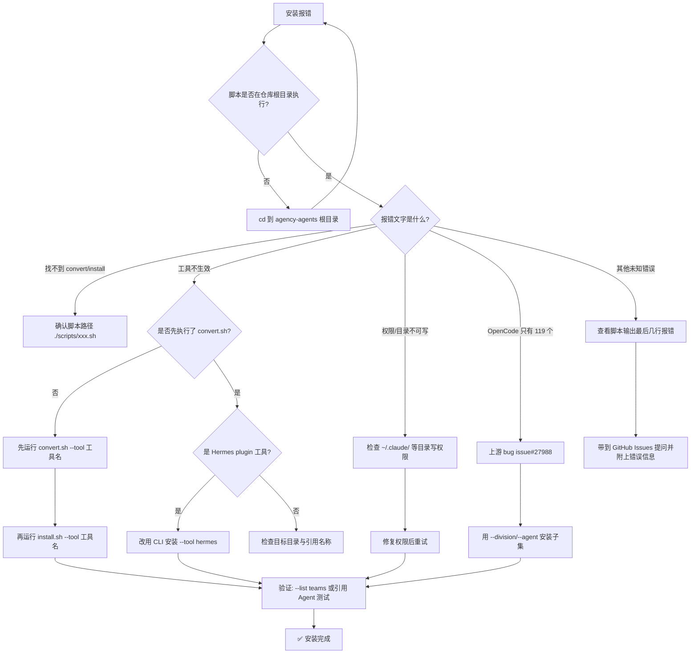

# The Agency 完全指南 — 常见问题解答

> 一句话摘要：本章以「问题 + 答案」的形式，系统解答 The Agency 的基础概念、安装、使用、工具兼容、维护与排查六大类高频问题，并附一张「安装失败排查」流程图，帮助你在遇到问题时快速定位与解决。

---

## 1. 基础类问题

### Q1. The Agency 是什么？

**The Agency（Agency Agents）** 是一个开源的 **AI Agent 角色库**项目，你可以把它理解成一支现成的「AI 梦之队」——里面收录了大量经过精心设计的、具有独特个性和专业能力的 AI 专家。每个 Agent 不是一句简单的"装作你是开发者"提示词，而是一份结构完整的角色定义文件，包含**身份个性、核心使命、关键规则、技术交付物、工作流程与成功指标**。

它由 [msitarzewski/agency-agents](https://github.com/msitarzewski/agency-agents) 维护，源自一个 Reddit 帖子，经过数月迭代成长为社区项目。

### Q2. 230+ Agent 是什么？

意思是仓库里目前收录了 **230 多个各具专长的 Agent**，分布在 **17 个部门（Division）**。每个部门聚焦一个业务领域，例如：

| 部门 | 中文含义 | 典型 Agent 示例 |
|------|---------|----------------|
| Engineering | 工程 | Frontend Developer、Backend Architect、SRE |
| Design | 设计 | UI Designer、Brand Guardian、Whimsy Injector |
| Marketing | 营销 | Growth Hacker、SEO Specialist、Xiaohongshu Specialist |
| Security | 安全 | Security Architect、Penetration Tester |
| Sales | 销售 | Outbound Strategist、Sales Engineer |
| Finance | 财务 | Financial Analyst、Tax Strategist |
| Testing | 测试 | Evidence Collector、Reality Checker |
| Game Development | 游戏 | Game Designer、Unity Architect |
| GIS | 地理信息 | GIS Analyst、Web GIS Developer |
| Specialized | 专精 | Agile Orchestrator、Document Generator |

> 这些 Agent 还附带 **10,000+ 行的个性、流程与代码示例**，并经过真实生产环境考验。

### Q3. 使用 The Agency 需要什么前置条件？

- **核心前置**：一台装有 Git 的电脑，以及你偏好使用的 **AI 编程助手**（如 Claude Code、Cursor、Codex、Gemini CLI、OpenCode、Qwen、Kimi 等）。
- **可选**：如果你只用桌面应用 **Agency Agents**（agencyagents.app），则几乎不需要命令行基础——它支持 macOS、Linux 与 Windows，可以一键浏览并安装整个名册。
- **无需额外**：不需要专门的服务器或运行时，Agent 本质上是文本文件，由你的 AI 助手读取执行。

### Q4. The Agency 是否免费？用什么许可证？

**免费且开源**。项目采用 **MIT 许可证**，你可以在个人或商业场景中自由使用，署名推荐但不强制。此外官方欢迎任何人通过 **Fork + PR** 贡献新 Agent 或改进现有 Agent。

---

## 2. 安装类问题

### Q5. 如何安装到 Claude Code？

Claude Code 原生支持 `.md` Agent，**无需转换**，直接安装即可：

```bash
# 安装全部 Agent 到 Claude Code 目录
./scripts/install.sh --tool claude-code

# 只安装某个部门（比如工程 + 安全）
./scripts/install.sh --tool claude-code --division engineering,security
```

安装完成后，在 Claude Code 会话中通过引用 Agent **名称**来激活，例如：

```
Use the Frontend Developer agent to review this component.
```

### Q6. 如何安装到 Cursor / Codex / Gemini CLI？

这三个工具都支持 `.md` 类 Agent，但**需要先转换再安装**：

```bash
# 第一步：生成各工具的集成文件
./scripts/convert.sh

# 第二步：安装到指定工具
./scripts/install.sh --tool cursor      # Cursor 生成 .cursor/rules/*.mdc
./scripts/install.sh --tool codex       # Codex 生成 ~/.codex/agents/*.toml
./scripts/install.sh --tool gemini-cli  # Gemini CLI 生成 ~/.gemini/agents/*.md
```

> **注意**：Gemini CLI 在一个全新的克隆仓库中，需要先运行 `convert.sh --tool gemini-cli` 生成 Agent 文件，再运行 `install.sh --tool gemini-cli`。

### Q7. 如何只安装部分部门或 Agent？

用 `--division` 或 `--agent` 参数即可精确控制：

```bash
# 只安装 engineering 和 security 两个部门
./scripts/install.sh --tool claude-code --division engineering,security

# 只安装两个具体 Agent
./scripts/install.sh --tool cursor --agent frontend-developer,ui-designer

# 查看所有部门及其 Agent 数量
./scripts/install.sh --list teams
```

### Q8. 非交互式安装怎么做？

适合 CI/CD 或脚本场景，使用 `--no-interactive`：

```bash
# 安装所有已检测到的工具（非交互）
./scripts/install.sh --no-interactive --tool all

# 并行安装，加快速度
./scripts/install.sh --no-interactive --parallel
```

默认交互式安装会扫描你的系统，显示一个勾选清单，让你挑选要安装的工具与团队。`--parallel` 在多数核机器上能显著加速，作业数默认取 `nproc`（Linux）/ `hw.ncpu`（macOS），可用 `--jobs N` 调整。

### Q9. 安装报错怎么办？

先看错误类型，再对症下药（详见第 6 节排查对照表）。最常见的几种：

- **`convert.sh` 未执行就安装** → 部分工具（Codex、Kimi、Gemini CLI 等）需要先转换再安装。
- **找不到二进制** → 确认对应工具已安装且已加入 `PATH`。
- **权限不足** → 确认目标目录（如 `~/.claude/agents/`）可写。
- **OpenCode 只显示约 119 个 Agent** → 这是上游已知限制，用 `--division`/`--agent` 安装子集即可（见 Q13）。

---

## 3. 使用类问题

### Q10. 如何激活一个 Agent？

安装后，在你使用的 AI 助手会话中**用自然语言引用 Agent 名称**即可激活。不同工具有不同的引用方式：

| 工具 | 激活方式示例 |
|------|-------------|
| Claude Code | `Use the Frontend Developer agent to help me build a React component` |
| Cursor | `Use the @security-engineer rules to review this code` |
| OpenCode | `@backend-architect design this API.` |
| Antigravity(Gemini) | `@agency-frontend-developer review this React component` |
| Aider | `Use the Frontend Developer agent to refactor this component` |

### Q11. Agent 之间如何协作？

Agent 之间可以**组合成流水线或团队**，形成端到端的交付链条。例如官方示例「Building a Startup MVP」就组合了：

1. **Frontend Developer** 构建 React 应用
2. **Backend Architect** 设计 API 与数据库
3. **Growth Hacker** 规划用户增长
4. **Rapid Prototyper** 快速迭代
5. **Reality Checker** 在发布前做质量把关

更复杂的场景可参考 [Nexus Spatial Discovery Exercise](https://github.com/msitarzewski/agency-agents/blob/main/examples/nexus-spatial-discovery.md)——8 个 Agent 并行协作，产出一份跨市场验证、技术架构、品牌策略、增长与 UX 研究的统一产品蓝图。

### Q12. 上下文限制怎么办？

Agent 定义文件较长，可能占用不少上下文。建议：

- **按需安装**：只安装你真正需要的部门/Agent，减少不必要的上下文占用。
- **按任务激活**：不要把全部 Agent 一次性加载，而是针对当前任务激活 1-3 个专用 Agent。
- **组合流水线**：让多个 Agent 接力，每个 Agent 只负责自己擅长的环节，避免单个会话上下文过载。

### Q13. 如何自定义/修改一个 Agent？

每个 Agent 都是独立的 Markdown 文件，直接编辑即可。文件遵循统一的**模板结构**（详见第 5 节），你可以：

- 修改 `frontmatter` 中的 `name`、`description`、`color`、`emoji`。
- 调整 `# … Agent Personality` 下的身份、使命、规则、交付物与指标。
- 修改后如使用其他工具，需重新运行 `convert.sh` 重新生成集成文件（见 Q17）。

---

## 4. 工具兼容类问题

### Q14. 为什么 OpenCode 只能安装约 119 个 Agent？

这是 **OpenCode 上游的已知 bug**（[opencode issue #27988](https://github.com/anomalyco/opencode/issues/27988)）：OpenCode 运行时目前只注册了约 119 个 Agent，其余会被**静默丢弃**。因此，如果你一次性安装全部 230+ Agent，OpenCode 只会保留约 119 个。

**规避方法**：用 `--division` 或 `--agent` 安装一个子集，使其保持在 119 上限以内。安装器在超出限制时会**主动警告你**。

```bash
./scripts/install.sh --tool opencode --division engineering
```

### Q15. plugin 类型工具（Hermes）如何安装？

在 `tools.json` 中，工具的安装方式分为三种：`per-agent`、`roster`、`plugin`。**Hermes 属于 `plugin` 类型**——它不是"每个 Agent 一个文件"，而是一个**构建产物（lazy-router 插件）**，无法被渲染成单个字符串，只能通过 CLI 安装：

```bash
./scripts/convert.sh --tool hermes    # 生成插件
./scripts/install.sh --tool hermes    # 安装到 ~/.hermes/plugins/
```

> **注意**：`plugin` 类型工具是 **CLI-only** 的，桌面应用（Agency Agents）只原生支持能按字符串渲染的 `per-agent`/`roster` 工具。

### Q16. roster 类型工具（Aider/Windsurf）和 per-agent 的区别？

这是 The Agency 三种集成机制的核心区别：

| 维度 | per-agent（每 Agent 单文件） | roster（整册合并单文件） | plugin（构建插件） |
|------|------------------------------|--------------------------|--------------------|
| 代表工具 | Claude Code、Cursor、Codex、Gemini CLI | Aider、Windsurf | Hermes |
| 文件形态 | 每个 Agent 一个独立文件/目录 | 所有 Agent 合并成一个文件 | 一个可构建的插件产物 |
| 举例 | `~/.claude/agents/frontend-developer.md` | `CONVENTIONS.md`、`.windsurfrules` | `~/.hermes/plugins/agency-agents-router` |
| 是否按 Agent 渲染 | ✅ 是 | ❌ 否，整体一份 | ❌ 否，仅 CLI 构建 |
| 桌面应用能否安装 | ✅ 支持 | ✅ 支持 | ❌ 仅 CLI |

- **per-agent**：如 Claude Code 直接复制到 `~/.claude/agents/`；Cursor 生成 `.cursor/rules/*.mdc`；Codex 生成 `~/.codex/agents/*.toml`。
- **roster**：如 Aider 把所有 Agent 汇编为一个 `CONVENTIONS.md`，Windsurf 汇编为 `.windsurfrules`，由工具自动读取。

---

## 5. 维护类问题

### Q17. 新增 Agent 后如何重新生成集成文件？

当你新增或编辑 Agent 后，需要重新生成各工具的集成文件：

```bash
# 重新生成所有工具（串行）
./scripts/convert.sh

# 或并行生成（更快）
./scripts/convert.sh --parallel

# 只重新生成某一个工具
./scripts/convert.sh --tool codex
./scripts/convert.sh --tool cursor
```

生成后，再重新运行对应工具的 `install.sh` 即可将变更同步到你的工具目录。

### Q18. 如何验证安装正确？

可以通过 `--list` 查看名册，或检查目标目录中的文件数量：

```bash
# 查看可安装的部门与 Agent 数量
./scripts/install.sh --list teams

# 检查 Claude Code 目录
ls ~/.claude/agents/ | wc -l

# 检查 OpenCode 目录（注意 119 上限）
ls ~/.config/opencode/agents/ | wc -l
```

> **验证技巧**：安装后在对应工具会话中实际引用一个 Agent 名称，确认能被正确识别并激活，是最直接的验证。

---

## 6. 排查类问题

### 常见错误与解决办法对照表

| 错误现象 | 可能原因 | 解决办法 |
|---------|---------|---------|
| 提示"找不到 convert / install 脚本" | 未在仓库根目录执行 | 先 `cd` 到 `agency-agents` 仓库根目录再运行 |
| 安装 Codex/Kimi/Gemini 后不生效 | 未先执行 `convert.sh` | 先 `./scripts/convert.sh --tool <name>`，再 `install.sh` |
| OpenCode 只显示约 119 个 Agent | 上游 bug（issue #27988） | 用 `--division`/`--agent` 安装子集，保持在限内 |
| Agent 在会话中无法被识别 | 文件名与引用名不一致 | 确认引用的是 Agent 的 `name`/slug，而非路径 |
| 转换后集成文件未更新 | 修改后未重新 convert | 重新运行 `./scripts/convert.sh` |
| 安装时提示"目录不可写" | 权限不足 | 检查 `~/.claude/`、`.cursor/` 等目标目录写权限 |
| 桌面应用无法安装 Hermes | Hermes 是 `plugin` 类型，仅 CLI | 改用 `./scripts/install.sh --tool hermes` |
| 并行安装顺序不稳定 | `--parallel` 输出顺序不确定 | 如需确定顺序，去掉 `--parallel` 串行执行 |
| 安装提示"超出 OpenCode 限制" | 所选子集 > 119 | 减少 `--division`/`--agent` 范围 |

### 安装失败排查流程图



> **排查心法**：90% 的安装问题都出在「顺序」与「范围」上——先 `convert` 再 `install`、只装需要的子集、确认在仓库根目录执行。按流程图逐步排查，大多能快速解决。

---

- [上一章：策略与运行手册](07-strategy-playbooks.md) ← · [下一章：最佳实践指南](09-best-practices.md) →