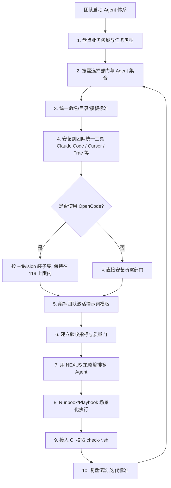

# The Agency 完全指南 — 最佳实践指南

> 一句话摘要：本章从 Agent 选择、安装、使用、自定义、团队落地以及与 AI 编程助手结合六个维度，提炼 The Agency 的实战最佳实践，并配一张「团队落地 Agent 体系」流程图与一份速查清单，帮助你从"会用"进阶到"用得专业"。

---

## 1. Agent 选择最佳实践

### 1.1 按任务类型选择 Agent / 部门

The Agency 的核心价值在于**专精**——不要用一个通用 Agent 处理所有事，而是让对的 Agent 干对的事。选择时先问自己三个问题：

1. **任务属于哪个领域？** → 对齐到对应部门（Engineering / Marketing / Security / Sales …）。
2. **需要什么深度的专长？** → 从部门内挑选最贴合的 Agent。
3. **交付物是什么？** → 看 Agent 的「Technical Deliverables」是否对应你要的产出。

| 任务类型 | 推荐部门 | 推荐 Agent 示例 |
|---------|---------|----------------|
| 搭建 Web 应用 | Engineering | Frontend Developer、Backend Architect |
| 营销增长 | Marketing | Growth Hacker、SEO Specialist |
| 网络安全评估 | Security | Security Architect、Penetration Tester |
| 产品质量把关 | Testing | Evidence Collector、Reality Checker |
| 商业规划 | Product / Finance | Product Manager、Financial Analyst |
| 客服与运营 | Support | Support Responder、Analytics Reporter |

> **核心原则**：先按「领域」定位部门，再按「交付物」细化到具体 Agent，避免为了省事用一个通用 Agent 硬扛所有任务。

### 1.2 如何组合多 Agent 形成流水线

现实任务往往横跨多个领域，最佳做法是**把任务拆成多个环节，每个环节交给最擅长的 Agent**，形成流水线。例如一次「产品发布」可以这样编排：

1. **Product Manager** —— 定义需求与 PRD
2. **UI Designer / Frontend Developer** —— 设计与实现界面
3. **Backend Architect** —— 设计后端的 API 与数据
4. **Testing（Evidence Collector）** —— 收集证据、验证质量
5. **Marketing（Growth Hacker）** —— 规划发售与增长
6. **Reality Checker** —— 最终发布前的质量门

> 这种「多 Agent 接力」模式在官方 Use Cases 中反复出现，例如「Building a Startup MVP」「Enterprise Feature Development」，都是把 5-8 个 Agent 串成一条端到端流水线。

---

## 2. 安装最佳实践

### 2.1 按需安装，避免过度安装

**强烈建议按需安装**，而不是一次性装全部 230+ Agent。原因有三：

- **减少上下文占用**：Agent 定义文件较长，装太多会占用宝贵的上下文。
- **降低激活噪声**：装太多会让 AI 助手在选择时「选择困难」，反而降低精度。
- **规避工具上限**：如 OpenCode 只支持约 119 个 Agent，装太多会被静默丢弃。

```bash
# 只装你业务需要的部门
./scripts/install.sh --tool claude-code --division engineering,security

# 或只装几个具体 Agent
./scripts/install.sh --tool cursor --agent frontend-developer,ui-designer

# 先看看有哪些部门可选
./scripts/install.sh --list teams
```

### 2.2 OpenCode 的 119 上限规避

OpenCode 存在上游 bug（[issue #27988](https://github.com/anomalyco/opencode/issues/27988)），运行时只注册约 119 个 Agent。规避要点：

- 使用 `--division` / `--agent` 安装**子集**，确保不超过 119。
- 留意安装器的**警告**——当选择会超出上限时它会提醒你。
- 需要更换部门时，先清理旧子集再装新的，避免新旧叠加超限。

### 2.3 用 dry-run 预览，避免直接改动环境

`--dry-run` 让你**只预览输出、不实际写入**，非常适合在正式安装前检查效果：

```bash
# 预览 opencode 安装 engineering 部门会做什么
./scripts/install.sh --tool opencode --division engineering --dry-run
```

> **最佳实践**：凡是涉及批量安装到多个工具、或不确定参数效果时，先跑一次 `--dry-run`，确认无误后再正式安装。这能避免污染工具目录。

---

## 3. 使用最佳实践

### 3.1 如何编写有效的激活提示词

激活 Agent 时，提示词质量直接决定输出质量。一个有效的激活提示词应包含四要素：

1. **引用 Agent**：明确点名要用的 Agent（无论用自然语言还是 `@agent` 语法）。
2. **给出目标**：说明你想要的最终结果。
3. **提供上下文**：给出必要的背景、文件、约束。
4. **定义交付**：说明可度量的交付物。

**反例（模糊）**：
```
帮我做个网站。
```

**正例（清晰）**：
```
Use the Frontend Developer agent to build a landing page for my SaaS product.
Target: a responsive single-page React app. Context: use the brand colors in
design/brand.md. Deliverable: a working React component with a Core Web Vitals
score ≥ 90 and a short summary of what was built.
```

### 3.2 如何让 Agent 交付可度量成果

The Agency 的 Agent 天生「交付物导向」，但你要主动**把成果量化**，才能形成可验收的标准：

- **明确指标**：如「性能分 ≥ 90」「测试通过率 100%」「覆盖 3 个平台」。
- **要求证据**：Testing 部门的 Evidence Collector 就是典型——它默认找 3-5 个问题并**要求视觉证明**。
- **设定质量门**：用 Reality Checker 在最终交付前做「生产就绪」认证。
- **跟踪结果**：让 Analytics Reporter 把成果整理成可汇报的仪表盘/摘要。

---

## 4. 自定义最佳实践

### 4.1 基于现有 Agent 修改 / 创建新 Agent

每个 Agent 都是遵循统一模板的 Markdown 文件。自定义的核心是**遵循 frontmatter + 章节结构**：

**frontmatter（元数据）字段**：

```yaml
---
name: Frontend Developer
description: Expert frontend developer specializing in modern web technologies…
color: cyan
emoji: 🖥️
vibe: Builds responsive, accessible web apps with pixel-perfect precision.
---
```

**章节结构（正文）**：

1. `# … Agent Personality` —— 角色定位
2. `## 🧠 Your Identity & Memory` —— 身份与记忆
3. `## 🎯 Your Core Mission` —— 核心使命
4. 关键规则（领域专属）
5. 技术交付物（含代码示例）
6. 工作流程
7. 成功指标

**修改实践**：

- **小改**：直接改现有 Agent 的 `name` / `description` / 某段规则。
- **新建**：复制一个相近的 Agent 文件，改 frontmatter 与正文，放入对应部门目录。
- **改名规范**：文件名遵循 `<division>-<slug>.md`，如 `engineering-frontend-developer.md`。
- **改后同步**：修改后运行 `./scripts/convert.sh` 重新生成各工具集成文件。

> **注意**：仓库有 `scripts/check-divisions.sh`、`lint-agents.sh` 等 CI 校验脚本，会检查目录与 frontmatter 一致性，新增 Agent 时留意不要破坏结构。

### 4.2 如何贡献回上游（Fork + PR）

贡献是 The Agency 社区文化的一部分，官方欢迎且鼓励：

1. **Fork 仓库**：`github.com/msitarzewski/agency-agents` → Fork。
2. **新建 Agent**：在合适的部门目录创建文件，遵循模板结构。
3. **本地校验**：运行 `scripts/check-divisions.sh`、`lint-agents.sh` 等脚本确保通过。
4. **提交 PR**：附带说明 Agent 的定位、适用场景与新增原因。
5. **参与讨论**：在 [GitHub Discussions](https://github.com/msitarzewski/agency-agents/discussions) 分享使用故事。

> 除了新增 Agent，你也可以通过**改进现有 Agent**（补充真实案例、增强代码示例、更新成功指标、改进工作流）反向贡献。

---

## 5. 团队落地最佳实践

### 5.1 统一团队 Agent 标准

团队规模化使用前，先建立**统一标准**，避免每个人各自为政：

- **命名与目录规范**：统一 Agent 命名与部门目录结构。
- **模板锁定**：固定 frontmatter 字段与章节结构，保证可维护性。
- **版本管理**：把 Agent 名册纳入 Git 管理，统一升级与回滚。
- **文档沉淀**：编写团队内部使用指南，说明每个 Agent 的适用场景。

### 5.2 建立质量门

把 Agent 当作「团队产能」而非「个人玩具」，用质量门保证产出：

- **验收指标**：为每个 Agent 定义可量化的验收标准（如覆盖率、性能分、合规校验）。
- **质量 Agent 把关**：用 Testing / Reality Checker 类 Agent 对关键交付做最终验证。
- **CI 集成**：把校验脚本（`check-*.sh`）接入 CI，防止结构错误进入主干。

### 5.3 结合 NEXUS 策略

**NEXUS 策略**是 The Agency 提供的多 Agent 协同方法论（见 `strategy/nexus-strategy.md`），用于**多个 Agent 并行、编排、分工**完成复杂任务。团队落地时：

- **用 NEXUS 做多 Agent 编排**：让多个部门 Agent 并行处理一个总目标。
- **用 Runbook 做场景化执行**：`strategy/runbooks/` 中的场景（如 enterprise-feature、incident-response、marketing-campaign、startup-mvp）提供了现成的执行套路。
- **用 Playbook 做阶段推进**：`strategy/playbooks/` 的 phase-0 到 phase-6 覆盖从发现到运营的完整生命周期。

### 团队落地 Agent 体系推荐流程



> **团队心法**：落地不是"装一堆 Agent"，而是"定标准 → 按需装 → 建质量门 → 用 NEXUS 编排 → 持续复盘"。先小范围试点 1-2 个部门，验证效果后再推广。

---

## 6. 与 AI 编程助手结合的最佳实践

### 6.1 与 Trae / Claude Code / Cursor 的结合思路

The Agency 的原生金属性让它可以无缝嵌入主流 AI 编程助手：

| 助手 | 结合方式 | 落地要点 |
|------|---------|---------|
| **Claude Code** | 原生 `.md` Agent，复制到 `~/.claude/agents/` | 无需转换，直接激活 |
| **Cursor** | 生成 `.cursor/rules/*.mdc` 规则 | 规则自动应用，可用 `@agent` 显式引用 |
| **Trae** | 把 Agent 作为团队角色/规则导入 | 结合 Trae 的仓储与团队协作，统一团队 Agent 标准 |
| **Codex** | 生成 `~/.codex/agents/*.toml` 自定义 Agent | 先 convert 再 install |
| **Gemini CLI** | 生成 `~/.gemini/agents/*.md` 子代理 | 新克隆需先 convert |

**通用最佳实践**：

- **按任务激活**：不要把所有 Agent 一次性塞进会话，按当前任务激活 1-3 个。
- **Agent 扮演角色层**：把 The Agency 的 Agent 当作「角色/专家层」，让编程助手的原生能力负责执行。
- **提示词模板化**：把上面 3.1 的四要素沉淀成团队模板，保证每次激活质量稳定。
- **质量闭环**：编码任务用 Testing/Reality Checker 收尾，形成「Agent 写 → 质量 Agent 验」的闭环。

### 6.2 常见误区

- ❌ **过度安装**：把 230+ Agent 全装进去，上下文爆炸、选择困难。
- ❌ **模糊激活**：只点名 Agent 不给目标与交付，输出难以度量。
- ❌ **一次性多 Agent 混用**：未经编排就同时激活多个 Agent，容易互相干扰。
- ❌ **改了不同步**：编辑 Agent 后不重新 `convert.sh`，集成文件过期。

---

## 7. 最佳实践速查清单

### 安装前
- [ ] 用 `--list teams` 查看部门与 Agent 容量
- [ ] 明确按 `--division` / `--agent` 按需安装
- [ ] 不确定时先跑 `--dry-run` 预览
- [ ] OpenCode 用户控制子集 ≤ 119

### 安装中
- [ ] 部分工具先 `convert.sh` 再 `install.sh`
- [ ] 在仓库根目录执行脚本
- [ ] 必要时用 `--parallel` 加速，用 `--jobs N` 控并发

### 使用中
- [ ] 激活提示词包含「Agent + 目标 + 上下文 + 交付」
- [ ] 让质检 Agent（Reality Checker 等）做发布前把关
- [ ] 用 NEXUS 策略编排多 Agent，避免无序混用

### 自定义与维护
- [ ] 遵守 frontmatter + 章节结构模板
- [ ] 修改后重新 `convert.sh` 同步集成文件
- [ ] 团队落地前先统一命名/目录/标准
- [ ] 贡献走 Fork + PR，PR 前跑 `check-*.sh`

---

- [上一章：常见问题解答](08-faq-troubleshooting.md) · [下一章：总结与资源](10-summary-resources.md) →