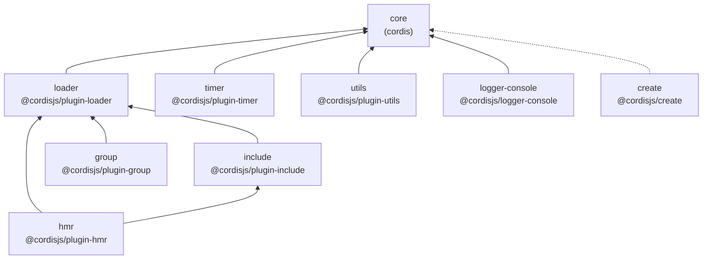

# Cordis — 文件结构与 Monorepo

> 一句话摘要：本章解析 Cordis 的 monorepo 目录布局与根配置文件，说明 10 个包（core/loader/hmr/create/group/include/logger-console/timer/utils + 外部依赖）各自职责，以及 yarn workspaces + yakumo + vitest 的工程化协作方式。

---

## 1. 整体布局

Cordis 是一个 **yarn workspaces monorepo**，根 `package.json` 声明了两个工作区通配：

```json
{
  "workspaces": [ "external/*", "packages/*" ],
  "packageManager": "yarn@4.14.1",
  "type": "module"
}
```

工作区由 `packages/*`（第一方包）与 `external/*`（外部/上游包，本仓库中未展开）组成。

### 目录树（简化）

```
cordis/
├── package.json            # 根：脚本、devDependencies、workspaces
├── tsconfig.base.json      # 全仓共享 TS 编译配置
├── tsconfig.json           # 根 TS 配置
├── tsconfig.test.json      # 测试 TS 配置
├── vitest.config.ts        # vitest 测试配置
├── yakumo.yml              # yakumo 构建编排配置
├── .yarnrc.yml             # yarn 配置
├── .eslintrc.yml           # eslint 配置
├── .eslintignore           # eslint 忽略
├── .nycrc.json             # 覆盖率配置
├── .gitattributes          # git 属性
└── packages/
    ├── core/               # 核心库（对外包名 cordis）
    ├── loader/             # 声明式加载器（@cordisjs/plugin-loader）
    ├── hmr/                # 热更新（@cordisjs/plugin-hmr）
    ├── create/             # 脚手架（@cordisjs/create）
    ├── group/              # 分组（@cordisjs/plugin-group）
    ├── include/            # 配置导入（@cordisjs/plugin-include）
    ├── timer/              # 定时器（@cordisjs/plugin-timer）
    ├── logger-console/     # 控制台日志导出（@cordisjs/logger-console）
    └── utils/              # 工具（@cordisjs/plugin-utils）
```

---

## 2. 各包职责速查

| 包 | 目录 | 职责 | 核心文件 |
|----|------|------|---------|
| **core** | `packages/core` | 核心库：Context、Service、Fiber、Registry、Effect/Coeffect 机制 | `src/{context,service,fiber,registry,reflect,events,logger,utils}.ts` |
| **loader** | `packages/loader` | 声明式组件装配、配置合并、服务隔离、JS 表达式 | `src/{index,internal}.ts`、`src/config/*.ts` |
| **hmr** | `packages/hmr` | 文件监听与增量热更新 | `src/{index,error}.ts` |
| **create** | `packages/create` | 从 npm 模板脚手架新项目 | `src/{index,bin}.ts` |
| **group** | `packages/group` | 分组插件（re-export loader 的 Group） | `src/index.ts` |
| **include** | `packages/include` | 从 YAML/JSON 读取并写回装配配置 | `src/index.ts` |
| **timer** | `packages/timer` | 定时器/节流/防抖，带上下文生命周期 | `src/index.ts` |
| **logger-console** | `packages/logger-console` | 控制台日志导出器 | `src/{index,shared,browser}.ts` |
| **utils** | `packages/utils` | `List`（可响应式列表）等工具 | `src/index.ts` |

---

## 3. 根配置详解

### 3.1 package.json 脚本

```json
{
  "scripts": {
    "lint": "eslint --cache",
    "build": "yarn yakumo esbuild && yarn yakumo tsc",
    "test": "yarn yakumo vitest --import tsx",
    "test:text": "shx rm -rf coverage && yarn test --coverage --coverage.reporter text"
  }
}
```

| 脚本 | 作用 |
|------|------|
| `lint` | 全仓 eslint 静态检查（带缓存） |
| `build` | 先 esbuild 打包、再 tsc 生成类型声明 |
| `test` | 通过 yakumo 驱动全仓 vitest（配合 `tsx` 加载 TS） |
| `test:text/json/html` | 不同格式的覆盖率报告 |

`yakumo` 是 Koishi 生态的 **monorepo 构建编排器**：根运行 `yarn yakumo <task>` 会把任务分发给各子包执行（esbuild 打包、tsc 类型检查、vitest 测试分别由 `yakumo-esbuild`、`yakumo-tsc`、`yakumo-vitest` 插件实现）。

### 3.2 关键 devDependencies

| 依赖 | 用途 |
|------|------|
| `typescript@^5.9` | 编译与类型检查 |
| `esbuild@^0.28` | 快速打包（yakumo-esbuild 底层） |
| `vitest@^4.1` + `@vitest/coverage-v8` | 单元测试与覆盖率 |
| `eslint@^8.57` + `@cordisjs/eslint-config` | 代码规范 |
| `yakumo@^3.2` 及其插件 | monorepo 构建编排 |
| `tsx`（`@cordiverse/tsx`） | 直接运行 TS 的加载器 |
| `@cordisjs/unyaml` | YAML 到类型安全的加载（配合 `--import`） |

### 3.3 tsconfig 与模块策略

`tsconfig.base.json` 提供全仓共享的严格编译选项；各包有自己的 `tsconfig.json` 引用基配置。**注意**：loader 内部使用了带扩展名的相对导入（如 `from './internal.ts'`），这是 Node ESM 下 TypeScript 5.x 的显式路径风格。

---

## 4. 依赖关系



> **解读**：`core` 是唯一的底层基础包（除 `create` 仅作为 CLI 脚手架）。`loader`、`timer`、`utils`、`logger-console` 都建立在 `core` 之上；`hmr` 建立在 `loader` 之上（并类型引用 `include`）；`group` 与 `include` 复用 `loader` 的装配抽象。整个仓库的依赖方向清晰、无环。

---

## 5. 核心包内部结构（packages/core）

```
packages/core/
├── package.json     # 包名 cordis，导出 src/index.ts
├── src/
│   ├── index.ts     # 汇总导出所有模块
│   ├── context.ts   # Context 类：上下文、isolate/intercept/extend
│   ├── service.ts   # Service 抽象基类：依赖注入符号、hasInstance
│   ├── fiber.ts     # Fiber：生命周期状态机、effect/回收、epoch
│   ├── registry.ts  # RegistryService + Plugin 类型 + @Inject
│   ├── reflect.ts   # ReflectService：provide/get/notify、Proxy handler
│   ├── events.ts    # EventsService：emit/parallel/serial/bail/waterfall
│   ├── logger.ts    # LoggerService + Logger + 导出器 + 格式化
│   └── utils.ts     # DisposableList、symbols、traceable、composeError 等
└── tests/           # 各模块的 vitest 单元测试
```

`src/index.ts` 仅负责 re-export：

```ts
export * from './context'
export * from './events'
export * from './fiber'
export * from './logger'
export * from './registry'
export * from './service'
export * from './utils'
```

> 注意 `reflect.ts` 未在 index 显式导出，但其 `ReflectService` 类型仍通过 `Context` 的公开成员暴露。

---

## 6. 加载器包内部结构（packages/loader）

```
packages/loader/src/
├── index.ts            # Loader 服务 + 事件/上下文扩展
├── internal.ts         # 封装 Node 22/23/24 的内部 ModuleLoader API
└── config/
    ├── entry.ts        # Entry：单个装配项及其配置的增删改查
    ├── group.ts        # EntryGroup / Group：装配分组
    ├── tree.ts         # EntryTree：装配树、按 id 解析、动态 import
    ├── isolate.ts      # isolate 插件：Realm 服务隔离
    └── utils.ts        # evaluate / interpolate：配置中的 JS 表达式
```

---

## 7. 学习路径提示

- 想理解**核心机制** → 从 `packages/core/src/fiber.ts` 与 `reflect.ts` 入手
- 想理解**装配** → 从 `packages/loader/src/config/entry.ts` 与 `tree.ts` 入手
- 想理解**热更新** → 读 `packages/hmr/src/index.ts`（依赖 loader 的 internal ModuleLoader）
- 想理解**理论落地** → 对照第 1 章「理论到实现的映射总览」逐文件阅读

---

- [上一章：背景理论与论文](01-background-paper.md) | [下一章：核心抽象与架构](03-core-architecture.md) →