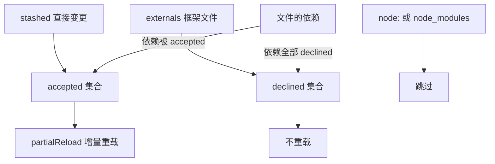

# Cordis — 热更新 HMR

> 一句话摘要：本章讲解 `plugin-hmr` 包如何基于 `chokidar` 监听文件、基于 Node 内部的 `ModuleLoader.loadCache` 增量重载插件：把变更文件分类为「接受（accepted）」「拒绝（declined）」，备份并清空模块缓存后重新导入，失败时回滚，实现不重启进程的插件热更新。

---

## 1. 前置条件

HMR（`packages/hmr/src/index.ts`）依赖 Node 的内部 ESM loader：

```ts
constructor(ctx, config) {
  super(ctx, 'hmr')
  if (!this.ctx.loader.internal) {
    throw new Error('--expose-internals is required for HMR service')
  }
  this.internal = this.ctx.loader.internal
  this.baseDir = fileURLToPath(new URL(config.base || '.', ctx.baseUrl))
}
```

因此启动时必须带 `--expose-internals` 标志，否则直接抛错（详见第 11 章 FAQ）。

---

## 2. 依赖收集：区分「外部」与「内部」

HMR 需要区分哪些文件属于框架自身（改动需整体重启）、哪些属于可热更的插件代码：

```ts
async function loadDependencies(job, ignored = new Set()) {
  const dependencies = new Set<string>()
  async function traverse(job) {
    if (ignored.has(job.url) || dependencies.has(job.url)) return
    if (job.url.startsWith('node:') || job.url.includes('/node_modules/')) return
    dependencies.add(job.url)
    const children = await job.linked
    await Promise.all([...children].map(traverse))
  }
  await traverse(job)
  return dependencies
}
```

初始化时收集「外部模块」（主入口可达的框架模块）：

```ts
const mainJob = this.internal.loadCache.get(pathToFileURL(resolve(process.argv[1])).href)
this.externals = mainJob ? await loadDependencies(mainJob) : new Set()
```

---

## 3. 文件监听与三路分类

`chokidar` 监听目录，`debounce` 合并高频变更：

```ts
this.watcher = watch(root, { ...this.config, cwd: this.baseDir, ignored })
this.watcher.on('change', async (path) => {
  const url = pathToFileURL(resolve(this.baseDir, path)).href

  if (this.externals.has(url)) return loader.exit()          // 1. 框架文件 → 全量退出
  if (loader.internal.loadCache.has(url)) {                 // 2. 插件代码 → 增量热更
    this.stashed.add(url)
    return partialReload()
  }
  for (const entry of this.ctx.loader.entries()) {          // 3. 配置文件 → 刷新
    const include = entry.subtree
    if (include?.filename !== filename) continue
    await include.refresh()
    return
  }
  this.ctx.emit('hmr/change', url)
})
```

---

## 4. `accepted` / `declined` 分类

`analyzeChanges()` 把变更文件按「依赖图」递归分类：

- 直接变更的文件（`stashed`）初始记为 **accepted**。
- 外部文件（`externals`）记为 **declined**。
- 若一个文件的某个依赖是 accepted，则它也是 accepted；若所有依赖都 declined 或排除，则 declined。



---

## 5. 增量重载：备份 → 清缓存 → 重导入 → 回滚

`partialReload()` 是 HMR 的核心：

1. **备份并清空模块缓存**（`loadCache` 与 CJS `require.cache`）：

```ts
const esmBackup = Object.create(null), cjsBackup = Object.create(null)
for (const filename of this.accepted) {
  esmBackup[filename] = Map.prototype.get.call(this.internal.loadCache, filename)
  Map.prototype.delete.call(this.internal.loadCache, filename)
  // CJS 缓存同理
}
```

> 这里用 `Map.prototype.get/delete` 直接操作，因为 Node 24 的 `loadCache` 是 `LoadCache extends Map`，其 `.delete()` 只把 type 槽置为 `undefined`，只有 `Map.prototype.delete` 能彻底移除。

2. **重新导入插件入口文件**；失败则 `rollback()` 恢复缓存。
3. **删除旧运行时并重新注册**：

```ts
const reload = (plugin, runtime) => {
  if (!runtime) return
  for (const oldFiber of runtime.fibers) {
    const fiber = oldFiber.parent.registry.plugin(plugin, oldFiber.config, this.getOuterStack)
    fiber.entry = oldFiber.entry
    if (fiber.entry) fiber.entry.fiber = fiber
  }
}
```

4. 全程 `try/catch`，任何一步失败都会 `rollback()` 并重新注册旧插件，保证「热更失败不破坏运行态」。

---

## 6. 错误渲染：`handleError`

`packages/hmr/src/error.ts` 把 esbuild 的 `BuildFailure` 转成带代码框（code frame）的可读错误：

```ts
export function handleError(ctx, e) {
  if (!isBuildFailure(e)) { ctx.logger.warn(e); return }
  for (const error of e.errors) {
    const formatted = codeFrameColumns(source, { start: { line, column } }, {
      highlightCode: true, message: error.text,
    })
    ctx.logger.warn(`File: ${file}:${line}:${column}\n` + formatted)
  }
}
```

---

## 7. 配置项

```ts
namespace Hmr {
  interface Config extends ChokidarOptions {
    base?: string      // 基准目录
    root: string[]     // 监听目录，默认 ['.']
    debounce: number   // 防抖毫秒，默认 100
    ignored: string[]  // 忽略 glob，默认 node_modules/.git 等
  }
}
```

---

## 8. HMR 的时空可组合性意义

HMR 是「时间可组合性」的绝佳演示：**代码变了，旧插件实例被逆序回收（效应回退），新插件实例被装配（效应重放），整个过程进程不重启、用户无感**。`rollback` 更进一步——即便新代码加载失败，运行时也能用备份缓存恢复旧实现，这与 Fiber 的「可逆效应」哲学完全一致。

---

- [上一章：声明式加载与配置合并](07-loader-config.md) | [下一章：辅助包](09-aux-packages.md) →