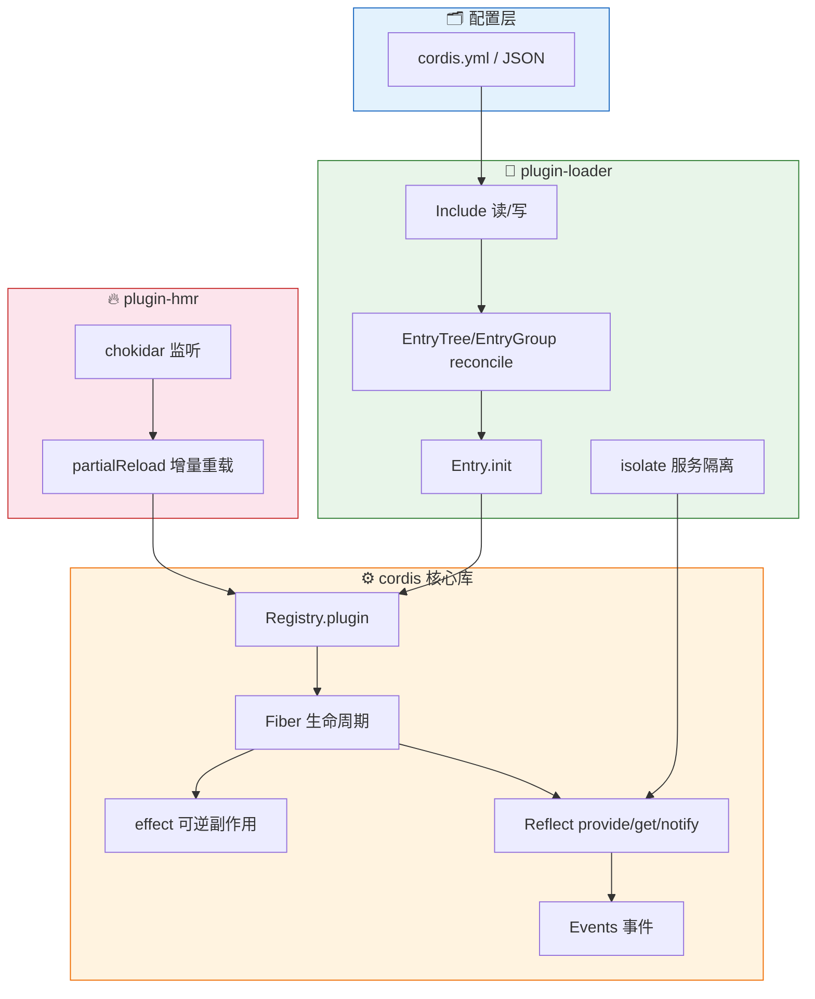

# Cordis — 使用示例

> 一句话摘要：本章给出可运行的完整代码示例——最小插件、依赖注入、可逆副作用、声明式装配，并辅以一张整体的数据流架构图，帮助你从「概念理解」切换到「动手使用」。

---

## 1. 最小插件

```ts
// greet.ts
import { Context } from 'cordis'

export default function greet(ctx: Context) {
  ctx.logger.info('hello, cordis!')
}
```

```ts
// main.ts
import { Context } from 'cordis'
import ConsoleExporter from '@cordisjs/plugin-logger-console'
import greet from './greet'

const ctx = new Context()
ctx.plugin(ConsoleExporter)
ctx.plugin(greet)

// 输出：hello, cordis!
await ctx.greet /* 如需等待激活，可 await ctx.plugin(...) */
```

---

## 2. 依赖注入：定义并消费服务

```ts
// counter.ts
import { Context, Service } from 'cordis'

export class Counter extends Service {
  private value: number
  constructor(ctx: Context, config: Counter.Config = {}) {
    super(ctx, 'counter')
    this.value = config.initial ?? 0
  }
  add(n: number) { this.value += n; return this.value }
  get current() { return this.value }
}
export namespace Counter {
  export interface Config { initial?: number }
}
```

```ts
// app.ts
import { Context, Inject } from 'cordis'
import { Counter } from './counter'

export default class App {
  // 类级依赖声明：等价于 static inject = ['counter']
  @Inject('counter')
  private declare counter: Counter

  constructor(ctx: Context) {
    this.counter.add(1)
    ctx.logger.info('count =', this.counter.current)   // 1
  }
}

// 装配
const ctx = new Context()
ctx.plugin(Counter, { initial: 10 })
ctx.plugin(App)
```

---

## 3. 可逆副作用：`ctx.effect()`

```ts
import { Context } from 'cordis'

export default function withTimer(ctx: Context) {
  ctx.effect(() => {
    const timer = setInterval(() => ctx.logger.debug('tick'), 1000)
    // 返回「逆」：卸载时自动清除定时器
    return () => clearInterval(timer)
  }, 'withTimer.interval')
}
```

卸载 `withTimer` 插件时，`clearInterval` 会被自动执行，环境干净恢复。

---

## 4. 响应式依赖：服务变化自动激活/停用

```ts
// db.ts —— 一个会被热切换的服务
class Database extends Service {
  constructor(ctx: Context, config: { url?: string }) {
    super(ctx, 'database')
  }
}

// consumer.ts —— 声明依赖 database
export default function consumer(ctx: Context) {
  // 当 database 被 provide 时，consumer 自动激活
  const db = ctx.database
  ctx.logger.info('db ready:', db)
}
```

当你调用 `ctx.plugin(Database)` 供应 `database` 时，声明了 `inject: ['database']` 的 `consumer` 会自动从「待激活」切换到「激活」；反过来供应被移除时自动停用。

---

## 5. 声明式装配：YAML 配置

```yaml
# cordis.yml
plugins:
  - id: logger
    name: '@cordisjs/plugin-logger-console'
  - id: counter
    name: ./counter
    config:
      initial: 42
  - id: app
    name: ./app
```

```ts
// main.ts
import { Context } from 'cordis'
import Loader from '@cordisjs/plugin-loader'
import Include from '@cordisjs/plugin-include'

const ctx = new Context()
ctx.plugin(Loader)
ctx.plugin(Include, { path: './cordis.yml' })
```

`Include` 读取 `cordis.yml`，解析出 3 个 entry，按顺序装配，并把运行时变更写回。

---

## 6. 整体数据流架构图



**数据流解读**：配置声明 → Include 读入 → EntryTree 增量合并 → Entry 装配 → Registry 创建 Fiber → Fiber 在 effect/reflect/events 之上运转；HMR 监听文件变化后，通过 reload 重新走 Registry 装配，实现热更闭环。

---

## 7. 快速验证建议

由于 API 未稳定，建议以最小可运行示例开头，逐步加依赖：

1. 先跑通「最小插件 + ConsoleExporter」，确认 `ctx.logger` 输出正常。
2. 再验证「依赖注入」：供应/消费一个自定义 `Service`。
3. 测试「可逆副作用」：装配后卸载插件，观察 `dispose` 是否被调用。
4. 最后接入 `Loader` + `Include`，用 YAML 声明装配。

---

- [上一章：辅助包](09-aux-packages.md) | [下一章：FAQ 与注意事项](11-faq-notes.md) →