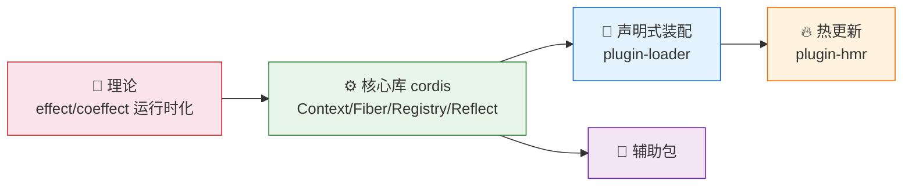

# Cordis — 总结与资源

> 一句话摘要：本章回顾整套教程的核心知识点，给出「源码位置速查表」与「术语速查表」，并列出论文、文档、源码等资源链接，作为后续深入学习与查阅的入口。

---

## 1. 核心知识点回顾

本教程围绕「Spacetime Composability（时空可组合性）」展开，一条主线贯穿始终：

**一句话总结**：Cordis 把「可逆效应」与「响应式协同效应」两大机制物化为运行时对象（Fiber 的 disposable 回收 + Inject/Provide 的响应式依赖），在核心库之上叠加声明式装配（loader）与热更新（hmr），实现了一套「组件可动态插拔、副作用可完整回退、依赖可自动维护」的元框架。

---

## 2. 源码位置速查表

| 主题 | 源码位置 |
|------|---------|
| 上下文与依赖隔离 | `packages/core/src/context.ts` |
| 服务基类与 DI 符号 | `packages/core/src/service.ts` |
| 生命周期与可逆效应 | `packages/core/src/fiber.ts` |
| 插件注册与 `@Inject` | `packages/core/src/registry.ts` |
| provide/get/notify | `packages/core/src/reflect.ts` |
| 事件分发 | `packages/core/src/events.ts` |
| 日志系统 | `packages/core/src/logger.ts` |
| 声明式装配 Loader | `packages/loader/src/index.ts` |
| 装配树 Entry/Tree/Group | `packages/loader/src/config/*.ts` |
| 模块加载接口 | `packages/loader/src/internal.ts` |
| 服务隔离 isolate | `packages/loader/src/config/isolate.ts` |
| 热更新 HMR | `packages/hmr/src/index.ts` |
| HMR 错误渲染 | `packages/hmr/src/error.ts` |
| 项目脚手架 | `packages/create/src/*.ts` |
| 配置文件导入 | `packages/include/src/index.ts` |
| 定时器服务 | `packages/timer/src/index.ts` |
| 控制台日志导出 | `packages/logger-console/src/*.ts` |
| 响应式列表 List | `packages/utils/src/index.ts` |

---

## 3. 术语速查表

| 术语 | 一句话解释 |
|------|-----------|
| 时间可组合性 | 卸载后副作用可完整回退 |
| 空间可组合性 | 依赖可声明并响应式维护 |
| 可逆效应 | 变换 + 逆函数，由运行时追踪 |
| 响应式协同效应 | 依赖声明 + 上下文变化通知激活/停用/中性 |
| Fiber | 单个插件的运行时实例（状态机 + 效应回收） |
| epoch | 由依赖实现 uid 拼接的激活信号 |
| isolate | 同名服务的作用域隔离（symbol 区分） |
| intercept | 子上下文覆盖服务配置（依赖注入参数化） |
| Plugin | 函数 / 构造器 / 对象三种形态的插件 |
| Loader | 声明式装配编排器 |
| HMR | 文件变更后的增量热重载 |

---

## 4. 资源链接

| 资源 | 链接 | 说明 |
|------|------|------|
| 论文仓库 | [cordiverse/paper](https://github.com/cordiverse/paper) | 《A Programming Paradigm for Spatiotemporal Composability》 |
| 框架入口说明 | `packages/core/README.md` | Cordis 定位与 Documentation/Paper 链接 |
| 文档（cordis-primer） | deepseek-harness 参考文档 | 框架使用入门 |
| 本文学习源码 | `d:\AI\.chaos\temp\cordis` | 本教程基于的 monorepo 快照 |
| 本文配套论文 | `d:\AI\.chaos\temp\paper` | `README.md` + `paper.pdf` |

---

## 5. 延伸学习建议

- **理论深入**：精读 `paper.pdf` 的 Section 3（可逆效应形式化）、Section 4（响应式协同效应）与组件演算部分。
- **源码精读**：从 `fiber.ts` 的 `effect()` 入手，跟踪 `_reload`/`_unload` 的完整状态迁移。
- **动手实践**：clone 官方 boilerplate，用 `Include` 声明一个 YAML 装配，再开启 HMR 观察热更。
- **对照工具链**：研究 `deepseek-harness` 如何基于 Cordis 构建「一切皆插件」的 harness（本教程的论文即来自该生态）。

---

## 6. 免责声明

- Cordis 处于活跃开发，API 未稳定，本教程内容可能随上游变化而失效。
- 代码示例为教学演示，未经过生产环境验证。
- 论文相关结论以最新预印本为准，本教程仅作学习性转述。

---

- [上一章：FAQ 与注意事项](11-faq-notes.md) | [返回概述](00-overview.md) →