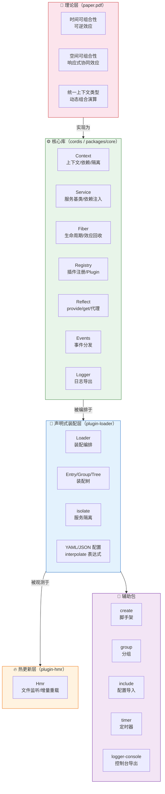

# Cordis 时空可组合性框架 — 概述

> 一句话摘要：本教程系统讲解 Cordis —— 一个处于活跃开发期的 TypeScript「时空可组合性（Spatiotemporal Composability）元框架」，以及支撑它的学术论文《A Programming Paradigm for Spatiotemporal Composability》。教程覆盖背景理论、monorepo 文件结构、核心抽象（Context/Service/Fiber/Registry）、可逆效应与响应式协同效应机制、插件系统、生命周期、声明式加载器、热更新、辅助包与使用示例。

---

## 1. 教程介绍

Cordis 是一个用 TypeScript 编写的**元框架**（Meta-Framework），其官方定位是「A Meta-Framework of Spatiotemporal Composability」（时空可组合性元框架）。它试图回答一个现代软件系统普遍面临的问题：**如何让组件在运行时被动态地加载与卸载，并且在卸载时干净地恢复环境、在运行时自动维护组件之间的依赖关系？**

Cordis 的核心思想来自与它同名的学术论文《A Programming Paradigm for Spatiotemporal Composability》（即本教程一并讲解的 `paper.pdf`）。论文把「动态组合」分解为两个正交的维度：

- **时间可组合性（Temporal Composability）**：组件被移除时，能够**完全回退**其对共享环境产生的副作用；
- **空间可组合性（Spatial Composability）**：组件之间能够**声明式地、响应式地**管理相互依赖。

为了形式化地支撑这两个维度，论文把经典的**效应（effect）**与**协同效应（coeffect）**概念「抬升」为运行时机制：

- **可逆效应（Revertible Effects）**：每一次上下文变换都携带一个「逆」，由运行时追踪，从而在组件卸载时结构性地恢复环境；
- **响应式协同效应（Reactive Coeffects）**：每个组件声明它所需的协同效应作为规范，当上下文发生变化时，运行时依据该规范通知组件「激活 / 停用 / 中性」。

Cordis 框架把这些理论落为可实际运行的代码：它提供了一个核心库（`@cordisjs/core`，即本仓库的 `packages/core`，对外包名为 `cordis`），实现效应追踪（effect tracking）与协同效应解析（coeffect resolution），并额外提供声明式组件加载器（loader）、配置合并与热更新（hmr）等工程化能力。

> ⚠️ **重要提醒**：Cordis 目前处于**活跃开发阶段（under active development），API 尚未稳定，可能随时变更**。本教程所有代码片段与文件结构均基于本仓库学习时的快照，不应视为长期稳定的契约。

### 本教程覆盖的学习对象

本教程基于两个目录的完整内容编写：

| 目录 | 性质 | 内容 |
|------|------|------|
| `d:\AI\.chaos\temp\cordis` | 源码 monorepo | Cordis 框架本身，含 core、loader、hmr、create、group、include、logger-console、timer、utils 等包 |
| `d:\AI\.chaos\temp\paper` | 学术论文 | `README.md`（摘要）+ `paper.pdf`（论文全文，约 88 页含参考文献） |

---

## 2. 目标受众

| 角色 | 典型需求 | 建议阅读路径 |
|------|---------|-------------|
| **插件系统/框架开发者** | 理解如何构建可动态插拔的插件框架，学习 Cordis 的可逆副作用机制 | 全部章节 |
| **TypeScript/Node.js 开发者** | 上手 Cordis 编写插件、理解生命周期与依赖注入 | 01→03→05→06→10 |
| **编程语言/理论研究者** | 理解时空可组合性、效应/协同效应的运行时化 | 01→04 |
| **工程化实践者** | 学习声明式装配、配置合并、热更新如何实现 | 02→07→08 |
| **架构师** | 评估 Cordis 这类「元框架」对动态系统的适用性 | 00→01→03→11 |

---

## 3. 核心术语表

本教程涉及以下核心术语，首次出现时会提供一句话解释，此处给出完整术语表供快速查阅：

| 术语 | 一句话解释 |
|------|-----------|
| **时空可组合性（Spatiotemporal Composability）** | 一个组件既能被动态装配（空间），又能在卸载时干净回退副作用（时间）的复合性质 |
| **时间可组合性（Temporal Composability）** | 组件在运行时被卸载后，共享环境能被恢复到组合之前状态的能力 |
| **空间可组合性（Spatial Composability）** | 组件之间的依赖能被声明式表达、并由运行时响应式维护的能力 |
| **效应（Effect）** | 计算对其环境产生的副作用（修改环境） |
| **协同效应（Coeffect）** | 计算对其环境的需求（依赖环境提供的资源、权限、服务），是 effect 的对偶概念 |
| **可逆效应（Revertible Effect）** | 一次上下文变换，附带一个能撤销该变换的逆函数，由运行时跟踪与组合 |
| **响应式协同效应（Reactive Coeffect）** | 组件声明的依赖规范；上下文每次变化时，运行时据此通知组件激活/停用/中性 |
| **上下文类型（Context Type）** | 把 effect 上下文与 coeffect 上下文统一为一个运行时可直接操作的一等类型 |
| **上下文（Context）** | Cordis 中的核心一等对象，承载依赖（服务）、效应追踪与事件，通过 Proxy 与原型链实现继承 |
| **组件/插件（Plugin）** | Cordis 中的可装配单元，可为函数、构造函数或带 `apply` 方法的对象 |
| **服务（Service）** | 可通过依赖注入提供与获取的能力单元，如 `events`、`logger`、`registry`、`reflect` |
| **纤维（Fiber）** | 单个插件的运行时实例，携带配置、生命周期状态机与效应回收列表 |
| **注册表（Registry）** | 管理插件运行时（Plugin.Runtime）与插件注册的核心服务 |
| **反射（Reflect）** | 通过 Proxy 拦截属性读写、实现 `provide`/`get`（服务注入）与访问器的核心服务 |
| **逆函数（Inverse）** | 逆向变换；可逆效应中用于撤销正向变换的函数 |
| **激活/停用/中性（activating/deactivating/neutral）** | 上下文变化对组件依赖的三种通知结果 |
| **元框架（Meta-Framework）** | 用于构建其他框架/插件系统的框架，本身不绑定特定业务领域 |
| **声明式加载器（Declarative Loader）** | 通过配置（YAML/JSON）声明组件装配关系，而非用代码显式装配 |
| **配置合并（Configuration Reconciliation）** | 当配置文件变更时，加载器计算差异并增量地复用/更新/卸载组件 |
| **热更新（Hot Module Replacement / HMR）** | 代码文件变更后，在进程不被整体重启的情况下重新加载被影响插件的能力 |
| **隔离（Isolate）** | 为同名服务在不同组件间建立作用域隔离的机制，用 symbol 标识不同的服务实现 |
| **拦截（Intercept）** | 在子上下文上覆盖某个服务的配置，实现依赖注入的配置参数化 |
| **单子（Monad）** | 范畴论中封装「效应式计算」的结构，论文用其形式化 effect |
| **余单子（Comonad）** | 单子的对偶，封装「上下文依赖式计算」，论文用其形式化 coeffect |

---

## 4. 章节导航

| 章节 | 标题 | 内容概要 | 难度 |
|------|------|---------|------|
| 00 | [概述](/index.md)（当前页） | 教程介绍、术语表、章节导航、阅读路径、项目信息 | ⭐ |
| 01 | [背景理论与论文](/references/01-background-paper.md) | 动态可组合性两大维度、可逆效应/响应式协同效应、统一上下文、论文贡献 | ⭐⭐⭐ |
| 02 | [文件结构与 Monorepo](/concepts/02-repo-structure.md) | monorepo 工作区、10 个包职责、根配置文件解析 | ⭐⭐ |
| 03 | [核心抽象与架构](/concepts/03-core-architecture.md) | Context/Service/Fiber/Registry/Events/Reflect/Logger 职责与关系 | ⭐⭐⭐ |
| 04 | [效应与协同效应机制](/concepts/04-effects-coeffects.md) | 可逆效应（disposable）、依赖注入、符号体系、traceable | ⭐⭐⭐⭐ |
| 05 | [插件系统与依赖注入](/concepts/05-plugin-system.md) | Plugin 三种形态、@Inject、Service、provide/get | ⭐⭐⭐ |
| 06 | [生命周期与状态机](/concepts/06-lifecycle.md) | Fiber 状态机、effect 逆向回收、epoch 响应式、reload/unload | ⭐⭐⭐⭐ |
| 07 | [声明式加载与配置合并](/concepts/07-loader-config.md) | Loader/Entry/Group/Tree、isolate、YAML 配置、JS 表达式 | ⭐⭐⭐ |
| 08 | [热更新 HMR](/concepts/08-hmr.md) | 文件监听、accepted/declined 分类、缓存清理与回滚 | ⭐⭐⭐⭐ |
| 09 | [辅助包](/references/09-aux-packages.md) | create/group/include/logger-console/timer/utils 作用与用法 | ⭐⭐ |
| 10 | [使用示例](/examples/10-usage-examples.md) | 最小插件、依赖注入、可逆副作用、装配的代码示例与架构图 | ⭐⭐⭐ |
| 11 | [FAQ 与注意事项](/references/11-faq-notes.md) | API 未稳定、异步效应、注入语义、HMR 前置条件等 | ⭐⭐ |
| 12 | [总结与资源](/references/12-summary-resources.md) | 核心知识点回顾、速查表、理论渊源与资源链接 | ⭐ |

---

## 5. 核心架构鸟瞰



> **架构解读**：论文层定义了两大正交维度与统一上下文的理论，核心库 `cordis` 用 `Context/Fiber/Registry/Reflect` 等抽象把「可逆效应 + 响应式协同效应」落地为可运行的机制；`plugin-loader` 在其上构建声明式装配与配置合并；`plugin-hmr` 再叠加热更新；其余辅助包（create/group/include/timer/logger-console）是可选的能力扩展。核心库不依赖 loader，loader 不依赖 hmr，三者形成清晰的分层依赖。

---

## 6. 阅读路径建议

### 🟢 快速上手路径

```
01-background-paper → 03-core-architecture → 05-plugin-system → 10-usage-examples
```

完成此路径后，你将能理解 Cordis 的设计动机，并参照示例编写、装配一个最小插件。

### 🔵 框架开发者路径（深入机制）

```
03-core-architecture → 04-effects-coeffects → 06-lifecycle → 07-loader-config
```

完成此路径后，你将理解 Cordis 的效应回收、依赖注入、生命周期与声明式装配的底层实现。

### 🟣 理论研究者路径

```
01-background-paper → 04-effects-coeffects → 03-core-architecture
```

完成此路径后，你将从论文理论一路对照到源码实现，理解「效应/协同效应运行时化」的完整链条。

### 🟠 工程化实践者路径

```
02-repo-structure → 07-loader-config → 08-hmr → 09-aux-packages
```

完成此路径后，你将理解 Cordis 的工程化支撑（monorepo、装配、热更新、脚手架）。

---

## 7. 前置知识

开始学习本教程前，建议具备以下基础知识：

- **TypeScript / JavaScript 基础**：类、装饰器、模块系统、生成器与异步迭代
- **Node.js 基础**：ESM 模块解析、`node:module`、`--expose-internals` 调试口（第 8 章 HMR 会涉及）
- **依赖注入 / 控制反转**：对 IoC 容器、`provide/inject` 的基本概念有了解即可
- **函数式编程概念**：对 effect/coeffect、monad/comonad 术语（第 1 章）有一定了解有助于理解理论部分

效应/协同效应的范畴论细节只出现在第 1 章与第 4 章的背景部分，工程实现章节（第 2、3、5、6、7、8、9 章）无需范畴论知识。

---

## 8. 项目信息

| 属性 | 值 |
|------|-----|
| **框架名称** | Cordis（A Meta-Framework of Spatiotemporal Composability） |
| **论文** | [A Programming Paradigm for Spatiotemporal Composability](https://github.com/cordiverse/paper) |
| **文档** | cordis-primer |
| **许可证** | MIT（见根 `package.json` 的 `license` 字段） |
| **包管理器** | yarn@4.14.1 |
| **Monorepo 方案** | yarn workspaces（`external/*` 与 `packages/*`） |
| **开发语言** | TypeScript（严格模式，见 `tsconfig.base.json`） |
| **构建工具** | yakumo（esbuild + tsc） |
| **测试框架** | vitest（`@vitest/coverage-v8`） |
| **代码规范** | eslint（`@cordisjs/eslint-config`） |
| **核心包** | `cordis`（即 `packages/core`） |
| **状态** | 活跃开发中，API 尚未稳定 |

---

- [下一章：背景理论与论文](/references/01-background-paper.md) →

```{toctree}
:maxdepth: 2

concepts/index
examples/index
references/index
log
```