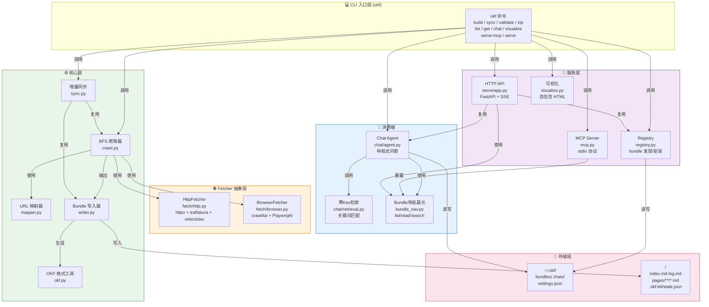

# okf-kit 完全指南 — 概述

> 一句话摘要：本教程系统讲解 okf-kit（v0.3.3）的安装、命令体系、OKF 格式规范、核心架构、增量同步、Chat 对话、MCP 服务、HTTP API、Registry 机制与扩展开发，帮助开发者将任意网站转换为 AI Agent 可直接读取的可移植知识包，且核心爬取路径无需任何 API Key。

---

## 1. 教程介绍

okf-kit 是一个 Python 工具，能够将任意网站爬取并转换为符合 [Google Open Knowledge Format (OKF) v0.1](https://github.com/GoogleCloudPlatform/knowledge-catalog/blob/main/okf/SPEC.md) 规范的可移植知识包（bundle）。知识包本质上是一个目录，包含带有 YAML frontmatter 的 Markdown 概念文件和每个目录的 `index.md` 列表文件——任何 AI Agent 只需通过普通文件读取即可导航和获取知识，无需爬取、无需 SDK、无需运行时服务。

okf-kit 的核心设计理念是**"零 Key 启动、渐进式增强"**：

- **零 API Key**：`okf build` 爬取、格式化、验证全流程无需任何 LLM API Key
- **增量同步**：`okf sync` 基于内容 hash 只更新变更页面，git diff 干净稳定
- **离线对话**：`okf chat` 支持 Ollama 完全离线对话；无 Key 时回退到关键词检索
- **Agent 原生**：通过目录索引实现渐进式导航，Agent 可像人类浏览文件系统一样查找信息
- **生态集成**：支持 MCP（Claude Code/Cursor）、本地 HTTP API（GUI 桌面端）、Registry（bundle 发布发现）

okf-kit 是 [calknowledge](https://github.com/vinodborole/calknowledge) 生态的轻量开源核心库；calknowledge 是建立在 okf-kit 之上的完整平台，提供 LLM 富化、RAG 导出、检索评估和 GUI 界面。

### 为什么需要 okf-kit？

当前 AI Agent 获取网站知识存在三个核心痛点：

| 痛点 | 说明 |
|------|------|
| **重复爬取** | 每个人都在私下重复爬取和索引相同的文档站点，质量参差且浪费资源 |
| **Agent 无法直接读网站** | Agent 需要专门的爬虫工具或 SDK 才能处理网页，而 Markdown 文件可直接读取 |
| **索引过期** | 传统向量数据库构建的索引无法增量更新，容易过时且难以版本控制 |

okf-kit 的解决思路是：将网站知识转化为**可移植的文件制品（portable artifact）**——一个可以 git 提交、zip 分享、离线使用的目录，任何 Agent 拿到就能用。

### 与其他方案的对比

| 对比维度 | okf-kit | Firecrawl | LangChain DocLoader | 传统 RAG 管线 |
|---------|---------|-----------|---------------------|--------------|
| 输出格式 | OKF Markdown bundle | Markdown/JSON | 内存对象 | 向量数据库 |
| 需要 API Key | ❌ 不需要 | ✅ 需要（云服务） | ❌ 不需要 | ❌ 不需要 |
| 增量同步 | ✅ 内容 hash | ❌ 全量重爬 | ❌ 全量重爬 | ❌ 通常全量重建 |
| Agent 导航 | ✅ 目录索引原生支持 | ❌ 需额外处理 | ❌ 需额外处理 | ❌ 依赖向量检索 |
| 离线使用 | ✅ 完全离线 | ❌ 依赖云服务 | ✅ | ⚠️ 需本地模型 |
| MCP 支持 | ✅ 内置 | ❌ | ❌ | ❌ |
| 安装体积 | 小（核心无浏览器无LLM SDK） | 大（Playwright） | 大（全依赖链） | 中 |

---

## 2. 目标受众

| 角色 | 典型需求 | 建议阅读深度 |
|------|---------|-------------|
| **AI 应用开发者** | 将文档站点转换为 Agent 知识库，构建本地 RAG 系统 | 第 0-4 章 + 第 6 章 |
| **Claude Code / Cursor 用户** | 通过 MCP 让编程助手读取最新文档 | 第 0-2 章 + 第 7 章 |
| **Python 工具开发者** | 学习 okf-kit 架构，进行二次开发或集成 | 全部章节 |
| **知识工程实践者** | 理解 OKF 格式，构建可移植知识包 | 第 0-4 章 + 第 8 章 |
| **离线/私有部署用户** | 零 Key 构建本地知识库，Ollama 离线对话 | 第 0-3 章 + 第 6 章 |

---

## 3. 核心术语表

本教程涉及以下核心术语，首次出现时会提供一句话解释，此处给出完整术语表供快速查阅：

| 术语 | 一句话解释 |
|------|-----------|
| **OKF (Open Knowledge Format)** | Google 提出的开放知识格式规范，用 Markdown + YAML frontmatter 表示知识，核心要求是每个非保留文件必须有 `type` 字段 |
| **Bundle（知识包）** | okf-kit 的输出产物，一个包含 Markdown 概念文件、目录索引、状态文件的目录 |
| **Concept（概念）** | Bundle 中的单个 Markdown 文件，对应网站的一个页面，frontmatter 包含 type/title/description/resource 等元数据 |
| **Frontmatter** | Markdown 文件开头 `---` 包裹的 YAML 元数据块，存储页面的结构化信息 |
| **BFS（Breadth-First Search）** | 广度优先搜索爬取策略，okf-kit 按层级逐层爬取同域页面 |
| **Path Prefix（路径前缀）** | 爬取范围限制，默认自动限定在 seed URL 所在路径段下，防止爬虫漫游到整站 |
| **Fetcher（抓取器）** | 页面获取抽象层，有 HttpFetcher（静态/服务端渲染站点）和 BrowserFetcher（JS 渲染站点）两种实现 |
| **Content Hash（内容哈希）** | 页面 Markdown 内容的 SHA-256 哈希值，用于增量同步时判断页面是否变更 |
| **Incremental Sync（增量同步）** | `okf sync` 基于内容 hash 只更新新增/变更/删除的页面，不变的页面保持字节级一致 |
| **Directory Index（目录索引）** | 每个目录下的 `index.md` 文件，列出该目录的子目录和文件，供 Agent 渐进式导航 |
| **Progressive Disclosure（渐进式展开）** | Agent 从根索引开始，逐层 descend 到最具体概念的导航策略 |
| **Provider（模型提供商）** | Chat 功能的 LLM 后端抽象，支持 OpenAI/Ollama/OpenRouter/Anthropic/Custom 等 |
| **Zero-key Retrieval（零 Key 检索）** | 未配置 LLM Provider 时的回退模式，通过关键词搜索返回最相关概念及引用段落 |
| **MCP（Model Context Protocol）** | Anthropic 提出的模型上下文协议，okf-kit 通过 stdio MCP 向 Claude Code/Cursor 暴露 bundle 读取工具 |
| **Registry（注册表）** | 已发布 OKF bundle 的索引目录（registry.yaml），用户可通过 `okf get` 下载社区发布的 bundle |
| **Reserved Names（保留文件名）** | Bundle 中不可用作概念文件名的名称：`index.md`（目录列表）和 `log.md`（构建日志） |
| **State File（状态文件）** | `.okf-kit/state.json`，存储爬取配置、每页内容 hash、链接边等元数据，用于增量同步 |

---

## 4. 章节导航

| 章节 | 标题 | 内容概要 | 难度 |
|------|------|---------|------|
| 00 | [概述](00-overview.md)（当前页） | 教程介绍、核心特性、术语表、章节导航、阅读路径 | ⭐ |
| 01 | [安装与配置](01-installation.md) | pip/uvx 安装、6 个可选依赖、虚拟环境建议、~/.okf/ 目录结构 | ⭐ |
| 02 | [CLI 命令参考](02-cli-reference.md) | 11 个子命令完整参考、参数说明、使用示例 | ⭐⭐ |
| 03 | [OKF 格式与 Bundle 结构](03-okf-format.md) | OKF v0.1 规范、目录结构、frontmatter 字段、state.json 详解 | ⭐⭐ |
| 04 | [核心架构](04-core-architecture.md) | 模块架构图、BFS 爬取算法、URL 映射、Fetcher 抽象、Writer 流程 | ⭐⭐⭐ |
| 05 | [增量同步机制](05-sync-mechanism.md) | content hash 原理、delta 检测、安全阈值、post_sync 钩子 | ⭐⭐⭐ |
| 06 | [Chat 对话系统](06-chat-system.md) | Agent 导航循环、Provider 抽象、零 Key 回退、对话历史、trace 模式 | ⭐⭐⭐ |
| 07 | [MCP 与 HTTP 服务](07-mcp-serve.md) | stdio MCP 服务器、4 个 MCP 工具、FastAPI HTTP API、Docker 部署 | ⭐⭐⭐ |
| 08 | [Registry 与可视化](08-registry-visualize.md) | awesome-okf-kit 注册表、bundle 发布安装、graph.html 知识图谱 | ⭐⭐ |
| 09 | [扩展与开发](09-extension-development.md) | 源码结构、开发环境、测试、自定义 Fetcher、calknowledge 生态 | ⭐⭐⭐ |
| 10 | [FAQ 与排错](10-faq-troubleshooting.md) | JS 站点识别、robots.txt、Provider 错误、模型不存在、Bundle 验证失败 | ⭐⭐ |
| 11 | [总结与资源](11-summary-resources.md) | 核心知识点回顾、命令速查表、生态链接、相关项目对比 | ⭐ |

---

## 5. 功能架构



> **架构解读**：okf-kit 采用分层架构。CLI 层解析命令后调用核心层功能；核心层的 Crawl 使用可插拔的 Fetcher 获取页面，通过 Writer 写入 OKF 格式的 Bundle；消费端（Chat/MCP/HTTP）通过 BundleNav 基元读取 Bundle 内容；Registry 负责 bundle 的发布发现；所有用户数据存储在 `~/.okf/` 目录下。核心设计特点是：核心路径（build/sync/read）不依赖任何 LLM SDK，Chat 和 Serve 是可选的增强层。

---

## 6. 核心特性一览

### 6.1 零 Key 可用

okf-kit 的核心爬取路径（build → validate → zip）完全不需要任何 API Key 或云服务：

```bash
pip install okf-kit                          # 无浏览器无LLM SDK，安装秒级完成
okf build https://docs.example.com -o docs   # 直接爬取，无需Key
```

Markdown 提取使用 trafilatura + selectolax 完成，纯本地计算。

### 6.2 忠实的 Markdown 输出

与简单的 HTML→text 转换不同，okf-kit 保留标题层级、代码块、表格、格式标记和内链：

- 使用 trafilatura 提取正文（过滤导航栏/页眉/页脚/广告等样板内容）
- selectolax 解析标题、meta description 和链接
- 内容链接（content_links）专门从 `<main>`/`<article>` 区域提取，排除导航区链接
- 短页面自动检测 JS 渲染需求并提示安装 `[js]` 扩展

### 6.3 增量同步

```bash
okf sync docs-okf   # 只更新变更页面
```

Sync 基于每页 Markdown 内容的 SHA-256 hash 判断变更：
- **Added**：新页面 → 写入
- **Changed**：hash 不同 → 重写（带新时间戳）
- **Removed**：网站已删除 → 删除概念文件
- **Unchanged**：hash 相同 → 字节级保持不变（git diff 稳定）

安全阈值保护：如果重新爬取的页面数不足原来的 50%（且原 bundle >4 页），sync 会中止，防止网络故障导致误删。

### 6.4 Agent 友好的导航

每个目录都有 `index.md` 列出其子目录和文件：

```markdown
# /pages/docs — directory listing

- [guide/](/pages/docs/guide/index.md)
- [intro](/pages/docs/intro.md)
- [faq](/pages/docs/faq.md)
```

这使得 Agent 可以从根索引开始，像人类浏览文件系统一样逐级 descend 到最相关的概念，而无需猜测 URL 路径。

### 6.5 多种对话模式

| 模式 | 命令 | 需要 Key | 说明 |
|------|------|---------|------|
| **零 Key 检索** | `okf chat docs-okf` | ❌ | 关键词搜索返回相关段落 |
| **离线 LLM** | `okf chat docs-okf --provider ollama` | ❌ | 本地 Ollama，完全离线 |
| **云端 LLM** | `okf chat docs-okf --provider openai` | ✅ | GPT-4o-mini 等 |
| **Claude** | `okf chat docs-okf --provider anthropic` | ✅ | Claude Sonnet 等 |

### 6.6 MCP 原生支持

```bash
okf serve-mcp docs-okf
```

一句话启动 stdio MCP 服务器，向 Claude Code/Claude Desktop/Cursor 暴露 4 个工具：
- `list_bundles`：列出可用 bundle
- `list_directory`：列出 bundle 内目录
- `read_concept`：读取概念文件
- `search_bundle`：关键词搜索

### 6.7 本地 HTTP API

```bash
okf serve    # 启动 loopback-only HTTP API
```

提供 REST API 和 SSE 流式输出，供桌面 GUI（如 [okf-desktop](https://github.com/vinodborole/okf-desktop)）使用。API Key 存储在 OS keychain 中。

---

## 7. 阅读路径建议

根据你的角色和目标，选择以下阅读路径：

### 🟢 初学者路径（快速上手）

```
01-installation → 02-cli-reference → 03-okf-format
```

1. 从 [安装与配置](01-installation.md) 开始，完成环境搭建
2. 浏览 [CLI 命令参考](02-cli-reference.md)，了解命令体系
3. 通过 [OKF 格式与 Bundle 结构](03-okf-format.md) 理解输出格式

> 完成此路径后，你将能够爬取网站生成 OKF bundle，并理解 bundle 的目录结构。

### 🔵 Agent 集成路径（Claude Code/Cursor）

```
00 → 01 → 02 → 07-mcp-serve
```

1. 理解 okf-kit 的核心定位（本文）
2. 完成安装
3. 掌握 build/sync/chat 基本命令
4. 学习 [MCP 与 HTTP 服务](07-mcp-serve.md)，配置 MCP 让编程助手读取文档

> 完成此路径后，你将能让 Claude Code 或 Cursor 直接读取任何文档网站的最新内容。

### 🟣 深度理解路径（架构学习/二次开发）

```
00 → 03 → 04-core-architecture → 05-sync-mechanism → 06-chat-system → 09-extension-development
```

1. 掌握 OKF 格式规范
2. 深入理解 [核心架构](04-core-architecture.md)（BFS 爬取、Fetcher 抽象、Writer 流程）
3. 学习 [增量同步机制](05-sync-mechanism.md)
4. 理解 [Chat 对话系统](06-chat-system.md) 的 Agent 导航策略
5. 阅读 [扩展与开发](09-extension-development.md) 了解源码结构

> 完成此路径后，你将能够对 okf-kit 进行二次开发或自定义扩展。

### 🟠 离线知识库路径（RAG 构建）

```
01 → 02 (build/sync/chat) → 06-chat-system → 08-registry-visualize
```

1. 安装并配置 Ollama 本地模型
2. 使用 build 构建知识库，sync 保持更新
3. 使用 chat + Ollama 进行离线问答
4. 使用 visualize 生成知识图谱浏览

---

## 8. 快速开始（30 秒体验）

```bash
# 1. 安装（核心版本，无浏览器无LLM）
pip install okf-kit

# 2. 爬取一个文档站点
okf build https://docs.ros.org/en/humble/Tutorials.html -o ros2-docs --max-depth 2 --max-pages 50

# 3. 查看生成的 bundle
ls ros2-docs/
cat ros2-docs/index.md

# 4. 零Key检索问答（无需任何API Key）
okf chat ros2-docs
# you> 如何创建一个ROS2工作空间？

# 5. 验证 bundle 符合 OKF 规范
okf validate ros2-docs
```

---

## 9. 前置知识

开始学习本教程前，建议具备以下基础知识：

- **Python 基础**：包管理（pip）、虚拟环境、命令行操作
- **命令行使用**：终端基本操作、环境变量设置
- **Markdown 格式**：标题、列表、代码块、链接、frontmatter 概念
- **HTTP 基础**：URL 结构、GET 请求、Content-Type（了解即可）

LLM/Agent/RAG 相关概念不是必需的，教程中会解释 OKF 相关术语。如果你对 MCP 不熟悉，第 7 章会提供足够的背景知识。

---

## 10. 项目信息

| 属性 | 值 |
|------|-----|
| **项目仓库** | [github.com/vinodborole/okf-kit](https://github.com/vinodborole/okf-kit) |
| **PyPI 包名** | `okf-kit` |
| **当前版本** | v0.3.3（截至 2026-08） |
| **OKF 规范版本** | v0.1 |
| **开发语言** | Python ≥ 3.10 |
| **许可证** | Apache-2.0 |
| **CLI 入口** | `okf` |
| **核心依赖** | httpx, trafilatura, selectolax, pyyaml, lxml-html-clean |
| **用户目录** | `~/.okf/`（bundles/chats/settings） |
| **Bundle 状态目录** | `<bundle>/.okf-kit/state.json` |
| **生态项目** | calknowledge（完整平台）、okf-desktop（桌面GUI）、awesome-okf-kit（Registry） |

---

- [下一章：安装与配置](01-installation.md) →
