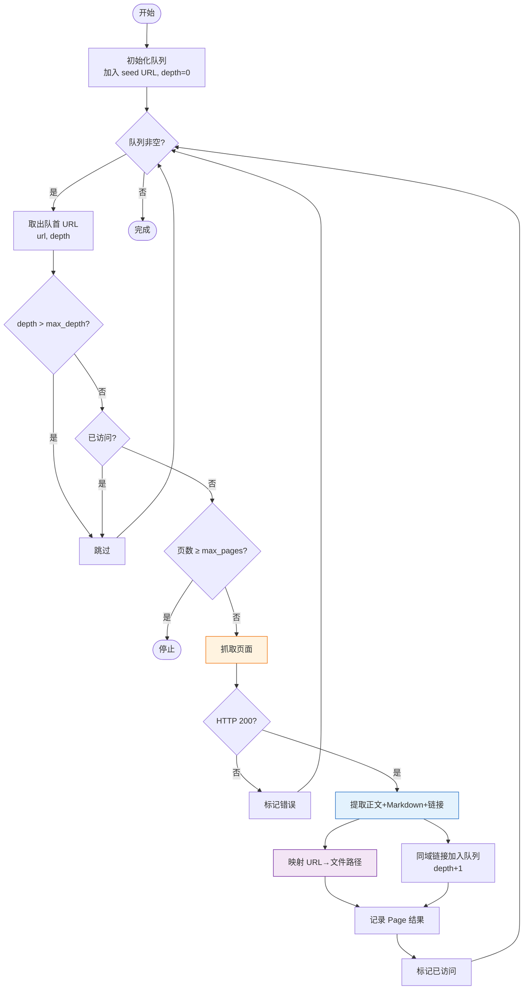
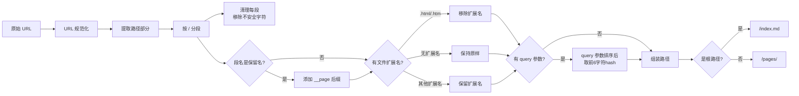

# okf-kit 完全指南 — 核心架构

> 一句话摘要：okf-kit 核心由四个模块组成——crawl.py 实现 BFS 广度优先爬取控制流程，mapper.py 负责 URL 到文件路径的确定性映射，fetch/ 目录提供可插拔的 Fetcher 抽象层（HttpFetcher/BrowserFetcher），writer.py 负责将爬取结果写入 OKF 格式的 bundle 并生成目录索引。

---

## 1. 模块架构总览

```mermaid
graph TB
    CLI["cli.py<br/>命令解析"] -->|"调用"| Crawl
    CLI -->|"调用"| Sync
    CLI -->|"调用"| Chat
    CLI -->|"调用"| MCP

    subgraph Core["核心模块"]
        Crawl["crawl.py<br/>BFS 爬取控制"]
        Mapper["mapper.py<br/>URL→路径映射"]
        Writer["writer.py<br/>Bundle 写入"]
        OKF["okf.py<br/>格式验证/打包"]
        Sync["sync.py<br/>增量同步"]
    end

    subgraph Fetch["Fetcher 抽象层"]
        FetcherBase["Fetcher (ABC)<br/>fetch() / close()"]
        HttpF["HttpFetcher<br/>httpx + trafilatura"]
        BrowserF["BrowserFetcher<br/>crawl4ai + Playwright"]
    end

    Crawl -->|"使用"| Mapper
    Crawl -->|"使用"| FetcherBase
    Crawl -->|"输出到"| Writer
    Sync -->|"复用"| Crawl
    Sync -->|"复用"| Writer
    Writer -->|"调用"| OKF

    FetcherBase <|-- HttpF
    FetcherBase <|-- BrowserF

    style Core fill:#e8f5e9,stroke:#2e7d32
    style Fetch fill:#fff3e0,stroke:#ef6c00
```

### 源码文件清单

| 文件 | 职责 | 代码量（约） | 外部依赖 |
|------|------|------------|---------|
| `cli.py` | argparse 命令定义和参数解析 | ~200 行 | argparse（标准库） |
| `crawl.py` | BFS 爬取主循环、URL 队列管理 | ~250 行 | asyncio, httpx |
| `mapper.py` | URL→相对路径映射、规范化 | ~200 行 | hashlib, re, urllib |
| `writer.py` | Markdown 写入、index.md 生成、state 持久化 | ~300 行 | pyyaml |
| `okf.py` | frontmatter 解析、validate、zip | ~200 行 | pyyaml, zipfile |
| `model.py` | Page/PageRecord 数据模型 | ~50 行 | dataclasses |
| `config.py` | ~/.okf/ 路径管理 | ~50 行 | pathlib, os |
| `sync.py` | 增量同步主逻辑 | ~200 行 | （复用 crawl/writer） |
| `fetch/http.py` | HttpFetcher 实现 | ~150 行 | httpx, trafilatura, selectolax |
| `fetch/browser.py` | BrowserFetcher 实现 | ~100 行 | crawl4ai |

---

## 2. BFS 爬取算法（crawl.py）

### 2.1 算法概述

crawl.py 实现标准的广度优先搜索（BFS）爬取，从 seed URL 开始逐层扩展。

### 2.2 核心数据结构

```python
# 伪代码表示核心数据结构
queue = deque()           # BFS 队列，元素为 (url, depth)
visited = set()           # 已访问 URL 集合
pages = []                # 爬取结果列表（Page 对象）
url_to_path = {}          # URL → 相对路径映射
links = defaultdict(list) # 页面间链接关系（邻接表）
```

### 2.3 算法流程



### 2.4 爬取约束条件

URL 加入队列前需满足以下条件：

| 约束 | 说明 | 默认值 |
|------|------|--------|
| **同域（same origin）** | URL 的 scheme+host+port 必须与 seed URL 一致 | 始终启用 |
| **路径前缀（path prefix）** | URL 路径必须以 seed URL 的路径段开头 | 自动从 seed 推导 |
| **深度限制** | 从 seed 开始的 BFS 深度不超过 max_depth | 3 |
| **页面数量** | 总爬取页面数不超过 max_pages | 200 |
| **去重** | 规范化后的 URL 未被访问过 | 始终启用 |

### 2.5 URL 规范化

在加入队列前，URL 经过规范化处理避免重复：

```python
def normalize_url(url: str) -> str:
    """规范化 URL 以去重"""
    parsed = urlparse(url)
    # 移除 fragment
    parsed = parsed._replace(fragment="")
    # 移除默认端口
    # 小写 host
    # 处理尾部斜杠：/path 和 /path/ 视为不同页面（前者是文件，后者是目录）
    # 排序 query 参数
    return urlunparse(parsed)
```

### 2.6 自动 Path Prefix 推导

如果用户未显式指定 `--path-prefix`，crawl.py 自动从 seed URL 推导：

| seed URL 路径 | 自动推导 prefix | 爬取范围 |
|--------------|----------------|---------|
| `https://docs.example.com/` | `/` | 整个域名 |
| `https://docs.example.com/docs/` | `/docs/` | /docs/ 下的所有页面 |
| `https://docs.example.com/api/reference` | `/api/` | /api/ 下的所有页面（向上取最近的目录级） |

使用 `--all-paths` 可以禁用前缀限制，爬取同域所有路径。

### 2.7 异步并发

爬取使用 asyncio + 信号量控制并发：

```python
semaphore = asyncio.Semaphore(concurrent)  # 默认8并发

async def bounded_fetch(url):
    async with semaphore:
        return await fetcher.fetch(url)
```

### 2.8 短页面 JS 检测

如果页面正文长度 < 300 字符且未使用 `--js`，crawl.py 会输出警告提示可能需要 JS 渲染：

```
⚠️  Page has very short content (42 chars). If this is a JS-rendered site,
    re-run with --js (requires: pip install 'okf-kit[js]')
```

---

## 3. URL 映射器（mapper.py）

### 3.1 设计目标

mapper.py 提供确定性的 URL→文件路径映射，满足三个要求：

1. **确定性**：相同 URL 始终映射到相同路径
2. **可读性**：路径尽量反映 URL 结构，人类可理解
3. **无冲突**：不同 URL 不会映射到同一路径

### 3.2 映射流程



### 3.3 核心函数

```python
def url_to_relative_path(url: str, root_url: str) -> str:
    """将 URL 映射为 bundle 内的相对路径"""
    # 1. 解析 URL
    # 2. 提取 path 部分
    # 3. 判断是否目录页（尾部斜杠）或文件页
    # 4. 处理保留名避让
    # 5. 处理 query 参数 hash
    # 6. 添加 pages/ 前缀
    # 7. 添加 .md 扩展名
```

### 3.4 Query 参数处理

含 query 参数的 URL 通过参数哈希生成唯一文件名：

1. 将 query 参数按 key 排序
2. 序列化为 `key1=val1&key2=val2` 格式
3. 计算 SHA-1 hash，取前 6 个十六进制字符
4. 文件名追加 `__<hash>` 后缀

例如：`https://example.com/search?q=python&page=1` → `/pages/search__a1b2c3.md`

---

## 4. Fetcher 抽象层

### 4.1 Fetcher 基类

```python
from abc import ABC, abstractmethod

class Fetcher(ABC):
    """Fetcher 抽象基类"""

    @abstractmethod
    async def fetch(self, url: str) -> FetchResult:
        """获取页面内容，返回 FetchResult"""
        ...

    @abstractmethod
    async def close(self):
        """释放资源"""
        ...

class FetchResult:
    """抓取结果"""
    url: str
    status_code: int
    markdown: str        # 转换后的 Markdown 正文
    title: str           # 页面标题
    description: str     # meta description
    content_links: list[str]  # 正文区域的链接（排除导航区）
    headers: dict        # HTTP 响应头
```

### 4.2 HttpFetcher（fetch/http.py）

**适用场景**：静态站点、服务端渲染（SSR）站点、文档站（如 MkDocs、Docusaurus SSR 模式）

**技术栈**：
- **httpx**：异步 HTTP 客户端
- **trafilatura**：正文提取（自动过滤导航栏、页眉、页脚、广告等样板内容）
- **selectolax**：快速 HTML 解析，提取标题、meta、链接

**核心流程**：

```python
async def fetch(self, url: str) -> FetchResult:
    # 1. httpx 异步 GET 请求
    response = await self.client.get(url, timeout=self.timeout)
    # 2. trafilatura 提取正文 → Markdown
    markdown = trafilatura.extract(
        response.text,
        output_format="markdown",
        include_links=True,
        include_tables=True,
        ...
    )
    # 3. selectolax 解析 HTML 提取标题、description
    tree = HTMLParser(response.text)
    title = tree.css_first("title").text() if tree.css_first("title") else ""
    # 4. 从正文区域提取链接（<main>/<article> 优先）
    content_links = self._extract_content_links(tree)
    return FetchResult(...)
```

**正文链接提取策略**：
- 优先在 `<main>`、`<article>`、`[role="main"]` 区域查找链接
- 如果找不到这些容器，退化到 `<body>` 但排除 `<nav>`、`<header>`、`<footer>`、`<aside>`
- 这确保构建的链接图反映的是内容间关联而非导航链接

### 4.3 BrowserFetcher（fetch/browser.py）

**适用场景**：单页应用（SPA）、JS 渲染站点、客户端渲染文档站

**技术栈**：
- **crawl4ai**：基于 Playwright 的浏览器自动化抓取库
- **Playwright**：Chromium 浏览器控制

**核心流程**：

```python
async def fetch(self, url: str) -> FetchResult:
    # 1. 通过 crawl4ai 启动浏览器页面
    result = await self.crawler.arun(
        url=url,
        process_iframes=False,
        wait_for="domcontentloaded",
        ...
    )
    # 2. crawl4ai 已经完成 JS 执行和 Markdown 转换
    markdown = result.markdown
    # 3. 提取标题和链接
    return FetchResult(...)
```

**特点**：
- 等待页面 JS 执行完成后再提取内容
- 支持懒加载内容滚动
- 安装体积较大（~200MB，含 Playwright 浏览器）
- 速度比 HttpFetcher 慢 3-10 倍

### 4.4 Fetcher 选择策略

| 站点类型 | 选择 | 判断依据 |
|---------|------|---------|
| 传统服务端渲染（PHP/Rails/Django） | HttpFetcher | 默认即可 |
| 静态文档站（MkDocs/Sphinx/Hugo） | HttpFetcher | 默认即可 |
| Docusaurus（SSR模式） | HttpFetcher | 默认即可 |
| React/Vue SPA | BrowserFetcher | 需要 `--js` |
| Next.js/Gatsby（客户端导航） | BrowserFetcher | 需要 `--js` |
| 短页面警告提示 | BrowserFetcher | 正文 <300字时建议尝试 |

---

## 5. Bundle 写入器（writer.py）

### 5.1 职责

writer.py 负责将爬取结果写入磁盘，包括：
1. 将每个页面的 Markdown 内容写入对应文件
2. 为每个目录生成 index.md
3. 写入 log.md 构建日志
4. 生成/更新 .okf-kit/state.json
5. 处理 frontmatter 组装

### 5.2 页面写入流程

```python
def write_page(bundle_dir: Path, rel_path: str, page: PageRecord):
    """写入单个概念页面"""
    # 1. 组装 frontmatter
    fm = {
        "type": "concept",
        "title": page.title,
        "description": page.description,
        "source_url": page.url,
        "crawled_at": page.crawled_at,
        "content_hash": f"sha256:{page.content_hash}",
        "path_depth": page.depth,
    }
    # 2. 序列化为 YAML frontmatter + Markdown 正文
    content = f"---\n{yaml.dump(fm, allow_unicode=True)}---\n\n{page.markdown}\n"
    # 3. 确保父目录存在
    file_path = bundle_dir / rel_path.lstrip("/")
    file_path.parent.mkdir(parents=True, exist_ok=True)
    # 4. 写入文件
    file_path.write_text(content, encoding="utf-8")
```

### 5.3 目录索引生成

所有页面写入完成后，writer.py 为每个目录生成 index.md：

```python
def generate_indexes(bundle_dir: Path, pages: dict[str, PageRecord]):
    """为每个目录生成 index.md"""
    # 1. 按目录分组所有文件
    dir_to_entries = defaultdict(list)
    for rel_path in pages:
        dir_path = str(Path(rel_path).parent)
        dir_to_entries[dir_path].append(Path(rel_path).name)
    # 2. 对每个目录，收集子目录和文件
    for dir_path, entries in dir_to_entries.items():
        subdirs = set()
        files = []
        for entry in entries:
            full = Path(dir_path) / entry
            if full.suffix == ".md" and entry != "index.md":
                files.append(entry)
            # 检查是否为子目录索引
        # 3. 生成 index.md 内容
        index_content = format_index(dir_path, sorted(subdirs), sorted(files))
        # 4. 写入文件
        (bundle_dir / dir_path.lstrip("/") / "index.md").write_text(
            index_content, encoding="utf-8"
        )
```

### 5.4 State 持久化

爬取完成后写入 state.json：

```python
def save_state(bundle_dir: Path, state: BundleState):
    """保存状态文件"""
    state_path = bundle_dir / ".okf-kit" / "state.json"
    state_path.parent.mkdir(parents=True, exist_ok=True)
    state_path.write_text(
        json.dumps(asdict(state), indent=2, ensure_ascii=False),
        encoding="utf-8"
    )
```

---

## 6. 设计模式与设计决策

### 6.1 策略模式（Fetcher）

Fetcher 抽象层使用策略模式，将"如何获取页面"与"如何处理爬取结果"分离。crawl.py 的 BFS 逻辑不关心使用 HTTP 还是浏览器，只依赖 Fetcher 接口。这使得新增抓取方式（如 PDF Fetcher、GitHub API Fetcher）不需要修改 crawl.py。

### 6.2 数据类（Page/PageRecord）

model.py 使用 `@dataclass` 定义不可变数据结构，在模块边界传递数据时保持类型安全。

### 6.3 纯函数映射

mapper.py 的映射函数是纯函数——相同输入始终产生相同输出，无副作用、无 IO。这使得映射逻辑易于测试和推理。

### 6.4 异步并发

核心爬取流程使用 `async/await` + `asyncio.Semaphore` 控制并发度，避免线程安全问题同时获得高并发性能。

### 6.5 错误隔离

单页抓取失败不影响整体爬取。失败的 URL 记录在 log.md 中但不会中断 BFS 队列处理。

### 6.6 零核心依赖 LLM

okf-kit 的核心构建路径（build→validate→zip）不依赖任何 LLM SDK 或云服务。trafilatura 是基于规则和统计的正文提取器，纯本地计算。

---

## 7. 关键代码路径

### 7.1 build 命令调用链

```
cli.build()
  → crawl.crawl_site(seed_url, fetcher, max_depth, max_pages, ...)
    → BFS loop:
        → fetcher.fetch(url)
        → mapper.url_to_relative_path(url, root_url)
        → 收集 links
  → writer.write_bundle(bundle_dir, pages, url_to_path, links, config)
    → for each page: write_page()
    → generate_indexes()
    → write_log()
    → save_state()
  → okf.validate_bundle(bundle_dir)
```

### 7.2 sync 命令调用链

```
cli.sync()
  → load_state() 读取旧 state.json
  → crawl.crawl_site(...) 重新爬取
  → sync.compute_delta(old_pages, new_pages) 对比 hash
    → added: 新 URL
    → changed: hash 不同
    → removed: 旧 URL 不存在
    → unchanged: hash 相同
  → 如果 removed 比例超过阈值，中止
  → writer 只写入 added/changed 页面，删除 removed 页面
  → regenerate_indexes() 更新索引
  → save_state() 保存新 state
```

---

- [← 上一章：OKF 格式与 Bundle 结构](03-okf-format.md) | [下一章：增量同步机制](05-sync-mechanism.md) →
