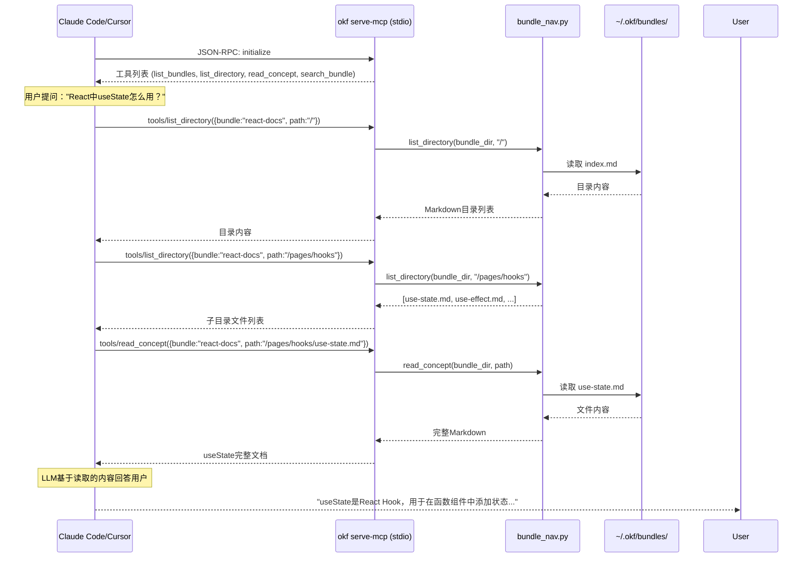

# okf-kit 完全指南 — MCP 与 HTTP 服务

> 一句话摘要：okf-kit 提供两种服务暴露方式——stdio MCP 服务器（`okf serve-mcp`）供 Claude Code/Cursor 等 AI 编辑器直接集成本地 bundle，FastAPI HTTP 服务器（`okf serve`）提供 REST API + SSE 流式输出供桌面 GUI 使用，两种方式都复用 bundle_nav.py 共享导航逻辑。

---

## 1. MCP 服务器（mcp.py）

### 1.1 什么是 MCP？

MCP（Model Context Protocol）是 Anthropic 提出的开放协议，允许 AI 助手通过标准化接口访问外部工具和数据源。okf-kit 实现了 MCP 服务器端，使得 Claude Code、Claude Desktop、Cursor 等支持 MCP 的 AI 客户端可以直接读取 OKF bundle 内容。

MCP 使用 stdio（标准输入/输出）作为传输层，JSON-RPC 2.0 作为消息格式。

### 1.2 启动 MCP 服务器

```bash
# 需要 [mcp] extra
pip install 'okf-kit[mcp]'

# 启动单个 bundle 的 MCP 服务
okf serve-mcp my-docs
```

MCP 服务器启动后通过 stdin/stdout 与客户端通信，不会输出人类可读的日志（所有通信都是 JSON-RPC 消息）。

### 1.3 MCP 工具列表

okf-kit MCP 服务器暴露 4 个工具：

#### list_bundles

列出 `~/.okf/bundles/` 中所有已安装的 bundle。

**参数：** 无

**返回：** bundle 名称和标题列表

#### list_directory

列出指定 bundle 内指定目录的内容（子目录+文件）。

**参数：**
| 参数 | 类型 | 必需 | 说明 |
|------|------|------|------|
| `path` | string | ✅ | 目录路径，从 "/" 开始 |
| `bundle` | string | ✅ | bundle 名称 |

**返回：** Markdown 格式的目录列表

#### read_concept

读取 bundle 中指定概念文件的完整内容。

**参数：**
| 参数 | 类型 | 必需 | 说明 |
|------|------|------|------|
| `path` | string | ✅ | 概念文件相对路径（如 `/pages/guide/intro.md`） |
| `bundle` | string | ✅ | bundle 名称 |

**返回：** 文件的 Markdown 内容（含 title 和 source_url）

#### search_bundle

在 bundle 中执行关键词搜索。

**参数：**
| 参数 | 类型 | 必需 | 默认值 | 说明 |
|------|------|------|--------|------|
| `query` | string | ✅ | | 搜索关键词 |
| `bundle` | string | ✅ | | bundle 名称 |
| `limit` | integer | | 10 | 返回结果数量上限 |

**返回：** 匹配的概念列表，含标题、路径、相关段落片段

### 1.4 配置到 Claude Code

在 Claude Code 中配置 okf-kit MCP：

**方式一：通过 Claude Code CLI**

```bash
claude mcp add okf-react-docs -- okf serve-mcp react-docs
```

**方式二：编辑配置文件**

配置文件位置：
- macOS/Linux: `~/.claude/claude_desktop_config.json` 或 `~/.config/claude/claude_desktop_config.json`
- Windows: `%APPDATA%\Claude\claude_desktop_config.json`

```json
{
  "mcpServers": {
    "okf-react-docs": {
      "command": "okf",
      "args": ["serve-mcp", "react-docs"]
    },
    "okf-ros2-docs": {
      "command": "okf",
      "args": ["serve-mcp", "ros2-docs"]
    }
  }
}
```

可以同时配置多个 bundle，每个 bundle 是一个独立的 MCP server 实例。

### 1.5 配置到 Cursor

在 Cursor 中：

1. 打开 Settings → Features → MCP
2. 添加新的 MCP server
3. 配置：
   - **Name**: `okf-react-docs`
   - **Type**: `command`
   - **Command**: `okf serve-mcp react-docs`

### 1.6 MCP 工作流程



### 1.7 MCP 多 Bundle 支持

每个 `okf serve-mcp <name>` 启动一个独立的 stdio MCP 服务器实例。你可以同时为多个 bundle 配置 MCP server，AI 助手会自动选择合适的 bundle。

---

## 2. HTTP API 服务器（serve/）

### 2.1 概述

`okf serve` 启动一个本地 loopback-only 的 FastAPI 服务器，提供 REST API 和 Server-Sent Events（SSE）流式输出。这主要服务于桌面 GUI 应用（如 okf-desktop），但也可以直接通过 curl 或其他 HTTP 客户端使用。

### 2.2 启动 HTTP 服务

```bash
# 需要 [serve] extra
pip install 'okf-kit[serve]'

# 启动（自动选择端口，自动生成token）
okf serve
```

启动输出：

```json
{"event": "ready", "url": "http://127.0.0.1:52341", "token": "a1b2c3d4e5f6a7b8", "pid": 12345}
```

- `url`：服务地址（仅 127.0.0.1 可访问）
- `token`：Bearer 认证 token（每次启动随机生成）
- `pid`：服务进程 PID

### 2.3 认证机制

所有 `/api/*` 端点都需要 Bearer token 认证：

**方式一：Authorization 头**
```bash
curl -H "Authorization: Bearer a1b2c3d4e5f6a7b8" http://127.0.0.1:52341/api/health
```

**方式二：查询参数**
```bash
curl "http://127.0.0.1:52341/api/health?token=a1b2c3d4e5f6a7b8"
```

token 使用 `hmac.compare_digest` 进行常量时间比较，防止时序攻击。

### 2.4 API 端点详解

#### 系统端点

**GET /api/health** — 健康检查

```json
{"ok": true, "version": "0.3.3", "okf_home": "/home/user/.okf", "api": "0"}
```

**GET /api/status** — Provider 状态

```json
{"provider": "ollama", "model": "llama3.1", "online": true}
```

#### Registry 端点

**GET /api/registry** — 获取可用 bundle 列表（5分钟缓存）

从 awesome-okf-kit 仓库获取 registry.yaml，返回所有可安装的 bundle。

```json
{
  "fetched_at": "2026-08-18T14:30:00Z",
  "entries": [
    {
      "name": "react-docs",
      "title": "React Documentation",
      "source_url": "https://react.dev",
      "publisher": "community",
      "category": "frontend",
      "pages": 120,
      "installed": false
    }
  ]
}
```

#### Books（Bundle）管理端点

**GET /api/books** — 列出已安装 bundle

```json
[
  {
    "name": "react-docs",
    "title": "React Documentation",
    "source_url": "https://react.dev",
    "pages": 120,
    "size_bytes": 2100000,
    "synced_at": "2026-08-15T10:00:00Z",
    "conformant": true,
    "chat_count": 3
  }
]
```

**GET /api/books/{name}** — 获取 bundle 详情

**POST /api/books/{name}/install** — 从 Registry 安装 bundle（SSE 进度）

安装过程通过 SSE 推送进度事件：
```
event: progress
data: {"phase": "downloading"}

event: progress
data: {"phase": "extracting"}

event: progress
data: {"phase": "validating"}

event: done
data: {"book": {...}, "conformant": true}
```

**DELETE /api/books/{name}** — 删除 bundle（同时删除对应聊天历史）

#### 阅读端点

**GET /api/books/{name}/toc** — 获取目录树（递归的 index.md 结构）

**GET /api/books/{name}/concept?id={path}** — 读取概念文件

#### 对话端点

**GET /api/books/{name}/chats** — 列出对话历史

**POST /api/books/{name}/chats** — 创建新对话

```json
{"id": "20260818-143022", "title": "New chat"}
```

**GET /api/books/{name}/chats/{sid}** — 获取对话消息历史

**DELETE /api/books/{name}/chats/{sid}** — 删除对话

**POST /api/books/{name}/chats/{sid}/ask** — 提问（SSE 流式回答）

请求体：
```json
{"question": "如何使用useState？"}
```

SSE 响应流：
```
event: token
data: {"text": "useState 是 React 的核心 Hook，"}

event: token
data: {"text": "用于在函数组件中添加状态..."}

event: sources
data: {"sources": [{"title": "useState", "path": "/pages/hooks/use-state.md", ...}]}

event: done
data: {"message": {...}}
```

#### 设置端点

**GET /api/settings** — 获取公开设置（不返回 API Key 明文）

```json
{"provider": "ollama", "model": "llama3.1", "base_url": null, "has_key": false}
```

**PUT /api/settings** — 保存设置

```json
{
  "provider": "openai",
  "model": "gpt-4o-mini",
  "base_url": null,
  "api_key": "sk-..."
}
```

API Key 通过 keyring 存储，永远不会通过 API 返回明文。

**POST /api/shutdown** — 关闭服务

### 2.5 SSE 流式输出

Chat 回答和 Bundle 安装都使用 Server-Sent Events 实现流式输出：

- `token` 事件：逐段推送回答文本（打字机效果）
- `progress` 事件：安装进度更新
- `sources` 事件：回答引用的来源列表
- `done` 事件：完成信号
- `error` 事件：错误信息

### 2.6 API Key 安全存储（settings.py）

serve 模块使用 `keyring` 库将 API Key 存储在 OS 原生密钥管理系统中：

| 操作系统 | 密钥存储 |
|---------|---------|
| macOS | Keychain |
| Windows | Credential Locker |
| Linux | Secret Service (GNOME Keyring/KWallet) |

在无头 Linux 服务器（无 keyring 后端）时，自动降级到 `~/.okf/.secrets.json` 文件存储，权限设置为 0600（仅所有者可读写）。

安全保证：
- API Key 永远不写入 bundle 目录
- API Key 永远不通过 API 响应返回明文
- `public_settings()` 只返回 `has_key: true/false`

---

## 3. Docker 部署

你可以使用 Docker 部署 HTTP API 服务：

```dockerfile
FROM python:3.11-slim

RUN pip install 'okf-kit[serve,chat,anthropic]'

# 预构建一些 bundles
# RUN okf build https://docs.example.com -o example-docs

EXPOSE 8000
CMD ["okf", "serve", "--host", "0.0.0.0", "--port", "8000", "--token", "my-secret-token"]
```

> ⚠️ Docker 部署时将 host 改为 `0.0.0.0` 以允许外部访问，并务必设置强 token。

---

## 4. 服务对比

| 特性 | MCP (serve-mcp) | HTTP API (serve) |
|------|-----------------|------------------|
| **传输协议** | stdio（标准输入输出） | HTTP + SSE |
| **网络端口** | 不需要端口 | 需要端口（默认随机） |
| **认证** | 进程级隔离（由父进程启动） | Bearer token |
| **客户端** | Claude Code, Cursor, Claude Desktop | okf-desktop, curl, 自定义 |
| **多 Bundle** | 每 bundle 一个 MCP server 实例 | 单实例管理所有 bundle |
| **流式输出** | MCP 原生流式 | SSE |
| **Registry 安装** | ❌ | ✅ |
| **Provider 设置** | 使用环境变量 | 通过 API 配置（keyring 存储） |
| **需要 Extra** | `[mcp]` | `[serve]` |

---

## 5. 编程方式使用 API

### Python 直接调用（不走 HTTP）

```python
import asyncio
from pathlib import Path
from okf_kit.bundle_nav import list_directory, read_concept, search_bundle
from okf_kit.config import bundles_dir

bundle = bundles_dir() / "react-docs"

# 列目录
print(list_directory(bundle, "/"))

# 读文件
print(read_concept(bundle, "/pages/hooks/use-state.md"))

# 搜索
results = search_bundle(bundle, "useState", limit=5)
for r in results:
    print(r["title"], r["path"])
```

### HTTP API 调用（Python requests）

```python
import requests

BASE = "http://127.0.0.1:52341"
TOKEN = "your-token-here"
headers = {"Authorization": f"Bearer {TOKEN}"}

# 健康检查
r = requests.get(f"{BASE}/api/health", headers=headers)
print(r.json())

# 提问（SSE 流式）
with requests.post(
    f"{BASE}/api/books/react-docs/chats/session1/ask",
    headers=headers,
    json={"question": "什么是JSX？"},
    stream=True
) as r:
    for line in r.iter_lines():
        if line.startswith(b"data: "):
            import json
            event = json.loads(line[6:])
            if "text" in event:
                print(event["text"], end="", flush=True)
```

---

- [← 上一章：Chat 对话系统](06-chat-system.md) | [下一章：Registry 与可视化](08-registry-visualize.md) →
