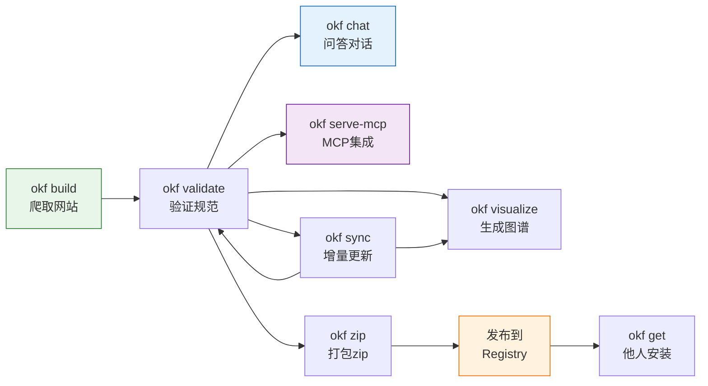

# okf-kit 完全指南 — Registry 与可视化

> 一句话摘要：okf-kit 通过 awesome-okf-kit 社区 Registry 实现 bundle 的发布发现与一键安装，`okf visualize` 生成自包含 HTML 知识图谱展示页面间链接关系，`okf zip` 将 bundle 打包为可分享的 zip 文件。

---

## 1. Bundle Registry

### 1.1 什么是 Registry？

Registry 是一个公开的 YAML 索引文件，列出社区发布的 OKF bundle。用户可以通过 `okf get <name>` 一键下载安装，无需手动爬取。

默认 Registry 托管在 [awesome-okf-kit](https://github.com/vinodborole/awesome-okf-kit) GitHub 仓库。

### 1.2 registry.yaml 格式

```yaml
bundles:
  - name: react-docs
    title: React Documentation
    description: Official React documentation bundled with okf-kit
    source_url: https://react.dev
    publisher: community
    category: frontend
    tag: react
    pages: 120
    license: MIT
    download: https://github.com/vinodborole/awesome-okf-kit/releases/download/react-docs/react-docs.okf.zip
    okf_version: "0.1"
    okf_kit_version: "0.3.3"
    updated_at: "2026-08-01"

  - name: python-312-docs
    title: Python 3.12 Documentation
    description: Official Python 3.12 documentation
    source_url: https://docs.python.org/3.12/
    publisher: community
    category: programming
    pages: 850
    download: https://...
```

每个 bundle 条目字段：

| 字段 | 必需 | 说明 |
|------|------|------|
| `name` | ✅ | bundle 唯一标识符（用于 `okf get <name>`） |
| `title` | ✅ | 人类可读的标题 |
| `description` | ✅ | 简短描述 |
| `source_url` | ✅ | 原始网站 URL |
| `download` | ✅ | zip 包下载 URL |
| `publisher` | | 发布者 |
| `category` | | 分类标签 |
| `pages` | | 页面数量 |
| `license` | | 内容许可证 |
| `updated_at` | | 最后更新日期 |

### 1.3 安装 bundle

```bash
# 列出可用 bundle（从 Registry 获取）
okf list --remote    # 或通过 HTTP API 的 /api/registry

# 安装一个 bundle
okf get react-docs
```

安装流程：
1. 从 GitHub 获取 registry.yaml（5分钟本地缓存）
2. 查找指定 name 的 bundle
3. 下载 zip 文件到内存
4. 解压到 `~/.okf/bundles/<name>/`
5. 运行 `okf validate` 验证
6. 报告安装结果

### 1.4 发布自己的 Bundle

你可以将自己构建的 bundle 发布到 Registry：

**步骤 1：构建并验证**

```bash
okf build https://docs.example.com -o my-docs --max-depth 3 --max-pages 200
okf validate my-docs
```

**步骤 2：打包**

```bash
okf zip my-docs -o my-docs.okf.zip
```

**步骤 3：上传 zip**

将 zip 文件上传到任何可公开访问的 HTTP 服务器（GitHub Releases、S3、自己的服务器等）。

**步骤 4：提交到 awesome-okf-kit**

1. Fork [awesome-okf-kit](https://github.com/vinodborole/awesome-okf-kit) 仓库
2. 在 `registry.yaml` 中添加你的 bundle 条目
3. 提交 Pull Request

### 1.5 使用自定义 Registry

企业或私有部署可以搭建自己的 Registry：

```python
# 通过环境变量或配置指定自定义 registry URL
# OKF_REGISTRY_URL=https://internal-registry.example.com/registry.yaml
```

---

## 2. 知识图谱可视化（visualize.py）

### 2.1 功能概述

`okf visualize` 生成自包含的 HTML 文件，以力导向图（force-directed graph）的形式可视化 bundle 中的概念和它们之间的链接关系。

### 2.2 使用方法

```bash
# 生成可视化（默认输出到 <bundle>/graph.html）
okf visualize my-docs

# 指定输出路径
okf visualize my-docs -o ./my-docs-graph.html

# 在浏览器中打开
# Windows: start my-docs/graph.html
# macOS: open my-docs/graph.html
```

### 2.3 可视化特性

生成的 HTML 是完全自包含的（内嵌 D3.js v7），无需额外依赖：

| 特性 | 说明 |
|------|------|
| **力导向图布局** | 节点自动排斥/吸引形成有机布局 |
| **节点代表页面** | 每个节点是一个概念页面，大小与链接数正相关 |
| **边代表链接** | 页面间的内链形成有向边 |
| **悬停提示** | 鼠标悬停显示页面标题和路径 |
| **拖拽交互** | 可拖拽节点重新布局 |
| **缩放平移** | 支持鼠标缩放和画布平移 |
| **搜索高亮** | 搜索框输入关键词高亮匹配节点 |
| **点击跳转** | 双击节点在新窗口打开对应 Markdown 文件 |
| **颜色编码** | 按目录分组着色，快速识别知识领域 |
| **目录聚类** | 同一目录下的节点自然聚集 |

### 2.4 生成流程

```python
def generate_graph(bundle_dir: Path, output_path: Path):
    """生成知识图谱HTML"""
    # 1. 读取 state.json 获取页面列表和链接关系
    state = load_state(bundle_dir)
    pages = state["pages"]
    links = state.get("links", {})

    # 2. 构建节点和边数据
    nodes = []
    for path, meta in pages.items():
        nodes.append({
            "id": path,
            "title": meta.get("title", path),
            "group": get_directory_group(path),  # 按顶级目录分组
            "size": len(links.get(path, [])),    # 链接数决定节点大小
        })

    edges = []
    for source, targets in links.items():
        for target in targets:
            if target in pages:  # 只包含 bundle 内的链接
                edges.append({"source": source, "target": target})

    # 3. 使用预定义的 HTML 模板（内嵌 D3.js）渲染
    html = render_template(nodes=nodes, edges=edges, title=state.get("title", ""))
    output_path.write_text(html, encoding="utf-8")
```

### 2.5 图分析价值

知识图谱不仅是可视化工具，还可以帮助：

1. **发现孤岛页面**：没有入链或出链的页面（孤立节点）可能需要在导航中补充链接
2. **识别中心节点**：连接最多的页面通常是核心概念
3. **发现目录结构问题**：跨目录链接过多可能说明分类不合理
4. **验证爬取完整性**：图的规模和密度反映爬取覆盖度

---

## 3. Bundle 打包（zip）

### 3.1 zip 命令

```bash
okf zip my-docs
# 输出：my-docs.okf.zip
```

### 3.2 打包内容

zip 包含：
- 所有 Markdown 概念文件
- 所有目录 index.md
- log.md 构建日志
- `.okf-kit/state.json` 元数据（用于 sync）

不包含：
- `.okf-kit/` 下的临时文件
- 聊天历史（`~/.okf/chats/` 不打包）

### 3.3 zip 安装机制

从 zip 安装的流程（`okf get` 内部使用）：

```python
def install_from_zip(zip_data: bytes, name: str):
    """从zip数据安装bundle"""
    # 1. 解压到临时目录
    # 2. 验证存在 index.md
    # 3. 移动到 ~/.okf/bundles/<name>/
    # 4. 运行 validate_bundle
    # 5. 返回安装结果
```

---

## 4. Bundle 生命周期



---

- [← 上一章：MCP 与 HTTP 服务](07-mcp-serve.md) | [下一章：扩展与开发](09-extension-development.md) →
