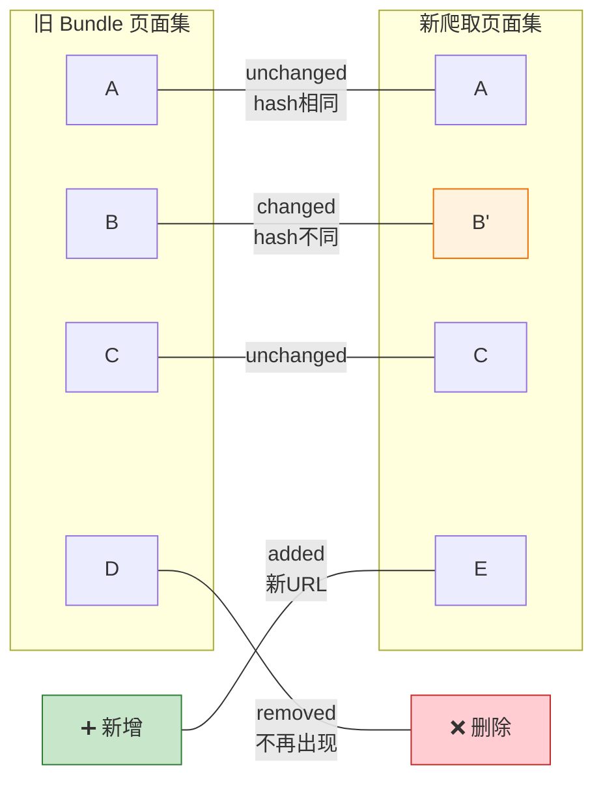
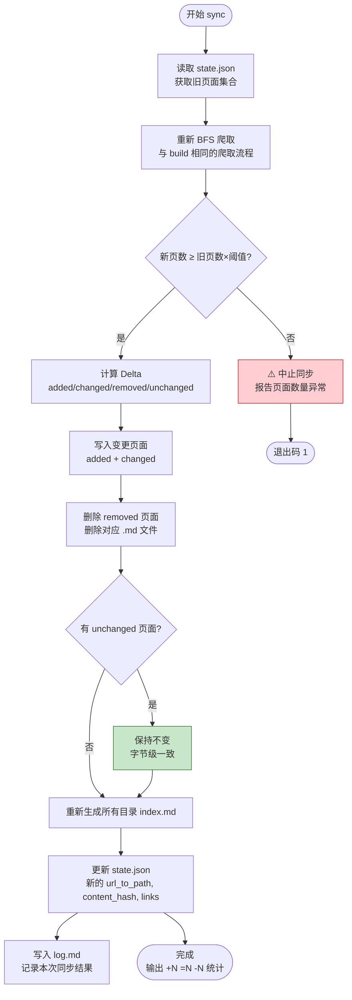

# okf-kit 完全指南 — 增量同步机制

> 一句话摘要：okf-kit 的增量同步基于每个页面 Markdown 正文的 SHA-256 content hash 判断变更，只对 added/changed 页面写入文件、删除 removed 页面，unchanged 页面保持字节级一致，并设有安全阈值防止网络异常导致误删。

---

## 1. 为什么需要增量同步？

全量重爬存在三个问题：

| 问题 | 说明 |
|------|------|
| **Git diff 噪声** | 每次重爬所有文件时间戳更新，git 无法区分哪些页面真正变更了 |
| **时间浪费** | 文档站大多数页面长时间不更新，重爬是浪费时间和带宽 |
| **不可追踪** | 无法知道"这次同步更新了哪些内容"，失去了版本控制的意义 |

增量同步解决以上问题，使得 bundle 可以像代码一样被精确地版本控制。

---

## 2. Content Hash 原理

### 2.1 哈希计算对象

每个页面的 `content_hash` 计算的是**Markdown 正文内容**（不含 frontmatter）的 SHA-256 哈希值：

```python
def compute_content_hash(markdown_body: str) -> str:
    """计算 Markdown 正文的 SHA-256 hash"""
    return f"sha256:{hashlib.sha256(markdown_body.encode('utf-8')).hexdigest()}"
```

### 2.2 为什么不用其他字段？

| 字段 | 为什么不用 |
|------|-----------|
| **HTTP Last-Modified** | 服务器时间不可靠，很多站点不返回或返回不准确 |
| **HTTP ETag** | 不是所有站点都支持，且 ETag 格式不统一 |
| **文件修改时间** | 文件系统时间不可靠（复制、解压都会改变） |
| **URL 本身** | URL 不变不代表内容不变 |
| **页面长度** | 微小变化（如修正一个错别字）长度不变 |
| **正文 hash（含 frontmatter）** | frontmatter 含 crawled_at 时间戳，每次都不同 |

**正文内容 hash** 是判断页面是否实质变更的最可靠方式。

### 2.3 hash 存储位置

hash 存储在两个地方：

1. **概念文件 frontmatter**：`content_hash: "sha256:a1b2c3..."`
2. **state.json**：`pages["/path/to/page.md"].content_hash`

---

## 3. Delta 计算

sync 的核心是计算新旧两个页面集合的 delta：

```python
def compute_delta(old_pages: dict, new_pages: dict) -> Delta:
    """
    对比新旧页面集合，返回四类 delta：
    - added: 新URL（不在旧集合中）
    - changed: hash 不同的页面
    - removed: 旧URL不再出现
    - unchanged: hash 相同的页面
    """
    added = []
    changed = []
    removed = []
    unchanged = []

    # 检查新页面
    for path, new_page in new_pages.items():
        if path not in old_pages:
            added.append(path)
        elif old_pages[path]["content_hash"] != new_page["content_hash"]:
            changed.append(path)
        else:
            unchanged.append(path)

    # 检查被删除的页面
    for path in old_pages:
        if path not in new_pages:
            removed.append(path)

    return Delta(added, changed, removed, unchanged)
```

### Delta 可视化



---

## 4. 安全阈值（Safety Threshold）

### 4.1 问题场景

如果同步时网络出现问题（如被 WAF 拦截、DNS 故障、站点临时下线），可能导致只爬取到极少页面。此时直接应用 delta 会**删除**大量正常页面。

### 4.2 阈值保护

```python
SAFETY_THRESHOLD = 0.5   # 默认50%

def check_safety_threshold(new_count: int, old_count: int, threshold: float) -> bool:
    """
    如果新爬取页面数不足原来的 threshold 比例（且原bundle>4页），
    认为可能是网络故障，中止同步。
    """
    if old_count <= 4:
        return True  # 小bundle不触发保护
    if new_count < old_count * threshold:
        return False  # 触发保护，中止
    return True
```

### 4.3 触发条件

| 原 bundle 页数 | 新爬取页数 | 阈值 | 是否中止 |
|---------------|-----------|------|---------|
| 42 | 40 | 50% | 不中止（40 > 21） |
| 42 | 15 | 50% | **中止**（15 < 21） |
| 42 | 3 | 50% | **中止**（3 < 21） |
| 3 | 1 | 50% | 不中止（小bundle豁免） |
| 100 | 60 | 50% | 不中止（60 > 50） |
| 100 | 40 | 50% | **中止**（40 < 50） |

### 4.4 覆盖阈值

如果确认是站点大规模重构（而非网络故障），可以使用 `--force` 覆盖：

```bash
# 即使页面减少超过50%也执行同步
okf sync my-docs --force
```

---

## 5. Sync 完整流程



### 同步完成后输出

```
✓ Synced bundle: my-docs
  Added: 3
  Updated: 5
  Removed: 1
  Unchanged: 33
```

---

## 6. 全量重建

如果需要重新完整爬取（如更换了 `--max-depth`/`--max-pages` 参数），可以先删除旧 bundle 目录再重新 build，或在 sync 时使用更大的 `--max-pages` 值。sync 命令本身总是重新执行 BFS 爬取，只是通过 hash 判断是否写入文件——未变更页面保持字节级一致。

适用场景：
- 更换了爬取参数
- 网站 URL 结构完全重构
- 怀疑增量判断有误

---

## 7. 与 Git 协作

增量同步的设计天然适配 Git 版本控制：

```bash
# 初始构建
okf build https://docs.example.com -o my-docs
cd my-docs
git init && git add -A && git commit -m "feat: initial bundle (42 pages)"

# 一周后同步
okf sync .
git status
# modified: pages/guide/installation.md    （内容变更）
# new file:   pages/guide/new-feature.md    （新增页面）
# deleted:    pages/old-deprecated.md       （删除页面）
# modified: index.md                        （目录索引更新）
# modified: pages/guide/index.md
# modified: .okf-kit/state.json

git diff pages/guide/installation.md
# 可以精确看到哪个段落被修改了

git add -A && git commit -m "sync: +3 -1 =5 pages"
```

### Git 友好的特性

1. **未变更文件字节级一致**：不会产生无意义的 diff
2. **变更文件确实变更了**：diff 反映真实内容变化
3. **index.md 只在必要时更新**：目录结构未变时 index.md 也保持不变
4. **state.json 精确记录**：可以追踪 URL→path 映射变化

---

## 8. Sync 配置继承

sync 从 state.json 中读取原始 build 配置（max_depth, max_pages, path_prefix, root_url, browser 等），无需重新指定：

| 参数 | 来源 | 是否可覆盖 |
|------|------|-----------|
| root_url | state.json | ❌ 始终使用原始 seed |
| path_prefix | state.json | ❌ 始终使用原始前缀 |
| max_depth | state.json | ✅ 命令行 `--max-depth` 覆盖 |
| max_pages | state.json | ✅ 命令行 `--max-pages` 覆盖 |
| js (浏览器) | state.json | ❌ sync 沿用构建时设置（不支持命令行切换） |

---

## 9. 常见同步问题

### Q: sync 提示"only X pages found"并中止？

这是安全阈值保护。排查步骤：

1. 检查网络是否正常：`curl -I <seed-url>`
2. 检查站点是否临时下线或迁移
3. 检查是否被 robots.txt 拦截（重新 build 时使用 `--no-robots`）
4. 确认是站点真实缩减后，使用 `--force` 强制执行

### Q: sync 后某些文件仍然是旧内容？

可能原因：
1. 服务器返回了缓存内容——稍后重试，或重新 build 时使用 `--js` 模拟真实浏览器
2. trafilatura 提取了不同的正文区域——页面 DOM 结构变化可能导致提取结果有差异
3. 该页面确实没有实质变更——hash 判定为 unchanged 是正确行为

### Q: 如何知道哪些页面更新了？

```bash
okf sync my-docs          # 输出 Added/Updated/Removed 数量
cd my-docs && git diff    # 查看具体变更内容
```

### Q: 同步会更新根 index.md 的 frontmatter 日期吗？

根 index.md 和所有 changed 页面的 frontmatter 更新 `crawled_at` 时间戳。unchanged 页面保持原始时间戳。

---

- [← 上一章：核心架构](/concepts/04-core-architecture.md) | [下一章：Chat 对话系统](/concepts/06-chat-system.md) →
