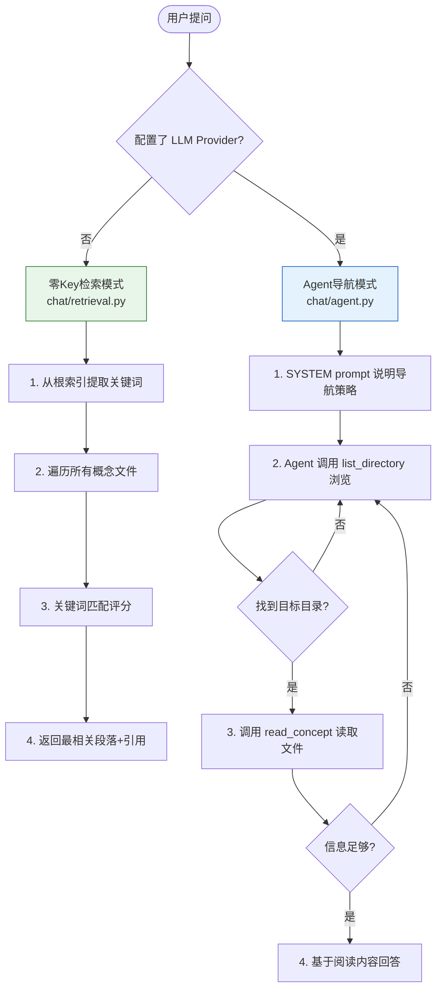
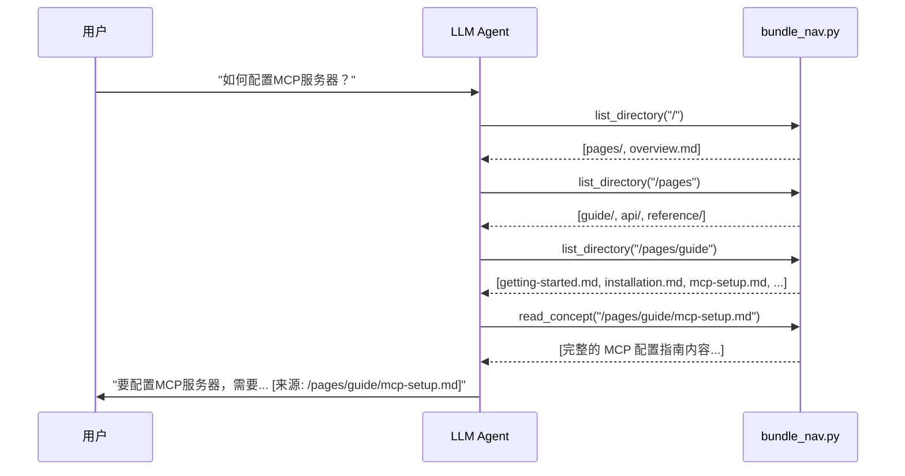

# okf-kit 完全指南 — Chat 对话系统

> 一句话摘要：okf-kit chat 采用 Agent 式导航策略——LLM 不直接接收整个 bundle，而是通过 list_directory/read_concept 工具像人类浏览文件一样逐级查找相关内容后再回答；无 LLM 配置时自动回退到零 Key 关键词检索模式，核心设计是"渐进式展开而非全量塞入上下文"。

---

## 1. 设计理念：为什么不是直接 RAG？

传统 RAG 方案通常将所有文档切分→向量化→存库→查询时相似度检索 top-k。okf-kit 选择了不同的路线：

| 维度 | 传统 RAG | okf-kit Agent 导航 |
|------|---------|-------------------|
| **索引** | 需要构建向量索引（embedding + 向量库） | 无需索引，直接读文件 |
| **上下文注入** | 将检索到的片段直接塞入 prompt | Agent 自主决定读哪些文件 |
| **冷启动** | 需要先索引才能查询 | build 完即可 chat |
| **离线能力** | 需要本地 embedding 模型 | 零 Key 检索纯字符串匹配 |
| **可解释性** | 不知道为什么检索到这些片段 | Agent 的每步阅读都可见（trace 模式） |
| **体积** | 向量库可能比原文大 | 零额外存储 |

核心洞察：文档站点本身已经是通过目录结构组织好的知识体系。与其重新切分和向量化，不如让 Agent 像人类一样浏览目录和文件。

---

## 2. 两种对话模式



---

## 3. 零 Key 检索模式（retrieval.py）

### 3.1 触发条件

未配置任何 LLM Provider 时（即默认 `--provider none`），chat 自动使用零 Key 检索。

### 3.2 检索算法

零 Key 检索不依赖任何 LLM 或 embedding 模型，使用纯文本匹配：

```python
def answer(bundle_dir: Path, question: str) -> RetrievalResult:
    """零Key检索：从bundle中找到最相关的概念段落"""

    # 1. 从问题中提取关键词（分词+停用词过滤）
    keywords = extract_keywords(question)

    # 2. 遍历所有概念文件
    results = []
    for concept_file in iter_concept_files(bundle_dir):
        content = concept_file.read_text(encoding="utf-8")
        fm, body = split_frontmatter(content)

        # 3. 计算相关性分数
        score = 0
        # - 标题匹配权重最高
        score += count_matches(fm.get("title", ""), keywords) * 3
        # - description 匹配次之
        score += count_matches(fm.get("description", ""), keywords) * 2
        # - 正文段落匹配
        for paragraph in split_paragraphs(body):
            p_score = count_matches(paragraph, keywords)
            if p_score > 0:
                results.append({
                    "file": str(concept_file.relative_to(bundle_dir)),
                    "paragraph": paragraph,
                    "score": p_score,
                    "title": fm.get("title", ""),
                    "source_url": fm.get("source_url", "")
                })

    # 4. 按分数排序，返回 top 5 段落
    results.sort(key=lambda x: x["score"], reverse=True)
    return RetrievalResult(
        answer=format_answer(results[:5]),
        sources=results[:5]
    )
```

### 3.3 输出格式

零 Key 检索的回答包含引用来源：

```
根据文档，以下是相关信息：

1. 来自《Getting Started》(/pages/guide/getting-started.md):
   安装完成后，运行 okf build <url> 开始爬取网站...
   来源: https://docs.example.com/guide/getting-started

2. 来自《Installation》(/pages/guide/installation.md):
   pip install okf-kit 安装核心版本，包含...
   来源: https://docs.example.com/guide/installation
```

### 3.4 适用场景

- 快速验证 build 结果是否正确
- 不需要 LLM 就能进行关键词查找
- 简单的事实性问题
- 完全离线环境（无需安装 Ollama）

### 3.5 局限性

- 无法理解同义表述（如"安装"和"setup"不会匹配）
- 无法进行推理或综合多个页面的信息
- 无法回答需要跨页理解的问题
- 对长问题效果较差

---

## 4. Agent 导航模式（agent.py）

### 4.1 触发条件

配置了 LLM Provider（ollama/openai/openrouter/anthropic/custom）时使用 Agent 导航模式。

### 4.2 SYSTEM Prompt 核心内容

Agent 收到的 SYSTEM prompt 关键内容：

```
你是一个知识库导航助手。你可以通过以下工具浏览知识包：

- list_directory(path): 列出指定目录下的子目录和文件。
  从根路径 "/" 开始，逐步浏览以找到相关内容。

- read_concept(path): 读取指定概念文件的完整内容。

导航策略：
1. 始终从根目录 "/" 开始
2. 使用 list_directory 查看当前目录有什么
3. 选择最相关的子目录深入，或读取看起来相关的文件
4. 不要猜测文件路径，必须通过 list_directory 确认
5. 阅读足够的内容后再回答问题
6. 答案必须基于你读取的文件内容，不要编造信息
7. 回答时引用来源文件名
```

### 4.3 导航循环

Agent 通过多轮工具调用来导航 bundle：



### 4.4 工具定义

Agent 可以调用两个核心工具（由 bundle_nav.py 实现）：

#### list_directory(path)

列出 bundle 中指定目录的内容：

**参数：**
- `path` (str): 目录路径，如 "/" 或 "/pages/guide"

**返回：**
```
# /pages/guide — directory listing

Subdirectories:
- advanced/

Files:
- getting-started.md
- installation.md
- mcp-setup.md
```

#### read_concept(path)

读取 bundle 中指定概念文件的完整内容：

**参数：**
- `path` (str): 概念文件路径，如 "/pages/guide/mcp-setup.md"

**返回：** 文件的完整 Markdown 内容（包含 frontmatter 中的 title 和 source_url）

### 4.5 导航策略约束

SYSTEM prompt 中包含明确的导航规则，防止 Agent 走弯路：

1. **必须从根开始**：第一次必须调用 `list_directory("/")`
2. **禁止猜测路径**：不能直接假设文件存在，必须先 list_directory
3. **逐层深入**：不要跳级浏览，一次进入一个子目录
4. **阅读相关文件**：进入目录后，阅读看起来最相关的文件
5. **多文件阅读**：如果一个文件不够，可以继续浏览和阅读其他文件
6. **信息足够再回答**：不要在阅读不足时猜测答案
7. **最大轮次限制**：Agent 导航的最大工具调用轮次由内部逻辑控制（默认 10 轮）

### 4.6 Trace 模式

使用 `--trace` 标志可以观察 Agent 的完整导航过程：

```bash
okf chat my-docs --provider ollama --trace
you> 如何配置MCP？

[Agent] list_directory("/")
→ [pages/, overview.md]
[Agent] list_directory("/pages")
→ [guide/, api/, reference/]
[Agent] list_directory("/pages/guide")
→ [getting-started.md, installation.md, mcp-setup.md]
[Agent] read_concept("/pages/guide/mcp-setup.md")
→ [文件内容...]
[Agent] 根据文档，配置MCP服务器的步骤是...
```

---

## 5. LLM Provider 抽象（providers.py）

### 5.1 Provider 统一接口

所有 LLM Provider 实现统一接口：

```python
class BaseProvider(ABC):
    @abstractmethod
    async def chat(
        self,
        messages: list[dict],
        tools: list[dict] | None = None,
        **kwargs
    ) -> ProviderResponse:
        """发送聊天请求，返回响应"""
        ...

class ProviderResponse:
    content: str                    # 文本内容
    tool_calls: list[ToolCall]      # 工具调用请求
    usage: dict | None              # token 用量
```

### 5.2 支持的 Provider

| Provider | Extra 依赖 | 默认模型 | API 地址 | 说明 |
|---------|-----------|---------|---------|------|
| `ollama` | `[chat]` | llama3.1 | http://localhost:11434/v1 | 本地完全离线 |
| `openai` | `[chat]` | gpt-4o-mini | https://api.openai.com/v1 | OpenAI 官方 |
| `openrouter` | `[chat]` | openai/gpt-4o-mini | https://openrouter.ai/api/v1 | 多模型路由 |
| `anthropic` | `[anthropic]` | claude-sonnet-4-20250514 | https://api.anthropic.com | Claude 原生 API |
| `custom` | `[chat]` | 无 | 需指定 --base-url | 兼容 OpenAI 协议的任意端点 |

### 5.3 OpenAI 兼容协议

`ollama`、`openai`、`openrouter`、`custom` 都使用 OpenAI Chat Completions 协议：

```python
# 统一通过 openai SDK 调用
from openai import AsyncOpenAI

client = AsyncOpenAI(
    api_key=api_key,
    base_url=base_url
)
response = await client.chat.completions.create(
    model=model,
    messages=messages,
    tools=tools,
    tool_choice="auto"
)
```

这意味着任何兼容 OpenAI API 协议的本地模型服务（如 vLLM、LM Studio、Ollama、LocalAI）都可以通过 `--provider custom --base-url <url>` 接入。

### 5.4 Anthropic 原生支持

`anthropic` Provider 使用 Anthropic 官方 SDK，支持原生 tool use 协议：

```python
from anthropic import AsyncAnthropic

client = AsyncAnthropic(api_key=api_key)
response = await client.messages.create(
    model=model,
    messages=messages,
    system=system_prompt,
    tools=tools,
    max_tokens=4096
)
```

需要安装 `[anthropic]` extra。

### 5.5 API Key 配置方式

API Key 通过以下方式配置（chat 命令不支持 `--api-key` 参数）：

1. 环境变量（`OPENAI_API_KEY`/`ANTHROPIC_API_KEY`/`OPENROUTER_API_KEY`）
2. OS keychain（通过 `okf serve` 时设置）
3. `~/.okf/.secrets.json`（keyring 不可用时的降级方案）

示例：

```bash
# 通过环境变量传入
OPENAI_API_KEY=sk-xxx okf chat my-docs --provider openai

# 或先设置环境变量
export ANTHROPIC_API_KEY=sk-ant-xxx
okf chat my-docs --provider anthropic
```

---

## 6. Bundle 导航基元（bundle_nav.py）

bundle_nav.py 提供三个供 Chat、MCP、HTTP API 共享的导航函数：

### 6.1 list_directory

```python
def list_directory(bundle_dir: Path, dir_path: str = "/") -> str:
    """
    返回目录列表的 Markdown 文本。
    输出格式与 index.md 一致，Agent 可以直接理解。
    """
```

### 6.2 read_concept

```python
def read_concept(bundle_dir: Path, file_path: str) -> str:
    """
    读取概念文件，返回带标题的 Markdown 内容。
    自动剥离纯元数据 frontmatter，保留 title 和 source_url。
    """
```

### 6.3 search_bundle

```python
def search_bundle(bundle_dir: Path, query: str, limit: int = 10) -> list[dict]:
    """
    简单关键词搜索，返回匹配的概念列表。
    这是零Key检索的基础，也供MCP的search_bundle工具使用。
    """
```

---

## 7. 对话历史（history.py）

### 7.1 存储格式

对话历史存储在 `~/.okf/chats/<bundle-name>/<session-id>.jsonl`：

```jsonl
{"role": "system", "content": "...", "ts": "2026-08-18T14:30:00Z"}
{"role": "user", "content": "如何配置MCP？", "ts": "2026-08-18T14:30:05Z"}
{"role": "assistant", "content": "配置MCP需要...", "meta": {"sources": [...]}, "ts": "2026-08-18T14:30:15Z"}
```

每行一条 JSON 记录，使用 JSONL（JSON Lines）格式方便追加。

### 7.2 会话管理

- 每次启动 `okf chat` 创建新的会话 ID（时间戳格式）
- 会话期间多轮对话自动追加到同一文件
- 历史记录包含来源引用（sources），在 HTTP API 中可显示
- REPL 模式支持 `!new` 开新会话、`!history` 查看历史等命令

### 7.3 REPL 交互模式

交互式 chat 支持以下特殊命令：

| 命令 | 功能 |
|------|------|
| `/exit` 或 Ctrl+D | 退出 |
| `/new` | 开始新对话 |
| `/clear` | 清空当前对话上下文 |
| `/trace` | 切换 trace 模式 |
| `/help` | 显示帮助 |

---

## 8. 模型选择建议

| 场景 | 推荐 Provider | 推荐模型 | 理由 |
|------|-------------|---------|------|
| 完全离线、隐私优先 | ollama | llama3.1:8b 或 qwen2.5:7b | 本地运行，数据不出境 |
| 最佳导航能力 | openai | gpt-4o-mini | tool use 能力强，成本低 |
| 长文档理解 | anthropic | claude-sonnet-4 | 上下文窗口大，推理强 |
| 多模型切换 | openrouter | 根据需要选择 | 一个 API Key 访问数百个模型 |
| 自建模型服务 | custom | 任意 OpenAI 兼容模型 | 灵活接入私有部署 |

### 模型能力要求

Agent 导航模式需要模型具备 **tool use/function calling** 能力。不支持 tool use 的模型无法使用 Agent 导航模式（会退化为零 Key 检索）。

---

## 9. 常见问题

### Q: Ollama 连接失败？

A: 确保 Ollama 服务正在运行：
```bash
ollama serve          # 启动服务
ollama pull llama3.1  # 拉取模型
```

### Q: 模型说"找不到文件"或"目录不存在"？

A: 这是因为 Agent 在猜测路径而非使用 list_directory。trace 模式可以看到它尝试了什么路径。通常是模型 tool use 能力不够强，换用 gpt-4o-mini 或 claude-sonnet 效果更好。

### Q: Agent 读取了太多文件，消耗太多 token？

A: Agent 导航有内部最大轮次限制（默认 10 轮）。如果仍觉得消耗过大，建议：
1. 在提问时提供更具体的范围指引，如"只看 installation 目录下的内容"
2. 使用 trace 模式观察 Agent 的导航路径，优化提问方式
3. 使用零Key检索模式（`okf chat my-docs`）快速确认关键词位置，再进行 LLM 对话

### Q: 如何在代码中使用 chat 功能？

A: 可以直接导入 chat 模块：
```python
from okf_kit.chat import agent, retrieval
from okf_kit.config import bundles_dir

bundle = bundles_dir() / "my-docs"

# 零Key检索
result = retrieval.answer(bundle, "什么是OKF？")
print(result["answer"])

# Agent对话（需要配置Provider）
from okf_kit.chat.providers import make_provider
provider = make_provider("ollama", model="llama3.1")
result = await agent.ask(bundle, "什么是OKF？", provider)
print(result["answer"])
```

---

- [← 上一章：增量同步机制](/concepts/05-sync-mechanism.md) | [下一章：MCP 与 HTTP 服务](/concepts/07-mcp-serve.md) →
