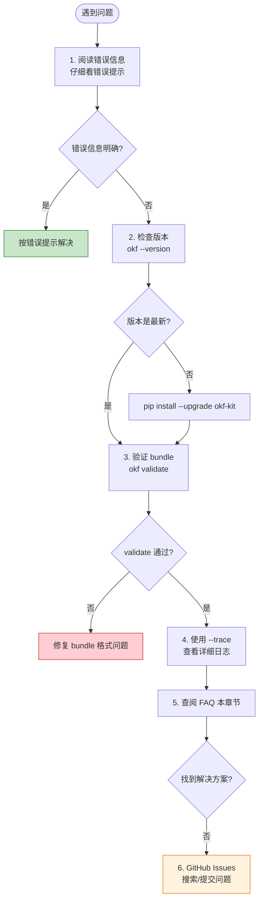

# okf-kit 完全指南 — FAQ 与排错

> 一句话摘要：本章节汇总 okf-kit 使用中最常见的问题和排错方法，覆盖 JS 渲染站点识别、robots.txt 拦截、Provider 配置错误、模型不存在、bundle 验证失败、网络问题等典型场景。

---

## 1. 爬取类问题

### Q1: 爬取到的页面内容很少（只有几行字或空页面）？

**可能原因：站点使用 JavaScript 渲染（SPA）。**

okf-kit 默认使用 HttpFetcher，直接获取 HTML 源码。如果站点是 React/Vue/Angular 等单页应用，HTML 源码中只有一个空的 `<div id="root">`，实际内容由 JS 在浏览器中动态渲染。

**解决方案：**

```bash
# 安装 JS 渲染支持
pip install 'okf-kit[js]'
crawl4ai-setup   # 首次安装 Playwright 浏览器

# 使用浏览器模式爬取
okf build https://js-site.example.com -o js-site --js
```

**判断站点是否需要 JS 渲染：**

1. 浏览器中打开页面，右键 → 查看网页源代码
2. 如果源代码中找不到正文内容（只有 `<script>` 标签），说明是 JS 渲染站点
3. 或者使用 curl 检查：`curl -s <url> | wc -c`，如果返回的 HTML 很小（< 1KB）且无实质内容，通常是 SPA

**okf-kit 自动提示：** 如果爬取到的页面正文 < 300 字符，okf-kit 会自动输出警告提示尝试 `--js`。

---

### Q2: 爬取页数比预期少很多？

**可能原因 1：路径前缀限制。**

默认情况下，okf-kit 只爬取 seed URL 路径前缀下的页面。

```bash
# seed URL 是 https://docs.example.com/docs/intro
# 自动推导 prefix 为 /docs/，不会爬取 /blog/ 或 /api/ 下的页面
okf build https://docs.example.com/docs/intro -o docs

# 要爬取同域所有路径，使用 --all-paths
okf build https://docs.example.com -o full-site --all-paths
```

**可能原因 2：深度限制。**

默认 `--max-depth 3`，可能无法到达深层页面。

```bash
# 增加深度
okf build https://docs.example.com -o docs --max-depth 5 --max-pages 500
```

**可能原因 3：robots.txt 阻止。**

某些站点的 robots.txt 禁止爬虫访问。

```bash
# 检查 robots.txt
curl https://docs.example.com/robots.txt

# 如果需要忽略 robots（注意合规性）
okf build https://docs.example.com -o docs --no-robots
```

**可能原因 4：站点做了反爬措施。**

- 使用 `--js` 模式（浏览器渲染，更难被检测为机器人）
- 减小 `--max-pages` 分批爬取

---

### Q3: 爬取被中断（网络超时/连接错误）？

**解决方案：**

```bash
# 网络问题重试即可，okf-kit 内部有 HTTP 重试机制
# 如果是部分页面失败，可以后续用 sync 补全
okf sync docs

# 或者减小爬取范围
okf build https://slow-site.example.com -o docs --max-pages 50 --max-depth 2
```

---

### Q4: 爬取了很多不想要的页面（如博客、新闻）？

**解决方案：使用 `--path-prefix` 精确限定爬取范围。**

```bash
# 只爬取 /api/ 路径下的文档
okf build https://docs.example.com/api/ -o api-docs --path-prefix /api/ --max-depth 3

# 不要使用 --all-paths
```

---

## 2. Sync 类问题

### Q5: sync 提示"only X pages found, threshold 50%"并中止？

**原因：安全阈值保护。** 重新爬取的页面数不足原来的 50%，可能是网络故障或站点离线。

**排查步骤：**

1. 检查网络连通性：`curl -I <seed-url>`
2. 在浏览器中打开站点，确认站点正常
3. 检查是否被防火墙/代理拦截
4. 如果确认站点正常（可能是大规模重构），使用 `--force` 覆盖：

```bash
okf sync my-docs --force
```

---

### Q6: sync 后某些页面没有更新？

**可能原因：内容 hash 未变化。**

sync 基于 Markdown 正文的 SHA-256 hash 判断变更。如果服务器更新了页面但实际提取到的 Markdown 内容未变（如只改了广告位、侧边栏等会被 trafilatura 过滤的内容），hash 不会变化，页面不会重写。

**强制更新方案：**

删除 bundle 目录后重新 build，或使用更大的 `--max-pages` 重新执行 sync。

---

## 3. Chat 类问题

### Q7: Ollama 连接失败？

**排查：**

```bash
# 1. 确认 Ollama 正在运行
ollama list

# 2. 如果未运行，启动服务
ollama serve

# 3. 确认已拉取模型
ollama pull llama3.1

# 4. 测试 API
curl http://localhost:11434/api/tags
```

### Q8: 模型报错"model not found"？

使用 `--model` 显式指定模型名称：

```bash
# 查看可用模型
ollama list

# 指定模型
okf chat my-docs --provider ollama --model llama3.1:8b
```

### Q9: Agent 总是说"找不到相关文件"？

**可能原因：**

1. **模型不支持 tool use**：较小的模型或不支持 function calling 的模型无法使用 Agent 导航。换用支持 tool use 的模型（gpt-4o-mini、claude-sonnet、llama3.1、qwen2.5 等）。
2. **max-turns 太小**：默认 10 轮，复杂导航可能不够。增加轮次：
   ```bash
   okf chat my-docs --provider openai --max-turns 20
   ```
3. **使用 trace 模式诊断**：
   ```bash
   okf chat my-docs --provider ollama --trace
   ```
   观察 Agent 调用了哪些 list_directory 和 read_concept，看它在哪里迷路。

### Q10: API Key 无效或报错？

**排查：**

1. 确认 Key 格式正确（OpenAI: `sk-...`，Anthropic: `sk-ant-...`）
2. 确认账户有余额/额度
3. 如果使用自定义端点，确认 `--base-url` 正确：
   ```bash
   okf chat my-docs --provider custom --base-url http://localhost:8000/v1 --model my-model
   ```
4. 使用 `okf serve` 的设置界面管理 Key（keyring 安全存储）

---

## 4. Validate 类问题

### Q11: validate 报错"missing type in frontmatter"？

**原因：** bundle 中某些 Markdown 文件缺少 `type` 字段。

如果是手动创建的 bundle，确保每个概念文件都有 frontmatter：

```yaml
---
type: concept
title: "页面标题"
---
```

如果是 `okf build` 生成的 bundle，不应出现此错误。请提交 issue 报告。

### Q12: validate 警告"internal link not found"？

**原因：** 页面中链接指向的文件在 bundle 中不存在。

这是 Warning 而非 Error，bundle 仍然可用。通常是因为：
- 链接指向了站外页面（外部链接不会在 bundle 内）
- 链接指向了被 max-depth/max-pages 限制未爬取到的页面
- 站点有损坏的内部链接

---

## 5. MCP 类问题

### Q13: Claude Code 无法识别 okf MCP 工具？

**排查：**

1. 确认已安装 `[mcp]` extra：`pip install 'okf-kit[mcp]'`
2. 确认 `okf` 命令在 PATH 中：`which okf`（macOS/Linux）或 `where okf`（Windows）
3. 检查 Claude Code MCP 配置中的路径是否正确
4. 重启 Claude Code（MCP 服务器在启动时加载）

**常见问题：** 如果使用虚拟环境，Claude Code 启动时可能找不到 `okf` 命令。使用绝对路径：

```json
{
  "mcpServers": {
    "okf-docs": {
      "command": "/Users/you/.venv/bin/okf",
      "args": ["serve-mcp", "my-docs"]
    }
  }
}
```

### Q14: MCP 连接后 AI 说"无法读取文件"？

可能是 bundle 名称不正确。在 MCP 配置中使用 `okf list` 显示的准确名称。

---

## 6. 安装类问题

### Q15: pip install 时 crawl4ai/Playwright 安装失败？

**中国大陆用户：使用镜像源。**

```bash
# pip 镜像
pip install 'okf-kit[js]' -i https://pypi.tuna.tsinghua.edu.cn/simple

# Playwright 浏览器镜像
set PLAYWRIGHT_DOWNLOAD_HOST=https://npmmirror.com/mirrors/playwright
crawl4ai-setup
```

### Q16: Linux 上 keyring 警告？

无头 Linux 服务器没有桌面环境的 keyring 服务，serve 功能会自动降级到文件存储（`~/.okf/.secrets.json`），不影响使用。可以忽略以下警告：

```
WARNING:keyring.backend:No recommended backend was available.
```

---

## 7. 通用排错流程

遇到问题时，按以下流程排查：



---

## 8. 反模式（常见误用）

| 反模式 | 正确做法 |
|--------|---------|
| 一上来就用 `--all-paths` 爬整站 | 先用默认 prefix 爬取，不够再扩大范围 |
| 对静态站点使用 `--js` | 默认 HttpFetcher 快 10 倍，仅 JS 站点需要浏览器渲染 |
| `--max-depth 10 --max-pages 10000` 无限制爬取 | 从小范围开始（depth=2-3, pages=50-200），逐步增加 |
| 把 bundle 放在项目目录外的随机位置 | 放在 `~/.okf/bundles/` 下方便管理 |
| 手动编辑 .okf-kit/state.json | state.json 由 okf-kit 自动维护，不应手动编辑 |
| 将聊天历史纳入版本控制 | chats/ 目录是用户数据，不应 commit |
| 把 API Key 写在命令行历史中 | 使用环境变量传入，或通过 serve 的 keyring 存储 |

---

- [← 上一章：扩展与开发](/concepts/09-extension-development.md) | [下一章：总结与资源](/references/11-summary-resources.md) →
