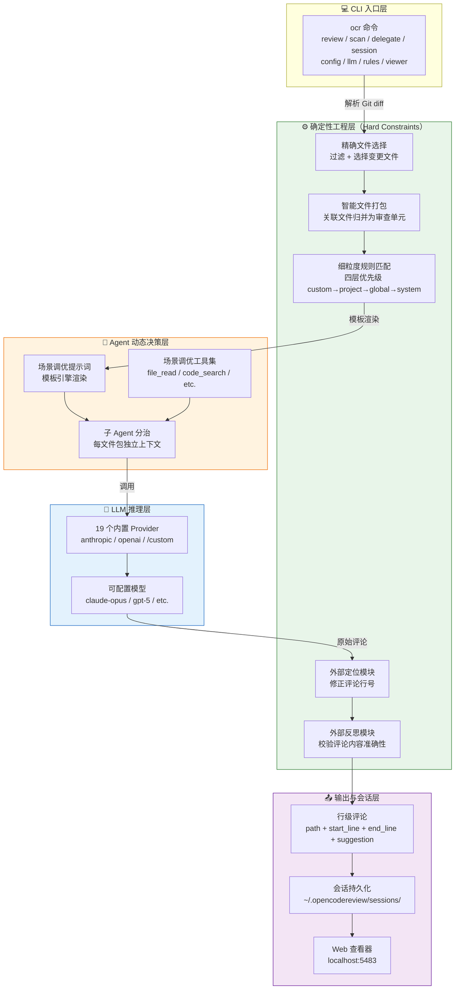

# Open Code Review 完全指南 — 概述

> 一句话摘要：本教程系统讲解阿里巴巴开源的 AI 代码审查 CLI 工具 Open Code Review（`ocr`）的安装、命令体系、规则配置、CI/CD 集成与高级用法，帮助开发者在命令行中以行级精度自动化审查 Git diff，尤其适用于 AI 辅助开发与流水线门禁场景。

---

## 1. 教程介绍

Open Code Review（简称 OCR）是阿里巴巴集团开源的 AI 驱动代码审查 CLI 工具，项目仓库位于 [github.com/alibaba/open-code-review](https://github.com/alibaba/open-code-review)。它的前身是阿里集团内部官方 AI 代码审查助手，过去两年在内部服务了数万名开发者，识别了数百万个代码缺陷；经过大规模充分验证后，孵化为开源项目对社区开放。

OCR 的工作原理是：读取 Git diff，通过具备工具调用（tool-use）能力的 Agent 将变更文件发送至可配置的 LLM，生成具有**行级精度**的结构化审查意见。Agent 可以读取完整文件内容、搜索代码库、检查其他变更文件以获取上下文，从而产出深度审查——而非仅停留在表面的 diff 反馈。除了 diff 审查，`ocr scan` 还可审查整个文件，适用于审计陌生的代码库或没有有意义 diff 的目录。

只需配置一个模型端点即可开始使用，支持 Anthropic、OpenAI 等 19 个内置 provider，亦可接入任何 OpenAI 兼容 API。

本教程以 [OCR 官方文档](https://open-codereview.ai/docs) 与 [GitHub 仓库](https://github.com/alibaba/open-code-review) 为核心参考，按照由浅入深的原则组织为 11 个章节，覆盖从零基础安装到 CI/CD 集成与委托模式的完整知识体系。

### 为什么选择 Open Code Review？

如果你深度使用过 Claude Code 等通用 Agent + Skills 方案做代码审查，大概率会遇到以下痛点：

- **覆盖不全（Incomplete coverage）**——变更文件较多时，Agent 倾向于"偷懒"，选择性地审查部分文件，导致遗漏。
- **位置漂移（Position drift）**——报告的问题与实际代码位置常常对不上，出现行号或文件偏移。
- **效果不稳定（Unstable quality）**——基于自然语言驱动的 Skills 难以调试，审查质量因提示词的细微差异而大幅波动。

这些问题的根源在于：**纯语言驱动的架构缺乏对审查流程的硬约束**。AI Agent 像人类一样会"偷懒"——审到一半觉得够了就停，或者因为上下文太长而遗漏关键文件。

OCR 的核心设计是「**确定性工程 × Agent 混合**」——把"绝对不能出错"的部分交给工程逻辑，把"需要动态判断"的部分交给 LLM。下表对比了两种方案的核心差异：

| 对比维度 | 纯 Agent 方案（Claude Code + Skills） | Open Code Review |
|---------|--------------------------------------|------------------|
| 文件选择 | 靠模型理解，易遗漏 | 确定性规则匹配，零遗漏 |
| 位置精度 | 可能漂移，行号对不上 | 后处理反射模块修正，行级精准 |
| 审查稳定性 | Prompt 波动影响大 | 模板引擎 + 规则分层，可预期 |
| 大变更集 | 容易遗漏文件 | 文件分片 + 子 Agent 并发，分治稳定 |
| 自定义规则 | 难以实现 | JSON 规则文件，四层优先级 |
| Token 消耗 | 较高（全量上下文） | 约 1/9（精准聚焦） |
| 可调试性 | 自然语言 Skills 难调试 | `ocr rules check` 可追溯规则来源 |

---

## 2. Benchmark 数据

OCR 的基准测试基于真实场景构建：从 **50** 个热门开源仓库中精选 **200** 个真实的 Pull Request，覆盖 **10** 种编程语言——由 **80+** 位资深工程师交叉标注验证，共 **1,505** 个标注缺陷（ground-truth issues）。

### 2.1 核心指标

| 指标 | 含义 | 为什么重要 |
|------|------|-----------|
| **F1** | Precision 与 Recall 的调和均值 | 综合衡量审查质量的最佳单一指标 |
| **Precision（准确率）** | 报告的问题中真正有效的比例 | 越高 = 误报越少，减少人工确认成本 |
| **Recall（召回率）** | 真实缺陷中被发现的比例 | 越高 = 漏报越少，更多问题不会遗漏 |
| **Avg Time（平均耗时）** | 每次审查的实际耗时 | 决定 CI 流水线的等待时间 |
| **Avg Token（平均 Token）** | 每次审查消耗的总 token 数 | 直接影响 API 使用成本 |

### 2.2 与 Claude Code 的对比

在相同底层模型下，Open Code Review 相比通用 Agent（Claude Code）取得了显著更高的 **Precision** 与 **F1**，同时仅消耗 **约 1/9 的 token**，审查更快。需要注意的是，OCR 的 Recall 低于通用 Agent——这是**以精准度换取低噪声**的设计取舍，优先减少误报而非追求覆盖全部问题。

| 指标 | Open Code Review | Claude Code（通用 Agent） | 优势方 |
|------|------------------|--------------------------|--------|
| Precision | 显著更高 | 较低 | ✅ OCR |
| F1 | 显著更高 | 较低 | ✅ OCR |
| Recall | 较低（刻意取舍） | 较高 | Claude Code |
| Avg Time | 更快 | 较慢 | ✅ OCR |
| Avg Token | 约 1/9 | 基准 | ✅ OCR |

> **设计哲学**：在代码审查场景中，误报（false alarm）的成本远高于漏报——工程师对噪声容忍度极低，过多的误报会导致审查结果被整体忽略。OCR 选择"少而精"的策略，确保每一条评论都值得人工关注。

---

## 3. 目标受众

本教程面向以下读者：

| 角色 | 典型需求 | 建议阅读深度 |
|------|---------|-------------|
| **开发者（前端/后端）** | 日常 commit 前自查、PR 审查、降低人工 review 负担 | 第 0-3 章 + 第 7 章 |
| **DevOps / SRE 工程师** | 将 OCR 嵌入 CI/CD 流水线作为代码质量门禁 | 第 0-2 章 + 第 5-6 章 + 第 8 章 |
| **开源项目维护者** | 自动化社区 PR 审查、减少维护者重复劳动 | 全部章节 |
| **AI 辅助开发实践者** | 将 OCR 作为 Agent Skill 集成到 Claude Code / Cursor / Codex 工作流 | 第 0-3 章 + 第 7-9 章 |
| **技术团队 Leader** | 评估 AI 代码审查工具、制定团队审查标准与规则 | 第 0 章（本文）+ 第 4 章 + 第 10 章 |

> **特别关注**：如果你正在使用 AI 编程助手（如 Trae、Claude Code、Cursor、Codex），OCR 可以作为**代码审查的确定性执行层**——AI 负责生成代码，OCR 负责以工程化的方式审查代码，两者结合实现"AI 写代码 + AI 审代码"的闭环。详见 [与 SpecWeave 开发工作流的关系](#8-与-specweave-开发工作流的关系)。

---

## 4. 章节导航

| 章节 | 标题 | 内容概要 | 难度 |
|------|------|---------|------|
| 00 | [概述](00-overview.md)（当前页） | 教程总览、Benchmark、架构图、核心特性 | ⭐ |
| 01 | [安装与配置](01-installation.md) | 四种安装方式、状态目录、规则文件、卸载 | ⭐ |
| 02 | [CLI 命令参考](02-cli-reference.md) | 10 个子命令、review 三种模式、JSON 输出 | ⭐⭐ |
| 03 | [快速开始](03-quick-start.md) | 首次配置 LLM、运行第一次审查、解读输出 | ⭐⭐ |
| 04 | [审查规则系统](04-review-rules.md) | 四层规则优先级、JSON 规则文件、glob 模式 | ⭐⭐⭐ |
| 05 | [配置参考](05-configuration.md) | config.json schema、环境变量、provider 配置 | ⭐⭐⭐ |
| 06 | [CI/CD 集成](06-cicd-integration.md) | GitHub Actions、GitLab CI、Gerrit、GitFlic | ⭐⭐⭐ |
| 07 | [委托模式与 Agent 集成](07-delegate-agent-skill.md) | delegate 模式、Claude Code/Cursor/Codex 插件 | ⭐⭐⭐⭐ |
| 08 | [会话查看器与可观测性](08-viewer-telemetry.md) | Web UI 会话回放、OpenTelemetry 集成 | ⭐⭐⭐ |
| 09 | [MCP Server 与扩展工具](09-mcp-server.md) | MCP 协议扩展、自定义工具集 | ⭐⭐⭐⭐ |
| 10 | [FAQ 与最佳实践](10-faq-best-practices.md) | 常见问题、性能调优、团队落地经验 | ⭐⭐ |

---

## 5. 功能架构



> **架构解读**：OCR 的执行流程从 CLI 解析 Git diff 开始，经过确定性工程层的文件选择、打包、规则匹配后，将每个文件包交给独立的子 Agent。子 Agent 使用场景调优的提示词和工具集调用 LLM，原始评论再经过定位模块和反思模块的后处理修正，最终输出行级精准的结构化评论。整个流程中，"不能出错"的部分由工程逻辑保证，"需要判断"的部分由 LLM 负责。

---

## 6. 核心特性

OCR 的核心设计理念是将确定性工程与 Agent 结合，各司其职。以下 6 个特性构成了 OCR 的竞争力：

### 6.1 确定性工程——负责强约束

**① 精确文件选择（Precise file selection）**

明确哪些文件需要审查、哪些应当过滤，确保真正重要的改动一个不漏。工程逻辑而非模型决定文件范围，避免 Agent"偷懒"跳过文件。

**② 智能文件打包（Smart file bundling）**

将关联文件归并为同一审查单元（例如 `message_en.properties` 与 `message_zh.properties` 会被打包在一起）。每个包作为独立的 sub-agent 运行，上下文隔离——这一分治策略在超大变更场景下表现稳定，同时天然支持并发审查。

**③ 细粒度规则匹配（Fine-grained rule matching）**

针对不同文件的特征匹配对应的审查规则，确保模型注意力足够聚焦，从源头规避信息噪声。相比纯语言驱动的规则引导，基于模板引擎的规则匹配行为更稳定、结果更可预期。规则有四层优先级：`custom → project → global → system`。

**④ 外挂的定位与反思组件（External positioning and reflection modules）**

独立的评论定位模块与评论反思模块，系统性地提升 AI 反馈的**位置准确性**与**内容准确性**。定位模块修正行号偏移，反思模块校验评论是否真正成立——这是纯 Agent 方案最难以稳定实现的部分。

### 6.2 Agent——负责动态决策

**⑤ 场景化提示词调优（Scenario-tuned prompts）**

针对代码审查场景深度优化提示词模板，在提升效果的同时有效降低 Token 消耗。模板引擎渲染确保每次调用的一致性。

**⑥ 场景化工具集沉淀（Scenario-tuned toolset）**

基于对大量线上数据中工具调用轨迹的深入分析——包括调用频次分布、单工具重复率、新工具对整体调用链的影响——提炼出专为代码审查定制的工具集，比通用 Agent 工具箱更稳定、更可预期。

---

## 7. 阅读路径建议

根据你的角色和目标，选择以下阅读路径：

### 🟢 初学者路径（入门 → 日常使用）

```
01-installation → 02-cli-reference → 03-quick-start
```

1. 先从 [安装与配置](01-installation.md) 开始，完成环境搭建
2. 浏览 [CLI 命令参考](02-cli-reference.md)，了解命令体系
3. 跟着 [快速开始](03-quick-start.md) 运行第一次审查

> 完成此路径后，你将能在本地对工作区变更、分支差异、单次 commit 进行 AI 代码审查。

### 🔵 CI/CD 路径（流水线集成 → 团队落地）

```
01-installation → 05-configuration → 06-cicd-integration → 04-review-rules
```

1. 完成安装与 LLM 配置
2. 掌握 [配置参考](05-configuration.md)，理解环境变量与 config.json
3. 学习 [CI/CD 集成](06-cicd-integration.md)，嵌入流水线门禁
4. 制定团队 [审查规则](04-review-rules.md)，落地规范

> 完成此路径后，你将能在 GitHub Actions / GitLab CI 中自动审查每个 PR。

### 🟣 Agent 集成路径（AI 工作流闭环）

```
00 → 02 → 07-delegate-agent-skill → 09-mcp-server
```

1. 理解 OCR 的核心设计（本文）
2. 掌握命令体系与 JSON 输出
3. 学习 [委托模式](07-delegate-agent-skill.md)，让 Claude Code/Cursor 直接调用
4. 扩展 [MCP Server](09-mcp-server.md)，接入自定义工具

> 完成此路径后，你将能将 OCR 作为 Skill 集成到 AI 编程助手中，实现"AI 写代码 + AI 审代码"的闭环。

---

## 8. 与 SpecWeave 开发工作流的关系

在 [SpecWeave](https://github.com/xinetzone/SpecWeave) 的 AI 辅助开发范式中，OCR 可以作为代码审查的确定性执行层，弥补通用 Agent 在审查场景下的不足。以下场景展示了 OCR 在 SpecWeave 工作流中的实际应用：

| SpecWeave 工作流场景 | 使用的 ocr 命令 | 说明 |
|---------------------|----------------|------|
| **原子化提交前自查** | `ocr review`（workspace 模式） | AI 生成代码后，commit 前自动审查工作区变更 |
| **PR 质量门禁** | `ocr review --from main --to feature --format json` | PR 创建时自动审查，JSON 输出供 CI 解析 |
| **CI 综合检查** | `ocr review --audience agent` | 嵌入 CI 流水线，`--audience agent` 静默输出 |
| **历史代码审计** | `ocr scan --path internal/agent` | 全文件扫描，审计陌生模块或遗留代码 |
| **规则落地** | `ocr rules check <file>` | 验证团队规则是否正确匹配到目标文件 |
| **会话回放** | `ocr viewer` | Web UI 浏览历史审查会话，复盘问题模式 |
| **Agent 委托审查** | `ocr delegate preview` / `ocr delegate rule` | 委托模式：让宿主 Agent 用自己的 LLM 审查，无需配置 OCR 的 API key |

> **核心原则**：在 SpecWeave 的 AI 辅助开发范式中，OCR 是"AI 审查的工程化外壳"——AI 负责生成代码与动态决策，OCR 负责文件选择、规则匹配、位置修正等确定性约束。两者结合，将 AI 代码审查从"靠 Prompt 碰运气"升级为"工程化可预期"。

### 典型集成场景

**场景 1：Trae IDE 中 commit 前自查**

```bash
# AI 生成代码后，提交前自动审查
ocr review --audience agent -b "feat: 新增用户认证模块"
```

**场景 2：GitHub Actions PR 门禁**

```yaml
- name: Open Code Review
  run: |
    ocr review --from origin/main --to HEAD \
      --format json --audience agent \
      --background "${{ github.event.pull_request.body }}"
```

**场景 3：委托模式（无 OCR API key）**

```bash
# 让 Claude Code 用自己的 LLM 执行审查
ocr delegate preview    # 预览 OCR 将交给宿主 Agent 的文件与规则
ocr delegate rule src/main.go src/handler.go  # 查看特定文件的规则
```

---

## 9. 前置知识

开始学习本教程前，建议具备以下基础知识：

- **Git 基本操作**：`diff`、`commit`、`branch`、`merge-base`、`ref` 等概念
- **命令行基本使用**：终端操作、环境变量配置、PATH 设置
- **LLM API 基础**：了解 API key、model、provider 等概念（不强制，第 3 章会讲解）
- **JSON 格式**：规则文件与结构化输出均使用 JSON

如果你对 AI Agent 与 tool-use 概念完全陌生，建议先了解 LLM 的 function calling 机制再阅读本教程的高级章节。

---

## 10. 项目信息

| 属性 | 值 |
|------|-----|
| **项目仓库** | [github.com/alibaba/open-code-review](https://github.com/alibaba/open-code-review) |
| **官方网站** | [open-codereview.ai](https://open-codereview.ai/) |
| **开发语言** | Go |
| **许可证** | Apache-2.0 |
| **当前版本** | v1.8.6（截至 2026-08） |
| **NPM 包名** | `@alibaba-group/open-code-review` |
| **二进制名称** | `ocr`（Windows 为 `ocr.exe`） |
| **状态目录** | `~/.opencodereview/` |
| **项目规则目录** | `<repo>/.opencodereview/` |

---

- [下一章：安装与配置](01-installation.md) →
