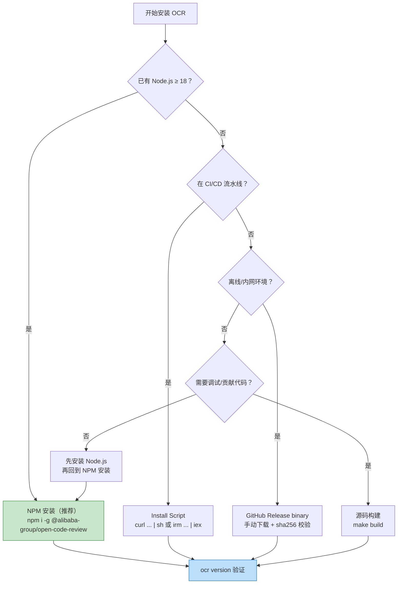

# Open Code Review 完全指南 — 安装与配置

本章介绍 Open Code Review（`ocr`）在各主流操作系统上的安装方法、状态目录结构、项目级规则配置、自动更新机制、卸载方法以及安装验证。

---

## 1. 前置依赖

在安装 OCR 之前，请确认系统满足以下前置条件：

| 依赖 | 最低版本 | 用途 | 是否必需 |
|------|---------|------|---------|
| **Git** | ≥ 2.41 | diff 生成、代码搜索、仓库操作 | ✅ 必需（所有安装方式） |
| **Node.js** | ≥ 18 | NPM 安装方式 | ⚠️ 仅 NPM 安装需要 |
| **Go** | ≥ 1.25 | 源码构建方式 | ⚠️ 仅源码构建需要 |
| **curl** | 任意版本 | Install script（Linux/macOS） | ⚠️ 仅脚本安装需要 |
| **PowerShell** | ≥ 5.1 | Install script（Windows） | ⚠️ 仅 Windows 脚本安装需要 |

### 1.1 验证 Git 版本

OCR 依赖 Git 进行 diff 生成、代码搜索和仓库操作，版本必须不低于 2.41：

```bash
git --version
```

输出示例：

```
git version 2.45.1
```

> **提示**：如果 Git 版本低于 2.41，请先升级 Git。macOS 可用 `brew install git`，Linux 各发行版使用对应包管理器升级，Windows 可从 [git-scm.com](https://git-scm.com/download/win) 下载最新版。

### 1.2 验证 Node.js 版本（NPM 安装方式）

```bash
node --version
```

输出示例：

```
v20.11.0
```

> Node.js 18 及以上版本均可使用 NPM 安装方式。

### 1.3 验证 Go 版本（源码构建方式）

```bash
go version
```

输出示例：

```
go version go1.25.0 darwin/arm64
```

---

## 2. 四种安装方式对比

OCR 提供四种安装方式，适用于不同的使用场景和平台：

| 安装方式 | 推荐度 | 适用场景 | 优势 | 限制 |
|---------|--------|---------|------|------|
| **NPM** | ⭐⭐⭐⭐⭐ | 大多数开发者、跨平台、自动更新 | 一条命令完成、自动更新、跨平台一致 | 需要 Node.js ≥ 18 |
| **Install script** | ⭐⭐⭐⭐ | 无 Node.js 环境、CI/CD 流水线 | 无需 Node.js、SHA256 校验、自动检测架构 | 仅 Linux/macOS/Windows |
| **GitHub Release binary** | ⭐⭐⭐ | 离线环境、锁定版本、企业内网 | 无依赖、可离线分发、版本可控 | 需手动更新、需手动配置 PATH |
| **Build from source** | ⭐⭐ | 贡献者、自定义构建、最新未发布特性 | 可定制、可调试、可获取未发布特性 | 需要 Go ≥ 1.25、需手动编译 |

> **推荐选择**：如果你已有 Node.js 环境（绝大多数前端/全栈开发者），直接使用 NPM 安装；如果是纯后端 Go/Java 团队或 CI 流水线，使用 Install script；如果是离线企业环境，下载 GitHub Release binary 分发。

---

## 3. NPM 安装（推荐）

### 3.1 全局安装

```bash
npm install -g @alibaba-group/open-code-review
```

安装完成后，`ocr` 命令全局可用。NPM 包通过平台特定的子包机制分发二进制，无需 `postinstall` 下载步骤，安装过程快速且可靠。

### 3.2 验证安装

```bash
ocr version
```

输出示例：

```
Open Code Review v1.8.6
Git commit: ce1d148
Platform: darwin/arm64
Build date: 2026-08-03T10:00:00Z
GitHub: https://github.com/alibaba/open-code-review
```

### 3.3 自动更新机制

NPM 安装的 OCR 内置自动更新检查机制，无需手动升级即可获取最新版本：

| 配置项 | 默认值 | 说明 |
|--------|--------|------|
| 检查间隔 | **18 分钟** | 每次运行时检查距上次检查是否超过 18 分钟 |
| 更新方式 | `npm i -g @alibaba-group/open-code-review` | 自动通过 NPM 升级 |
| 失败提示 | 显示更新提示 | 自动更新失败时，在 stderr 显示手动升级命令 |

#### 控制自动更新的环境变量

| 环境变量 | 作用 | 示例 |
|---------|------|------|
| `OCR_UPDATE_INTERVAL` | 自定义检查间隔（分钟） | `OCR_UPDATE_INTERVAL=60`（每小时检查一次） |
| `OCR_NO_UPDATE` | 禁用自动更新 | `OCR_NO_UPDATE=1` |

```bash
# 禁用自动更新（适用于 CI/CD 或锁定版本场景）
export OCR_NO_UPDATE=1

# 自定义检查间隔为 60 分钟
export OCR_UPDATE_INTERVAL=60
```

> **CI/CD 场景**：在流水线中建议设置 `OCR_NO_UPDATE=1`，避免每次运行都触发更新检查影响速度，同时保证版本一致性。

### 3.4 手动升级

```bash
npm update -g @alibaba-group/open-code-review
```

或指定版本：

```bash
npm install -g @alibaba-group/open-code-review@1.8.6
```

---

## 4. Install Script 安装

Install script 适用于没有 Node.js 环境的系统，支持 Linux、macOS 和 Windows，自动检测操作系统和架构，并从 GitHub Releases 下载对应二进制文件，附带 SHA256 校验确保完整性。

### 4.1 Linux / macOS

```bash
curl -fsSL https://raw.githubusercontent.com/alibaba/open-code-review/main/install.sh | sh
```

> **安全建议**：建议先下载脚本审查后再执行：
>
> ```bash
> curl -fsSL https://raw.githubusercontent.com/alibaba/open-code-review/main/install.sh -o install.sh
> less install.sh
> sh install.sh
> ```

#### 环境变量

| 环境变量 | 默认值 | 说明 |
|---------|--------|------|
| `OCR_INSTALL_DIR` | `/usr/local/bin` | 安装目录（需在 PATH 中） |
| `OCR_VERSION` | `latest` | 指定版本（如 `v1.8.6`） |

```bash
# 安装到自定义目录
OCR_INSTALL_DIR=~/.local/bin sh install.sh

# 安装指定版本
OCR_VERSION=v1.8.0 sh install.sh
```

脚本会自动检测：
- **操作系统**：`darwin`（macOS）或 `linux`
- **架构**：`amd64`（x86_64）或 `arm64`（Apple Silicon / aarch64）
- **校验**：下载 `sha256sum.txt` 并验证二进制完整性
- **权限**：若安装目录不可写，自动使用 `sudo` 提权

### 4.2 Windows（PowerShell）

```powershell
irm https://raw.githubusercontent.com/alibaba/open-code-review/main/install.ps1 | iex
```

> **安全建议**：建议先下载脚本审查后再执行：
>
> ```powershell
> irm https://raw.githubusercontent.com/alibaba/open-code-review/main/install.ps1 -OutFile install.ps1
> notepad install.ps1
> .\install.ps1
> ```

#### 环境变量

| 环境变量 | 默认值 | 说明 |
|---------|--------|------|
| `OCR_INSTALL_DIR` | `$env:LOCALAPPDATA\Programs\ocr` | 安装目录 |
| `OCR_VERSION` | `latest` | 指定版本 |

```powershell
# 安装到自定义目录
$env:OCR_INSTALL_DIR = "C:\Tools\ocr"
.\install.ps1

# 安装指定版本
$env:OCR_VERSION = "v1.8.0"
.\install.ps1
```

脚本会自动检测：
- **架构**：`amd64`（AMD64/X64）或 `arm64`（ARM64）
- **校验**：下载 `sha256sum.txt` 并使用 `Get-FileHash` 验证
- **TLS**：确保 PowerShell 5.1 使用 TLS 1.2
- **PATH 提示**：若安装目录不在 PATH 中，输出提示

---

## 5. GitHub Release 二进制安装

OCR 在每个 Release 中提供 6 个预编译二进制文件，覆盖主流操作系统和架构，适合离线分发或锁定版本场景。

### 5.1 二进制文件清单

| 操作系统 | 架构 | 文件名 |
|---------|------|--------|
| macOS（Darwin） | arm64（Apple Silicon） | `opencodereview-darwin-arm64` |
| macOS（Darwin） | amd64（Intel） | `opencodereview-darwin-amd64` |
| Linux | arm64 | `opencodereview-linux-arm64` |
| Linux | amd64 | `opencodereview-linux-amd64` |
| Windows | arm64 | `opencodereview-windows-arm64.exe` |
| Windows | amd64 | `opencodereview-windows-amd64.exe` |

### 5.2 下载与校验

从 [GitHub Releases 页面](https://github.com/alibaba/open-code-review/releases/latest) 下载对应平台的二进制文件，并使用 `sha256sum.txt` 校验完整性。

**macOS（Apple Silicon）**：

```bash
curl -Lo ocr https://github.com/alibaba/open-code-review/releases/latest/download/opencodereview-darwin-arm64
chmod +x ocr && sudo mv ocr /usr/local/bin/ocr
```

**Linux（x86_64）**：

```bash
curl -Lo ocr https://github.com/alibaba/open-code-review/releases/latest/download/opencodereview-linux-amd64
chmod +x ocr && sudo mv ocr /usr/local/bin/ocr
```

**Linux（ARM64）**：

```bash
curl -Lo ocr https://github.com/alibaba/open-code-review/releases/latest/download/opencodereview-linux-arm64
chmod +x ocr && sudo mv ocr /usr/local/bin/ocr
```

**Windows（x86_64，PowerShell）**：

```powershell
curl -Lo ocr.exe https://github.com/alibaba/open-code-review/releases/latest/download/opencodereview-windows-amd64.exe
# 将 ocr.exe 移动到 PATH 中的目录，例如：
Move-Item ocr.exe $env:LOCALAPPDATA\Programs\ocr\
```

### 5.3 SHA256 校验

每个 Release 附带 `sha256sum.txt` 文件，包含所有二进制的校验和。下载后务必校验：

```bash
# 下载校验文件
curl -Lo sha256sum.txt https://github.com/alibaba/open-code-review/releases/latest/download/sha256sum.txt

# 校验（macOS/Linux）
shasum -a 256 -c sha256sum.txt --ignore-missing

# 或手动比对
shasum -a 256 opencodereview-darwin-arm64
# 应与 sha256sum.txt 中对应行的哈希值一致
```

`sha256sum.txt` 格式示例：

```
e3b0c44298fc1c149afbf4c8996fb92427ae41e4649b934ca495991b7852b855  opencodereview-darwin-arm64
4a3b2c1d5e6f7a8b9c0d1e2f3a4b5c6d7e8f9a0b1c2d3e4f5a6b7c8d9e0f1a2  opencodereview-darwin-amd64
...
```

> **安全提示**：Release 二进制还附带 Sigstore 签名认证（attestation），可通过 `gh attestation verify` 验证来源可信。详见 [SECURITY.md](https://github.com/alibaba/open-code-review/blob/main/SECURITY.md)。

---

## 6. 源码构建

适用于贡献者、需要调试或需要获取未发布特性的场景。

### 6.1 前置条件

- **Go ≥ 1.25**
- **Git**（用于获取源码与版本信息）

### 6.2 克隆仓库

```bash
git clone https://github.com/alibaba/open-code-review.git
cd open-code-review
```

### 6.3 构建命令

OCR 使用 `Makefile` 管理构建流程，以下是常用命令：

| 命令 | 作用 |
|------|------|
| `make build` | 构建当前平台的二进制到 `./dist/opencodereview` |
| `make test` | 运行单元测试（`-race` 检测竞态） |
| `make coverage` | 生成覆盖率报告（阈值 80%） |
| `make build-all` | 交叉编译全部 6 个平台二进制 |
| `make sha256sum` | 为所有二进制生成 SHA256 校验文件 |
| `make dist` | 完整发布构建：clean → build-all → sha256sum |
| `make fmt` | 格式化代码（`gofmt -s`） |
| `make vet` | 静态检查（`go vet`） |
| `make check` | 综合检查：tidy + fmt + vet |
| `make clean` | 清理构建产物 |
| `make version-info` | 打印版本信息 |
| `make help` | 打印 `ocr -h` 帮助 |

#### 构建当前平台

```bash
make build
```

构建产物位于 `./dist/opencodereview`，可手动移动到 PATH 中：

```bash
sudo mv ./dist/opencodereview /usr/local/bin/ocr
```

#### 交叉编译全部平台

```bash
make build-all
```

产出 6 个二进制文件：

```
dist/
├── opencodereview-darwin-arm64
├── opencodereview-darwin-amd64
├── opencodereview-linux-arm64
├── opencodereview-linux-amd64
├── opencodereview-windows-arm64.exe
└── opencodereview-windows-amd64.exe
```

#### 运行测试

```bash
make test
```

测试使用 `-race` 标志检测竞态条件，`-count=1` 禁用缓存确保可重复性。

#### 检查覆盖率

```bash
make coverage
```

OCR 要求测试覆盖率不低于 80%，否则构建失败。

### 6.4 版本信息注入

构建时通过 `-ldflags` 注入版本信息（见 `Makefile`）：

- `main.Version`：从 Git tag 获取，无 tag 时回退到 `v0.0.0-<commit>`
- `main.GitCommit`：短 commit hash
- `main.BuildDate`：UTC 构建时间

```bash
make version-info
```

输出示例：

```
Version:   v1.8.6
GitCommit: ce1d148
BuildDate: 2026-08-05T10:00:00Z
LD_FLAGS:  -X main.Version=v1.8.6 -X main.GitCommit=ce1d148 -X main.BuildDate=2026-08-05T10:00:00Z
```

---

## 7. 状态目录结构

OCR 在用户主目录下维护一个状态目录 `~/.opencodereview/`，存储配置、规则、会话日志和更新状态。

### 7.1 目录结构

```
~/.opencodereview/
├── config.json              # 全局配置（LLM provider/model/credentials）
├── rule.json                # 全局审查规则（可选，用户自定义）
├── sessions/                # 审查会话日志目录
│   ├── <repo-hash>/
│   │   ├── <session-id>.json    # 单次审查会话
│   │   └── ...
│   └── ...
├── last-update-check        # 上次更新检查的时间戳
├── update.lock              # 更新检查锁文件（防并发检查）
└── update-available         # 可用更新信息（存在时表示有新版本）
```

### 7.2 各文件说明

| 文件/目录 | 用途 | 是否手动编辑 |
|----------|------|-------------|
| `config.json` | LLM provider、model、credentials 等全局配置 | ⚠️ 建议用 `ocr config set` 修改 |
| `rule.json` | 全局审查规则（四层优先级中的 global 层） | ✅ 可手动编辑（JSON 格式） |
| `sessions/` | 审查会话日志，按仓库 hash 分目录存储 | ❌ 不应手动修改 |
| `last-update-check` | 上次自动更新检查的时间戳 | ❌ 自动维护 |
| `update.lock` | 更新检查锁，防止并发检查 | ❌ 自动维护 |
| `update-available` | 存在时表示检测到新版本 | ❌ 自动维护 |

### 7.3 跨平台路径

| 操作系统 | 状态目录路径 |
|---------|-------------|
| Linux / macOS | `~/.opencodereview/` |
| Windows | `%USERPROFILE%\.opencodereview\` |

> **注意**：`~` 在 Windows 上展开为 `%USERPROFILE%`。PowerShell 中可用 `$env:USERPROFILE\.opencodereview\` 访问。

---

## 8. 项目级规则文件

除全局规则外，OCR 支持在每个项目仓库内放置规则文件，实现项目维度的审查规则定制。

### 8.1 规则文件位置

```
<repo>/.opencodereview/rule.json
```

### 8.2 规则文件格式

```json
{
  "rules": [
    {
      "path": "**/*.java",
      "rule": "检查空指针异常风险：所有方法参数和返回值必须做 null 检查",
      "merge_system_rule": true
    },
    {
      "path": "**/*mapper*.xml",
      "rule": "检查 SQL 注入风险、参数类型错误和缺少闭合标签"
    },
    {
      "path": "api/**/*.ts",
      "rule": "所有 API 端点必须包含输入校验和错误处理"
    }
  ]
}
```

| 字段 | 类型 | 说明 |
|------|------|------|
| `rules` | array | 规则数组，按声明顺序匹配 |
| `rules[].path` | string | glob 模式，支持 `**` 通配和 `{java,kt}` 大括号展开 |
| `rules[].rule` | string | 规则文本，将注入到 LLM 提示词 |
| `rules[].merge_system_rule` | boolean | 可选，是否与系统内置规则合并（默认 false，即覆盖） |

### 8.3 四层规则优先级

OCR 的规则解析遵循四层优先级，取**第一条匹配**的规则：

```
1. CLI 指定（--rule <path>）        ← 最高优先级
2. 项目级（<repo>/.opencodereview/rule.json）
3. 全局级（~/.opencodereview/rule.json）
4. 系统内置                          ← 最低优先级（回退）
```

使用 `ocr rules check <file>` 可查看某文件路径命中的规则及其来源层级：

```bash
ocr rules check src/main/java/com/example/Foo.java
```

输出示例：

```
File: src/main/java/com/example/Foo.java
Source: Project (.opencodereview/rule.json)
Pattern: **/*.java
Rule:
────────────────────────────────────────
检查空指针异常风险：所有方法参数和返回值必须做 null 检查
────────────────────────────────────────
```

> 详细的规则系统说明见第 4 章[审查规则系统](04-review-rules.md)。

---

## 9. 卸载方法

### 9.1 NPM 安装的卸载

```bash
npm uninstall -g @alibaba-group/open-code-review
```

### 9.2 Install Script / Release binary 安装的卸载

删除二进制文件即可：

```bash
# Linux / macOS
sudo rm /usr/local/bin/ocr

# Windows
Remove-Item "$env:LOCALAPPDATA\Programs\ocr\ocr.exe"
```

### 9.3 源码构建的卸载

删除构建时移动到 PATH 中的二进制：

```bash
sudo rm /usr/local/bin/ocr
```

### 9.4 清理状态目录（可选）

卸载二进制后，若不再使用 OCR，可清理状态目录：

```bash
# Linux / macOS
rm -rf ~/.opencodereview/

# Windows
Remove-Item -Recurse -Force "$env:USERPROFILE\.opencodereview"
```

> **注意**：清理状态目录会删除所有配置和会话历史，操作不可逆。如果只是升级版本，无需清理状态目录。

---

## 10. 验证安装

安装完成后，使用 `ocr version` 验证安装是否成功。

### 10.1 版本信息

```bash
ocr version
```

或使用等价命令：

```bash
ocr --version
ocr -V
```

### 10.2 输出格式

`ocr version` 输出包含以下字段：

```
Open Code Review v1.8.6
Git commit: ce1d148
Platform: darwin/arm64
Build date: 2026-08-03T10:00:00Z
GitHub: https://github.com/alibaba/open-code-review
```

| 字段 | 说明 | 示例 |
|------|------|------|
| **版本号** | SemVer 格式 | `v1.8.6` |
| **Git commit** | 短 commit hash（存在时） | `ce1d148` |
| **Platform** | `<GOOS>/<GOARCH>` | `darwin/arm64`、`linux/amd64`、`windows/amd64` |
| **Build date** | UTC 构建时间（存在时） | `2026-08-03T10:00:00Z` |
| **GitHub URL** | 项目仓库地址 | `https://github.com/alibaba/open-code-review` |

### 10.3 验证 Git 集成

```bash
cd your-project
ocr review --preview
```

`--preview` 模式运行过滤流水线但跳过 LLM 调用，打印文件列表与排除原因，用于验证 OCR 能正确读取 Git 仓库：

```
[ocr] 17 file(s) changed, reviewing 9 in /path/to/repo
[ocr] Skipping image.png — filtered by path/extension rules
[ocr] Skipping lock.json — filtered by path/extension rules
...
[ocr] Preview complete. 9 file(s) would be reviewed.
```

> 如果输出 `Preview complete` 且文件列表正确，说明 OCR 安装成功且能正常读取 Git 仓库。下一步是配置 LLM provider，详见第 3 章[快速开始](03-quick-start.md)。

### 10.4 验证 LLM 连接（配置后）

完成 LLM 配置后（见第 3 章），使用 `ocr llm test` 验证连接：

```bash
ocr llm test
```

输出示例：

```
Source: config.json
URL:    https://api.anthropic.com/v1/messages
Model:  claude-opus-4-6
Hello! I'm ready to review your code.
✓ Connection test successful
```

---

## 11. 常见安装问题

| 问题 | 原因 | 解决方案 |
|------|------|---------|
| `ocr: command not found` | 二进制不在 PATH 中 | 将安装目录加入 PATH：`export PATH="/usr/local/bin:$PATH"`（Linux/macOS）或 `[Environment]::SetEnvironmentVariable("PATH", $env:PATH, "User")`（Windows） |
| NPM 安装权限错误 | 全局安装目录不可写 | 配置 NPM 全局目录到用户目录：`npm config set prefix '~/.npm-global'`，或使用 nvm 管理 Node.js |
| Windows `irm \| iex` 执行策略错误 | PowerShell 执行策略限制 | `Set-ExecutionPolicy -Scope Process -ExecutionPolicy Bypass` |
| Git 版本过低 | Git < 2.41 | 升级 Git 至 2.41 以上 |
| 自动更新失败 | 网络问题或 NPM registry 不可达 | 手动升级：`npm install -g @alibaba-group/open-code-review@latest`，或禁用：`export OCR_NO_UPDATE=1` |

### 11.1 安装方式选择决策树



---

- ← [返回目录](00-overview.md) | [下一章：CLI 命令参考](02-cli-reference.md) →
