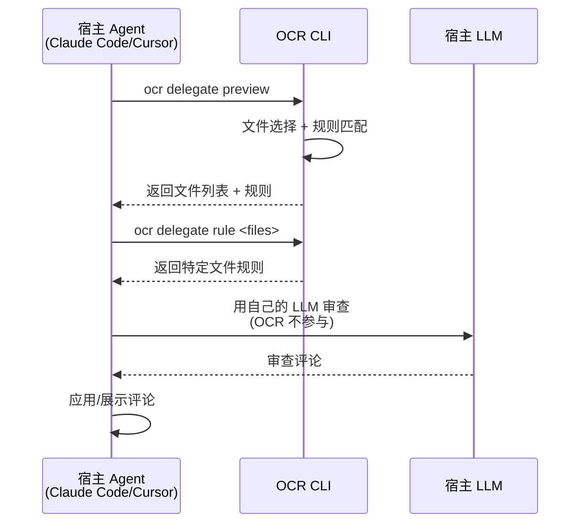

# Open Code Review 完全指南 — CLI 命令参考

本章是 `ocr` 命令行工具的完整参考，覆盖全部 10 个子命令、所有 flag、三种审查模式、JSON 输出格式、退出码以及共享 flag 的默认值与行为。

---

## 1. 命令体系总览

OCR 采用 Cobra 框架构建命令行接口，根命令为 `ocr`，下设 10 个子命令，覆盖审查、扫描、配置、会话管理等全部功能。

### 1.1 命令树

```mermaid
graph TB
    ocr["ocr<br/>根命令"]

    ocr --> version["version<br/>显示版本信息"]
    ocr --> review["review, r<br/>运行代码审查"]
    ocr --> scan["scan, s<br/>全文件扫描"]
    ocr --> delegate["delegate, d<br/>委托模式"]
    ocr --> session["session, sessions<br/>会话管理"]
    ocr --> config["config<br/>配置管理"]
    ocr --> llm["llm<br/>LLM 工具"]
    ocr --> rules["rules<br/>规则自查"]
    ocr --> viewer["viewer, v<br/>Web 查看器"]
    ocr --> completion["completion<br/>Shell 补全"]

    review --> reviewWS["workspace 模式<br/>默认"]
    review --> reviewRange["range 模式<br/>--from --to"]
    review --> reviewCommit["commit 模式<br/>--commit"]

    scan --> scanAll["全仓库扫描"]
    scan --> scanPath["指定路径扫描<br/>--path"]
    scan --> scanResume["恢复扫描<br/>--resume"]

    delegate --> delegatePreview["preview<br/>预览文件+规则"]
    delegate --> delegateRule["rule<br/>查看特定文件规则"]

    session --> sessionList["list, ls<br/>列出会话"]
    session --> sessionShow["show<br/>查看会话详情"]
    session --> sessionComments["comments<br/>查看会话评论"]

    config --> configSet["set<br/>设置配置值"]
    config --> configUnset["unset<br/>删除配置项"]
    config --> configProvider["provider<br/>交互式 provider 配置"]
    config --> configModel["model<br/>交互式 model 选择"]

    llm --> llmTest["test<br/>连接测试"]
    llm --> llmProviders["providers<br/>列出内置 provider"]

    rules --> rulesCheck["check<br/>查看文件命中规则"]

    style review fill:#fff3e0,stroke:#ef6c00
    style scan fill:#fff3e0,stroke:#ef6c00
    style delegate fill:#e8f5e9,stroke:#2e7d32
    style session fill:#e3f2fd,stroke:#1565c0
```



### 1.2 命令别名表

为提升日常使用效率，OCR 为高频命令提供别名：

| 完整命令 | 别名 | 说明 |
|---------|------|------|
| `ocr review` | `ocr r` | 运行代码审查 |
| `ocr scan` | `ocr s` | 全文件扫描 |
| `ocr delegate` | `ocr d` | 委托模式 |
| `ocr viewer` | `ocr v` | 启动 Web 查看器 |
| `ocr session` | `ocr sessions` | 会话管理（含复数形式） |
| `ocr session list` | `ocr session ls`、`ocr sessions list` | 列出会话 |
| `ocr session show` | `ocr sessions show` | 查看会话 |
| `ocr session comments` | `ocr sessions comments` | 查看评论 |
| `ocr review --commit` | `ocr review -c` | 单 commit 审查 |
| `ocr review --preview` | `ocr review -p` | 预览模式 |
| `ocr review --format` | `ocr review -f` | 输出格式 |
| `ocr review --background` | `ocr review -b` | 业务上下文 |
| `ocr version` | `ocr --version`、`ocr -V` | 版本信息 |

### 1.3 命令总览表

| 命令 | 别名 | 作用 |
|------|------|------|
| `ocr review` | `ocr r` | 运行代码审查并输出评论 |
| `ocr scan` | `ocr s` | 无需 Git diff，扫描完整文件 |
| `ocr delegate` | `ocr d` | 委托模式：宿主 Agent 自行审查 |
| `ocr session` | `ocr sessions` | 列出和查看保存的审查会话 |
| `ocr config` | — | 管理配置（set/unset/provider/model） |
| `ocr llm` | — | LLM 工具（test/providers） |
| `ocr rules` | — | 规则自查（check） |
| `ocr viewer` | `ocr v` | 启动 Web UI 会话查看器 |
| `ocr version` | — | 显示版本信息 |
| `ocr completion` | — | 生成 Shell 补全脚本 |

> `ocr` 和 `ocr -h` 打印顶层用法。每个子命令也接受 `-h` / `--help`。

---

## 2. ocr review 详解

`ocr review` 是 OCR 的主命令，解析 Git diff，分发 per-file 子 agent，收集审查评论并打印。

### 2.1 概要

```bash
ocr review [flags]
ocr r      [flags]   # 别名
```

若不传任何参数，OCR 以**工作区模式**运行——审查当前目录所在仓库中所有 staged + unstaged + untracked 变更。

### 2.2 三种审查模式

#### 工作区模式（默认）

```bash
ocr review
```

OCR 从两条 git 命令组装工作树变更：

1. 通过 `git diff HEAD` 获取已跟踪变更（staged + unstaged 合并对比 `HEAD`；若为空则回退到 `git diff --staged`）
2. 通过 `git ls-files --others --exclude-standard` 获取 untracked 文件，从磁盘读取并作为整文件新增处理

> 这通常是 commit 前你想要的。如需更小的范围，请选择性暂存。

#### 区间模式（Range）

```bash
ocr review --from main --to feature-branch
```

OCR 计算 `merge-base(main, feature-branch)..feature-branch`，因此你只看到 feature 分支**引入**的 diff——而非分支切出后落到 `main` 上的无关变更。

#### Commit 模式

```bash
ocr review --commit abc123
ocr review -c abc123
```

审查 `git show abc123` 产生的 diff（即该 commit 引入的变更）。

#### 模式互斥规则

> **重要**：模式参数互斥——传 `--from`/`--to`，或 `--commit`，或都不传（工作区模式）。混用会直接报错。`--resume` 仅支持区间或单 commit 评审，不能与 `--preview` 同时使用。

| 组合 | 是否允许 | 说明 |
|------|---------|------|
| 不传任何模式参数 | ✅ | 工作区模式 |
| `--from` + `--to` | ✅ | 区间模式 |
| `--commit` | ✅ | Commit 模式 |
| `--from` + `--to` + `--commit` | ❌ | 报错：模式互斥 |
| `--resume` + `--preview` | ❌ | 报错：不可同时使用 |
| `--resume` + 工作区模式 | ❌ | 工作区评审不能恢复 |

### 2.3 完整 Flag 表

| 参数 | 简写 | 默认值 | 说明 |
|------|------|--------|------|
| `--repo <path>` | — | 当前目录 | Git 仓库根 |
| `--from <ref>` | — | — | diff 起始 ref（如 main） |
| `--to <ref>` | — | — | diff 结束 ref。设置后计算 `merge-base(from, to)..to` |
| `--commit <sha>` | `-c` | — | 审查单个 commit（相对其父） |
| `--preview` | `-p` | `false` | 运行过滤流水线但跳过 LLM，打印文件列表与排除原因 |
| `--resume <session-id>` | — | — | 从之前兼容的区间或单 commit 评审会话恢复 |
| `--format <fmt>` | `-f` | `text` | `text`（人类可读）或 `json`（机器可读评论数组） |
| `--audience <who>` | — | `human` | `human` 流式输出进度行；`agent` 静默 stdout，只打印最终摘要/JSON |
| `--background <text>` | `-b` | — | 注入 plan + main prompt 的可选需求/业务上下文 |
| `--concurrency <n>` | — | `8` | 并行审查的最大文件数 |
| `--timeout <minutes>` | — | `10` | 每文件截止时间。`0` 关闭超时 |
| `--rule <path>` | — | — | 自定义 JSON 审查规则文件路径，覆盖项目级与全局 rule.json |
| `--max-tools <n>` | — | 模板默认 | 每文件最大工具调用轮数。`0` 用模板默认（30）；1-9 会被上调到 10；≥10 的值覆盖模板默认 |
| `--provider <name>` | — | — | 为本次运行选择已配置的 provider |
| `--model <name>` | — | — | 为本次运行覆盖已解析出的 LLM model |
| `--max-git-procs <n>` | — | `16` | 并发 git 子进程的最大数 |
| `--tools <path>` | — | 内嵌 | 自定义 JSON 工具配置文件路径，覆盖内嵌工具定义 |

### 2.4 单次运行的 LLM 选择

`review` 和 `scan` 都接受 `--provider` 与 `--model`，这些覆盖**仅作用于当前调用**，不会修改已保存的配置：

```bash
ocr review --provider anthropic --model claude-opus-4-6 --format json
ocr scan --provider openai --model gpt-5.4 --format json
```

**解析逻辑**：

- 显式 `--provider` 会在常规来源解析前，从已保存的 `providers` 或 `custom_providers` 中选择条目
- 不传 `--provider` 时，OCR 保持原有来源顺序：已保存的配置 → `OCR_LLM_*` 环境变量 → Claude Code 环境变量 → shell rc 文件
- `--model` 会覆盖最终选中来源中的 model，但不改变来源顺序
- 不完整的策略会继续回退，而不会与其他策略混合
- 选中的内置 provider 仍可从其支持的环境变量读取凭据

### 2.5 恢复中断的评审

每次 `ocr review` 都会在 `~/.opencodereview/sessions/` 下保存本地会话日志。正常完成的文本输出只展示评审结果，不打印 session ID；可使用 `ocr session list/show` 查找已保存会话，或用 `--format json` 在机器可读输出中获取 `session_id`。

如果区间或单 commit 评审被中断，先列出已保存会话，再从与当前评审目标一致的会话恢复：

```bash
# 1. 列出会话
ocr session list

# 2. 查看会话详情
ocr session show <session-id>

# 3. 查看会话中已记录的评论
ocr session comments <session-id>

# 4. 恢复区间评审
ocr review --from main --to feature-branch --resume <session-id>

# 5. 恢复单 commit 评审
ocr review --commit abc123 --resume <session-id>
```

**恢复逻辑是严格的**：

- 工作区评审不能恢复
- 区间评审必须使用相同的 `--from` 和 `--to`
- 单 commit 评审必须使用相同的 `--commit`
- `--preview` 和 `--resume` 不能同时使用

### 2.6 输出格式

#### Text（默认，`--audience human`）

评审运行时流式输出进度行，随后每条评论一个块（带 `path:start-end` 的暗色 Unicode 分隔头、按 100 列折行的评论正文，以及存在时的建议替换的彩色内联 diff）。运行结束时 stdout 末尾打印摘要：

```
[ocr] 17 file(s) changed, reviewing 9 in /path/to/repo
[ocr] Skipping image.png — filtered by path/extension rules
[ocr]   ▶ file_read "src/foo.go"
[ocr]   ✔ file_read (12ms)
[ocr] Plan completed for src/foo.go
…

─── src/foo.go:42-47 ───
Concurrent map access without a lock — wrap with sync.RWMutex.

- m[k] = v
+ mu.Lock(); defer mu.Unlock(); m[k] = v

…
[ocr] Summary: 9 file(s) reviewed, 14 comment(s), ~21344 token(s) used (input: ~18012, output: ~3332), 1m12s elapsed
```

#### Text（agent，`--audience agent`）

评论输出相同，但通过一个内部可静默的 stdout writer 屏蔽进度行（见 `internal/stdout`）。在 CI/流水线中交给另一个 agent 时使用。

> **注意**：`--audience agent` **并不**隐含 `--format json`。两者控制不同的事——屏蔽 UI vs 结构化载荷。需要二者兼得时组合使用。

### 2.7 退出码

| 退出码 | 含义 |
|--------|------|
| `0` | 评审完成（可能零评论，可能有非致命警告） |
| `1` | 致命错误——参数错误、无法解析 LLM 端点、所有 per-file 子 agent 失败等。错误文本打印到 stderr |

非致命警告（单个子 agent 失败、某文件超过 token 阈值等）内联打印；JSON 模式下会加入 `warnings` 数组。

---

## 3. ocr scan 详解

`ocr scan` 用于全文件扫描——无需 Git diff，直接审查完整文件内容。适用于审计陌生的代码库或没有有意义 diff 的目录。

### 3.1 概要

```bash
ocr scan [flags]
ocr s    [flags]   # 别名
```

### 3.2 使用示例

```bash
# 扫描整个仓库
ocr scan

# 扫描指定目录或文件
ocr scan --path internal/agent

# 扫描多个路径
ocr scan --path src/main.go --path src/handler.go

# 恢复中断的全量文件扫描
ocr scan --resume <session-id>

# JSON 输出（CI/CD）
ocr scan --format json --audience agent
```

### 3.3 独立 Flag

`ocr scan` 除共享 flag 外，还支持以下独立 flag：

| 参数 | 默认值 | 说明 |
|------|--------|------|
| `--path <path>` | 当前目录 | 指定扫描目录或文件，可多次指定 |
| `--no-plan` | `false` | 跳过 plan 阶段，直接进入审查 |
| `--no-dedup` | `false` | 禁用评论去重 |
| `--no-summary` | `false` | 不打印运行结束摘要 |
| `--batch <n>` | — | 批量扫描的批次大小 |

> `ocr scan` 同样支持 `--provider`、`--model`、`--concurrency`、`--timeout`、`--rule`、`--format`、`--audience` 等共享 flag，详见 [第 11 节：共享 Flag 详解](#11-共享-flag-详解)。

---

## 4. ocr session 详解

列出和查看保存在 `~/.opencodereview/sessions/` 下的本地评审会话日志。可用它查找 session ID、查看逐文件检查点状态，并恢复中断的区间或单 commit 评审。

### 4.1 概要

```bash
ocr session <sub-command>
ocr sessions <sub-command>   # 别名

Sub-commands:
  list, ls        List recent review sessions for the current repo
  show <id>       Show one session's metadata and per-file items
  comments <id>   Show the review comments recorded in one session
```

### 4.2 ocr session list

```bash
ocr session list
ocr session list --limit 50
ocr session list --json
```

| 参数 | 默认值 | 说明 |
|------|--------|------|
| `--repo <path>` | 当前目录 | 要列出会话的仓库 |
| `--json` | `false` | 以 JSON 输出会话摘要 |
| `--limit <n>` | `20` | 限制列出的会话数量。使用 `0` 表示不限制 |

### 4.3 ocr session show

```bash
ocr session show <session-id>
ocr session show --json <session-id>
ocr session show --repo /path/to/repo <session-id>
```

| 参数 | 默认值 | 说明 |
|------|--------|------|
| `--repo <path>` | 当前目录 | 要查看会话的仓库 |
| `--json` | `false` | 以 JSON 输出会话元数据和逐文件条目 |

输出会话中保存的所有评审评论，渲染风格与 `ocr review` 的终端输出一致（路径、行范围、严重程度标签、建议 diff）。

### 4.4 ocr session comments

输出单个会话中记录的评审评论，支持按严重程度和类别过滤：

```bash
ocr session comments <session-id>
ocr session comments --json <session-id>
ocr session comments --severity high <session-id>
ocr session comments --severity critical,high --category bug,security <session-id>
```

| 参数 | 默认值 | 说明 |
|------|--------|------|
| `--repo <path>` | 当前目录 | 要查看会话的仓库 |
| `--json` | `false` | 以 JSON 数组输出评论 |
| `--severity <list>` | 全部 | 逗号分隔的要包含的严重程度（`critical`、`high`、`medium`、`low`） |
| `--category <list>` | 全部 | 逗号分隔的要包含的类别（如 `bug`、`security`） |

---

## 5. ocr viewer 详解

启动一个内嵌 HTTP 服务器，读取 `~/.opencodereview/sessions/...`，以浏览器友好的 UI 渲染历史评审会话。

### 5.1 概要

```bash
ocr viewer [flags]
ocr v      [flags]   # 别名
```

### 5.2 Flag

| 参数 | 默认值 | 说明 |
|------|--------|------|
| `--addr <address>` | `localhost:5483` | 监听地址 |

### 5.3 使用示例

```bash
# 默认端口启动
ocr viewer

# 绑定到所有接口的 3000 端口
ocr viewer --addr :3000

# 仅本机访问的 8080 端口
ocr viewer --addr 127.0.0.1:8080
```

启动后，浏览器访问 `http://localhost:5483`（或自定义地址）即可浏览历史评审会话，支持查看评论、行号定位、建议 diff 渲染等。

> 详细的会话查看器说明见第 7 章[会话持久化、遥测与查看器](07-session-telemetry.md)。

---

## 6. ocr delegate 详解

委托模式（Delegation Mode）让宿主 AI 编程 Agent（如 Claude Code、Cursor）使用**自己的 LLM** 执行代码审查。OCR 负责文件选择和规则解析，宿主 Agent 负责实际的 LLM 调用——**无需配置 OCR 的 API key**。

### 6.1 概要

```bash
ocr delegate <sub-command>
ocr d        <sub-command>   # 别名
```

### 6.2 子命令

#### delegate preview

```bash
ocr delegate preview
```

预览 OCR 将交给宿主 Agent 的文件列表与对应规则，不调用任何 LLM。用于在委托模式前确认文件选择和规则匹配是否符合预期。

#### delegate rule

```bash
ocr delegate rule <file1> <file2> ...
```

查看特定文件将应用的审查规则：

```bash
ocr delegate rule src/main.go src/handler.go
```

输出每个文件的路径、命中的规则来源层、glob 模式和规则文本，与 `ocr rules check` 类似，但输出格式针对委托场景优化。

### 6.3 委托模式工作流程



> 详细的委托模式与 Agent 集成说明见第 8 章[集成与扩展](08-integrations.md)。

---

## 7. ocr config 详解

将 key 持久化到 `~/.opencodereview/config.json`，并提供交互式配置 TUI。

### 7.1 概要

```bash
ocr config <sub-command>
```

### 7.2 子命令

| 子命令 | 说明 |
|--------|------|
| `ocr config set <key> <value>` | 非交互式写入单个配置值 |
| `ocr config unset custom_providers.<name>` | 删除一个自定义 provider |
| `ocr config provider` | 启动交互式 provider 配置 TUI |
| `ocr config model` | 启动交互式 model 选择 TUI |

### 7.3 set 用法

```bash
# 设置 LLM URL
ocr config set llm.url https://api.anthropic.com/v1/messages

# 设置认证 token
ocr config set llm.auth_token sk-ant-xxxxx

# 设置模型
ocr config set llm.model claude-opus-4-6

# 启用 Anthropic 协议
ocr config set llm.use_anthropic true

# 非交互式设置 provider
ocr config set provider anthropic

# 非交互式设置 model
ocr config set model claude-opus-4-6
```

### 7.4 unset 用法

`unset` 仅支持 `custom_providers.<name>`。若删除的是当前启用的 provider，则 `provider` 和 `model` 被清空（需运行 `ocr config provider` 重新选择）：

```bash
ocr config unset custom_providers.my-custom-endpoint
```

### 7.5 provider（交互式 TUI）

```bash
ocr config provider
```

启动交互式 provider 配置 TUI，引导你完成：
1. Provider 选择（内置或自定义）
2. API key 输入
3. Model 配置
4. 连接测试

### 7.6 model（交互式 TUI）

```bash
ocr config model
```

启动交互式 model 选择 TUI，列出当前 provider 支持的模型供选择。

> 完整的 key 参考、schema 与示例见第 4 章[LLM 协议与 Provider](04-llm-providers.md)。

---

## 8. ocr llm 详解

LLM 工具命令，用于测试连接和列出内置 provider。

### 8.1 概要

```bash
ocr llm <sub-command>

Sub-commands:
  test         Send a test conversation to the configured LLM model
  providers    List all built-in LLM providers
```

### 8.2 ocr llm test

```bash
ocr llm test
```

以与 `ocr review` 完全相同的方式解析 LLM 端点，从 `internal/config/testconnection/task.json` 发送一条预置 chat 请求，并打印：

```
Source: config.json
URL:    https://api.anthropic.com/v1/messages
Model:  claude-opus-4-6
Hello! I'm ready to review your code.
✓ Connection test successful
```

非零退出意味着端点未完整配置，或请求失败（网络/鉴权/模型错误）。错误信息会指明具体是哪一种。

### 8.3 ocr llm providers

```bash
ocr llm providers
```

以三列表格列出每个内置 LLM provider：

```
Built-in providers:
  NAME             PROTOCOL    BASE URL
  ----             --------    --------
  anthropic        anthropic   https://api.anthropic.com
  openai           openai      https://api.openai.com/v1
  ...
```

OCR 内置 **19 个 provider**，覆盖主流 LLM 服务商，包括但不限于：

| Provider | 协议 | 典型用途 |
|----------|------|---------|
| `anthropic` | anthropic | Claude 系列 |
| `openai` | openai | GPT 系列 |
| `deepseek` | openai 兼容 | DeepSeek 模型 |
| `azure-openai` | openai 兼容 | Azure OpenAI |
| `baidu-qianfan` | 自定义 | 百度千帆 |
| `...` | ... | 共 19 个内置 provider |

随后是一条提示，可用 `ocr config provider` 交互式配置，或用 `ocr config set provider <name>` 非交互式配置。

---

## 9. ocr rules 详解

规则自查工具，只有一个子命令 `check`。

### 9.1 概要

```bash
ocr rules check [flags] <file-path>

Flags:
  --repo <path>    Git repository root (default: current dir)
  --rule <path>    Path to a custom rule JSON file
```

### 9.2 工作原理

对给定文件路径，OCR 会：

1. 遍历四层规则链（`custom → project → global → system`）
2. 取第一条匹配
3. 打印**来源层**、匹配的 **glob 模式**，以及解析出的**规则文本**

### 9.3 使用示例

```bash
$ ocr rules check src/main/java/com/example/Foo.java
File: src/main/java/com/example/Foo.java
Source: System built-in
Pattern: **/*.java
Rule:
────────────────────────────────────────
<contents of internal/config/rules/rule_docs/java.md>
────────────────────────────────────────
```

可用于排查"为什么我的自定义规则没触发？"——完整的优先级说明见第 6 章[审查规则系统](06-review-rules.md)。

---

## 10. JSON 输出格式

使用 `--format json` 时，OCR 输出机器可读的 JSON 结构，适用于 CI/CD 流水线和其他 Agent 解析。

### 10.1 完整 JSON 示例

```bash
ocr review --format json --audience agent
```

```json
{
  "status": "success",
  "llm": {
    "provider": "anthropic",
    "model": "claude-opus-4-6"
  },
  "summary": {
    "files_reviewed": 9,
    "comments": 1,
    "total_tokens": 21344,
    "input_tokens": 18012,
    "output_tokens": 3332,
    "elapsed": "1m12s"
  },
  "comments": [
    {
      "path": "src/foo.go",
      "content": "Concurrent map access without a lock — wrap with sync.RWMutex.",
      "start_line": 42,
      "end_line": 47,
      "existing_code": "m[k] = v",
      "suggestion_code": "mu.Lock(); defer mu.Unlock(); m[k] = v",
      "thinking": "Looking at line 42, the map …"
    }
  ],
  "warnings": [
    {
      "file": "src/bar.go",
      "error": "token budget exceeded"
    }
  ],
  "session_id": "abc123-def456-..."
}
```

### 10.2 顶层字段说明

| 字段 | 说明 |
|------|------|
| `status` | `success`、`completed_with_warnings`、`completed_with_errors` 或 `skipped` |
| `llm` | 实际解析的 LLM 标识。规范化后的 model 始终存在；provider 仅在使用已命名的配置 provider 时存在 |
| `message` | 可选。人类可读摘要，如 `"No comments generated. Looks good to me."` |
| `summary` | 可选。运行聚合：`files_reviewed`、`comments`、`total_tokens`、`input_tokens`、`output_tokens`、`cache_read_tokens`（omitempty）、`cache_write_tokens`（omitempty）、`elapsed`。`skipped` 运行时省略 |
| `comments` | 总是存在，可能为空。每条评论包含 `path`、`content`、`start_line`、`end_line`、`existing_code`、`suggestion_code`、`thinking` |
| `warnings` | 可选。当一个或多个子 agent 失败时存在；每条描述受影响文件与错误 |
| `session_id` | 可选。持久化的评审运行会包含该字段；可传给 `ocr review --resume <session-id>` |
| `resume` | 可选。恢复运行时存在，包含 `resumed_from`、`reused_files`、`rerun_files`、`previous_model`、`current_model` |

### 10.3 comments 数组字段

每条评论包含以下字段：

| 字段 | 类型 | 说明 |
|------|------|------|
| `path` | string | 文件路径（相对仓库根） |
| `content` | string | 评论正文 |
| `start_line` | integer | 起始行号 |
| `end_line` | integer | 结束行号 |
| `existing_code` | string | 存在问题的工作区代码 |
| `suggestion_code` | string | 建议的替换代码 |
| `thinking` | string | LLM 的推理过程（可选） |

### 10.4 skipped 状态

当没有文件可评审时，JSON 模式会发一个 `skipped` 外壳，以便调用方区分"无变更"与"无发现"：

```json
{
  "status": "skipped",
  "message": "No supported files changed.",
  "llm": {
    "provider": "anthropic",
    "model": "claude-opus-4-6"
  },
  "comments": []
}
```

### 10.5 CI/CD 中的典型用法

```bash
# 提取评论数量
COMMENTS=$(ocr review --from main --to feature --format json --audience agent | jq '.comments | length')

# 检查是否有 critical 严重程度的评论
HAS_CRITICAL=$(ocr review --format json --audience agent | \
  jq '.comments[] | select(.severity == "critical") | .path' | wc -l)

# 获取 session_id 用于后续恢复
SESSION_ID=$(ocr review --from main --to feature --format json --audience agent | jq -r '.session_id')
```

---

## 11. 共享 Flag 详解

以下 flag 在 `ocr review` 和 `ocr scan` 中共享，控制审查的并发、超时、工具调用等行为。

### 11.1 并发与超时类 Flag

| Flag | 默认值 | 作用 | 调整场景 |
|------|--------|------|---------|
| `--concurrency <n>` | `8` | 并行审查的最大文件数 | 命中 LLM provider 速率限制时降低；加速大型变更集审查时提高 |
| `--timeout <minutes>` | `10` | 每文件截止时间。`0` 关闭超时 | 大文件或复杂审查需要更多时间时提高 |
| `--max-tools <n>` | `0`（模板默认 30） | 每文件最大工具调用轮数。`0` 用模板默认；1-9 上调到 10；≥10 覆盖模板默认 | 节省 token 时降低 |
| `--max-git-procs <n>` | `16` | 并发 git 子进程的最大数 | 大型仓库或 CI 环境中调整 |
| `--max-tokens-budget <n>` | `0`（不限制） | 整次审查的 token 预算上限 | 控制成本时设置 |

> **注意**：当某文件 diff 单独超过 `MAX_TOKENS` 的 80%（默认 `58888`）时，会在调用 LLM 前被丢弃。这会记录日志但不会使运行失败。

```bash
# 降低并发避免速率限制，每文件最多 5 分钟
ocr review --concurrency 4 --timeout 5

# 限制工具调用为 20 轮（节省 token）
ocr review --max-tools 20
```

### 11.2 输出控制类 Flag

| Flag | 默认值 | 可选值 | 作用 |
|------|--------|--------|------|
| `--format <fmt>` | `text` | `text`、`json` | `text` 人类可读；`json` 机器可读评论数组 |
| `--audience <who>` | `human` | `human`、`agent` | `human` 流式输出进度行；`agent` 静默 stdout，只打印最终摘要/JSON |
| `--background <text>`，`-b` | 空 | — | 注入 plan + main prompt 的业务上下文，**提升评审质量最有效的参数之一** |
| `--rule <path>` | 空（四层规则链） | — | 自定义 JSON 规则文件，覆盖项目级与全局 rule.json（优先级最高） |
| `--tools <path>` | 内嵌 | — | 自定义 JSON 工具配置文件，覆盖内嵌工具定义 |

> **重要**：`--audience agent` **并不**隐含 `--format json`。两者控制不同的事——屏蔽 UI vs 结构化载荷。需要二者兼得时组合使用：`--audience agent --format json`。

```bash
# 传入业务上下文（强烈推荐）
ocr review -b "feat: 新增用户认证模块，需检查 OAuth 流程安全性"

# CI/CD 最佳实践
ocr review --format json --audience agent -b "$(cat pr_body.txt)"

# 使用自定义规则
ocr review --rule /path/to/custom-rules.json
```

---

## 12. 提示与注意事项

### 12.1 自动跳过 plan 阶段

当某文件变更行数低于 `PLAN_MODE_LINE_THRESHOLD`（`50`）时，plan 阶段会被**自动跳过**，以节省 token 和加速审查。这是设计上的优化——小变更不需要复杂的规划阶段。

### 12.2 Token 预算与文件丢弃

某文件 diff 单独超过 `MAX_TOKENS` 的 80%（默认 `58888`）时，会在调用 LLM 前被**丢弃**。这会记录日志但不会使运行失败。若需审查超大文件，考虑：

- 使用 `ocr scan --path` 分块扫描
- 拆分大 commit 为多个小 commit
- 调整 `--max-tokens-budget`

### 12.3 --background 的重要性

`--background` 是提升评审质量最有效的参数之一。它允许你向 OCR 注入业务上下文、需求描述、PR 说明等信息，使 LLM 能更准确地理解代码意图，减少误报。

**最佳实践**：从其他 agent 调用时，始终传入需求/PR 描述：

```bash
# 手动传入
ocr review -b "修复用户登录失败时的重定向问题"

# 从 PR body 读取
ocr review --from main --to feature -b "$(gh pr view --json body -q .body)"
```

### 12.4 audience 与 format 的独立性

| 组合 | 行为 |
|------|------|
| `--audience human --format text` | 默认，流式进度 + 人类可读评论 |
| `--audience human --format json` | 流式进度 + JSON 输出 |
| `--audience agent --format text` | 静默进度 + 人类可读评论 |
| `--audience agent --format json` | 静默进度 + JSON 输出（CI/CD 推荐） |

### 12.5 完整命令速查

| 场景 | 命令 |
|------|------|
| 工作区审查 | `ocr review` |
| 区间审查 | `ocr review --from main --to feature` |
| Commit 审查 | `ocr review --commit abc123` |
| 预览（不调 LLM） | `ocr review --preview` |
| CI/CD 输出 | `ocr review --format json --audience agent` |
| 恢复中断 | `ocr review --resume <session-id>` |
| 全仓库扫描 | `ocr scan` |
| 指定路径扫描 | `ocr scan --path internal/agent` |
| 委托预览 | `ocr delegate preview` |
| 列出会话 | `ocr session list --limit 50` |
| 查看评论（过滤） | `ocr session comments --severity critical,high <id>` |
| 交互式配置 | `ocr config provider` / `ocr config model` |
| 非交互式设置 | `ocr config set llm.model claude-opus-4-6` |
| 连接测试 | `ocr llm test` |
| 列出 provider | `ocr llm providers` |
| 规则自查 | `ocr rules check src/main.java` |
| Web 查看器 | `ocr viewer` / `ocr viewer --addr :3000` |
| 版本信息 | `ocr version` |

---

## 13. 另见

- [安装与配置](01-installation.md)——安装并完成首次评审
- [LLM 协议与 Provider](04-llm-providers.md)——参数背后的环境变量与 config key
- [审查规则系统](06-review-rules.md)——`--rule` 参数与规则解析
- [集成与扩展](08-integrations.md)——从 agent 与 CI 调用 `ocr review`

---

- ← [返回目录](00-overview.md) | [上一章：安装与配置](01-installation.md) | [下一章：核心架构](03-architecture.md) →
