# Open Code Review 完全指南 — 核心架构

> 本章深入解析 Open Code Review 的核心架构设计——一种"确定性工程 × Agent 混合"的审查流水线，涵盖六阶段流水线、Agent 模块、Subtask 两阶段执行、Main Loop、三区内存压缩、Diff/Scan 模块、估算模型与 Manifest 可追溯性。

---

## 1. 架构总览：确定性工程 × Agent 混合设计哲学

Open Code Review（以下简称 OCR）的架构并非"全 Agent"方案，而是采用**确定性工程 × Agent 混合**的设计哲学。这一选择体现了对审查任务本质的深刻理解：

### 1.1 为什么不"全 Agent"？

纯 Agent 方案存在三个固有缺陷，在代码审查场景下尤其致命：

| 缺陷 | 表现 | 审查场景下的危害 |
|------|------|----------------|
| **不可预测性** | LLM 输出存在随机性，相同输入可能产生不同结论 | 审查结果无法复现，团队难以建立信任基线 |
| **成本失控** | Agent 自主决定循环次数和工具调用频率 | 大型 PR 的审查成本可能爆炸式增长 |
| **可观测性差** | 黑盒决策过程难以审计 | 无法回答"为什么这条评论被产出/未被产出" |

### 1.2 确定性工程的价值

OCR 将"能确定的部分"用确定性代码完成，只把"需要语义判断的部分"交给 Agent：

- **确定性部分**：Diff 提取、文件过滤、规则匹配、并发调度、预算控制、输出格式化、Manifest 生成
- **Agent 部分**：代码语义理解、缺陷识别、建议生成、上下文摘要

这种分工带来三个工程价值：

1. **可复现性**：相同输入 + 相同 Manifest = 可复现的审查过程
2. **成本可控**：预算前瞻 + 估算模型让成本在执行前可预测
3. **可审计性**：每个评论都可追溯到具体的 Subtask、Rule 和 Manifest 摘要

### 1.3 架构分层

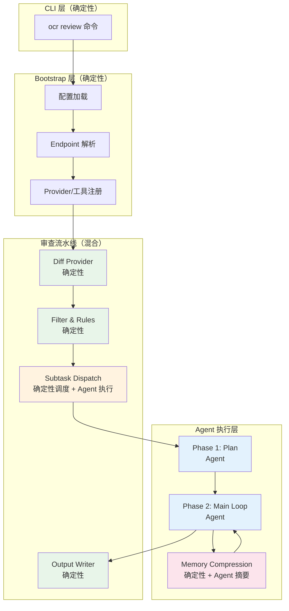

> **关键洞察**：图中绿色部分为纯确定性代码，蓝色部分为 Agent 驱动，橙色部分为确定性调度包裹 Agent 执行，粉色部分为混合（确定性触发 + Agent 摘要）。这种分层让"工程治理 Agent"而非"Agent 驱动工程"。

---

## 2. 审查流水线六阶段

OCR 的审查流水线由六个明确阶段构成，每个阶段都有清晰的输入、输出和职责边界。

### 2.1 六阶段 Mermaid 图

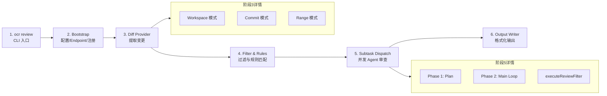

### 2.2 各阶段职责

| 阶段 | 入口 | 核心职责 | 确定性 |
|------|------|---------|--------|
| 1. CLI 入口 | `ocr review` | 解析命令行参数，构建 Args | ✅ 确定性 |
| 2. Bootstrap | 配置加载 | 加载 config.json、解析 Endpoint、注册 Provider 与工具 | ✅ 确定性 |
| 3. Diff Provider | `internal/diff/` | 提取变更内容（三种模式） | ✅ 确定性 |
| 4. Filter & Rules | `internal/agent/` | 应用黑名单、规则匹配、过滤无关文件 | ✅ 确定性 |
| 5. Subtask Dispatch | `internal/agent/agent.go` | 并发调度 Agent 审查每个文件 | 🔀 混合 |
| 6. Output Writer | `internal/output/` | 格式化评论、生成 Manifest、写出结果 | ✅ 确定性 |

### 2.3 阶段间数据流

```
Args (24字段)
    ↓
DiffResult[] (含 DiffMap)
    ↓
FilteredDiff[] (规则过滤后)
    ↓
Subtask[] (每个文件一个 Subtask)
    ↓
ReviewComment[] (Agent 产出的评论)
    ↓
OutputDocument (含 Manifest 三摘要)
```

---

## 3. Agent 模块详解（internal/agent/agent.go）

Agent 模块是 OCR 的核心调度器，负责将确定性流水线与 Agent 执行层衔接。

### 3.1 Args 结构体：24 个字段

`Args` 结构体是审查任务的完整描述，包含 24 个字段，覆盖输入、预算、规则、工具、输出等全部维度：

```go
// internal/agent/agent.go
type Args struct {
    // === 输入控制 ===
    DiffMode          string   // Workspace/Commit/Range
    BaseRef           string   // 基线引用
    HeadRef           string   // 目标引用
    Paths             []string // 限定路径

    // === 预算控制 ===
    MaxTokensBudget   int      // 总 Token 预算
    MaxConcurrency    int      // 最大并发数（默认 8）

    // === 规则与过滤 ===
    RuleConfig        RuleConfig
    FilterConfig      FilterConfig
    IgnoreDirs        []string

    // === Agent 执行 ===
    LLMClient         LLMClient
    Tools             *Registry
    ModelName         string
    MaxToolRequestTimes int

    // === 输出控制 ===
    OutputFormat      string
    OutputPath        string
    IncludeManifest   bool

    // === 其他 ===
    // ... 其余字段
}
```

> **设计要点**：24 个字段的存在反映了审查任务的复杂度——任何"简化"的 Args 都会丢失对成本、规则、并发等关键维度的控制。这是"确定性工程"的具体体现：所有可配置项都是显式的。

### 3.2 Run() 方法：5 步 Pipeline

`Run()` 是 Agent 模块的入口方法，执行五步流水线：

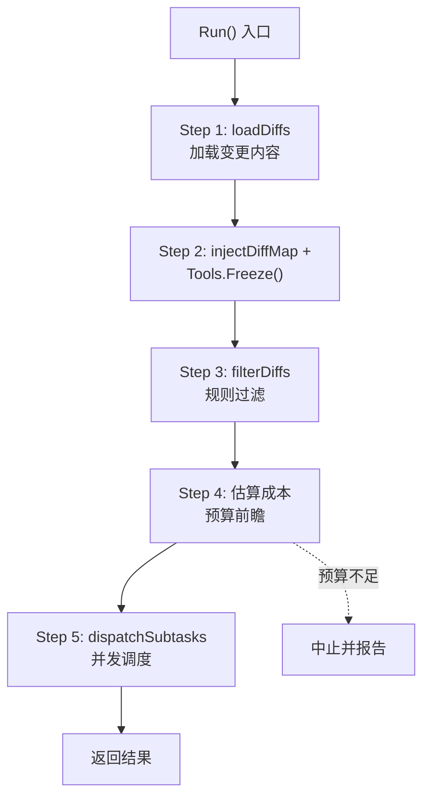

#### Step 1: loadDiffs

调用 Diff 模块，根据 `DiffMode` 提取变更内容，构建 `DiffMap`：

```go
// internal/agent/agent.go
diffs, err := a.loadDiffs(ctx)
if err != nil {
    return nil, err
}
```

#### Step 2: injectDiffMap + Tools.Freeze()

将 DiffMap 注入工具注册表（供 `file_read_diff` 工具使用），并冻结工具注册：

```go
a.Tools.injectDiffMap(diffs)
a.Tools.Freeze() // 冻结后禁止注册新工具
```

> **冻结的意义**：`Freeze()` 后任何 `Register` 调用都会 panic。这确保 Agent 执行期间工具集不可变，防止 Agent 通过注册"后门工具"绕过工程治理。

#### Step 3: filterDiffs

应用规则和黑名单过滤：

```go
filtered := a.filterDiffs(diffs)
```

#### Step 4: 估算成本

基于估算模型（详见第 9 节）计算预期 Token 消耗，与 `MaxTokensBudget` 比较。

#### Step 5: dispatchSubtasks

并发调度 Subtask，详见 3.3。

### 3.3 dispatchSubtasks：并发模型

`dispatchSubtasks` 是并发调度的核心，采用**信号量 + goroutine + panic 隔离**的三重保障：

```go
// internal/agent/agent.go
func (a *Args) dispatchSubtasks(ctx context.Context, subtasks []Subtask) []ReviewComment {
    sem := make(chan struct{}, a.MaxConcurrency) // 默认 8
    var wg sync.WaitGroup
    results := make([]ReviewComment, 0)
    resultsMu := sync.Mutex{}

    for _, st := range subtasks {
        // 预算前瞻
        if used+estimate > a.MaxTokensBudget {
            break
        }
        sem <- struct{}{} // 获取信号量
        wg.Add(1)
        go func(st Subtask) {
            defer wg.Done()
            defer func() { <-sem }() // 释放信号量
            defer func() {
                if r := recover(); r != nil {
                    // panic 隔离：单个 Subtask panic 不会影响其他
                    log.Printf("subtask panic: %v", r)
                }
            }()
            comments := a.runSubtask(ctx, st)
            resultsMu.Lock()
            results = append(results, comments...)
            resultsMu.Unlock()
        }(st)
    }
    wg.Wait()
    return results
}
```

#### 三个关键设计

| 设计 | 实现 | 价值 |
|------|------|------|
| **信号量 sem** | `chan struct{}` 容量 8 | 限制并发 goroutine 数量，防止资源耗尽 |
| **goroutine 隔离** | 每个 Subtask 独立 goroutine | 文件间无共享状态，天然并行 |
| **recover panic** | `defer recover()` | 单个文件审查 panic 不影响其他文件 |

### 3.4 预算前瞻逻辑

预算前瞻是"成本可控"的核心机制：

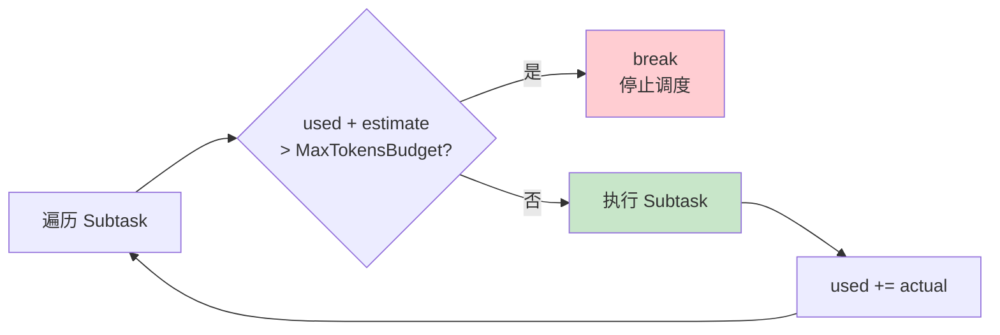

```go
// 伪代码
for _, st := range subtasks {
    estimate := estimateSubtaskCost(st) // 基于估算模型
    if used + estimate > a.MaxTokensBudget {
        break // 预算前瞻：停止调度
    }
    // ... 执行
    used += actualCost
}
```

> **关键洞察**：预算前瞻让"超预算"在调度阶段就被阻止，而非事后才发现。这与"事后审计"有本质区别——前者是预防，后者是亡羊补牢。

---

## 4. Subtask 两阶段执行

每个 Subtask 的执行分为两个阶段：Plan 和 Main Loop。

### 4.1 两阶段架构

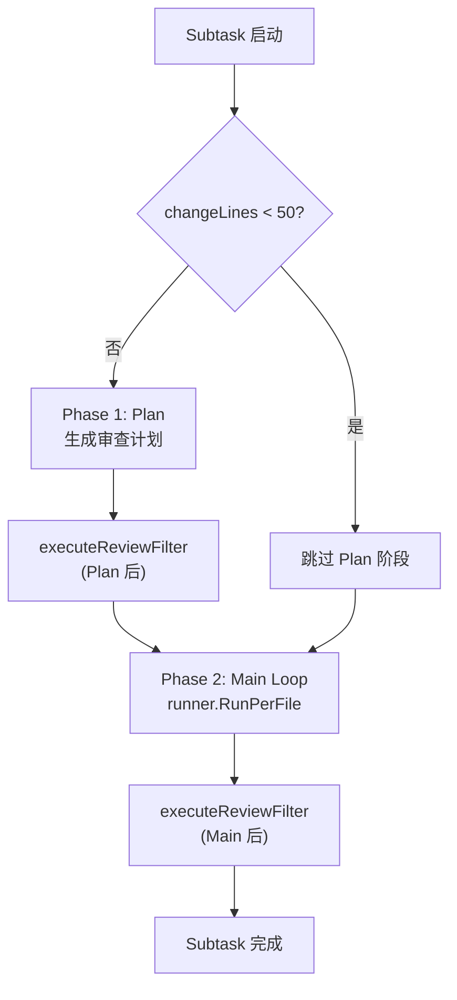

### 4.2 Phase 1: Plan（条件执行）

Plan 阶段让 Agent 先"读题"再"做题"——生成审查计划，识别关键风险点。

**跳过条件**：当 `changeLines < 50` 时跳过 Plan 阶段。设计考量：

- 小变更的"计划"成本可能超过其审查价值
- 小变更的上下文窗口足够容纳全部 diff，无需预先规划
- 减少 Agent 调用次数，降低成本

**Plan 阶段可用的工具**：
- `file_read_diff`：读取 DiffMap 快照
- `file_find`：查找相关文件
- `code_search`：搜索代码模式

> 注意：Plan 阶段**不能**调用 `code_comment` 和 `task_done`，这些是 Main 阶段专属。

### 4.3 Phase 2: Main Loop

Main Loop 是实际产出评论的阶段，由 `runner.RunPerFile` 驱动：

```go
// internal/agent/runner.go
func (r *Runner) RunPerFile(ctx context.Context, st Subtask) []ReviewComment {
    loop := NewLLMLoop(r.LLMClient, r.Tools, r.MaxToolRequestTimes)
    return loop.Run(ctx, st)
}
```

### 4.4 executeReviewFilter

在 Plan 和 Main 之后各执行一次 `executeReviewFilter`，对 Agent 产出的评论进行确定性过滤：

- **去重**：相同 `(path, line, content)` 的评论只保留一条
- **规则过滤**：不符合 RuleConfig 的评论被剔除
- **锚定验证**：`existing_code` 必须能在文件中找到匹配

> **设计要点**：`executeReviewFilter` 是"确定性工程"对"Agent 输出"的治理——Agent 可能产出重复或低质量评论，确定性过滤器确保最终输出符合工程标准。

---

## 5. Main Loop 循环（internal/llmloop/loop.go）

Main Loop 是 Agent 与 LLM 交互的核心循环，定义了"何时调用工具""何时退出"的规则。

### 5.1 循环结构

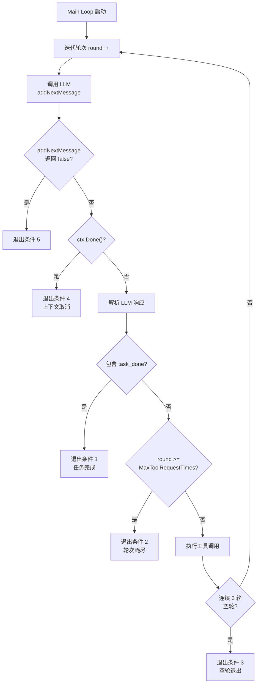

### 5.2 MaxToolRequestTimes

```go
// internal/llmloop/loop.go
const DefaultMaxToolRequestTimes = 30
```

`MaxToolRequestTimes` 默认 30，表示 Agent 最多进行 30 轮工具调用。这是一个**硬上限**，防止 Agent 陷入无限循环。

### 5.3 五个退出条件

| 退出条件 | 触发场景 | 含义 |
|---------|---------|------|
| 1. `task_done` | Agent 调用 `task_done` 工具 | Agent 主动声明审查完成 |
| 2. MaxToolRequestTimes 耗尽 | `round >= 30` | 达到硬上限，强制终止 |
| 3. 连续 3 轮空轮 | 连续 3 轮无工具调用 | Agent 陷入"思考但不行动"，终止 |
| 4. 上下文取消 | `ctx.Done()` | 用户中断或超时 |
| 5. `addNextMessage` 返回 false | 无法构造下一轮消息 | 通常因压缩后上下文为空 |

> **关键洞察**：五个退出条件覆盖了所有"Agent 可能卡住"的场景。条件 3（连续空轮）尤其重要——它检测"Agent 在思考但没产出"的僵局，这是纯 LLM 方案难以发现的。

### 5.4 工具调用执行流程

```go
// internal/llmloop/loop.go（简化）
func (l *LLMLoop) Run(ctx context.Context, st Subtask) []ReviewComment {
    for round := 0; round < l.MaxToolRequestTimes; round++ {
        if !l.addNextMessage() {
            return l.collector.Comments() // 退出条件 5
        }
        resp, err := l.LLMClient.CompletionsWithCtx(ctx, l.messages)
        if err != nil {
            return l.collector.Comments()
        }

        // 解析工具调用
        toolCalls := parseToolCalls(resp)
        if hasTaskDone(toolCalls) {
            return l.collector.Comments() // 退出条件 1
        }

        // 执行工具
        emptyRound := len(toolCalls) == 0
        for _, tc := range toolCalls {
            result := l.Tools.Execute(ctx, tc.Args)
            l.appendToolResult(tc, result)
        }

        // 空轮检测
        if emptyRound {
            l.emptyRounds++
            if l.emptyRounds >= 3 {
                return l.collector.Comments() // 退出条件 3
            }
        } else {
            l.emptyRounds = 0
        }
    }
    return l.collector.Comments() // 退出条件 2
}
```

---

## 6. 三区内存压缩策略（compression.go）

长上下文是 Agent 审查的核心挑战——一个大型 PR 可能让上下文超过模型限制。OCR 采用**三区内存压缩**策略。

### 6.1 三区架构

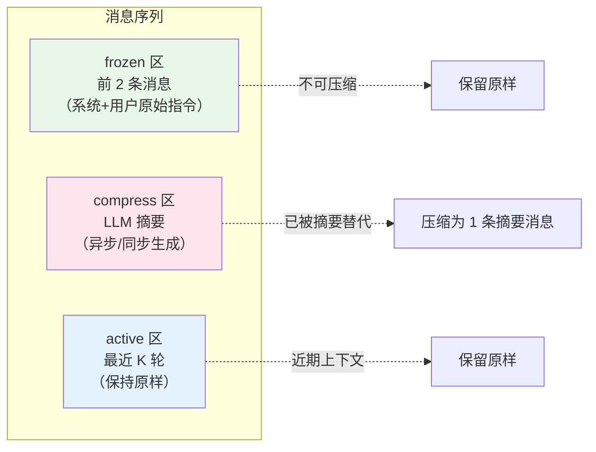

#### 三个区域

| 区域 | 范围 | 处理方式 | 设计理由 |
|------|------|---------|---------|
| **frozen 区** | 前 2 条消息 | 永不压缩 | 系统提示和原始指令是 Agent 行为的"锚"，压缩会导致目标漂移 |
| **compress 区** | 中间历史消息 | LLM 摘要替代 | 早期对话信息密度低，摘要可大幅减少 Token |
| **active 区** | 最近 K 轮 | 保留原样 | 近期上下文对当前决策最相关，压缩会丢失关键细节 |

### 6.2 阈值触发机制

OCR 使用**双阈值**触发压缩：

```go
// internal/llmloop/compression.go
const (
    AsyncCompressThreshold  = 0.60 // 60% 触发异步压缩
    SyncCompressThreshold   = 0.80 // 80% 触发同步压缩
)
```

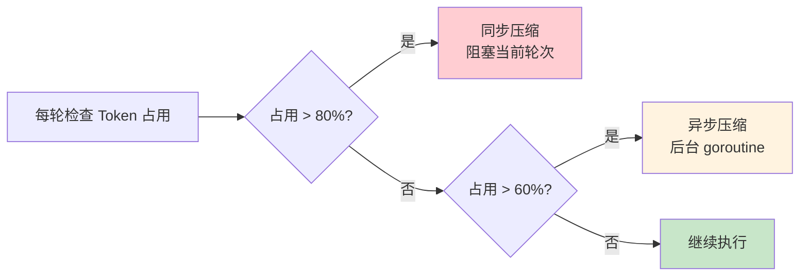

**双阈值的设计价值**：

- **60% 异步触发**：在压力到来前预先压缩，避免"高压时才压缩"的滞后
- **80% 同步触发**：当异步压缩跟不上时，强制阻塞压缩，防止上下文溢出

> **关键洞察**：双阈值是"预防性"与"防御性"的平衡。60% 是"未雨绸缪"，80% 是"紧急制动"。单一阈值要么压缩过频（浪费成本），要么压缩过晚（风险高）。

### 6.3 partitionMessages 分区算法

`partitionMessages` 将消息序列分为三个区域：

```go
// internal/llmloop/compression.go
func partitionMessages(msgs []Message) (frozen, compress, active []Message) {
    if len(msgs) <= 2 {
        return msgs, nil, nil
    }
    frozen = msgs[:2]            // 前 2 条冻结
    remaining := msgs[2:]
    if len(remaining) <= K {
        return frozen, nil, remaining // 不足 K 条，全部 active
    }
    split := len(remaining) - K
    compress = remaining[:split] // 中间部分待压缩
    active = remaining[split:]   // 最近 K 条 active
    return
}
```

### 6.4 runCompression：XML 序列化 + MemoryCompressionTask

压缩过程使用 XML 序列化（而非 JSON），因为 LLM 对 XML 的语义理解更稳定：

```go
// internal/llmloop/compression.go
func (c *Compressor) runCompression(ctx context.Context, msgs []Message) (Message, error) {
    // 1. XML 序列化待压缩消息
    xmlData := serializeToXML(msgs)

    // 2. 构造 MemoryCompressionTask
    task := MemoryCompressionTask{
        Type: "memory_compression",
        Input: xmlData,
        Instruction: "Summarize the following conversation, preserving key findings and decisions.",
    }

    // 3. 调用 LLM 生成摘要
    summary, err := c.LLMClient.CompletionsWithCtx(ctx, task.Prompt())
    if err != nil {
        return Message{}, err
    }

    // 4. 返回摘要消息（替代原 compress 区）
    return Message{
        Role: "system",
        Content: "[Compressed Summary]\n" + summary,
    }, nil
}
```

**为什么用 XML 而非 JSON？**

| 格式 | 优势 | 劣势 |
|------|------|------|
| XML | LLM 语义理解稳定，支持嵌套注释 | 冗长 |
| JSON | 紧凑 | 转义复杂，LLM 可能误解嵌套 |
| Markdown | 可读性好 | 结构表达力弱 |

OCR 选择 XML 是基于"LLM 友好性优先于紧凑性"的考量。

---

## 7. Diff 模块（internal/diff/）

Diff 模块负责提取代码变更，是审查流水线的输入源头。

### 7.1 三种 Diff 模式

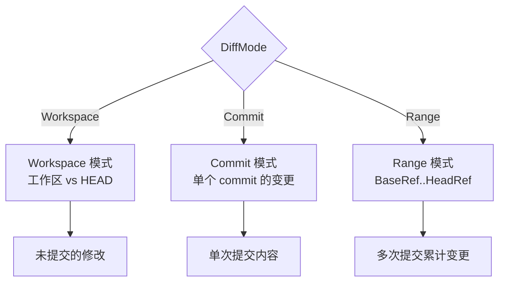

| 模式 | 典型场景 | 命令 |
|------|---------|------|
| `Workspace` | 本地开发中审查 | `git diff HEAD` |
| `Commit` | 审查单个提交 | `git show <commit>` |
| `Range` | 审查 PR 全部变更 | `git diff BaseRef..HeadRef` |

### 7.2 DiffContextLines

```go
// internal/diff/diff.go
const DiffContextLines = 3
```

`DiffContextLines = 3` 表示每处变更前后各保留 3 行上下文。这个值是经验权衡：

- **太小（1-2）**：Agent 缺乏足够上下文理解变更意图
- **太大（5+）**：Token 消耗增加，且无关代码稀释注意力
- **3 行**：覆盖大多数函数签名和条件判断，是"刚好够用"的甜点

### 7.3 providerDirIgnoreDirs：11 个目录黑名单

```go
// internal/diff/provider.go
var providerDirIgnoreDirs = []string{
    "node_modules",
    "vendor",
    ".git",
    "dist",
    "build",
    "target",
    "__pycache__",
    ".idea",
    ".vscode",
    ".next",
    "coverage",
}
```

这 11 个目录被全局忽略，不进入 Diff 提取。设计原则：

1. **依赖目录**（`node_modules`/`vendor`）：第三方代码，非审查对象
2. **构建产物**（`dist`/`build`/`target`/`.next`/`coverage`）：可重新生成，无需审查
3. **VCS 元数据**（`.git`）：非源码
4. **缓存目录**（`__pycache__`）：可重新生成
5. **IDE 配置**（`.idea`/`.vscode`）：个人配置，非团队资产

### 7.4 .gitignore 语义实现

OCR 实现了 `.gitignore` 语义，遵循"**最后匹配优先**"原则：

```go
// internal/diff/gitignore.go
type GitIgnoreMatcher struct {
    patterns []Pattern // 按文件顺序加载
}

func (m *GitIgnoreMatcher) Match(path string) bool {
    ignored := false
    for _, p := range m.patterns {
        if p.Match(path) {
            ignored = !p.Negated // 否定模式 (!) 可"取消忽略"
        }
    }
    return ignored
}
```

**最后匹配优先**的含义：

```gitignore
# .gitignore 示例
*.log           # 忽略所有 .log
!important.log  # 但保留 important.log
```

遍历时，`important.log` 先匹配 `*.log`（ignored=true），再匹配 `!important.log`（ignored=false），最终结果为"不忽略"。这保证了用户可以用 `!` 模式"救回"特定文件。

---

## 8. Scan 模块（internal/scan/）

Scan 模块是 OCR 的独立审查模式，用于"全仓库扫描"而非"变更审查"。

### 8.1 独立 ScanTemplate

Scan 模块使用独立的 `ScanTemplate`，与审查流水线的 Prompt 模板分离：

```go
// internal/scan/template.go
type ScanTemplate struct {
    SystemPrompt  string
    UserPromptTpl string
    Tools         []ToolDef
}
```

**为什么独立？**

- 审查模式关注"变更是否引入问题"，Scan 模式关注"代码库整体质量"
- 两者需要的工具集不同（Scan 不需要 `file_read_diff`）
- Prompt 策略不同（Scan 更侧重全局视角）

### 8.2 Batch 策略

Scan 模块支持三种 Batch 策略：

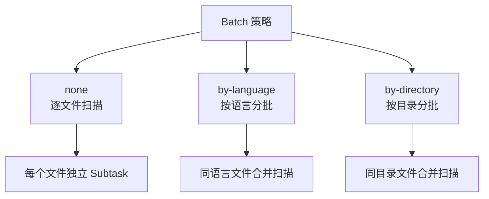

| 策略 | 适用场景 | 优势 | 劣势 |
|------|---------|------|------|
| `none` | 小型仓库 | 粒度细，评论精准 | 调用次数多，成本高 |
| `by-language` | 多语言仓库 | 同语言可共享上下文 | 大文件可能溢出 |
| `by-directory` | 模块化仓库 | 同模块文件相关性高 | 跨语言文件被合并 |

### 8.3 Dedup 去重和 ProjectSummary

Scan 模式产出大量评论，需要后处理：

```go
// internal/scan/dedup.go
func Dedup(comments []ReviewComment) []ReviewComment {
    seen := make(map[string]bool)
    result := make([]ReviewComment, 0)
    for _, c := range comments {
        key := c.Path + ":" + c.Line + ":" + hash(c.Content)
        if !seen[key] {
            seen[key] = true
            result = append(result, c)
        }
    }
    return result
}
```

**ProjectSummary** 是 Scan 模式独有的输出，汇总整个仓库的质量概览：

```go
type ProjectSummary struct {
    TotalFiles     int
    TotalComments  int
    BySeverity     map[string]int // critical/high/medium/low
    ByCategory     map[string]int // bug/security/...
    TopHotspots    []FileHotspot  // 评论最密集的文件
    OverallScore   float64        // 0-100
}
```

---

## 9. 估算模型

OCR 的预算前瞻依赖一个经验校准的估算模型。

### 9.1 三个核心参数

```go
// internal/agent/estimate.go
const (
    promptOverheadTokens    = 2000 // 系统提示+模板开销
    avgMainRoundsPerFile    = 7    // 每文件平均 Main Loop 轮次
    avgOutputTokensPerRound = 700  // 每轮平均输出 Token
)
```

### 9.2 估算公式

单个 Subtask 的估算成本：

```
estimate = promptOverheadTokens
         + (avgMainRoundsPerFile × avgOutputTokensPerRound)
         + inputTokens(diff)
         + toolCallTokens(estimated)

= 2000 + (7 × 700) + inputTokens(diff) + toolCallTokens
= 2000 + 4900 + inputTokens(diff) + toolCallTokens
= 6900 + inputTokens(diff) + toolCallTokens
```

### 9.3 参数校准依据

| 参数 | 值 | 校准依据 |
|------|-----|---------|
| `promptOverheadTokens` | 2000 | 系统提示 + 工具定义 + 模板指令的实测 Token |
| `avgMainRoundsPerFile` | 7 | 大量 PR 审查的统计中位数 |
| `avgOutputTokensPerRound` | 700 | LLM 输出（含工具调用）的平均长度 |

> **设计要点**：这些参数是"经验值"，会随模型能力变化而调整。OCR 将其集中在 `estimate.go` 中，便于统一校准——这是"确定性工程"对"经验依赖"的治理。

### 9.4 估算的局限性

估算模型存在固有误差：

- **大文件偏差**：`inputTokens(diff)` 占主导时，估算较准；小文件时，固定开销占比高
- **复杂变更偏差**：涉及多文件联动的变更，实际轮次可能超过 7
- **模型差异**：不同模型的输出长度差异大

OCR 通过**预算前瞻 + 实际成本累加**的双层机制缓解误差——前瞻用估算，执行用实际值。

---

## 10. Manifest 可追溯性

Manifest 是 OCR"可审计性"的核心机制，记录审查过程的三个摘要。

### 10.1 三个 SHA256 摘要

```go
// internal/agent/manifest.go
type Manifest struct {
    SourceArtifactSHA256  string `json:"source_artifact_sha256"`
    RuleConfigSHA256      string `json:"rule_config_sha256"`
    RuntimeConfigSHA256   string `json:"runtime_config_sha256"`
    // ... 其他字段
}
```

| 摘要 | 计算对象 | 追溯价值 |
|------|---------|---------|
| `sourceArtifactSHA256` | 源码 artifact（diff 内容） | 回答"审查了什么代码" |
| `ruleConfigSHA256` | 规则配置（RuleConfig） | 回答"用了什么规则" |
| `runtimeConfigSHA256` | 运行时配置（模型、预算等） | 回答"在什么环境下审查" |

### 10.2 可追溯性的工程意义

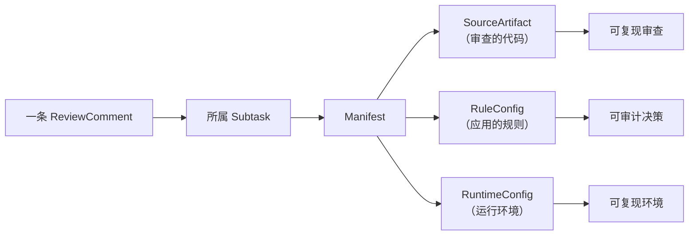

**三个摘要共同保证**：

1. **复现性**：相同的三元组 `(SourceArtifact, RuleConfig, RuntimeConfig)` 理论上可复现审查过程
2. **审计性**：任何评论都可追溯到"用了什么规则、审查了什么代码"
3. **变更检测**：任一摘要变化，意味着审查条件改变，结果不可直接比较

### 10.3 Manifest 示例

```json
{
  "source_artifact_sha256": "a1b2c3...",
  "rule_config_sha256": "d4e5f6...",
  "runtime_config_sha256": "g7h8i9...",
  "model": "claude-sonnet-5",
  "max_tokens_budget": 500000,
  "actual_tokens_used": 412350,
  "subtask_count": 23,
  "comment_count": 47,
  "timestamp": "2026-08-05T10:30:00Z"
}
```

> **关键洞察**：Manifest 让 OCR 从"黑盒审查工具"升级为"可审计审查系统"。在团队协作中，审查结果的"可信度"取决于"可追溯度"——没有 Manifest 的审查结果无法被团队信任。

---

## 11. 架构总结

### 11.1 设计哲学总结

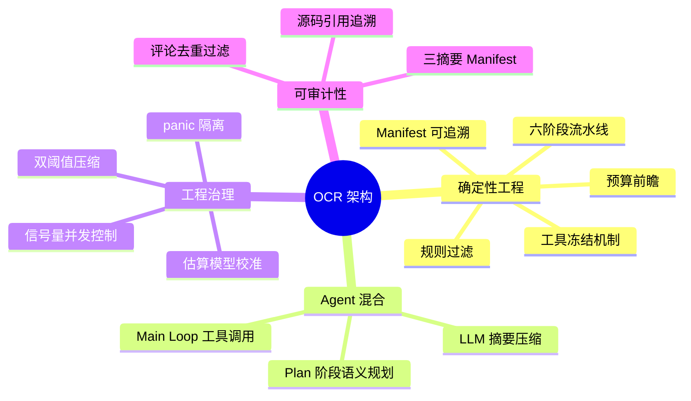

### 11.2 核心架构决策一览

| 决策 | 选择 | 理由 |
|------|------|------|
| 架构风格 | 确定性 × Agent 混合 | 平衡可预测性与语义能力 |
| 并发模型 | 信号量 + goroutine + recover | 控制并发、隔离故障 |
| 预算控制 | 前瞻 + 实际累加 | 预防为主，事后校准 |
| Subtask 分阶段 | Plan（条件） + Main | 小变更省成本，大变更保质量 |
| Main Loop 退出 | 5 个条件 | 覆盖所有卡住场景 |
| 内存压缩 | 三区 + 双阈值 | 平衡保真度与 Token 效率 |
| Diff 上下文 | 3 行 | 经验权衡的甜点 |
| 估算模型 | 3 参数 | 集中校准，便于维护 |
| 可追溯性 | 三 SHA256 摘要 | 复现性 + 审计性 |

### 11.3 与其他 Agent 工具的对比

| 维度 | OCR | 纯 Agent 工具 | 纯 Lint 工具 |
|------|-----|--------------|-------------|
| 可预测性 | 高 | 低 | 极高 |
| 语义理解 | 强 | 强 | 无 |
| 成本可控 | 是 | 否 | 是 |
| 可审计性 | 强 | 弱 | 强 |
| 灵活性 | 中 | 高 | 低 |

OCR 的架构定位是"**用工程治理 Agent**"——在需要语义判断处引入 Agent，在需要可控性处用确定性代码约束。这种平衡使其既具备 Lint 工具的可预测性，又拥有 Agent 的语义理解能力。

---

## 12. 源码索引

| 模块 | 文件路径 | 核心符号 |
|------|---------|---------|
| Agent 调度 | `internal/agent/agent.go` | `Args`, `Run()`, `dispatchSubtasks()` |
| Subtask 执行 | `internal/agent/runner.go` | `Runner`, `RunPerFile()` |
| Main Loop | `internal/llmloop/loop.go` | `LLMLoop`, `Run()` |
| 内存压缩 | `internal/llmloop/compression.go` | `partitionMessages()`, `runCompression()` |
| Diff 提取 | `internal/diff/diff.go` | `DiffContextLines` |
| Diff 黑名单 | `internal/diff/provider.go` | `providerDirIgnoreDirs` |
| .gitignore | `internal/diff/gitignore.go` | `GitIgnoreMatcher` |
| Scan 模块 | `internal/scan/template.go` | `ScanTemplate` |
| 估算模型 | `internal/agent/estimate.go` | `promptOverheadTokens` 等 |
| Manifest | `internal/agent/manifest.go` | `Manifest`, 三个 SHA256 字段 |

---

> **下一章**：[04-llm-providers.md](04-llm-providers.md) 将深入解析 LLM 协议、Provider 系统、Endpoint 解析策略与 Token 计数机制。
