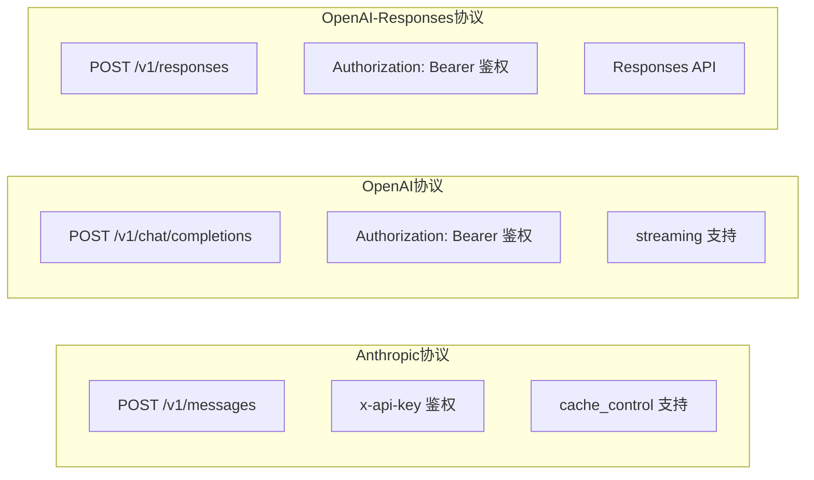
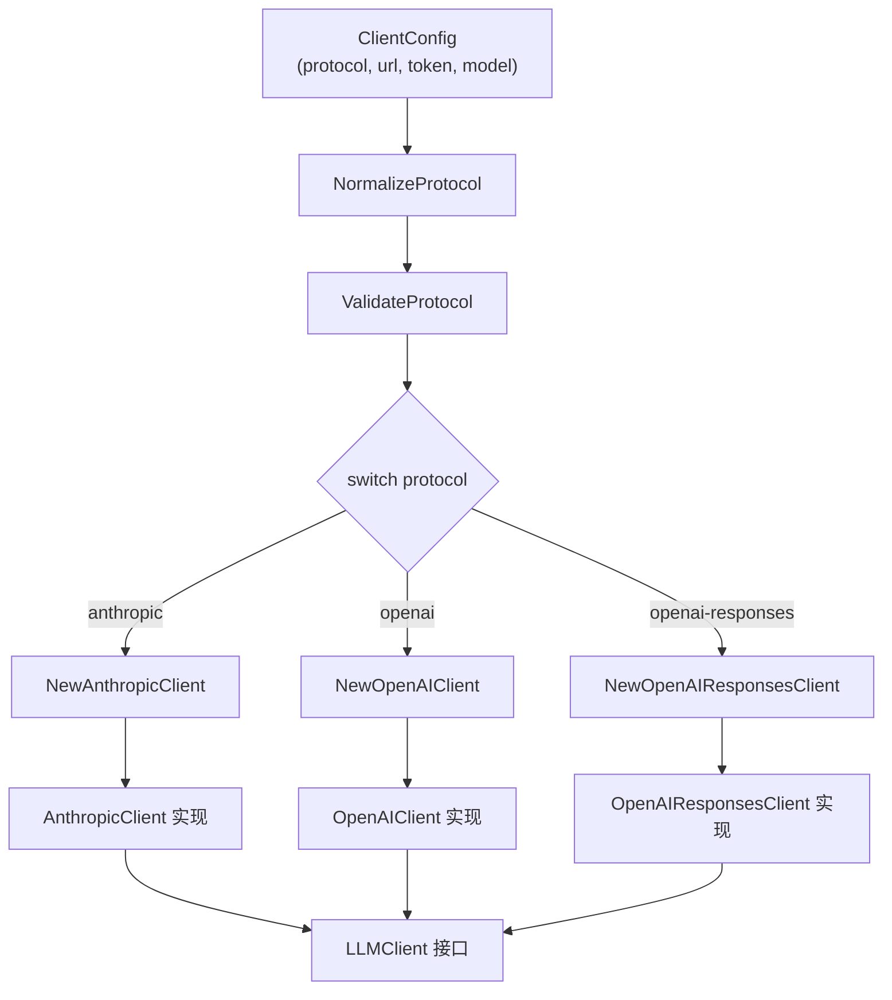
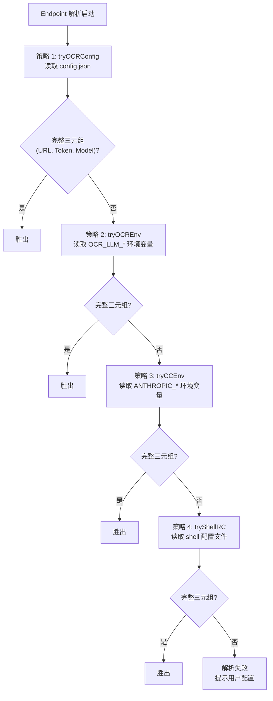
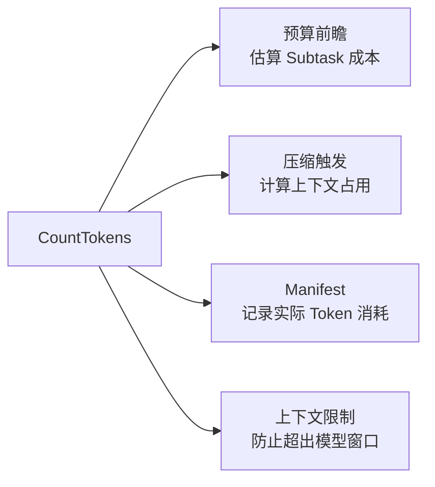
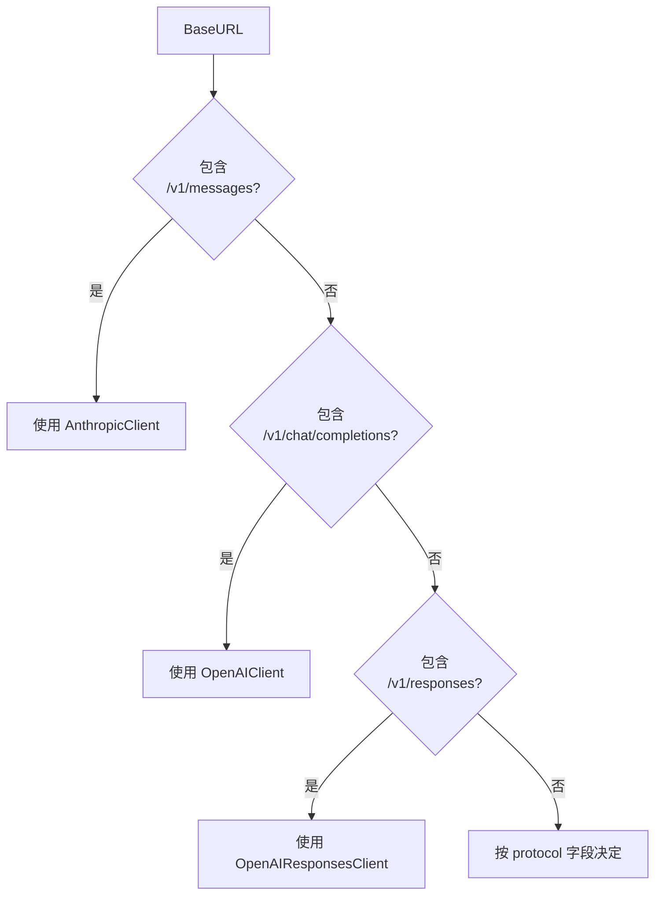

# Open Code Review 完全指南 — LLM 协议与 Provider

> 本章深入解析 Open Code Review 的 LLM 集成层——LLMClient 接口契约、三种协议实现、19 个内置 Provider、四策略 Endpoint 解析链、Token 计数机制与自定义 Provider 扩展。

---

## 1. LLMClient 接口：极简契约

OCR 的 LLM 集成层遵循"**最小接口原则**"——整个 LLMClient 接口只有一个方法。

### 1.1 接口定义

```go
// internal/llm/client.go
type LLMClient interface {
    CompletionsWithCtx(ctx context.Context, req CompletionRequest) (*CompletionResponse, error)
}
```

**为什么只有一个方法？**

| 设计选择 | 理由 |
|---------|------|
| 单方法接口 | 降低实现成本，新 Provider 只需实现一个方法 |
| `WithCtx` 后缀 | 强制传入 context，支持超时和取消 |
| 请求/响应结构体 | 隔离协议差异，上层调用方无需关心是 Anthropic 还是 OpenAI |

### 1.2 CompletionRequest 与 CompletionResponse

```go
type CompletionRequest struct {
    Model       string
    Messages    []Message
    Tools       []ToolDef
    MaxTokens   int
    Temperature float64
    SystemPrompt string
}

type CompletionResponse struct {
    Content      string
    ToolCalls    []ToolCall
    Usage        Usage
    StopReason   string
}
```

> **关键洞察**：单方法接口让"协议适配"和"业务调用"完全解耦。上层 Agent 只看到 `CompletionsWithCtx`，底层可以是 Anthropic、OpenAI 或任何自定义协议。这是"确定性工程"对"协议多样性"的治理。

---

## 2. 三种协议详解

OCR 支持三种 LLM 协议，覆盖主流厂商的 API 规范。

### 2.1 协议常量

```go
// internal/llm/protocol.go
const (
    ProtocolAnthropic              = "anthropic"
    ProtocolOpenAIChatCompletions  = "openai"
    ProtocolOpenAIResponses        = "openai-responses"
)
```

### 2.2 三种协议对比



| 协议 | URL 结尾 | 鉴权方式 | 特有功能 |
|------|---------|---------|---------|
| `anthropic` | `/v1/messages` | `x-api-key` | `cache_control` ephemeral |
| `openai` | `/v1/chat/completions` | `Authorization: Bearer` | streaming、reasoning_content |
| `openai-responses` | `/v1/responses` | `Authorization: Bearer` | Responses API |

### 2.3 NormalizeProtocol 与 ValidateProtocol

```go
// internal/llm/protocol.go
func NormalizeProtocol(p string) string {
    switch strings.ToLower(strings.TrimSpace(p)) {
    case "anthropic", "claude":
        return ProtocolAnthropic
    case "openai", "gpt", "chat":
        return ProtocolOpenAIChatCompletions
    case "openai-responses", "responses":
        return ProtocolOpenAIResponses
    default:
        return p // 未知协议原样返回
    }
}

func ValidateProtocol(p string) error {
    switch p {
    case ProtocolAnthropic, ProtocolOpenAIChatCompletions, ProtocolOpenAIResponses:
        return nil
    default:
        return fmt.Errorf("unsupported protocol: %s", p)
    }
}
```

**两个函数的分工**：

- `NormalizeProtocol`：宽容归一化，接受 "claude"、"gpt" 等别名
- `ValidateProtocol`：严格校验，只接受三个标准常量

> **设计要点**：归一化与校验分离，让用户配置更宽容（可用别名），同时保证内部使用严格常量。这是"宽容输入、严格内部"的常见工程模式。

---

## 3. NewLLMClient 工厂模式

OCR 使用工厂函数根据协议创建对应的 Client 实现。

### 3.1 工厂函数

```go
// internal/llm/factory.go
func NewLLMClient(cfg ClientConfig) (LLMClient, error) {
    protocol := NormalizeProtocol(cfg.Protocol)
    if err := ValidateProtocol(protocol); err != nil {
        return nil, err
    }

    switch protocol {
    case ProtocolAnthropic:
        return NewAnthropicClient(cfg)
    case ProtocolOpenAIChatCompletions:
        return NewOpenAIClient(cfg)
    case ProtocolOpenAIResponses:
        return NewOpenAIResponsesClient(cfg)
    default:
        return nil, fmt.Errorf("unsupported protocol: %s", protocol)
    }
}
```

### 3.2 工厂模式 Mermaid 图



---

## 4. OpenAIClient 实现

OpenAIClient 是 OpenAI Chat Completions 协议的实现，也是使用最广泛的 Client。

### 4.1 核心配置

```go
// internal/llm/openai_client.go
func NewOpenAIClient(cfg ClientConfig) (*OpenAIClient, error) {
    client := openai.NewClient(
        cfg.Token,
        openai.WithBaseURL(cfg.BaseURL),
        openai.WithHTTPClient(&http.Client{
            Timeout: 5 * time.Minute, // 默认超时 5 分钟
        }),
        openai.WithMaxRetries(5), // 默认重试 5 次
    )
    return &OpenAIClient{client: client, model: cfg.Model}, nil
}
```

| 配置项 | 值 | 理由 |
|--------|-----|------|
| 默认超时 | 5 分钟 | LLM 长上下文响应可能较慢，5 分钟覆盖大多数场景 |
| 最大重试 | 5 次 | 应对 429 限流和临时网络错误 |
| BaseURL | 可配置 | 支持代理和兼容 OpenAI 协议的厂商 |

### 4.2 Streaming 支持

OpenAIClient 使用 `openai.ChatCompletionAccumulator` 处理流式响应：

```go
// internal/llm/openai_client.go
func (c *OpenAIClient) CompletionsWithCtx(ctx context.Context, req CompletionRequest) (*CompletionResponse, error) {
    stream, err := c.client.CreateChatCompletionStream(ctx, convertRequest(req))
    if err != nil {
        return nil, err
    }
    defer stream.Close()

    var acc openai.ChatCompletionAccumulator
    for {
        resp, err := stream.Recv()
        if errors.Is(err, io.EOF) {
            break
        }
        if err != nil {
            return nil, err
        }
        acc.AddChunk(resp)
    }
    return c.parseResponse(acc)
}
```

**Streaming 的价值**：

- **更早响应**：首个 Token 到达即可开始处理，无需等待全部生成
- **超时友好**：只要持续有 Token，连接就不会超时
- **内存高效**：增量累积，避免大响应的内存峰值

### 4.3 reasoning_content 提取

OpenAI 的 o 系列模型会返回 `reasoning_content`（推理过程），OCR 会单独提取：

```go
func (c *OpenAIClient) parseResponse(acc openai.ChatCompletionAccumulator) (*CompletionResponse, error) {
    choice := acc.Choices[0]
    resp := &CompletionResponse{
        Content:    choice.Message.Content,
        ToolCalls:  choice.Message.ToolCalls,
        StopReason: string(choice.FinishReason),
    }

    // 提取 reasoning_content（o 系列模型的推理过程）
    if reasoning, ok := choice.Message.CustomFields["reasoning_content"]; ok {
        resp.Reasoning = reasoning
    }

    resp.Usage = Usage{
        PromptTokens:     acc.Usage.PromptTokens,
        CompletionTokens: acc.Usage.CompletionTokens,
        TotalTokens:      acc.Usage.TotalTokens,
    }
    return resp, nil
}
```

> **关键洞察**：`reasoning_content` 是 o1/o3/o4 等推理模型的"思考过程"，提取它可用于调试和可观测性，但不送入上下文（避免污染对话历史）。

---

## 5. AnthropicClient 实现

AnthropicClient 是 Anthropic Claude API 的实现，针对 Claude 的特性做了多项适配。

### 5.1 URL 自动补全

Anthropic API 的标准端点是 `/v1/messages`，OCR 会自动补全：

```go
// internal/llm/anthropic_client.go
func normalizeAnthropicURL(baseURL string) string {
    baseURL = strings.TrimSuffix(baseURL, "/")
    if !strings.HasSuffix(baseURL, "/v1/messages") {
        if strings.HasSuffix(baseURL, "/v1") {
            baseURL += "/messages"
        } else {
            baseURL += "/v1/messages"
        }
    }
    return baseURL
}
```

### 5.2 cache_control ephemeral 设置

Claude 支持 prompt caching，OCR 自动为系统提示设置 `cache_control: ephemeral`：

```go
// internal/llm/anthropic_client.go
func buildAnthropicRequest(req CompletionRequest) anthropic.MessagesRequest {
    return anthropic.MessagesRequest{
        Model:     req.Model,
        MaxTokens: req.MaxTokens, // 默认 8192
        System: anthropic.System{
            Text: req.SystemPrompt,
            CacheControl: &anthropic.CacheControl{
                Type: "ephemeral", // 自动缓存系统提示
            },
        },
        Messages: convertMessages(req.Messages),
        Tools:    convertTools(req.Tools),
    }
}
```

**cache_control ephemeral 的价值**：

- 系统提示缓存 5 分钟，重复请求只计少量 CacheReadInputTokens
- 对 OCR 这种"系统提示固定、Diff 变化"的场景，缓存收益巨大
- 成本可降低 50% 以上

### 5.3 MaxTokens 默认值

```go
const DefaultAnthropicMaxTokens = 8192
```

Claude API 要求显式指定 `MaxTokens`，OCR 默认 8192（覆盖大多数审查场景的输出长度）。

### 5.4 tool 角色 message 合并

Claude API 要求连续的 `tool` 角色消息合并为单个 `tool_result` block，OCR 用 `NewToolResultBlock` 处理：

```go
// internal/llm/anthropic_client.go
func convertMessages(msgs []Message) []anthropic.Message {
    var result []anthic.Message
    for i, msg := range msgs {
        if msg.Role == "tool" && i > 0 && result[len(result)-1].Role == "tool" {
            // 合并到前一个 tool 消息
            last := &result[len(result)-1]
            last.Content = append(last.Content, anthropic.NewToolResultBlock(
                msg.ToolCallID, msg.Content, false,
            ))
        } else {
            result = append(result, convertSingleMessage(msg))
        }
    }
    return result
}
```

> **设计要点**：Claude 的"连续 tool 消息合并"是协议级要求，违反会报错。OCR 在 Client 层自动处理，上层无需感知。

### 5.5 Usage 计算含 CacheReadInputTokens

Claude 的 Usage 包含缓存读取的 Token，OCR 完整记录：

```go
type Usage struct {
    PromptTokens          int
    CompletionTokens      int
    TotalTokens           int
    CacheReadInputTokens  int // Claude 特有：缓存读取
    CacheCreationTokens   int // Claude 特有：缓存创建
}
```

```go
resp.Usage = Usage{
    PromptTokens:         anthropicResp.Usage.InputTokens,
    CompletionTokens:     anthropicResp.Usage.OutputTokens,
    CacheReadInputTokens: anthropicResp.Usage.CacheReadInputTokens,
    CacheCreationTokens:  anthropicResp.Usage.CacheCreationInputTokens,
}
resp.Usage.TotalTokens = resp.Usage.PromptTokens + resp.Usage.CompletionTokens
```

---

## 6. 19 个内置 Provider

OCR 内置 19 个 Provider，覆盖国际和国内主流 LLM 服务。

### 6.1 Provider 定义结构

```go
// internal/llm/providers.go
type Provider struct {
    Name      string
    BaseURL   string
    Protocol  string
    EnvVar    string   // Token 环境变量名
    Models    []string // 推荐模型列表
}
```

### 6.2 19 个 Provider 完整表格

| # | Provider 名 | BaseURL | EnvVar (Token) | 协议 |
|---|------------|---------|----------------|------|
| 1 | `anthropic` | `https://api.anthropic.com` | `ANTHROPIC_API_KEY` | anthropic |
| 2 | `openai` | `https://api.openai.com` | `OPENAI_API_KEY` | openai |
| 3 | `edenai` | `https://api.edenai.run/v1` | `EDENAI_API_KEY` | openai |
| 4 | `dashscope` | `https://dashscope.aliyuncs.com/compatible-mode/v1` | `DASHSCOPE_API_KEY` | openai |
| 5 | `dashscope-tokenplan` | `https://dashscope.aliyuncs.com/compatible-mode/v1` | `DASHSCOPE_API_KEY` | openai |
| 6 | `volcengine` | `https://ark.cn-beijing.volces.com/api/v3` | `VOLCENGINE_API_KEY` | openai |
| 7 | `deepseek` | `https://api.deepseek.com` | `DEEPSEEK_API_KEY` | openai |
| 8 | `tencent-tokenhub` | `https://api.hunyuan.cloud.tencent.com/v1` | `TENCENT_API_KEY` | openai |
| 9 | `hy-tokenplan` | `https://api.hunyuan.cloud.tencent.com/v1` | `TENCENT_API_KEY` | openai |
| 10 | `iflytek` | `https://spark-api-open.xf-yun.com/v1` | `IFLYTEK_API_KEY` | openai |
| 11 | `kimi` | `https://api.moonshot.cn/v1` | `KIMI_API_KEY` | openai |
| 12 | `z-ai` | `https://api.z.ai/api/paas/v4` | `Z_API_KEY` | openai |
| 13 | `z-ai-coding` | `https://api.z.ai/api/paas/v4` | `Z_API_KEY` | openai |
| 14 | `mimo` | `https://api.minimax.chat/v1` | `MIMO_API_KEY` | openai |
| 15 | `minimax` | `https://api.minimax.chat/v1` | `MINIMAX_API_KEY` | openai |
| 16 | `baidu-qianfan` | `https://qianfan.baidubce.com/v2` | `BAIDU_API_KEY` | openai |
| 17 | `ollama-cloud` | `https://api.olama.cloud/v1` | `OLLAMA_API_KEY` | openai |
| 18 | `litellm` | `http://localhost:4000/v1` | `LITELLM_API_KEY` | openai |
| 19 | `custom` | 用户指定 | 用户指定 | 用户指定 |

### 6.3 anthropic 的 6 个推荐模型

```go
// internal/llm/providers.go
"BuiltinProviders": []Provider{
    {
        Name: "anthropic",
        Models: []string{
            "claude-opus-5",
            "claude-opus-5-20250610",
            "claude-sonnet-5",
            "claude-sonnet-5-20250610",
            "claude-haiku-5",
            "claude-haiku-5-20250610",
        },
    },
}
```

### 6.4 openai 的 6 个推荐模型

```go
{
    Name: "openai",
    Models: []string{
        "gpt-5.6-sol",
        "gpt-5.6",
        "gpt-5.5",
        "o3",
        "o4-mini",
        "gpt-4o",
    },
}
```

> **设计要点**：19 个 Provider 中 17 个使用 OpenAI 协议——这反映了 OpenAI Chat Completions 已成为事实标准。OCR 通过协议归一化，让所有兼容厂商"开箱即用"。

---

## 7. Endpoint 解析四策略链

OCR 的 Endpoint 解析是"多源发现"的典型实现，按优先级尝试四种来源。

### 7.1 四策略链 Mermaid 图



### 7.2 策略 1: tryOCRConfig

读取 OCR 自己的配置文件 `~/.config/ocr/config.json`：

```go
// internal/llm/resolver.go
func tryOCRConfig() (*Endpoint, error) {
    cfg, err := loadOCRConfig()
    if err != nil {
        return nil, err
    }
    if cfg.LLMURL != "" && cfg.LLMToken != "" && cfg.LLMModel != "" {
        return &Endpoint{
            URL:    cfg.LLMURL,
            Token:  cfg.LLMToken,
            Model:  cfg.LLMModel,
            Source: "ocr-config",
        }, nil
    }
    return nil, errIncomplete
}
```

### 7.3 策略 2: tryOCREnv

读取 OCR 专用的 8 个环境变量：

```go
// internal/llm/resolver.go
func tryOCREnv() (*Endpoint, error) {
    url := os.Getenv("OCR_LLM_URL")
    token := os.Getenv("OCR_LLM_TOKEN")
    model := os.Getenv("OCR_LLM_MODEL")
    // 还支持：OCR_LLM_PROTOCOL, OCR_LLM_MAX_TOKENS,
    //         OCR_LLM_TEMPERATURE, OCR_LLM_TIMEOUT, OCR_LLM_BASE_URL
    if url != "" && token != "" && model != "" {
        return &Endpoint{
            URL:    url,
            Token:  token,
            Model:  model,
            Source: "ocr-env",
        }, nil
    }
    return nil, errIncomplete
}
```

**8 个 OCR 环境变量**：

| 环境变量 | 用途 |
|---------|------|
| `OCR_LLM_URL` | LLM API 端点 |
| `OCR_LLM_TOKEN` | 鉴权 Token |
| `OCR_LLM_MODEL` | 默认模型名 |
| `OCR_LLM_PROTOCOL` | 协议（anthropic/openai/openai-responses） |
| `OCR_LLM_MAX_TOKENS` | 最大输出 Token |
| `OCR_LLM_TEMPERATURE` | 采样温度 |
| `OCR_LLM_TIMEOUT` | 请求超时 |
| `OCR_LLM_BASE_URL` | Base URL（与 URL 语义略有不同） |

### 7.4 策略 3: tryCCEnv

复用 Claude Code 的环境变量，实现"零配置迁移"：

```go
// internal/llm/resolver.go
func tryCCEnv() (*Endpoint, error) {
    url := os.Getenv("ANTHROPIC_BASE_URL")
    token := os.Getenv("ANTHROPIC_AUTH_TOKEN")
    model := os.Getenv("ANTHROPIC_MODEL")
    if url != "" && token != "" && model != "" {
        return &Endpoint{
            URL:    url + "/v1/messages",
            Token:  token,
            Model:  model,
            Source: "cc-env",
        }, nil
    }
    return nil, errIncomplete
}
```

> **关键洞察**：`tryCCEnv` 让 Claude Code 用户可以"零配置"使用 OCR——只要设置了 `ANTHROPIC_*` 环境变量，OCR 自动复用。这是"生态友好"的设计。

### 7.5 策略 4: tryShellRC

读取 shell 配置文件，提取环境变量定义：

```go
// internal/llm/resolver.go
func tryShellRC() (*Endpoint, error) {
    candidates := []string{
        "~/.zshrc",
        "~/.bashrc",
        "~/.bash_profile",
        "~/.profile",
    }
    for _, f := range candidates {
        env := parseShellEnv(f)
        if env["ANTHROPIC_BASE_URL"] != "" && env["ANTHROPIC_AUTH_TOKEN"] != "" {
            return &Endpoint{
                URL:    env["ANTHROPIC_BASE_URL"] + "/v1/messages",
                Token:  env["ANTHROPIC_AUTH_TOKEN"],
                Model:  env["ANTHROPIC_MODEL"],
                Source: "shell-rc",
            }, nil
        }
    }
    return nil, errIncomplete
}
```

**为什么读 shell 配置文件？**

- 很多开发者只在 `.zshrc`/`.bashrc` 中设置环境变量
- 非交互式进程（如 cron、CI）不会加载这些文件
- OCR 主动解析，让这些场景也能"自动发现"配置

### 7.6 "首个完整三元组胜出"原则

```go
func ResolveEndpoint() (*Endpoint, error) {
    strategies := []func() (*Endpoint, error){
        tryOCRConfig,
        tryOCREnv,
        tryCCEnv,
        tryShellRC,
    }
    for _, strategy := range strategies {
        ep, err := strategy()
        if err == nil && ep.IsComplete() {
            return ep, nil // 首个完整三元组胜出
        }
    }
    return nil, fmt.Errorf("no complete endpoint configuration found")
}
```

| 优先级 | 策略 | 来源 | 适用场景 |
|--------|------|------|---------|
| 1 | `tryOCRConfig` | config.json | 正式配置 |
| 2 | `tryOCREnv` | OCR_LLM_* 环境变量 | CI/CD、临时覆盖 |
| 3 | `tryCCEnv` | ANTHROPIC_* 环境变量 | Claude Code 用户复用 |
| 4 | `tryShellRC` | shell 配置文件 | 本地开发环境 |

> **设计要点**：四策略链体现了"渐进发现"——从最正式到最临时，依次尝试。这种设计让 OCR 在各种环境下都能"开箱即用"，同时保持配置层级清晰。

---

## 8. 自定义 Provider

当 19 个内置 Provider 不够用时，OCR 支持自定义 Provider。

### 8.1 自定义 Provider 要求

```go
// internal/llm/providers.go
type CustomProvider struct {
    URL      string // 必须提供
    Protocol string // 必须提供：anthropic/openai/openai-responses
    Token    string // 可选：不提供则无鉴权
    Model    string // 必须提供
}
```

**关键规则**：

1. **必须提供 `url` 和 `protocol`**：这是协议级要求，无法猜测
2. **无环境变量回退**：自定义 Provider 不参与 Endpoint 解析链
3. **Token 可选**：某些自部署场景（如 Ollama）无需鉴权

### 8.2 自定义 Provider 示例

```json
// ~/.config/ocr/config.json
{
  "providers": {
    "my-local-llm": {
      "url": "http://localhost:11434/v1",
      "protocol": "openai",
      "model": "llama3"
    }
  }
}
```

```bash
# 使用自定义 Provider
ocr review --provider my-local-llm
```

---

## 9. Token 计数：tiktoken

OCR 使用 tiktoken 进行 Token 计数，用于预算控制和压缩触发。

### 9.1 CountTokens 实现

```go
// internal/llm/tokens.go
func CountTokens(model, text string) int {
    encoding := getEncoding(model)
    return len(encoding.Encode(text))
}

func getEncoding(model string) *tiktoken.Encoding {
    if isReasoningModel(model) {
        // o1/o3/o4 系列使用 o200k_base
        return tiktoken.MustGetEncoding("o200k_base")
    }
    // 其他模型使用 cl100k_base
    return tiktoken.MustGetEncoding("cl100k_base")
}

func isReasoningModel(model string) bool {
    prefixes := []string{"o1", "o3", "o4"}
    for _, p := range prefixes {
        if strings.HasPrefix(model, p) {
            return true
        }
    }
    return false
}
```

### 9.2 两种 Encoding 对比

| Encoding | 适用模型 | 词表大小 | 特点 |
|----------|---------|---------|------|
| `cl100k_base` | GPT-4/GPT-4o/Claude 等 | ~100k | 主流模型默认 |
| `o200k_base` | o1/o3/o4 推理模型 | ~200k | 支持更多语言和符号 |

### 9.3 Token 计数的用途



> **关键洞察**：Token 计数是"确定性工程"的基础设施——预算控制、压缩触发、Manifest 记录都依赖准确的 Token 计数。tiktoken 的本地计算避免了"调用 API 才知道 Token 数"的滞后。

---

## 10. 配置示例

OCR 支持三种配置方式，适应不同场景。

### 10.1 交互式配置

```bash
$ ocr config provider
? Select provider: anthropic
? Enter API key: ********************************
? Select model: claude-sonnet-5
✓ Configuration saved to ~/.config/ocr/config.json
```

### 10.2 命令行配置

```bash
# 设置单个值
ocr config set llm.url https://api.anthropic.com
ocr config set llm.token sk-ant-xxx
ocr config set llm.model claude-sonnet-5
ocr config set llm.protocol anthropic

# 批量设置
ocr config set --from-file my-config.json
```

### 10.3 环境变量配置

```bash
# 临时使用（CI/CD 场景）
export OCR_LLM_URL=https://api.deepseek.com
export OCR_LLM_TOKEN=sk-xxx
export OCR_LLM_MODEL=deepseek-chat
ocr review
```

### 10.4 三种方式对比

| 方式 | 持久性 | 适用场景 | 优先级 |
|------|--------|---------|--------|
| 交互式 | 持久 | 首次配置 | 1（config.json） |
| 命令行 | 持久 | 脚本化配置 | 1（config.json） |
| 环境变量 | 临时 | CI/CD、临时切换 | 2（覆盖 config.json） |

---

## 11. extra_body 和 extra_headers

OCR 支持通过 `extra_body` 和 `extra_headers` 传递厂商特有参数。

### 11.1 配置格式

```json
{
  "llm": {
    "extra_body": {
      "thinking": {
        "type": "enabled",
        "budget_tokens": 10000
      }
    },
    "extra_headers": {
      "X-Custom-Header": "value"
    }
  }
}
```

### 11.2 保留头拒绝列表

某些 HTTP 头由 OCR 自动管理，用户配置会被拒绝：

```go
// internal/llm/headers.go
var reservedHeaders = map[string]bool{
    "authorization": true,
    "x-api-key":     true,
    "content-type":  true,
    "user-agent":    true,
}

func validateHeaders(headers map[string]string) error {
    for k := range headers {
        if reservedHeaders[strings.ToLower(k)] {
            return fmt.Errorf("header %s is reserved and cannot be overridden", k)
        }
    }
    return nil
}
```

**为什么拒绝这些头？**

| 保留头 | 拒绝理由 |
|--------|---------|
| `authorization` | 鉴权由 Token 字段统一管理，覆盖会导致安全风险 |
| `x-api-key` | Anthropic 鉴权头，同上 |
| `content-type` | 由协议决定（JSON），覆盖会破坏请求解析 |
| `user-agent` | 用于 OCR 自身标识和 API 调用追踪 |

> **设计要点**：保留头拒绝列表是"安全护栏"——防止用户无意中覆盖关键 HTTP 头，导致鉴权失败或请求格式错误。

### 11.3 extra_body 的合并逻辑

```go
// internal/llm/openai_client.go
func buildRequestBody(req CompletionRequest, cfg ClientConfig) map[string]interface{} {
    body := map[string]interface{}{
        "model":       req.Model,
        "messages":    convertMessages(req.Messages),
        "tools":       convertTools(req.Tools),
        "max_tokens":  req.MaxTokens,
    }

    // 合并 extra_body（用户配置覆盖默认值）
    for k, v := range cfg.ExtraBody {
        body[k] = v
    }
    return body
}
```

---

## 12. 协议适配总结

### 12.1 协议适配决策树



### 12.2 三种 Client 实现对比

| 特性 | AnthropicClient | OpenAIClient | OpenAIResponsesClient |
|------|----------------|--------------|----------------------|
| 默认超时 | 5 分钟 | 5 分钟 | 5 分钟 |
| MaxTokens 默认 | 8192 | 不设上限 | 不设上限 |
| Streaming | ✅ | ✅ | ✅ |
| Prompt Caching | ✅ ephemeral | ❌ | ❌ |
| reasoning_content | ❌ | ✅ | ✅ |
| Tool 消息合并 | ✅ NewToolResultBlock | ❌ | ❌ |
| CacheReadInputTokens | ✅ | ❌ | ❌ |

### 12.3 设计哲学

OCR 的 LLM 集成层体现了三个设计哲学：

1. **接口最小化**：单方法 LLMClient 接口，降低实现成本
2. **协议归一化**：19 个 Provider 中 17 个用 OpenAI 协议，统一适配
3. **渐进发现**：四策略 Endpoint 解析，让配置"开箱即用"

这三个哲学共同让 OCR 的 LLM 集成层既"简单"（上层接口简单）又"灵活"（底层支持多协议多厂商）。

---

## 13. 源码索引

| 模块 | 文件路径 | 核心符号 |
|------|---------|---------|
| LLMClient 接口 | `internal/llm/client.go` | `LLMClient`, `CompletionsWithCtx` |
| 协议定义 | `internal/llm/protocol.go` | `ProtocolAnthropic`, `NormalizeProtocol`, `ValidateProtocol` |
| 工厂函数 | `internal/llm/factory.go` | `NewLLMClient` |
| OpenAI Client | `internal/llm/openai_client.go` | `OpenAIClient`, `parseResponse` |
| Anthropic Client | `internal/llm/anthropic_client.go` | `AnthropicClient`, `convertMessages` |
| Provider 列表 | `internal/llm/providers.go` | `BuiltinProviders`, 19 个 Provider |
| Endpoint 解析 | `internal/llm/resolver.go` | `tryOCRConfig`, `tryOCREnv`, `tryCCEnv`, `tryShellRC` |
| Token 计数 | `internal/llm/tokens.go` | `CountTokens`, `getEncoding` |
| 头部校验 | `internal/llm/headers.go` | `reservedHeaders`, `validateHeaders` |

---

> **下一章**：[05-tools-mcp.md](05-tools-mcp.md) 将深入解析 6 个内置工具、code_comment 评论机制、MCP 集成与工具自定义扩展。
