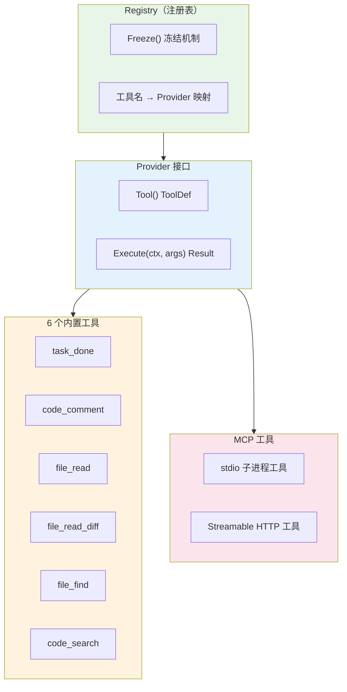
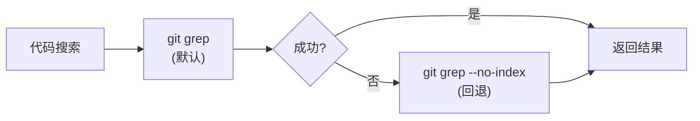
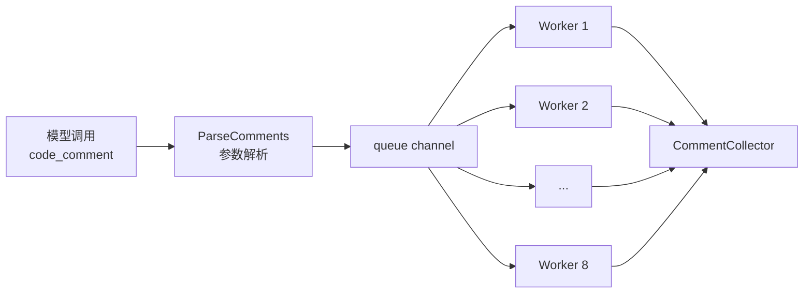
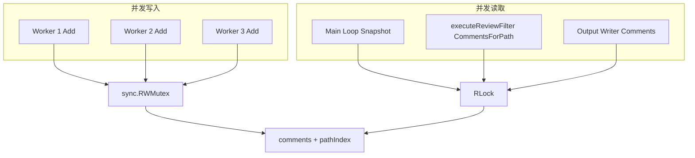
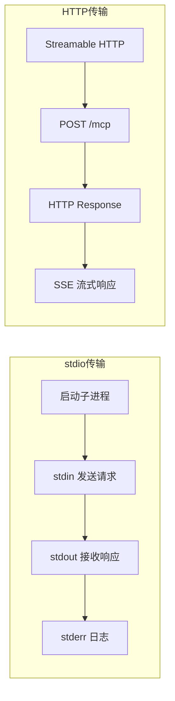
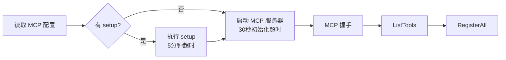
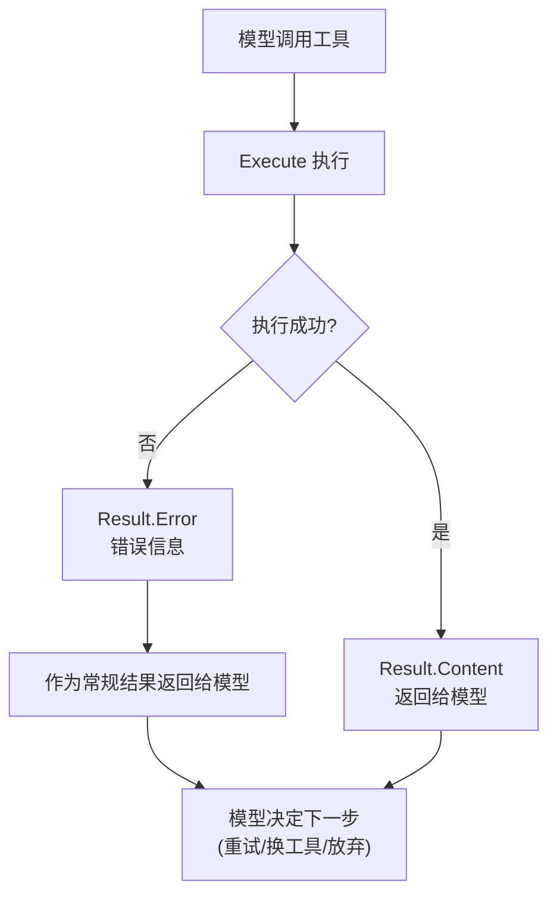
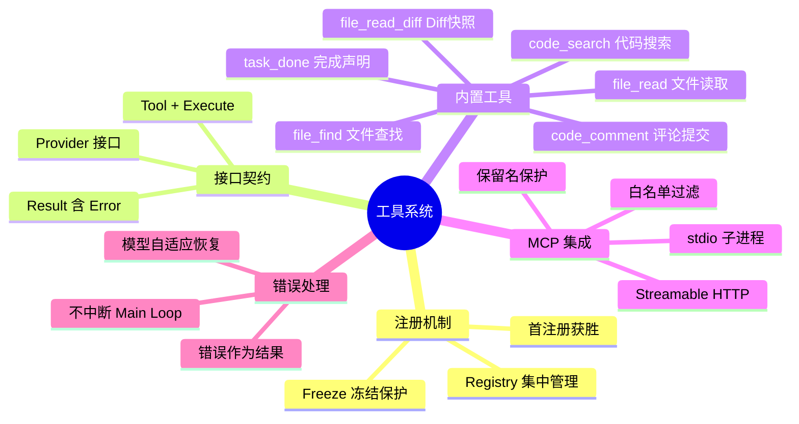

# Open Code Review 完全指南 — 内置工具与 MCP 集成

> 本章深入解析 Open Code Review 的工具系统——Registry 注册机制、Provider 接口契约、6 个内置工具详解、code_comment 评论机制、MCP 集成与工具自定义扩展。

---

## 1. 工具系统架构

OCR 的工具系统采用"**Registry + Provider**"双层架构，统一管理内置工具和 MCP 工具。

### 1.1 架构 Mermaid 图



### 1.2 设计要点

| 组件 | 职责 | 设计理由 |
|------|------|---------|
| **Registry** | 工具注册、查询、冻结 | 统一管理入口，支持冻结后的不可变性 |
| **Provider 接口** | 工具契约 | 统一抽象，内置工具和 MCP 工具实现同一接口 |
| **6 个内置工具** | 核心审查能力 | 覆盖"声明完成""评论""读取""查找""搜索"全流程 |
| **MCP 工具** | 扩展能力 | 通过 MCP 协议接入外部工具服务器 |

---

## 2. Provider 接口契约

所有工具必须实现 `Provider` 接口，这是工具系统的核心契约。

### 2.1 接口定义

```go
// internal/tools/provider.go
type Provider interface {
    // Tool 返回工具定义（名称、描述、参数 schema）
    Tool() ToolDef

    // Execute 执行工具调用，返回结果
    Execute(ctx context.Context, args json.RawMessage) Result
}
```

### 2.2 ToolDef 结构

```go
type ToolDef struct {
    Name        string          `json:"name"`
    Description string          `json:"description"`
    Parameters  json.RawMessage `json:"parameters"` // JSON Schema
}
```

### 2.3 Result 结构

```go
type Result struct {
    Content string      // 文本结果
    Error   string      // 错误信息（非空时表示工具执行失败）
    Meta    map[string]interface{} // 元数据
}
```

> **关键洞察**：Provider 接口的 `Execute` 返回 `Result` 而非 `(Result, error)`——工具执行错误被封装在 `Result.Error` 中，作为"常规工具结果"返回给模型。这让模型能理解"工具失败了"并决定下一步（重试或换工具），而非直接中断 Main Loop。

---

## 3. Registry 冻结机制

Registry 支持"冻结"状态，冻结后禁止注册新工具。

### 3.1 冻结机制实现

```go
// internal/tools/registry.go
type Registry struct {
    mu       sync.RWMutex
    tools    map[string]Provider
    frozen   bool
    diffMap  *DiffMap // 注入的 Diff 快照
}

func (r *Registry) Register(p Provider) {
    r.mu.Lock()
    defer r.mu.Unlock()
    if r.frozen {
        panic("registry is frozen: cannot register new tool after Freeze()")
    }
    name := p.Tool().Name
    if _, exists := r.tools[name]; exists {
        panic(fmt.Sprintf("tool %s already registered", name))
    }
    r.tools[name] = p
}

func (r *Registry) Freeze() {
    r.mu.Lock()
    defer r.mu.Unlock()
    r.frozen = true
}
```

### 3.2 冻结的价值


| 阶段 | 可注册 | 可查询 | 可执行 |
|------|--------|--------|--------|
| 初始化 | ✅ | ✅ | ❌ |
| 冻结后 | ❌ panic | ✅ | ✅ |

**为什么需要冻结？**

1. **防止 Agent 注入后门工具**：Agent 执行期间若能注册工具，可能注册"绕过审查"的工具
2. **保证工具集可审计**：冻结后的工具集是 Manifest 的一部分，可追溯
3. **避免并发注册问题**：Agent 并发执行时，注册操作需要锁，冻结后无需担心

---

## 4. 6 个内置工具详解

OCR 内置 6 个工具，覆盖审查全流程。

### 4.1 工具能力矩阵

| 工具名 | Plan 阶段 | Main 阶段 | 核心功能 |
|--------|----------|----------|---------|
| `task_done` | ❌ | ✅ | 声明审查完成，state=DONE/FAILED |
| `code_comment` | ❌ | ✅ | 提交代码评论，8 类 category + 4 级 severity |
| `file_read` | ❌ | ✅ | 读取文件内容，最多 500 行 |
| `file_read_diff` | ✅ | ✅ | 读取 DiffMap 不可变快照 |
| `file_find` | ✅ | ✅ | 查找文件，最多 100 匹配 |
| `code_search` | ✅ | ✅ | 代码搜索，每文件最多 100 匹配 |

### 4.2 task_done：声明审查完成

```go
// internal/tools/task_done.go
type TaskDoneTool struct{}

func (t *TaskDoneTool) Tool() ToolDef {
    return ToolDef{
        Name: "task_done",
        Description: "Declare the review task as done or failed",
        Parameters: json.RawMessage(`{
            "type": "object",
            "properties": {
                "state": {
                    "type": "string",
                    "enum": ["DONE", "FAILED"]
                },
                "reason": {"type": "string"}
            },
            "required": ["state"]
        }`),
    }
}
```

**state 语义**：

| state | 含义 | 触发行为 |
|-------|------|---------|
| `DONE` | 审查正常完成 | Main Loop 退出，收集评论 |
| `FAILED` | 审查无法完成 | Main Loop 退出，记录失败原因 |

> **设计要点**：`task_done` 只在 Main 阶段可用——Plan 阶段不能"声明完成"，因为计划阶段不产出评论。

### 4.3 code_comment：提交代码评论

```go
// internal/tools/code_comment.go
type CodeCommentTool struct {
    collector *CommentCollector
}
```

**8 类 category**：

| category | 描述 |
|----------|------|
| `bug` | 缺陷：可能导致错误行为 |
| `security` | 安全漏洞 |
| `performance` | 性能问题 |
| `maintainability` | 可维护性问题 |
| `test` | 测试覆盖不足 |
| `style` | 代码风格问题 |
| `documentation` | 文档问题 |
| `other` | 其他问题 |

**4 级 severity**：

| severity | 含义 | 建议处理 |
|----------|------|---------|
| `critical` | 严重：必须修复 | 阻塞合并 |
| `high` | 高：应尽快修复 | 建议合并前修复 |
| `medium` | 中等：建议修复 | 可合并后修复 |
| `low` | 低：可选修复 | 记录即可 |

### 4.4 file_read：读取文件内容

```go
// internal/tools/file_read.go
const MaxFileReadLines = 500

func (t *FileReadTool) Execute(ctx context.Context, args json.RawMessage) Result {
    var params struct {
        Path string `json:"path"`
        StartLine int `json:"start_line"`
        EndLine   int `json:"end_line"`
    }
    json.Unmarshal(args, &params)

    content, totalLines, err := readFile(params.Path, params.StartLine, params.EndLine)
    truncated := totalLines > MaxFileReadLines

    return Result{
        Content: content,
        Meta: map[string]interface{}{
            "total_lines":   totalLines,
            "IS_TRUNCATED":  truncated,
            "max_lines":     MaxFileReadLines,
        },
    }
}
```

**IS_TRUNCATED 标记**：当文件超过 500 行时，结果被截断并标记 `IS_TRUNCATED=true`，模型可据此决定是否分段读取。

### 4.5 file_read_diff：读取 Diff 快照

```go
// internal/tools/file_read_diff.go
type FileReadDiffTool struct {
    diffMap *DiffMap // 注入的不可变快照
}
```

**关键特性**：
- DiffMap 在 Agent 执行前注入，是**不可变快照**
- 支持 Plan 和 Main 阶段（两个阶段都能读取 diff）
- 读取不涉及 git 命令，纯内存操作，速度快

### 4.6 file_find：查找文件

```go
// internal/tools/file_find.go
const MaxFileFindMatches = 100

func (t *FileFindTool) Execute(ctx context.Context, args json.RawMessage) Result {
    var params struct {
        Pattern string `json:"pattern"`
        Mode    string `json:"mode"` // "tracked" 或 "all"
    }
    // mode=tracked: 使用 git ls-files
    // mode=all: 使用 git ls-tree -r
    matches := findFiles(params.Pattern, params.Mode)
    if len(matches) > MaxFileFindMatches {
        matches = matches[:MaxFileFindMatches]
    }
    return Result{Content: formatMatches(matches)}
}
```

**git ls-files vs git ls-tree 切换**：

| 模式 | 命令 | 范围 |
|------|------|------|
| `tracked` | `git ls-files` | Git 跟踪的文件 |
| `all` | `git ls-tree -r` | 工作区所有文件（含未跟踪） |

### 4.7 code_search：代码搜索

```go
// internal/tools/code_search.go
const MaxSearchMatchesPerFile = 100

func (t *CodeSearchTool) Execute(ctx context.Context, args json.RawMessage) Result {
    var params struct {
        Query    string `json:"query"`
        PathSpec string `json:"path_spec"`
    }
    // 优先使用 git grep
    matches, err := gitGrep(params.Query, params.PathSpec)
    if err != nil {
        // git grep 失败时回退到 --no-index
        matches, err = gitGrepNoIndex(params.Query, params.PathSpec)
    }
    // 每文件最多 100 匹配
    matches = limitMatchesPerFile(matches, MaxSearchMatchesPerFile)
    return Result{Content: formatSearchResults(matches)}
}
```

**`--no-index` 回退**：



`git grep` 默认只在 Git 仓库中搜索，`--no-index` 允许在非 Git 目录搜索——这是对"非 Git 项目"的兼容。

---

## 5. code_comment 详解

`code_comment` 是最复杂的内置工具，涉及评论结构、异步收集、参数解析和锚定机制。

### 5.1 comments 数组结构

```go
// internal/tools/code_comment.go
type Comment struct {
    Content        string `json:"content"`         // 评论正文
    ExistingCode   string `json:"existing_code"`   // 锚定的原始代码
    SuggestionCode string `json:"suggestion_code"` // 建议代码
    Thinking       string `json:"thinking"`        // 思考过程（不展示给用户）
    Category       string `json:"category"`        // 8 类之一
    Severity       string `json:"severity"`        // 4 级之一
}
```

### 5.2 CommentWorkerPool 异步收集

OCR 使用 Worker Pool 异步收集评论，避免阻塞 Main Loop：

```go
// internal/tools/comment_worker.go
type CommentWorkerPool struct {
    workers   int              // 默认 8
    queue     chan Comment
    collector *CommentCollector
    wg        sync.WaitGroup
}

func NewCommentWorkerPool(collector *CommentCollector) *CommentWorkerPool {
    return &CommentWorkerPool{
        workers:   8,
        queue:     make(chan Comment, 100),
        collector: collector,
    }
}

func (p *CommentWorkerPool) Start() {
    for i := 0; i < p.workers; i++ {
        p.wg.Add(1)
        go func() {
            defer p.wg.Done()
            for comment := range p.queue {
                // 异步处理：锚定验证、去重、收集
                p.collector.Add(comment)
            }
        }()
    }
}
```



### 5.3 ParseComments 参数解析

```go
// internal/tools/code_comment.go
func ParseComments(args json.RawMessage) ([]Comment, error) {
    var params struct {
        Comments []Comment `json:"comments"`
    }
    if err := json.Unmarshal(args, &params); err != nil {
        return nil, err
    }

    // 校验每个 comment
    for i, c := range params.Comments {
        if c.Content == "" {
            return nil, fmt.Errorf("comment[%d]: content is required", i)
        }
        if !isValidCategory(c.Category) {
            return nil, fmt.Errorf("comment[%d]: invalid category %s", i, c.Category)
        }
        if !isValidSeverity(c.Severity) {
            return nil, fmt.Errorf("comment[%d]: invalid severity %s", i, c.Severity)
        }
    }
    return params.Comments, nil
}
```

### 5.4 existing_code 锚定机制

`existing_code` 字段用于将评论锚定到具体代码位置，OCR 采用**动态滑动窗口算法**匹配：

```go
// internal/tools/anchor.go
func FindAnchorLine(content, existingCode string, hintLine int) (int, bool) {
    targetLines := strings.Split(existingCode, "\n")
    fileLines := strings.Split(content, "\n")

    // 动态滑动窗口：从 hintLine 附近开始搜索
    windowSizes := []int{1, 3, 5, 10, 20, 50}
    for _, window := range windowSizes {
        start := max(0, hintLine-window)
        end := min(len(fileLines), hintLine+window)
        for i := start; i <= end-len(targetLines); i++ {
            if matchLines(fileLines[i:i+len(targetLines)], targetLines) {
                return i + 1, true // 行号从 1 开始
            }
        }
    }
    return 0, false
}
```

**动态滑动窗口的设计**：

| 窗口大小 | 搜索范围 | 适用场景 |
|---------|---------|---------|
| 1 | hintLine ± 1 | 精确匹配（模型给的行号准确） |
| 3 | hintLine ± 3 | 小偏差 |
| 5 | hintLine ± 5 | 中等偏差 |
| 10 | hintLine ± 10 | 大偏差 |
| 20 | hintLine ± 20 | 模型行号严重不准 |
| 50 | hintLine ± 50 | 最后尝试 |

> **关键洞察**：动态滑动窗口从"小窗口"开始，逐步扩大——这平衡了"精确匹配"和"容错性"。大多数情况下小窗口即可命中，大窗口作为兜底。

---

## 6. CommentCollector 线程安全 API

CommentCollector 是评论的集中存储，提供线程安全的查询接口。

### 6.1 API 列表

```go
// internal/tools/collector.go
type CommentCollector struct {
    mu        sync.RWMutex
    comments  []Comment
    pathIndex map[string][]int // path → comment indices
}

func (c *CommentCollector) Add(comment Comment)                    // 添加评论
func (c *CommentCollector) Comments() []Comment                    // 获取全部评论
func (c *CommentCollector) CommentsForPath(path string) []Comment  // 按路径查询
func (c *CommentCollector) Snapshot() []Comment                    // 获取快照（深拷贝）
func (c *CommentCollector) Since(timestamp time.Time) []Comment    // 获取某时间后的评论
func (c *CommentCollector) ReplaceSince(timestamp time.Time, newComments []Comment) // 替换
func (c *CommentCollector) RemoveByPathAndIndices(path string, indices []int)       // 按路径和索引删除
```

### 6.2 线程安全设计



### 6.3 各 API 的使用场景

| API | 使用场景 | 并发性 |
|-----|---------|--------|
| `Add` | Worker Pool 收集评论 | 写锁（互斥） |
| `Comments` | 输出阶段获取全部评论 | 读锁（共享） |
| `CommentsForPath` | executeReviewFilter 按文件处理 | 读锁 |
| `Snapshot` | 压缩前快照、Manifest 记录 | 读锁 + 深拷贝 |
| `Since` | 增量处理（如压缩后重试） | 读锁 |
| `ReplaceSince` | 压缩后替换评论 | 写锁 |
| `RemoveByPathAndIndices` | 去重删除 | 写锁 |

> **设计要点**：`Snapshot` 返回深拷贝，避免调用方修改影响内部状态。这是"防御性拷贝"的典型应用——虽然有一次拷贝开销，但保证了数据一致性。

---

## 7. MCP 集成（internal/mcp/）

OCR 通过 MCP（Model Context Protocol）协议集成外部工具服务器，扩展工具能力。

### 7.1 两种传输方式



#### stdio 子进程传输

```go
// internal/mcp/client.go
func NewClient(cmd string, args []string, env []string) (*Client, error) {
    proc := exec.Command(cmd, args...)
    proc.Env = append(os.Environ(), env...)
    stdin, _ := proc.StdinPipe()
    stdout, _ := proc.StdoutPipe()
    proc.Start()

    transport := newStdioTransport(stdin, stdout)
    return &Client{transport: transport}, nil
}
```

#### Streamable HTTP 传输

```go
// internal/mcp/remote_client.go
func NewRemoteClient(url string, headers map[string]string) (*Client, error) {
    transport := newHTTPTransport(url, headers)
    return &Client{transport: transport}, nil
}
```

### 7.2 headerTransport：401/403 错误处理

```go
// internal/mcp/remote_client.go
type headerTransport struct {
    baseURL string
    headers map[string]string
    token   string
}

func (t *headerTransport) Do(req *http.Request) (*http.Response, error) {
    for k, v := range t.headers {
        req.Header.Set(k, v)
    }
    resp, err := t.client.Do(req)
    if err != nil {
        return nil, err
    }
    if resp.StatusCode == 401 || resp.StatusCode == 403 {
        return nil, fmt.Errorf("authentication failed: %d, please check your token", resp.StatusCode)
    }
    return resp, nil
}
```

### 7.3 CallTool 与 contentToText

```go
// internal/mcp/client.go
func (c *Client) CallTool(ctx context.Context, name string, args json.RawMessage) (string, error) {
    result, err := c.transport.CallTool(ctx, name, args)
    if err != nil {
        return "", err
    }
    return contentToText(result.Content), nil
}

func contentToText(contents []Content) string {
    var sb strings.Builder
    for _, c := range contents {
        if c.Type == "text" {
            sb.WriteString(c.Text)
        }
    }
    return sb.String()
}
```

### 7.4 RegisterAll 过滤逻辑

MCP 工具注册时有三层过滤：

```go
// internal/mcp/register.go
func (r *Registry) RegisterAll(mcpClient *mcp.Client, whitelist []string) error {
    tools, err := mcpClient.ListTools()
    if err != nil {
        return err
    }

    for _, tool := range tools {
        // 过滤 1: 白名单过滤
        if len(whitelist) > 0 && !contains(whitelist, tool.Name) {
            continue
        }

        // 过滤 2: 保留名冲突跳过
        if isReservedName(tool.Name) {
            log.Printf("skip MCP tool %s: reserved name", tool.Name)
            continue
        }

        // 过滤 3: 首次注册获胜
        if r.IsRegistered(tool.Name) {
            log.Printf("skip MCP tool %s: already registered", tool.Name)
            continue
        }

        r.Register(&MCPToolProvider{
            client: mcpClient,
            tool:   tool,
        })
    }
    return nil
}
```

**三层过滤的设计**：

| 过滤层 | 规则 | 理由 |
|--------|------|------|
| 白名单 | 只注册白名单中的工具 | 用户控制暴露给 Agent 的工具 |
| 保留名 | 跳过与内置工具同名的 | 防止 MCP 工具覆盖核心功能 |
| 首注册获胜 | 已注册的同名工具跳过 | 保证工具唯一性，避免歧义 |

> **关键洞察**："首次注册获胜"原则保证了内置工具的优先级——MCP 工具不能覆盖 `task_done`、`code_comment` 等核心工具，这是"工程治理 Agent"的具体体现。

### 7.5 ToToolDef schema 处理

MCP 工具的 schema 需要转换为 OCR 的 ToolDef：

```go
// internal/mcp/register.go
func (p *MCPToolProvider) Tool() ToolDef {
    return ToolDef{
        Name:        p.tool.Name,
        Description: p.tool.Description,
        Parameters:  convertSchema(p.tool.InputSchema),
    }
}

func convertSchema(mcpSchema json.RawMessage) json.RawMessage {
    // MCP schema 通常是 JSON Schema，直接透传
    // 但需要处理嵌套 $ref 等特殊情况
    var schema map[string]interface{}
    json.Unmarshal(mcpSchema, &schema)
    // 简化处理：移除 OCR 不支持的字段
    delete(schema, "$schema")
    delete(schema, "$id")
    result, _ := json.Marshal(schema)
    return result
}
```

---

## 8. MCP 配置格式

MCP 服务器在 `config.json` 的 `mcp_servers` 字段配置。

### 8.1 配置结构

```json
{
  "mcp_servers": {
    "filesystem": {
      "type": "stdio",
      "command": "npx",
      "args": ["-y", "@modelcontextprotocol/server-filesystem", "/path/to/dir"],
      "env": {
        "NODE_ENV": "production"
      },
      "tools": ["read_file", "write_file"],
      "setup": ["npm", "install", "@modelcontextprotocol/server-filesystem"]
    },
    "remote-api": {
      "type": "remote",
      "url": "https://api.example.com/mcp",
      "headers": {
        "Authorization": "Bearer token-xxx"
      },
      "tools": ["query", "search"]
    }
  }
}
```

### 8.2 stdio 类型字段

| 字段 | 必填 | 说明 |
|------|------|------|
| `type` | ✅ | 必须为 `"stdio"` |
| `command` | ✅ | 启动命令（如 `npx`/`node`/`python`） |
| `args` | ❌ | 命令参数数组 |
| `env` | ❌ | 环境变量 |
| `tools` | ❌ | 白名单（不填则注册全部） |
| `setup` | ❌ | 初始化命令（首次运行前执行） |

### 8.3 remote 类型字段

| 字段 | 必填 | 说明 |
|------|------|------|
| `type` | ✅ | 必须为 `"remote"` |
| `url` | ✅ | MCP 服务器 URL |
| `headers` | ❌ | 自定义 HTTP 头 |
| `tools` | ❌ | 白名单 |

### 8.4 超时设置

```go
// internal/mcp/client.go
const (
    SetupTimeout    = 5 * time.Minute  // setup 命令超时
    InitTimeout     = 30 * time.Second // 初始化超时
)
```

| 超时 | 值 | 适用场景 |
|------|-----|---------|
| `SetupTimeout` | 5 分钟 | `setup` 命令（如 `npm install`）可能较慢 |
| `InitTimeout` | 30 秒 | MCP 服务器启动和握手 |



---

## 9. 工具自定义

OCR 支持通过 `--tools` flag 覆盖嵌入式 `tools.json`。

### 9.1 --tools flag

```bash
# 使用自定义工具配置
ocr review --tools /path/to/my-tools.json
```

### 9.2 tools.json 格式

```json
{
  "tools": [
    {
      "name": "my_custom_tool",
      "description": "A custom tool for specific analysis",
      "parameters": {
        "type": "object",
        "properties": {
          "input": {"type": "string"}
        },
        "required": ["input"]
      },
      "handler": "python /path/to/handler.py"
    }
  ]
}
```

### 9.3 覆盖逻辑

```go
// internal/tools/loader.go
func LoadTools(toolsFlag string) ([]ToolDef, error) {
    if toolsFlag != "" {
        // 优先使用 --tools flag 指定的文件
        return loadFromFile(toolsFlag)
    }
    // 回退到嵌入式 tools.json
    return loadEmbeddedTools()
}
```

> **设计要点**：`--tools` flag 的优先级高于嵌入式配置，这让用户可以在不修改代码的情况下替换工具集——适合"特定项目需要特定工具"的场景。

---

## 10. 工具错误处理

OCR 的工具错误处理遵循"**错误也是结果**"的原则。

### 10.1 错误作为结果返回

```go
// internal/tools/provider.go
type Result struct {
    Content string
    Error   string // 非空时表示工具失败
    Meta    map[string]interface{}
}

func (r *Result) IsError() bool {
    return r.Error != ""
}
```

### 10.2 错误处理流程



### 10.3 常见工具错误

| 错误类型 | 示例 | 模型应对策略 |
|---------|------|------------|
| 文件不存在 | `file_read: /path not found` | 检查路径或用 `file_find` 查找 |
| 搜索无结果 | `code_search: no matches` | 调整查询或扩大范围 |
| 参数无效 | `code_comment: invalid category` | 修正参数后重试 |
| MCP 服务器断开 | `mcp tool: connection lost` | 放弃该工具，用其他工具 |
| 超时 | `file_read: timeout` | 缩小读取范围 |

### 10.4 设计哲学

**为什么不抛异常？**

```go
// ❌ 不好的设计：抛异常中断 Main Loop
func (t *Tool) Execute(args) (Result, error) {
    if err != nil {
        return Result{}, err // Main Loop 被迫退出
    }
}

// ✅ OCR 的设计：错误作为结果
func (t *Tool) Execute(args) Result {
    if err != nil {
        return Result{Error: err.Error()} // 模型能看到错误并恢复
    }
}
```

> **关键洞察**：工具错误是"可恢复的"——模型看到错误后，可以调整策略（换工具、改参数）。如果抛异常中断 Main Loop，就失去了 Agent 的"自适应"能力。这是"把错误当数据"的工程哲学。

---

## 11. 工具系统总结

### 11.1 工具系统架构决策



### 11.2 工具能力对比

| 工具 | Plan 阶段 | Main 阶段 | 输出限制 | 数据来源 |
|------|----------|----------|---------|---------|
| `task_done` | ❌ | ✅ | - | - |
| `code_comment` | ❌ | ✅ | 8 类 × 4 级 | 模型生成 |
| `file_read` | ❌ | ✅ | 500 行 | 文件系统 |
| `file_read_diff` | ✅ | ✅ | 全部 diff | DiffMap 快照 |
| `file_find` | ✅ | ✅ | 100 匹配 | git ls-files/ls-tree |
| `code_search` | ✅ | ✅ | 100 匹配/文件 | git grep |

### 11.3 与其他 Agent 工具系统的对比

| 维度 | OCR | 典型 Agent 框架 | 纯 Lint 工具 |
|------|-----|----------------|-------------|
| 工具注册 | Freeze 冻结 | 动态注册 | 无工具 |
| 错误处理 | 结果封装 | 异常抛出 | 退出码 |
| 扩展机制 | MCP + 自定义 | 插件系统 | 配置文件 |
| 阶段限制 | Plan/Main 分离 | 通常无限制 | - |
| 线程安全 | CommentCollector | 通常单线程 | - |

OCR 的工具系统设计体现了"**工程治理工具**"——通过 Freeze、阶段限制、保留名保护等机制，让工具既灵活又可控。

---

## 12. 源码索引

| 模块 | 文件路径 | 核心符号 |
|------|---------|---------|
| Provider 接口 | `internal/tools/provider.go` | `Provider`, `ToolDef`, `Result` |
| Registry | `internal/tools/registry.go` | `Registry`, `Register`, `Freeze` |
| task_done | `internal/tools/task_done.go` | `TaskDoneTool` |
| code_comment | `internal/tools/code_comment.go` | `CodeCommentTool`, `ParseComments` |
| file_read | `internal/tools/file_read.go` | `FileReadTool`, `MaxFileReadLines` |
| file_read_diff | `internal/tools/file_read_diff.go` | `FileReadDiffTool` |
| file_find | `internal/tools/file_find.go` | `FileFindTool`, `MaxFileFindMatches` |
| code_search | `internal/tools/code_search.go` | `CodeSearchTool`, `MaxSearchMatchesPerFile` |
| CommentWorkerPool | `internal/tools/comment_worker.go` | `CommentWorkerPool` |
| CommentCollector | `internal/tools/collector.go` | `CommentCollector` |
| 锚定算法 | `internal/tools/anchor.go` | `FindAnchorLine` |
| MCP Client | `internal/mcp/client.go` | `NewClient`, `CallTool` |
| MCP Remote | `internal/mcp/remote_client.go` | `NewRemoteClient`, `headerTransport` |
| MCP 注册 | `internal/mcp/register.go` | `RegisterAll`, `ToToolDef` |
| 工具加载 | `internal/tools/loader.go` | `LoadTools` |

---

> **上一章**：[04-llm-providers.md](04-llm-providers.md) 解析了 LLM 协议、Provider 系统与 Endpoint 解析策略。
>
> **本章总结**：OCR 的工具系统通过 Registry 冻结、阶段分离、保留名保护等机制，实现了"工程治理工具"的设计哲学。6 个内置工具覆盖审查全流程，MCP 集成提供无限扩展能力，错误即结果的设计让 Agent 具备自适应恢复能力。
