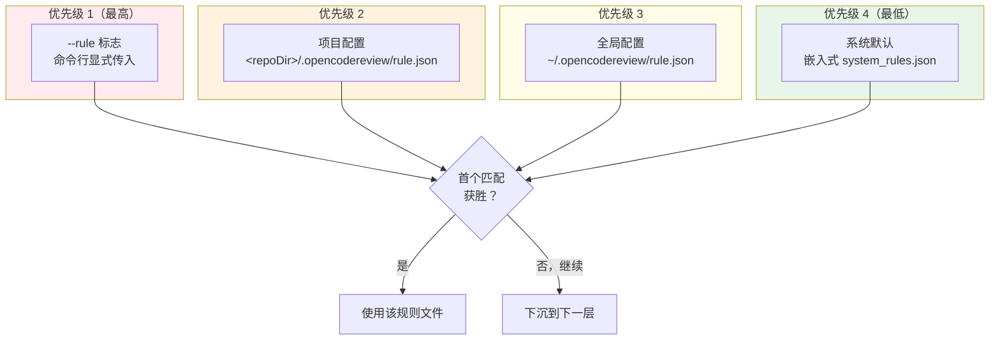
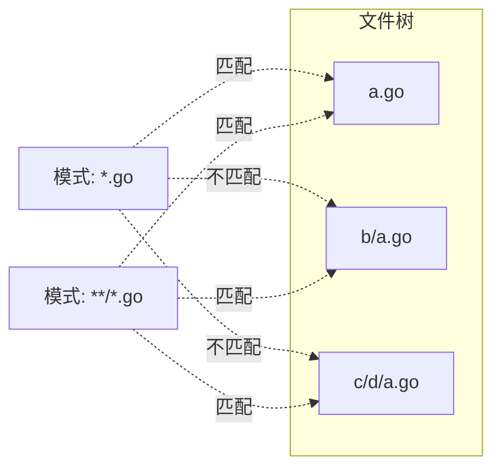
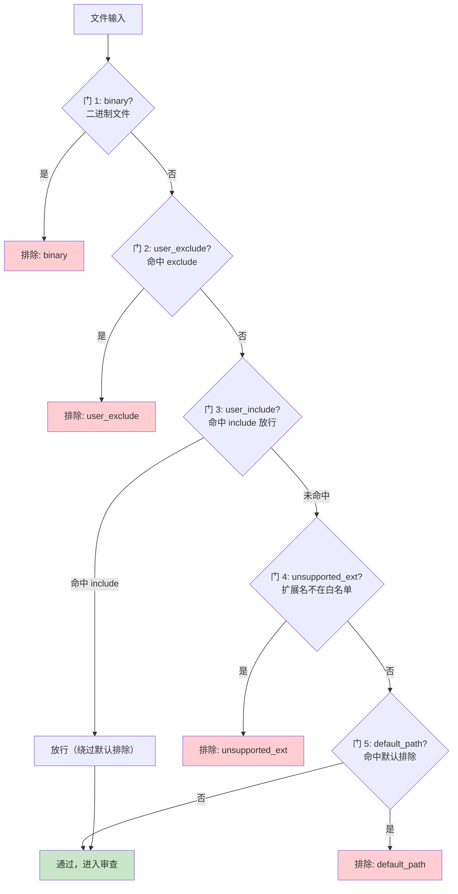
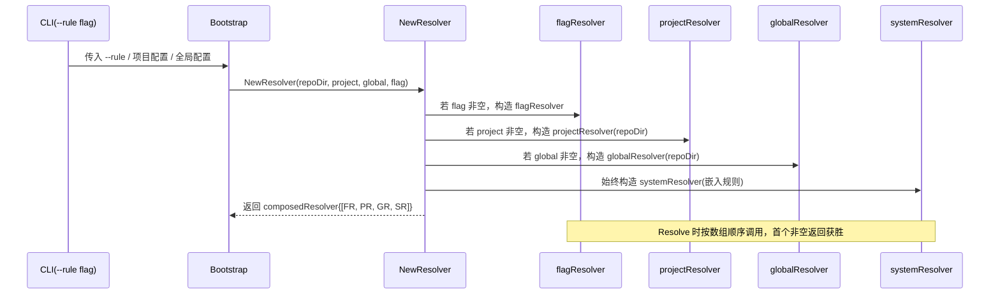

# Open Code Review 完全指南 — 审查规则系统

> 本章深入解析 Open Code Review（以下简称 OCR）的规则系统——一种四层优先级、Glob 驱动、可调试、可委托的审查规则解析机制。涵盖四层优先级合并、ProjectRule 结构、Glob 匹配语法、内置默认排除、系统规则映射、文件过滤五门算法、规则文件安全限制以及 `ocr rules check` 调试命令。

---

## 1. 规则系统总览：四层优先级合并

OCR 的规则系统并非"单一配置文件"，而是采用**四层优先级 + 首个匹配获胜**的合并模型。理解优先级是掌握规则系统的第一步。

### 1.1 四层优先级 Mermaid 图



四层从高到低的语义如下：

| 优先级 | 来源 | 路径/形态 | 适用场景 |
|--------|------|-----------|----------|
| 1（最高） | 命令行 `--rule` | flag 显式传入 | 一次性覆盖、调试、CI 临时指定 |
| 2 | 项目配置 | `<repoDir>/.opencodereview/rule.json` | 团队级规则固化到仓库 |
| 3 | 全局配置 | `~/.opencodereview/rule.json` | 个人/机器级默认偏好 |
| 4（最低） | 系统默认 | 嵌入式 `system_rules.json` | 内置兜底，覆盖 30+ 语言 |

> **关键洞察**：**首个匹配模式获胜**（first-match-wins）。解析器从最高优先级开始逐层查找，一旦某个 Glob 模式匹配到目标文件，立即返回对应的规则文件，不再继续下沉。这意味着高优先级可以"遮蔽"低优先级对同一文件类型的规则，但不会影响未被高优先级覆盖的文件类型。

### 1.2 composedResolver 四层构建（NewResolver）

OCR 通过 `NewResolver` 构建一个 `composedResolver`，将上述四层按优先级串联：

```go
// internal/rules/resolver.go
func NewResolver(repoDir string, projectRule, globalRule *ProjectRule, flagRule string) Resolver {
    resolvers := []Resolver{}

    // 优先级 1：--rule flag
    if flagRule != "" {
        resolvers = append(resolvers, newFlagResolver(flagRule))
    }
    // 优先级 2：项目级 rule.json
    if projectRule != nil {
        resolvers = append(resolvers, newProjectResolver(repoDir, projectRule))
    }
    // 优先级 3：全局 rule.json
    if globalRule != nil {
        resolvers = append(resolvers, newProjectResolver(repoDir, globalRule))
    }
    // 优先级 4：系统默认
    resolvers = append(resolvers, newSystemResolver(embeddedSystemRules))

    return &composedResolver{resolvers: resolvers}
}
```

`composedResolver` 在 `Resolve(path)` 时依次调用各层 resolver，**首个返回非空规则的层获胜**。这正是"首个匹配获胜"在代码层的实现。

---

## 2. 规则文件格式：ProjectRule 结构

项目级与全局级配置共享同一个 `ProjectRule` 结构。理解它的字段是定制规则的前提。

### 2.1 ProjectRule 字段

```go
// internal/rules/types.go
type ProjectRule struct {
    // include：glob 模式，用于"绕过"内置默认排除
    // 注意：include 不是白名单，而是"放行被默认排除的文件"
    Include []string `json:"include,omitempty"`

    // exclude：glob 模式，排除文件（最高优先级）
    Exclude []string `json:"exclude,omitempty"`

    // rules：{path, rule} 数组，按声明顺序评估
    Rules []PathRule `json:"rules,omitempty"`

    // merge_system_rule：是否合并系统规则
    MergeSystemRule *bool `json:"merge_system_rule,omitempty"`
}

type PathRule struct {
    Path string `json:"path"` // glob 模式
    Rule string `json:"rule"` // 规则文件名（如 go.md）
}
```

### 2.2 字段语义详解

#### include —— 绕过默认排除，而非白名单

这是最容易误解的字段。`include` 的作用不是"只审查这些文件"，而是"把被默认排除的文件重新放行"。

例如，默认排除会跳过 `**/*_test.go`（测试文件）。如果团队希望审查测试文件，可在项目配置中：

```json
{
  "include": ["**/*_test.go"]
}
```

此时 `**/*_test.go` 不再被默认排除命中，进入审查范围。

#### exclude —— 最高优先级排除

`exclude` 是绝对的排除，优先级高于一切。即便文件被 `include` 放行、被系统规则覆盖，只要命中 `exclude`，就被排除。

```json
{
  "exclude": ["**/generated/**", "**/*.pb.go", "vendor/**"]
}
```

#### rules —— 声明顺序评估

`rules` 是一个有序数组，解析时**按声明顺序**逐条评估，首个匹配的 `path` 决定使用哪个 `rule` 文件：

```json
{
  "rules": [
    { "path": "**/proto/**/*.go", "rule": "go_proto.md" },
    { "path": "**/*.go", "rule": "go.md" }
  ]
}
```

上例中，`proto` 目录下的 Go 文件优先使用 `go_proto.md`，其余 Go 文件使用 `go.md`。声明顺序决定优先级——更具体的模式应放在前面。

#### merge_system_rule —— 合并系统规则

当设为 `true` 时，对于命中 `rules` 的文件，OCR 会把系统默认规则与项目指定规则**合并**（而非替换）。合并格式见 §10。

---

## 3. Glob 匹配语法（bmatcuk/doublestar/v4）

OCR 的 Glob 匹配由 [`bmatcuk/doublestar`](https://github.com/bmatcuk/doublestar) v4 实现，这是 Go 生态中符合 `doublestar` 规范的高性能 Glob 库。

### 3.1 语法速查表

| 通配符 | 含义 | 示例 | 匹配 | 不匹配 |
|--------|------|------|------|--------|
| `*` | 匹配除 `/` 外的任意字符 | `*.go` | `a.go` | `a/b.go` |
| `**` | 跨目录边界（含零层） | `**/*.go` | `a.go`、`a/b.go` | — |
| `?` | 匹配单个字符 | `a?c.go` | `abc.go` | `ac.go` |
| `[abc]` | 字符类，匹配其一 | `[abc].go` | `a.go` | `d.go` |
| `{a,b,c}` | 大括号扩展 | `*.{go,js}` | `a.go`、`b.js` | `a.ts` |

### 3.2 大小写不敏感

Glob 匹配在路径匹配前会**统一小写化**（路径与模式都小写），因此 `*.GO` 与 `*.go` 等价。这一点在跨平台（Windows/macOS 大小写不敏感文件系统 vs Linux 大小写敏感）场景下尤为重要，保证规则行为一致。

### 3.3 `*` 与 `**` 的关键区别

这是最容易出错的点：

- `*` **不跨越目录分隔符** `/`：`*.go` 只匹配当前目录下的 Go 文件。
- `**` **跨越目录边界**：`**/*.go` 匹配任意层级的 Go 文件。



### 3.4 大括号扩展

`{a,b,c}` 会展开为多个模式参与匹配。常用于一次匹配多种扩展名：

```
**/*.{js,jsx,ts,tsx}
```

等价于：

```
**/*.js
**/*.jsx
**/*.ts
**/*.tsx
```

---

## 4. 内置默认排除模式（default_exclude_patterns.json）

OCR 内置一份默认排除清单，跳过测试文件、生成代码、构建产物等"通常不需要审查"的文件。这份清单以嵌入式 JSON 形式打包进二进制。

### 4.1 默认排除模式节选

```json
// internal/rules/default_exclude_patterns.json（嵌入式）
[
  "**/*_test.go",
  "**/*.test.{js,jsx,ts,tsx}",
  "**/*.spec.{js,jsx,ts,tsx}",
  "**/__tests__/**",
  "**/*_test.py",
  "**/*_spec.rb",
  "**/*.test.ets",
  "**/*.spec.ets"
]
```

### 4.2 排除模式的设计逻辑

| 模式 | 覆盖场景 | 设计理由 |
|------|----------|----------|
| `**/*_test.go` | Go 测试文件 | 测试代码审查价值低，且常拖累 token 预算 |
| `**/*.test.{js,jsx,ts,tsx}` | 前端单元测试 | 同上，且前端测试常为快照式 |
| `**/__tests__/**` | Jest 测试目录 | 整目录排除，避免逐文件判断 |
| `**/*_test.py` | Python 测试 | pytest 约定 |
| `**/*_spec.rb` | RSpec 测试 | Ruby 社区约定 |
| `**/*.test.ets` | ArkTS 测试 | 鸿蒙生态测试约定 |

> **绕过方式**：若团队确实需要审查测试文件，使用项目配置的 `include` 字段重新放行（见 §2.2），而非修改内置清单。

---

## 5. 系统规则 system_rules.json

系统规则是优先级最低的兜底层，为每种文件类型提供默认的审查规则文件。它以嵌入式 JSON 打包进二进制，无需用户配置即可工作。

### 5.1 概览

`system_rules.json` 包含 **36 条 glob → 规则文件映射**，覆盖 **30+ 种语言/文件类型**。每条映射形如：

```json
// internal/rules/system_rules.json（嵌入式）
{
  "rules": [
    { "path": "**/*.go", "rule": "go.md" },
    { "path": "**/*.py", "rule": "python.md" },
    { "path": "**/*.java", "rule": "java.md" },
    { "path": "**/*.ts", "rule": "typescript.md" },
    { "path": "**/*.tsx", "rule": "react.md" }
    // ... 共 36 条
  ],
  "default_rule": "default.md"
}
```

### 5.2 default_rule 兜底

当没有任何 glob 匹配到目标文件时，使用 `default_rule` 指定的 `default.md`。这保证任何文件都不会"无规则可循"。

### 5.3 配置文件的单独映射

OCR 为常见配置文件单独映射规则文件，而非沿用 `default.md`：

| 文件 | 规则文件 | 单独映射理由 |
|------|----------|--------------|
| `**/mapper_*.xml`（MyBatis） | `mapper_dao_xml.md` | MyBatis SQL 注入风险审查 |
| `**/pom.xml` | `pom_xml.md` | Maven 依赖审查 |
| `**/build.gradle` / `build.gradle.kts` | `build_gradle.md` | Gradle 依赖审查 |
| `**/package.json` | `package_json.md` | npm 依赖与脚本审查 |
| `**/Cargo.toml` | `cargo_toml.md` | Rust 依赖审查 |
| `**/composer.json` | `composer_json.md` | PHP 依赖审查 |

### 5.4 GitHub Workflows YAML 的特殊处理

YAML 文件被区分为两类，分别映射不同规则：

- `**/.github/workflows/*.yml` 与 `*.yaml` → `github_workflow_yaml.md`（审查 secrets 泄露、权限过大、注入风险）
- 其余 `.yml` / `.yaml` → `yaml.md`（通用 YAML 审查）

这一区分体现了"文件用途决定审查策略"的设计思想：同样是 YAML，CI 工作流的安全风险远高于普通配置。

---

## 6. 文件过滤五门算法（whyExcluded 函数）

文件是否进入审查，由 `whyExcluded` 函数决定。它采用**五道关卡顺序检查**，任一关卡命中即排除并返回原因。

### 6.1 五门算法流程图



### 6.2 五门详解

| 门 | 检查内容 | 命中结果 | 说明 |
|----|----------|----------|------|
| 1 | binary | 排除 | 二进制文件不审查（图片、编译产物等） |
| 2 | user_exclude | 排除 | 命中项目/全局 `exclude`，最高优先级排除 |
| 3 | user_include | 放行并跳过门 5 | 命中 `include`，绕过默认排除，但仍受门 4 约束 |
| 4 | unsupported_ext | 排除 | 扩展名不在白名单 `supported_file_types.json` |
| 5 | default_path | 排除 | 命中 `default_exclude_patterns.json`（如测试文件） |

### 6.3 deleted 状态单独计算

`deleted`（文件被删除）状态**不在五门之内**，而是在更早阶段单独计算。已删除的文件没有内容可审查，但会在 Diff 中标记为 deleted，供下游决定是否跳过。

### 6.4 门 3 与门 5 的协作

`include`（门 3）与默认排除（门 5）是配套设计：

- 门 3 命中 → 文件被"放行"，**跳过门 5**，进入门 4 扩展名检查。
- 门 3 未命中 → 继续门 4，门 4 通过后到门 5 检查默认排除。

这意味着 `include` 是"穿透默认排除的唯一通道"，但**无法穿透扩展名白名单**（门 4）。例如，即便 `include` 放行了一个 `.bin` 文件，门 4 仍会因其扩展名不在白名单而排除。

---

## 7. 文件类型白名单（supported_file_types.json）

OCR 维护一份扩展名白名单，只有白名单内的扩展名才会被审查。这避免对二进制、媒体文件等无意义文件的审查消耗。

### 7.1 两项核心检查

```go
// internal/rules/supported_types.go
func IsAllowedExt(path string) bool {
    // 检查扩展名是否在 supported_file_types.json 白名单
}

func IsExcludedPath(path string) bool {
    // 检查路径是否命中默认排除
}
```

`IsAllowedExt` 对应门 4，`IsExcludedPath` 对应门 5。两者配合 `whyExcluded` 完成过滤。

### 7.2 白名单节选

`supported_file_types.json` 列出受支持扩展名，涵盖主流语言：

```json
// internal/rules/supported_file_types.json（嵌入式）
[
  ".go", ".py", ".java", ".kt", ".scala",
  ".js", ".jsx", ".ts", ".tsx", ".vue",
  ".c", ".cpp", ".h", ".hpp", ".rs",
  ".rb", ".php", ".swift", ".cs",
  ".yml", ".yaml", ".json", ".xml", ".toml", ".md"
]
```

> **设计权衡**：白名单比黑名单更安全——新增未知类型默认被排除，避免误审查。代价是支持新语言需更新白名单。

---

## 8. 规则文件安全限制

规则文件（`.md` / `.txt`）来自外部（项目配置、用户目录），OCR 对其施加严格的安全限制，防止规则文件成为攻击面。

### 8.1 四项安全限制

| 限制 | 值 | 防御目标 |
|------|----|----------|
| 扩展名白名单 | `.md` / `.txt` / `.markdown` | 防止加载可执行/二进制规则文件 |
| 大小上限 | 512 KB | 防止超大文件耗尽内存 |
| symlink 解析 | 解析后校验 | 防止符号链接指向仓库外 |
| 路径逃逸校验 | resolved 必须以 `cleanRepo + PathSeparator` 为前缀 | 防止 `../` 逃逸到仓库外读取敏感文件 |

### 8.2 路径逃逸校验详解

这是最关键的限制。规则文件路径经过 `filepath.Clean` + `filepath.EvalSymlinks` 解析后，必须满足：

```go
// 伪代码
resolved := filepath.Clean(filepath.Join(repoDir, rulePath))
resolved, _ = filepath.EvalSymlinks(resolved)

prefix := filepath.Clean(repoDir) + string(filepath.Separator)
if !strings.HasPrefix(resolved, prefix) {
    return error("rule file escapes repository boundary")
}
```

只有解析后的绝对路径**以 `repoDir + 路径分隔符`为前缀**，才被接受。这杜绝了：

- `../../etc/passwd` 逃逸
- symlink 指向 `/etc/shadow`
- `..%2f..%2f` 编码绕过

### 8.3 symlink 解析

OCR 会调用 `EvalSymlinks` 解析符号链接到真实路径，再套用路径逃逸校验。因此即便规则文件本身是合法的 `.md`，但 symlink 指向仓库外，仍会被拒绝。

---

## 9. composedResolver 四层构建（NewResolver）

§1.2 已展示 `NewResolver` 的代码骨架。这里补充构建时序与各层 resolver 的职责。

### 9.1 构建时序图



### 9.2 Resolve 调用逻辑

```go
// internal/rules/resolver.go
func (c *composedResolver) Resolve(path string) (ruleFile string, ok bool) {
    for _, r := range c.resolvers {
        if ruleFile, ok = r.Resolve(path); ok {
            return ruleFile, true  // 首个匹配获胜
        }
    }
    return "", false
}
```

`composedResolver` 不做合并——它只负责按序查询。合并逻辑由 `mergeWithSystemRule`（§10）在需要时显式触发。

---

## 10. mergeWithSystemRule 合并格式

当 `ProjectRule.merge_system_rule` 为 `true` 时，对命中项目 `rules` 的文件，OCR 会把系统默认规则与项目指定规则**合并**为一份规则文本，而非替换。

### 10.1 合并格式

```
# 项目规则（来自 <repoDir>/.opencodereview/rules/<rule>.md）

<项目规则文件内容>

---

# 系统默认规则（来自 system_rules.json 对应文件）

<系统规则文件内容>
```

合并后，项目规则在前，系统规则在后。Agent 同时看到两份指引。这一设计让团队既能补充项目特有约定，又不丢失系统级的通用最佳实践。

### 10.2 何时使用合并

- 不开启 `merge_system_rule`：项目 `rules` 命中后**替换**系统规则，完全自定义。
- 开启 `merge_system_rule`：项目规则与系统规则**并存**，适合"在系统规则基础上增量补充"。

---

## 11. 规则调试：`ocr rules check` 命令

规则系统复杂，调试至关重要。OCR 提供 `ocr rules check <file-path>` 命令，输出指定文件命中了哪一层、哪个模式、哪个规则文件。

### 11.1 命令用法

```bash
ocr rules check src/main.go
```

### 11.2 输出四项

| 输出项 | 含义 | 示例 |
|--------|------|------|
| File | 被检查的文件 | `src/main.go` |
| Source | 命中的规则来源层 | `project` / `global` / `system` / `flag` |
| Pattern | 命中的 glob 模式 | `**/*.go` |
| Rule | 使用的规则文件 | `go.md` |

### 11.3 调试示例

```bash
$ ocr rules check internal/handler/user_test.go
File:    internal/handler/user_test.go
Source:  default-exclude
Pattern: **/*_test.go
Rule:    (excluded)
```

上例中，测试文件被默认排除命中，`Rule` 显示 `(excluded)`，明确告知该文件不会进入审查。

```bash
$ ocr rules check src/main.go
File:    src/main.go
Source:  system
Pattern: **/*.go
Rule:    go.md
```

此例文件未被项目/全局规则覆盖，下沉到系统层，命中 `**/*.go`，使用 `go.md`。

> **调试价值**：`ocr rules check` 是排查"为什么这个文件被审查/未被审查"的唯一权威工具。它让规则系统的黑盒变得透明。

---

## 12. 配置示例

### 12.1 项目级 rule.json

在仓库根目录创建 `.opencodereview/rule.json`：

```json
{
  "include": ["**/*_test.go"],
  "exclude": ["vendor/**", "**/generated/**", "**/*.pb.go"],
  "rules": [
    { "path": "**/proto/**/*.go", "rule": "go_proto.md" },
    { "path": "**/*.go", "rule": "go.md" },
    { "path": "**/*.py", "rule": "python_strict.md" }
  ],
  "merge_system_rule": true
}
```

对应的规则文件放在 `.opencodereview/rules/` 目录下：

```
.opencodereview/
├── rule.json
└── rules/
    ├── go_proto.md
    ├── go.md
    └── python_strict.md
```

### 12.2 `--rule` flag 一次性覆盖

```bash
ocr review --from "origin/main" --to "origin/feature/x" \
  --rule "go_strict.md"
```

`--rule` 优先级最高，对所有文件使用指定规则文件，覆盖项目/全局/系统配置。适合一次性严格审查或调试。

### 12.3 `--exclude` flag 临时排除

```bash
ocr review --from "HEAD~1" --to "HEAD" \
  --exclude "docs/**,**/*.md"
```

`--exclude` 接受逗号分隔的 glob 模式，临时排除指定路径，不修改配置文件。适合在 CI 中针对某次提交临时过滤噪音。

### 12.4 全局配置示例

在 `~/.opencodereview/rule.json` 配置个人默认偏好：

```json
{
  "exclude": ["**/*.min.js", "**/*.map"],
  "rules": [
    { "path": "**/*.go", "rule": "go.md" }
  ]
}
```

全局配置适用于所有仓库，但优先级低于项目配置，适合设置"通用兜底偏好"。

---

## 13. 小结与设计哲学

OCR 的规则系统体现了"确定性工程"的核心信条：

1. **分层而非集中**：四层优先级让规则可在团队、个人、CI 间灵活分工，而又保持可预测的合并语义。
2. **首个匹配获胜**：避免规则冲突的歧义，高优先级可遮蔽但不清空低优先级。
3. **Glob 驱动**：用开发者熟悉的 glob 语法表达文件选择，降低学习成本。
4. **默认排除 + include 穿透**：默认跳过低价值文件，但保留"放行"通道，而非硬编码黑名单。
5. **安全优先**：规则文件施加扩展名、大小、symlink、路径逃逸四重限制，杜绝规则成为攻击面。
6. **可调试**：`ocr rules check` 让规则解析透明可审计。

这一系统为后续章节的会话持久化、遥测与集成扩展提供了坚实的规则解析基础——所有下游模块（Agent、Manifest、Viewer）都建立在"已正确解析规则"的前提之上。
