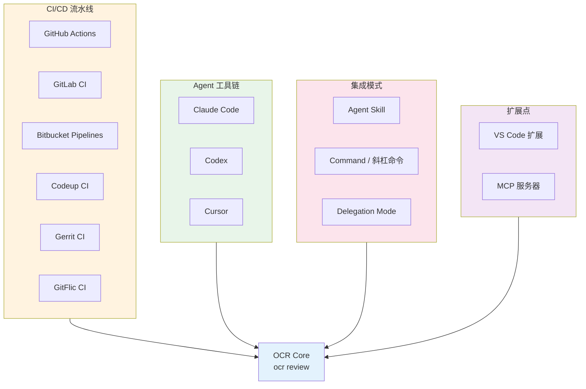
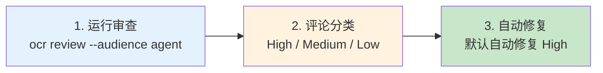
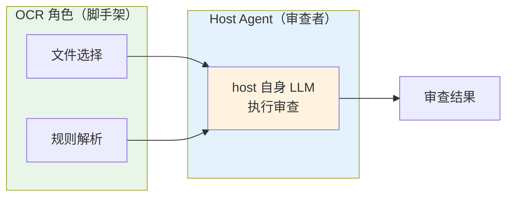
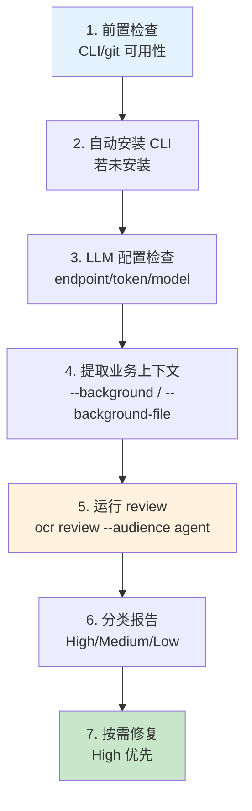
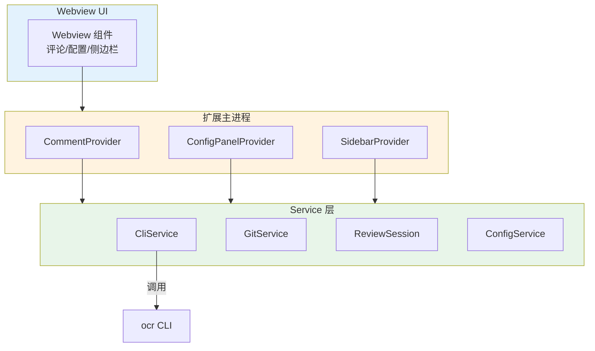
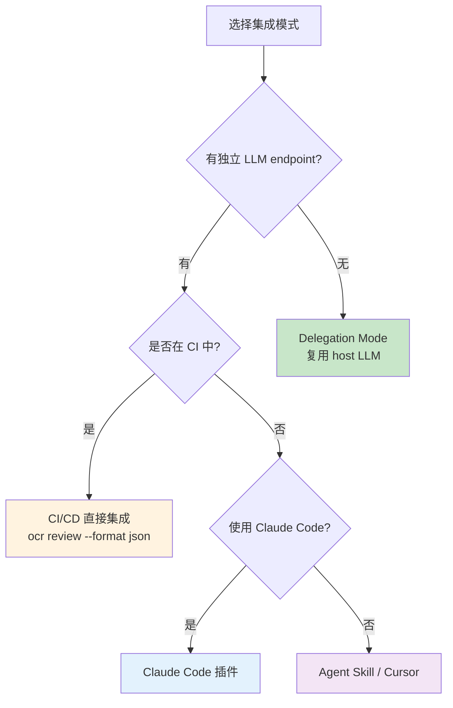
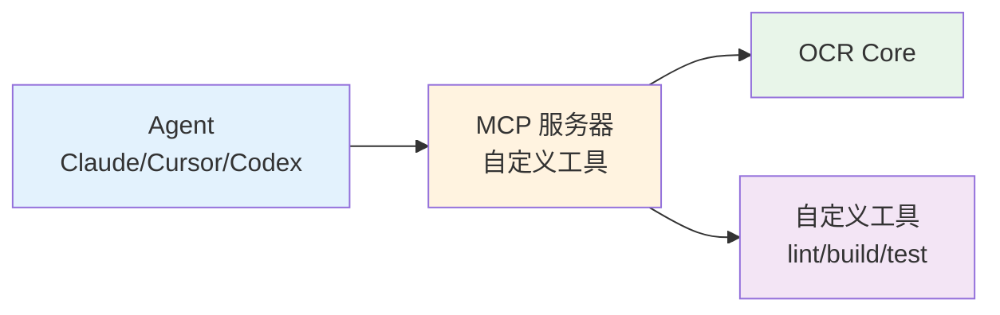

# Open Code Review 完全指南 — 集成与扩展

> 本章梳理 Open Code Review（以下简称 OCR）的集成生态——从 CI/CD 流水线（GitHub Actions / GitLab CI / Bitbucket / Codeup / Gerrit / GitFlic），到 Agent 工具链（Claude Code / Codex / Cursor），再到委托模式（Delegation Mode）、Agent Skill、VS Code 扩展与 MCP 服务器。理解这些集成模式，才能在不同工作流中正确接入 OCR。

---

## 1. 集成生态总览

OCR 提供多种集成形态，覆盖"无 Agent 介入"的纯 CI 场景与"Agent 主导"的交互场景。



所有集成都收敛到核心命令 `ocr review`，差异在于"谁来调用、传什么参数、谁来消费结果"。

---

## 2. CI/CD 集成

### 2.1 核心命令模式

CI 集成的共同骨架是调用 `ocr review`，输出 JSON 供下游消费：

```bash
ocr review \
  --from "origin/<base>" \
  --to "origin/<head>" \
  --format json \
  --audience agent
```

关键 flag 说明：

| Flag | 作用 |
|------|------|
| `--from` / `--to` | 基线与目标 ref |
| `--format json` | 输出机器可读 JSON |
| `--audience agent` | 评论面向 Agent（结构化、可被解析） |

`--audience agent` 让评论以"Agent 可解析"的结构化格式输出，便于 CI 自动评论或 Agent 自动修复。

### 2.2 GitHub Actions

GitHub Actions 是 OCR 最常见的 CI 集成目标。

#### 触发条件

使用 `pull_request_target`（而非 `pull_request`），在两种事件触发：

- `opened`：PR 创建时
- `issue_comment`：评论触发（支持 `/ocr` 类命令）

```yaml
on:
  pull_request_target:
    types: [opened]
  issue_comment:
    types: [created]
```

#### 必需配置

```yaml
jobs:
  review:
    runs-on: ubuntu-latest
    steps:
      - uses: actions/checkout@v4
        with:
          fetch-depth: 0          # 必须完整历史，用于 diff
          ref: ${{ github.event.pull_request.base.ref }}
      - name: Run OCR
        env:
          OCR_LLM_URL: ${{ secrets.OCR_LLM_URL }}
          OCR_LLM_AUTH_TOKEN: ${{ secrets.OCR_LLM_AUTH_TOKEN }}
          OCR_LLM_MODEL: ${{ secrets.OCR_LLM_MODEL }}
          OCR_LLM_USE_ANTHROPIC: "true"
          GITHUB_TOKEN: ${{ secrets.GITHUB_TOKEN }}
        run: |
          ocr review \
            --from "origin/${{ github.event.pull_request.base.ref }}" \
            --to "origin/${{ github.event.pull_request.head.ref }}" \
            --format json \
            --audience agent
```

关键点：

| 配置项 | 要求 | 理由 |
|--------|------|------|
| `fetch-depth: 0` | 必需 | 完整 git 历史供 diff 计算 |
| `pull-requests: write` 权限 | 必需 | 写入 review 评论 |
| `OCR_LLM_URL` | secret | LLM endpoint |
| `OCR_LLM_AUTH_TOKEN` | secret | LLM 鉴权 |
| `OCR_LLM_MODEL` | secret | 模型名 |
| `OCR_LLM_USE_ANTHROPIC` | secret | 是否走 Anthropic 协议 |

#### extra_body 关闭 thinking

通过 `extra_body` 关闭模型的 thinking（推理链），避免在 CI 中浪费 token：

```yaml
- name: Run OCR
  env:
    OCR_LLM_EXTRA_BODY: '{"thinking":{"type":"disabled"}}'
```

### 2.3 GitLab CI

GitLab 在 `merge_requests` 事件触发：

```yaml
review:
  image: node:20
  rules:
    - if: $CI_PIPELINE_SOURCE == "merge_request_event"
  variables:
    GIT_DEPTH: 0
    OCR_LLM_URL: $OCR_LLM_URL
    OCR_LLM_AUTH_TOKEN: $OCR_LLM_AUTH_TOKEN
    OCR_LLM_MODEL: $OCR_LLM_MODEL
    GITLAB_API_TOKEN: $GITLAB_API_TOKEN
  script:
    - ocr review --from "$CI_MERGE_REQUEST_TARGET_BRANCH_SHA" --to "$CI_MERGE_REQUEST_SOURCE_BRANCH_SHA" --format json --audience agent
```

关键变量：

| 变量 | 作用 |
|------|------|
| `GIT_DEPTH: 0` | 完整历史 |
| `OCR_LLM_URL` / `OCR_LLM_AUTH_TOKEN` / `OCR_LLM_MODEL` | LLM 配置 |
| `GITLAB_API_TOKEN` | 通过 GitLab API 写评论 |

### 2.4 GitHub App 身份

对需要更高 API 限额的场景，使用 GitHub App 身份而非默认 `GITHUB_TOKEN`：

```yaml
env:
  GITHUB_APP_ID: ${{ secrets.GITHUB_APP_ID }}
  GITHUB_APP_PRIVATE_KEY: ${{ secrets.GITHUB_APP_PRIVATE_KEY }}
  GITHUB_APP_INSTALLATION_ID: ${{ secrets.GITHUB_APP_INSTALLATION_ID }}
```

OCR 会用 App 凭证换取 installation token，规避 PAT/`GITHUB_TOKEN` 的速率限制。

### 2.5 其他 CI 平台

| 平台 | 触发 | 镜像/运行时 | 关键变量 |
|------|------|-------------|----------|
| Bitbucket Pipelines | pull request | 自定义 | `BITBUCKET_*` |
| Codeup CI（阿里云） | merge request | node:20 | `CODEUP_TOKEN` |
| Gerrit CI | patchset-created | node:20 | `GERRIT_*` |
| GitFlic CI | pull request | node:20 | `GITFLIC_TOKEN` |

核心模式一致：触发事件 + 完整 diff + LLM secret + 平台 token。

---

## 3. Claude Code 插件集成

Claude Code 是 Anthropic 的命令行编码 Agent，OCR 提供原生插件集成。

### 3.1 两种安装方式

#### 市场安装

```
/plugin marketplace add alibaba/open-code-review
/plugin install
```

#### 直接复制

把 slash command 文件放到：

- **项目级**：`<repoDir>/.claude/commands/open-code-review.md`
- **用户级**：`~/.claude/commands/open-code-review.md`

项目级优先于用户级，适合团队在仓库内固化命令。

### 3.2 三步工作流



1. **运行审查**：调用 `ocr review --audience agent`，得到结构化评论。
2. **评论分类**：按严重性分类——High（需修复）、Medium（建议）、Low（提示）。
3. **自动修复**：默认自动修复 High 级问题，Medium/Low 由用户决定。

这种"审查 → 分类 → 修复"闭环让 Claude Code 在审查结果上直接行动，而非仅展示。

---

## 4. Codex / Cursor 集成

Codex 与 Cursor 等 Agent 工具同样支持插件安装。OCR 提供 callable review skills，供这些工具按需调用：

- 安装插件后，工具可调用 `ocr review` skill。
- 严重性分类与 Claude Code 一致（High/Medium/Low）。
- 修复策略由宿主工具决定。

集成形态与 Claude Code 类似，差异在于宿主 Agent 的"修复自主度"——Cursor 倾向交互式确认，Claude Code 倾向自动修复。

---

## 5. 委托模式（Delegation Mode）

Delegation Mode 是一种特殊集成形态：**OCR 处理确定性工程（文件选择、规则解析），host agent 使用自身 LLM 执行审查**。

### 5.1 核心思想



Delegation Mode 下，OCR **不调用 LLM**——它只做"哪些文件要审、每文件用什么规则"的确定性工作，把这份"审查脚手架"交给 host agent。host agent 用自己的 LLM 执行审查。

### 5.2 配置优势

- **无需 OCR LLM 端点配置**：不用配 `OCR_LLM_URL` 等 secret。
- **复用 host agent 的 LLM 配额**：用 Claude Code/Cursor 已有的 LLM 订阅。
- **审查上下文留在 host 内**：避免敏感代码发给 OCR 配置的第三方 LLM。

### 5.3 子命令

| 子命令 | 作用 |
|--------|------|
| `ocr delegate preview` | 输出待审文件列表 + 每文件元数据（规则、行数） |
| `ocr delegate rule` | 输出规则解析结果（每文件命中哪条规则） |

### 5.4 共享 flag

Delegation Mode 与 `review` 共享以下 flag：

| Flag | 作用 |
|------|------|
| `--from` / `--to` | ref 范围 |
| `--commit` | 单提交 |
| `--repo` | 仓库路径 |
| `--rule` | 覆盖规则 |
| `--exclude` | 排除模式 |
| `--background` / `--background-file` | 业务上下文（见 §9） |

### 5.5 严重性分类

Delegation Mode 的输出按严重性分类，决定是否报告：

| 严重性 | 报告策略 |
|--------|----------|
| Critical | 总是报告 |
| High | 总是报告 |
| Medium | 带上下文报告 |
| Low | 静默丢弃 |

Low 级静默丢弃避免噪音——委托模式下 host agent 更关注"会出事"的问题，而非风格建议。

---

## 6. Agent Skill 集成

Agent Skill 是更结构化的集成形态，提供 SKILL.md 规范的工作流。

### 6.1 SKILL.md 位置与安装

- **位置**：`skills/open-code-review/SKILL.md`
- **安装**：

```bash
npx skills add alibaba/open-code-review --skill open-code-review
```

### 6.2 七步工作流



| 步骤 | 动作 |
|------|------|
| 1 | 检查 CLI 与 git 可用性 |
| 2 | 若未安装 OCR CLI，自动安装 |
| 3 | 检查 LLM 配置（endpoint/token/model） |
| 4 | 提取业务上下文（见 §9） |
| 5 | 运行 `ocr review --audience agent` |
| 6 | 按严重性分类报告 |
| 7 | 按需修复 High 级问题 |

### 6.3 Anthropic Agent SDK 集成示例

通过 Anthropic Agent SDK 调用 OCR skill：

```python
from anthropic import Agent

agent = Agent(
    tools=[...],
    skills=["open-code-review"]
)

agent.run("审查当前分支与 main 的差异")
```

Skill 在运行时被 Agent 加载，按七步工作流执行，结果回传给 Agent 决策修复。

---

## 7. VS Code 扩展（extensions/vscode/）

OCR 提供 VS Code 扩展，在编辑器内集成审查。

### 7.1 Provider 层

| Provider | 职责 |
|----------|------|
| `CommentProvider` | 提供 review 评论的树/列表视图 |
| `ConfigPanelProvider` | 提供配置面板（endpoint/规则/exclude） |
| `SidebarProvider` | 提供侧边栏入口 |

### 7.2 Service 层

| Service | 职责 |
|---------|------|
| `CliService` | 封装 `ocr` CLI 调用 |
| `GitService` | git 操作（diff、ref 解析） |
| `ReviewSession` | 管理一次审查会话状态 |
| `ConfigService` | 配置读写（settings.json） |

### 7.3 架构



Webview UI 通过 Provider 与 Service 通信，Service 调用 `ocr` CLI 完成实际审查。

---

## 8. 集成模式对比

不同集成模式在"LLM 调用方""OCR 角色""配置需求"上差异显著。

### 8.1 对比表格

| 模式 | LLM 调用方 | OCR 角色 | 配置需求 |
|------|-----------|----------|----------|
| **Agent Skill** | OCR 调用 LLM | agent 调用 `ocr review` | OCR LLM endpoint 全套 |
| **Command / Claude Code** | OCR 调用 LLM | Claude Code 斜杠命令 | OCR LLM endpoint 全套 |
| **Delegation Mode** | host agent 调用 LLM | OCR 提供脚手架 | 无需 OCR LLM 端点 |

### 8.2 选型决策树



核心决策点是"LLM 由谁调用"——有独立 endpoint 时 OCR 调用；无 endpoint 时用 Delegation Mode 让 host agent 调用。

---

## 9. 业务上下文传递：`--background` / `--background-file`

审查的"业务意图"往往无法从 diff 自身推断。OCR 通过 `--background` / `--background-file` 让用户向审查传递业务上下文。

### 9.1 两种传递方式

| Flag | 用法 | 适用场景 |
|------|------|----------|
| `--background` | 直接传字符串 | 简短说明 |
| `--background-file` | 指定文件路径 | 长文本 / 模板 |

### 9.2 示例

```bash
ocr review --from origin/main --to origin/feature/payment \
  --background "本次变更实现支付幂等，重点关注重复扣款风险"
```

或用文件：

```bash
ocr review --from origin/main --to origin/feature/payment \
  --background-file .opencodereview/context.md
```

`context.md` 示例：

```markdown
# 本次审查背景

- 业务目标：实现支付幂等，避免重复扣款
- 关键约束：不可引入分布式锁（单机部署）
- 关注点：金额计算精度、并发请求处理
```

业务上下文会注入 Agent 的审查 prompt，让评论聚焦业务风险而非通用风格问题。

### 9.3 与 Delegation Mode 协作

在 Delegation Mode 下，`--background` 同样有效——上下文传给 host agent，让其审查时纳入业务意图。这保证委托模式不丢失业务聚焦。

---

## 10. MCP 服务器扩展

OCR 支持通过 MCP（Model Context Protocol）服务器扩展自定义工具，供 Agent 在审查中调用。

### 10.1 集成形态



MCP 服务器作为 Agent 与 OCR/自定义工具间的桥梁，让 Agent 在审查过程中按需调用 OCR 与项目自有工具（lint、构建、测试），形成"审查 → 验证"闭环。

### 10.2 自定义工具集成

通过 MCP 暴露自定义工具后，Agent 可在 `main_task` 中调用，例如：

- `lint`：对建议的修复跑 linter 验证
- `build`：验证修复不破坏构建
- `test`：跑相关测试用例

这让审查不只是"指出问题"，而是"指出并验证可修复"。

---

## 11. 完整集成示例：GitHub Actions + 自动评论

下面是一个生产可用的 GitHub Actions 完整示例，自动对 PR 评论并按严重性分组：

```yaml
name: Code Review

on:
  pull_request_target:
    types: [opened, synchronize]
  issue_comment:
    types: [created]

permissions:
  contents: read
  pull-requests: write

jobs:
  review:
    if: |
      github.event_name == 'pull_request_target' ||
      (github.event_name == 'issue_comment' &&
       startsWith(github.event.comment.body, '/ocr'))
    runs-on: ubuntu-latest
    steps:
      - uses: actions/checkout@v4
        with:
          fetch-depth: 0
          ref: ${{ github.event.pull_request.base.ref }}

      - name: Install OCR
        run: npm install -g @opencodereview/cli

      - name: Run Review
        id: review
        env:
          OCR_LLM_URL: ${{ secrets.OCR_LLM_URL }}
          OCR_LLM_AUTH_TOKEN: ${{ secrets.OCR_LLM_AUTH_TOKEN }}
          OCR_LLM_MODEL: ${{ secrets.OCR_LLM_MODEL }}
          OCR_LLM_USE_ANTHROPIC: "true"
          OCR_LLM_EXTRA_BODY: '{"thinking":{"type":"disabled"}}'
        run: |
          ocr review \
            --from "origin/${{ github.event.pull_request.base.ref }}" \
            --to "origin/${{ github.event.pull_request.head.ref }}" \
            --format json \
            --output review.json \
            --audience agent \
            --background-file .opencodereview/context.md

      - name: Post Comments
        env:
          GITHUB_TOKEN: ${{ secrets.GITHUB_TOKEN }}
        run: |
          # 解析 review.json 并按 High/Medium/Low 分组评论
          ocr comment --input review.json --format github-pr
```

关键设计：

1. `pull_request_target` + `issue_comment` 双触发，支持 `/ocr` 命令重跑。
2. `fetch-depth: 0` 保证 diff 完整。
3. `extra_body` 关闭 thinking 节省 token。
4. `--background-file` 传递业务上下文。
5. `ocr comment` 子命令把 JSON 评论格式化为 GitHub PR review。

---

## 12. 小结与选型建议

OCR 的集成生态覆盖从"无人值守 CI"到"Agent 主导交互"的全谱系：

1. **CI/CD 集成**：`ocr review --format json --audience agent` 是统一入口，GitHub Actions / GitLab / Bitbucket / Codeup / Gerrit / GitFlic 模式一致。
2. **Agent 工具链**：Claude Code / Codex / Cursor 通过插件或 skill 接入，"审查 → 分类 → 修复"闭环。
3. **Delegation Mode**：OCR 出脚手架、host agent 出 LLM，适合无独立 endpoint 或希望代码不外发的场景。
4. **Agent Skill**：七步工作流提供开箱即用的结构化集成。
5. **VS Code 扩展**：编辑器内集成，Provider/Service/Webview 三层架构。
6. **MCP 服务器**：扩展自定义工具，形成"审查 → 验证"闭环。
7. **业务上下文**：`--background` / `--background-file` 让审查聚焦业务风险。

选型核心问题始终是"LLM 由谁调用、结果由谁消费"——回答这两个问题，即可在上述模式中选定集成方案。至此，Open Code Review 的规则系统、会话持久化/遥测与集成扩展三章构成了从"如何配置规则"到"如何观测审查"再到"如何接入工作流"的完整闭环。
