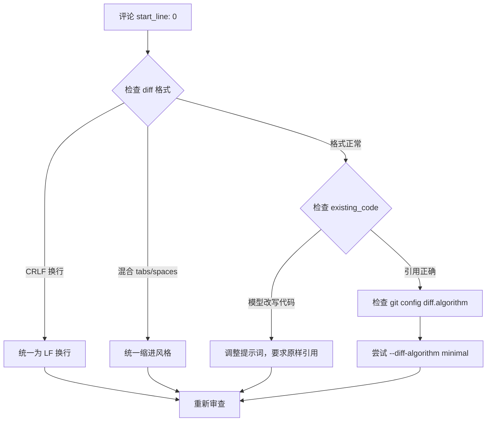
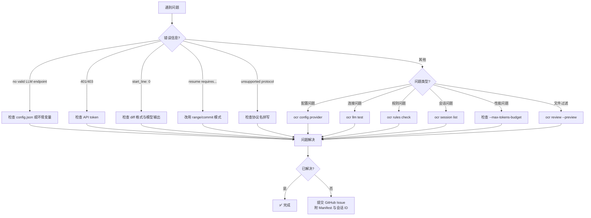

# Open Code Review 完全指南 — FAQ 与排错

> 本章汇总使用 Open Code Review（以下简称 OCR）过程中最常见的问题、错误信息与排错思路，涵盖 LLM 配置、文件过滤、会话恢复、性能成本、集成、卸载、调试技巧与平台兼容性，帮助你在遇到问题时快速定位根因并恢复工作流。

---

## 1. 常见错误与解决方案速查表

下表整理了 OCR 在运行过程中最常出现的错误信息、根因分析与解决方案，遇到问题时可先在此查找。

| 错误信息 | 根因 | 解决方案 |
|---------|------|---------|
| `no valid LLM endpoint configured` | 未配置任何可用的 LLM 端点 | 使用 `ocr config set` 写入三元组（URL, token, model），或通过环境变量 `OCR_LLM_URL` / `OCR_LLM_TOKEN` / `OCR_LLM_MODEL` 提供 |
| `401 Unauthorized` / `403 Forbidden` | API token 错误、过期或权限不足 | 检查 API key 是否有效；确认账户额度；确保 token 未被环境变量覆盖 |
| 评论 `start_line: 0` / `end_line: 0` | 模型输出的代码引用无法锚定到 diff 的精确行号 | 模型可能改写了 `existing_code` 字段；或 diff 格式异常（CRLF 换行、混合 tabs/spaces）。检查 `ocr rules check` 输出与 diff 原始格式 |
| `resume requires --from/--to or --commit` | 在 workspace 模式下尝试使用 `--resume` | workspace 模式不支持 resume；改用 range 或 commit 审查后再恢复 |
| `unsupported protocol` | 协议名拼写错误或不在支持列表内 | 确认协议名为 `anthropic`、`openai` 或 `openai-responses` 之一，区分大小写 |
| `context window exceeded` | 上下文窗口超限 | 检查 `--max-tokens-budget` 是否过小；启用内存压缩；缩小 diff 范围 |
| `tool request times exceeded` | 工具调用次数超过 `MAX_TOOL_REQUEST_TIMES=30` | 检查是否存在工具循环；调整规则复杂度；拆分大文件 |
| `diff provider not found` | 未安装 git 或不在 git 仓库内 | 确认 `git ≥ 2.41` 已安装；确认当前目录是 git 仓库；scan 模式可不依赖 git |

> **排错原则**：先看错误信息是否在上表中，再看 Manifest 中最后一个 Subtask 的退出状态，最后用 `ocr review --preview` 验证文件过滤是否符合预期。

---

## 2. LLM 配置 FAQ

LLM 配置是 OCR 使用中最容易出错的环节，以下问题在社区反馈中占比最高。

### Q1: OCR 使用哪个 LLM 端点？多个配置会优先用哪个？

**A**: OCR 使用**首个完整的三元组**（URL, token, model），而非最后一个。配置解析顺序为：

1. 命令行参数 `--llm-url` / `--llm-token` / `--llm-model`
2. 环境变量 `OCR_LLM_URL` / `OCR_LLM_TOKEN` / `OCR_LLM_MODEL`
3. 配置文件 `~/.opencodereview/config.json` 中的 `llm.url` / `llm.token` / `llm.model`

> **关键陷阱**：当配置文件中**同时包含所有三个 `llm.*` 键**时，环境变量将被忽略。如果希望通过环境变量覆盖配置文件，必须先从配置文件中删除对应的键。

### Q2: Anthropic 与 OpenAI 的 URL 结尾有什么区别？

**A**: 两个协议的 endpoint 路径不同，必须严格匹配：

| 协议 | URL 结尾 | 说明 |
|------|---------|------|
| `anthropic` | `/v1/messages` | Anthropic Messages API |
| `openai` | `/v1/chat/completions` | OpenAI Chat Completions API |
| `openai-responses` | `/v1/responses` | OpenAI Responses API（新版） |

URL 错误会导致 `404` 或协议解析失败。

### Q3: 哪些模型可以正常工作？deepseek-r1 行不行？

**A**: OCR 依赖**原生工具调用**（function calling）能力。模型分类如下：

| 模型 | 原生工具调用 | OCR 兼容性 |
|------|------------|-----------|
| Claude 3.5/3.7/4 系列 | ✅ 支持 | ✅ 完全兼容 |
| GPT-4o / GPT-4.1 | ✅ 支持 | ✅ 完全兼容 |
| Qwen3 系列 | ✅ 支持 | ✅ 可正常工作 |
| DeepSeek-V3 | ✅ 支持 | ✅ 可正常工作 |
| deepseek-r1 | ❌ 仅"叙述"工具调用 | ❌ 无法工作 |
| 早期开源模型（无 function calling） | ❌ 不支持 | ❌ 无法工作 |

> **判断标准**：模型必须在 API 层面返回结构化的 `tool_use` 块，而非在文本中"描述"要调用哪个工具。deepseek-r1 这类仅在文本中叙述工具调用的模型无法驱动 OCR 的工具循环。

### Q4: 如何选择本地 Ollama 模型？

**A**: Ollama 模型必须支持工具调用。可在官方页面筛选：

- **Ollama 工具支持模型列表**：https://ollama.com/search?c=tools

常见可用模型包括 `qwen2.5:32b`、`llama3.1:70b` 等。配置示例：

```bash
ocr config set llm.url http://localhost:11434/v1/chat/completions
ocr config set llm.protocol openai
ocr config set llm.model qwen2.5:32b
ocr config set llm.token ollama  # Ollama 不需要真实 token，占位即可
```

### Q5: `ocr llm test` 报成功但审查时失败？

**A**: `ocr llm test` 仅测试基础连接和单次推理，不测试工具调用。建议用 `ocr llm test --with-tools`（如可用）或直接跑一个小 PR 验证工具循环是否正常。常见原因是模型声明支持工具但实际实现不完整。

---

## 3. 文件过滤 FAQ

### Q1: 如何查看某个文件被保留或排除的原因？

**A**: 使用 `ocr review --preview` 输出每文件的保留/排除原因。输出示例如下：

```
src/main.go                  ✓ kept (default_path)
src/test/main_test.go        ✗ excluded (test_file_pattern)
vendor/github.com/xxx/...    ✗ excluded (vendor_dir)
docs/logo.png                ✗ excluded (binary)
build/output.js              ✗ excluded (build_dir)
node_modules/react/...       ✗ excluded (node_modules)
*.md                         ✗ excluded (unsupported_ext)
deleted_file.go              ✗ excluded (deleted)
```

排除原因共五种：

| 原因标签 | 说明 |
|---------|------|
| `binary` | 二进制文件（图片、字体、压缩包等） |
| `user_exclude` | 用户配置的 `exclude` 规则命中 |
| `unsupported_ext` | 不在支持扩展名列表内（如 `.md`、`.txt`、`.lock`） |
| `default_path` | 命中默认排除路径（见下表） |
| `deleted` | 文件被删除，无内容可审查 |

### Q2: 测试文件默认排除哪些模式？

**A**: OCR 默认排除以下测试文件模式（可通过配置覆盖）：

```
**/*_test.go
**/*_test.py
**/*.test.ts
**/*.test.tsx
**/*.test.js
**/*.spec.ts
**/*.spec.tsx
**/*.spec.js
**/test/**
**/tests/**
**/__tests__/**
**/__test__/**
```

### Q3: vendor、node_modules 等噪声目录在哪一层过滤？

**A**: 在 **Diff Provider 层**过滤，而非 Agent 层。这意味着这些目录的内容根本不会进入 Subtask 调度，避免浪费 token。默认排除路径包括：

```
vendor/
node_modules/
third_party/
build/
dist/
*.lock
package-lock.json
yarn.lock
```

> **设计意图**：在最早阶段过滤噪声，确保 Agent 只看到"真正需要审查的代码"。

---

## 4. 会话与恢复 FAQ

### Q1: 会话存储在哪里？格式是什么？

**A**: 会话存储在 `~/.opencodereview/sessions/` 目录下，采用 **JSONL 格式**（每行一个 JSON 对象，追加式写入）。文件名格式为 `<session-id>.jsonl`。

- **追加式写入**：即使进程崩溃，已写入的部分仍然有效
- **部分 JSONL**：表示会话被中途终止，可用 `ocr session list` 查看但需手动判断完整性

### Q2: `--resume` 支持哪些模式？

**A**: `--resume` 仅支持 **range 审查**和 **commit 审查**，**workspace 模式无法恢复**。原因是 workspace 模式没有明确的 diff 边界，无法重建 Subtask 上下文。

```bash
# 可恢复
ocr review --from HEAD~5 --to HEAD --resume
ocr review --commit abc123 --resume

# 不可恢复（会报错）
ocr review --workspace --resume
# 错误：resume requires --from/--to or --commit
```

### Q3: 如何查询历史会话和评论？

**A**: 使用以下命令：

```bash
ocr session list                    # 列出所有会话
ocr session list --limit 10         # 最近 10 个
ocr session comments <session-id>    # 查看某会话的所有评论
ocr viewer                          # 启动 Web 查看器（默认端口 5483）
```

### Q4: 会话文件能手动编辑吗？

**A**: 不建议。JSONL 每行是独立 JSON 对象，手动编辑容易破坏结构。如需修改，建议通过 `ocr viewer` 的 Web 界面操作，或导出后处理再重新导入。

---

## 5. 性能与成本 FAQ

### Q1: 一次审查大概消耗多少 token？

**A**: 典型 10 文件 PR 约产生 **15-25 个 span**（Subtask 执行片段）。token 消耗参考：

| PR 规模 | 文件数 | span 数 | Token 消耗（估算） |
|--------|--------|---------|-------------------|
| 小型 | 1-5 | 5-12 | 50K-150K |
| 中型 | 5-20 | 15-25 | 150K-400K |
| 大型 | 20-50 | 30-60 | 400K-1M |
| 超大型 | 50+ | 60+ | 建议分批审查 |

### Q2: 遥测导出会阻塞审查吗？

**A**: 不会。遥测导出是**异步**的，通过后台 goroutine 发送到 OTLP endpoint。即使遥测后端不可用，审查也不会被阻塞（会重试几次后丢弃）。

### Q3: `content_logging` 标志控制什么？

**A**: `content_logging` 标志**当前不门控任何代码路径**——它是一个预留的配置开关，设计意图是控制是否记录提示和响应的完整内容。**当前版本中，提示和响应内容从不导出**，仅记录元数据（token 数、延迟、状态码）。

### Q4: `budget stop` 是错误退出吗？

**A**: 不是。当 `--max-tokens-budget` 触发时，OCR 会在**至少 1 项 Subtask 被覆盖**的情况下以 **exit code 0** 退出。这是"受控截断"而非错误：

- **exit 0 + budget stop**：已审查部分文件，剩余文件因预算耗尽跳过
- **exit 1**：真正的错误（LLM 失败、配置错误等）

### Q5: 如何控制总 token 预算？

**A**: 使用 `--max-tokens-budget` 参数：

```bash
ocr review --from main --to feature --max-tokens-budget 500000
```

OCR 会在执行前通过估算模型预测总 token 消耗，若预测值超过预算则提前缩减审查范围，而非"花超了再停"。

---

## 6. 集成 FAQ

### Q1: OCR 支持哪些 VCS（版本控制系统）？

**A**: 当前**仅支持 Git**（要求 `git ≥ 2.41`）。SVN、Mercurial、Perforce 等需要开发新的 Diff Provider，目前不在路线图中。

### Q2: 静态二进制和 NPM 包有什么区别？

**A**:

| 形态 | 二进制名 | 调用命令 | 适用场景 |
|------|---------|---------|---------|
| 静态二进制 | `opencodereview` | `opencodereview review ...` | CI/CD、无 Node.js 环境 |
| NPM wrapper | `ocr` | `ocr review ...` | 本地开发、与 Node.js 工具链集成 |

两者功能完全一致，NPM wrapper 只是封装层。

### Q3: OCR 会把代码发送到哪里？

**A**: OCR 将 **diff 内容**发送到配置的 LLM 端点。其他数据（会话、评论、Manifest）**仅本地存储**，不会上传任何外部服务。

> **隐私边界**：除了你配置的 LLM 端点，OCR 不会主动连接任何服务器（遥测默认关闭，需显式开启）。

### Q4: `content_logging` 开启后会上传内容吗？

**A**: 不会。如前所述，`content_logging` 当前不门控任何代码路径，提示和响应内容**从不导出**。即使开启 OTLP 遥测，也只导出元数据。

---

## 7. 卸载 FAQ

### Q1: 如何完全卸载 OCR？

**A**: 三步完全卸载：

```bash
# 1. 卸载 NPM 包
npm uninstall -g @alibaba-group/open-code-review

# 2. 删除静态二进制（如果安装过）
rm /usr/local/bin/opencodereview      # Linux/macOS
del "%LOCALAPPDATA%\opencodereview.exe"  # Windows

# 3. 删除配置和会话数据
rm -rf ~/.opencodereview              # Linux/macOS
rmdir /s "%USERPROFILE%\.opencodereview"  # Windows
```

> **注意**：第 3 步会删除所有历史会话和评论，无法恢复。如需保留，先备份 `~/.opencodereview/sessions/`。

---

## 8. 调试技巧

### 8.1 调试命令速查

| 命令 | 用途 |
|------|------|
| `ocr review --preview` | 预览文件保留/排除列表，不实际调用 LLM |
| `ocr llm test` | 测试 LLM 连接是否正常 |
| `ocr llm providers` | 列出已配置的供应商 |
| `ocr rules check` | 验证规则文件语法与匹配情况 |
| `ocr viewer` | 启动 Web 界面浏览历史会话 |
| 遥测 console 导出器 | 在终端实时查看 span 输出 |

### 8.2 `OCR_DEBUG` 环境变量能用吗？

**A**: `OCR_DEBUG` 环境变量**当前未实现**。调试时建议：

- 使用 `--log-level debug` 参数（如可用）
- 启用 OTLP console exporter 实时查看 span
- 检查 `~/.opencodereview/logs/` 下的日志文件（如存在）

### 8.3 调试评论定位失败

当评论出现 `start_line: 0` 时，按以下步骤排查：



### 8.4 调试 token 消耗异常

如果 token 消耗远超预期：

1. 用 `ocr review --preview` 确认文件数量是否符合预期
2. 检查是否启用了内存压缩（默认启用）
3. 查看 Manifest 中每个 Subtask 的 token 消耗，定位异常大的 span
4. 检查是否存在工具循环（同一工具被调用超过 10 次通常异常）

---

## 9. 平台兼容性

### 9.1 支持的操作系统

| 平台 | 支持状态 | 注意事项 |
|------|---------|---------|
| Linux | ✅ 完全支持 | 生产环境首选 |
| macOS | ✅ 完全支持 | Apple Silicon 原生支持 |
| Windows | ✅ 支持 | PowerShell 5 中文编码有问题 |

### 9.2 Windows PowerShell 5 中文编码问题

PowerShell 5 在处理中文输出时可能出现乱码。解决方案：

```powershell
# 临时修复（当前会话）
[Console]::OutputEncoding = [System.Text.Encoding]::UTF8
$OutputEncoding = [System.Text.Encoding]::UTF8

# 永久修复（PowerShell 配置文件）
# 在 $PROFILE 中添加上述两行

# 或升级到 PowerShell 7+（推荐）
# PowerShell 7 默认使用 UTF-8，无此问题
```

### 9.3 平台差异实现

OCR 通过不同的文件处理不同平台的进程属性：

| 文件 | 平台 | 职责 |
|------|------|------|
| `procattr_unix.go` | Linux/macOS | 进程属性设置（Unix 信号、文件描述符） |
| `procattr_windows.go` | Windows | 进程属性设置（Windows API、句柄继承） |

这两个文件实现相同的接口，编译时由 Go 的 build tags 自动选择。

### 9.4 路径分隔符

OCR 内部统一使用 `/` 作为路径分隔符，在 Windows 上自动转换。配置文件中建议使用正斜杠：

```json
{
  "rules": {
    "exclude": ["vendor/**", "node_modules/**"]
  }
}
```

---

## 10. 常见使用场景示例

### 10.1 场景一：PR 评审（最常用）

```bash
# 审查当前分支相对于 main 的变更
ocr review --from main --to HEAD

# 预览将审查的文件
ocr review --from main --to HEAD --preview

# JSON 格式输出（用于 CI 集成）
ocr review --from main --to HEAD --format json -o review.json
```

### 10.2 场景二：特定 commit 评审

```bash
# 审查单个 commit
ocr review --commit abc123

# 审查多个 commit
ocr review --from abc123 --to def456
```

### 10.3 场景三：全量扫描陌生代码库

```bash
# 扫描整个目录
ocr scan --path ./src

# 批次扫描（大仓库）
ocr scan --path ./src --batch

# 控制预算
ocr scan --path ./src --max-tokens-budget 1000000
```

### 10.4 场景四：CI/CD 集成

```yaml
# GitHub Actions 示例
- name: Run Code Review
  run: |
    ocr review \
      --from origin/main \
      --to HEAD \
      --format json \
      --max-tokens-budget 500000 \
      -o review.json
  env:
    OCR_LLM_URL: ${{ secrets.OCR_LLM_URL }}
    OCR_LLM_TOKEN: ${{ secrets.OCR_LLM_TOKEN }}
    OCR_LLM_MODEL: claude-sonnet-4
```

### 10.5 场景五：恢复中断的审查

```bash
# 查看历史会话
ocr session list

# 恢复某会话
ocr review --from main --to HEAD --resume <session-id>
```

---

## 附录：排错决策树



---

> **下一步**：如本章未解决你的问题，建议前往 [GitHub Issues](https://github.com/alibaba/open-code-review/issues) 反馈，附上 Manifest 文件与会话 ID 以便维护者定位问题。下一章 [10-summary-resources.md](./10-summary-resources.md) 汇总全文知识体系、术语表与资源链接。
